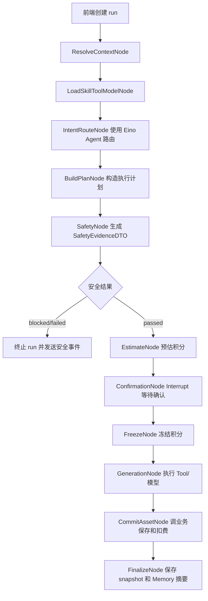
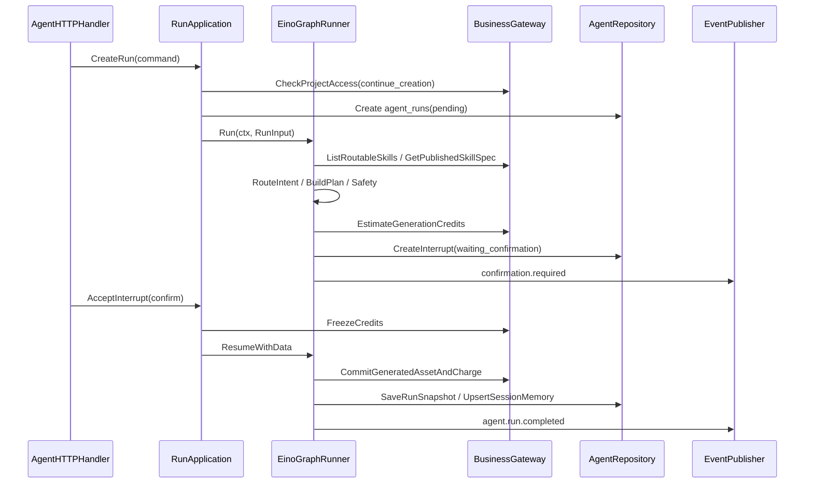

# 02-Eino模块选型与统一Agent运行时设计

状态：production-design-ready
owner：Go Eino 智能体微服务架构工程师
更新时间：2026-06-27
适用范围：Eino Agent、Graph、Workflow、Tool、Skill、Retriever、Memory、Callback、Interrupt/Resume、TurnLoop
相关代码路径：`services/agent/internal/runtime/**`
相关契约：`docs/architecture/01-Eino能力选型与TurnLoop设计.md`、`docs/standards/Eino智能体微服务编码规范.md`
官方参考：`https://github.com/cloudwego/eino`、`https://pkg.go.dev/github.com/cloudwego/eino/compose`、`https://pkg.go.dev/github.com/cloudwego/eino/components/tool`

## 文档目标

- 明确统一 Agent Runtime 使用哪些 Eino 模块。
- 定义每个 Eino 模块在产品流程中的职责。
- 禁止编写未经验证的 Eino API 调用，详细实现前必须检查依赖版本和官方示例。
- 明确不使用多 Agent 体系。

## 选型结论

生产级实现只有一个统一 Agent Runtime。开放式理解和路由使用 Eino Agent；确定性主链路使用 Graph 和 Workflow；业务能力和模型调用统一封装为 Tool；Skill 作为可配置能力规格；Retriever 读取 Skill、历史摘要、资产引用和字典；Memory 启用 session summary，并在 Skill `memory_policy` 允许且用户/空间授权有效时启用授权偏好摘要；Callback 统一生产内部事件和观测数据；Interrupt/Resume 处理确认；TurnLoop 负责多轮状态推进。

## 依赖版本和官方 API 边界

| 依赖 | 用途 | 版本要求 | 生产实现约束 |
| --- | --- | --- | --- |
| `github.com/cloudwego/eino` | ADK、compose、callback、tool 基础接口 | `go.mod` 首次落地时固定明确版本；Graph Interrupt/Resume 需使用支持 `ResumeWithData` 的版本线 | 不在业务代码里封装未验证 API；所有 Eino 调用集中在 `runtime/eino`。 |
| `github.com/cloudwego/eino-ext` | 官方扩展组件，可选 | 仅在确有官方 provider/tool 适配时引入 | 不把 ext 组件暴露到 application/domain 层。 |
| `github.com/cloudwego/kitex` | 业务 RPC client | 与业务服务一致 | 只在 `infra/rpc` 中出现。 |

官方 API 采用以下基线：

- Graph / Workflow 使用 `github.com/cloudwego/eino/compose`，主流程按 `compose.NewGraph`、`AddLambdaNode`、`AddChatModelNode`、`AddEdge`、`Compile` 的组合方式实现。
- Graph 外部取消使用 `compose.WithGraphInterrupt`；人工确认类恢复使用 `compose.ResumeWithData` 或当前固定版本提供的等价 Resume API。
- Tool 使用 `github.com/cloudwego/eino/components/tool` 接口；普通业务 RPC Tool 使用 `InvokableTool`，媒体生成类 Tool 使用 `EnhancedInvokableTool` 或项目自定义 adapter 再映射为 Tool 输出。
- Tool 构造优先使用 `github.com/cloudwego/eino/components/tool/utils` 的 `InferTool` 或 `NewTool`，复杂多媒体输出使用官方 enhanced tool 构造能力。
- Callback 用于模型、Tool、Graph 生命周期观测，不直接把 Graph node 名称暴露给前端。

生产落地前必须创建 `go.mod` 并执行一次依赖确认记录：`go list -m all | rg "cloudwego/eino|cloudwego/kitex"`。当前本机环境没有 `go` 命令时，验收报告记录“未执行：本机缺少 Go runtime”，不能把依赖版本确认标记为通过。

## Eino 模块大纲

| Eino 能力 | 生产级用途 | 详细设计关注点 |
| --- | --- | --- |
| Agent | 意图识别、Skill 路由、文本兜底、多工具决策 | 输入上下文、输出路由结果、错误分类 |
| Graph | 工作台主链路节点编排 | 节点输入输出、分支条件、节点事件 |
| Workflow | 安全评估、积分闭环、资产保存结算等确定性流程 | 步骤顺序、补偿、状态持久化 |
| Tool | 模型调用、业务 RPC、资产保存、文件处理 | DTO、超时、重试、幂等、脱敏 |
| Skill | 配置化创作能力 | Skill spec、输出元素结构、测试样例 |
| Retriever | Skill、历史、资产引用、平台字典检索 | 分页、权限、来源标注 |
| Memory | 会话摘要、授权偏好 | 作用域、保留、隐私边界 |
| Callback | 模型、Tool、Graph、事件、错误观测 | 日志字段、指标、事件转换 |
| Interrupt/Resume | 扣费、高风险、业务写入、补充输入 | 中断 payload、恢复校验、幂等 |
| TurnLoop | 多轮执行、长任务、恢复和取消 | 状态机、事件、DB 持久化 |

## 主 Graph 节点

| 节点 | 输入 | 输出 | Eino 能力 | 失败处理 |
| --- | --- | --- | --- | --- |
| `ResolveContextNode` | `RunInput` | `RunContext` | Workflow | 权限失败直接终止。 |
| `LoadSkillToolModelNode` | `RunContext` | `RuntimeContext` | Retriever / RPC Tool | Tool 或模型缺失返回用户可理解错误。 |
| `IntentRouteNode` | `RuntimeContext`、用户消息 | `RouteDecision` | Agent | 无 Skill 时进入文本兜底。 |
| `BuildPlanNode` | `RouteDecision` | `ExecutionPlan` | Agent / Skill | 输出元素缺失进入补充输入。 |
| `SafetyNode` | `ExecutionPlan` | `SafetyEvidence` | Workflow / Tool | blocked/failed/timeout 均阻断。 |
| `EstimateNode` | `ExecutionPlan`、`SafetyEvidence` | `CreditEstimate` | RPC Tool | 积分不足进入失败终态。 |
| `ConfirmationNode` | `CreditEstimate` | `Interrupt` | Interrupt | 等待用户确认或拒绝。 |
| `FreezeNode` | `InterruptAccepted` | `FreezeResult` | RPC Tool | 冻结失败不执行生成。 |
| `GenerationNode` | `ExecutionPlan`、`FreezeResult` | `TaskResult` | Tool | 失败/取消进入释放流程。 |
| `CommitAssetNode` | `TaskResult`、`SafetyEvidence` | `AssetCommitResult` | RPC Tool | 保存失败释放对应积分。 |
| `FinalizeNode` | `AssetCommitResult` | `RunCompleted` | Workflow / Callback | 写快照和完成事件。 |

## 运行时函数

```go
// BuildUnifiedAgentGraph 根据配置版本创建统一 Agent 主流程。
func BuildUnifiedAgentGraph(cfg RuntimeConfig, deps RuntimeDependencies) (GraphRunner, error)

// RouteIntent 使用文本模型和 Skill 池决定执行 Skill、直接 Tool 或文本兜底。
func RouteIntent(ctx context.Context, input RouteIntentInput) (RouteDecision, error)

// ExecuteWorkflowStep 执行安全、积分、资产保存等确定性节点。
func ExecuteWorkflowStep(ctx context.Context, step WorkflowStep, state RunState) (RunState, error)

// EmitRuntimeCallback 将 Eino 节点、模型和 Tool 生命周期转换为内部事件。
func EmitRuntimeCallback(ctx context.Context, event RuntimeCallbackEvent) error
```

## 业务流程图



## 代码逻辑图



## 不使用能力

| 能力 | 生产级结论 | 原因 |
| --- | --- | --- |
| Multi-Agent | 不使用 | 产品要求一个统一 Agent，角色 owner 只是职责边界。 |
| 用户自定义 Tool | 不使用 | 生产级实现只允许平台开放 Tool。 |
| 未授权长期用户 Memory | 不使用 | Memory 只能写脱敏摘要；`user_preference`、`space_preference` 必须同时满足 Skill `memory_policy` 和 Agent 侧授权状态。 |
| 任意 HTTP Tool | 不使用 | 不满足平台 Tool 白名单和风险管控。 |

## Callback 输出

| Callback | 输出事件 | 日志字段 |
| --- | --- | --- |
| ModelCallback | `agent.thinking.*`、`agent.message.*` | `trace_id`、`run_id`、`model_ref`、`latency_ms`、`error_code` |
| ToolCallback | `tool.call.*` | `tool_call_id`、`tool_name`、`risk_level`、`latency_ms` |
| GraphCallback | 内部 `graph.node.*`，默认不直接暴露给前端 | `node_name`、`duration_ms`、`run_id` |
| EventCallback | `agent_events` 写入结果 | `event_id`、`sequence`、`publish_status` |
| ErrorCallback | `agent.run.failed` 或可恢复错误 | `error_type`、`error_code`、`retryable` |

## 业务开发对齐点

- Tool 中业务写操作必须走 RPC。
- 业务 RPC Tool 是否需要 preview / confirm。
- 业务错误码如何映射到 Tool 错误和 AG-UI 错误。

## 【业务开发】需要提供的能力与参数

| Eino 模块 | 业务能力 | 参数 |
| --- | --- | --- |
| Retriever | Skill、资产、字典分页查询 | `auth_context`、`page_size=10`、`cursor`、过滤条件。 |
| Tool | 业务 RPC Tool 执行策略 | `tool_name`、`tool_type`、`risk_context`、`timeout_ms`、`retry_policy`、`requires_confirmation`。 |
| Workflow | 积分和资产写入确定性步骤 | `estimate_id`、`freeze_id`、`asset_artifacts[]`、`safety_evidence`、`idempotency_key`。 |
| Interrupt/Resume | preview / confirm 业务写入能力 | `preview_payload`、`confirmation_payload_digest`、`confirm_idempotency_key`。 |
| Callback | 业务 RPC 可观测字段 | `trace_id`、`rpc_method`、`latency_ms`、`error_code`、`audit_ref`。 |
