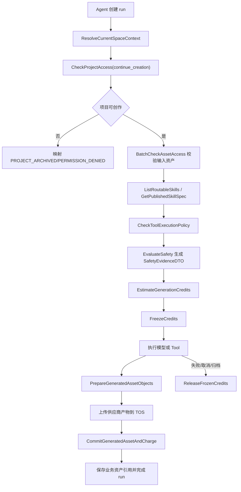
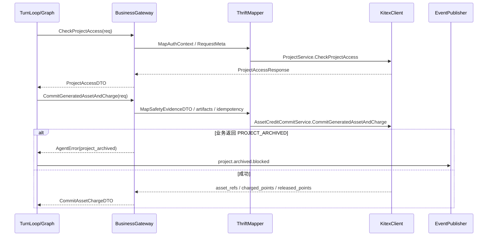

# 07-RPC客户端业务能力调用与DTO映射设计

状态：production-design-ready
owner：Go Eino 智能体微服务架构工程师
更新时间：2026-06-27
适用范围：智能体微服务调用业务微服务的 RPC client、DTO 映射、错误码、超时、重试、幂等、权限上下文
相关代码路径：`services/agent/internal/infra/rpc/**`、`api/thrift/**`
相关设计契约：`docs/standards/RPC契约规范.md`、`code-plan/business/15-生产级闭眼开发门禁与Agent对齐验收设计.md`
后续实现落点：`api/thrift/business_agent_service.thrift`

## 文档目标

- 定义 Agent 侧 RPC client 的服务清单。
- 明确每个 RPC 的调用时机、请求 DTO、响应 DTO 和错误映射。
- 确认写操作幂等键、权限上下文、超时和重试策略。
- 保证 RPC 方法表达业务能力，不表达数据库表 CRUD。

## RPC 能力范围

- AccountSpaceService
- ProjectService
- SkillCatalogService
- ToolCapabilityService
- ModelConfigService
- CreditService
- AssetCreditCommitService
- AssetService
- PlatformDictionaryService
- ContentSafetyConfigService
- Audit 或 trace 相关能力

## 里程碑实现拆分

Agent 07 是完整 RPC client 设计事实源，不代表所有 RPC 都在 M2 实现。按根 `code-plan/README.md` 的全局里程碑拆分如下：

| 全局阶段 | Agent 07 实现范围 | 说明 |
| --- | --- | --- |
| M2 身份项目能力 | `AccountSpaceService.ResolveCurrentSpaceContext`、`ProjectService.CheckProjectAccess` 的 `view` 与 `continue_creation` 用法 | 用于 session/run 创建、追加输入、interrupt accept/reject、cancel 前权限确认和 snapshot 只读判断；Agent 必须同时检查 RPC error 与正常响应中的 `allowed`、`creative_allowed`。 |
| M3 配置能力 | `SkillCatalogService`、`ToolCapabilityService`、`ModelConfigService`、`PlatformDictionaryService.ListAssetElementTypes` | 用于 Published Skill 路由、Tool 策略、模型选择和元素类型字典；M2 不把这些 RPC 标记为完成。 |
| M4 积分资产闭环 | `CreditService`、`AssetService`、`AssetCreditCommitService`、`ProjectService.CheckProjectAccess` 的 `attach_asset`、`commit_asset`、`create_work` 用法 | 用于预估、冻结、扣费、释放、上传槽、资产保存和创作结果提交；M2 不把这些 RPC 标记为完成。 |

## 方法级设计必须覆盖

| RPC 方法 | 调用时机 | 请求参数 | 响应参数 | 超时 / 重试 / 幂等 | 错误映射 |
| --- | --- | --- | --- | --- | --- |
| `AccountSpaceService.ResolveCurrentSpaceContext` | 创建 session/run 前 | `auth_context`、`request_meta`、`expected_space_id` 可选 | `space_id`、`space_type`、`enterprise_id`、`enterprise_role`、`credit_account_scope`、`credit_account_id`、`skill_scope_keys[]` | 2s；可重试 1 次；读无幂等键 | `UNAUTHENTICATED`、`PERMISSION_DENIED`、`CROSS_SPACE_DENIED` |
| `ProjectService.CheckProjectAccess` | 创建 session/run、resume、confirm、asset commit 前；snapshot 时 | `auth_context`、`project_id`、`access_purpose`、`request_meta` | `allowed`、`project_status`、`creative_allowed`、`allowed_actions[]`、`project_summary` | 2s；可重试 1 次；读无幂等键 | `PROJECT_ARCHIVED`、`PROJECT_NOT_FOUND`、`PERMISSION_DENIED` |
| `SkillCatalogService.ListRoutableSkills` | Skill 路由前 | `auth_context`、`request_meta`、`skill_scope_filter`、`page_size=10`、`cursor` | `skills[]`、`next_cursor`，只返回 Published | 3s；可重试 1 次；分页 | `PERMISSION_DENIED`、`STATE_CONFLICT` |
| `SkillCatalogService.GetPublishedSkillSpec` | 选中 Skill 后执行前 | `auth_context`、`request_meta`、`skill_id`、`version` | `skill_spec_json`、`output_schema_json`、`tool_refs[]`、`memory_policy_json`、`confirmation_policy_json`、`execution_policy_summary_json` | 3s；可重试 1 次 | `RESOURCE_NOT_FOUND`、`STATE_CONFLICT` |
| `ToolCapabilityService.CheckToolExecutionPolicy` | Tool 执行前 | `auth_context`、`request_meta`、`tool_name`、`tool_type`、`project_id`、`risk_context` | `allowed`、`risk_level`、`requires_confirmation`、`timeout_ms`、`retry_policy`、`cancel_policy` | 2s；可重试 1 次 | `PERMISSION_DENIED`、`STATE_CONFLICT` |
| `ModelConfigService.ListAvailableGenerationModels` | 模型选择控件展示前 | `auth_context`、`request_meta`、`resource_type`、`page_size=10`、`cursor` | `models[]`，含 `model_id`、`display_name`、`is_default`、`pricing_snapshot_id`、`resource_type`；`next_cursor` | 3s；可重试 1 次 | `RESOURCE_NOT_FOUND` |
| `ModelConfigService.ResolveDefaultModel` | 用户未选择模型时 | `auth_context`、`request_meta`、`resource_type` | `model_id`、`display_name`、`is_default`、`pricing_snapshot_id`、`resource_type` | 2s；可重试 1 次 | `STATE_CONFLICT` |
| `ModelConfigService.ResolveGenerationModelSnapshot` | 确认前锁定模型运行参数、执行生成 Tool 前二次解析 | `auth_context`、`request_meta`、`resource_type`、`model_id`、`pricing_snapshot_id` | `model_snapshot`，含非敏感供应商运行引用、超时、重试和公开展示名 | 2s；可重试 1 次；读无幂等键 | `RESOURCE_UNAVAILABLE`、`STATE_CONFLICT` |
| `CreditService.EstimateGenerationCredits` | 安全通过后、确认前 | `auth_context`、`request_meta`、`project_id`、`resource_type`、`model_id`、`pricing_snapshot_id`、`quantity`、`duration_seconds`、`tool_usage_items[]`、`safety_evidence` | `estimate_id`、`estimate_points`、`available_points`、`expires_soon_points`、`credit_account_scope`、`credit_account_id`、`line_items[]`、`expires_at`、`insufficient` | 3s；可重试 1 次；读无幂等键 | `CREDIT_INSUFFICIENT`、`SAFETY_EVIDENCE_INVALID`、`STATE_CONFLICT` |
| `CreditService.EstimateToolCredits` | 纯 Tool 或不产生资产的 Tool 执行确认前 | `auth_context`、`request_meta`、`project_id`、`tool_usage_items[]`、`safety_evidence` | `estimate_id`、`estimate_points`、`available_points`、`expires_soon_points`、`credit_account_scope`、`credit_account_id`、`line_items[]`、`expires_at`、`insufficient` | 3s；可重试 1 次；读无幂等键 | `CREDIT_INSUFFICIENT`、`TOOL_PRICING_POLICY_MISSING`、`SAFETY_EVIDENCE_INVALID` |
| `CreditService.FreezeCredits` | 用户确认后、生成或 Tool 执行前 | `auth_context`、`request_meta`、`estimate_id`、`points`、`run_id`、`confirmation_id`、`account_id` | `freeze_id`、`frozen_points`、`expires_at` | 5s；仅幂等键可重试；写必填幂等键 | `CREDIT_INSUFFICIENT`、`IDEMPOTENCY_CONFLICT` |
| `CreditService.ChargeToolUsageCredits` | 独立扣费 Tool 成功后 | `auth_context`、`request_meta`、`project_id`、`estimate_id`、`freeze_id`、`session_id`、`run_id`、`charge_items[]` | `tool_charge_id`、`charged_points`、`released_points`、`freeze_status`、`ledger_entry_ids[]`、`charged_line_items[]` | 5s；幂等可重试；写必填幂等键 | `CREDIT_ESTIMATE_EXCEEDED`、`STATE_CONFLICT`、`IDEMPOTENCY_CONFLICT` |
| `CreditService.ReleaseFrozenCredits` | 失败、取消、保存失败、归档阻断 | `auth_context`、`request_meta`、`freeze_id`、`release_points`、`reason`、`run_id` | `released_points`、`release_status` | 5s；幂等可重试；写必填幂等键 | `STATE_CONFLICT`、`IDEMPOTENCY_CONFLICT` |
| `AssetService.BatchCheckAssetAccess` | run 输入引用资产、会话恢复展示、黑板引用资产前 | `auth_context`、`request_meta`、`project_id`、`asset_ids[]`、`purpose` | `results[]`，含 `asset_id`、`allowed`、`reason`、`asset_summary` | 3s；可重试 1 次；批量，不逐条 RPC | `CROSS_SPACE_DENIED`、`PERMISSION_DENIED` |
| `AssetService.PrepareGeneratedAssetObjects` | 模型供应商产物已完成、Agent 准备把文件落到 TOS 前 | `auth_context`、`request_meta`、`project_id`、`session_id`、`run_id`、`artifacts[]`，含文件名、MIME、大小、checksum 可选 | `upload_slots[]`，含 `artifact_id`、`object_key`、`upload_url`、`upload_headers`、`expires_at`、`max_size_bytes` | 5s；幂等可重试；写必填幂等键 | `PROJECT_ARCHIVED`、`ASSET_OBJECT_PREPARE_FAILED`、`IDEMPOTENCY_CONFLICT` |
| `AssetCreditCommitService.CommitGeneratedAssetAndCharge` | Agent 已把供应商产物上传到业务签发的 TOS object key 后 | `auth_context`、`request_meta`、`project_id`、`session_id`、`run_id`、`freeze_id`、`artifacts[]`、`final_elements[]`、`safety_evidence`、`estimate_id` 可选 | `asset_refs[]`、`charged_points`、`released_points`、`commit_status`、`ledger_ref`、`charged_line_items[]` | 10s；幂等可重试；写必填幂等键；业务侧事务闭环 | `SAFETY_EVIDENCE_INVALID`、`PROJECT_ARCHIVED`、`IDEMPOTENCY_CONFLICT`、`ASSET_SAVE_FAILED` |
| `SkillCatalogService.GetReviewCandidateSkillSpec` | Skill 测试运行前 | `auth_context`、`request_meta`、`skill_id`、`version_id`、`test_case_id`、`test_run_id` | `skill_id`、`version_id`、`skill_spec_json`、`input_schema_json`、`output_schema_json`、`tool_refs[]`、`memory_policy_json`、`test_input_json`、`expected_elements_json` | 3s；可重试 1 次 | `RESOURCE_NOT_FOUND`、`PERMISSION_DENIED` |
| `SkillCatalogService.SaveSkillTestResult` | Skill 测试执行完成后 | `auth_context`、`request_meta`、`skill_id`、`version_id`、`test_run_id`、`test_case_id`、`status`、`actual_elements_json`、`error_code`、`error_summary`、`safety_evidence_json`、`agent_trace_id` | `test_run_id`、`status`、`saved` | 5s；幂等可重试；写必填幂等键 | `IDEMPOTENCY_CONFLICT`、`STATE_CONFLICT` |
| `PlatformDictionaryService.ListAssetElementTypes` | Skill 输出元素校验、黑板渲染前 | `auth_context`、`request_meta`、`page_size=50`、`schema_version` | `element_types[]`，结构化 `AssetElementTypeDTO`、`schema_version` | 3s；可重试 1 次；可缓存 | `STATE_CONFLICT` |

## Thrift IDL 字段基线

正式 IDL 落点：`api/thrift/business_agent_service.thrift`。字段编号只增不改，删除字段必须保留编号并标记 deprecated。

```thrift
namespace go dora.api.businessagent

enum LoginIdentityType {
  PERSONAL = 1,
  ENTERPRISE_MEMBER = 2,
  ADMIN = 3,
}

enum ProjectAccessPurpose {
  VIEW = 1,
  CONTINUE_CREATION = 2,
  ATTACH_ASSET = 3,
  COMMIT_ASSET = 4,
  CREATE_WORK = 5,
}

struct AuthContext {
  1: required string actor_user_id,
  2: required LoginIdentityType login_identity_type,
  3: optional string space_id,
  4: optional string enterprise_id,
  5: optional string enterprise_role,
  6: optional string admin_id,
}

struct RequestMeta {
  1: required string request_id,
  2: required string trace_id,
  3: optional string idempotency_key,
  4: required string source,
}

struct SafetyEvidenceDTO {
  1: required string safety_evidence_id,
  2: required string scene,
  3: required string result,
  4: required string target_type,
  5: optional string target_ref_id,
  6: required string evaluated_object_digest,
  7: required string policy_version,
  8: required string evidence_version,
  9: required string evaluated_at,
  10: optional string expires_at,
  11: optional string source_session_id,
  12: optional string source_run_id,
  13: optional string source_artifact_id,
  14: required string trace_id,
  15: optional string user_visible_reason,
}

struct CheckProjectAccessRequest {
  1: required AuthContext auth_context,
  2: required RequestMeta request_meta,
  3: required string project_id,
  4: required ProjectAccessPurpose access_purpose,
}

struct ProjectAccessResponse {
  1: required bool allowed,
  2: required string project_status,
  3: required bool creative_allowed,
  4: required list<string> allowed_actions,
  5: optional string user_message,
  6: optional map<string,string> project_summary,
}

struct BatchCheckAssetAccessRequest {
  1: required AuthContext auth_context,
  2: required RequestMeta request_meta,
  3: required string project_id,
  4: required list<string> asset_ids,
  5: required string purpose,
}

struct AssetAccessResult {
  1: required string asset_id,
  2: required bool allowed,
  3: required string reason,
  4: optional map<string,string> asset_summary,
}

struct BatchCheckAssetAccessResponse {
  1: required list<AssetAccessResult> results,
}

struct EstimateGenerationCreditsRequest {
  1: required AuthContext auth_context,
  2: required RequestMeta request_meta,
  3: required string project_id,
  4: required string resource_type,
  5: required string model_id,
  6: required string pricing_snapshot_id,
  7: optional i32 quantity,
  8: optional i32 duration_seconds,
  9: optional list<ToolUsageEstimateItemInput> tool_usage_items,
  10: required SafetyEvidenceDTO safety_evidence,
}

struct EstimateGenerationCreditsResponse {
  1: required string estimate_id,
  2: required i64 estimate_points,
  3: required i64 available_points,
  4: required i64 expires_soon_points,
  5: required string credit_account_scope,
  6: optional list<CreditEstimateLineItemDTO> line_items,
  7: optional string expires_at,
  8: optional bool insufficient,
  9: optional string credit_account_id,
}

struct ToolUsageEstimateItemInput {
  1: required string tool_name,
  2: required string tool_type,
  3: required string billing_unit,
  4: required double quantity,
  5: optional map<string,string> metadata_summary,
}

struct CreditEstimateLineItemDTO {
  1: required string estimate_item_id,
  2: required string item_type,
  3: optional string tool_name,
  4: optional string tool_type,
  5: optional string pricing_policy_id,
  6: optional string model_id,
  7: optional string resource_type,
  8: optional string billing_unit,
  9: optional double quantity,
  10: optional double unit_points,
  11: required i64 estimate_points,
  12: optional string free_reason,
  13: optional map<string,string> metadata_summary,
}

struct EstimateToolCreditsRequest {
  1: required AuthContext auth_context,
  2: required RequestMeta request_meta,
  3: required string project_id,
  4: required list<ToolUsageEstimateItemInput> tool_usage_items,
  5: required SafetyEvidenceDTO safety_evidence,
}

struct EstimateToolCreditsResponse {
  1: required string estimate_id,
  2: required i64 estimate_points,
  3: required i64 available_points,
  4: required i64 expires_soon_points,
  5: required string credit_account_scope,
  6: required list<CreditEstimateLineItemDTO> line_items,
  7: required string expires_at,
  8: required bool insufficient,
  9: optional string credit_account_id,
}

struct GeneratedAssetObjectInput {
  1: required string artifact_id,
  2: required string resource_type,
  3: required string filename,
  4: required string content_type,
  5: required i64 size_bytes,
  6: optional string checksum,
  7: optional map<string,string> metadata_summary,
}

struct GeneratedAssetUploadSlot {
  1: required string artifact_id,
  2: required string bucket,
  3: required string object_key,
  4: required string upload_url,
  5: required map<string,string> upload_headers,
  6: required string expires_at,
  7: required i64 max_size_bytes,
}

struct PrepareGeneratedAssetObjectsRequest {
  1: required AuthContext auth_context,
  2: required RequestMeta request_meta,
  3: required string project_id,
  4: required string session_id,
  5: required string run_id,
  6: required list<GeneratedAssetObjectInput> artifacts,
}

struct PrepareGeneratedAssetObjectsResponse {
  1: required list<GeneratedAssetUploadSlot> upload_slots,
}

struct GeneratedStorageObjectRef {
  1: required string object_key,
  2: required string bucket,
  3: required string content_type,
  4: required i64 size_bytes,
  5: required string checksum,
  6: optional string etag,
}

struct GeneratedAssetElementInput {
  1: required string element_type,
  2: required string element_payload_json,
  3: required i32 display_order,
  4: optional string source_tool_call_id,
}

struct CommittedAssetRefDTO {
  1: required string asset_id,
  2: required string source_artifact_id,
  3: required string resource_type,
  4: required string asset_type,
  5: required string status,
  6: optional string preview_url,
  7: optional string elements_summary_json,
}

struct CommitArtifactDTO {
  1: required string artifact_id,
  2: required string resource_type,
  3: required string element_type,
  4: required map<string,string> artifact_summary,
  5: optional string content_uri_digest,
  6: optional string estimate_item_id,
  7: optional string tool_name,
  8: optional string tool_type,
  9: optional i64 charge_quantity,
  10: optional map<string,string> metadata_summary,
  11: required GeneratedStorageObjectRef storage_object_ref,
}

struct CommitGeneratedAssetAndChargeRequest {
  1: required AuthContext auth_context,
  2: required RequestMeta request_meta,
  3: required string project_id,
  4: required string session_id,
  5: required string run_id,
  6: required string freeze_id,
  7: required list<CommitArtifactDTO> artifacts,
  8: required list<GeneratedAssetElementInput> final_elements,
  9: required SafetyEvidenceDTO safety_evidence,
  10: optional string estimate_id,
}

struct CommitGeneratedAssetAndChargeResponse {
  1: required list<CommittedAssetRefDTO> asset_refs,
  2: required i64 charged_points,
  3: required i64 released_points,
  4: required string commit_status,
  5: optional string ledger_ref,
  6: optional list<ChargedLineItemDTO> charged_line_items,
}

struct FreezeCreditsRequest {
  1: required AuthContext auth_context,
  2: required RequestMeta request_meta,
  3: required string estimate_id,
  4: required i64 points,
  5: required string run_id,
  6: optional string confirmation_id,
  7: optional string account_id,
}

struct FreezeCreditsResponse {
  1: required string freeze_id,
  2: required i64 frozen_points,
  3: required string expires_at,
}

struct ReleaseFrozenCreditsRequest {
  1: required AuthContext auth_context,
  2: required RequestMeta request_meta,
  3: required string freeze_id,
  4: required i64 release_points,
  5: required string reason,
  6: required string run_id,
}

struct ReleaseFrozenCreditsResponse {
  1: required i64 released_points,
  2: required string release_status,
}

struct ToolChargeItemInput {
  1: required string estimate_item_id,
  2: required string tool_call_id,
  3: required string tool_name,
  4: required string tool_type,
  5: required string billing_unit,
  6: required double actual_quantity,
  7: required string execution_status,
  8: optional map<string,string> metadata_summary,
}

struct ChargedLineItemDTO {
  1: required string estimate_item_id,
  2: required i64 charged_points,
  3: required string status,
  4: optional string asset_id,
  5: optional string tool_call_id,
  6: optional string artifact_id,
}

struct ChargeToolUsageCreditsRequest {
  1: required AuthContext auth_context,
  2: required RequestMeta request_meta,
  3: required string project_id,
  4: required string estimate_id,
  5: required string freeze_id,
  6: required string session_id,
  7: required string run_id,
  8: required list<ToolChargeItemInput> charge_items,
}

struct ChargeToolUsageCreditsResponse {
  1: required string tool_charge_id,
  2: required i64 charged_points,
  3: required i64 released_points,
  4: required string freeze_status,
  5: required list<string> ledger_entry_ids,
  6: required list<ChargedLineItemDTO> charged_line_items,
}

struct ListRoutableSkillsRequest {
  1: required AuthContext auth_context,
  2: required RequestMeta request_meta,
  3: optional string skill_scope_filter,
  4: optional i32 page_size,
  5: optional string cursor,
}

struct SkillSummaryDTO {
  1: required string skill_id,
  2: required string skill_name,
  3: required string skill_scope,
  4: required string version,
  5: required string status,
  6: optional map<string,string> route_hints,
}

struct ListRoutableSkillsResponse {
  1: required list<SkillSummaryDTO> skills,
  2: optional string next_cursor,
}

struct GetPublishedSkillSpecRequest {
  1: required AuthContext auth_context,
  2: required RequestMeta request_meta,
  3: required string skill_id,
  4: optional string version,
}

struct SkillSpecResponse {
  1: required string skill_id,
  2: required string version,
  3: required string skill_spec_json,
  4: required string output_schema_json,
  5: required list<string> tool_refs,
  6: optional string memory_policy_json,
  7: required string confirmation_policy_json,
  8: required string execution_policy_summary_json,
}

struct CheckToolExecutionPolicyRequest {
  1: required AuthContext auth_context,
  2: required RequestMeta request_meta,
  3: required string tool_name,
  4: required string tool_type,
  5: required string project_id,
  6: optional map<string,string> risk_context,
}

struct ToolExecutionPolicyResponse {
  1: required bool allowed,
  2: required string risk_level,
  3: required bool requires_confirmation,
  4: required i32 timeout_ms,
  5: optional map<string,string> retry_policy,
  6: optional map<string,string> cancel_policy,
}

struct ListAvailableGenerationModelsRequest {
  1: required AuthContext auth_context,
  2: required RequestMeta request_meta,
  3: required string resource_type,
  4: optional i32 page_size,
  5: optional string cursor,
}

struct ModelSummaryDTO {
  1: required string model_id,
  2: required string display_name,
  3: required bool is_default,
  4: required string pricing_snapshot_id,
  5: required string resource_type,
}

struct ListAvailableGenerationModelsResponse {
  1: required list<ModelSummaryDTO> models,
  2: optional string next_cursor,
}

struct ResolveDefaultModelRequest {
  1: required AuthContext auth_context,
  2: required RequestMeta request_meta,
  3: required string resource_type,
}

struct ResolveGenerationModelSnapshotRequest {
  1: required AuthContext auth_context,
  2: required RequestMeta request_meta,
  3: required string resource_type,
  4: required string model_id,
  5: required string pricing_snapshot_id,
}

struct RetryPolicyDTO {
  1: required i32 max_attempts,
  2: required i32 initial_backoff_ms,
  3: required i32 max_backoff_ms,
}

struct ModelRuntimeSnapshotDTO {
  1: required string model_id,
  2: required string resource_type,
  3: required string provider_ref,
  4: required string public_display_name,
  5: required string pricing_snapshot_id,
  6: required i32 timeout_ms,
  7: required RetryPolicyDTO retry_policy,
  8: optional map<string,string> runtime_params,
}

struct ListAssetElementTypesRequest {
  1: required AuthContext auth_context,
  2: required RequestMeta request_meta,
  3: optional i32 page_size,
  4: optional string schema_version,
}

struct AssetElementTypeDTO {
  1: required string element_type,
  2: required string display_name,
  3: required string resource_type,
  4: required string status,
  5: required string schema_hint_json,
  6: required i32 sort_order,
  7: required string usage_stage,
  8: required bool draft_enabled,
  9: required bool final_enabled,
  10: required bool editable,
  11: required bool referable,
  12: optional string render_hint,
}

struct ListAssetElementTypesResponse {
  1: required list<AssetElementTypeDTO> element_types,
  2: required string schema_version,
}

struct GetReviewCandidateSkillSpecRequest {
  1: required AuthContext auth_context,
  2: required RequestMeta request_meta,
  3: required string skill_id,
  4: required string version_id,
  5: optional string test_case_id,
  6: optional string test_run_id,
}

struct ReviewCandidateSkillSpecResponse {
  1: required string skill_id,
  2: required string version_id,
  3: required string skill_spec_json,
  4: required string input_schema_json,
  5: required string output_schema_json,
  6: required list<string> tool_refs,
  7: required string memory_policy_json,
  8: optional string test_input_json,
  9: optional string expected_elements_json,
  10: required string confirmation_policy_json,
}

struct SaveSkillTestResultRequest {
  1: required AuthContext auth_context,
  2: required RequestMeta request_meta,
  3: required string skill_id,
  4: required string version_id,
  5: required string test_run_id,
  6: optional string test_case_id,
  7: required string status,
  8: required string actual_elements_json,
  9: optional string error_code,
  10: optional string error_summary,
  11: optional string safety_evidence_json,
  12: required string agent_trace_id,
}

struct SaveSkillTestResultResponse {
  1: required string test_run_id,
  2: required string status,
  3: required bool saved,
}

service ProjectService {
  ProjectAccessResponse CheckProjectAccess(1: CheckProjectAccessRequest req)
}

service AssetService {
  BatchCheckAssetAccessResponse BatchCheckAssetAccess(1: BatchCheckAssetAccessRequest req)
  PrepareGeneratedAssetObjectsResponse PrepareGeneratedAssetObjects(1: PrepareGeneratedAssetObjectsRequest req)
}

service CreditService {
  EstimateGenerationCreditsResponse EstimateGenerationCredits(1: EstimateGenerationCreditsRequest req)
  EstimateToolCreditsResponse EstimateToolCredits(1: EstimateToolCreditsRequest req)
  FreezeCreditsResponse FreezeCredits(1: FreezeCreditsRequest req)
  ChargeToolUsageCreditsResponse ChargeToolUsageCredits(1: ChargeToolUsageCreditsRequest req)
  ReleaseFrozenCreditsResponse ReleaseFrozenCredits(1: ReleaseFrozenCreditsRequest req)
}

service AssetCreditCommitService {
  CommitGeneratedAssetAndChargeResponse CommitGeneratedAssetAndCharge(1: CommitGeneratedAssetAndChargeRequest req)
}

service SkillCatalogService {
  ListRoutableSkillsResponse ListRoutableSkills(1: ListRoutableSkillsRequest req)
  SkillSpecResponse GetPublishedSkillSpec(1: GetPublishedSkillSpecRequest req)
  ReviewCandidateSkillSpecResponse GetReviewCandidateSkillSpec(1: GetReviewCandidateSkillSpecRequest req)
  SaveSkillTestResultResponse SaveSkillTestResult(1: SaveSkillTestResultRequest req)
}

service ToolCapabilityService {
  ToolExecutionPolicyResponse CheckToolExecutionPolicy(1: CheckToolExecutionPolicyRequest req)
}

service ModelConfigService {
  ListAvailableGenerationModelsResponse ListAvailableGenerationModels(1: ListAvailableGenerationModelsRequest req)
  ModelSummaryDTO ResolveDefaultModel(1: ResolveDefaultModelRequest req)
  ModelRuntimeSnapshotDTO ResolveGenerationModelSnapshot(1: ResolveGenerationModelSnapshotRequest req)
}

service PlatformDictionaryService {
  ListAssetElementTypesResponse ListAssetElementTypes(1: ListAssetElementTypesRequest req)
}
```

写方法必须包含 `RequestMeta.idempotency_key`，contract test 必须覆盖同 key 同 hash、同 key 不同 hash 两类。

## RPC client package 设计

```text
services/agent/internal/infra/rpc/
  client.go
  context_mapper.go
  error_mapper.go
  account_space_client.go
  project_client.go
  skill_catalog_client.go
  tool_capability_client.go
  model_config_client.go
  credit_client.go
  asset_client.go
  dictionary_client.go
```

## 业务流程图



## 代码逻辑图



设计规则：

- application 层只依赖 `BusinessGateway` 接口，不直接依赖 Kitex 生成代码。
- RPC client 方法入参使用 Agent 侧 DTO，client 内部完成 Thrift DTO 映射。
- 所有方法必须接收 `context.Context`，并从 context 贯通 `trace_id`、deadline 和取消信号。
- 读 RPC 允许有限重试，写 RPC 只能在幂等键存在且错误可判定时重试。

```go
// BusinessGateway 汇总 Agent 需要的业务能力，方法表达业务语义而不是表操作。
type BusinessGateway interface {
    ResolveCurrentSpaceContext(ctx context.Context, req ResolveSpaceRequest) (SpaceContextDTO, error)
    CheckProjectAccess(ctx context.Context, req CheckProjectAccessRequest) (ProjectAccessDTO, error)
    BatchCheckAssetAccess(ctx context.Context, req BatchCheckAssetAccessRequest) (BatchAssetAccessDTO, error)
    ListRoutableSkills(ctx context.Context, req ListRoutableSkillsRequest) (Page[SkillSummaryDTO], error)
    GetPublishedSkillSpec(ctx context.Context, req GetPublishedSkillSpecRequest) (PublishedSkillSpecDTO, error)
    GetReviewCandidateSkillSpec(ctx context.Context, req GetReviewCandidateSkillSpecRequest) (ReviewCandidateSkillSpecDTO, error)
    SaveSkillTestResult(ctx context.Context, req SaveSkillTestResultRequest) (SaveSkillTestResultDTO, error)
    CheckToolExecutionPolicy(ctx context.Context, req CheckToolExecutionPolicyRequest) (ToolExecutionPolicyDTO, error)
    ListAvailableGenerationModels(ctx context.Context, req ListGenerationModelsRequest) (Page[ModelSummaryDTO], error)
    ResolveDefaultModel(ctx context.Context, req ResolveDefaultModelRequest) (ModelSummaryDTO, error)
    ResolveGenerationModelSnapshot(ctx context.Context, req ResolveModelSnapshotRequest) (ModelRuntimeSnapshotDTO, error)
    EstimateGenerationCredits(ctx context.Context, req EstimateCreditsRequest) (CreditEstimateDTO, error)
    FreezeCredits(ctx context.Context, req FreezeCreditsRequest) (FrozenCreditDTO, error)
    PrepareGeneratedAssetObjects(ctx context.Context, req PrepareGeneratedAssetObjectsRequest) (GeneratedAssetObjectSlotsDTO, error)
    CommitGeneratedAssetAndCharge(ctx context.Context, req CommitAssetChargeRequest) (CommitAssetChargeDTO, error)
    ReleaseFrozenCredits(ctx context.Context, req ReleaseCreditsRequest) (ReleaseCreditsDTO, error)
    ListAssetElementTypes(ctx context.Context, req ListAssetElementTypesRequest) (AssetElementTypePageDTO, error)
}
```

## 生成产物对象准备闭环

供应商返回的文件 URL、base64 或临时媒体引用不能直接进入 `CommitGeneratedAssetAndCharge`。Agent 必须先把可保存产物落到业务服务签发的 TOS object key，再提交资产保存扣费事务。

```text
PollGenerationTask completed
  -> ExtractProviderArtifact
  -> 校验 MIME、size、checksum、resource_type
  -> PrepareGeneratedAssetObjects(idempotency_key=asset-object-prepare:<run_id>:<artifact_batch_digest>)
  -> Agent 使用返回的短期 upload_url/upload_headers 上传文件
  -> 构造 GeneratedStorageObjectRef
  -> CommitGeneratedAssetAndCharge
```

边界规则：

- object key 只能由业务服务生成，Agent 不能拼接 TOS key。
- Agent 只拿到短期、单对象、单次用途上传授权；不能持有 TOS AK/SK、长期签名 URL 或 bucket 管理权限。
- 上传失败时不得调用 `CommitGeneratedAssetAndCharge`；已冻结积分按失败或部分完成规则释放。
- `PrepareGeneratedAssetObjects` 是写 RPC，必须带幂等键和 request hash；同一批 artifact 重试返回同一批 object key。
- `CommitGeneratedAssetAndCharge` 必须校验 `storage_object_ref.object_key` 属于同一 `project_id/session_id/run_id/artifact_id` 的准备记录，且对象在 TOS 已可验证。

## 字段命名冻结

- 积分账户作用域统一使用 `credit_account_scope`，合法值为 `personal`、`enterprise`。
- 积分账户 ID 使用 `credit_account_id`。Agent 只把它作为业务返回引用或防串账户校验字段，不推断账户归属。
- 不再新增 `credit_account_type`、`account_type` 作为 Agent RPC 字段；历史 fixture 如出现旧字段，contract test 必须映射到 `credit_account_scope` 或判定不兼容。
- `ResolveCurrentSpaceContext` 成功响应只返回 active 用户和 active 企业成员上下文；用户禁用、成员移除或空间不可用通过错误码表达，不通过 `user_status` 正常字段让 Agent 自行判断。

## 幂等键生成规则

- 创建 run：`agent-run:{session_id}:{client_message_id}`。
- confirm interrupt：`agent-confirm:{interrupt_id}:{action}:{payload_digest}`。
- freeze credits：`credit-freeze:{run_id}:{estimate_id}`。
- asset commit：`asset-commit:{run_id}:{artifact_batch_digest}`。
- release credits：`credit-release:{run_id}:{freeze_id}:{reason}:{artifact_batch_digest}`。

## 错误映射

| 业务错误码 | Agent 错误类型 | HTTP / AG-UI 映射 | 重试 |
| --- | --- | --- | --- |
| `UNAUTHENTICATED` | `auth_error` | HTTP 401，SSE 关闭 | 否 |
| `PERMISSION_DENIED` | `permission_error` | HTTP 403，`agent.run.failed` | 否 |
| `CROSS_SPACE_DENIED` | `permission_error` | HTTP 403，资产项不可见 | 否 |
| `PROJECT_ARCHIVED` | `project_archived` | HTTP 409，`project.archived.blocked` | 否 |
| `CREDIT_INSUFFICIENT` | `credit_error` | `credits.insufficient` | 否 |
| `SAFETY_EVIDENCE_INVALID` | `safety_error` | `safety.prompt.blocked` 或 `asset.save.failed` | 否 |
| `ASSET_OBJECT_PREPARE_FAILED` | `asset_prepare_error` | `asset.save.failed`，不进入 commit | 按幂等键可重试 |
| `IDEMPOTENCY_CONFLICT` | `idempotency_error` | HTTP 409，`agent.run.failed` | 否 |
| `UPSTREAM_TIMEOUT` | `upstream_timeout` | `tool.call.failed` 或 `agent.run.failed` | 读可重试，写按幂等键 |
| `RATE_LIMITED` | `rate_limited` | HTTP 429 或 `tool.call.failed` | 可退避 |

## DTO 映射原则

- `AuthContext` 必填 `actor_user_id`、`space_id`、`login_identity_type`；企业空间追加 `enterprise_id` 和 `enterprise_role`。
- `RequestMeta` 必填 `trace_id`、`source=agent_service`；写 RPC 必填 `idempotency_key`。
- 业务响应中的 `user_message` 可以透传给用户；`debug_message`、内部错误堆栈、供应商原始错误不能进入 AG-UI。
- 业务分页参数默认 `page_size=10`，列表类 RPC 必须支持 `cursor` 或等价游标。
- Agent 只保存业务返回的引用和摘要，例如 `asset_id`、`project_status`、`pricing_snapshot_id`，不复制业务主数据。

## Contract test 要求

| 合同点 | 验证 |
| --- | --- |
| 字段兼容 | Thrift IDL 新增字段必须可选或有默认值，旧 Agent fixture 仍可反序列化。 |
| 错误码 | 上表错误码必须有 fixture，且映射为稳定 Agent 错误。 |
| 幂等 | 相同幂等键和相同 request hash 返回同一结果，参数变化返回 `IDEMPOTENCY_CONFLICT`。 |
| 分页 | 默认 10、上限由业务契约声明，Agent 不能无限拉取。 |
| 超时 | 每个方法使用表中 timeout，contract test 模拟 timeout 和 retry。 |
| 安全证据 | `EstimateGenerationCredits`、`EstimateToolCredits`、`CommitGeneratedAssetAndCharge` 校验 scene、target_type、digest、expires_at。 |
| 生成对象准备 | `PrepareGeneratedAssetObjects` 正常、项目归档、幂等重放、上传授权过期和 object key 不匹配 fixture。 |
| Skill 测试回写 | `SaveSkillTestResult` 覆盖 `passed/failed/blocked/timeout/rejected`，除未进入安全评估的 rejected 外均校验 `SafetyEvidenceDTO(scene=skill_test)`。 |

## 业务开发对齐点

- RPC 方法名、DTO、错误码、超时、重试和幂等语义。
- `CommitGeneratedAssetAndCharge` 是否承担资产保存与扣费事务闭环。
- `CheckProjectAccess` 的访问目的枚举和归档项目行为。
- 安全证据 `safety_evidence` 的校验规则。

## 【业务开发】需要提供的能力与参数

业务开发需要按上表确认每个方法的 Thrift IDL、DTO 字段、错误码和 contract test。特别是：

- `BatchCheckAssetAccess` 必须支持批量资产校验，参数含 `asset_ids[]`、`project_id`、`purpose`，响应逐项返回 `allowed`、`reason`、`asset_summary`。
- `PrepareGeneratedAssetObjects` 必须为每个 `artifact_id` 生成业务所有的 TOS object key 和短期上传授权，Agent 上传完成后再提交 `storage_object_ref`。
- `CommitGeneratedAssetAndCharge` 必须接收 `safety_evidence`、`freeze_id`、`artifacts[]`、`final_elements[]` 和 `idempotency_key`，并在业务事务内完成资产保存、最终元素保存、扣费或释放。
- `ProjectService.CheckProjectAccess` 必须支持 `view`、`continue_creation`、`attach_asset`、`commit_asset`、`create_work`，归档项目对创作类目的返回 `PROJECT_ARCHIVED`。
- `SkillCatalogService.SaveSkillTestResult` 必须接受 `passed/failed/blocked/timeout/rejected` 状态，并按 `SafetyEvidenceDTO` 规则拒绝松散 JSON 或过期证据。
- 所有写 RPC 必须在相同幂等键和相同 request hash 下返回同一结果；参数变化返回 `IDEMPOTENCY_CONFLICT`。
