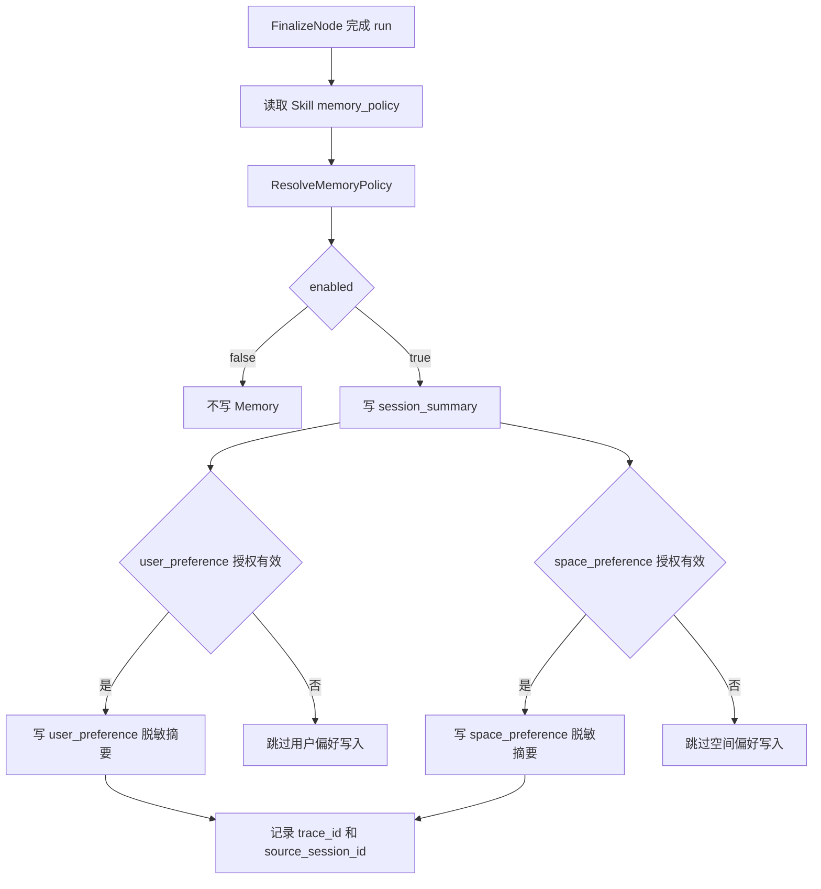
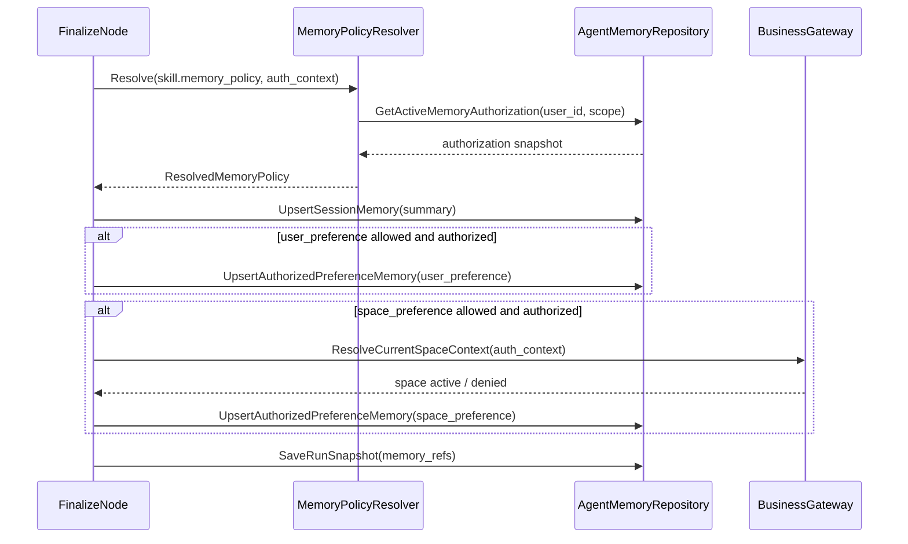

# 10-黑板资产引用快照记忆与会话恢复设计

状态：production-design-ready
owner：Go Eino 智能体微服务架构工程师
更新时间：2026-06-27
适用范围：黑板、过程资产元素、资产引用、过程快照、Memory、会话恢复、项目上下文恢复
相关代码路径：`services/agent/internal/domain/model/**`、`services/agent/internal/runtime/memory/**`、`services/agent/internal/infra/repository/**`
相关契约：`docs/product/prd/08-资产素材与创作过程PRD.md`、`docs/design/11-Agent工作台与A2UI组件视觉规范.md`

## 文档目标

- 定义 Agent 如何保存黑板和过程态资产元素。
- 定义业务资产引用的保存边界。
- 设计过程快照和会话恢复。
- 定义 Memory 生产级启用边界。

## 功能范围

- 黑板结构。
- 分镜、脚本、提示词、故事线。
- 过程态资产元素。
- 最终资产引用。
- 资产引用权限校验。
- run 快照。
- session 快照。
- Last-Event-ID 补偿失败后的 snapshot 恢复。
- 会话摘要和授权偏好 Memory。

## Memory 生产级结论

生产级实现启用受控 Memory，严格限制在 Agent Runtime 体验增强内。Skill `memory_policy` 只表达该 Skill 允许使用哪些记忆 scope，实际写入必须再和 Agent 侧用户/空间授权取交集；未授权时只能使用当前 session summary，不写长期偏好。

| Memory 类型 | 是否启用 | 范围 | 保留策略 | 撤销策略 |
| --- | --- | --- | --- | --- |
| `session_summary` | 启用 | 单个 session | 跟随 session 保留，归档或过期后按保留策略清理 | 用户删除/归档会话后不再参与检索。 |
| `user_preference` | 条件启用 | 当前用户跨 session 的非敏感创作偏好摘要 | 默认 180 天，受 `memory_policy.retention_days` 上限控制 | 用户撤销授权后立即停止检索并软删除可识别偏好摘要。 |
| `space_preference` | 条件启用 | 当前空间内经授权共享的非敏感创作偏好摘要 | 默认 90 天，企业/空间授权失效后不再检索 | 空间授权撤销或成员离开空间后停止检索并按空间清理。 |
| 业务事实记忆 | 禁止 | 无 | 无 | 不允许保存积分、权限、企业成员、资产事实。 |

Memory 策略解析规则：

| 输入 | 来源 | 处理规则 |
| --- | --- | --- |
| `memory_policy.enabled=false` | 业务 `PublishedSkillSpecDTO` | 不写任何新 Memory；仍可读取当前 run 输入和 session 内上下文。 |
| `allowed_scopes` 缺失 | 业务兼容字段 | 等价 `["session_summary"]`。 |
| `session_summary` | Skill 默认 scope | 无需额外授权，但只在当前 session 内检索。 |
| `user_preference` | Skill 显式 scope | 需要 `AgentMemoryAuthorization(user_id, scope=user_preference, status=active)`，否则降级为只使用 session summary。 |
| `space_preference` | Skill 显式 scope | 需要空间授权且当前用户仍属于该空间；权限失效时不检索、不写入。 |
| `retention_days` | Skill 配置 | 不能超过系统上限：user 180 天、space 90 天、session 跟随 session。 |

## Snapshot schema 必须覆盖

| 字段 | 说明 |
| --- | --- |
| `snapshot_id` | 快照 ID。 |
| `session_id` / `run_id` / `project_id` | 恢复上下文。 |
| `last_event_sequence` | 快照对应的最后事件序号。 |
| `messages_summary[]` | 可展示消息摘要。 |
| `task_states[]` | 长任务状态。 |
| `asset_refs[]` | 业务资产引用和展示摘要。 |
| `blackboard` | 黑板当前结构、元素、故事线、active node。 |
| `interrupt` | 当前等待用户处理的中断摘要，可为空。 |
| `readonly_reason` | 项目归档或权限失效时只读原因。 |
| `schema_version` | 快照结构版本。 |

## Blackboard model 设计

```go
// BlackboardElement 是 Agent Runtime 的过程态画布元素，不代表最终业务资产事实。
type BlackboardElement struct {
    ElementID       string
    SessionID       string
    RunID           string
    ElementType     string
    DisplayName     string
    ProcessContentURI string
    AssetID         string
    Metadata        map[string]any
    SortOrder       int
    CreatedAt       time.Time
    UpdatedAt       time.Time
}

// AssetReferenceDTO 是业务资产引用摘要，来源于业务 RPC。
type AssetReferenceDTO struct {
    AssetID           string
    ResourceType      string
    DisplayName       string
    PreviewAvailable  bool
    Downloadable       bool
    PermissionStatus   string
    BusinessVersion    string
}
```

黑板只保存过程结构、展示摘要和业务资产引用 ID，不保存资产文件事实、业务归属、订单、扣费结果和权限事实。

## Repository 函数

| 函数 | 入参 | 出参 | 说明 |
| --- | --- | --- | --- |
| `UpsertBlackboardElement(ctx, element)` | `BlackboardElement` | `BlackboardElement` | 幂等更新过程元素，按 `element_id` 唯一。 |
| `ListBlackboardElements(ctx, sessionID)` | `session_id` | `elements[]` | 用于 snapshot 和恢复。 |
| `SaveRunSnapshot(ctx, snapshot)` | `RunSnapshot` | `snapshot_id` | 每个关键状态后保存，写入 `agent_events`。 |
| `GetLatestRunSnapshot(ctx, runID)` | `run_id` | `RunSnapshot` | SSE 补偿失败时读取。 |
| `ResolveMemoryPolicy(ctx, skillPolicy, auth)` | `memory_policy`、`auth_context` | `ResolvedMemoryPolicy` | 将业务 Skill 策略和 Agent 授权状态取交集。 |
| `UpsertSessionMemory(ctx, memory)` | `AgentMemory` | `memory_id` | 保存 `session_summary`，不保存原文。 |
| `UpsertAuthorizedPreferenceMemory(ctx, memory)` | `AgentMemory(memory_type=user_preference/space_preference, authorized=true)` | `memory_id` | 只保存脱敏偏好摘要；授权失效时拒绝写入。 |
| `RevokeMemoryAuthorization(ctx, userID, scope)` | `user_id`、`scope`、`reason` | `revoked_count` | 停止检索并软删除授权偏好摘要。 |
| `ListVisibleAssetRefs(ctx, auth, projectID, assetIDs)` | `asset_ids[]` | `AssetReferenceDTO[]` | 先调用业务权限 RPC，再返回可见摘要。 |

## 恢复流程闭环

```text
用户打开历史 session
  -> CheckProjectAccess(view)
  -> 读取最新 snapshot
  -> 提取 asset_ids
  -> BatchCheckAssetAccess(purpose=view)
  -> 过滤不可见资产并写 permission_status
  -> 返回 snapshot
  -> 若项目 archived，readonly_reason=project_archived
  -> 发布 process.snapshot.saved 或返回 HTTP snapshot
```

恢复不启动新的 run，不重新扣费，不重新调用生成 Tool。若用户在只读项目中继续创作，必须重新创建 run 并触发 `CheckProjectAccess(continue_creation)`，归档项目返回 `project.archived.blocked`。

## 业务流程图：Memory 写入



## 代码逻辑图



## AG-UI 映射

| 事件 | 触发 | payload |
| --- | --- | --- |
| `workspace.blackboard.updated` | 黑板元素新增、更新、排序或删除 | `mode`、`elements[]`、`storyline[]`、`active_node_id`、`version`。 |
| `workspace.assets.updated` | 业务资产引用可见性变化 | `asset_refs[]`、`hidden_asset_count`、`permission_summary`。 |
| `process.snapshot.saved` | run 关键状态保存 | `snapshot_id`、`last_event_sequence`、`schema_version`、`readonly_reason`。 |

## 测试

| 场景 | 断言 |
| --- | --- |
| 正常恢复 | snapshot 中消息、任务、黑板和资产引用完整。 |
| Last-Event-ID 缺口 | 补偿失败后 snapshot 可恢复到 `last_event_sequence`。 |
| 资产权限失效 | 不可见资产不返回预览，保留权限不可见摘要。 |
| 项目归档 | snapshot 可读，继续创作被阻断。 |
| Memory 摘要 | 只保存 session summary，不包含业务事实和敏感原文。 |
| 授权偏好 Memory | `memory_policy` 含 user/space scope 且授权有效时写入摘要；授权无效时降级且不报错。 |
| Memory 撤销 | 撤销后不可再检索旧偏好摘要，新 run 不写 user/space preference。 |
| schema 升级 | 旧 snapshot 按 `schema_version` 兼容读取。 |

## 业务开发对齐点

- 业务资产引用权限校验 RPC。
- 资产摘要字段由业务服务返回哪些内容。
- 项目详情需要哪些 Agent 侧黑板摘要。
- 被移出企业后历史会话和企业空间资产引用的访问策略。

## 【业务开发】需要提供的能力与参数

| 能力 | 参数 | Agent 用途 |
| --- | --- | --- |
| 资产引用权限校验 | `auth_context`、`asset_ids[]`、`project_id`、`purpose=view/reference` | 恢复会话和黑板展示时确认资产是否仍可见。 |
| 资产展示摘要 | `asset_ids[]`、`auth_context` | 返回 `asset_id`、`resource_type`、`display_name`、`preview_available`、`downloadable`、`permission_status`。 |
| 项目只读状态 | `project_id`、`access_purpose=view` | snapshot 返回 `readonly_reason`，前端禁用继续创作。 |
| 被移出企业后的访问策略 | `auth_context`、`space_id`、`asset_ids[]` | 业务侧返回 `PERMISSION_DENIED` 或逐项不可见原因。 |
| 空间有效性校验 | `auth_context`、`space_id` | Agent 写入 `space_preference` 前确认当前用户仍属于该空间。 |
