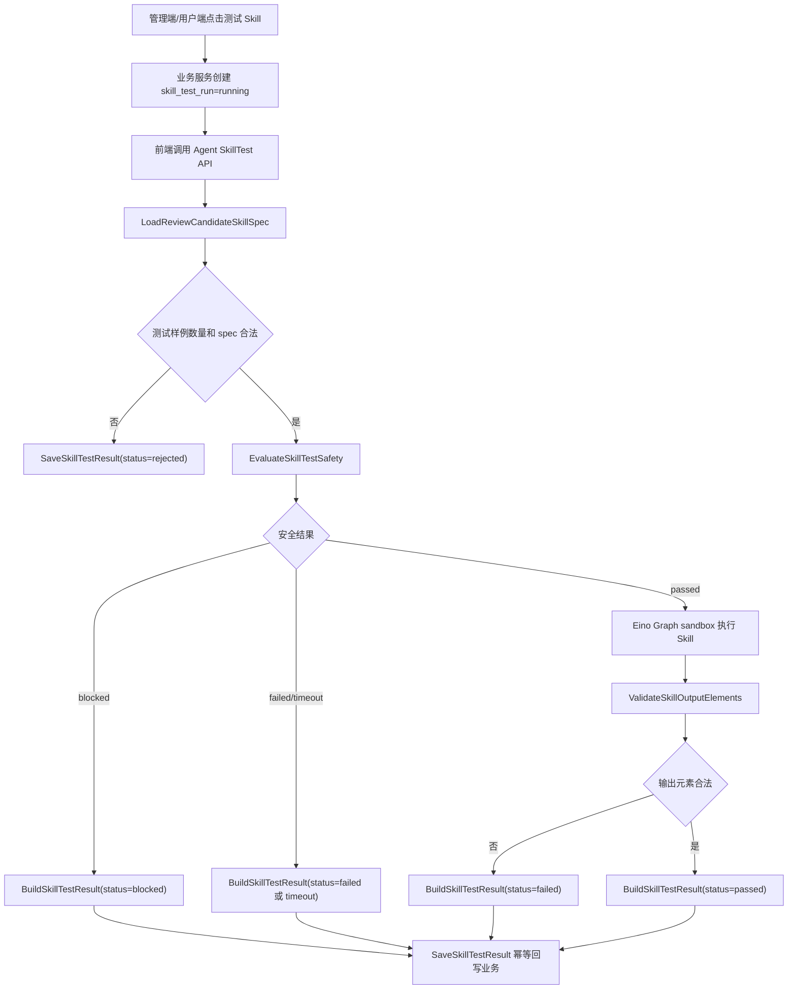
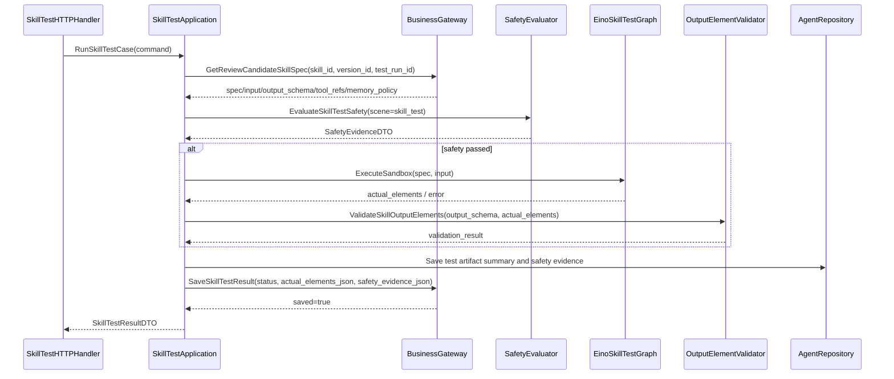

# 12-Skill测试运行输出元素校验与安全证据设计

状态：production-design-ready
owner：Go Eino 智能体微服务架构工程师
更新时间：2026-06-27
适用范围：Skill 发布前测试运行、测试样例、输出元素校验、测试隔离、安全证据和测试结果回传
相关代码路径：`services/agent/internal/runtime/skilltest/**`、`services/agent/internal/runtime/skill/**`、`services/agent/internal/runtime/safety/**`
相关设计契约：`docs/product/prd/05-SkillBuilder与审核PRD.md`、`docs/product/prd/10-内容安全治理PRD.md`、`code-plan/agent/07-RPC客户端业务能力调用与DTO映射设计.md`、`code-plan/business/08-Skill目录版本审核发布回滚与通知设计.md`
后续实现落点：`api/thrift/business_agent_service.thrift`

## 文档目标

- 定义 Skill 发布前至少 3 个测试样例的 Agent 侧执行能力。
- 定义测试运行如何隔离正式会话、积分扣费、资产保存和业务写入。
- 定义输出元素结构校验规则。
- 定义测试样例安全评估和安全证据结构。
- 定义测试结果如何回传业务服务，用于 Skill 发布和审核。

## 功能范围

- 系统 Skill、企业 Skill、个人 Skill 的测试运行。
- 测试样例数量校验。
- Skill runtime spec 读取。
- 测试输入安全评估。
- Tool 白名单和风险策略校验。
- 输出元素结构校验。
- 过程态测试 artifact 生成。
- 测试结果保存或回传。
- 测试失败原因分类。

## 测试运行边界

| 项目 | 规则 |
| --- | --- |
| 会话 | Skill 测试使用独立 `test_run_id`，不写入用户正式 session。 |
| 积分 | 生产级测试运行不实际扣费；如调用真实供应商产生成本，需要业务侧定义平台内部成本处理，不进入用户积分账户。 |
| 资产 | 测试产物不创建用户可见业务资产；只保存隔离测试 artifact 摘要。 |
| Tool | 只能调用平台开放 Tool；高风险、业务写入 Tool 在测试中必须走 preview 或隔离测试 adapter，不允许直接改业务事实。 |
| 安全 | 测试输入和 Skill 组装提示词必须产生 `scene=skill_test` 的安全证据。 |
| 输出 | 必须验证 Skill 声明的必填资产元素是否存在、元素类型是否合法、render hint 是否可用。 |

## 核心函数必须覆盖

| 函数 | 入参 | 出参 |
| --- | --- | --- |
| `LoadReviewCandidateSkillSpec` | `skill_id`、`version_id`、`test_case_id`、`test_run_id`、`auth_context`、`request_meta` | `skill_spec_json`、`input_schema_json`、`output_schema_json`、`tool_refs[]`、`memory_policy_json`、`confirmation_policy_json`、`test_input_json`、`expected_elements_json`。 |
| `RunSkillTestCase` | `skill_id`、`version_id`、`test_run_id`、`test_case_id`、`test_input_json`、`auth_context`、`request_meta` | `status`、`actual_elements[]`、`output_summary`、`validation_result`。 |
| `EvaluateSkillTestSafety` | `test_case_id`、`assembled_prompt_digest`、`scene=skill_test` | `safety_evidence`、`blocked_reason`。 |
| `ValidateSkillOutputElements` | `skill_output_schema`、`actual_elements[]`、`asset_element_types[]`、`usage_stage=test|draft|final` | `missing_required[]`、`invalid_types[]`、`stage_violations[]`、`unrenderable_hints[]`、`renderable`。 |
| `BuildSkillTestResult` | `skill_id`、`version_id`、`test_run_id`、`test_case_id`、`actual_elements[]`、`validation_result`、`safety_evidence`、`error` | `actual_elements_json`、`safety_evidence_json`、`status`、`error_code`、`error_summary`、`agent_trace_id`。 |
| `SaveSkillTestResult` | `auth_context`、`request_meta`、`skill_id`、`version_id`、`test_run_id`、`test_case_id`、`status`、`actual_elements_json`、`safety_evidence_json`、`error_code`、`error_summary`、`agent_trace_id` | `test_run_id`、`status`、`saved`。 |

## Skill Test Runtime 架构

```text
SkillTestApplication
  -> SkillCatalogService.GetReviewCandidateSkillSpec 读取待测试 spec
  -> 校验 test_cases 数量 >= 3
  -> 为每个 case 创建独立 test_run
  -> EvaluateSkillTestSafety
  -> 使用 Eino Graph 执行测试流程
  -> ValidateSkillOutputElements
  -> BuildSkillTestResult
  -> SkillCatalogService.SaveSkillTestResult
```

测试运行使用 `services/agent/internal/runtime/skilltest`，不进入正式 TurnLoop 的积分冻结和资产 commit 流程。Eino 使用 `Graph` 复用正式 Skill 执行节点，使用 `Callback` 捕获 tool call、模型输出和安全事件。

## 业务流程图



## 代码逻辑图



## 测试状态机

| 状态 | 进入条件 | 可流转到 |
| --- | --- | --- |
| `pending` | 业务提交测试请求后 | `running`、`rejected` |
| `running` | 安全通过并开始执行 | `passed`、`failed`、`blocked`、`timeout` |
| `blocked` | 安全评估不通过 | 终态 |
| `failed` | Tool、模型或输出校验失败 | 终态 |
| `timeout` | 超过测试策略时间 | 终态 |
| `passed` | 输出元素校验通过 | 终态 |
| `rejected` | 测试样例少于 3 个或 spec 无效 | 终态 |

## DTO 设计

```go
// SkillTestCaseDTO 是业务侧提交给 Agent 的单个测试样例。
type SkillTestCaseDTO struct {
    TestCaseID   string
    InputText    string
    Controls     map[string]any
    ExpectedTags []string
}

// SkillOutputValidationResult 描述 Skill 输出元素是否满足发布要求。
type SkillOutputValidationResult struct {
    Passed            bool
    MissingRequired   []string
    InvalidTypes      []string
    StageViolations   []string
    UnrenderableHints []string
    ElementCount      int
}

// SkillTestResultDTO 是 Agent 回传业务服务的测试结果。
type SkillTestResultDTO struct {
    SkillID            string
    VersionID          string
    TestRunID          string
    TestCaseID         string
    Status             string
    ActualElementsJSON string
    SafetyEvidenceJSON string
    ErrorCode          string
    ErrorSummary       string
    AgentTraceID       string
    ValidationResult   SkillOutputValidationResult
}
```

## 输出元素校验算法

1. 从业务返回的 `output_schema_json` 读取必填元素、允许元素类型和 render hint。
2. 调 `PlatformDictionaryService.ListAssetElementTypes(auth_context, request_meta, page_size=50)` 获取合法元素类型。
3. 遍历 `actual_elements[]`，按 `element_type`、`required`、`render_hint`、`schema_json`、`usage_stage` 校验。
4. 当测试输出用于过程态校验时要求 `draft_enabled=true`；当测试声明最终资产输出时要求 `final_enabled=true`。
5. 输出 `missing_required[]`、`invalid_types[]`、`stage_violations[]`、`unrenderable_hints[]`。
6. 任一必填缺失、非法类型、阶段不允许或不可渲染必填元素存在时，测试 case 标记 `failed`。

## 安全证据字段

Skill 测试安全证据必须包含：

- `scene=skill_test`
- `target_type=skill_test_prompt`
- `target_ref_id=test_case_id`
- `evaluated_object_digest`
- `policy_version`
- `evidence_version`
- `result`
- `evaluated_at`
- `expires_at`
- `source_run_id=test_run_id`
- `trace_id`

`safety_evidence_json` 的必填规则：

| 测试结果状态 | 是否必须回传安全证据 | 说明 |
| --- | --- | --- |
| `passed` | 是 | `result=passed`，且输出元素校验通过。 |
| `blocked` | 是 | `result=blocked`，不得执行 Skill Graph。 |
| `failed` | 是 | 已组装测试 prompt 的失败必须回传 `result=failed` 或最近一次安全评估证据；未组装 prompt 的 spec 校验失败可为空。 |
| `timeout` | 是 | 安全评估或测试执行超时均要回传可关联 trace 的证据或失败摘要。 |
| `rejected` | 否 | 仅限样例数量不足、spec 不存在、权限失败等未进入安全评估的情况。 |

## 【业务开发】需要提供的能力与参数

| 能力 | 请求参数 | 响应参数 |
| --- | --- | --- |
| 读取待测试 Skill 规格 | `auth_context`、`request_meta`、`skill_id`、`version_id`、`test_case_id`、`test_run_id` | `skill_id`、`version_id`、`skill_spec_json`、`input_schema_json`、`output_schema_json`、`tool_refs[]`、`memory_policy_json`、`confirmation_policy_json`、`test_input_json`、`expected_elements_json`。 |
| 保存 Skill 测试结果 | `auth_context`、`request_meta`、`skill_id`、`version_id`、`test_run_id`、`test_case_id`、`status`、`actual_elements_json`、`error_code`、`error_summary`、`safety_evidence_json`、`agent_trace_id` | `test_run_id`、`status`、`saved`。 |
| 查询资产元素类型 | `auth_context`、`request_meta`、`page_size=50`、`schema_version` | `element_types[]`，每项含 `element_type`、`schema_hint`、`draft_enabled`、`final_enabled`、`editable`、`referable`、`render_hint`、`schema_version`。 |
| Tool 测试策略 | `tool_refs[]`、`auth_context`、`test_mode=true` | `allowed`、`test_double_required`、`timeout_ms`、`risk_level`。 |

## Tool 隔离测试 / preview 策略

| Tool 类型 | 测试策略 |
| --- | --- |
| 纯文本分析 | 可真实执行，保存摘要。 |
| 图片/音乐/视频生成 | 测试环境必须配置隔离测试供应商或隔离测试 adapter；生产环境未配置真实供应商时必须失败。 |
| 业务写入 | 只能 preview 或隔离测试 adapter，不允许改变业务事实。 |
| 高风险 Tool | 测试模式直接失败并记录 `risk_tool_not_allowed_in_test`。 |

## 日志和测试矩阵

| 场景 | 断言 |
| --- | --- |
| 少于 3 个样例 | 状态 `rejected`，不执行 Tool。 |
| 安全阻断 | 状态 `blocked`，报告含 `safety_evidence_id`。 |
| 输出缺必填元素 | 状态 `failed`，`missing_required[]` 非空。 |
| 非法元素类型 | 状态 `failed`，`invalid_types[]` 非空。 |
| 阶段不匹配 | 过程态元素 `draft_enabled=false` 或最终元素 `final_enabled=false` 时状态 `failed`，`stage_violations[]` 非空。 |
| 全部通过 | 每个 case 调用 `SaveSkillTestResult` 后返回 `saved=true` 且 `status=passed`。 |
| 重复回传 | 相同幂等键返回同一保存结果。 |

日志字段：`skill_id`、`version_id`、`test_run_id`、`test_case_id`、`status`、`validation_passed`、`tool_call_count`、`agent_trace_id`、`trace_id`。
