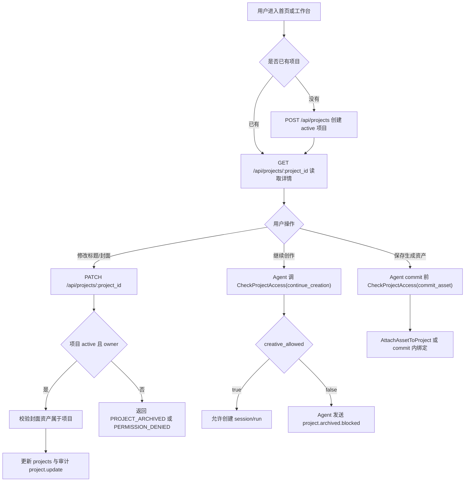
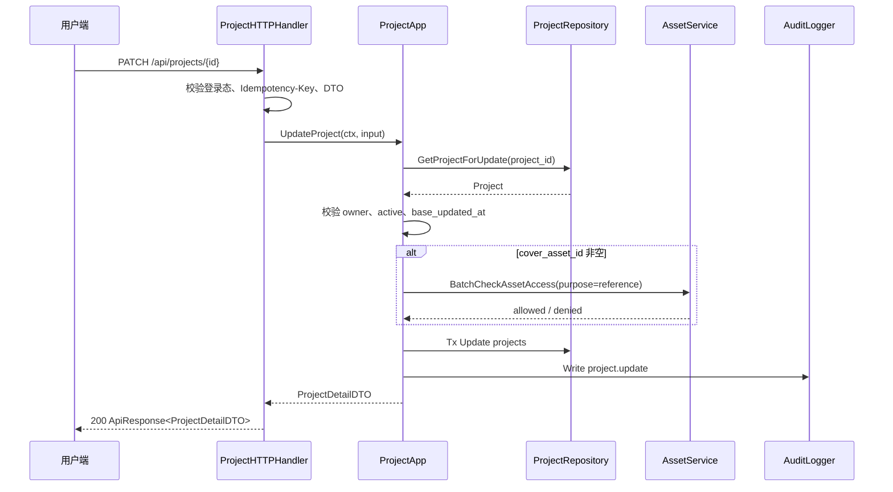

# 05-项目归属项目资产项目作品与权限设计

状态：archived
owner：业务服务责任域
更新时间：2026-06-28
适用范围：项目、项目归档、项目权限、项目资产关系、项目作品关系、Agent 会话上下文校验  
相关代码路径：`services/business/internal/application/project/**`、`services/business/internal/domain/project/**`、`services/business/internal/transport/rpc/project_handler.go`

## 产品事实源

- `docs/product/项目与资产归属产品系统设计.md`
- `docs/product/资产与创作过程保存产品系统设计.md`
- `docs/product/统一Agent产品系统设计.md`
- `api/thrift/business_agent_service.thrift`

## 目标

项目是业务事实和创作容器，负责聚合会话、资产、黑板和作品的业务归属。业务服务维护项目标题、状态、封面、归档和项目资产/作品关系；Agent 只保存 `project_id` 普通引用。

## 非目标

- 不保存 Agent session、run、message、event、blackboard。
- 不做多人协作项目、项目市场、项目删除回收站。
- 企业空间项目只对创建者本人可见；扩展企业共享可见性必须先更新权限矩阵、API/RPC 契约、审计动作和测试用例。

## 需求映射矩阵

| 产品条目 | 业务解释 | 业务产出 | 【Agent开发】依赖 |
| --- | --- | --- | --- |
| 首页开始创作默认创建项目 | 业务服务创建项目事实 | `CreateProject` | Agent 或 API 适配层传 `space_id`、`title_suggestion`、`idempotency_key` |
| 会话必须属于项目 | 创建 session/run 前必须校验项目 | `CheckProjectAccess` | Agent 创建 session/run/resume/confirm 前调用 |
| 归档项目只读 | view 允许，创作类目的拒绝 | `PROJECT_ARCHIVED` | Agent 停止新 Tool，释放未结算冻结并发 AG-UI |
| 项目标题和封面可更新 | 项目详情页允许 owner 修改标题、备注和封面 | HTTP `PATCH /api/projects/:project_id`、Application `UpdateProject` | Agent 不更新项目事实，只在 snapshot 中展示业务返回摘要 |
| 资产默认归属当前项目 | 保存资产时绑定项目资产关系 | `AttachAssetToProject` 或 commit 内绑定 | Agent 保存生成资产时传 `project_id`、来源 run/artifact |
| 作品从项目资产创建 | 作品关系由业务服务维护 | `ProjectWorkService` | Agent 不创建作品事实 |

## 领域模型

### Project

| 字段 | 类型 | 必填 | 说明 |
| --- | --- | --- | --- |
| `project_id` | string | 是 | 项目 ID |
| `space_id` | string | 是 | 当前空间 |
| `owner_user_id` | string | 是 | 创建者 |
| `title` | string | 是 | 项目标题 |
| `cover_asset_id` | string | 否 | 封面资产普通引用 |
| `status` | enum | 是 | `active`、`archived` |
| `last_activity_at` | time | 是 | 最近活动 |
| `archived_at` | time | 否 | 归档时间 |

### ProjectAsset

| 字段 | 类型 | 必填 | 说明 |
| --- | --- | --- | --- |
| `project_id` | string | 是 | 项目 ID |
| `asset_id` | string | 是 | 资产 ID |
| `source_session_id` | string | 否 | Agent session 引用 |
| `source_run_id` | string | 否 | Agent run 引用 |
| `source_artifact_id` | string | 否 | Agent artifact 引用 |
| `source_type` | enum | 是 | `generated`、`uploaded`、`imported` |
| `display_order` | int | 否 | 项目资产排序 |

## 数据库表

| 表 | 关键字段 | 索引和约束 |
| --- | --- | --- |
| `projects` | `project_id`、`space_id`、`owner_user_id`、`title`、`cover_asset_id`、`status`、`last_activity_at` | `project_id` 唯一；`(space_id,owner_user_id,status,last_activity_at)` |
| `project_assets` | `project_id`、`asset_id`、`source_session_id`、`source_run_id`、`source_artifact_id`、`source_type` | `(project_id,asset_id)` 唯一；`asset_id` 索引 |
| `project_works` | `project_id`、`work_id`、`created_from_asset_ids`、`status` | `(project_id,work_id)` 唯一 |

不创建数据库级外键，跨表一致性由 application 校验和测试保证。

## 详细数据库表设计

### `projects`

| 字段 | 类型 | 必填 | 默认值 | 索引/约束 | 说明 |
| --- | --- | --- | --- | --- | --- |
| `project_id` | varchar(64) | 是 | 生成 | pk/unique | 项目 ID |
| `space_id` | varchar(64) | 是 |  | idx composite | 当前空间 |
| `owner_user_id` | varchar(64) | 是 |  | idx composite | 创建者 |
| `title` | varchar(120) | 是 |  | idx trigram 可选 | 项目标题 |
| `description` | varchar(512) | 否 | null |  | 项目备注 |
| `cover_asset_id` | varchar(64) | 否 | null | idx | 封面资产 ID |
| `status` | varchar(32) | 是 | `active` | idx composite | `active`、`archived` |
| `creative_allowed` | boolean | 是 | true |  | 冗余展示字段，归档时 false |
| `archive_reason` | varchar(512) | 否 | null |  | 归档原因摘要 |
| `archived_at` | timestamptz | 否 | null | idx | 归档时间 |
| `archived_by` | varchar(64) | 否 | null |  | 归档操作者 |
| `last_activity_at` | timestamptz | 是 | now() | idx composite | 最近业务活动时间 |
| `created_at` | timestamptz | 是 | now() | idx | 创建时间 |
| `updated_at` | timestamptz | 是 | now() |  | 更新时间 |

关键索引：`(space_id, owner_user_id, status, last_activity_at desc)` 用于项目列表；`(space_id, project_id)` 用于权限校验。

### `project_assets`

| 字段 | 类型 | 必填 | 默认值 | 索引/约束 | 说明 |
| --- | --- | --- | --- | --- | --- |
| `project_asset_id` | varchar(64) | 是 | 生成 | pk/unique | 项目资产关系 ID |
| `project_id` | varchar(64) | 是 |  | unique composite/idx | 项目 ID |
| `asset_id` | varchar(64) | 是 |  | unique composite/idx | 资产 ID |
| `source_session_id` | varchar(64) | 否 | null | idx | Agent session 引用 |
| `source_run_id` | varchar(64) | 否 | null | idx | Agent run 引用 |
| `source_artifact_id` | varchar(64) | 否 | null | idx | Agent artifact 引用 |
| `source_type` | varchar(32) | 是 |  | idx | `generated`、`uploaded`、`imported` |
| `display_order` | int | 是 | 0 | idx | 项目内展示顺序 |
| `attached_by` | varchar(64) | 是 |  | idx | 绑定操作者 |
| `created_at` | timestamptz | 是 | now() | idx | 绑定时间 |
| `updated_at` | timestamptz | 是 | now() |  | 更新时间 |

唯一约束：`(project_id, asset_id)`。列表按 `(project_id, created_at desc)` 分页。

### `project_works`

| 字段 | 类型 | 必填 | 默认值 | 索引/约束 | 说明 |
| --- | --- | --- | --- | --- | --- |
| `project_work_id` | varchar(64) | 是 | 生成 | pk/unique | 项目作品关系 ID |
| `project_id` | varchar(64) | 是 |  | unique composite/idx | 项目 ID |
| `work_id` | varchar(64) | 是 |  | unique composite/idx | 作品 ID |
| `created_from_asset_ids` | jsonb | 是 | `[]` |  | 创建作品使用的资产 ID 列表 |
| `status` | varchar(32) | 是 | `active` | idx | `active`、`removed` |
| `created_by` | varchar(64) | 是 |  | idx | 创建者 |
| `created_at` | timestamptz | 是 | now() | idx | 创建时间 |
| `updated_at` | timestamptz | 是 | now() |  | 更新时间 |

唯一约束：`(project_id, work_id)`。项目归档后不删除关系，只阻断继续创作类写入。

## 业务能力接口清单

| 能力 | 调用方 | 接口形态 | 核心模型 | 幂等 | 审计 |
| --- | --- | --- | --- | --- | --- |
| 项目列表 | 用户端 | HTTP `GET /api/projects` | `Project` | 否 | 否 |
| 创建项目 | 用户端、Agent 开始创作前可间接触发 | HTTP `POST /api/projects`；RPC `CreateProject` | `Project` | 是 | 项目创建审计 |
| 项目详情 | 用户端 | HTTP `GET /api/projects/:project_id` | `ProjectDetailDTO` | 否 | 否 |
| 更新项目标题/封面 | 用户端 | HTTP `PATCH /api/projects/:project_id`；标题更新 RPC `ProjectService.UpdateProjectTitle` | `Project` | 是 | 是 |
| 项目归档/恢复 | 用户端 | HTTP `POST /api/projects/:project_id/archive`、`/restore` | `Project.status` | 是 | 是 |
| 项目访问校验 | Agent | RPC `CheckProjectAccess` | `ProjectAccessResult` | 否 | 否 |
| 项目资产列表 | 用户端 | HTTP `GET /api/projects/:project_id/assets` | `ProjectAsset` | 否 | 否 |
| 项目作品列表 | 用户端 | HTTP `GET /api/projects/:project_id/works` | `ProjectWork` | 否 | 否 |
| 绑定资产到项目 | Agent、用户上传确认 | RPC/Application `AttachAssetToProject` | `ProjectAsset` | 是 | 是 |

## HTTP API 设计

| Method | Path | 鉴权 | Request DTO | Response DTO | 页面状态 |
| --- | --- | --- | --- | --- | --- |
| GET | `/api/projects` | user | `ListProjectsRequest` | `PageResult<ProjectCardDTO>` | `loading`、`empty`、`filtered_empty` |
| POST | `/api/projects` | user | `CreateProjectRequest` + `Idempotency-Key` | `ProjectDetailDTO` | `loading`、`success` |
| GET | `/api/projects/:project_id` | user | path `project_id` | `ProjectDetailDTO` | `loading`、`archived_readonly`、`permission_denied` |
| PATCH | `/api/projects/:project_id` | 责任域 | `UpdateProjectRequest` + `Idempotency-Key` | `ProjectDetailDTO` | `editing`、`success`、`archived_readonly` |
| POST | `/api/projects/:project_id/archive` | 责任域 | `ArchiveProjectRequest` + `Idempotency-Key` | `ProjectDetailDTO` | `confirming`、`archived_readonly` |
| POST | `/api/projects/:project_id/restore` | 责任域 | `RestoreProjectRequest` + `Idempotency-Key` | `ProjectDetailDTO` | `confirming`、`success` |
| GET | `/api/projects/:project_id/assets` | user | `ListProjectAssetsRequest` | `PageResult<ProjectAssetDTO>` | `loading`、`empty` |
| GET | `/api/projects/:project_id/works` | user | `ListProjectWorksRequest` | `PageResult<ProjectWorkDTO>` | `loading`、`empty` |

项目详情页的会话历史、run 状态、黑板快照不由本业务 API 返回；业务响应只给 `agent_session_query_ref`，前端或 API 网关再调用 Agent API 聚合。

## DTO 设计

| DTO | 字段 |
| --- | --- |
| `ListProjectsRequest` | `status` active/archived/all、`keyword`、`PaginationRequest` |
| `CreateProjectRequest` | `title`、`initial_prompt_digest` 可选、`source` homepage/workspace、`space_id` 可选但需服务端校验 |
| `UpdateProjectRequest` | `title` 可选、`description` 可选、`cover_asset_id` 可选、`base_updated_at` 可选；至少提供一个可更新字段 |
| `ArchiveProjectRequest` | `reason` 可选 |
| `RestoreProjectRequest` | `reason` 可选 |
| `ProjectCardDTO` | `project_id`、`title`、`cover_asset_url`、`status`、`last_activity_at`、`asset_count`、`work_count`、`creative_allowed` |
| `ProjectDetailDTO` | `project`、`allowed_actions[]`、`asset_summary`、`work_summary`、`agent_session_query_ref` |
| `ProjectAssetDTO` | `asset_id`、`asset_type`、`preview_url`、`source_type`、`source_session_id`、`source_run_id`、`created_at` |
| `ProjectWorkDTO` | `work_id`、`title`、`cover_url`、`status`、`shared_status`、`created_at` |
| `ProjectAccessResult` | `allowed`、`project_status`、`creative_allowed`、`allowed_actions[]`、`denied_reason` |

## RPC 设计

### ProjectService.CheckProjectAccess

请求：

| 字段 | 类型 | 必填 | 说明 |
| --- | --- | --- | --- |
| `project_id` | string | 是 | 项目 ID |
| `access_purpose` | enum | 是 | `view`、`continue_creation`、`attach_asset`、`commit_asset`、`create_work` |
| `auth_context` | AuthContext | 是 | 当前身份 |
| `request_meta` | RequestMeta | 是 | trace |

响应：

| 字段 | 类型 | 说明 |
| --- | --- | --- |
| `allowed` | bool | 是否允许 |
| `project_id` | string | 项目 ID |
| `project_status` | enum | active / archived |
| `creative_allowed` | bool | 是否允许继续创作 |
| `allowed_actions[]` | string | view 等 |
| `owner_user_id` | string | 创建者 |

归档规则：`view` 对 archived 允许；其他目的返回 `PROJECT_ARCHIVED`。

### ProjectService.CreateProject

请求字段：`space_id`、`title` 或 `title_suggestion`、`auth_context`、`request_meta.idempotency_key`。响应返回 `project_id`、`status=active`、`title`、`created_at`。

### ProjectService.UpdateProjectTitle

该 RPC 对齐产品契约中的 `UpdateProjectTitle`，只处理项目标题更新；项目封面和备注更新由用户端 HTTP `PATCH /api/projects/:project_id` 进入 `ProjectApplication.UpdateProject`。

请求字段：`project_id`、`title`、`base_updated_at` 可选、`auth_context`、`request_meta.idempotency_key`。

响应字段：`project_id`、`title`、`updated_at`、`project_status`、`creative_allowed`。

错误：`PROJECT_ARCHIVED`、`PERMISSION_DENIED`、`STATE_CONFLICT`、`IDEMPOTENCY_CONFLICT`、`INVALID_ARGUMENT`。

### ProjectApplication.UpdateProject

调用方：用户端 HTTP API 适配层。该能力是业务服务内部 application 能力，不对 Agent 暴露 RPC；Agent 只能读取业务返回的项目摘要，不能替用户修改项目标题、备注或封面。

请求字段：`project_id`、`title` 可选、`description` 可选、`cover_asset_id` 可选、`base_updated_at` 可选、`auth_context`、`request_meta.idempotency_key`。

响应字段：`ProjectDetailDTO`，包含更新后的 `title`、`description`、`cover_asset_id`、`allowed_actions[]`、`agent_session_query_ref`。

校验规则：

- 仅项目 `owner_user_id` 可更新。
- archived 项目不可更新，返回 `PROJECT_ARCHIVED`，页面进入 `archived_readonly`。
- `title` 长度 1～120；`description` 长度不超过 512；空白标题按 `INVALID_ARGUMENT` 拒绝。
- `cover_asset_id` 非空时必须属于当前项目且当前用户对该资产有 `reference` 权限。
- `base_updated_at` 存在且和当前记录不一致时返回 `STATE_CONFLICT`，前端应刷新项目详情后重试。

### ProjectAssetService.AttachAssetToProject

请求字段：`project_id`、`asset_id`、`source_session_id`、`source_run_id`、`source_artifact_id`、`source_type`、`idempotency_key`。

## Application 函数

```go
type ProjectApp interface {
    CreateProject(ctx context.Context, in CreateProjectInput) (ProjectDTO, error)
    GetProject(ctx context.Context, in GetProjectInput) (ProjectDTO, error)
    ListProjects(ctx context.Context, in ListProjectsInput) (Page[ProjectListItemDTO], error)
    UpdateProject(ctx context.Context, in UpdateProjectInput) (ProjectDTO, error)
    ArchiveProject(ctx context.Context, in ArchiveProjectInput) (ProjectDTO, error)
    RestoreProject(ctx context.Context, in RestoreProjectInput) (ProjectDTO, error)
    CheckProjectAccess(ctx context.Context, in CheckProjectAccessInput) (ProjectAccessResult, error)
}

type ProjectAssetApp interface {
    AttachAssetToProject(ctx context.Context, in AttachAssetInput) (ProjectAssetDTO, error)
    ListProjectAssets(ctx context.Context, in ListProjectAssetsInput) (Page[ProjectAssetDTO], error)
    ListProjectWorks(ctx context.Context, in ListProjectWorksInput) (Page[ProjectWorkDTO], error)
}
```

## 权限规则

- 个人空间项目仅 `owner_user_id` 可见。
- 企业空间项目仅创建者本人可见。
- 企业 owner 不因企业管理权限查看成员项目。
- archived 项目可 view，不可继续创作、上传、保存生成资产或创建作品。
- archived 项目不可更新标题、备注和封面；恢复为 active 后可继续更新。
- 创建作品时资产必须属于当前项目且当前用户有资产权限。

## 事务设计

| 事务 | 原子写入 | 回滚条件 |
| --- | --- | --- |
| 创建项目 | `projects`、幂等记录、审计可选 | 空间权限失败 |
| 更新项目 | `projects.title/description/cover_asset_id`、项目 `last_activity_at`、幂等记录、审计 | owner 校验失败、archived、封面资产不可见、版本冲突 |
| 归档/恢复项目 | `projects.status`、审计、幂等记录 | 权限失败、状态冲突 |
| 绑定资产 | `project_assets`、项目 `last_activity_at`、幂等记录 | 项目 archived、资产无权限 |

## 日志和审计

| 动作 | `business_action` | 审计内容 |
| --- | --- | --- |
| 创建项目 | `project.create` | project_id、space_id、owner_user_id、source |
| 更新项目 | `project.update` | project_id、changed_fields[]、title_digest 可选、cover_asset_id 可选、operator_user_id |
| 归档项目 | `project.archive` | project_id、before_status、after_status、reason |
| 恢复项目 | `project.restore` | project_id、before_status、after_status、reason |
| 绑定资产到项目 | `project.asset.attach` | project_id、asset_id、source_session_id、source_run_id |
| 项目访问拒绝 | 不写审计，写 warn 日志 | project_id、access_purpose、denied_reason、trace_id |

日志不得保存用户完整提示词、黑板内容、Agent 推理链路或私有素材正文。

## 业务流程图



## 代码逻辑图



## 【Agent开发】需要提供的能力与参数

| 【Agent开发】场景 | 业务 RPC | Agent 必传参数 | 业务服务返回 | Agent 行为 |
| --- | --- | --- | --- | --- |
| 创建会话前校验项目 | `CheckProjectAccess` | `project_id`、`access_purpose=continue_creation`、`auth_context` | allowed 或 `PROJECT_ARCHIVED` | 不允许时不创建 session |
| 创建 run / retry / resume | `CheckProjectAccess` | `access_purpose=continue_creation` | creative_allowed | archived 时工作台只读 |
| 保存生成资产前 | `CheckProjectAccess` | `access_purpose=commit_asset` | allowed | archived 时释放未结算冻结 |
| 生成资产绑定项目 | `AttachAssetToProject` 或 commit 内绑定 | `project_id`、`asset_id`、`source_session_id`、`source_run_id`、`source_artifact_id` | 关系结果 | 保存 `asset_ref` 到 Agent artifact |
| 运行中发现归档 | `CheckProjectAccess` 返回 `PROJECT_ARCHIVED` | 当前 run trace | `allowed_actions=["view"]` | 发 `project.archived.blocked`、停止新 Tool、释放冻结 |

## 测试

- 创建项目幂等和跨空间拒绝。
- 更新项目标题、备注、封面成功；archived 项目更新返回 `PROJECT_ARCHIVED`。
- 更新项目封面时，封面资产不属于当前项目返回 `PERMISSION_DENIED` 或 `RESOURCE_NOT_FOUND`。
- `PATCH /api/projects/:project_id` 相同幂等键同 request hash 返回同一结果，不同 hash 返回 `IDEMPOTENCY_CONFLICT`。
- `ProjectService.UpdateProjectTitle` contract test 覆盖标题更新成功、空标题拒绝、archived 拒绝和幂等冲突。
- archived 项目 view 允许，continue_creation / commit_asset 拒绝。
- 企业 owner 不能查看成员项目。
- 项目资产绑定重复幂等。
- `CheckProjectAccess` contract test 覆盖 `ProjectAccessPurpose` 全枚举。
