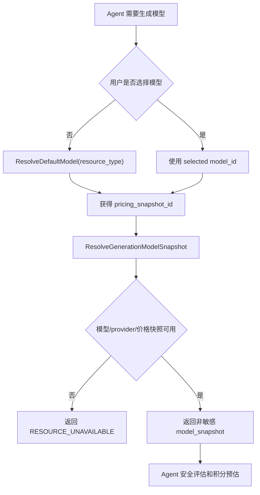
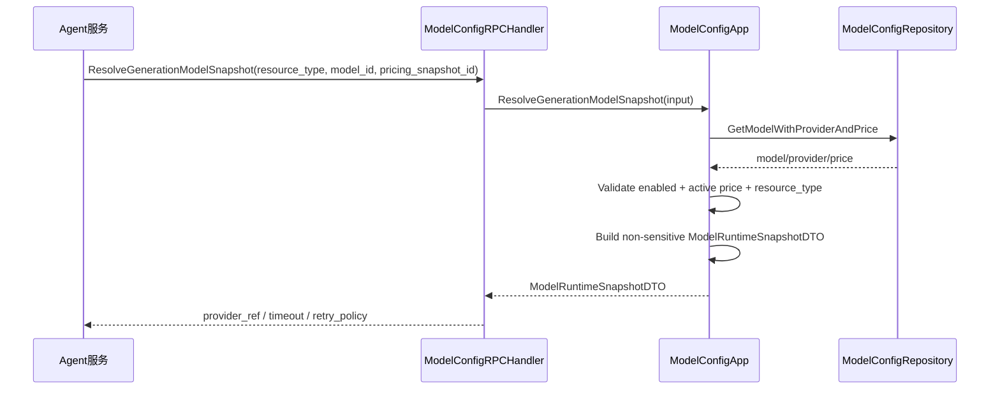

# 06-模型供应商模型目录价格与默认模型设计

状态：archived
owner：业务服务责任域
更新时间：2026-06-28
适用范围：模型供应商、加密凭证、模型目录、生成模型价格、默认模型、Agent 可选模型查询  
相关代码路径：`services/business/internal/application/modelconfig/**`、`services/business/internal/domain/modelconfig/**`

## 产品事实源

- `docs/product/模型供应商产品系统设计.md`
- `docs/product/模型选择产品系统设计.md`
- `docs/product/prd/03-模型供应商模型选择与单价PRD.md`
- `docs/product/积分扣费产品系统设计.md`

## 目标

业务服务保存模型供应商、密钥引用、模型目录、用户积分单价和默认模型。普通用户只看到可选模型展示名，不看到供应商、API Key、endpoint、内部模型 ID 和内部成本。

## 非目标

- 不在业务服务内调用生成模型完成创作，模型调用由 Agent Tool 或模型适配器负责。
- 不向普通用户返回供应商 endpoint、API Key、内部模型名和内部成本。
- 不保存供应商原始响应正文。

## 需求映射矩阵

| 产品条目 | 业务解释 | 业务产出 | 【Agent开发】依赖 |
| --- | --- | --- | --- |
| 后台模型供应商管理 | 管理供应商、API Key 指纹、连通性状态 | `model_providers`、`model_provider_credentials`、`model_connectivity_tests` | 无 |
| 模型目录和价格 | 后台维护模型类型、展示名、价格快照 | `models`、`model_prices` | 预估前传 `model_id`、`pricing_snapshot_id` |
| 默认模型 | 每个生成资源类型解析默认模型 | `default_models`、`ResolveDefaultModel` | 用户未选模型时调用 |
| 用户端模型选择 | 普通用户只看可用生成模型展示字段 | `ListAvailableGenerationModels`、`GenerationModelDTO` | 只展示业务返回的 `display_name` 和价格摘要 |
| 生成执行前模型快照 | 业务在确认前返回非敏感运行快照，Agent 执行 Tool 只使用该快照 | `ResolveGenerationModelSnapshot`、`ModelRuntimeSnapshotDTO` | Agent 不读取供应商密钥，不自行拼接 provider runtime 参数 |

## 领域模型

| 模型 | 状态 | 说明 |
| --- | --- | --- |
| Provider | `active`、`disabled` | 供应商配置 |
| Credential | `active`、`rotating`、`disabled` | 加密密钥 |
| Model | `enabled`、`disabled` | 生成类和内部模型目录 |
| DefaultModel | active | 每个生成类型一个默认模型 |
| ModelPrice | active by time | 模型价格快照 |

## 数据库表

| 表 | 字段 | 索引和约束 |
| --- | --- | --- |
| `model_providers` | `provider_id`、`display_name`、`status`、`connectivity_status`、`last_tested_at` | `provider_id` 唯一 |
| `model_provider_credentials` | `credential_id`、`provider_id`、`encrypted_api_key`、`key_fingerprint`、`status` | `provider_id,status` |
| `models` | `model_id`、`provider_id`、`model_type`、`display_name`、`internal_model_name`、`status` | `(model_type,status)` |
| `model_prices` | `price_id`、`model_id`、`resource_type`、`unit`、`user_credit_price`、`internal_cost`、`effective_at` | `(model_id,effective_at)` |
| `default_models` | `model_type`、`model_id`、`updated_by`、`updated_at` | `model_type` 唯一 |

不创建数据库级外键；密钥字段必须加密，日志只记录 `key_fingerprint`。

## 详细数据库表设计

### `model_providers`

| 字段 | 类型 | 必填 | 默认值 | 索引/约束 | 说明 |
| --- | --- | --- | --- | --- | --- |
| `provider_id` | varchar(64) | 是 | 生成 | pk/unique | 供应商 ID |
| `provider_key` | varchar(64) | 是 |  | unique | 稳定 key，例如 `volcengine` |
| `display_name` | varchar(120) | 是 |  | idx | 后台展示名 |
| `endpoint` | varchar(512) | 否 | null |  | 供应商 endpoint，日志脱敏 |
| `status` | varchar(32) | 是 | `active` | idx | `active`、`disabled` |
| `connectivity_status` | varchar(32) | 是 | `untested` | idx | `untested`、`connected`、`failed` |
| `last_tested_at` | timestamptz | 否 | null | idx | 最近连通性测试时间 |
| `created_by` | varchar(64) | 是 |  | idx | 后台管理员 |
| `updated_by` | varchar(64) | 是 |  | idx | 最近更新管理员 |
| `created_at` | timestamptz | 是 | now() | idx | 创建时间 |
| `updated_at` | timestamptz | 是 | now() |  | 更新时间 |

### `model_provider_credentials`

| 字段 | 类型 | 必填 | 默认值 | 索引/约束 | 说明 |
| --- | --- | --- | --- | --- | --- |
| `credential_id` | varchar(64) | 是 | 生成 | pk/unique | 凭证 ID |
| `provider_id` | varchar(64) | 是 |  | idx composite | 供应商 ID |
| `encrypted_api_key` | text | 是 |  |  | 加密后的 API Key |
| `key_fingerprint` | varchar(128) | 是 |  | idx | 指纹，用于审计和展示 |
| `status` | varchar(32) | 是 | `active` | idx composite | `active`、`rotating`、`disabled` |
| `version_no` | int | 是 | 1 |  | 凭证版本 |
| `created_by` | varchar(64) | 是 |  | idx | 创建管理员 |
| `disabled_by` | varchar(64) | 否 | null |  | 停用管理员 |
| `created_at` | timestamptz | 是 | now() | idx | 创建时间 |
| `updated_at` | timestamptz | 是 | now() |  | 更新时间 |

约束：同一 `provider_id` 只能有一个 `active` 凭证，由 application 事务和唯一 partial index 保证。

### `models`

| 字段 | 类型 | 必填 | 默认值 | 索引/约束 | 说明 |
| --- | --- | --- | --- | --- | --- |
| `model_id` | varchar(64) | 是 | 生成 | pk/unique | 业务模型 ID |
| `provider_id` | varchar(64) | 是 |  | idx | 供应商 ID |
| `model_type` | varchar(32) | 是 |  | idx composite | `generation`、`text`、`vision` 等 |
| `resource_type` | varchar(32) | 否 | null | idx composite | `image`、`music`、`video`、`file` |
| `display_name` | varchar(120) | 是 |  | idx | 用户可见名称 |
| `internal_model_name` | varchar(256) | 是 |  |  | 供应商模型名，普通用户不返回 |
| `status` | varchar(32) | 是 | `enabled` | idx composite | `enabled`、`disabled` |
| `capability_tags` | jsonb | 是 | `[]` |  | 能力标签 |
| `created_by` | varchar(64) | 是 |  | idx | 创建管理员 |
| `updated_by` | varchar(64) | 是 |  | idx | 更新管理员 |
| `created_at` | timestamptz | 是 | now() | idx | 创建时间 |
| `updated_at` | timestamptz | 是 | now() |  | 更新时间 |

查询路径：用户模型选择按 `(model_type, resource_type, status)`；后台模型列表按 `(provider_id,status,created_at desc)`。

### `model_prices`

| 字段 | 类型 | 必填 | 默认值 | 索引/约束 | 说明 |
| --- | --- | --- | --- | --- | --- |
| `price_id` | varchar(64) | 是 | 生成 | pk/unique | 价格快照 ID |
| `model_id` | varchar(64) | 是 |  | idx composite | 模型 ID |
| `resource_type` | varchar(32) | 是 |  | idx | 资源类型 |
| `unit` | varchar(32) | 是 |  |  | `image`、`song`、`second`、`token` |
| `user_credit_price` | numeric(18,6) | 是 | 0 |  | 用户积分单价 |
| `internal_cost` | numeric(18,6) | 是 | 0 |  | 内部成本，后台可见 |
| `currency` | varchar(16) | 否 | null |  | 内部成本币种 |
| `effective_at` | timestamptz | 是 | now() | idx composite | 生效时间 |
| `created_by` | varchar(64) | 是 |  | idx | 创建管理员 |
| `created_at` | timestamptz | 是 | now() | idx | 创建时间 |

价格不更新原行，改价新增快照。Agent 预估和扣费必须携带 `price_id`。

### `default_models`

| 字段 | 类型 | 必填 | 默认值 | 索引/约束 | 说明 |
| --- | --- | --- | --- | --- | --- |
| `default_id` | varchar(64) | 是 | 生成 | pk/unique | 默认配置 ID |
| `model_type` | varchar(32) | 是 |  | unique composite | 模型类型 |
| `resource_type` | varchar(32) | 否 | null | unique composite | 资源类型 |
| `model_id` | varchar(64) | 是 |  | idx | 默认模型 |
| `updated_by` | varchar(64) | 是 |  | idx | 管理员 |
| `reason` | varchar(512) | 否 | null |  | 变更原因 |
| `created_at` | timestamptz | 是 | now() | idx | 创建时间 |
| `updated_at` | timestamptz | 是 | now() |  | 更新时间 |

唯一约束：`(model_type, resource_type)`。停用默认模型前必须切换默认模型。

### `model_connectivity_tests`

| 字段 | 类型 | 必填 | 默认值 | 索引/约束 | 说明 |
| --- | --- | --- | --- | --- | --- |
| `test_id` | varchar(64) | 是 | 生成 | pk/unique | 连通性测试 ID |
| `provider_id` | varchar(64) | 是 |  | idx | 供应商 ID |
| `model_id` | varchar(64) | 否 | null | idx | 测试模型 |
| `status` | varchar(32) | 是 |  | idx | `connected`、`failed` |
| `failure_summary` | varchar(512) | 否 | null |  | 脱敏失败摘要 |
| `latency_ms` | int | 否 | null |  | 测试耗时 |
| `tested_by` | varchar(64) | 是 |  | idx | 管理员 |
| `trace_id` | varchar(128) | 是 |  | idx | 链路追踪 |
| `created_at` | timestamptz | 是 | now() | idx | 测试时间 |

## 业务能力接口清单

| 能力 | 调用方 | 接口形态 | 核心模型 | 幂等 | 审计 |
| --- | --- | --- | --- | --- | --- |
| 可选生成模型列表 | 用户端、Agent | HTTP `GET /api/models/generation`；RPC `ListAvailableGenerationModels` | `Model`、`ModelPrice` | 否 | 否 |
| 默认生成模型解析 | Agent | RPC `ResolveDefaultModel` | `DefaultModel` | 否 | 否 |
| 生成模型运行快照解析 | Agent | RPC `ResolveGenerationModelSnapshot` | `Model`、`ModelPrice`、`Provider` | 否 | 否 |
| 供应商列表/详情 | 管理端 | HTTP `GET /api/admin/models/providers` | `Provider` | 否 | 否 |
| 新增/编辑供应商 | 管理端 | HTTP `POST /api/admin/models/providers`、`PATCH /:provider_id` | `Provider`、`Credential` | 是 | 是 |
| 供应商连通性测试 | 管理端 | HTTP `POST /api/admin/models/providers/:provider_id/connectivity-test` | `ConnectivityResult` | 是 | 是 |
| 模型目录列表 | 管理端 | HTTP `GET /api/admin/models` | `ModelDTO` | 否 | 否 |
| 新增/编辑模型和价格 | 管理端 | HTTP `POST /api/admin/models`、`PATCH /:model_id` | `Model`、`ModelPrice` | 是 | 是 |
| 设置默认模型 | 管理端 | HTTP `POST /api/admin/models/default` | `DefaultModel` | 是 | 是 |
| 启停模型 | 管理端 | HTTP `POST /api/admin/models/:model_id/status` | `Model.status` | 是 | 是 |

## HTTP API 设计

| Method | Path | 鉴权 | Request DTO | Response DTO | 页面状态 |
| --- | --- | --- | --- | --- | --- |
| GET | `/api/models/generation` | user | `ListGenerationModelsRequest` | `GenerationModelListDTO` | `loading`、`unavailable`、`success` |
| GET | `/api/admin/models/providers` | admin | `ListProvidersRequest` | `PageResult<ModelProviderDTO>` | `loading`、`empty` |
| POST | `/api/admin/models/providers` | admin | `UpsertProviderRequest` + `Idempotency-Key` | `ModelProviderDTO` | `confirming`、`success` |
| PATCH | `/api/admin/models/providers/:provider_id` | admin | `UpsertProviderRequest` + `Idempotency-Key` | `ModelProviderDTO` | `success` |
| POST | `/api/admin/models/providers/:provider_id/connectivity-test` | admin | `TestProviderConnectivityRequest` + `Idempotency-Key` | `ConnectivityResultDTO` | `testing`、`connected`、`failed` |
| GET | `/api/admin/models` | admin | `ListModelsRequest` | `PageResult<AdminModelDTO>` | `loading`、`empty`、`price_missing` |
| POST | `/api/admin/models` | admin | `UpsertModelRequest` + `Idempotency-Key` | `AdminModelDTO` | `success` |
| PATCH | `/api/admin/models/:model_id` | admin | `UpsertModelRequest` + `Idempotency-Key` | `AdminModelDTO` | `success` |
| POST | `/api/admin/models/default` | admin | `SetDefaultModelRequest` + `Idempotency-Key` | `DefaultModelDTO` | `confirming`、`success` |
| POST | `/api/admin/models/:model_id/status` | admin | `SetModelStatusRequest` + `Idempotency-Key` | `AdminModelDTO` | `confirming`、`enabled`、`disabled` |

## DTO 设计

| DTO | 字段 |
| --- | --- |
| `ListGenerationModelsRequest` | `resource_type` image/music/video、`project_id` 可选 |
| `GenerationModelListDTO` | `models[]`、`default_model_id` |
| `GenerationModelDTO` | `model_id`、`display_name`、`resource_type`、`unit`、`user_credit_price`、`pricing_snapshot_id`、`is_default`、`status` |
| `ModelRuntimeSnapshotDTO` | `model_id`、`resource_type`、`provider_ref`、`public_display_name`、`pricing_snapshot_id`、`timeout_ms`、`retry_policy`、`runtime_params` 非敏感摘要 |
| `ListProvidersRequest` | `keyword`、`status`、`connectivity_status`、`PaginationRequest` |
| `ModelProviderDTO` | `provider_id`、`display_name`、`status`、`connectivity_status`、`key_fingerprint`、`last_tested_at` |
| `UpsertProviderRequest` | `provider_id` 可选、`display_name`、`endpoint` 可选、`api_key_secret` 写入时必填、`status`、`reason` |
| `TestProviderConnectivityRequest` | `provider_id`、`test_model_id` 可选、`reason` |
| `ConnectivityResultDTO` | `provider_id`、`status` connected/failed、`tested_at`、`failure_summary` 脱敏 |
| `ListModelsRequest` | `provider_id`、`model_type`、`resource_type`、`status`、`PaginationRequest` |
| `AdminModelDTO` | `model_id`、`provider_id`、`provider_name`、`model_type`、`resource_type`、`display_name`、`internal_model_name_masked`、`status`、`latest_price`、`is_default` |
| `UpsertModelRequest` | `model_id` 可选、`provider_id`、`model_type`、`resource_type`、`display_name`、`internal_model_name`、`status`、`price`、`reason` |
| `SetDefaultModelRequest` | `model_type` 或 `resource_type`、`model_id`、`reason` |
| `SetModelStatusRequest` | `model_id`、`target_status`、`reason` |

## RPC 设计

### ModelConfigService.ListAvailableGenerationModels

请求字段：`resource_type=image/music/video`、`auth_context`、`request_meta`、分页可选。响应：

| 字段 | 类型 | 说明 |
| --- | --- | --- |
| `models[]` | list | 用户可见模型 |
| `model_id` | string | 业务模型 ID |
| `display_name` | string | 用户可见名称 |
| `resource_type` | enum | 图片/音乐/视频 |
| `pricing_snapshot_id` | string | 价格快照 |
| `unit` | enum | image / song / second |
| `is_default` | bool | 是否默认 |

### ModelConfigService.ResolveDefaultModel

请求：`resource_type`、`auth_context`。响应：默认模型摘要和价格快照。无默认或默认 disabled 返回 `RESOURCE_UNAVAILABLE`。

### ModelConfigService.ResolveGenerationModelSnapshot

调用方：Agent 在生成确认前锁定模型，或确认后执行 Tool 前二次校验。

请求字段：`resource_type`、`model_id`、`pricing_snapshot_id`、`auth_context`、`request_meta`。

响应字段：

| 字段 | 类型 | 说明 |
| --- | --- | --- |
| `model_id` | string | 业务模型 ID |
| `resource_type` | enum | image/music/video |
| `provider_ref` | string | Agent adapter 可识别的非敏感供应商引用，不能是 API Key 或 endpoint 明文 |
| `public_display_name` | string | 用户可见名称 |
| `pricing_snapshot_id` | string | 价格快照，必须与请求一致且 active |
| `timeout_ms` | int | 该资源类型生成超时 |
| `retry_policy` | object | `max_attempts`、`initial_backoff_ms`、`max_backoff_ms` |
| `runtime_params` | object | 非敏感执行参数，例如分辨率上限、供应商能力标签摘要 |

规则：

- `model_id` disabled、provider disabled、价格快照失效或 resource_type 不匹配时返回 `RESOURCE_UNAVAILABLE`。
- 业务不得返回 `encrypted_api_key`、API Key 明文、内部成本、后台 endpoint 明文或内部模型密钥；Agent 只能拿到 adapter 所需的非敏感引用。
- 确认后如果模型被停用，Agent 执行前调用本 RPC 返回 `RESOURCE_UNAVAILABLE`，应释放冻结并输出用户可见失败。

### 后台写操作

`UpsertProvider`、`TestProviderConnectivity`、`UpsertModel`、`SetDefaultModel`、`SetModelStatus`。停用默认模型必须先切换默认模型或通过 preview/confirm 给出影响摘要。

## Application 函数

```go
type ModelConfigApp interface {
    ListAvailableGenerationModels(ctx context.Context, in ListGenerationModelsInput) (Page[GenerationModelDTO], error)
    ResolveDefaultModel(ctx context.Context, in ResolveDefaultModelInput) (GenerationModelDTO, error)
    ResolveGenerationModelSnapshot(ctx context.Context, in ResolveGenerationModelSnapshotInput) (ModelRuntimeSnapshotDTO, error)
    ListProviders(ctx context.Context, in ListProvidersInput) (Page[ProviderDTO], error)
    ListAdminModels(ctx context.Context, in ListModelsInput) (Page[ModelDTO], error)
    UpsertProvider(ctx context.Context, in UpsertProviderInput) (ProviderDTO, error)
    TestProviderConnectivity(ctx context.Context, in TestProviderInput) (ConnectivityResult, error)
    UpsertModel(ctx context.Context, in UpsertModelInput) (ModelDTO, error)
    SetDefaultModel(ctx context.Context, in SetDefaultModelInput) (DefaultModelDTO, error)
    SetModelStatus(ctx context.Context, in SetModelStatusInput) (ModelDTO, error)
}
```

## 业务流程图



## 代码逻辑图



## 业务规则

- 普通用户只能获取图片、音乐、视频生成模型的展示名和本次预估所需价格快照。
- 文本模型、视觉理解模型由平台和 Tool 决定，不对普通用户展示为可选。
- disabled 模型不能被选择。
- disabled 模型不能生成运行快照；已创建确认但尚未执行的 run 必须在执行前被 Agent 重新解析并阻断。
- 默认模型不能直接停用，除非先设置新的 enabled 默认模型。
- 价格为 0 仍可返回预估，前端仍展示确认。
- 后台 API Key 写入必须加密；返回和审计只展示 fingerprint。

## 事务设计

| 事务 | 原子写入 | 回滚条件 |
| --- | --- | --- |
| 新增/编辑供应商 | `model_providers`、`model_provider_credentials`、审计、幂等记录 | 密钥加密失败、provider_key 冲突、审计失败 |
| 连通性测试 | `model_connectivity_tests`、`model_providers.connectivity_status`、审计、幂等记录 | provider 不存在、上游超时按 failed 结果入库 |
| 新增/编辑模型和价格 | `models`、新增 `model_prices`、审计、幂等记录 | provider disabled、价格非法、审计失败 |
| 设置默认模型 | `default_models`、审计、幂等记录 | 模型不存在、模型 disabled、资源类型不匹配 |
| 启停模型 | `models.status`、审计、幂等记录 | 停用当前默认模型且未切换默认模型 |

## 日志和审计

| 动作 | `business_action` | 审计内容 |
| --- | --- | --- |
| 新增/编辑供应商 | `model.provider.upsert` | provider_id、display_name、status、key_fingerprint、原因 |
| 供应商连通性测试 | `model.provider.connectivity_test` | provider_id、结果、failure_summary 脱敏、原因 |
| 新增/编辑模型和价格 | `model.upsert` | model_id、provider_id、resource_type、status、price_snapshot_id、原因 |
| 设置默认模型 | `model.default.set` | resource_type、before_model_id、after_model_id、原因 |
| 启停模型 | `model.status.set` | model_id、before_status、after_status、原因 |

日志字段必须包含 `trace_id`、`admin_id`、`business_action`、`resource_id`、`result`、`latency_ms`。审计和日志禁止保存 API Key 明文、供应商完整响应、内部模型密钥或用户私有内容。

## 【Agent开发】需要提供的能力与参数

| 【Agent开发】场景 | 业务 RPC | Agent 必传参数 | 返回字段 | Agent 行为 |
| --- | --- | --- | --- | --- |
| 展示聊天输入框模型选择 | `ListAvailableGenerationModels` | `resource_type`、`space_id`、`actor_user_id` | `model_id`、`display_name`、`pricing_snapshot_id` | 只向前端展示 `display_name` |
| 用户未选模型 | `ResolveDefaultModel` | `resource_type` | 默认模型和价格快照 | 使用默认模型进入安全评估和预估 |
| 进入确认前锁定模型 | `ResolveGenerationModelSnapshot` | `resource_type`、`model_id`、`pricing_snapshot_id`、`auth_context` | 非敏感 `model_snapshot` | 确认后不得修改模型；执行前如快照不可用则释放冻结并失败 |
| 积分预估 | `EstimateGenerationCredits` | `model_id`、`pricing_snapshot_id`、数量/秒数 | 积分预估 | 价格快照必须来自业务返回 |

## 测试

- disabled 模型不在可选列表。
- 默认模型缺失返回 `RESOURCE_UNAVAILABLE`。
- 停用默认模型被拒绝。
- 普通模型列表不含供应商、endpoint、API Key、内部成本。
- 价格快照变更后历史预估使用原快照。
- `ResolveGenerationModelSnapshot` 不返回 API Key、endpoint 明文、内部成本；模型停用、provider 停用、价格快照不匹配均返回 `RESOURCE_UNAVAILABLE`。
