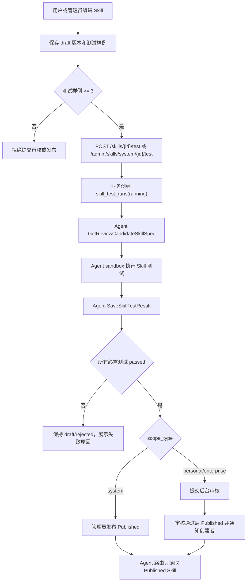
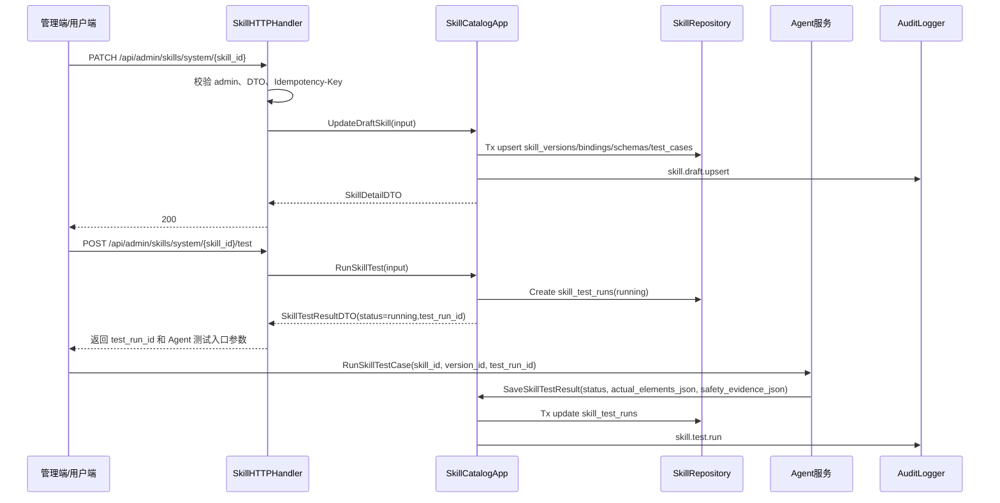

# 08-Skill目录版本审核发布回滚与通知设计

状态：archived
owner：业务服务责任域
更新时间：2026-06-28
适用范围：系统 Skill、企业 Skill、个人 Skill、版本、输出元素结构、测试样例、审核、发布、废弃、回滚和通知  
相关代码路径：`services/business/internal/application/skillcatalog/**`、`services/business/internal/domain/skillcatalog/**`

## 产品事实源

- `docs/product/SkillBuilder产品系统设计.md`
- `docs/product/prd/05-SkillBuilder与审核PRD.md`
- `docs/product/Tool边界产品系统设计.md`
- `docs/product/prd/11-站内信与通知PRD.md`

## 目标

业务服务保存 Skill 生命周期和可路由 runtime spec。只有 Published Skill 能被 Agent 路由。Skill 输出元素结构只能使用平台内置资产元素类型。

## 非目标

- 不执行 Eino Skill 编排，不保存 Agent run、message、blackboard 或 memory 事实。
- 不暴露系统 Prompt、供应商密钥、平台内部安全策略细节。
- 不允许业务服务替 Agent 决定工具执行结果；业务只保存测试样例、spec 和测试结果。

## 需求映射矩阵

| 产品条目 | 业务解释 | 业务产出 | 【Agent开发】依赖 |
| --- | --- | --- | --- |
| Skill 创建/编辑 | 版本化保存 Skill 配置和输出元素结构 | `skills`、`skill_versions`、`skill_output_element_schemas` | 无 |
| Tool 绑定 | 只能绑定平台开放 Tool | `skill_tool_bindings` | 执行前仍调用 `CheckToolExecutionPolicy` |
| Skill 确认规则 | Skill 可以声明运行中需要确认的动作，但不能绕过平台高风险确认、积分确认和业务写入确认 | `skill_versions.confirmation_policy`、`PublishedSkillSpecDTO.confirmation_policy` | Agent 合并确认策略并生产 `confirmation.required` |
| Skill 测试 | 业务创建测试运行，Agent 执行并回写结果 | `skill_test_cases`、`skill_test_runs`、`GetReviewCandidateSkillSpec`、`SaveSkillTestResult` | Agent sandbox 执行并回传实际元素和安全证据 |
| 审核发布 | 企业/个人 Skill 经后台审核，系统 Skill 测试通过后发布 | `skill_review_records`、审核 HTTP API | 审核通过后 Published Skill 可被 Agent 路由 |
| 审核通知 | 审核结果通知创建者 | `NotificationService.CreateNotification` | Agent 不生产站内信 |
| Memory 默认开启并可配置作用域 | 未传策略时业务写入 session summary 默认策略；显式配置 user/space scope 时保留授权要求和保留周期 | `skill_versions.memory_policy` | Agent 按 runtime spec 和用户授权交集使用 Memory |

## 数据库表

| 表 | 字段 | 索引和约束 |
| --- | --- | --- |
| `skills` | `skill_id`、`scope_type`、`space_id`、`creator_user_id`、`status`、`latest_version_id` | `(scope_type,space_id,status)` |
| `skill_versions` | `version_id`、`skill_id`、`version_no`、`content_snapshot`、`created_by` | `(skill_id,version_no)` 唯一 |
| `skill_tool_bindings` | `binding_id`、`skill_id`、`version_id`、`tool_id`、`status` | `skill_id,version_id` |
| `skill_output_element_schemas` | `schema_id`、`skill_id`、`version_id`、`element_type`、`required`、`schema_json` | `element_type` 来自系统字典 |
| `skill_test_cases` | `test_case_id`、`skill_id`、`version_id`、`input_snapshot`、`expected_elements`、`status` | 发布前至少 3 个 |
| `skill_review_records` | `review_id`、`skill_id`、`version_id`、`reviewer_admin_id`、`result`、`comment` | 审核队列索引 |

## 详细数据库表设计

### `skills`

| 字段 | 类型 | 必填 | 默认值 | 索引/约束 | 说明 |
| --- | --- | --- | --- | --- | --- |
| `skill_id` | varchar(64) | 是 | 生成 | pk/unique | Skill ID |
| `scope_type` | varchar(32) | 是 |  | idx composite | `system`、`personal`、`enterprise` |
| `space_id` | varchar(64) | 否 | null | idx composite | 个人/企业空间 |
| `creator_user_id` | varchar(64) | 否 | null | idx | 创建者 |
| `display_name` | varchar(120) | 是 |  | idx | 展示名 |
| `description` | varchar(512) | 否 | null |  | 描述 |
| `status` | varchar(32) | 是 | `draft` | idx composite | `draft`、`pending_review`、`rejected`、`published`、`deprecated` |
| `latest_version_id` | varchar(64) | 否 | null | idx | 最新版本 |
| `published_version_id` | varchar(64) | 否 | null | idx | 当前发布版本 |
| `created_by_admin_id` | varchar(64) | 否 | null | idx | 系统 Skill 创建管理员 |
| `created_at` | timestamptz | 是 | now() | idx | 创建时间 |
| `updated_at` | timestamptz | 是 | now() |  | 更新时间 |

路由查询索引：`(scope_type, space_id, status, updated_at desc)`；只有 `status=published` 且 `published_version_id` 非空可被 Agent 路由。

### `skill_versions`

| 字段 | 类型 | 必填 | 默认值 | 索引/约束 | 说明 |
| --- | --- | --- | --- | --- | --- |
| `version_id` | varchar(64) | 是 | 生成 | pk/unique | 版本 ID |
| `skill_id` | varchar(64) | 是 |  | unique composite/idx | Skill ID |
| `version_no` | int | 是 |  | unique composite | 递增版本号 |
| `content_snapshot` | jsonb | 是 | `{}` |  | Skill 配置快照，不含密钥 |
| `intent_descriptions` | jsonb | 是 | `[]` |  | 路由意图描述 |
| `input_schema` | jsonb | 是 | `{}` |  | 输入 schema |
| `output_schema` | jsonb | 是 | `{}` |  | 输出 schema |
| `memory_policy` | jsonb | 是 | `{"enabled":true,"allowed_scopes":["session_summary"],"retention_days":30,"requires_user_authorization":true}` |  | Agent memory 策略摘要；未显式关闭时默认开启 session summary，其他 scope 必须授权 |
| `confirmation_policy` | jsonb | 是 | `{"required_actions":["credit_freeze"],"min_confirm_level":"standard","lock_fields":["model_id","pricing_snapshot_id","quantity","duration_seconds"],"expires_in_seconds":600}` |  | Skill 运行确认策略；只能加强平台确认规则 |
| `status` | varchar(32) | 是 | `draft` | idx | `draft`、`submitted`、`published`、`deprecated` |
| `created_by` | varchar(64) | 是 |  | idx | 用户或管理员 |
| `created_at` | timestamptz | 是 | now() | idx | 创建时间 |

唯一约束：`(skill_id, version_no)`。版本不可原地覆盖，编辑态创建或更新状态值为 `draft` 的版本。

### `skill_tool_bindings`

| 字段 | 类型 | 必填 | 默认值 | 索引/约束 | 说明 |
| --- | --- | --- | --- | --- | --- |
| `binding_id` | varchar(64) | 是 | 生成 | pk/unique | 绑定 ID |
| `skill_id` | varchar(64) | 是 |  | idx | Skill ID |
| `version_id` | varchar(64) | 是 |  | unique composite/idx | 版本 ID |
| `tool_id` | varchar(64) | 是 |  | unique composite/idx | Tool ID |
| `tool_key` | varchar(120) | 是 |  | idx | Tool key 快照 |
| `binding_config` | jsonb | 是 | `{}` |  | 绑定参数 |
| `status` | varchar(32) | 是 | `active` | idx | `active`、`disabled` |
| `created_at` | timestamptz | 是 | now() | idx | 创建时间 |
| `updated_at` | timestamptz | 是 | now() |  | 更新时间 |

唯一约束：`(version_id, tool_id)`。发布校验必须确认 Tool 仍 enabled。

### `skill_output_element_schemas`

| 字段 | 类型 | 必填 | 默认值 | 索引/约束 | 说明 |
| --- | --- | --- | --- | --- | --- |
| `schema_id` | varchar(64) | 是 | 生成 | pk/unique | 输出元素 schema ID |
| `skill_id` | varchar(64) | 是 |  | idx | Skill ID |
| `version_id` | varchar(64) | 是 |  | idx composite | 版本 ID |
| `element_type` | varchar(64) | 是 |  | idx composite | 内置资产元素类型 |
| `required` | boolean | 是 | false |  | 是否必填 |
| `schema_json` | jsonb | 是 | `{}` |  | 元素 payload schema |
| `usage_stage` | varchar(32) | 是 | `draft_and_final` | idx | `draft`、`final`、`draft_and_final` |
| `draft_enabled` | boolean | 是 | true |  | 是否允许过程态输出 |
| `final_enabled` | boolean | 是 | true |  | 是否允许最终资产输出 |
| `editable` | boolean | 是 | false |  | 用户端是否可编辑 |
| `referable` | boolean | 是 | true |  | 是否可作为后续 Agent 输入引用 |
| `render_hint` | varchar(64) | 否 | null |  | 前端渲染提示 |
| `display_order` | int | 是 | 0 |  | 展示顺序 |
| `created_at` | timestamptz | 是 | now() | idx | 创建时间 |

校验：`element_type` 必须存在于 `asset_element_types` 的 active 类型，由 application 校验。

### `skill_test_cases`

| 字段 | 类型 | 必填 | 默认值 | 索引/约束 | 说明 |
| --- | --- | --- | --- | --- | --- |
| `test_case_id` | varchar(64) | 是 | 生成 | pk/unique | 测试样例 ID |
| `skill_id` | varchar(64) | 是 |  | idx | Skill ID |
| `version_id` | varchar(64) | 是 |  | idx composite | 版本 ID |
| `input_snapshot` | jsonb | 是 | `{}` |  | 测试输入 |
| `expected_elements` | jsonb | 是 | `[]` |  | 期望元素摘要 |
| `status` | varchar(32) | 是 | `active` | idx | `active`、`disabled` |
| `created_by` | varchar(64) | 是 |  | idx | 创建者 |
| `created_at` | timestamptz | 是 | now() | idx | 创建时间 |
| `updated_at` | timestamptz | 是 | now() |  | 更新时间 |

发布前 active 测试样例不少于 3 个。

### `skill_test_runs`

| 字段 | 类型 | 必填 | 默认值 | 索引/约束 | 说明 |
| --- | --- | --- | --- | --- | --- |
| `test_run_id` | varchar(64) | 是 | 生成 | pk/unique | 测试运行 ID |
| `skill_id` | varchar(64) | 是 |  | idx | Skill ID |
| `version_id` | varchar(64) | 是 |  | idx | 版本 ID |
| `test_case_id` | varchar(64) | 否 | null | idx | 测试样例 |
| `status` | varchar(32) | 是 | `running` | idx | `running`、`passed`、`failed`、`blocked`、`timeout`、`rejected` |
| `actual_elements` | jsonb | 是 | `[]` |  | Agent 返回的元素摘要 |
| `safety_evidence_json` | jsonb | 是 | `{}` |  | Agent 测试安全证据摘要 |
| `error_summary` | varchar(512) | 否 | null |  | 脱敏错误摘要 |
| `agent_trace_id` | varchar(128) | 否 | null | idx | Agent 测试 trace |
| `started_by` | varchar(64) | 是 |  | idx | 发起者 |
| `created_at` | timestamptz | 是 | now() | idx | 创建时间 |
| `updated_at` | timestamptz | 是 | now() |  | 更新时间 |

### `skill_review_records`

| 字段 | 类型 | 必填 | 默认值 | 索引/约束 | 说明 |
| --- | --- | --- | --- | --- | --- |
| `review_id` | varchar(64) | 是 | 生成 | pk/unique | 审核记录 ID |
| `skill_id` | varchar(64) | 是 |  | idx | Skill ID |
| `version_id` | varchar(64) | 是 |  | idx | 版本 ID |
| `scope_type` | varchar(32) | 是 |  | idx | personal/enterprise |
| `status` | varchar(32) | 是 | `pending` | idx composite | `pending`、`approved`、`rejected` |
| `submitter_user_id` | varchar(64) | 是 |  | idx | 提交人 |
| `reviewer_admin_id` | varchar(64) | 否 | null | idx | 审核管理员 |
| `comment` | varchar(1000) | 否 | null |  | 审核意见，可空 |
| `submitted_at` | timestamptz | 是 | now() | idx | 提交时间 |
| `reviewed_at` | timestamptz | 否 | null | idx | 审核时间 |
| `created_at` | timestamptz | 是 | now() | idx | 创建时间 |
| `updated_at` | timestamptz | 是 | now() |  | 更新时间 |

审核队列按 `(status, submitted_at asc)` 分页。

## 业务能力接口清单

| 能力 | 调用方 | 接口形态 | 核心模型 | 幂等 | 审计 |
| --- | --- | --- | --- | --- | --- |
| 用户/企业 Skill 列表 | 用户端 | HTTP `GET /api/skills`、`GET /api/enterprise/skills` | `Skill` | 否 | 否 |
| 创建/编辑 Skill 编辑态 | 用户端 | HTTP `POST /api/skills`、`PATCH /api/skills/:skill_id` | `Skill`、`SkillVersion` | 是 | 是 |
| Skill 测试 | 用户端、管理端 | HTTP `POST /api/skills/:skill_id/test`、`/api/admin/skills/system/:skill_id/test` | `SkillTestCase` | 是 | 是 |
| 提交审核 | 用户端 | HTTP `POST /api/skills/:skill_id/submit-review` | `SkillReviewRecord` | 是 | 是 |
| Agent 路由 Skill 池 | Agent | RPC `ListRoutableSkills` | Published Skill | 否 | 否 |
| Agent 获取 runtime spec | Agent | RPC `GetPublishedSkillSpec` | `PublishedSkillSpecDTO` | 否 | 否 |
| Agent 获取待审核/测试 Skill spec | Agent | RPC `GetReviewCandidateSkillSpec` | `ReviewCandidateSkillSpecDTO` | 否 | 否 |
| Agent 保存 Skill 测试结果 | Agent | RPC `SaveSkillTestResult` | `SkillTestRun` | 是 | 是 |
| 后台系统 Skill 管理 | 管理端 | HTTP `/api/admin/skills/system/**` | System Skill | 是 | 是 |
| 后台 Skill 审核 | 管理端 | HTTP `/api/admin/skills/reviews/**` | `SkillReviewRecord` | 是 | 是 |
| Skill 发布/废弃/回滚 | 管理端、用户端 owner | HTTP + Application | `Skill.status`、`SkillVersion` | 是 | 是 |

## HTTP API 设计

| Method | Path | 鉴权 | Request DTO | Response DTO | 页面状态 |
| --- | --- | --- | --- | --- | --- |
| GET | `/api/skills` | user | `ListSkillsRequest` | `PageResult<SkillCardDTO>` | `loading`、`empty` |
| POST | `/api/skills` | user | `CreateSkillDraftRequest` + `Idempotency-Key` | `SkillDetailDTO` | `draft`、`success` |
| GET | `/api/skills/:skill_id` | user | path | `SkillDetailDTO` | `loading`、`permission_denied` |
| PATCH | `/api/skills/:skill_id` | 责任域 | `UpdateSkillDraftRequest` + `Idempotency-Key` | `SkillDetailDTO` | `editing`、`success` |
| POST | `/api/skills/:skill_id/test` | 责任域 | `RunSkillTestRequest` + `Idempotency-Key` | `SkillTestResultDTO` | `testing`、`success`、`error` |
| POST | `/api/skills/:skill_id/submit-review` | 责任域 | `SubmitSkillReviewRequest` + `Idempotency-Key` | `SkillDetailDTO` | `pending_review` |
| POST | `/api/skills/:skill_id/rollback` | 责任域 | `RollbackSkillRequest` + `Idempotency-Key` | `SkillDetailDTO` | `confirming`、`success` |
| GET | `/api/admin/skills/system` | admin | `ListSkillsRequest` | `PageResult<SkillCardDTO>` | `loading`、`empty` |
| POST | `/api/admin/skills/system` | admin | `CreateSkillDraftRequest` + `Idempotency-Key` | `SkillDetailDTO` | `draft` |
| GET | `/api/admin/skills/system/:skill_id` | admin | path | `SkillDetailDTO` | `loading`、`permission_denied` |
| PATCH | `/api/admin/skills/system/:skill_id` | admin | `UpdateSkillDraftRequest` + `Idempotency-Key` | `SkillDetailDTO` | `editing`、`success` |
| POST | `/api/admin/skills/system/:skill_id/test` | admin | `RunSkillTestRequest` + `Idempotency-Key` | `SkillTestResultDTO` | `testing`、`success`、`error` |
| POST | `/api/admin/skills/system/:skill_id/publish` | admin | `PublishSystemSkillRequest` + `Idempotency-Key` | `SkillDetailDTO` | `published` |
| POST | `/api/admin/skills/system/:skill_id/deprecate` | admin | `DeprecateSkillRequest` + `Idempotency-Key` | `SkillDetailDTO` | `deprecated` |
| POST | `/api/admin/skills/system/:skill_id/rollback` | admin | `RollbackSkillRequest` + `Idempotency-Key` | `SkillDetailDTO` | `confirming`、`success` |
| GET | `/api/admin/skills/reviews` | admin | `ListSkillReviewsRequest` | `PageResult<SkillReviewDTO>` | `loading`、`empty`、`pending_review` |
| POST | `/api/admin/skills/reviews/:review_id/confirm` | admin | `ConfirmSkillReviewRequest` + `Idempotency-Key` | `SkillReviewDTO` | `approved`、`rejected` |

## DTO 设计

| DTO | 字段 |
| --- | --- |
| `ListSkillsRequest` | `scope_type` system/personal/enterprise、`status`、`keyword`、`PaginationRequest` |
| `CreateSkillDraftRequest` | `scope_type`、`display_name`、`description`、`intent_descriptions[]`、`input_schema`、`output_schema`、`memory_policy` 可选、`confirmation_policy` 可选、`tool_bindings[]`、`output_element_schemas[]`、`test_cases[]` |
| `UpdateSkillDraftRequest` | `display_name`、`description`、`intent_descriptions[]`、`input_schema`、`output_schema`、`memory_policy` 可选、`confirmation_policy` 可选、`tool_bindings[]`、`output_element_schemas[]`、`test_cases[]`、`base_version_id` |
| `RunSkillTestRequest` | `version_id`、`test_case_id` 可选、`input_snapshot`、`execution_mode=sandbox` |
| `SubmitSkillReviewRequest` | `version_id`、`submit_note` 可选 |
| `ConfirmSkillReviewRequest` | `review_id`、`result` approved/rejected、`comment` 可选、`reason` |
| `PublishSystemSkillRequest` | `version_id`、`reason`、`require_all_tests_passed=true` |
| `DeprecateSkillRequest` | `reason`、`replacement_skill_id` 可选 |
| `RollbackSkillRequest` | `target_version_id`、`reason`、`copy_as_new_draft` bool；系统 Skill 和 owner Skill 均必须生成新版本，不覆盖历史版本 |
| `MemoryPolicyDTO` | `enabled` bool、`allowed_scopes[]` enum `session_summary/user_preference/space_preference`、`retention_days` int、`requires_user_authorization` bool、`write_mode` enum `summary_only`、`redaction_level` enum `strict` |
| `ConfirmationPolicyDTO` | `required_actions[]` enum `credit_freeze/high_risk_tool/business_write/external_publish`、`risk_summary`、`min_confirm_level` enum `none/standard/strong`、`lock_fields[]`、`expires_in_seconds` |
| `OutputElementSchemaDTO` | `element_type`、`required`、`schema_json`、`usage_stage`、`draft_enabled`、`final_enabled`、`editable`、`referable`、`render_hint`、`display_order` |
| `SkillCardDTO` | `skill_id`、`scope_type`、`display_name`、`status`、`latest_version_id`、`published_version_id`、`updated_at` |
| `SkillDetailDTO` | `skill`、`current_version`、`tool_bindings[]`、`output_element_schemas[]`、`test_cases[]`、`review_summary` |
| `PublishedSkillSpecDTO` | `skill_id`、`version_id`、`display_name`、`scope_type`、`intent_descriptions[]`、`behavior_instruction_ref`、`input_schema`、`output_schema`、`output_element_schema[]`、`tool_bindings[]`、`memory_policy`、`confirmation_policy`、`execution_policy_summary` |
| `SkillTestResultDTO` | `test_run_id`、`status` running/passed/failed/blocked/timeout/rejected、`actual_elements[]`、`error_summary`、`agent_trace_id` |
| `SkillReviewDTO` | `review_id`、`skill_id`、`scope_type`、`creator_summary`、`version_id`、`status`、`comment`、`reviewer_admin_id`、`reviewed_at` |

## RPC 设计

### SkillCatalogService.ListRoutableSkills

请求：`space_id`、`actor_user_id`、`intent_hint` 可选、`resource_type` 可选、分页默认 10。响应：Published Skill 摘要列表。

路由范围：

- 个人空间返回系统 Skill 和当前用户个人 Published Skill。
- 企业空间返回系统 Skill、当前企业 Published Skill、当前 actor_user_id 的个人 Published Skill；个人 Skill 在企业空间运行时，输出和扣费均归企业空间。
- 企业空间返回前必须用企业 Tool policy 过滤 Skill 绑定 Tool；任一必需 Tool 被企业禁用或不在 allowlist 时，该 Skill 不返回或返回 `route_hints.unavailable_reason=tool_not_allowed`，由 Agent 阻断。

### SkillCatalogService.GetPublishedSkillSpec

响应字段：

| 字段 | 类型 | 说明 |
| --- | --- | --- |
| `skill_id` | string | Skill ID |
| `version_id` | string | Published 版本 |
| `display_name` | string | 可展示名称 |
| `intent_descriptions[]` | string | 路由提示 |
| `behavior_instruction_ref` | string | 非敏感策略引用或摘要 |
| `input_schema` | object | 输入结构 |
| `output_schema` | object | 输出结构 |
| `output_element_schema[]` | list | 资产元素结构 |
| `tool_bindings[]` | list | 绑定 Tool key |
| `memory_policy` | object | Memory 策略，结构必须符合 `MemoryPolicyDTO` |
| `confirmation_policy` | object | 确认策略，结构必须符合 `ConfirmationPolicyDTO` |
| `execution_policy_summary` | object | 业务侧已过滤后的运行摘要，含 `execution_space_id`、`billing_credit_account_scope`、`tool_policy_digest` |

不得返回系统 Prompt 明文、供应商密钥、内部成本。

### SkillCatalogService.GetReviewCandidateSkillSpec

调用方：Agent Skill 测试运行器。仅用于 owner 或平台管理员触发的 Skill 测试和审核候选版本测试，不参与线上路由。

请求字段：`auth_context`、`request_meta`、`skill_id`、`version_id`、`test_case_id` 可选、`test_run_id` 可选。

响应字段：

| 字段 | 类型 | 说明 |
| --- | --- | --- |
| `skill_id` | string | Skill ID |
| `version_id` | string | 待测试版本 |
| `skill_spec_json` | string | 脱敏 runtime spec JSON |
| `input_schema_json` | string | 输入 schema |
| `output_schema_json` | string | 输出 schema |
| `tool_refs[]` | list | 绑定 Tool key |
| `memory_policy_json` | string | Memory 策略 |
| `confirmation_policy_json` | string | 确认策略 |
| `test_input_json` | string | 测试输入，按 `test_case_id` 或请求输入生成 |
| `expected_elements_json` | string | 期望输出元素摘要 |

### SkillCatalogService.SaveSkillTestResult

调用方：Agent Skill 测试运行器。写操作必须携带 `request_meta.idempotency_key`，格式 `skill_test:<test_run_id>`。

请求字段：`auth_context`、`request_meta`、`skill_id`、`version_id`、`test_run_id`、`test_case_id` 可选、`status=passed|failed|blocked|timeout|rejected`、`actual_elements_json`、`error_code` 可选、`error_summary` 可选、`safety_evidence_json`、`agent_trace_id`。

响应字段：`test_run_id`、`status`、`saved=true`。重复同 key 同 hash 返回同一结果；同 key 不同 hash 返回 `IDEMPOTENCY_CONFLICT`。

`safety_evidence_json` 必须是序列化后的 `SafetyEvidenceDTO`，不能是松散 JSON。除 `status=rejected` 且测试未进入 prompt 组装/安全评估外，其余结果均必须传；`passed`、`blocked`、`timeout` 必填，已组装测试 prompt 后的 `failed` 也必填。字段要求：

| 字段 | 要求 |
| --- | --- |
| `scene` | 必须为 `skill_test`。 |
| `result` | 测试成功必须为 `passed`；安全阻断或评估失败时分别为 `blocked`、`failed`，同时 `status` 不得为 `passed`。 |
| `target_type` | 必须为 `skill_test_prompt`。 |
| `target_ref_id` | 使用 `test_case_id`，无测试样例时使用 `test_run_id`。 |
| `evaluated_object_digest` | Skill 测试输入和组装提示词的摘要，不保存明文。 |
| `expires_at` | 必填，保存结果时必须晚于服务端当前时间。 |
| `source_run_id` | 使用 `test_run_id`。 |
| `trace_id` | 必须等于或能关联 `agent_trace_id`。 |

业务服务保存前校验 `safety_evidence_json` 可解析、枚举合法、证据未过期、`target_ref_id` 与当前测试运行匹配。校验失败返回 `SAFETY_EVIDENCE_INVALID`，不得把测试结果标记为通过。

## Application 函数

```go
type SkillCatalogApp interface {
    ListRoutableSkills(ctx context.Context, in ListRoutableSkillsInput) (Page[SkillSummaryDTO], error)
    GetSkillDetail(ctx context.Context, in GetSkillDetailInput) (SkillDTO, error)
    GetPublishedSkillSpec(ctx context.Context, in GetPublishedSkillSpecInput) (PublishedSkillSpecDTO, error)
    GetReviewCandidateSkillSpec(ctx context.Context, in GetReviewCandidateSkillSpecInput) (ReviewCandidateSkillSpecDTO, error)
    CreateDraftSkill(ctx context.Context, in CreateDraftSkillInput) (SkillDTO, error)
    UpdateDraftSkill(ctx context.Context, in UpdateDraftSkillInput) (SkillDTO, error)
    RunSkillTest(ctx context.Context, in RunSkillTestInput) (SkillTestResultDTO, error)
    SaveSkillTestResult(ctx context.Context, in SaveSkillTestResultInput) (SkillTestResultDTO, error)
    SubmitSkillForReview(ctx context.Context, in SubmitSkillInput) (SkillDTO, error)
    ConfirmSkillReview(ctx context.Context, in ConfirmSkillReviewInput) (SkillReviewDTO, error)
    PublishSystemSkill(ctx context.Context, in PublishSystemSkillInput) (SkillDTO, error)
    DeprecateSkill(ctx context.Context, in DeprecateSkillInput) (SkillDTO, error)
    RollbackSkillVersion(ctx context.Context, in RollbackSkillInput) (SkillDTO, error)
}
```

## 业务规则

- Draft、PendingReview、Rejected、Deprecated 不参与路由。
- 系统 Skill 由平台管理员测试通过后直接发布。
- 企业 Skill 由企业 owner 创建，审核通过后企业成员全部可见。
- 个人 Skill 由普通用户创建，仅本人可用。
- 个人 Skill 可在企业空间被本人使用，但运行事实、生成资产、作品草稿和扣费都归当前企业空间；企业 Tool 策略和企业积分账户优先。
- 发布前至少 3 个测试样例。
- Skill 只能绑定开放 Tool。
- Skill 输出元素类型必须来自平台内置字典。
- 输出元素 schema 必须声明过程态/最终态：最终资产保存只接受 `final_enabled=true` 的元素；黑板过程展示可使用 `draft_enabled=true` 的元素。
- `confirmation_policy` 可以增加确认动作和锁定字段，不能移除 `credit_freeze`、`high_risk_tool`、`business_write` 等平台强制确认。
- Skill Memory 默认开启；创建或更新未传 `memory_policy` 时写入 `{"enabled":true,"allowed_scopes":["session_summary"],"retention_days":30,"requires_user_authorization":true,"write_mode":"summary_only","redaction_level":"strict"}`，`GetPublishedSkillSpec` 必须原样返回发布版本的 `memory_policy`。
- `allowed_scopes` 只允许 `session_summary`、`user_preference`、`space_preference`；`user_preference` 和 `space_preference` 必须要求授权，业务只保存策略，不保存具体记忆内容。
- 显式关闭 Skill Memory 时必须写入 `memory_policy.enabled=false`，并在审核、发布和运行 spec 中保留该事实，Agent 不得在业务 spec 外自行改写。
- Skill 不能关闭或绕过内容安全评估。

## 事务设计

| 事务 | 原子写入 | 回滚条件 |
| --- | --- | --- |
| 创建/编辑 Skill | `skills`、`skill_versions`、bindings、output schemas、test cases、审计、幂等记录 | Tool 不可绑定、元素类型非法、确认策略非法、版本冲突 |
| 创建测试运行 | `skill_test_runs(status=running)`、审计、幂等记录 | 版本不可测试、测试样例不存在 |
| 保存测试结果 | `skill_test_runs.status/actual_elements/safety_evidence_json`、审计、幂等记录 | test_run 不存在、幂等冲突 |
| 提交审核 | `skills.status=pending_review`、`skill_versions.status=submitted`、`skill_review_records`、审计、幂等记录 | 测试样例少于 3 个、必填元素缺失 |
| 审核确认 | `skill_review_records`、`skills.status`、`published_version_id`、通知或失败补偿、审计、幂等记录 | review 状态不是 pending、审计失败 |
| 发布/废弃/回滚 | Skill 和版本状态、通知或失败补偿、审计、幂等记录 | Tool disabled、元素类型 disabled、版本不存在 |

## 业务流程图



## 代码逻辑图



## 日志和审计

| 动作 | `business_action` | 审计内容 |
| --- | --- | --- |
| 创建/编辑 Skill 编辑态 | `skill.draft.upsert` | skill_id、version_id、scope_type、content_snapshot_digest、操作者 |
| Skill 测试运行 | `skill.test.run` | skill_id、version_id、test_run_id、status、agent_trace_id |
| 提交审核 | `skill.review.submit` | skill_id、version_id、scope_type、submitter_user_id |
| 审核通过/拒绝 | `skill.review.confirm` | review_id、skill_id、version_id、result、reviewer_admin_id、comment 是否填写 |
| 系统 Skill 发布 | `skill.system.publish` | skill_id、version_id、测试样例数量、operator_admin_id |
| Skill 废弃 | `skill.deprecate` | skill_id、published_version_id、reason |
| 版本回滚 | `skill.rollback` | skill_id、from_version_id、new_version_id、operator_id |

审核通过或拒绝后调用 `NotificationService.CreateNotification`。通知失败不回滚 Skill 状态，必须写 `notification_create_failures` 并保留 `trace_id` 供补偿。审计和日志不得保存系统 Prompt 明文、供应商密钥、用户私有素材内容或 Agent 原始推理链路。

## 【Agent开发】需要提供的能力与参数

| 【Agent开发】场景 | 业务 RPC | Agent 必传参数 | 业务服务返回 | Agent 行为 |
| --- | --- | --- | --- | --- |
| 路由前加载 Skill 池 | `ListRoutableSkills` | `space_id`、`actor_user_id`、`intent_hint`、`page_size=10` | `skills[]`、`scope_type`、`display_name` | 只对返回的 Published Skill 做路由 |
| 执行 Skill | `GetPublishedSkillSpec` | `skill_id`、`space_id`、`actor_user_id` | runtime spec、Tool 绑定、输出元素结构、`confirmation_policy`、`execution_policy_summary` | 按 spec 组装执行，不自造 Tool/元素；个人 Skill 在企业空间运行时使用企业空间输出和扣费 |
| Skill 测试运行 | `GetReviewCandidateSkillSpec`、`SaveSkillTestResult` | `skill_id`、`version_id`、`test_case_id`、`test_run_id`、测试输入 | 待测 spec；测试结果保存状态 | Agent 执行 sandbox 测试后回传 `passed/failed`、`actual_elements_json`、`safety_evidence_json`、错误摘要 |
| 输出元素校验 | Agent 执行后 | `actual_elements[]`、`output_element_schema[]` | - | 缺必填元素时不得提交最终资产保存 |
| Memory 策略执行 | `GetPublishedSkillSpec`、`GetReviewCandidateSkillSpec` | `memory_policy_json` | 策略原文 | Agent 用 `MemoryPolicyResolver` 与用户授权取交集，只写摘要记忆 |

## Skill 测试运行参数

【Agent开发】需要提供测试执行接口或内部能力：

| 参数 | 类型 | 必填 | 说明 |
| --- | --- | --- | --- |
| `skill_id` | string | 是 | 被测试 Skill |
| `version_id` | string | 是 | 被测试版本 |
| `test_case_id` | string | 是 | 业务测试样例 |
| `input_snapshot` | object | 是 | 测试输入 |
| `execution_mode` | enum | 是 | 固定 `sandbox`，按业务 Tool 策略和安全策略执行 |
| `actual_elements[]` | list | 响应必填 | 实际产出元素 |
| `safety_evidence_json` | string | 响应必填 | Agent 测试过程中产生的安全证据摘要 |
| `error_code` | string | 响应可选 | 失败错误 |

## 测试

- 非 Published Skill 不被 `ListRoutableSkills` 返回。
- 企业空间包含系统 Skill、企业 Skill、个人 Skill，但需满足 Tool 策略。
- 个人 Skill 在企业空间运行时，`execution_policy_summary.billing_credit_account_scope=enterprise`，绑定 Tool 不在企业 allowlist 时不返回或标记不可用。
- 输出元素类型非内置时提交失败。
- 输出元素 `final_enabled=false` 时不得作为最终资产元素提交，`draft_enabled=false` 时不得作为过程态测试输出。
- 测试样例少于 3 个不能提交审核。
- Skill 测试结果保存覆盖 `passed`、`failed`、`blocked`、`timeout`、`rejected`；除未进入安全评估的 `rejected` 外均校验 `safety_evidence_json`。
- 审核通过/拒绝创建通知，通知失败不回滚审核事实但要可补偿。
- 后台系统 Skill 详情、编辑、测试、发布、废弃、回滚 HTTP contract test 均覆盖字段级 DTO。
- 未传 `memory_policy` 创建 Skill 时，发布后的 `PublishedSkillSpecDTO.memory_policy` 等于默认 session summary 策略：`enabled=true`、`allowed_scopes=["session_summary"]`、`retention_days=30`、`requires_user_authorization=true`、`write_mode=summary_only`、`redaction_level=strict`。
- 配置 `user_preference` 或 `space_preference` 时，业务返回策略原文；Agent 未获授权时不得写入对应记忆。
- Skill `confirmation_policy` 无法削弱平台强制确认；高风险 Tool、业务写入和积分冻结仍必须确认。
