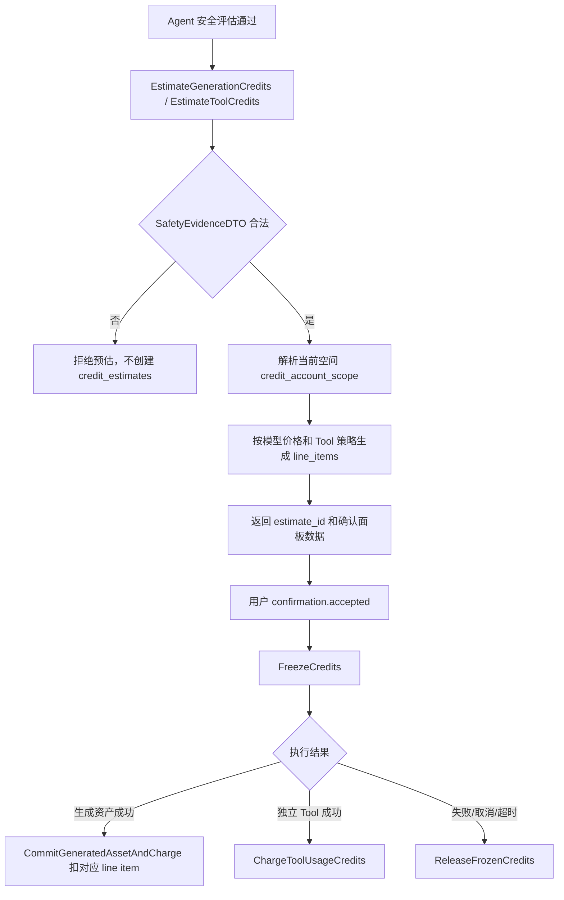
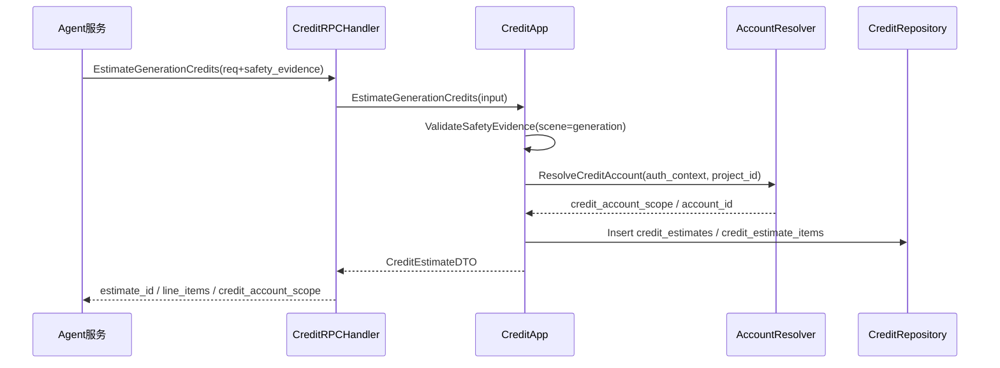

# 09-积分账户批次兑换码冻结扣减释放设计

状态：archived
owner：业务服务责任域
更新时间：2026-06-28
适用范围：积分账户、批次、有效期、兑换码、预估、冻结、扣减、释放、流水、成员消耗  
相关代码路径：`services/business/internal/application/credit/**`、`services/business/internal/domain/credit/**`

## 目标

业务服务作为积分事实源，提供生成前积分预估、确认后冻结、资产保存成功扣减、失败/取消/保存失败释放。Agent 不保存积分账户、批次、冻结、扣减和流水事实。

## 产品和契约事实源

- `docs/product/积分扣费产品系统设计.md`
- `docs/product/积分来源与有效期产品系统设计.md`
- `docs/product/prd/07-积分账户兑换码与扣费PRD.md`
- `docs/product/prd/04-Tool边界与平台开放能力PRD.md`
- `docs/product/prd/08-资产素材与创作过程PRD.md`
- `api/thrift/business_agent_service.thrift`
- `api/openapi/business-api.yaml`
- `db/migrations/iterations/2026-06-27-business-core/business/0008_credit_account_tool_charge_redeem.up.sql`
- `tests/contract/fixtures/business-rpc/estimate_generation_with_tool_items_success.json`
- `tests/contract/fixtures/business-rpc/estimate_tool_credits_success.json`
- `tests/contract/fixtures/business-rpc/charge_tool_usage_success.json`
- `tests/contract/fixtures/business-rpc/charge_tool_usage_duplicate_conflict.json`

## 非目标

- 不实现 Agent TurnLoop、Eino Tool 执行、AG-UI 事件生产、前端确认面板和模型供应商任务。
- 不在业务服务中计算模型推理过程、供应商内部成本或 Agent 工具执行结果。
- 不保存 Agent 会话、run、tool_call、artifact 原文或创作黑板；只保存积分、冻结、流水和结算引用。
- 不在积分域保存最终资产事实；生成资产保存和资产扣费原子事务归 11 负责。

## 需求映射矩阵

| 产品要求 | 业务能力 | 数据模型 | 接口 / RPC | 验收点 |
| --- | --- | --- | --- | --- |
| 当前空间决定扣个人积分或企业积分 | 解析 `AuthContext` 对应积分账户 | `credit_accounts` | `EstimateGenerationCredits`、`EstimateToolCredits` | 个人/企业空间账户选择正确，企业积分不足不扣个人积分 |
| 生成前先预估并展示积分 | 生成资源和 Tool line item 预估，且必须带 passed 安全证据 | `credit_estimates`、`credit_estimate_items` | `EstimateGenerationCredits` | 返回 `estimate_id`、`line_items[]`、余额和临期积分；缺证据不预估 |
| 直接平台 Tool 可独立预估 | 不产生资产的 Tool 用量预估，仍需安全证据 | `credit_estimates`、`credit_estimate_items` | `EstimateToolCredits` | `tool_usage_items[]` 计价，Agent 不传单价 |
| 用户确认后冻结积分 | 按最早过期批次冻结 | `credit_freezes`、`credit_batches`、`credit_ledger_entries` | `FreezeCredits` | 幂等冻结，不超扣，不足时不冻结 |
| Tool 成功后按实际用量扣费 | 独立 Tool 扣费并释放未用冻结 | `credit_tool_charge_batches`、`credit_tool_charge_items`、`credit_ledger_entries` | `ChargeToolUsageCredits` | `estimate_item_id` 不重复结算，失败项不扣费 |
| 生成资产保存成功后才扣费 | 积分域提供冻结和 line item，资产域提交事务 | `credit_freezes`、`credit_estimate_items` | `CommitGeneratedAssetAndCharge` 见 11 | 保存失败释放，保存成功扣对应 line item |
| 失败、取消、超时释放冻结 | 将未结算冻结恢复可用 | `credit_freezes`、`credit_batches`、`credit_ledger_entries` | `ReleaseFrozenCredits` | 释放幂等，已扣部分不可重复释放 |
| 兑换码支持个人、企业、绑定目标和有效期 | 兑换码兑换、批次入账、后台发码 | `redeem_code_batches`、`redeem_codes`、`redeem_code_redemptions`、`credit_batches` | `/api/credits/redeem`、`/api/admin/credits/codes/**` | 绑定用户/企业/渠道不匹配时不消耗兑换码 |

## 数据库表

| 表 | 字段 | 索引和约束 |
| --- | --- | --- |
| `credit_accounts` | `account_id`、`account_type`、`space_id`、`owner_user_id`、`enterprise_id`、`status` | `space_id` 唯一 |
| `credit_batches` | `batch_id`、`account_id`、`source_type`、`total_amount`、`available_amount`、`frozen_amount`、`expires_at` | `(account_id,expires_at)` |
| `credit_estimates` | `estimate_id`、`account_id`、`estimate_kind`、`estimate_points`、`status`、`expires_at` | `estimate_id` 唯一 |
| `credit_estimate_items` | `estimate_item_id`、`estimate_id`、`item_type`、`tool_name`、`model_id`、`estimate_points` | `(estimate_id,item_order)` |
| `credit_freezes` | `freeze_id`、`account_id`、`amount`、`charged_amount`、`released_amount`、`status`、`idempotency_key`、`expires_snapshot` | `idempotency_key` 唯一 |
| `credit_ledger_entries` | `entry_id`、`account_id`、`entry_type`、`amount`、`balance_after`、`resource_type`、`resource_id` | `(account_id,created_at)` |
| `credit_tool_charge_batches` | `tool_charge_id`、`freeze_id`、`estimate_id`、`project_id`、`source_run_id`、`status`、`idempotency_key` | `idempotency_key` 唯一；`(project_id,created_at)` |
| `credit_tool_charge_items` | `tool_charge_item_id`、`tool_charge_id`、`estimate_item_id`、`tool_call_id`、`charged_points`、`status` | `(tool_charge_id,estimate_item_id)` 唯一 |
| `redeem_codes` | `code_id`、`code_hash`、`status`、`account_type`、`bind_target_type`、`bind_target_id`、`credit_amount`、`code_expires_at`、`credit_expires_at` | `code_hash` 唯一 |
| `redeem_code_redemptions` | `redemption_id`、`code_id`、`account_id`、`redeemed_by`、`redeem_channel` | `code_id` 唯一 |

## 详细数据库表设计

### `credit_accounts`

| 字段 | 类型 | 必填 | 默认值 | 索引/约束 | 说明 |
| --- | --- | --- | --- | --- | --- |
| `account_id` | varchar(64) | 是 | 生成 | pk/unique | 积分账户 ID |
| `account_type` | varchar(32) | 是 |  | idx | `personal`、`enterprise` |
| `space_id` | varchar(64) | 是 |  | unique | 空间 ID |
| `owner_user_id` | varchar(64) | 否 | null | idx | 个人账户用户 |
| `enterprise_id` | varchar(64) | 否 | null | idx | 企业账户 |
| `status` | varchar(32) | 是 | `active` | idx | `active`、`disabled` |
| `created_at` | timestamptz | 是 | now() | idx | 创建时间 |
| `updated_at` | timestamptz | 是 | now() |  | 更新时间 |

### `credit_batches`

| 字段 | 类型 | 必填 | 默认值 | 索引/约束 | 说明 |
| --- | --- | --- | --- | --- | --- |
| `batch_id` | varchar(64) | 是 | 生成 | pk/unique | 积分批次 ID |
| `account_id` | varchar(64) | 是 |  | idx composite | 积分账户 |
| `source_type` | varchar(32) | 是 |  | idx | `admin_grant`、`redeem_code`、`system_adjust` |
| `source_ref_id` | varchar(64) | 否 | null | idx | 来源资源 |
| `total_amount` | bigint | 是 |  |  | 批次总积分 |
| `available_amount` | bigint | 是 |  | idx | 可用积分 |
| `frozen_amount` | bigint | 是 | 0 |  | 冻结积分 |
| `consumed_amount` | bigint | 是 | 0 |  | 已消耗积分 |
| `expires_at` | timestamptz | 是 |  | idx composite | 过期时间 |
| `status` | varchar(32) | 是 | `active` | idx | `active`、`expired`、`depleted`、`disabled` |
| `created_at` | timestamptz | 是 | now() | idx | 创建时间 |
| `updated_at` | timestamptz | 是 | now() |  | 更新时间 |

扣减策略按 `(account_id, status, expires_at asc)` 优先消耗最早过期批次。

### `credit_estimates`

| 字段 | 类型 | 必填 | 默认值 | 索引/约束 | 说明 |
| --- | --- | --- | --- | --- | --- |
| `estimate_id` | varchar(64) | 是 | 生成 | pk/unique | 预估 ID |
| `account_id` | varchar(64) | 是 |  | idx | 积分账户 |
| `estimate_kind` | varchar(32) | 是 | `generation` | idx | `generation`、`tool_usage`、`skill_run` |
| `project_id` | varchar(64) | 否 | null | idx | 项目 ID |
| `estimate_points` | bigint | 是 |  |  | 预估积分 |
| `available_points_snapshot` | bigint | 是 |  |  | 预估时可用余额 |
| `insufficient` | boolean | 是 | false | idx | 是否不足 |
| `safety_evidence_id` | varchar(64) | 否 | null | idx | 安全证据 |
| `status` | varchar(32) | 是 | `active` | idx | `active`、`frozen`、`expired`、`cancelled` |
| `expires_at` | timestamptz | 是 |  | idx | 预估有效期 |
| `created_at` | timestamptz | 是 | now() | idx | 创建时间 |

### `credit_estimate_items`

| 字段 | 类型 | 必填 | 默认值 | 索引/约束 | 说明 |
| --- | --- | --- | --- | --- | --- |
| `estimate_item_id` | varchar(64) | 是 | 生成 | pk/unique | 预估明细 ID |
| `estimate_id` | varchar(64) | 是 |  | idx composite | 预估 ID |
| `item_order` | int | 是 | 0 | idx composite | 展示顺序 |
| `item_type` | varchar(32) | 是 |  | idx | `model_generation`、`tool_usage`、`business_value`、`platform_free` |
| `tool_name` | varchar(120) | 否 | null | idx | Agent Tool 名称 |
| `tool_type` | varchar(64) | 否 | null | idx | Tool 类型 |
| `pricing_policy_id` | varchar(64) | 否 | null | idx | Tool 计价策略 |
| `model_id` | varchar(64) | 否 | null | idx | 模型 ID |
| `pricing_snapshot_id` | varchar(64) | 否 | null | idx | 模型价格快照 |
| `resource_type` | varchar(32) | 否 | null | idx | image/music/video/file |
| `billing_unit` | varchar(32) | 否 | null |  | call/item/second/page/mb/token/asset |
| `quantity` | numeric(18,6) | 是 | 1 |  | 计费数量 |
| `unit_points` | numeric(18,6) | 是 | 0 |  | 单位积分 |
| `estimate_points` | bigint | 是 | 0 |  | 明细预估积分 |
| `free_reason` | varchar(128) | 否 | null |  | 免费原因 |
| `metadata_summary` | jsonb | 是 | `{}` |  | 规格摘要，例如 size、quality、resolution |
| `created_at` | timestamptz | 是 | now() | idx | 创建时间 |

### `credit_freezes`

| 字段 | 类型 | 必填 | 默认值 | 索引/约束 | 说明 |
| --- | --- | --- | --- | --- | --- |
| `freeze_id` | varchar(64) | 是 | 生成 | pk/unique | 冻结 ID |
| `account_id` | varchar(64) | 是 |  | idx | 积分账户 |
| `estimate_id` | varchar(64) | 是 |  | idx | 预估 ID |
| `confirmation_id` | varchar(64) | 是 |  | idx | Agent 确认 ID |
| `amount` | bigint | 是 |  |  | 冻结积分 |
| `charged_amount` | bigint | 是 | 0 |  | 已结算扣减积分 |
| `released_amount` | bigint | 是 | 0 |  | 已释放积分 |
| `status` | varchar(32) | 是 | `frozen` | idx | `frozen`、`partially_charged`、`charged`、`released`、`partially_charged_released`、`expired` |
| `idempotency_key` | varchar(128) | 是 |  | unique | 冻结幂等键 |
| `expires_snapshot` | jsonb | 是 | `[]` |  | 按批次冻结快照 |
| `frozen_by` | varchar(64) | 是 |  | idx | 用户 ID |
| `trace_id` | varchar(128) | 是 |  | idx | Agent trace |
| `expires_at` | timestamptz | 是 |  | idx | 冻结过期时间 |
| `created_at` | timestamptz | 是 | now() | idx | 创建时间 |
| `updated_at` | timestamptz | 是 | now() |  | 更新时间 |

### `credit_ledger_entries`

| 字段 | 类型 | 必填 | 默认值 | 索引/约束 | 说明 |
| --- | --- | --- | --- | --- | --- |
| `entry_id` | varchar(64) | 是 | 生成 | pk/unique | 流水 ID |
| `account_id` | varchar(64) | 是 |  | idx composite | 积分账户 |
| `entry_type` | varchar(32) | 是 |  | idx | `grant`、`redeem`、`freeze`、`charge`、`release`、`expire` |
| `amount` | bigint | 是 |  |  | 正负变动值 |
| `balance_after` | bigint | 是 |  |  | 变动后余额 |
| `resource_type` | varchar(64) | 否 | null | idx | 关联资源类型 |
| `resource_id` | varchar(64) | 否 | null | idx | 关联资源 ID |
| `freeze_id` | varchar(64) | 否 | null | idx | 冻结 ID |
| `idempotency_key` | varchar(128) | 否 | null | idx | 写操作幂等键 |
| `created_by` | varchar(64) | 否 | null | idx | 用户或管理员 |
| `trace_id` | varchar(128) | 是 |  | idx | 链路追踪 |
| `created_at` | timestamptz | 是 | now() | idx composite | 创建时间 |

列表按 `(account_id, created_at desc)` 分页。

### `credit_tool_charge_batches`

| 字段 | 类型 | 必填 | 默认值 | 索引/约束 | 说明 |
| --- | --- | --- | --- | --- | --- |
| `tool_charge_id` | varchar(64) | 是 | 生成 | pk/unique | Tool 扣费批次 ID |
| `account_id` | varchar(64) | 是 |  | idx | 积分账户 |
| `freeze_id` | varchar(64) | 是 |  | idx | 冻结 ID |
| `estimate_id` | varchar(64) | 是 |  | idx | 预估 ID |
| `project_id` | varchar(64) | 是 |  | idx composite | 项目 ID |
| `space_id` | varchar(64) | 是 |  | idx | 空间 ID |
| `source_session_id` | varchar(64) | 是 |  | idx | Agent session |
| `source_run_id` | varchar(64) | 是 |  | idx | Agent run |
| `status` | varchar(32) | 是 | `processing` | idx | `processing`、`charged`、`partially_charged`、`failed` |
| `total_items` | int | 是 | 0 |  | 扣费项数量 |
| `charged_points` | bigint | 是 | 0 |  | 本批扣费 |
| `released_points` | bigint | 是 | 0 |  | 本批释放 |
| `idempotency_key` | varchar(128) | 是 |  | unique | Tool 扣费幂等键 |
| `trace_id` | varchar(128) | 是 |  | idx | Agent trace |
| `created_at` | timestamptz | 是 | now() | idx composite | 创建时间 |
| `updated_at` | timestamptz | 是 | now() |  | 更新时间 |

### `credit_tool_charge_items`

| 字段 | 类型 | 必填 | 默认值 | 索引/约束 | 说明 |
| --- | --- | --- | --- | --- | --- |
| `tool_charge_item_id` | varchar(64) | 是 | 生成 | pk/unique | Tool 扣费项 ID |
| `tool_charge_id` | varchar(64) | 是 |  | unique composite/idx | Tool 扣费批次 |
| `estimate_item_id` | varchar(64) | 是 |  | unique composite/idx | 对应预估明细 |
| `tool_call_id` | varchar(64) | 是 |  | idx | Agent Tool call ID |
| `tool_name` | varchar(120) | 是 |  | idx | Agent Tool 名称 |
| `tool_type` | varchar(64) | 是 |  | idx | Tool 类型 |
| `pricing_policy_id` | varchar(64) | 是 |  | idx | Tool 计价策略 |
| `billing_unit` | varchar(32) | 是 |  |  | call/item/second/page/mb/token/asset |
| `actual_quantity` | numeric(18,6) | 是 |  |  | 实际计费数量 |
| `charged_points` | bigint | 是 | 0 |  | 此项扣费 |
| `status` | varchar(32) | 是 | `pending` | idx | `pending`、`charged`、`released`、`failed` |
| `metadata_summary` | jsonb | 是 | `{}` |  | 脱敏执行摘要 |
| `created_at` | timestamptz | 是 | now() | idx | 创建时间 |
| `updated_at` | timestamptz | 是 | now() |  | 更新时间 |

### `redeem_code_batches`

| 字段 | 类型 | 必填 | 默认值 | 索引/约束 | 说明 |
| --- | --- | --- | --- | --- | --- |
| `batch_id` | varchar(64) | 是 | 生成 | pk/unique | 兑换码批次 ID |
| `code_count` | int | 是 |  |  | 兑换码数量 |
| `credit_amount` | bigint | 是 |  |  | 每个码积分 |
| `account_type` | varchar(32) | 是 |  | idx | personal/enterprise |
| `channel` | varchar(64) | 否 | null | idx | 渠道 |
| `bind_target_type` | varchar(32) | 是 | `none` | idx composite | `none`、`user`、`enterprise`、`channel` |
| `bind_target_id` | varchar(64) | 否 | null | idx composite | 绑定目标 ID；user_id、enterprise_id 或 channel key |
| `binding_snapshot` | jsonb | 是 | `{}` |  | 绑定目标展示摘要，脱敏保存 |
| `status` | varchar(32) | 是 | `active` | idx | `active`、`disabled`、`expired` |
| `code_expires_at` | timestamptz | 是 |  | idx | 兑换码过期 |
| `credit_expires_at` | timestamptz | 是 |  | idx | 兑换后积分过期 |
| `created_by_admin_id` | varchar(64) | 是 |  | idx | 创建管理员 |
| `created_at` | timestamptz | 是 | now() | idx | 创建时间 |
| `updated_at` | timestamptz | 是 | now() |  | 更新时间 |

### `redeem_codes`

| 字段 | 类型 | 必填 | 默认值 | 索引/约束 | 说明 |
| --- | --- | --- | --- | --- | --- |
| `code_id` | varchar(64) | 是 | 生成 | pk/unique | 兑换码 ID |
| `batch_id` | varchar(64) | 是 |  | idx | 批次 ID |
| `code_hash` | varchar(128) | 是 |  | unique | 兑换码 hash，不保存明文 |
| `code_masked` | varchar(32) | 是 |  |  | 脱敏展示 |
| `status` | varchar(32) | 是 | `active` | idx | `active`、`redeemed`、`expired`、`disabled` |
| `account_type` | varchar(32) | 是 |  | idx | 可兑换账户类型 |
| `channel` | varchar(64) | 否 | null | idx | 发放渠道 |
| `bind_target_type` | varchar(32) | 是 | `none` | idx composite | `none`、`user`、`enterprise`、`channel` |
| `bind_target_id` | varchar(64) | 否 | null | idx composite | 绑定目标 ID |
| `binding_snapshot` | jsonb | 是 | `{}` |  | 绑定目标展示摘要，脱敏保存 |
| `credit_amount` | bigint | 是 |  |  | 兑换积分 |
| `code_expires_at` | timestamptz | 是 |  | idx | 兑换码过期 |
| `credit_expires_at` | timestamptz | 是 |  | idx | 积分过期 |
| `created_at` | timestamptz | 是 | now() | idx | 创建时间 |
| `updated_at` | timestamptz | 是 | now() |  | 更新时间 |

### `redeem_code_redemptions`

| 字段 | 类型 | 必填 | 默认值 | 索引/约束 | 说明 |
| --- | --- | --- | --- | --- | --- |
| `redemption_id` | varchar(64) | 是 | 生成 | pk/unique | 兑换记录 ID |
| `code_id` | varchar(64) | 是 |  | unique | 兑换码 ID |
| `account_id` | varchar(64) | 是 |  | idx | 目标积分账户 |
| `redeemed_by` | varchar(64) | 是 |  | idx | 兑换用户 |
| `redeem_channel` | varchar(64) | 否 | null | idx | 兑换入口渠道 |
| `credit_batch_id` | varchar(64) | 是 |  | idx | 生成的积分批次 |
| `idempotency_key` | varchar(128) | 是 |  | unique | 兑换幂等键 |
| `trace_id` | varchar(128) | 是 |  | idx | 链路追踪 |
| `created_at` | timestamptz | 是 | now() | idx | 兑换时间 |

## 业务能力接口清单

| 能力 | 调用方 | 接口形态 | 核心模型 | 幂等 | 审计 |
| --- | --- | --- | --- | --- | --- |
| 用户积分摘要 | 用户端 | HTTP `GET /api/credits/summary`、`GET /api/enterprise/credits` | `CreditAccount`、`CreditBatch` | 否 | 否 |
| 用户积分流水 | 用户端 | HTTP `GET /api/credits/ledger`、`GET /api/enterprise/usage` | `CreditLedgerEntry` | 否 | 否 |
| 兑换码兑换 | 用户端 | HTTP `POST /api/credits/redeem` | `RedeemCode`、`CreditBatch` | 是 | 是 |
| 生成积分预估 | Agent | RPC `EstimateGenerationCredits` | `CreditEstimate` + line items | 否 | 否 |
| Tool 积分预估 | Agent | RPC `EstimateToolCredits`；生成计划内 Tool 通过 `EstimateGenerationCredits.tool_usage_items[]` | `CreditEstimate` + `CreditEstimateItem` | 否 | 否 |
| 冻结积分 | Agent | RPC `FreezeCredits` | `CreditFreeze` | 是 | 是 |
| Tool 执行成功扣费 | Agent | RPC `ChargeToolUsageCredits` | `CreditFreeze`、`CreditToolChargeBatch`、`CreditLedgerEntry` | 是 | 是 |
| 释放冻结 | Agent | RPC `ReleaseFrozenCredits` | `CreditFreeze`、`CreditLedgerEntry` | 是 | 是 |
| 后台积分发放 | 管理端 | HTTP `POST /api/admin/credits/grants` | `CreditBatch`、`CreditLedgerEntry` | 是 | 是 |
| 后台兑换码创建/停用/导出 | 管理端 | HTTP `/api/admin/credits/codes/**` | `RedeemCode` | 是 | 是 |

## HTTP API 设计

| Method | Path | 鉴权 | Request DTO | Response DTO | 页面状态 |
| --- | --- | --- | --- | --- | --- |
| GET | `/api/credits/summary` | user | empty | `CreditSummaryDTO` | `loading`、`empty` |
| GET | `/api/credits/ledger` | user | `ListCreditLedgerRequest` | `PageResult<CreditLedgerDTO>` | `loading`、`empty`、`filtered_empty` |
| POST | `/api/credits/redeem` | user | `RedeemCodeRequest` + `Idempotency-Key` | `RedeemCodeResultDTO` | `redeem_success`、`redeem_failed` |
| GET | `/api/enterprise/credits` | enterprise owner | empty | `CreditSummaryDTO` | `permission_denied`、`success` |
| GET | `/api/enterprise/usage` | enterprise user | `ListCreditLedgerRequest` | `PageResult<CreditLedgerDTO>` | `loading`、`empty` |
| GET | `/api/admin/credits/grants/targets` | admin | `SearchCreditTargetRequest` | `PageResult<CreditTargetDTO>` | `loading`、`empty` |
| POST | `/api/admin/credits/grants` | admin | `AdminGrantCreditsRequest` + `Idempotency-Key` + `X-Admin-Reason` | `AdminGrantCreditsResultDTO` | `confirming`、`success`、`failed` |
| GET | `/api/admin/credits/codes` | admin | `ListRedeemCodesRequest` | `PageResult<RedeemCodeDTO>` | `loading`、`empty` |
| POST | `/api/admin/credits/codes` | admin | `CreateRedeemCodesRequest` + `Idempotency-Key` | `CreateRedeemCodesResultDTO` | `confirming`、`success` |
| POST | `/api/admin/credits/codes/:batch_id/disable` | admin | `DisableRedeemCodeBatchRequest` + `Idempotency-Key` | `RedeemCodeBatchDTO` | `disabled` |
| POST | `/api/admin/credits/codes/:batch_id/export` | admin | `ExportRedeemCodesRequest` + `Idempotency-Key` | `ExportRedeemCodesResultDTO` | `confirming`、`success` |

## DTO 设计

| DTO | 字段 |
| --- | --- |
| `CreditSummaryDTO` | `account_id`、`account_type`、`available_points`、`frozen_points`、`expires_soon_points`、`nearest_expire_at` |
| `CreditEstimateDTO` | `estimate_id`、`estimate_kind`、`estimate_points`、`available_points`、`expires_soon_points`、`insufficient`、`credit_account_scope`、`credit_account_id`、`line_items[]`、`expires_at` |
| `CreditEstimateLineItemDTO` | `estimate_item_id`、`item_type`、`tool_name`、`tool_type`、`pricing_policy_id`、`model_id`、`resource_type`、`billing_unit`、`quantity`、`unit_points`、`estimate_points`、`free_reason`、`metadata_summary` |
| `ToolUsageEstimateItemInput` | `tool_name`、`tool_type`、`billing_unit`、`quantity`、`metadata_summary` |
| `ToolChargeItemInput` | `estimate_item_id`、`tool_call_id`、`tool_name`、`tool_type`、`billing_unit`、`actual_quantity`、`execution_status`、`metadata_summary` |
| `ChargeToolUsageCreditsRequest` | `project_id`、`estimate_id`、`freeze_id`、`session_id`、`run_id`、`charge_items[]`、`request_meta.idempotency_key` |
| `ChargeToolUsageCreditsResponse` | `tool_charge_id`、`charged_points`、`released_points`、`freeze_status`、`ledger_entry_ids[]`、`charged_line_items[]` |
| `ListCreditLedgerRequest` | `change_type`、`created_from`、`created_to`、`PaginationRequest` |
| `CreditLedgerDTO` | `entry_id`、`entry_type`、`amount`、`balance_after`、`resource_type`、`resource_id`、`created_at` |
| `RedeemCodeRequest` | `code`、`target_account_type` personal/enterprise、`redeem_channel` 可选 |
| `RedeemCodeResultDTO` | `redeemed`、`points`、`expires_at`、`account_summary`、`failure_code` 可选 |
| `SearchCreditTargetRequest` | `keyword`、`target_type` user/enterprise、`PaginationRequest` |
| `CreditTargetDTO` | `target_type`、`target_id`、`display_name`、`status`、`account_id` |
| `AdminGrantCreditsRequest` | `target_type`、`target_id`、`points`、`expires_at`、`reason` |
| `CreateRedeemCodesRequest` | `count`、`points`、`code_expires_at`、`credit_expires_at`、`account_type` personal/enterprise、`bind_target_type` none/user/enterprise/channel、`bind_target_id` 可选、`channel` 可选、`reason` |
| `RedeemCodeDTO` | `code_id`、`code_masked`、`status`、`points`、`expires_at`、`redeemed_at`、`target_summary` |
| `ExportRedeemCodesResultDTO` | `export_id`、`download_url` 短期有效、`expires_at`、`code_count` |

## RPC 设计

### CreditService.EstimateGenerationCredits

请求字段：`project_id`、`resource_type`、`model_id`、`pricing_snapshot_id`、`quantity`、`duration_seconds`、`tool_usage_items[]` 非必填、`auth_context`、`request_meta`、`safety_evidence`。响应：`estimate_id`、`estimate_points`、`available_points`、`expires_soon_points`、`insufficient`、`credit_account_scope`、`credit_account_id`、`line_items[]`。

`safety_evidence` 必须满足：`scene=generation`、`target_type=prompt`、`result=passed`、未过期、`evaluated_object_digest` 与 Agent 本次生成提示词摘要匹配。证据缺失返回 `SAFETY_EVIDENCE_REQUIRED`；场景、摘要、过期时间或结果不匹配返回 `SAFETY_EVIDENCE_INVALID`。安全证据校验失败时不得创建 `credit_estimates`。

`tool_usage_items[]` 用于非模型生成 Tool 的独立计费，每项字段：`tool_name`、`tool_type`、`billing_unit`、`quantity`、`metadata_summary`。业务服务根据 `tool_pricing_policies` 计算积分，Agent 不传 `unit_points`。

### CreditService.EstimateToolCredits

用于纯 Tool 运行、不产生生成资产的计费预估。请求字段：`project_id`、`tool_usage_items[]`、`auth_context`、`request_meta`、`safety_evidence`。响应同 `CreditEstimateDTO`。安全证据必须和触发 Tool 的用户输入摘要匹配；失败时不创建预估。

### CreditService.FreezeCredits

请求字段与 `api/thrift/business_agent_service.thrift` 保持一致：`estimate_id`、`points`、`run_id`、`auth_context`、`request_meta.idempotency_key` 必填；`confirmation_id`、`account_id` 为兼容增强字段。业务服务以 `estimate_id` 解析积分账户，`account_id` 只用于调用方已持有账户快照时的防串账户校验。响应：`freeze_id`、`frozen_points`、`expires_at`。

### CreditService.ChargeToolUsageCredits

用于独立扣费且不通过资产保存落账的 Tool，例如转码、批量解析、业务价值型 Tool。请求字段：`project_id`、`estimate_id`、`freeze_id`、`session_id`、`run_id`、`charge_items[]`、`auth_context`、`request_meta.idempotency_key`。每个 `charge_items[]` 必须引用一个 `estimate_item_id`，并提供 `tool_call_id`、`tool_name`、`tool_type`、`billing_unit`、`actual_quantity`、`execution_status=success|failed|cancelled`、`metadata_summary`。响应：`tool_charge_id`、`charged_points`、`released_points`、`freeze_status`、`ledger_entry_ids[]`、`charged_line_items[]`。

扣费规则：仅 `execution_status=success` 且 `estimate_item.item_type in (tool_usage,business_value)` 的明细可扣费；实际数量不得超过预估数量，超过时返回 `CREDIT_ESTIMATE_EXCEEDED`，由 Agent 重新预估和确认。

### CreditService.ReleaseFrozenCredits

请求字段与 Thrift 保持一致：`freeze_id`、`release_points`、`reason`、`run_id`、`auth_context`、`request_meta.idempotency_key`。响应：`released_points`、`release_status`。

生成资产扣减在 `AssetCreditCommitService.CommitGeneratedAssetAndCharge` 中与资产保存同事务处理，见 11；不生成资产的独立扣费 Tool 在 `ChargeToolUsageCredits` 中结算。

## Application 函数

```go
type CreditApp interface {
    GetCreditBalance(ctx context.Context, in BalanceInput) (BalanceDTO, error)
    ListCreditLedger(ctx context.Context, in LedgerInput) (Page[LedgerEntryDTO], error)
    EstimateGenerationCredits(ctx context.Context, in EstimateInput) (EstimateResult, error)
    EstimateToolCredits(ctx context.Context, in EstimateToolInput) (EstimateResult, error)
    FreezeCredits(ctx context.Context, in FreezeInput) (FreezeResult, error)
    ChargeToolUsageCredits(ctx context.Context, in ChargeToolUsageInput) (ChargeToolUsageResult, error)
    ReleaseFrozenCredits(ctx context.Context, in ReleaseInput) (ReleaseResult, error)
    RedeemCode(ctx context.Context, in RedeemInput) (RedeemResult, error)
    AdminGrantCredits(ctx context.Context, in AdminGrantCreditsInput) (AdminGrantCreditsResultDTO, error)
    CreateRedeemCodes(ctx context.Context, in CreateRedeemCodesInput) (CreateRedeemCodesResultDTO, error)
    DisableRedeemCodeBatch(ctx context.Context, in DisableRedeemCodeBatchInput) (RedeemCodeBatchDTO, error)
    ExportRedeemCodes(ctx context.Context, in ExportRedeemCodesInput) (ExportRedeemCodesResultDTO, error)
}
```

## 业务流程图



## 代码逻辑图



## 业务规则

- 个人空间扣个人积分；企业空间扣企业积分。
- 企业积分不足不自动扣个人积分。
- `credit_account_scope` 是 RPC DTO 中唯一的账户作用域字段，合法值为 `personal`、`enterprise`；业务内部 `credit_accounts.account_type` 只在领域模型内使用。
- 积分预估必须在安全证据通过后执行；业务服务不能接受 Agent 未评估或被阻断的提示词进入预估、确认和冻结。
- 扣减优先消耗最早过期 active 批次。
- 冻结后批次到期不影响已冻结扣减；释放不延长有效期。
- 余额不足不部分冻结。
- 文本和视觉理解成本不对用户单独展示，默认 `platform_free` 或平台内部成本。
- 图片按张、音乐按首、视频按秒。
- 0 单价也返回预估和确认数据。
- Tool 积分计算公式：`chargeable_quantity = max(quantity - free_quota, 0)`；`raw_points = chargeable_quantity * unit_points`；按 `rounding_mode` 取整；再应用 `min_points` 和 `max_points`；`no_charge` 与 `model_generation` 的 Tool 独立扣费为 0。
- 组合 Skill 的预估总额等于所有 line item 之和：模型生成项 + 独立 Tool 使用项 + 业务价值项；前端确认面板必须展示 line items 摘要。
- 生成类 Tool 已按模型价格快照计费，不允许再按 Tool 调用次数重复扣费。
- Tool 执行失败、用户取消、供应商超时且没有保存可用产物时，未完成 line item 对应冻结积分必须释放。
- 部分完成时，只对 `saved` 或业务确认成功的 line item 扣费，其余释放。
- 不生成资产的独立扣费 Tool 必须通过 `ChargeToolUsageCredits` 结算；生成资产类 Tool 必须通过 `CommitGeneratedAssetAndCharge` 结算；同一个 `estimate_item_id` 只能被一种结算 RPC 消费一次。
- 兑换码 `account_type=personal` 只能兑换到当前用户个人积分账户；`account_type=enterprise` 只能由当前企业 owner 兑换到当前企业积分账户。
- 兑换码 `bind_target_type=none` 不限制目标；`user` 必须匹配 `AuthContext.actor_user_id`；`enterprise` 必须匹配 `AuthContext.enterprise_id`；`channel` 必须匹配 `RedeemCodeRequest.redeem_channel`。
- 兑换码绑定目标校验必须早于 `redeem_codes.status=redeemed` 写入；绑定不匹配返回 `REDEEM_CODE_TARGET_MISMATCH`，不得消耗兑换码。
- 后台创建绑定兑换码时必须校验 `bind_target_type` 与 `account_type` 一致：user 只能 personal，enterprise 只能 enterprise，channel 可用于 personal 或 enterprise。

## 事务设计

| 事务 | 原子写入 |
| --- | --- |
| 冻结积分 | 锁定 account/batches，减少 available，增加 frozen，写 freeze，写 ledger，写幂等 |
| Tool 成功扣费 | 锁定 freeze/batches，写 `credit_tool_charge_batches/items`，按 `estimate_item_id` 扣 frozen，写 charge ledger，更新 freeze 已扣和状态，写幂等 |
| 释放冻结 | 更新 freeze 已释放金额和最终状态，批次 frozen 减少，available 按原过期恢复，ledger，幂等 |
| 兑换码兑换 | code redeemed、redemption、credit batch、ledger、审计、幂等 |
| 积分发放 | batch、ledger、审计、幂等 |

## 日志和审计

| 动作 | `business_action` | 审计内容 |
| --- | --- | --- |
| 积分预估 | 不写审计，写 info 日志 | account_id、estimate_id、estimate_points、insufficient、trace_id |
| 冻结积分 | `credit.freeze` | account_id、estimate_id、freeze_id、amount、source_run_id |
| Tool 成功扣费 | `credit.tool_charge` | freeze_id、tool_charge_id、charged_points、charged_line_items 摘要 |
| 释放冻结 | `credit.release` | freeze_id、released_points、release_reason、source_run_id |
| 兑换码兑换 | `credit.redeem` | code_id、code_masked、account_id、target_account_type、redeem_channel、结果 |
| 后台积分发放 | `credit.admin_grant` | target_type、target_id、points、expires_at、reason |
| 创建兑换码批次 | `credit.redeem_code.create` | batch_id、count、points、account_type、bind_target_type、channel、reason |
| 停用兑换码批次 | `credit.redeem_code.disable` | batch_id、before_status、after_status、reason |
| 导出兑换码 | `credit.redeem_code.export` | batch_id、export_id、code_count、download_url_expires_at、reason |

审计和日志不得保存完整兑换码、完整兑换码导出文件、用户完整联系方式、供应商原始响应或 Agent 推理链路。兑换码相关日志只允许保存 `code_id`、`code_masked` 和批次摘要。

## 【Agent开发】需要提供的能力与参数

| 【Agent开发】场景 | 业务 RPC | Agent 必传参数 | 业务服务返回 | Agent 行为 |
| --- | --- | --- | --- | --- |
| 安全通过后预估 | `EstimateGenerationCredits` | `resource_type`、`model_id`、`pricing_snapshot_id`、数量/秒数、`tool_usage_items[]`、`safety_evidence` | `estimate_points`、`available_points`、`estimate_id`、`credit_account_scope`、`credit_account_id` | 积分不足不进入确认 |
| 非生成 Tool 预估 | `EstimateToolCredits`；生成计划内 Tool 通过 `EstimateGenerationCredits.tool_usage_items[]` | `tool_name`、`tool_type`、`billing_unit`、`quantity`、`metadata_summary`、`safety_evidence` | `line_items[]`、`estimate_points`、`credit_account_scope` | Agent 不计算单价，只展示业务返回 |
| 用户确认后冻结 | `FreezeCredits` | `estimate_id`、`points`、`run_id`、`idempotency_key`；`confirmation_id` 可选 | `freeze_id`、`frozen_points` | 冻结成功才执行生成 Tool |
| 独立 Tool 成功扣费 | `ChargeToolUsageCredits` | `estimate_id`、`freeze_id`、`session_id`、`run_id`、`charge_items[].estimate_item_id`、`tool_call_id`、`actual_quantity` | `charged_line_items[]`、`freeze_status` | 仅对成功且不生成资产的扣费 Tool 调用 |
| 生成失败/取消/保存失败 | `ReleaseFrozenCredits` | `freeze_id`、`release_points`、`reason`、`run_id`、`idempotency_key` | `released_points`、`release_status` | 发 `credits.released` |
| 保存资产并扣费 | 见 11 | `freeze_id`、保存成功产物明细 | charged / released | 发 `credits.charged` 和必要释放事件 |

## 测试

- 个人/企业账户选择正确。
- 企业积分不足不切个人积分。
- 冻结并发不超扣。
- 同一幂等键重复冻结返回同一 freeze。
- 释放已 charged freeze 返回 `STATE_CONFLICT`。
- 最早过期批次优先扣减。
- Tool 独立扣费覆盖 `no_charge`、`model_generation`、`tool_usage`、`business_value` 四种 charge mode。
- 同一个 `estimate_item_id` 重复通过 `ChargeToolUsageCredits` 或 `CommitGeneratedAssetAndCharge` 结算必须返回幂等结果或 `IDEMPOTENCY_CONFLICT`，不得重复扣费。
- 兑换码绑定用户、企业、渠道均覆盖成功路径和 `REDEEM_CODE_TARGET_MISMATCH`。
- 绑定目标不匹配时 `redeem_codes.status` 保持 `active`，不写 `redeem_code_redemptions`，不写 `credit_batches`。
- `EstimateGenerationCredits` 和 `EstimateToolCredits` 缺失、过期、摘要不匹配或 `result!=passed` 的安全证据时不创建预估记录。
