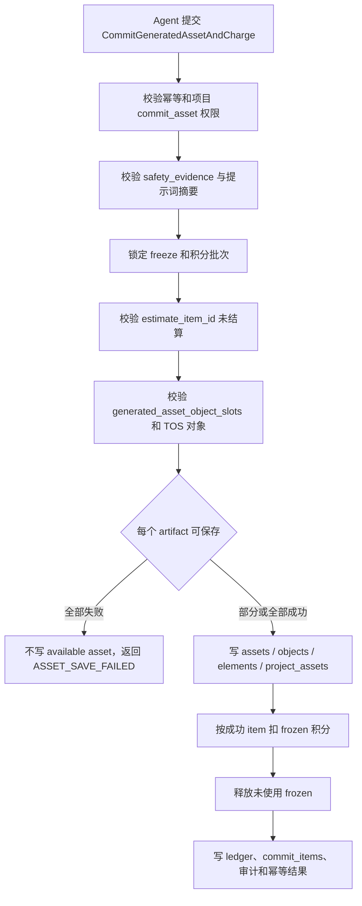
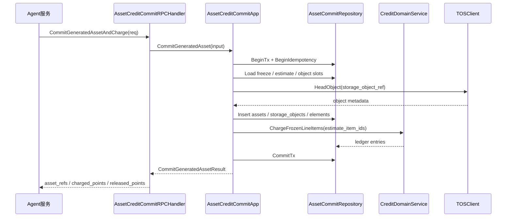

# 11-生成资产保存与积分扣费事务闭环设计

状态：production-design-ready  
owner：业务微服务后端工程师  
更新时间：2026-06-27  
适用范围：Agent 生成资产保存、最终资产元素入库、项目绑定、冻结积分扣减和失败释放的业务事务闭环  
相关代码路径：`services/business/internal/application/asset/**`、`services/business/internal/application/credit/**`、`services/business/internal/domain/asset/**`、`services/business/internal/domain/credit/**`

## 产品事实源

- `docs/product/积分扣费产品系统设计.md`
- `docs/product/资产与创作过程保存产品系统设计.md`
- `docs/product/统一Agent产品系统设计.md`
- `api/thrift/business_agent_service.thrift`
- `tests/contract/fixtures/business-rpc/commit_generated_asset_and_charge_success.json`

## 目标

提供 Agent 生成完成后的原子业务能力：保存用户可见资产和最终资产元素，绑定项目，按已保存可用产物扣减冻结积分，未完成或保存失败部分释放冻结积分。

## 非目标

- 不执行模型生成。
- 不保存 Agent 黑板内容、Tool 调用历史或 AG-UI 事件。
- 不保存系统 Prompt、供应商原始响应或模型推理链路。

## 需求映射矩阵

| 产品条目 | 业务解释 | 业务产出 | 【Agent开发】依赖 |
| --- | --- | --- | --- |
| 资产保存成功后才扣费 | 保存资产与扣费同事务 | `CommitGeneratedAssetAndCharge` | Agent 只提交已生成、已上传到业务签发 TOS object key、可保存的产物 |
| 部分完成部分扣费 | 每个产物有保存结果和计费数量 | `commit_items[]` | Agent 按产物传 `artifact_id`、resource、计费单位 |
| 保存失败不展示资产 | 事务失败不生成 available asset | asset status | Agent 发 `asset.save.failed` 并释放冻结 |
| 安全评估前置 | 业务保存校验 `safety_evidence` | 安全证据摘要 | Agent 必传 passed 证据 |

## 数据库表

本领域新增提交批次和提交项记录，用于幂等、追踪部分完成和审计。最终资产写入 `assets`、`asset_storage_objects`、`asset_elements`、`project_assets`；积分扣减写入 `credit_freezes`、`credit_batches`、`credit_ledger_entries`。

| 表 | 字段 | 索引和约束 |
| --- | --- | --- |
| `asset_commit_batches` | `commit_id`、`project_id`、`estimate_id`、`freeze_id`、`source_session_id`、`source_run_id`、`status`、`idempotency_key` | `idempotency_key` 唯一；`(project_id,created_at)` |
| `asset_commit_items` | `commit_item_id`、`commit_id`、`estimate_item_id`、`artifact_id`、`asset_id`、`status`、`charged_points`、`error_code` | `(commit_id,artifact_id)` 唯一；`estimate_item_id` 索引 |

## 详细数据库表设计

### `asset_commit_batches`

| 字段 | 类型 | 必填 | 默认值 | 索引/约束 | 说明 |
| --- | --- | --- | --- | --- | --- |
| `commit_id` | varchar(64) | 是 | 生成 | pk/unique | 保存扣费提交批次 ID |
| `project_id` | varchar(64) | 是 |  | idx composite | 项目 ID |
| `space_id` | varchar(64) | 是 |  | idx | 空间 ID |
| `actor_user_id` | varchar(64) | 是 |  | idx | 操作者 |
| `estimate_id` | varchar(64) | 是 |  | idx | 积分预估 ID |
| `freeze_id` | varchar(64) | 是 |  | idx | 冻结积分 ID |
| `source_session_id` | varchar(64) | 是 |  | idx | Agent session |
| `source_run_id` | varchar(64) | 是 |  | idx | Agent run |
| `safety_evidence_id` | varchar(64) | 是 |  | idx | 安全证据 |
| `status` | varchar(32) | 是 | `processing` | idx | `processing`、`succeeded`、`partial_completed`、`failed` |
| `total_items` | int | 是 | 0 |  | 提交项数量 |
| `succeeded_items` | int | 是 | 0 |  | 成功项 |
| `failed_items` | int | 是 | 0 |  | 失败项 |
| `charged_points` | bigint | 是 | 0 |  | 已扣积分 |
| `released_points` | bigint | 是 | 0 |  | 释放积分 |
| `idempotency_key` | varchar(128) | 是 |  | unique | 提交幂等键 |
| `trace_id` | varchar(128) | 是 |  | idx | Agent trace |
| `created_at` | timestamptz | 是 | now() | idx composite | 创建时间 |
| `updated_at` | timestamptz | 是 | now() |  | 更新时间 |

### `asset_commit_items`

| 字段 | 类型 | 必填 | 默认值 | 索引/约束 | 说明 |
| --- | --- | --- | --- | --- | --- |
| `commit_item_id` | varchar(64) | 是 | 生成 | pk/unique | 提交项 ID |
| `commit_id` | varchar(64) | 是 |  | unique composite/idx | 提交批次 |
| `estimate_item_id` | varchar(64) | 是 |  | idx | 对应 `credit_estimate_items` 明细 |
| `artifact_id` | varchar(64) | 是 |  | unique composite/idx | Agent artifact |
| `tool_name` | varchar(120) | 否 | null | idx | 生成该产物的 Agent Tool 名称 |
| `tool_type` | varchar(64) | 否 | null | idx | Tool 类型 |
| `asset_id` | varchar(64) | 否 | null | idx | 成功保存后的资产 |
| `resource_type` | varchar(32) | 是 |  | idx | image/music/video/file |
| `asset_type` | varchar(32) | 是 |  |  | 资产类型 |
| `billing_quantity` | numeric(18,6) | 是 | 0 |  | 计费数量 |
| `charged_points` | bigint | 是 | 0 |  | 此项扣费 |
| `storage_object_ref` | jsonb | 是 | `{}` |  | TOS 对象摘要 |
| `element_payloads` | jsonb | 是 | `[]` |  | 最终元素摘要 |
| `status` | varchar(32) | 是 | `pending` | idx | `pending`、`saved`、`failed` |
| `error_code` | varchar(64) | 否 | null | idx | 保存失败错误码 |
| `error_message` | varchar(512) | 否 | null |  | 用户可理解错误摘要 |
| `created_at` | timestamptz | 是 | now() | idx | 创建时间 |
| `updated_at` | timestamptz | 是 | now() |  | 更新时间 |

唯一约束：`(commit_id, artifact_id)`。同一 Agent 产物在同一提交批次内只能保存一次。

## 业务能力接口清单

| 能力 | 调用方 | 接口形态 | 核心模型 | 幂等 | 审计 |
| --- | --- | --- | --- | --- | --- |
| 生成资产保存并扣费 | Agent | RPC `CommitGeneratedAssetAndCharge` | `Asset`、`AssetElement`、`CreditFreeze`、`CreditLedgerEntry` | 是 | 是 |
| 部分完成保存扣费 | Agent | 同 RPC，`artifacts[]` 按产物表达成功，失败项通过 Agent 调 `ReleaseFrozenCredits` 释放 | 同上 | 是 | 是 |
| 保存失败释放冻结 | Agent | RPC 返回失败后调用 `ReleaseFrozenCredits` | `CreditFreeze` | 是 | 是 |
| 用户端生成确认 | 用户端 | 无业务 HTTP；由 Agent API/AG-UI 承接 | `confirmation_id` 在 Agent 域 | 不适用 | 不适用 |
| 后台查询生成扣费 | 管理端 | 无直接详情查询；通过积分流水和资产审计摘要查看 | `CreditLedgerEntry`、`business_audit_logs` | 否 | 否 |

## HTTP API 设计

本领域不向用户端或管理端直接暴露 `/api/**` 写接口。原因：

- 用户端生成流程必须通过 Agent 工作台、AG-UI、Interrupt/Resume 和 Agent API 完成。
- 前端不得直接提交生成产物、冻结 ID、计费数量或 TOS object key 到业务服务。
- 管理端不允许查看用户私有生成内容，只能通过积分流水、资产摘要和审计日志看到脱敏结果。

## DTO 设计

| DTO | 字段 |
| --- | --- |
| `GeneratedStorageObjectRef` | `bucket`、`object_key`、`content_type`、`size_bytes`、`checksum`、`etag` 可选 |
| `CommitArtifactDTO` | `artifact_id`、`resource_type` image/music/video/file、`element_type`、`storage_object_ref`、`artifact_summary`、`content_uri_digest` 可选、`estimate_item_id` 可选、`tool_name` 可选、`tool_type` 可选、`charge_quantity` 可选、`metadata_summary` 可选 |
| `GeneratedAssetElementInput` | `element_type`、`element_payload_json`、`display_order`、`source_tool_call_id` 可选 |
| `CommitGeneratedAssetRequest` | `project_id`、`session_id`、`run_id`、`freeze_id`、`artifacts[]`、`final_elements[]`、`safety_evidence`、`request_meta.idempotency_key`、`estimate_id` 可选 |
| `CommittedAssetDTO` | `asset_id`、`asset_type`、`project_id`、`status`、`preview_url`、`charged_points`、`source_artifact_id` |
| `CommitGeneratedAssetResponse` | `assets[]`、`charged_points`、`released_points`、`ledger_entry_ids[]`、`charged_line_items[]`、`partial_completed`、`failed_items[]` |
| `CommitFailedItemDTO` | `artifact_id`、`error_code`、`error_message`、`charged_points=0` |

## RPC 设计

### AssetCreditCommitService.CommitGeneratedAssetAndCharge

请求：

| 字段 | 类型 | 必填 | 说明 |
| --- | --- | --- | --- |
| `project_id` | string | 是 | 当前项目 |
| `freeze_id` | string | 是 | 已冻结积分 |
| `session_id` | string | 是 | Agent session；业务库落表为 `source_session_id` |
| `run_id` | string | 是 | Agent run；业务库落表为 `source_run_id` |
| `safety_evidence` | SafetyEvidenceDTO | 是 | `scene=generation` 且 passed |
| `artifacts[]` | CommitArtifactDTO | 是 | 产物列表 |
| `final_elements[]` | GeneratedAssetElementInput[] | 是 | 最终元素摘要，和 `artifacts[]` 一起校验 |
| `estimate_id` | string | 否 | 生成前积分预估 ID；新 Agent 必传，旧 Agent 缺失时业务从 freeze 解析 |
| `request_meta.idempotency_key` | string | 是 | 格式 `asset_commit:<run_id>:<batch>` |

`CommitArtifactDTO`：

| 字段 | 类型 | 必填 | 说明 |
| --- | --- | --- | --- |
| `artifact_id` | string | 是 | Agent artifact |
| `estimate_item_id` | string | 否 | 对应 `credit_estimate_items` 中模型生成或资产生成扣费项；新 Agent 保存扣费链路必传 |
| `tool_name` | string | 否 | 生成该产物的 Agent Tool 名称 |
| `tool_type` | string | 否 | Tool 类型 |
| `resource_type` | enum | 是 | image/music/video/file |
| `element_type` | string | 是 | 主元素类型 |
| `artifact_summary` | map<string,string> | 是 | TOS key digest、MIME、size、checksum、展示名等脱敏摘要 |
| `content_uri_digest` | string | 否 | 产物 URI 摘要，不保存长期 URL |
| `charge_quantity` | int64 | 否 | 张、首、秒；缺失时从 estimate item 取默认数量 |
| `metadata_summary` | object | 否 | 脱敏摘要 |
| `storage_object_ref` | GeneratedStorageObjectRef | 是 | Agent 已上传到业务签发 object key 后提交的对象摘要 |

`GeneratedStorageObjectRef`：

| 字段 | 类型 | 必填 | 说明 |
| --- | --- | --- | --- |
| `bucket` | string | 是 | 业务返回的 TOS bucket |
| `object_key` | string | 是 | `PrepareGeneratedAssetObjects` 生成的 object key |
| `content_type` | string | 是 | 对象 MIME，必须与 slot 和实际对象一致 |
| `size_bytes` | int64 | 是 | 实际对象大小 |
| `checksum` | string | 是 | 上传后 checksum |
| `etag` | string | 否 | TOS 返回 etag |

响应：

| 字段 | 类型 | 说明 |
| --- | --- | --- |
| `committed_assets[]` | list | `asset_id`、`source_artifact_id`、`asset_type`、元素摘要 |
| `charged_points` | int64 | 已扣积分 |
| `released_points` | int64 | 未使用释放积分 |
| `freeze_status` | enum | `charged` 或 `partially_charged_released` |
| `ledger_entry_ids[]` | list | 业务流水引用 |
| `charged_line_items[]` | list | `estimate_item_id`、`artifact_id`、`charged_points`、`asset_id` |

## 事务步骤

1. 校验幂等记录。同 key 同 hash 返回同一 commit 结果。
2. 校验 `ProjectService.CheckProjectAccess(commit_asset)` 等价规则，项目 archived 则返回 `PROJECT_ARCHIVED`。
3. 校验 `safety_evidence.result=passed`、场景、摘要、过期时间和 trace。
4. 锁定 `credit_freezes` 和相关 `credit_batches`。
5. 校验 freeze 属于当前 `estimate_id`、当前空间积分账户，且剩余冻结金额覆盖待结算明细。
6. 校验每个新 Agent 传入的 `artifacts[].estimate_item_id` 未被 `CommitGeneratedAssetAndCharge` 或 `ChargeToolUsageCredits` 结算过，且 item 类型为 `model_generation` 或产物生成扣费项；旧 Agent 未传 `estimate_item_id` 时只能按 freeze 总额全量结算，不允许和 Tool 独立扣费混用。
7. 对每个 item 校验元素类型、`storage_object_ref`、TOS object key、文件元数据。
8. 校验每个 `storage_object_ref.object_key` 对应 `generated_asset_object_slots(run_id,artifact_id,status=uploaded|created)`，且 bucket、MIME、大小、checksum 与 slot 和 TOS head object 一致；object key 不属于本 run 或未可验证时返回 `ASSET_SAVE_FAILED`。
9. 写入 `assets`、`asset_storage_objects`、`asset_elements`、`project_assets`，并把成功 slot 标记为 `committed`。
10. 按保存成功 item 和对应 `credit_estimate_items.estimate_points` 计算 `charged_points`。
11. freeze 标记为 `charged`、`partially_charged` 或 `partially_charged_released`。
12. 扣减 frozen，写 `credit_ledger_entries`，并将已结算 `estimate_item_id` 记录到 `asset_commit_items`。
13. 若有未使用冻结且 run 已结束，恢复 available 或按原批次释放；若 run 仍有后续独立 Tool 结算，保留剩余 frozen。
14. 写审计、幂等结果。

事务内不调用外部模型，也不下载供应商文件。TOS 对象必须在事务前由 Agent 上传到业务签发的 object key，并在事务内通过 TOS head object 或内部对象元数据校验可验证。

## Application 函数

```go
type AssetCreditCommitApp interface {
    CommitGeneratedAssetAndCharge(ctx context.Context, in CommitGeneratedAssetInput) (CommitGeneratedAssetResult, error)
}
```

## 业务流程图



## 代码逻辑图



## 日志和审计

| 动作 | `business_action` | 审计内容 |
| --- | --- | --- |
| 生成资产保存并扣费 | `asset.commit_charge` | commit_batch_id、project_id、estimate_id、freeze_id、asset_count、charged_points、released_points、source_run_id |
| 部分完成保存扣费 | `asset.commit_charge.partial` | commit_batch_id、成功 item 数、失败 item 数、charged_line_items 摘要 |
| 保存失败释放冻结 | `asset.commit_charge.failed_release` | freeze_id、release_reason、released_points、source_run_id |
| 重复提交命中幂等 | 不写审计，写 info 日志 | idempotency_key、result_ref_id、trace_id |

审计和日志不得保存完整 Prompt、系统 Prompt、供应商原始响应、私有 TOS 签名 URL、用户素材正文或 Agent 推理链路。`charged_line_items` 只保存 `estimate_item_id`、`asset_id`、`charged_points` 和状态摘要。

## 错误处理

| 错误 | 条件 | Agent 行为 |
| --- | --- | --- |
| `PROJECT_ARCHIVED` | 项目归档 | 停止提交，释放冻结，工作台只读 |
| `SAFETY_EVIDENCE_INVALID` | 证据过期或摘要不匹配 | 重新安全评估或失败 |
| `CREDIT_FREEZE_NOT_FOUND` | freeze 不存在或非 frozen | run failed，人工排查 |
| `ASSET_ELEMENT_INVALID` | 元素类型非法或必填缺失 | 不保存该资产，不扣该资产 |
| `IDEMPOTENCY_CONFLICT` | 同 key 参数不一致 | 阻断重试 |

## 【Agent开发】需要提供的能力与参数

| 【Agent开发】能力 | 参数 | 说明 |
| --- | --- | --- |
| 生成产物提交 | `estimate_item_id`、`source_artifact_id`、`resource_type`、`charge_quantity`、`storage_object_ref`、`elements[]` | 只提交已生成完成、已上传到业务签发 TOS object key 且可保存产物 |
| 安全证据 | `SafetyEvidenceDTO(scene=generation,result=passed)` | 与生成前提示词摘要匹配 |
| 幂等键 | `asset_commit:<run_id>:<commit_batch>` | 重试必须复用 |
| 来源追踪 | `source_session_id`、`source_run_id`、`trace_id` | 用于资产来源和审计 |
| 部分完成 | `artifacts[]` 只含已完成且可保存产物，失败部分由 Agent 调 `ReleaseFrozenCredits` | 业务按已保存项扣费，剩余释放 |
| 事件映射 | 消费响应 `committed_assets[]`、`charged_points`、`released_points` | 发 `asset.save.completed`、`credits.charged`、`credits.released` |
| 防重复扣费 | 同一 `estimate_item_id` 只进入一次保存扣费或 Tool 扣费 RPC | 生成类 Tool 按模型价格或资产保存扣费，不再调用 `ChargeToolUsageCredits` |

## 测试

- 保存成功和扣费同事务。
- 资产写入失败不扣费。
- 部分完成扣已保存资产，释放剩余冻结。
- 安全证据缺失、过期、场景不匹配拒绝。
- 项目归档拒绝 commit。
- 重复 commit 幂等返回同一资产和流水。
- 同一 `estimate_item_id` 被重复提交不得重复扣费。
- 生成类 Tool 已结算的 `estimate_item_id` 再调用 `ChargeToolUsageCredits` 返回 `STATE_CONFLICT`。
- `storage_object_ref.object_key` 不属于当前 `run_id/artifact_id` 的准备记录时拒绝 commit，不写资产、不扣费。
