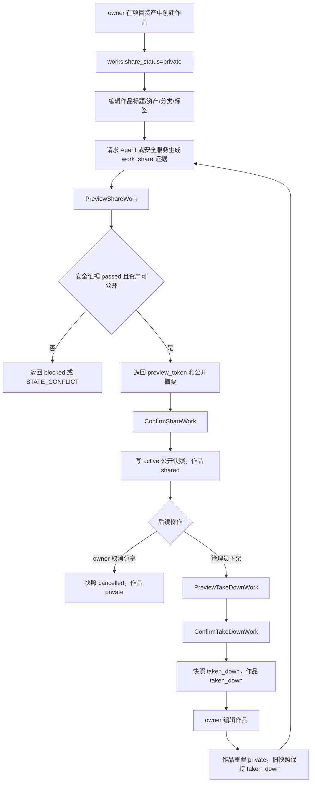
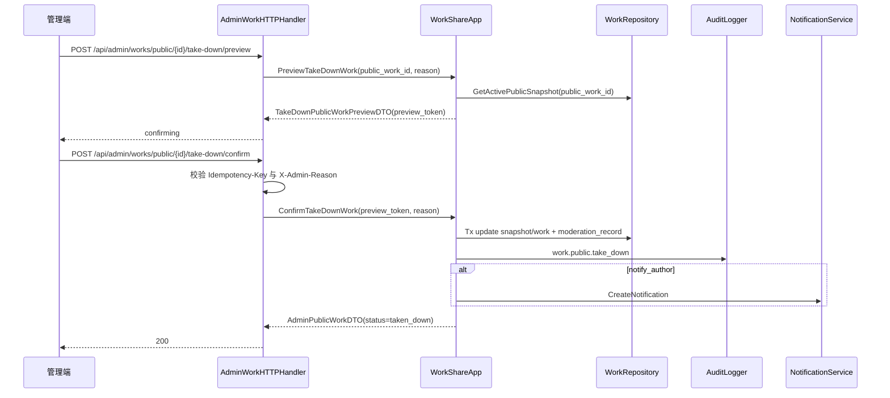

# 12-作品中心公开快照精选作品点赞与下架设计

状态：archived
owner：业务服务责任域
更新时间：2026-06-28
适用范围：个人作品、作品资产引用、分享公开快照、公开作品、精选作品、点赞、取消分享和平台下架  
相关代码路径：`services/business/internal/application/work/**`、`services/business/internal/domain/work/**`

## 产品事实源

- `docs/product/prd/12-作品中心与精选作品PRD.md`
- `docs/product/项目与资产归属产品系统设计.md`
- `docs/product/资产与创作过程保存产品系统设计.md`
- `api/thrift/business_agent_service.thrift`
- `api/openapi/business-api.yaml`

## 目标

业务服务保存作品事实和公开快照。作品可从项目资产创建，分享时生成公开快照；公开详情不暴露项目、会话、黑板、提示词、积分、模型成本和私有资产原始路径。

## 非目标

- 不提供推荐算法、榜单运营或人工精选排序系统。
- 不向管理端展示用户私有创作过程、提示词、黑板或源会话。
- 不在公开 API 返回私有 TOS object key、长期签名 URL 或内部用户联系方式。

## 需求映射矩阵

| 产品条目 | 业务解释 | 业务产出 | 【Agent开发】依赖 |
| --- | --- | --- | --- |
| 个人作品中心 | 当前登录用户管理自己的作品 | `works`、`work_assets`、`/api/works` | Agent 不保存作品状态 |
| 从资产创建作品 | 校验项目和资产权限后创建作品 | `CreateWork`、`BatchCheckAssetAccess` | Agent 只提供 asset ref |
| 分享作品 | 分享时生成公开快照和可复制链接 | `work_public_snapshots`、`share_url` | 分享前可由 Agent 提供 `work_share` 安全证据 |
| 下架后重新编辑再分享 | `taken_down` 源作品允许 owner 编辑，编辑后回到 `private`，再次分享必须重新安全评估并生成新公开快照 | `UpdateWork`、`PreviewShareWork`、`ConfirmShareWork` | Agent 如提供分享安全评估，必须重新生成 `work_share` 证据 |
| 企业空间作品权限 | 企业空间作品除 owner_user_id 外，还要求操作者仍是 active 企业成员 | `EnsureWorkOwnerAccess`、`EnterpriseMember` 校验 | Agent 不参与作品状态，但企业成员移除后不得继续分享或编辑企业作品 |
| 精选作品列表/详情 | 匿名只读 active 公开快照 | `PublicContentService` | 无 |
| 点赞/取消点赞 | 登录用户对公开作品幂等点赞 | `work_likes` | 无 |
| 后台下架 | 管理端先预览影响再确认下架并审计 | `PreviewTakeDownWork`、`ConfirmTakeDownWork`、`work_moderation_records`、审计 | Agent 不参与 |

## 数据库表

| 表 | 字段 | 索引和约束 |
| --- | --- | --- |
| `works` | `work_id`、`space_id`、`project_id`、`owner_user_id`、`title`、`description`、`category`、`share_status`、`cover_asset_id` | `(space_id,owner_user_id,project_id,share_status,created_at)` |
| `work_assets` | `work_id`、`asset_id`、`display_order`、`role` | `(work_id,asset_id)` 唯一 |
| `work_public_snapshots` | `snapshot_id`、`work_id`、`public_slug`、`public_url`、`snapshot_payload`、`status`、`published_at` | `public_slug` 唯一 |
| `work_likes` | `work_id`、`user_id`、`status`、`liked_at` | `(work_id,user_id)` 唯一 |
| `work_categories` | `category_key`、`display_name`、`status`、`sort_order` | `category_key` 唯一 |

## 详细数据库表设计

### `works`

| 字段 | 类型 | 必填 | 默认值 | 索引/约束 | 说明 |
| --- | --- | --- | --- | --- | --- |
| `work_id` | varchar(64) | 是 | 生成 | pk/unique | 作品 ID |
| `space_id` | varchar(64) | 是 |  | idx composite | 空间 ID |
| `project_id` | varchar(64) | 是 |  | idx composite | 项目 ID |
| `owner_user_id` | varchar(64) | 是 |  | idx composite | 作者 |
| `title` | varchar(160) | 是 |  | idx | 标题 |
| `description` | varchar(2000) | 否 | null |  | 简介 |
| `category` | varchar(64) | 否 | null | idx | 分类 |
| `tags` | jsonb | 是 | `[]` |  | 标签 |
| `share_status` | varchar(32) | 是 | `private` | idx composite | `private`、`shared`、`taken_down` |
| `cover_asset_id` | varchar(64) | 否 | null | idx | 封面资产 |
| `current_snapshot_id` | varchar(64) | 否 | null | idx | 当前公开快照 |
| `last_moderation_record_id` | varchar(64) | 否 | null | idx | 最近一次后台处置记录 |
| `private_reset_at` | timestamptz | 否 | null | idx | taken_down 后 owner 编辑并回到 private 的时间 |
| `created_at` | timestamptz | 是 | now() | idx | 创建时间 |
| `updated_at` | timestamptz | 是 | now() |  | 更新时间 |

我的作品列表索引：`(space_id, owner_user_id, share_status, created_at desc)`。

### `work_assets`

| 字段 | 类型 | 必填 | 默认值 | 索引/约束 | 说明 |
| --- | --- | --- | --- | --- | --- |
| `work_asset_id` | varchar(64) | 是 | 生成 | pk/unique | 作品资产关系 ID |
| `work_id` | varchar(64) | 是 |  | unique composite/idx | 作品 ID |
| `asset_id` | varchar(64) | 是 |  | unique composite/idx | 资产 ID |
| `role` | varchar(32) | 是 | `content` | idx | `cover`、`content`、`attachment` |
| `display_order` | int | 是 | 0 | idx | 展示顺序 |
| `created_at` | timestamptz | 是 | now() | idx | 创建时间 |
| `updated_at` | timestamptz | 是 | now() |  | 更新时间 |

唯一约束：`(work_id, asset_id)`。创建和编辑作品前必须校验资产属于当前项目且用户有权限。

### `work_public_snapshots`

| 字段 | 类型 | 必填 | 默认值 | 索引/约束 | 说明 |
| --- | --- | --- | --- | --- | --- |
| `snapshot_id` | varchar(64) | 是 | 生成 | pk/unique | 公开快照 ID |
| `work_id` | varchar(64) | 是 |  | idx | 源作品 |
| `public_work_id` | varchar(64) | 是 |  | unique | 对外公开 ID |
| `public_slug` | varchar(160) | 是 |  | unique | 分享 slug |
| `public_url` | varchar(512) | 是 |  | idx | 可复制分享链接 |
| `snapshot_payload` | jsonb | 是 | `{}` |  | 公开字段快照，不含私有字段 |
| `public_media_refs` | jsonb | 是 | `[]` |  | 公开媒体 URL/ref |
| `status` | varchar(32) | 是 | `active` | idx composite | `active`、`cancelled`、`taken_down` |
| `category` | varchar(64) | 否 | null | idx | 冗余分类 |
| `resource_type` | varchar(32) | 否 | null | idx | 主资源类型 |
| `like_count` | int | 是 | 0 | idx | 点赞数冗余 |
| `published_by` | varchar(64) | 是 |  | idx | 发布用户 |
| `published_at` | timestamptz | 是 | now() | idx composite | 发布时间 |
| `taken_down_by` | varchar(64) | 否 | null | idx | 下架管理员 |
| `taken_down_at` | timestamptz | 否 | null | idx | 下架时间 |
| `taken_down_reason` | varchar(512) | 否 | null |  | 下架原因 |
| `created_at` | timestamptz | 是 | now() | idx | 创建时间 |
| `updated_at` | timestamptz | 是 | now() |  | 更新时间 |

公开列表索引：`(status, category, resource_type, published_at desc)`。取消分享或下架不删除源作品和源资产。

### `work_likes`

| 字段 | 类型 | 必填 | 默认值 | 索引/约束 | 说明 |
| --- | --- | --- | --- | --- | --- |
| `like_id` | varchar(64) | 是 | 生成 | pk/unique | 点赞记录 ID |
| `public_work_id` | varchar(64) | 是 |  | unique composite/idx | 公开作品 ID |
| `work_id` | varchar(64) | 是 |  | idx | 源作品 ID |
| `user_id` | varchar(64) | 是 |  | unique composite/idx | 点赞用户 |
| `status` | varchar(32) | 是 | `liked` | idx | `liked`、`unliked` |
| `liked_at` | timestamptz | 是 | now() | idx | 点赞时间 |
| `updated_at` | timestamptz | 是 | now() |  | 更新时间 |

唯一约束：`(public_work_id,user_id)`。点赞/取消点赞必须幂等更新。

### `work_categories`

| 字段 | 类型 | 必填 | 默认值 | 索引/约束 | 说明 |
| --- | --- | --- | --- | --- | --- |
| `category_key` | varchar(64) | 是 |  | pk/unique | 分类 key |
| `display_name` | varchar(120) | 是 |  | idx | 展示名 |
| `status` | varchar(32) | 是 | `active` | idx | `active`、`disabled` |
| `sort_order` | int | 是 | 0 | idx | 排序 |
| `created_at` | timestamptz | 是 | now() | idx | 创建时间 |
| `updated_at` | timestamptz | 是 | now() |  | 更新时间 |

### `work_moderation_records`

| 字段 | 类型 | 必填 | 默认值 | 索引/约束 | 说明 |
| --- | --- | --- | --- | --- | --- |
| `record_id` | varchar(64) | 是 | 生成 | pk/unique | 处置记录 ID |
| `public_work_id` | varchar(64) | 是 |  | idx | 公开作品 |
| `action` | varchar(32) | 是 |  | idx | `take_down`、`restore` |
| `reason` | varchar(512) | 是 |  |  | 后台原因 |
| `operator_admin_id` | varchar(64) | 是 |  | idx | 管理员 |
| `trace_id` | varchar(128) | 是 |  | idx | 链路 |
| `created_at` | timestamptz | 是 | now() | idx | 创建时间 |

## 业务能力接口清单

| 能力 | 调用方 | 接口形态 | 核心模型 | 幂等 | 审计 |
| --- | --- | --- | --- | --- | --- |
| 首页公开内容 | 公开页/用户端 | HTTP `GET /api/public/home` | `WorkPublicSnapshot`、公开 Skill 摘要 | 否 | 否 |
| 精选作品列表/详情 | 公开页 | HTTP `GET /api/public/works`、`/:public_work_id` | `WorkPublicSnapshot` | 否 | 否 |
| 公开作品点赞/取消点赞 | 用户端 | HTTP `POST /api/public/works/:public_work_id/like`、`/unlike` | `WorkLike` | 是 | 是 |
| 我的作品列表/详情 | 用户端 | HTTP `GET /api/works`、`GET /api/works/:work_id` | `Work`、`WorkAsset` | 否 | 否 |
| 创建/编辑作品 | 用户端 | HTTP `POST /api/works`、`PATCH /api/works/:work_id` | `Work` | 是 | 是 |
| 分享/取消分享作品 | 用户端 | HTTP `POST /api/works/:work_id/share/preview`、`/share/confirm`、`/unshare` | `WorkPublicSnapshot` | confirm 必填 | 是 |
| 后台公开作品查询 | 管理端 | HTTP `GET /api/admin/works/public` | `WorkPublicSnapshot` | 否 | 否 |
| 后台下架公开作品 | 管理端 | HTTP `POST /api/admin/works/public/:public_work_id/take-down/preview`、`/confirm` | `WorkPublicSnapshot.status` | confirm 必填 | 是 |

## HTTP API 设计

| Method | Path | 鉴权 | Request DTO | Response DTO | 页面状态 |
| --- | --- | --- | --- | --- | --- |
| GET | `/api/public/home` | anonymous optional | `HomePublicContentRequest` | `HomePublicContentDTO` | `loading`、`empty`、`success` |
| GET | `/api/public/works` | anonymous | `ListPublicWorksRequest` | `PageResult<PublicWorkCardDTO>` | `loading`、`empty`、`filtered_empty` |
| GET | `/api/public/works/:public_work_id` | anonymous | path | `PublicWorkDetailDTO` | `ready`、`taken_down`、`private` |
| POST | `/api/public/works/:public_work_id/like` | user | `LikePublicWorkRequest` + `Idempotency-Key` | `PublicWorkLikeDTO` | `login_required`、`success` |
| POST | `/api/public/works/:public_work_id/unlike` | user | `UnlikePublicWorkRequest` + `Idempotency-Key` | `PublicWorkLikeDTO` | `success` |
| GET | `/api/works` | user | `ListWorksRequest` | `PageResult<WorkCardDTO>` | `loading`、`empty` |
| POST | `/api/works` | user | `CreateWorkRequest` + `Idempotency-Key` | `WorkDetailDTO` | `editing`、`success` |
| GET | `/api/works/:work_id` | user | path | `WorkDetailDTO` | `loading`、`permission_denied` |
| PATCH | `/api/works/:work_id` | 责任域 | `UpdateWorkRequest` + `Idempotency-Key` | `WorkDetailDTO` | `editing`、`success` |
| POST | `/api/works/:work_id/share/preview` | 责任域 | `PreviewShareWorkRequest` | `ShareWorkPreviewDTO` | `blocked`、`confirming` |
| POST | `/api/works/:work_id/share/confirm` | 责任域 | `ConfirmShareWorkRequest` + `Idempotency-Key` | `WorkShareResultDTO` | `shared` |
| POST | `/api/works/:work_id/unshare` | 责任域 | `UnshareWorkRequest` + `Idempotency-Key` | `WorkDetailDTO` | `private` |
| GET | `/api/admin/works/public` | admin | `AdminListPublicWorksRequest` | `PageResult<AdminPublicWorkDTO>` | `loading`、`empty` |
| POST | `/api/admin/works/public/:public_work_id/take-down/preview` | admin | `PreviewTakeDownPublicWorkRequest` + `X-Admin-Reason` | `TakeDownPublicWorkPreviewDTO` | `confirming` |
| POST | `/api/admin/works/public/:public_work_id/take-down/confirm` | admin | `ConfirmTakeDownPublicWorkRequest` + `Idempotency-Key` + `X-Admin-Reason` | `AdminPublicWorkDTO` | `taken_down` |

## DTO 设计

| DTO | 字段 |
| --- | --- |
| `HomePublicContentDTO` | `featured_works[]`、`public_skill_summaries[]`、`recent_projects[]` 登录后可选、`credit_summary` 登录后可选 |
| `ListPublicWorksRequest` | `category`、`tag`、`resource_type`、`sort_by`、`PaginationRequest` |
| `PublicWorkCardDTO` | `public_work_id`、`title`、`cover_url`、`share_url`、`category`、`tags[]`、`resource_type`、`like_count`、`published_at` |
| `PublicWorkDetailDTO` | `public_work_id`、`title`、`description`、`share_url`、`public_media_refs[]`、`author_display_name`、`category`、`tags[]`、`like_count`、`liked_by_current_user` |
| `ListWorksRequest` | `project_id` 可选、`share_status`、`category`、`PaginationRequest` |
| `CreateWorkRequest` | `project_id`、`title`、`description`、`asset_ids[]`、`cover_asset_id`、`category`、`tags[]` |
| `UpdateWorkRequest` | `title`、`description`、`asset_ids[]`、`cover_asset_id`、`category`、`tags[]` |
| `WorkDetailDTO` | `work`、`assets[]`、`project_summary`、`share_summary`、`allowed_actions[]` |
| `PreviewShareWorkRequest` | `public_title`、`public_description`、`tags[]`、`safety_evidence` |
| `ShareWorkPreviewDTO` | `preview_token`、`work_id`、`public_title`、`public_description_digest`、`tags[]`、`privacy_redaction_summary`、`public_media_summary[]`、`expires_at` |
| `ConfirmShareWorkRequest` | `preview_token` |
| `WorkShareResultDTO` | `work_id`、`public_work_id`、`share_url`、`share_status`、`snapshot_id` |
| `AdminPublicWorkDTO` | `public_work_id`、`work_id`、`title`、`author_summary`、`status`、`published_at`、`taken_down_at` |
| `PreviewTakeDownPublicWorkRequest` | `reason`、`notify_author` bool |
| `TakeDownPublicWorkPreviewDTO` | `preview_token`、`public_work_id`、`work_id`、`current_status`、`impact_items[]`、`public_link_will_be_inaccessible=true`、`source_asset_retained=true`、`notify_author`、`expires_at` |
| `ConfirmTakeDownPublicWorkRequest` | `preview_token`、`reason`、`notify_author` bool |

## RPC 设计

### WorkService.CreateWork

请求字段：`project_id`、`title`、`description`、`asset_ids[]`、`cover_asset_id`、`category`、`idempotency_key`。创建前校验项目 `create_work` 权限和资产属于当前项目。

### WorkShareService.PreviewShareWork / ConfirmShareWork

Preview 请求：`work_id`、公开标题/简介/标签、`safety_evidence(scene=work_share)`。响应：公开字段摘要、隐私不展示说明、`preview_token`。

Confirm 请求：`preview_token`、`idempotency_key`。事务内写公开快照、更新作品 `share_status=shared`、审计。

状态前置：

- `private` 可进入 Preview/Confirm 分享。
- `shared` 再次分享必须先编辑作品或取消分享；不允许复用旧 `preview_token` 覆盖当前公开快照。
- `taken_down` 不允许直接分享；owner 必须先 `PATCH /api/works/:work_id` 编辑作品，业务在同一事务把 `works.share_status` 从 `taken_down` 重置为 `private`，再重新 Preview/Confirm 分享。

### FeaturedWorkAdminService.PreviewTakeDownWork / ConfirmTakeDownWork

Preview 请求：`public_work_id`、`reason`、`notify_author`、`auth_context.admin_id`、`request_meta.trace_id`。响应返回 `preview_token`、公开链接不可访问影响、作者通知影响、源资产保留说明和过期时间。

Confirm 请求：`public_work_id`、`preview_token`、`reason`、`notify_author`、`request_meta.idempotency_key`。事务内更新 `work_public_snapshots.status=taken_down`、`works.share_status=taken_down`、`works.last_moderation_record_id`、写 `work_moderation_records` 和后台审计。

确认规则：

- `preview_token` 必须由相同管理员、相同 `public_work_id`、相同 reason 摘要生成，默认 10 分钟过期。
- 公开快照只有 `active` 可下架；`cancelled/taken_down` 返回 `STATE_CONFLICT`。
- 下架不删除源作品、源资产、私有作品详情；公开详情返回 `taken_down` 状态，不再返回媒体引用。
- `notify_author=true` 时调用站内信通知；通知失败不回滚下架事实，但必须记录补偿任务和 trace。

### PublicContentService.ListPublicWorks / GetPublicWork

允许匿名访问，只读取 `work_public_snapshots.status=active` 的公开快照。

## 业务规则

- 作品私有事实和公开快照分离。
- 分享前必须有 passed 安全证据。
- 公开快照不得包含项目、会话、黑板、提示词、积分、模型成本。
- `share_url` 由 `PUBLIC_WEB_BASE_URL` 和 `public_slug` 生成，只能指向公开详情页，不得包含 TOS object key、私有下载签名、project_id、session_id 或用户私有参数。
- 取消分享后公开详情不可访问；CDN 缓存不承诺即时失效，重新公开必须生成新的公开快照版本和 object key。
- 下架公开作品不删除源资产。
- 下架后的源作品 `share_status=taken_down`；owner 可编辑标题、简介、资产、封面、分类或标签，编辑成功后业务自动把源作品重置为 `private`，并保留旧公开快照 `taken_down` 和处置记录。
- taken_down 作品再次分享必须重新走 `PreviewShareWork / ConfirmShareWork`，必须使用新的 `work_share` 安全证据、新的 `preview_token`、新的 `public_slug` 和新的公开媒体 object key。
- 登录用户才能点赞，同一用户同一作品只能点赞一次。
- 企业空间作品的“我的作品”权限必须同时满足：`works.owner_user_id=AuthContext.actor_user_id`、`works.space_id=AuthContext.space_id`、`AuthContext.enterprise_id=works` 所属企业、且 `enterprise_members.status=active`。成员被移除后，即使作品 `owner_user_id` 仍是该用户，也不能列表、详情、编辑、分享、取消分享或创建公开快照。

## 作品分享状态机

| 当前状态 | 操作 | 下一状态 | 业务校验 |
| --- | --- | --- | --- |
| `private` | Preview/Confirm 分享 | `shared` | owner、资产可公开、`SafetyEvidenceDTO(scene=work_share,result=passed)`、preview 未过期。 |
| `shared` | 取消分享 | `private` | owner、当前快照 active。 |
| `shared` | 后台 preview/confirm 下架 | `taken_down` | admin、preview_token、reason、审计。 |
| `taken_down` | owner 编辑作品 | `private` | owner、项目和资产权限；旧快照保持 taken_down。 |
| `taken_down` | 直接分享 | 拒绝 | 返回 `STATE_CONFLICT`，提示先编辑作品后重新分享。 |
| `private` | 删除资产引用导致无可公开资产 | 保持 `private` | 分享 preview 返回 `STATE_CONFLICT`。 |

## 事务设计

| 事务 | 原子写入 | 回滚条件 |
| --- | --- | --- |
| 创建作品 | `works`、`work_assets`、幂等记录、审计 | 项目无权限、资产不可见、标题非法 |
| 编辑作品 | `works`、重建 `work_assets`、幂等记录、审计 | 作品非 owner、资产不属于项目 |
| 分享作品 | `work_public_snapshots`、`works.share_status/shared`、审计、幂等记录 | 安全证据缺失/无效、作品无可公开资产 |
| 取消分享 | `work_public_snapshots.status=cancelled`、`works.share_status=private`、审计、幂等记录 | 作品非 owner、状态冲突 |
| 点赞/取消点赞 | upsert `work_likes`、更新 `work_public_snapshots.like_count`、幂等记录 | 未登录、公开作品不可访问 |
| 后台下架确认 | `work_public_snapshots.status=taken_down/taken_down_at`、`works.share_status=taken_down`、`works.last_moderation_record_id`、`work_moderation_records`、审计、幂等记录 | preview 失效、公开作品不存在、状态冲突、审计失败 |
| 下架后重新编辑 | `works`、重建 `work_assets`、`works.share_status=private`、`works.private_reset_at`、幂等记录、审计 | 作品非 owner、资产不属于项目 |

## Application 函数

```go
type WorkApp interface {
    CreateWork(ctx context.Context, in CreateWorkInput) (WorkDTO, error)
    UpdateWork(ctx context.Context, in UpdateWorkInput) (WorkDTO, error)
    ListMyWorks(ctx context.Context, in ListMyWorksInput) (Page[WorkListItemDTO], error)
    GetMyWorkDetail(ctx context.Context, in GetMyWorkInput) (WorkDetailDTO, error)
}

type WorkShareApp interface {
    PreviewShareWork(ctx context.Context, in PreviewShareWorkInput) (SharePreviewDTO, error)
    ConfirmShareWork(ctx context.Context, in ConfirmShareWorkInput) (PublicSnapshotDTO, error)
    UnshareWork(ctx context.Context, in UnshareWorkInput) (WorkDTO, error)
    PreviewTakeDownWork(ctx context.Context, in PreviewTakeDownWorkInput) (TakeDownPreviewDTO, error)
    ConfirmTakeDownWork(ctx context.Context, in ConfirmTakeDownWorkInput) (WorkDTO, error)
}

type PublicContentApp interface {
    GetHomePublicContent(ctx context.Context, in HomePublicContentInput) (HomePublicContentDTO, error)
    ListPublicWorks(ctx context.Context, in ListPublicWorksInput) (Page[PublicWorkCardDTO], error)
    GetPublicWork(ctx context.Context, in GetPublicWorkInput) (PublicWorkDetailDTO, error)
    LikePublicWork(ctx context.Context, in LikePublicWorkInput) (PublicWorkLikeDTO, error)
    UnlikePublicWork(ctx context.Context, in UnlikePublicWorkInput) (PublicWorkLikeDTO, error)
    ListAdminPublicWorks(ctx context.Context, in AdminListPublicWorksInput) (Page[AdminPublicWorkDTO], error)
}
```

## 权限校验闭环

私有作品读写、分享、取消分享和下架后重新编辑必须先调用统一权限函数：

```go
// EnsureWorkOwnerAccess 校验作品 owner、空间、项目和企业成员状态。
func EnsureWorkOwnerAccess(ctx context.Context, auth AuthContext, work Work, action WorkAction) error
```

校验顺序：

1. 登录用户必须 active，`auth.space_id` 必须等于 `works.space_id`。
2. `works.owner_user_id` 必须等于 `auth.actor_user_id`；企业 owner 也不能编辑成员作品。
3. 个人空间校验个人空间归属；企业空间校验 `auth.enterprise_id` 与作品空间对应企业一致。
4. 企业空间必须存在 `enterprise_members(status=active, enterprise_id=auth.enterprise_id, user_id=auth.actor_user_id)`；`removed` 返回 `PERMISSION_DENIED`。
5. 分享和编辑再额外校验项目未归档、资产仍可公开、安全证据有效。

## 日志和审计

| 动作 | `business_action` | 审计内容 |
| --- | --- | --- |
| 创建作品 | `work.create` | work_id、project_id、asset_count、owner_user_id |
| 编辑作品 | `work.update` | work_id、变更字段摘要、owner_user_id |
| 分享作品 | `work.share` | work_id、public_work_id、snapshot_id、share_url、safety_evidence_id |
| 取消分享 | `work.unshare` | work_id、public_work_id、before_status、after_status |
| 点赞/取消点赞 | `work.like` | public_work_id、user_id、target_status |
| 后台下架公开作品 | `work.public.take_down` | public_work_id、work_id、operator_admin_id、reason |
| 下架后重新编辑作品 | `work.reopen_private_after_take_down` | work_id、old_public_work_id、operator_user_id、changed_fields[] |
| 公开列表/详情访问 | 不写审计，写访问日志采样 | public_work_id、anonymous/user、trace_id |

审计和日志不得保存源项目 ID 以外的私有过程数据，不得保存会话、黑板、提示词、积分、模型成本、私有 object key 或长期私有下载签名。

## 业务流程图



## 代码逻辑图



## 【Agent开发】需要提供的能力与参数

| 场景 | 业务 RPC | 【Agent开发】参数 | 业务返回 | Agent 行为 |
| --- | --- | --- | --- | --- |
| 分享前安全评估 | `PreviewShareWork` 需要 `safety_evidence` | 如前端请求 Agent 安全能力，Agent 返回 `scene=work_share`、`evaluated_object_digest` | preview_token | Agent 不保存作品公开状态 |
| taken_down 后再次分享 | `PreviewShareWork` 重新要求 `safety_evidence` | 新的公开标题/简介/标签摘要、新的 `work_share` 证据 | 新 preview_token | Agent 不能复用下架前安全证据或旧公开快照 |
| 从 Agent 资产创建作品 | 通常由前端 API 调业务服务 | 无直接依赖 | work_id | Agent 仅保存资产引用 |
| 公开媒体访问 | Public API | 无 | public snapshot media URL | Agent 事件不得携带长期公开 URL |

## 测试

- 未登录可访问公开作品，不能访问 private/taken_down。
- 分享 preview 缺安全证据拒绝；confirm 缺少或过期 `preview_token` 返回 `STATE_CONFLICT`。
- 公开快照不包含私有字段。
- 公开列表、公开详情和分享成功响应都返回可复制 `share_url`，且链接不包含私有 object key。
- 取消分享后公开链接不可访问。
- 后台下架必须先 preview 再 confirm；confirm 缺少或过期 `preview_token` 返回 `STATE_CONFLICT`。
- taken_down 作品直接分享返回 `STATE_CONFLICT`；owner 编辑后重置为 private，再次分享必须生成新公开快照。
- 企业成员被移除后，企业空间作品的列表、详情、编辑、分享、取消分享均返回 `PERMISSION_DENIED`；公开快照如已 active，匿名公开访问仍按公开状态展示，直到 owner 或管理员另行处置。
- 点赞幂等，未登录点赞返回 `UNAUTHENTICATED`。
- 下架写审计，不删除源资产。
