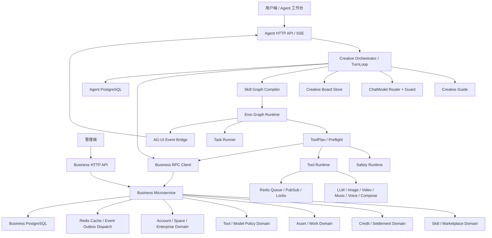
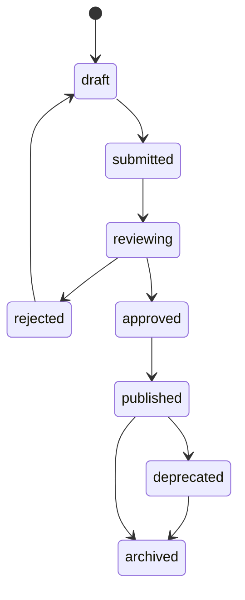
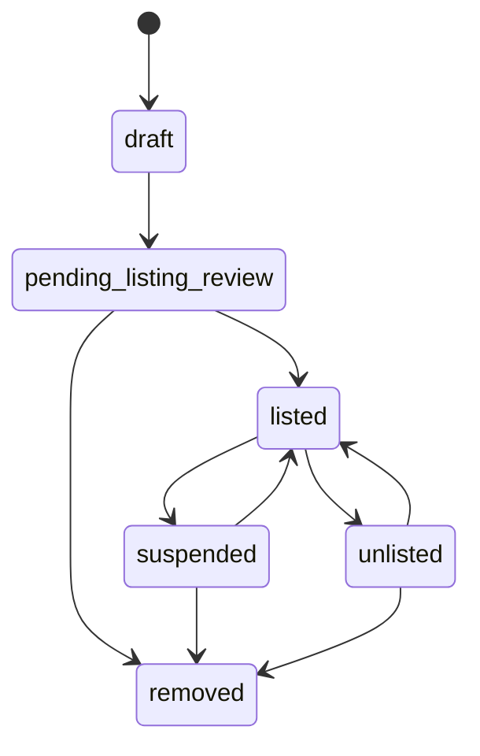
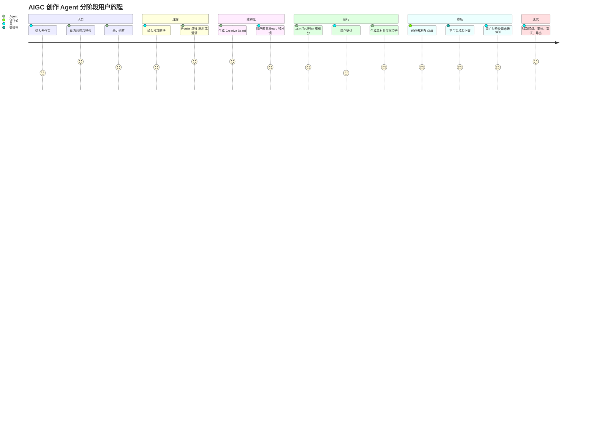
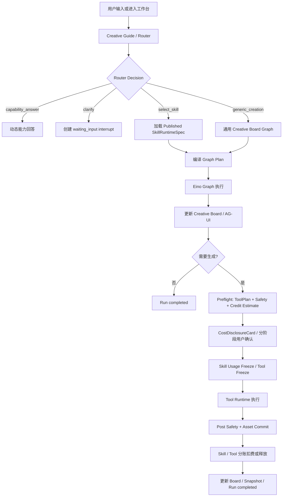

# AIGC 创作 Agent 核心重构总体架构与阶段拆分

状态：active  
owner：文档与契约责任域  
更新时间：2026-07-01  
适用范围：Dora-Agent 全栈重构总体方案  
相关代码路径：`services/agent/**`、`services/business/**`、`frontend/**`、`admin_frontend/**`、`api/**`、`db/migrations/**`  
相关契约：后续 M0 阶段冻结的 RPC、API、AG-UI、Agent 数据模型和 SQL 契约  
来源文档：`/Users/figo/Downloads/AIGC_Creation_Agent v1_1.md`

## 0. 设计总览

本次重构把 Dora-Agent 定义为“通用 AIGC 创作编排系统”，而不是单一问答机器人或多个垂直 Agent 的集合。

最终形态：

```text
统一 Agent 工作台
  + Creative Guide
  + ChatModel Router
  + Skill Runtime Spec
  + Skill Graph Template
  + Graph Plan Compiler
  + Eino Graph Runtime / Graph Tool
  + Creative Board State
  + AG-UI Event Protocol
  + Tool Runtime / 业务 RPC
  + 开放 Skill 市场
  + Release Governance / Ops Handover
```

核心边界：

1. Agent 服务只保存 Runtime 事实，包括 session、run、turn、message、event、board、graph plan、tool plan、task、interrupt、snapshot。
2. 业务事实由业务微服务维护，包括用户、空间、企业权限、项目、资产、积分、Skill 发布、市场上架、安装、评分、举报、结算、Tool 策略、模型配置。
3. 前端只消费 HTTP API 和 AG-UI 事件，不发明业务字段。
4. Redis 用于缓存、队列、事件广播和短期锁，不作为最终事实源。
5. PostgreSQL 分 Agent DB 和 Business DB，迁移脚本分目录，禁止数据库级外键约束。

## 1. 架构设计



## 2. 阶段拆分

| 阶段 | 名称 | 主闭环 | 主要产物 |
| --- | --- | --- | --- |
| M0 | 协议冻结与微服务基线 | 字段、事件、状态、表和服务边界可审核 | 最小协议清单、RPC/API/AG-UI 草案、表设计、错误码、配置和测试入口 |
| M1 | Creative Guide 与 ChatModel Router | 用户进来能被动态引导，输入能被路由或澄清 | Guide、RouterDecision、Router Guard、Router Eval |
| M2 | Creative Board 与 AG-UI 事件 | 创作状态结构化、可编辑、可回放、可恢复 | Board、Element、Patch、Snapshot、Event replay |
| M3 | Skill Runtime Spec 与 Eino Graph Plan | Published Skill 可编译成稳定 Graph Plan 并支持 User Gate | Spec Validator、Graph Compiler、Graph Runtime、Interrupt/Resume |
| M4 | Preflight 与 Tool Runtime 资产扣费 | 生成前确认、冻结、执行、保存、扣费/释放完整闭环 | ToolPlan、Safety、Credit、Task Runner、Asset Commit |
| M5 | 开放 Skill 市场与两段积分结算 | 用户/企业发布市场 Skill，使用费和 Tool 费分别结算 | Marketplace、Listing、Install、Usage、Settlement、治理 |
| M6 | 前后台体验与端到端验收 | 用户端、管理端、城市文旅 Skill 完整可验收 | 工作台 UI、管理端页面、E2E、性能并发、Redis 事件验证 |
| M7 | 契约拆分、迁移发布与运营治理 | review 设计可拆成 active 事实源并可灰度、回滚、运营接管 | active 文档、migration、feature flags、发布批次、观测告警、回滚预案 |

### 2.1 横向冻结项

以下约束横跨 M0-M7，不能在单个阶段内自行解释：

| 约束 | 说明 | 主文档 |
| --- | --- | --- |
| 统一状态枚举 | `running/in_progress/processing`、`cancelled/canceled`、`failed/error`、`listed/published` 不混用 | M0 |
| Skill 双状态机 | `SkillVersionStatus` 管不可变内容版本，`MarketplaceListingStatus` 管市场上架 | M0 / M5 |
| 市场路由策略 | 默认 Skill 和已安装 Skill 优先，未安装市场 Skill 默认只作为候选 | M0 / M1 / M5 |
| 费用披露与分账 | UI 分阶段披露 Skill 使用费和 Tool 生成费，组件可复用，账务链路分离 | M0 / M4 / M5 / M6 |
| Graph 计费节点 | 市场 Skill 使用费节点进入 GraphPlan，按交付阶段扣费 | M3 / M5 |
| 创作者数据隔离 | 创作者不看用户原始输入、上传资产、Board 详情和生成资产 | M5 / 10 |
| 静态审核和风控 | 第一版不提供沙盒执行，因此静态审核、熔断、投诉和结算 hold 必须强约束 | M5 / 10 |
| Skill/Tool/Model 分层 | Skill 绑定能力需求，Tool/Model Registry 决定具体供应商与模型 | M0 / M4 / 09 |
| 发布治理 | review 文档不得直接进入开发，必须经 M7 拆成 active 事实源、迁移和发布计划 | M7 |

### 2.2 Skill Version 与 Marketplace Listing 双状态机





双状态机规则：

1. 只有 `SkillVersionStatus=published` 的版本可以创建或更新 listing。
2. `MarketplaceListingStatus=suspended|unlisted|removed` 只影响新 run 选择和市场展示，不修改 SkillVersion 内容。
3. Published SkillVersion 不可原地修改；修复、调价、权限变化必须生成新版本或新策略记录。
4. 历史 run 必须绑定 `skill_id + skill_version + skill_spec_digest`，listing 后续下架也不改变历史 run 快照。
5. `published` 不等于 `listed`；平台默认 Skill 可以 published 但没有 marketplace listing。

### 2.3 市场 Skill 路由和费用总原则

Router 候选优先级：

```text
system_default / installed
  -> marketplace_candidate
  -> explicit marketplace selection
```

规则：

1. 平台默认 Skill 和用户/企业已安装 Skill 作为 primary candidate。
2. 未安装市场 Skill 默认只作为 `marketplace_candidate`，不得自动执行。
3. 付费市场 Skill 未经用户确认不得进入 Graph 执行。
4. 免费默认 Skill 与付费市场 Skill 能力重叠时，默认免费 Skill 优先。
5. 只有用户显式表达使用某市场 Skill、创作者、模板或点击市场卡片时，才可直接选择市场 Skill。
6. 市场 Skill Router 输出必须包含 `pricing_summary`、`creator_summary`、`entitlement_status`。
7. Router Guard 必须校验 `listing_status`、`entitlement`、`pricing`、`permission` 和 Tool 可用性。

费用关系：

| 费用 | 账务链路 | UI 展示 | 扣费点 |
| --- | --- | --- | --- |
| Skill 使用费 | `skill_usage_records` + `credit.skill_usage.*` | `cost_disclosure.skill_usage.presented`，可复用 `CostDisclosureCard` | 达到 `value_delivered_stage` |
| Tool 生成费 | `credit_estimates/freezes/ledger` + `asset_commit_*` | `cost_disclosure.generation.presented`，展示 Skill 费用状态 | 资产保存成功后逐项扣费 |

默认 Skill 的 Skill 使用费固定为 0；市场 Skill 可设置使用费，但 Tool 生成费始终通过 M4 ToolPlan 预估、确认、冻结、提交资产和结算。

### 2.4 Active 化前 P0 补丁

当前状态是 review 已完成并通过，P0 文档补丁已完成，已进入 M7 active 契约拆分；当前只推进契约冻结，不进入 M1-M6 业务代码开发：

| P0 | 主阶段 | 必须冻结的实现口径 |
| --- | --- | --- |
| Skill 使用费 usage record | M5 | preflight 创建、状态机、幂等键、交付和结算字段 |
| 双费用确认时序 | M3 / M4 / M5 | Skill 使用费先确认，ToolPlan 生成后再确认；仅 ToolPlan 已存在时允许合并确认 |
| 创作者端 Skill 发布后台 | M5 / M6 | 发布后台路由、草稿编辑、审核结果、listing 设置、分析结算和验收 |
| 用户端 Skill 市场前台 | M5 / M6 | 市场首页、详情页、安装、workspace 候选抽屉、已安装页和使用路径 |
| Skill installation 版本策略 | M5 | 个人 `latest_published`、企业 `pinned`、升级重新确认、历史 run digest |
| Generic Creation Graph | M1 / M3 | 平台内置 L0 fallback、正式 spec、GraphPlan、spec digest、Skill 使用费 0 |

## 3. 用户旅程总图



## 4. 用户交互总原则

用户端：

- 左侧或主区域承载 Creative Board、Storyboard、Prompt、ToolPlan、Assets。
- 右侧承载 Agent 对话、澄清、确认、错误、下一步动作。
- 底部输入区支持自然语言、素材引用、Skill 选择、模型偏好和附件。
- 不按文旅、电商、MV 等场景硬编码组件；前端只认识 CreativeElement 和 render_hint。

管理端：

- 白色主题、高密度、表格优先，承载 Skill 审核、市场治理、Tool/模型策略、积分结算和审计。
- 所有高风险操作必须有 preview / confirm、原因输入、影响说明和审计提示。
- 不展示系统 Prompt、供应商原始响应、完整密钥、完整用户隐私内容。

## 5. 业务设计总原则

| 业务域 | 事实源 | Agent 写入 | 说明 |
| --- | --- | ---: | --- |
| 用户、空间、企业权限 | Business DB | 否 | Agent 通过 RPC 获取权限快照。 |
| 项目、资产、作品 | Business DB | 否 | Agent 只保存 project_id、asset_ref、work_ref。 |
| Skill 发布和市场 | Business DB | 否 | Agent 只读取 Published runtime spec 和 listing 摘要。 |
| 积分、冻结、扣费、结算 | Business DB | 否 | Agent 通过 RPC estimate/freeze/commit/release。 |
| Tool 策略和模型配置 | Business DB | 否 | Agent 执行前通过 RPC 校验。 |
| 会话、Run、Board、Graph、事件 | Agent DB | 是 | Runtime 事实，不承载业务主数据。 |

## 6. 总体表设计

Agent DB：

| 表 | 用途 | 阶段 |
| --- | --- | --- |
| `agent_sessions` | 会话、active_board_id、last_snapshot_id | M0-M2 |
| `agent_runs` | run 状态、router_decision、skill 快照、graph_plan_digest | M0-M3 |
| `agent_messages` | 用户/Agent 消息、控件输入、board_patch_ref | M0-M2 |
| `agent_events` | AG-UI event envelope、seq、dedupe_key、payload | M0-M2 |
| `agent_artifacts` | creative_board、graph_plan、tool_plan、draft_asset | M0-M4 |
| `agent_tasks` | graph node、tool task、状态、取消、重试 | M3-M4 |
| `agent_tool_calls` | tool_id、input_digest、output_digest、attempt、latency | M4 |
| `agent_interrupts` | waiting_input、confirmation、resume_context | M3-M4 |
| `agent_snapshots` | run、board、task、interrupt 快照 | M2-M4 |
| `agent_creative_boards` | Board 当前指针和元数据 | M2 |
| `agent_creative_board_versions` | Board 版本内容和摘要 | M2 |
| `agent_creative_board_elements` | 元素级内容、锁定状态和来源节点 | M2 |
| `agent_creative_board_patches` | Patch、版本校验、影响路径 | M2 |
| `agent_release_audits`、`agent_runtime_health_snapshots` | 发布批次追溯和运行健康快照 | M7 |

Business DB：

| 表 | 用途 | 阶段 |
| --- | --- | --- |
| `skills`、`skill_versions` | Skill 元数据和冻结版本 | M0-M5 |
| `skill_runtime_specs` | runtime spec、digest、校验结果 | M0-M3 |
| `skill_marketplace_listings` | 市场上架信息 | M5 |
| `skill_pricing_policies` | Skill 使用费策略 | M5 |
| `skill_permission_policies` | Skill 权限矩阵 | M5 |
| `skill_installations` | 个人/企业安装和授权 | M5 |
| `skill_usage_records` | 使用费、交付阶段、结算引用 | M5 |
| `skill_creator_settlements` | 创作者结算和 hold period | M5 |
| `skill_reviews`、`skill_reports`、`skill_ratings` | 审核、举报、评分 | M5-M6 |
| `tool_registry`、`tool_policies` | Tool 能力、权限、并发、计费 | M0-M4 |
| `model_registry`、`model_routing_policies` | 模型能力、质量画像、供应商别名和 Skill Level 可用范围 | M0-M4 |
| `credit_estimates`、`credit_freezes`、`credit_ledger_entries` | 积分预估、冻结、扣费、释放 | M4-M5 |
| `system_feature_flags`、`release_batches`、`migration_jobs`、`contract_fixture_runs`、`runtime_health_metrics`、`operational_incidents` | 发布、迁移、观测和事故治理 | M7 |

## 7. Eino 使用总说明

| Eino 能力 | 用途 | 首次落地阶段 |
| --- | --- | --- |
| ChatModel | Guide、Router、Brief、Storyboard、Prompt Compiler | M1 |
| Graph | Skill 确定性阶段执行、User Gate、分支、并行 | M3 |
| Workflow | Preflight、Asset Commit、Settlement、Release Health Check 等固定子流程 | M4-M7 |
| Tool | 模型生成、RPC、安全、积分、资产、市场能力封装 | M4-M5 |
| Graph Tool | 可复用分镜包、资产生成包、Board refinement 包 | M3-M4 |
| Interrupt / Resume | 补字段、Board 审核、扣费确认、长任务恢复 | M3-M4 |
| Callback / Trace | 节点、模型、Tool、RPC、错误和事件观测 | M1-M7 |
| Memory | 用户偏好和短期创作摘要，默认不作为 M0 必需 | M6 后续 |

Eino 适配层要求：

```text
services/agent/internal/runtime/einoadapter/
  chatmodel.go
  graph.go
  graph_tool.go
  interrupt.go
  callback.go
```

业务编排代码只依赖项目内部接口，例如 `GraphRuntime`、`StructuredChatModel`、`GraphToolRuntime`、`InterruptStore`，不得把 Eino SDK 类型散落到业务服务、Router、Board 或 ToolPlan 模块中。

## 8. Prompt Schema 示例

```json
{
  "schema_version": "prompt_schema.v1",
  "prompt_id": "router_decision_prompt.v1",
  "purpose": "chatmodel_router",
  "inputs": {
    "user_input": "string",
    "session_summary": "string|null",
    "board_summary": "object|null",
    "skill_catalog": "array<SkillCatalogSummary.v1>",
    "space_context": "SpaceContextSummary.v1"
  },
  "output_schema_ref": "RouterDecision.v1",
  "safety": {
    "quoted_user_input": true,
    "do_not_expose_chain_of_thought": true,
    "do_not_create_nonexistent_skill": true
  }
}
```

## 9. Tool Schema 模板示例

```json
{
  "schema_version": "tool_registry.v1",
  "tool_id": "image_gen.default",
  "tool_type": "image_gen",
  "status": "available",
  "input_schema_ref": "image_gen.input.v1",
  "output_schema_ref": "generated_image.output.v1",
  "permission_policy": {
    "allowed_skill_levels": ["L0", "L2", "L3", "L4"],
    "requires_confirmation": true,
    "requires_prompt_safety_check": true,
    "requires_asset_safety_check": true
  },
  "runtime_policy": {
    "timeout_ms": 120000,
    "max_retries": 1,
    "concurrency_limit_per_user": 2,
    "idempotency_required": true
  }
}
```

## 10. Skill Schema 示例

```json
{
  "schema_version": "skill_runtime_spec.v1",
  "skill_id": "skill_city_tourism_video",
  "version": "1.0.0",
  "level": "L3",
  "status": "published",
  "scope": "system_default",
  "routing": {
    "domains": ["tourism", "city_branding", "marketing_video"],
    "intent_examples": ["帮我做一个杭州文旅宣传视频"],
    "negative_intents": ["旅游攻略查询", "酒店预订"],
    "priority": 50
  },
  "graph_template_ref": "city_tourism_video.graph.v1",
  "board_schema_ref": "creative_board.v1",
  "tool_bindings": {
    "image_generation": ["image_gen.default"],
    "video_generation": ["video_gen.default"],
    "asset_commit": ["asset_rpc.commit_generated_asset"]
  },
  "confirmation_policy": {
    "require_before_generation": true,
    "require_credit_estimate": true
  },
  "marketplace": {
    "listing_allowed": true,
    "version_status": "published",
    "listing_status": null,
    "default_skill_usage_points": 0,
    "creator_data_visibility_policy_ref": "creator_data_visibility.default.v1"
  }
}
```

## 11. 总体流程图



## 12. 开发细节和注意事项

1. 先补文档和契约，再重构代码；未冻结字段不得写入实现。
2. 每个阶段按功能点提交，避免跨阶段大提交。
3. 所有列表接口默认分页 10 条，最大值由契约定义。
4. 所有写操作必须有 idempotency_key。
5. Agent 服务不得直接写 Business DB。
6. Business 服务不得承载 Eino 编排。
7. Redis 锁和事件不能替代 PostgreSQL 最终状态。
8. 业务表和 Agent 表不创建数据库级外键约束。
9. 生成前确认绑定 digest，不绑定笼统“同意”。
10. 前端未知 AG-UI 事件必须忽略并记录诊断，不崩溃。

## 13. 总体验收标准

- [ ] 每个阶段文档状态、owner、更新时间、适用范围完整。
- [ ] 每个阶段都有用户旅程、交互、业务、架构、表、Schema、Eino、流程和验收。
- [ ] 所有业务事实通过 RPC 产生。
- [ ] Router 不选择不存在或未发布 Skill。
- [ ] Board 可版本化、可 Patch、可恢复。
- [ ] Graph Plan running 后不原地修改拓扑。
- [ ] ToolPlan 绑定 board_version 和 digest。
- [ ] 资产保存成功后扣费，失败释放。
- [ ] 市场 Skill 使用费和 Tool 生成费分离。
- [ ] 市场 Skill 版本状态和 listing 状态使用双状态机。
- [ ] 付费市场 Skill 未确认不得自动执行。
- [ ] 创作者默认不能查看用户原始输入、上传资产、Board 详情和生成资产。
- [ ] Tool 绑定能力需求，具体模型由 Model Registry 和 Tool Policy 选择。
- [ ] M7 可把 review 文档拆成 active 事实源，并有 migration、feature flags、观测和回滚设计。
- [ ] 管理端、用户端和测试验收有明确契约输入。
