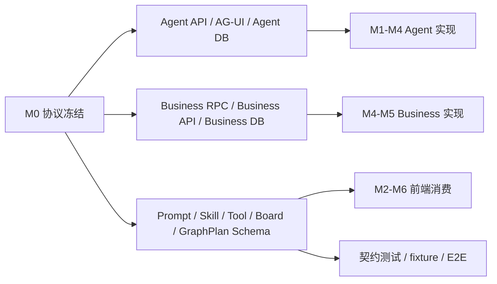
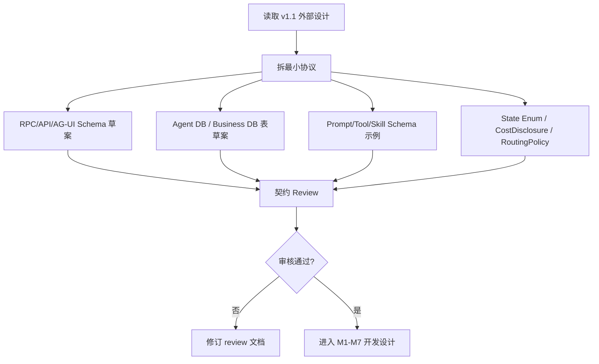

# M0 协议冻结与微服务基线设计

状态：active  
owner：文档与契约责任域  
更新时间：2026-07-01  
适用范围：RouterDecision、CreativeGuide、SkillRuntimeSpec、CreativeBoard、GraphPlan、ToolPlan、AG-UI、RPC、Agent/Business 数据模型最小协议  
相关代码路径：`api/**`、`services/agent/internal/domain/**`、`services/business/internal/infra/repository/businesscore/**`、`db/migrations/**`  
相关契约：`api/thrift/business_agent_service.thrift`、`api/openapi/agent-workbench.yaml`、`api/openapi/business-api.yaml`、`api/agui/agent-workbench-events.schema.json`

## 0. 阶段目标与闭环

M0 的目标不是实现业务功能，而是冻结后续阶段共同依赖的“最小协议集合”，确保产品、Agent 服务、业务服务、前端、测试都围绕同一字段、状态和事件协作。

M0 闭环定义：

```text
协议清单确认
  -> RPC / API / AG-UI / 数据模型 / SQL 草案完成
  -> Schema 示例和 fixture 规则完成
  -> 责任域确认
  -> 后续阶段可按协议开发
```

M0 不做：

- 不实现 ChatModel Router。
- 不实现 Board Patch 逻辑。
- 不实现市场 Skill 使用费扣费。
- 不重构用户端和管理端页面。

## 1. 架构设计

M0 只定义边界，不引入新运行链路。



微服务边界：

| 服务 | M0 产出 | 禁止事项 |
| --- | --- | --- |
| Agent 服务 | Agent Runtime 数据模型、Agent API、AG-UI、Router/Board/Graph/ToolPlan schema | 不保存项目、资产、积分、市场、结算业务事实 |
| Business 服务 | Skill、Tool、Model、Credit、Asset、Marketplace RPC/API 与表设计 | 不做 Eino Graph 编排，不生产 AG-UI |
| 用户端 | 工作台事件和组件协议 | 不写死场景字段 |
| 管理端 | 审核、市场、Tool/模型、积分治理字段协议 | 不展示敏感内部字段 |
| 测试 | Contract fixture 与验收矩阵 | 不以旧归档文档为准 |

## 2. 技术实现细节

### 2.1 最小协议清单

M0 必须冻结：

```text
RouterDecision.v1
CreativeGuideOutput.v1
SkillCatalogSummary.v1
StateEnumRegistry.v1
SkillLevel.v1
SkillRuntimeSpec.v1
SkillPackage.v1
SkillVersionStatus.v1
SkillMarketplaceListing.v1
MarketplaceListingStatus.v1
MarketplaceSkillRoutingPolicy.v1
SkillPricingPolicy.v1
SkillPermissionPolicy.v1
SkillUsageRecord.v1
SkillUsagePreflight.v1
SkillInstallation.v1
CostDisclosure.v1
ToolRegistry.v1
ModelRegistry.v1
CreatorDataVisibilityPolicy.v1
CreativeBoard.v1
CreativeElement.v1
Storyboard.v1
PromptElement.v1
BoardPatch.v1
GraphTemplate.v1
GraphPlan.v1
ToolPlan.v1
ConfirmationPayload.v1
AGUIEventEnvelope.v1
```

### 2.2 字段级事实源

| 协议 | 字段级事实源 | M0 输出 |
| --- | --- | --- |
| RPC | `api/thrift/business_agent_service.thrift` | 新增 Marketplace、Skill usage、Entitlement、Settlement RPC 草案 |
| Agent API | `api/openapi/agent-workbench.yaml` | Board、Patch、Resume、Confirmation endpoint 草案 |
| Business API | `api/openapi/business-api.yaml` | Skill 市场、审核、安装、评分、举报、治理接口草案 |
| AG-UI | `api/agui/agent-workbench-events.schema.json` | guide、router、board、graph、market、toolplan 事件 |
| Agent DB | `docs/contracts/data/**` + migration | Board、GraphPlan、Snapshot 扩展 |
| Business DB | `docs/contracts/sql/**` + migration | Marketplace、pricing、usage、settlement 表 |

### 2.3 错误码分类

| 分类 | 错误码示例 | 使用方 |
| --- | --- | --- |
| 用户输入 | `USER_INPUT_MISSING`、`BOARD_CONFLICT` | Agent / 前端 |
| 路由 | `ROUTER_INVALID_JSON`、`SKILL_UNAVAILABLE` | Agent |
| 权限 | `PERMISSION_DENIED`、`SKILL_ENTITLEMENT_REQUIRED` | Business |
| 计费 | `CREDIT_INSUFFICIENT`、`CREDIT_FREEZE_EXPIRED` | Business |
| 工具 | `TOOL_POLICY_DENIED`、`TOOL_TIMEOUT` | Agent / Business |
| 市场 | `LISTING_UNAVAILABLE`、`SKILL_USAGE_NOT_DELIVERED` | Business |
| 系统 | `INTERNAL_ERROR`、`RPC_TIMEOUT` | 全服务 |

### 2.4 StateEnumRegistry.v1

M0 必须冻结统一枚举，禁止各阶段自行引入同义状态。

| 枚举 | 值 |
| --- | --- |
| `RunStatus` | `created`、`routing`、`planning`、`waiting_input`、`waiting_confirmation`、`freezing`、`queued`、`running`、`completed`、`failed`、`cancelled` |
| `BoardStatus` | `draft`、`reviewing`、`approved`、`locked_for_generation`、`completed`、`archived` |
| `GraphPlanStatus` | `compiled`、`running`、`waiting_input`、`waiting_confirmation`、`completed`、`failed`、`cancelled` |
| `GraphNodeStatus` | `pending`、`running`、`waiting`、`skipped`、`completed`、`failed`、`cancelled` |
| `InterruptStatus` | `waiting`、`resumed`、`expired`、`cancelled` |
| `ToolPlanStatus` | `draft`、`estimated`、`confirmation_required`、`confirmed`、`frozen`、`queued`、`running`、`partially_completed`、`completed`、`failed`、`cancelled` |
| `ToolTaskStatus` | `pending`、`queued`、`running`、`succeeded`、`failed`、`cancelled`、`released` |
| `AssetCommitStatus` | `prepared`、`committing`、`committed`、`partially_committed`、`failed`、`cancelled` |
| `CreditFreezeStatus` | `created`、`active`、`partially_committed`、`committed`、`released`、`expired`、`cancelled` |
| `CreditLedgerStatus` | `pending`、`posted`、`reversed`、`voided` |
| `SkillVersionStatus` | `draft`、`submitted`、`reviewing`、`rejected`、`approved`、`published`、`deprecated`、`archived` |
| `MarketplaceListingStatus` | `draft`、`pending_listing_review`、`listed`、`unlisted`、`suspended`、`removed` |
| `SkillUsageStatus` | `confirmation_required`、`confirmation_declined`、`cancelled`、`expired`、`frozen`、`running`、`value_delivered`、`charged`、`settlement_pending`、`released`、`refund_pending`、`refunded`、`refund_rejected`、`failed` |
| `SettlementStatus` | `pending_hold`、`eligible`、`settling`、`settled`、`reversed`、`frozen`、`failed` |
| `ReviewStatus` | `submitted`、`reviewing`、`approved`、`rejected`、`risk_review` |
| `ReportStatus` | `submitted`、`triaging`、`action_required`、`resolved`、`dismissed` |
| `InstallationStatus` | `installed`、`disabled`、`revoked`、`expired` |
| `InstallationUpgradeStatus` | `none`、`available`、`manual_confirmation_required`、`confirmed`、`skipped`、`failed` |

规范：

1. `published` 只用于 SkillVersion，`listed` 只用于 Marketplace Listing。
2. 取消类状态统一写 `cancelled`。
3. 失败统一写 `failed`，错误详情写 `error_code` 和 `error_class`。
4. 流程执行统一使用 `running`，排队使用 `queued`，等待用户使用 `waiting_*`。

### 2.5 市场路由、费用披露和数据隔离协议

`MarketplaceSkillRoutingPolicy.v1`：

```json
{
  "schema_version": "marketplace_skill_routing_policy.v1",
  "primary_candidate_sources": ["system_default", "installed"],
  "marketplace_default_mode": "marketplace_candidate",
  "paid_marketplace_requires_confirmation": true,
  "prefer_free_default_when_overlap": true,
  "direct_select_requires_explicit_user_intent": true,
  "guard_checks": [
    "skill_version_status",
    "listing_status",
    "entitlement",
    "pricing",
    "permission",
    "tool_availability"
  ]
}
```

`RouterDecision.v1` 涉及市场 Skill 时必须扩展：

```json
{
  "decision": "select_skill",
  "skill_source": "marketplace",
  "skill_id": "skill_market_city_tourism_video_pro",
  "listing_id": "listing_123",
  "requires_skill_usage_confirmation": true,
  "pricing_summary": {
    "skill_usage_points": 120,
    "tool_generation_points": "preflight_estimate"
  },
  "creator_summary": {
    "creator_type": "personal",
    "display_name": "城市影像工作室"
  },
  "entitlement_status": "install_required"
}
```

`CostDisclosure.v1` 分两类事件：

| 事件 | 阶段 | 必需 digest |
| --- | --- | --- |
| `cost_disclosure.skill_usage.presented` | 付费市场 Skill 执行前 | `skill_usage_digest` |
| `cost_disclosure.generation.presented` | Board approved 且 ToolPlan 已生成后 | `tool_plan_digest` |

`SkillUsageDisclosure.v1`：

```json
{
  "schema_version": "cost_disclosure.v1",
  "type": "skill_usage_disclosure",
  "skill_usage_fee": {
    "points": 120,
    "charge_timing": "分镜方案生成完成后扣除",
    "refund_policy_summary": "未生成方案不扣费"
  },
  "tool_generation_fee": {
    "points": "后续生成图片/视频/音乐时另行预估",
    "charge_timing": "图片/视频/音乐资产保存成功后逐项扣除",
    "refund_policy_summary": "失败项释放冻结积分"
  },
  "total_user_visible_summary": "本 Skill 使用费 120 积分，后续生成素材将另行预估。"
}
```

`ToolGenerationDisclosure.v1`：

```json
{
  "schema_version": "cost_disclosure.v1",
  "type": "tool_generation_disclosure",
  "skill_usage_fee_status": "frozen|charged|zero",
  "tool_generation_fee": {
    "estimate_points": 480,
    "items": [
      {
        "tool": "video_gen.default",
        "estimate_points": 300
      }
    ],
    "charge_timing": "资产保存成功后逐项扣除",
    "refund_policy_summary": "失败项释放冻结积分"
  }
}
```

默认 Skill 的 `skill_usage_fee.points=0`，文案固定表达为“Skill 使用费：0 积分；生成素材费：按生成前预估”。

`CreatorDataVisibilityPolicy.v1` 默认值：

```json
{
  "schema_version": "creator_data_visibility_policy.v1",
  "creator_can_view_user_inputs": false,
  "creator_can_view_uploaded_assets": false,
  "creator_can_view_creative_board_details": false,
  "creator_can_view_generated_assets": false,
  "creator_can_view_aggregated_metrics": true,
  "creator_can_view_income": true,
  "creator_can_view_ratings": true,
  "creator_can_view_reports": true,
  "creator_can_view_sanitized_error_summary": true,
  "debug_log_access": "not_available_in_first_phase"
}
```

## 3. 用户旅程

M0 面向工程协作用户，不面向最终用户。

1. 产品/架构审核协议清单。
2. Agent 服务根据协议实现 M1-M4。
3. Business 服务根据协议实现 M4-M5。
4. 前端根据 AG-UI 和 API 设计组件。
5. 测试根据 fixture 验证字段、顺序、状态和错误。

## 4. 用户交互

用户端在 M0 只定义交互协议：

- 工作台收到 `creative.guide.presented` 后渲染欢迎和 suggestion chips。
- 收到 `creative.router.decided` 后渲染选中 Skill、候选 Skill 或澄清问题。
- 收到 `creative.board.patch.applied` 后按 board_version 更新。
- 收到 `cost_disclosure.skill_usage.presented` 后渲染 Skill 使用费披露卡，提交时绑定 `skill_usage_digest`。
- 收到 `cost_disclosure.generation.presented` 后渲染 Tool 生成费披露卡，提交时绑定 `tool_plan_digest`。
- 收到 `confirmation.required` 后渲染确认卡，确认绑定 digest。

管理端在 M0 只定义交互协议：

- Skill 审核页必须展示 spec 校验结果、Tool 绑定风险、价格策略、版权声明。
- 市场治理页必须支持下架、暂停、恢复、投诉查看和审计记录。
- 积分结算页必须区分 Skill 使用费和 Tool 生成费。

## 5. 业务设计

M0 业务规则：

1. `SkillVersionStatus=published` 的版本才能被 Router 候选池使用。
2. 平台默认 Skill 的 Skill 使用费固定为 0。
3. 市场 Skill 未确认费用前不得执行付费使用链路。
4. 生成类 Tool 必须走 ToolPlan、安全、积分预估、确认和冻结。
5. Agent DB 只保存业务引用和 Runtime 摘要。
6. 所有写业务事实的操作必须经 Business RPC，且有幂等键和审计字段。
7. 只有 published SkillVersion 可以创建 listing；listing 状态变化不得修改 SkillVersion 内容。
8. 市场 Skill 创作者默认不能查看用户原始输入、上传资产、Creative Board 详情和生成资产。

## 6. 表设计

### 6.1 Agent DB 扩展

| 表 | 字段 | 说明 |
| --- | --- | --- |
| `agent_sessions` | `active_board_id`、`last_snapshot_id` | 当前 Board 和恢复点 |
| `agent_runs` | `run_intent`、`router_decision`、`skill_id`、`skill_version`、`skill_spec_digest`、`graph_plan_digest`、`board_version` | Run 编排快照 |
| `agent_events` | `event_type`、`seq`、`dedupe_key`、`payload_json` | 事件补偿和幂等 |
| `agent_artifacts` | `artifact_type`、`content_digest`、`business_ref_id` | Board、GraphPlan、ToolPlan、draft_asset |
| `agent_snapshots` | `snapshot_id`、`board_summary`、`run_status`、`pending_interrupt`、`active_tasks` | 断线恢复 |
| `agent_creative_board_elements` | `element_id`、`board_id`、`board_version`、`element_type`、`element_key`、`content_json`、`content_digest`、`locked`、`source_run_id`、`source_node_key` | 可选元素级拆分 |

### 6.2 Business DB 扩展

| 表 | 字段 | 说明 |
| --- | --- | --- |
| `skill_versions` | `skill_id`、`version`、`status`、`skill_spec_digest`、`published_at` | Skill 不可变版本 |
| `skill_marketplace_listings` | `listing_id`、`skill_id`、`skill_version`、`listing_status`、`pricing_policy_id`、`health_status`、`risk_score`、`auto_suspended_reason`、`last_health_check_at` | 市场上架和风险状态 |
| `skill_pricing_policies` | `pricing_type`、`skill_usage_points`、`refund_policy` | Skill 使用费 |
| `skill_permission_policies` | `asset_permission`、`tool_permission`、`credit_permission`、`runtime_permission`、`data_visibility` | 权限矩阵 |
| `skill_installations` | `installation_id`、`listing_id`、`install_scope`、`installed_skill_version`、`version_policy`、`pricing_policy_snapshot_id`、`permission_policy_snapshot_id`、`auto_upgrade_allowed`、`upgrade_requires_admin_confirmation`、`status` | 安装授权 |
| `skill_usage_records` | `usage_id`、`run_id`、`listing_id`、`skill_version`、`skill_spec_digest`、`pricing_policy_digest`、`usage_status`、`skill_usage_digest`、`value_delivered_stage` | 使用记录 |
| `skill_creator_settlements` | `usage_id`、`gross_points`、`commission_points`、`settlement_status` | 创作者结算 |
| `model_registry` | `model_id`、`model_type`、`provider_alias`、`status`、`capabilities`、`quality_profile`、`policy` | 模型能力注册 |

所有 SQL 禁止 `FOREIGN KEY` / `REFERENCES`。

### 6.3 SkillInstallation.v1

```json
{
  "schema_version": "skill_installation.v1",
  "installation_id": "inst_123",
  "listing_id": "listing_123",
  "install_scope": "personal|enterprise",
  "installed_skill_version": "1.0.0",
  "version_policy": "pinned|latest_published|manual_upgrade",
  "pricing_policy_snapshot_id": "price_123",
  "permission_policy_snapshot_id": "perm_123",
  "auto_upgrade_allowed": false,
  "upgrade_requires_admin_confirmation": true,
  "status": "installed"
}
```

默认策略：

1. 个人安装：默认 `latest_published`，每次使用前按当前 listing pricing 展示确认。
2. 企业安装：默认 `pinned`，企业管理员手动升级。
3. 历史 run：永远使用 run 快照中的 `skill_id + skill_version + skill_spec_digest`。

## 7. Prompt Schema 示例

```json
{
  "schema_version": "prompt_schema.v1",
  "prompt_id": "creative_guide_prompt.v1",
  "purpose": "entry_guide",
  "inputs": {
    "space_context": "SpaceContextSummary.v1",
    "skill_catalog": "array<SkillCatalogSummary.v1>",
    "recent_creation_summary": "string|null",
    "locale": "string"
  },
  "outputs": {
    "schema_ref": "CreativeGuideOutput.v1"
  },
  "policy": {
    "do_not_list_internal_tools": true,
    "do_not_create_nonexistent_skill": true
  }
}
```

## 8. Tool Schema 模板示例

```json
{
  "schema_version": "tool_schema_template.v1",
  "tool_id": "tool.policy.check",
  "tool_type": "policy",
  "input_schema": {
    "skill_id": "string",
    "skill_version": "string",
    "tool_id": "string",
    "project_id": "string",
    "risk_context": "object"
  },
  "output_schema": {
    "allowed": "boolean",
    "risk_level": "low|medium|high",
    "requires_confirmation": "boolean",
    "timeout_ms": "integer",
    "retry_policy": "object"
  },
  "idempotency_required": false
}
```

## 9. Skill Schema 示例

```json
{
  "schema_version": "skill_catalog_summary.v1",
  "skill_id": "skill_city_tourism_video",
  "version": "1.0.0",
  "status": "published",
  "scope": "system_default",
  "level": "L3",
  "name": "城市文旅宣传视频",
  "capability_summary": "生成城市宣传片 brief、分镜、旁白和生成计划。",
  "route_hints": {
    "domains": ["tourism", "city_branding"],
    "output_types": ["video", "storyboard"],
    "positive_examples": ["帮我做一个杭州文旅宣传视频"],
    "negative_examples": ["旅游攻略查询"]
  },
  "pricing_summary": {
    "skill_usage_points": 0,
    "tool_generation_points": "preflight_estimate"
  },
  "marketplace_summary": {
    "skill_source": "system_default",
    "listing_status": null,
    "entitlement_status": "available"
  }
}
```

## 10. 流程图



## 11. Eino 使用说明

M0 不调用 Eino，只冻结 Eino 相关边界：

- ChatModel 输出必须有 JSON schema。
- Graph Plan 是 Skill Graph Template 编译后的不可变快照。
- Tool / RPC 节点必须声明超时、重试、幂等和补偿。
- Interrupt / Resume 必须绑定 `interrupt_id`、`payload_digest`、`board_version`。
- Callback / Trace 字段不得记录系统 Prompt、供应商原始响应、API Key。
- Eino SDK 类型只出现在 `runtime/einoadapter/**`，业务编排代码依赖内部接口。

## 12. 开发细节

1. 新建或更新契约文件时同步测试 fixture。
2. Thrift 新增字段只追加编号，不复用旧编号。
3. OpenAPI 请求/响应 DTO 按场景拆分，不暴露 ORM。
4. AG-UI payload 必须版本化。
5. 表设计先写 SQL 草案和 down 脚本，再写 repository。
6. Redis key 命名先冻结，避免后续跨阶段冲突。

## 13. 开发注意事项

- 不把 v1.1 文档中的“示例字段”直接当最终字段，必须转成契约。
- 不在 M0 做代码实现。
- 不为了兼容旧页面保留旧字段作为新事实源。
- 未审核通过的 schema 不进入 active。

## 14. 验收标准

- [ ] 最小协议清单完整。
- [ ] 每个协议有字段级事实源路径。
- [ ] Agent DB 和 Business DB 边界清晰。
- [ ] 新增业务写操作都有 RPC、幂等和审计。
- [ ] AG-UI 有 event_id、seq、dedupe_key、payload_schema_version。
- [ ] Prompt、Tool、Skill schema 示例可用于后续 fixture。
- [ ] State Enum Registry 覆盖运行、Board、Graph、Tool、资产、积分、市场、审核、举报、安装和结算。
- [ ] CostDisclosure 默认分两次事件展示；combined confirmation 只允许在 ToolPlan 已存在时同时绑定 Skill 使用费和 Tool 生成费。
- [ ] RouterDecision 市场字段覆盖 pricing、creator、entitlement 和确认要求。
- [ ] CreatorDataVisibilityPolicy 默认保护用户输入、资产、Board 和生成结果。
- [ ] 后续 M1-M7 不需要猜字段。

## 15. 风险

| 风险 | 影响 | 缓解 |
| --- | --- | --- |
| 协议过早定死 | 后续阶段返工 | 先 review，用户审核后再 active。 |
| 协议过宽 | 实现成本失控 | M0 只冻结最小闭环字段。 |
| 旧代码字段干扰 | 新旧事实源冲突 | current 文档明确旧文档归档，新实现以 M0 为准。 |
