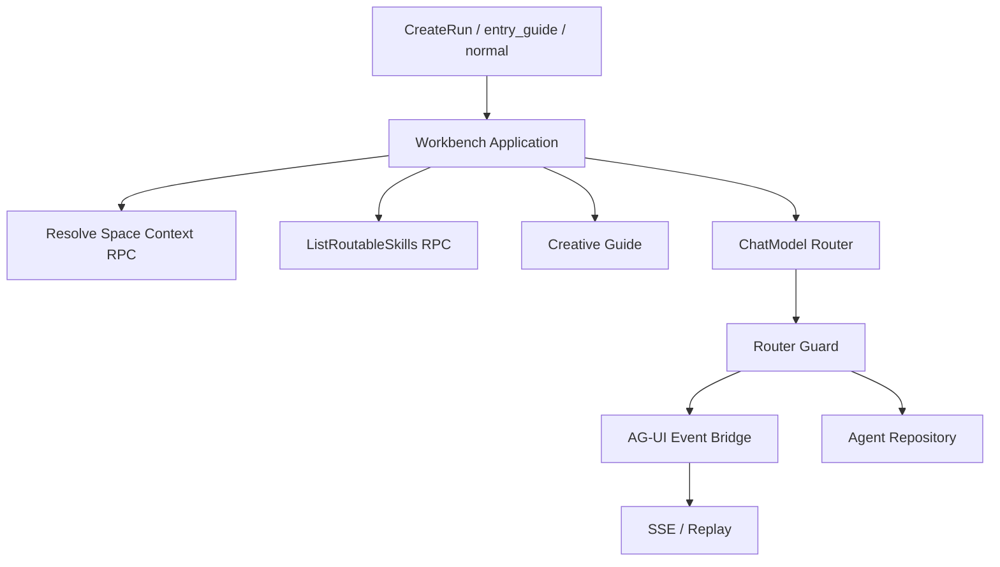
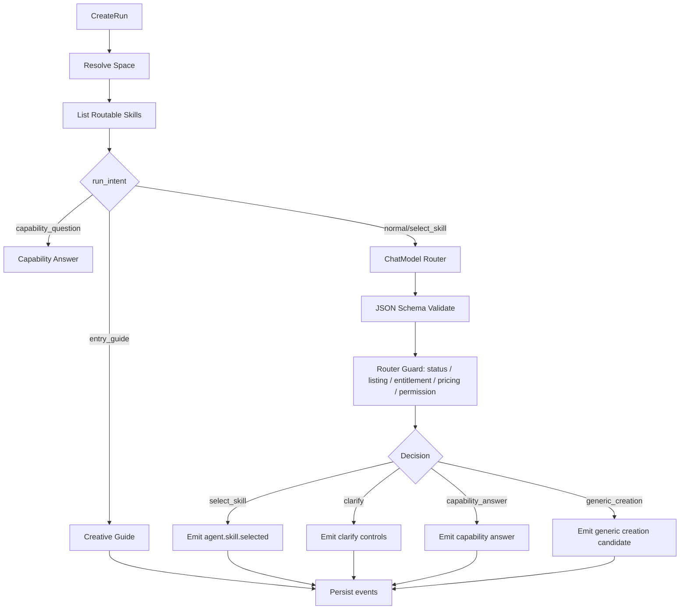

# M1 Creative Guide 与 ChatModel Router 设计

状态：active  
owner：Agent 服务责任域  
更新时间：2026-07-01  
适用范围：入口动态引导、能力问答、RouterDecision、Router Guard、Router Eval、Skill Catalog 摘要  
相关代码路径：`services/agent/internal/runtime/guide/**`、`services/agent/internal/runtime/router/**`、`services/agent/internal/application/workbench/**`
相关契约：`RouterDecision.v1`、`CreativeGuideOutput.v1`、`SkillCatalogSummary.v1`、`api/openapi/agent-workbench.yaml`、`api/agui/agent-workbench-events.schema.json`

## 0. 阶段目标与闭环

M1 让用户进入工作台后能够获得动态引导，并让自然语言输入被稳定分流到“能力回答、澄清、选择 Skill、通用创作、拒绝”等可执行决策。

闭环：

```text
创建或恢复 session
  -> 加载当前空间 Published Skill Catalog
  -> Creative Guide 动态欢迎
  -> 用户输入
  -> ChatModel Router 输出 RouterDecision.v1
  -> Router Guard 确定性校验
  -> 产生 AG-UI 事件和下一步动作
```

M1 不触发生成 Tool，不扣费，不创建复杂 Board，仅可写入 run、message、router_decision 和事件。

## 1. 架构设计



模块职责：

| 模块 | 职责 |
| --- | --- |
| Creative Guide | 根据当前空间 Skill、历史摘要和项目上下文生成欢迎、能力说明和 suggestion chips。 |
| ChatModel Router | 把用户输入结构化为 RouterDecision.v1。 |
| Router Guard | 校验 skill_id 是否存在、published、可见、Tool 能力是否满足、confidence 是否达标。 |
| Skill Catalog Adapter | 把业务 RPC 的 SkillSummary 转为 Router 可读摘要。 |
| AG-UI Bridge | 输出 guide/router/skill candidate 事件。 |

## 2. 技术实现细节

### 2.1 Run Intent

| run_intent | 触发 | 输出 |
| --- | --- | --- |
| `entry_guide` | 首次进入或恢复工作台 | `creative.guide.presented` |
| `capability_question` | 用户问“你有什么能力” | `agent.message.completed` + `creative.guide.presented` |
| `normal` | 用户普通输入 | `creative.router.decided` |
| `select_skill` | 用户点击 Skill | `agent.skill.selected` 或 `agent.skill.missing` |

### 2.2 RouterDecision.v1

```json
{
  "schema_version": "router_decision.v1",
  "decision": "select_skill",
  "skill_source": "system_default",
  "skill_id": "skill_city_tourism_video",
  "listing_id": null,
  "confidence": 0.91,
  "reason_code": "explicit_city_tourism_video",
  "safe_to_execute": false,
  "requires_skill_usage_confirmation": false,
  "extracted_params": {
    "city_or_destination": "杭州",
    "style": "现代国风",
    "duration_sec": 30
  },
  "missing_fields": [],
  "candidate_skills": [
    {
      "skill_id": "skill_city_tourism_video",
      "score": 0.91,
      "why": "用户明确要求文旅宣传视频"
    }
  ],
  "suggested_questions": [],
  "marketplace_candidates": [],
  "pricing_summary": {
    "skill_usage_points": 0,
    "tool_generation_points": "preflight_estimate"
  },
  "creator_summary": null,
  "entitlement_status": "available",
  "fallback_reason": ""
}
```

### 2.3 Router Guard 规则

| 条件 | Guard 结果 |
| --- | --- |
| `decision=select_skill` 且 skill_id 不在 Catalog | 改为 `clarify` 或 `generic_creation` |
| Skill 非 published | 改为 `clarify`，提示不可用 |
| 市场 listing 非 `listed` | 移出 primary candidate，展示不可用或改为默认 Skill |
| 市场 Skill 未安装且用户未显式选择 | 放入 `marketplace_candidates`，不得自动进入 Graph |
| 已安装 Skill 存在 `manual_upgrade_required` | 展示升级确认，不进入 Graph |
| 企业安装为 `pinned` 且有新版本 | 继续使用 pinned 版本，候选摘要提示管理员可升级 |
| 个人安装为 `latest_published` | 使用最新 published 版本，但按当前 pricing 重新展示确认 |
| 付费市场 Skill | `requires_skill_usage_confirmation=true` |
| 免费默认 Skill 与付费市场 Skill 能力重叠 | 默认 Skill 作为 primary candidate |
| confidence >= 0.85 | 自动进入 Skill 选择事件，但不生成 |
| 0.60 <= confidence < 0.85 | 展示候选，让用户确认 |
| 0.35 <= confidence < 0.60 | 进入澄清 |
| 有明确创作意图但无 published Skill 命中 | 输出 `generic_creation`，绑定内置 `skill_generic_creation` |
| confidence < 0.35 且创作意图不明确 | 文本回答或澄清 |
| safe_to_execute=true 且涉及 Tool | 强制改为 false |

### 2.4 MarketplaceSkillRoutingPolicy.v1

M1 只做路由和展示，不执行付费市场 Skill。策略如下：

| 场景 | Router 输出 |
| --- | --- |
| 平台默认 Skill 命中 | `skill_source=system_default`，`requires_skill_usage_confirmation=false` |
| 已安装市场 Skill 命中 | `skill_source=installed`，按 entitlement 输出确认要求 |
| 未安装市场 Skill 命中 | 放入 `marketplace_candidates`，`entitlement_status=install_required` |
| 用户明确点选市场 Skill | 可输出 `select_skill`，但 `requires_skill_usage_confirmation=true` |
| 价格、权限或 listing 信息不完整 | Guard 拦截，改为 clarify 或默认 Skill |

市场候选必须携带：

```json
{
  "skill_source": "marketplace",
  "skill_id": "skill_market_city_tourism_video_pro",
  "listing_id": "listing_123",
  "score": 0.86,
  "pricing_summary": {
    "skill_usage_points": 120,
    "tool_generation_points": "preflight_estimate"
  },
  "creator_summary": {
    "display_name": "城市影像工作室",
    "creator_type": "personal"
  },
  "entitlement_status": "install_required"
}
```

Router Guard 安装校验输入：

```json
{
  "installation": {
    "installation_id": "inst_123",
    "install_scope": "enterprise",
    "installed_skill_version": "1.0.0",
    "version_policy": "pinned",
    "available_upgrade_version": "1.1.0",
    "upgrade_status": "available",
    "upgrade_requires_admin_confirmation": true
  }
}
```

### 2.5 Generic Creation Router 规则

Generic Creation 是正式内置 L0 Skill，不是自由文本 fallback。

Router 输出：

```json
{
  "schema_version": "router_decision.v1",
  "decision": "generic_creation",
  "skill_source": "system_builtin",
  "skill_id": "skill_generic_creation",
  "listing_id": null,
  "requires_skill_usage_confirmation": false,
  "pricing_summary": {
    "skill_usage_points": 0,
    "tool_generation_points": "preflight_estimate"
  },
  "reason_code": "creative_intent_without_specific_skill",
  "safe_to_execute": false
}
```

规则：

1. 用户有明确创作目标，但没有合适的 published Skill 时使用。
2. 用户选择“自由创作”时使用。
3. Generic Creation 必须进入 M3 GraphPlan 编译，绑定 `skill_generic_creation` spec digest。
4. Generic Creation 不进入 Marketplace，不产生 Skill 使用费。
5. Generic Creation 不默认调用图片、视频、音乐生成 Tool。
6. Generic Creation 只做 brief、创作方向、提示词草稿、Skill 推荐和澄清。
7. 当用户意图明确且匹配具体 Published Skill 时，必须切换到该 Skill 并重新生成 GraphPlan。
8. 如果输入缺失目标、媒介或关键限制，优先 `clarify`，不得直接生成 ToolPlan。

## 3. 用户旅程

### 3.1 首次进入

1. 用户打开工作台。
2. Agent 创建或恢复 session。
3. Agent 读取当前空间 Published Skill。
4. Agent 输出动态欢迎和建议。
5. 用户点击建议或输入自由文本。

### 3.2 能力问答

1. 用户问“你有什么能力”。
2. Agent 基于 Skill Catalog 按结果导向分组。
3. 不展示内部 Tool 名称。
4. 给出可点击 Skill 和输入示例。

### 3.3 明确需求

1. 用户输入“帮我做一个杭州文旅宣传视频，现代国风，30 秒”。
2. Router 选择 `skill_city_tourism_video`。
3. Guard 校验可见和 published。
4. 前端展示“将按城市文旅宣传视频流程继续”。

### 3.4 模糊需求

1. 用户输入“帮我做个宣传片”。
2. Router 输出 `clarify`。
3. 前端展示单选澄清问题。
4. 用户回答后进入下一个 run 或 append input。

## 4. 用户交互

用户端组件：

| 组件 | 事件 | 行为 |
| --- | --- | --- |
| GuideMessage | `creative.guide.presented` | 展示欢迎、能力摘要、suggestion chips |
| SkillSuggestionChip | `creative.guide.presented` | 点击触发 select_skill run |
| RouterDecisionBanner | `creative.router.decided` | 显示已选择 Skill 或候选 |
| ClarifyControl | `creative.router.decided` decision=clarify | 渲染 text/single_select/multi_select |
| CandidateSkillList | marketplace/default candidates | 展示免费默认 Skill 与付费市场 Skill 差异 |

交互原则：

- 一次最多展示 3 个澄清问题。
- 付费市场 Skill 候选必须展示费用提示。
- 能力说明按用户结果表达，不展示 `image_gen`、`video_gen` 等内部 Tool。

## 5. 业务设计

M1 依赖业务服务提供：

| RPC | 用途 |
| --- | --- |
| `ResolveCurrentSpaceContext` | 确认当前空间和可用 scope |
| `ListRoutableSkills` | 获取当前空间可用 Skill Catalog 摘要 |
| `CheckSkillEntitlement`（M5 扩展） | 判断市场 Skill 是否可用 |

业务规则：

1. Router 候选池只包含当前用户可用且 `published` 的 Skill。
2. 平台默认 Skill 和已安装 Skill 优先，未安装市场 Skill 默认只作为候选。
3. 免费默认 Skill 与付费市场 Skill 能力重叠时，默认免费 Skill 优先。
4. 只有用户显式选择市场 Skill、创作者或模板时，Router 才能直接输出 marketplace `select_skill`。
5. 付费市场 Skill 必须输出费用、创作者和 entitlement 摘要，且不得自动执行。
6. Generic Creation 通过内置 `skill_generic_creation` 进入 Graph，不写成无 spec 的临时 fallback。
7. Router Guard 必须校验 installation 的 `version_policy`、`upgrade_status` 和是否需要管理员重新确认。
8. Router 不产生业务写入。
9. Router 结果保存为 Agent Runtime 快照，用于追踪和 eval。

## 6. 表设计

Agent DB：

| 表 | M1 字段 |
| --- | --- |
| `agent_runs` | `run_intent`、`router_decision`、`skill_id`、`skill_version`、`confidence`、`error_code` |
| `agent_messages` | `role`、`content`、`controls`、`content_summary` |
| `agent_events` | `creative.guide.presented`、`creative.router.decided`、`agent.skill.selected` |
| `agent_artifacts` | 可选保存 `artifact_type=router_decision` |

Business DB：

| 表 | M1 使用 |
| --- | --- |
| `skills` | 读取 published Skill 摘要 |
| `skill_versions` | 读取版本和 runtime spec digest 摘要 |
| `skill_marketplace_listings` | M1 可读候选摘要，完整计费在 M5 |

索引建议：

- `agent_runs(session_id, created_at desc)`
- `agent_runs(skill_id, created_at desc)`
- `agent_events(run_id, sequence)`

## 7. Prompt Schema 示例

```json
{
  "schema_version": "prompt_schema.v1",
  "prompt_id": "chatmodel_router.v1",
  "purpose": "router_decision",
  "inputs": {
    "user_input": "string",
    "run_intent": "entry_guide|capability_question|normal|select_skill",
    "locale": "string",
    "session_summary": "string|null",
    "board_summary": "object|null",
    "selected_skill_id": "string|null",
    "skill_catalog": "array<SkillCatalogSummary.v1>",
    "tool_capabilities": "object"
  },
  "output_schema_ref": "RouterDecision.v1",
  "rules": [
    "只能选择 skill_catalog 中 published skill_id",
    "用户问能力时 decision=capability_answer",
    "模糊需求 decision=clarify",
    "涉及生成 Tool safe_to_execute=false"
  ]
}
```

## 8. Tool Schema 模板示例

M1 只使用 ChatModel，不使用生成 Tool。

```json
{
  "schema_version": "tool_schema_template.v1",
  "tool_id": "llm.structured.router",
  "tool_type": "llm_structured_output",
  "input_schema_ref": "chatmodel_router_input.v1",
  "output_schema_ref": "RouterDecision.v1",
  "runtime_policy": {
    "timeout_ms": 15000,
    "max_retries": 1,
    "temperature": 0.2
  },
  "safety_policy": {
    "quoted_user_input": true,
    "no_tool_execution": true
  }
}
```

## 9. Skill Schema 示例

```json
{
  "schema_version": "skill_catalog_summary.v1",
  "skill_id": "skill_city_tourism_video",
  "version": "1.0.0",
  "status": "published",
  "level": "L3",
  "scope": "system_default",
  "name": "城市文旅宣传视频",
  "capability_summary": "把城市或景区主题整理成宣传视频 brief、分镜、旁白和生成计划。",
  "routing": {
    "domains": ["tourism", "city_branding", "marketing_video"],
    "output_types": ["video", "storyboard"],
    "intent_examples": ["帮我做一个杭州文旅宣传视频"],
    "negative_intents": ["旅游攻略", "酒店预订"],
    "priority": 50
  }
}
```

## 10. 流程图



## 11. Eino 使用说明

M1 使用 Eino ChatModel 能力，暂不启用 Graph。

- Router 使用结构化输出，必须 schema validate。
- Creative Guide 可以使用 ChatModel，但输出只作为用户引导，不触发副作用。
- Callback 记录 trace_id、run_id、model_id_alias、latency_ms、error_class。
- 不记录完整系统 Prompt、供应商原始响应和用户隐私全文。

## 12. 开发细节

目录建议：

```text
services/agent/internal/runtime/guide/
  creative_guide.go
  capability_answer.go
services/agent/internal/runtime/router/
  chatmodel_router.go
  router_guard.go
  router_prompt.go
  router_eval.go
```

运行开关（实现约定）：

- `AGENT_ROUTER_MODE=llm`：启用 ChatModel Router（DeepSeek chat completions，temperature 0.2 / timeout 15s / retry 1），结构化输出经 `ValidateRouterDecision` + Router Guard；缺少 `DEEPSEEK_API_KEY` 或任一步失败时自动降级 mock 路由。
- `AGENT_ROUTER_MODE=mock`（默认）：无第三方 Key 的结构化 mock 路由，只使用 `run_intent`、显式选择的 `skill_id/listing_id` 和目录事实；不得扫描用户文本或 `route_hints` 做关键词匹配。
- clarify 文案由路由结果的 `clarify_question` 提供（LLM 生成人话提问）；mock 路由或 LLM 缺省时用 missing_fields → 人话映射，禁止向用户直出内部字段名。
- clarify 后的追加输入走 `AppendUserInput` 合并该 run 全部用户输入重新路由；连续澄清满 3 轮后不再追问，直接进入内置 `skill_generic_creation` 场景引导。

测试：

- Router JSON schema pass。
- 明确需求命中 Skill。
- 模糊需求进入 clarify。
- 能力问答不展示内部 Tool。
- 不存在 Skill 被 Guard 拦截。
- 低置信不执行。
- LLM 输出损坏/超时降级 mock 路由。
- clarify 追加输入后续跑出创作路径，run 不滞留 waiting_input。

## 13. 开发注意事项

- 不用关键词路由替代 ChatModel Router，但 Guard 必须确定性。
- 不把付费市场 Skill 自动执行。
- 不在 Router Prompt 中注入完整 Skill Prompt。
- 不把 route_hints 写成前端固定推荐卡。
- Router 失败应降级到 mock 路由并保持契约可渲染。

## 14. 验收标准

- [ ] 用户首次进入能看到动态引导。
- [ ] 用户问能力时回答来自当前 Skill Catalog。
- [ ] 明确需求可选择 published Skill。
- [ ] 模糊需求不会误触发生成。
- [ ] Router 不能选择不存在 Skill。
- [ ] Router 输出 schema pass rate >= 99%。
- [ ] 中低置信直接生成率 = 0。
- [ ] 未安装付费市场 Skill 默认只进入 marketplace_candidates。
- [ ] 付费市场 Skill 未确认费用前不会进入 Graph 执行。
- [ ] 免费默认 Skill 与付费市场 Skill 重叠时默认免费 Skill 优先。
- [ ] generic_creation 输出绑定内置 `skill_generic_creation`，并进入 M3 GraphPlan。
- [ ] Router Guard 覆盖个人 latest_published、企业 pinned 和 manual upgrade required。

## 15. 风险

| 风险 | 影响 | 缓解 |
| --- | --- | --- |
| Router 误选付费市场 Skill | 用户信任和扣费争议 | Guard、confidence、候选确认、费用提示。 |
| Skill 摘要过长 | Token 和响应延迟 | Catalog summary 限字段、候选数量上限。 |
| 动态 Guide 幻觉能力 | 用户误解 | 只允许基于 Skill Catalog 输出。 |
