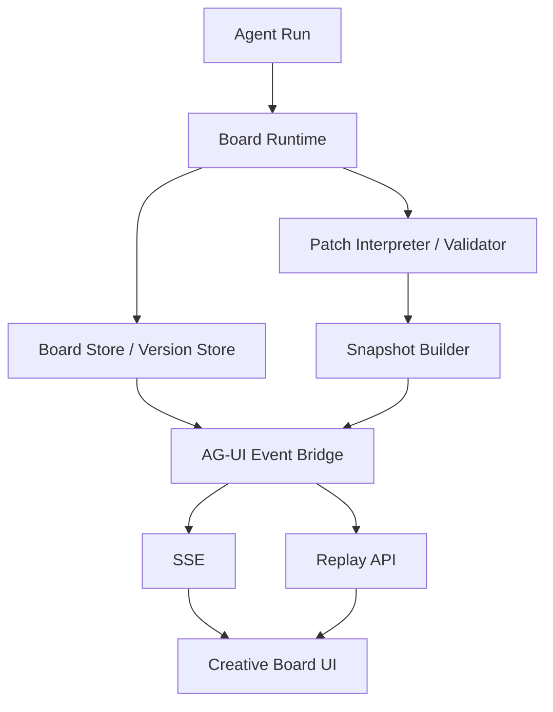
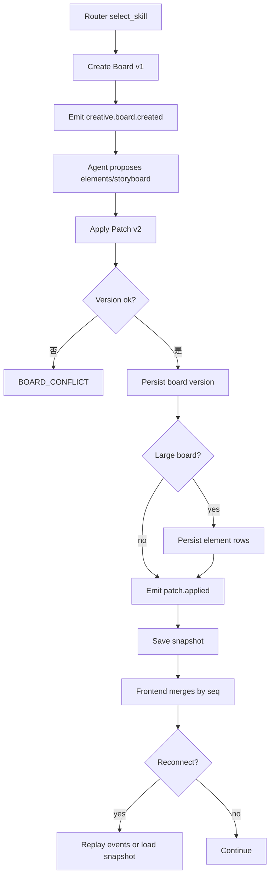

# M2 Creative Board 与 AG-UI 事件闭环设计

状态：active  
owner：Agent 服务责任域 / 前端责任域  
更新时间：2026-07-01  
适用范围：Creative Board、Creative Element、Storyboard、Board Patch、Snapshot、AG-UI event replay、前端通用渲染组件  
相关代码路径：`services/agent/internal/runtime/board/**`、`services/agent/internal/events/**`、`frontend/src/pages/AgentWorkspacePage.jsx`、`frontend/src/features/**`  
相关契约：`CreativeBoard.v1`、`CreativeElement.v1`、`Storyboard.v1`、`BoardPatch.v1`、`AGUIEventEnvelope.v1`

## 0. 阶段目标与闭环

M2 把创作状态从聊天文本中抽离出来，形成可版本化、可编辑、可恢复的 Creative Board，并通过 AG-UI 事件驱动前端通用组件渲染。

闭环：

```text
Router 选择 Skill 或通用创作
  -> 初始化 Creative Board
  -> Agent 或用户产生 Board Patch
  -> 版本校验和锁校验
  -> 保存 Board 版本和 Snapshot
  -> 发送 AG-UI 事件
  -> 前端按 sequence / dedupe_key 合并
  -> 断线后 replay 或 snapshot 恢复
```

M2 不执行生成 Tool，不冻结积分。

## 1. 架构设计



模块职责：

| 模块 | 职责 |
| --- | --- |
| Board Runtime | 创建、读取、更新 Board，维护版本和状态。 |
| Patch Validator | 校验 version_from、locked paths、安全和积分影响。 |
| Snapshot Builder | 输出 run_status、board_summary、pending_interrupt、active_tasks。 |
| AG-UI Bridge | 生产 board created/patch applied/snapshot saved 事件。 |
| Frontend Renderer | 只按 CreativeElement 和 render_hint 渲染，不按 Skill 名硬编码。 |

## 2. 技术实现细节

### 2.1 Board 状态

| 状态 | 说明 |
| --- | --- |
| `draft` | 可编辑，未确认 |
| `reviewing` | 用户查看或 Agent 等待确认 |
| `approved` | 进入 preflight 前的确认状态 |
| `locked_for_generation` | ToolPlan 生成后关键路径锁定 |
| `completed` | 当前创作链路完成 |
| `archived` | 不再继续编辑 |

### 2.2 Board Patch 规则

1. `version_from` 必须等于当前版本。
2. 用户锁定字段不能被 Agent 覆盖。
3. 修改 prompt、storyboard、tool_plan 相关路径时标记 `requires_revalidation`。
4. 修改生成参数时标记 `requires_credit_reestimate`。
5. 关键字段在 confirmation 后被修改，原 confirmation 失效。
6. Patch 写入必须幂等，key 为 `board_id:version_from:patch_digest`。

### 2.3 CreativeElement.v1 字段级结构

```json
{
  "schema_version": "creative_element.v1",
  "element_id": "el_shot_001",
  "element_type": "shot",
  "element_key": "storyboard.shot.001",
  "title": "西湖晨光开场",
  "content": {
    "shot_index": 1,
    "visual_description": "清晨西湖水面、远山和城市天际线",
    "narration": "一座城，从一湖晨光开始。",
    "duration_sec": 5
  },
  "render_hint": {
    "component": "ShotCard",
    "editable_fields": ["visual_description", "narration", "duration_sec"]
  },
  "locked": false,
  "source": {
    "run_id": "run_123",
    "node_key": "storyboard_planner"
  }
}
```

元素级规则：

1. `CreativeBoard.v1` 保留完整版本快照，`agent_creative_board_elements` 保留可选元素级索引。
2. Board 单版本 `content_json` 建议控制在 512KB 内，超过阈值时必须启用元素级拆分。
3. 单个 AG-UI board patch payload 建议控制在 64KB 内，超出时只发 summary 和 `artifact_ref`。
4. `element_key` 在同一 `board_id + board_version` 内唯一。
5. `locked=true` 的元素不能被 Agent Patch 覆盖，只能由用户显式解锁或创建新变体。

### 2.4 锁定与冲突策略

| 场景 | 服务端处理 | 前端反馈 |
| --- | --- | --- |
| `version_from` 落后 | 返回 `BOARD_CONFLICT` 和当前 summary | 提示刷新并保留用户草稿 |
| Agent 修改用户 locked 元素 | 拒绝 Patch | 展示“已锁定，未覆盖” |
| 用户和 Agent 修改不同元素 | 可合并为新版本 | 展示合并摘要 |
| 用户和 Agent 修改同一路径 | 返回冲突 | 展示 diff，用户选择保留哪一版 |
| confirmation 后修改关键路径 | 原 confirmation 失效 | 重新展示预估和确认 |

### 2.5 AG-UI 事件

| 事件 | 触发 | 前端行为 |
| --- | --- | --- |
| `creative.board.created` | Board 初始化 | 渲染 Board 空/初始状态 |
| `creative.board.patch.proposed` | Agent 提议修改 | 展示待确认修改 |
| `creative.board.patch.applied` | Patch 应用成功 | 按 board_version 更新 |
| `workspace.blackboard.updated` | Board 摘要更新 | 更新工作区概览 |
| `process.snapshot.saved` | Snapshot 保存 | 标记可恢复 |
| `agent.run.failed` | Patch 冲突或系统失败 | 展示错误和 trace_id |

## 3. 用户旅程

1. 用户输入需求，Router 选择 Skill。
2. Agent 初始化 Board，展示 brief 草稿。
3. Agent 补充创意方向、元素、分镜和提示词。
4. 用户编辑某个镜头、锁定元素或删除旁白。
5. 前端提交 Board Patch。
6. Agent 校验版本和锁，保存新版本。
7. 用户断线重连后从 snapshot 恢复。

## 4. 用户交互

工作台布局：

```text
顶部：项目名 / Skill / Board 版本 / 保存状态 / 积分入口
左侧：Creative Board
  - BriefCard
  - ElementCard
  - StoryboardCard
  - PromptCard
  - AssetPreviewCard
右侧：Agent 对话
  - 解释
  - 澄清
  - Patch 摘要
  - 下一步动作
底部：Prompt Composer / 素材引用 / 发送
```

通用组件：

| Element 类型 | render_hint.component | 行为 |
| --- | --- | --- |
| `brief` | `BriefCard` | 展示目标、受众、平台、时长 |
| `creative_direction` | `DirectionCard` | 展示风格、情绪、关键词 |
| `storyboard` | `StoryboardCard` | 展示 shots 列表 |
| `shot` | `ShotCard` | 支持编辑、锁定、重生成入口 |
| `prompt` | `PromptCard` | 展示提示词摘要，默认折叠敏感内容 |
| `asset_ref` | `AssetPreviewCard` | 展示生成或引用资产 |

## 5. 业务设计

M2 不改变业务事实。引用资产时必须通过 Business RPC 做访问校验：

| RPC | 用途 |
| --- | --- |
| `BatchCheckAssetAccess` | 校验用户引用素材权限 |
| `CheckProjectAccess` | 校验项目是否可继续创作 |

业务规则：

- Board 中 `assets.referenced` 只保存 asset_id 和摘要，不复制资产事实。
- Board 可引用企业资产，但是否可读由业务服务校验。
- Project archived 时，Board 只读，不允许 Patch。

## 6. 表设计

Agent DB 新增：

| 表 | 字段 | 说明 |
| --- | --- | --- |
| `agent_creative_boards` | `board_id`、`session_id`、`project_id`、`current_version`、`status`、`active_run_id` | Board 当前指针 |
| `agent_creative_board_versions` | `board_id`、`version`、`content_json`、`content_digest`、`summary_json`、`created_by_run_id` | Board 版本 |
| `agent_creative_board_elements` | `element_id`、`board_id`、`board_version`、`element_type`、`element_key`、`content_json`、`content_digest`、`locked`、`source_run_id`、`source_node_key` | 元素级拆分和检索 |
| `agent_creative_board_patches` | `patch_id`、`board_id`、`version_from`、`version_to`、`patch_json`、`affected_paths`、`requires_revalidation`、`idempotency_key` | Patch 记录 |
| `agent_snapshots` | `snapshot_id`、`session_id`、`run_id`、`board_id`、`board_version`、`snapshot_json` | 恢复快照 |

索引：

- `agent_creative_boards(session_id, status)`
- `agent_creative_board_versions(board_id, version desc)`
- `agent_creative_board_elements(board_id, board_version, element_type)`
- `agent_creative_board_elements(board_id, board_version, element_key)`
- `agent_creative_board_patches(board_id, version_from)`
- `agent_snapshots(run_id, created_at desc)`

## 7. Prompt Schema 示例

```json
{
  "schema_version": "prompt_schema.v1",
  "prompt_id": "board_patch_interpreter.v1",
  "purpose": "convert_user_edit_to_board_patch",
  "inputs": {
    "user_edit_text": "string",
    "board_summary": "CreativeBoardSummary.v1",
    "current_version": "integer",
    "locked_paths": "array<string>"
  },
  "output_schema_ref": "BoardPatch.v1",
  "rules": [
    "不得修改 locked paths",
    "必须输出 affected_paths",
    "影响生成参数时 requires_credit_reestimate=true"
  ]
}
```

## 8. Tool Schema 模板示例

M2 可使用 LLM 做 Patch Interpreter，但不使用生成 Tool。

```json
{
  "schema_version": "tool_schema_template.v1",
  "tool_id": "llm.board_patch_interpreter",
  "tool_type": "llm_structured_output",
  "input_schema_ref": "board_patch_interpreter_input.v1",
  "output_schema_ref": "BoardPatch.v1",
  "runtime_policy": {
    "timeout_ms": 20000,
    "max_retries": 1
  },
  "safety_policy": {
    "requires_prompt_safety_check": true,
    "cannot_override_locked_paths": true
  }
}
```

## 9. Skill Schema 示例

```json
{
  "schema_version": "skill_runtime_spec.v1",
  "skill_id": "skill_city_tourism_video",
  "board_schema_ref": "creative_board.v1",
  "output_elements": [
    "brief",
    "creative_direction",
    "landmark",
    "storyboard",
    "shot",
    "narration",
    "prompt",
    "asset_ref"
  ],
  "confirmation_policy": {
    "lock_board_paths": ["/brief", "/storyboards", "/prompts", "/tool_plans"]
  }
}
```

## 10. 流程图



## 11. Eino 使用说明

M2 可以作为 Graph 节点前置能力，但不要求启用完整 Graph：

- Board init 可作为 `state` 节点。
- Patch validate 可作为 `validation` 节点。
- Snapshot save 可作为 `snapshot` 节点。
- Board patch interpreter 可使用 ChatModel。
- 所有节点事件映射为 AG-UI，不暴露内部实现字段。

## 12. 开发细节

目录建议：

```text
services/agent/internal/runtime/board/
  board_store.go
  board_patch.go
  board_version.go
  board_schema.go
services/agent/internal/runtime/events/
  envelope.go
  replay.go
  snapshot.go
```

前端建议：

```text
frontend/src/features/creative-board/
  CreativeBoardView.jsx
  BoardElementRenderer.jsx
  StoryboardCard.jsx
  boardReducer.js
  aguiEventReducer.js
```

测试：

- Board create。
- Patch version conflict。
- locked path 拒绝。
- event replay。
- snapshot restore。
- unknown event ignored。

## 13. 开发注意事项

- Board 内容可能变大，列表和快照只保存 summary。
- Board 单版本超过大小阈值时启用 `agent_creative_board_elements`，列表和 replay 不传完整内容。
- Patch 使用 JSON Patch 或等价结构化操作，不用字符串替换。
- 前端不直接修改本地 Board 为最终状态，必须等待服务端 patch applied 或做 optimistic 后可回滚。
- 不在 Board 中保存完整用户隐私素材内容。

## 14. 验收标准

- [ ] Board 可创建、查看、版本化。
- [ ] 用户编辑通过 Patch 进入新版本。
- [ ] Board 版本冲突可返回 409。
- [ ] locked 字段不被 Agent 覆盖。
- [ ] CreativeElement 有稳定 `element_key`、`content_digest` 和来源节点。
- [ ] 大 Board 可按元素级拆分存储和重放。
- [ ] 同一路径冲突有明确 409 和前端 diff 策略。
- [ ] AG-UI 事件可按 seq 重放。
- [ ] 前端未知事件不崩溃。
- [ ] Snapshot 可恢复 board_version、run_status、pending_interrupt。

## 15. 风险

| 风险 | 影响 | 缓解 |
| --- | --- | --- |
| Board 过大 | 查询和事件慢 | summary + 分版本存储 + 必要时元素分片。 |
| Patch 冲突多 | 用户编辑体验差 | 乐观锁提示、前端刷新并合并。 |
| 前端硬编码场景 | Skill 扩展困难 | 只按 Element 类型和 render_hint 渲染。 |
