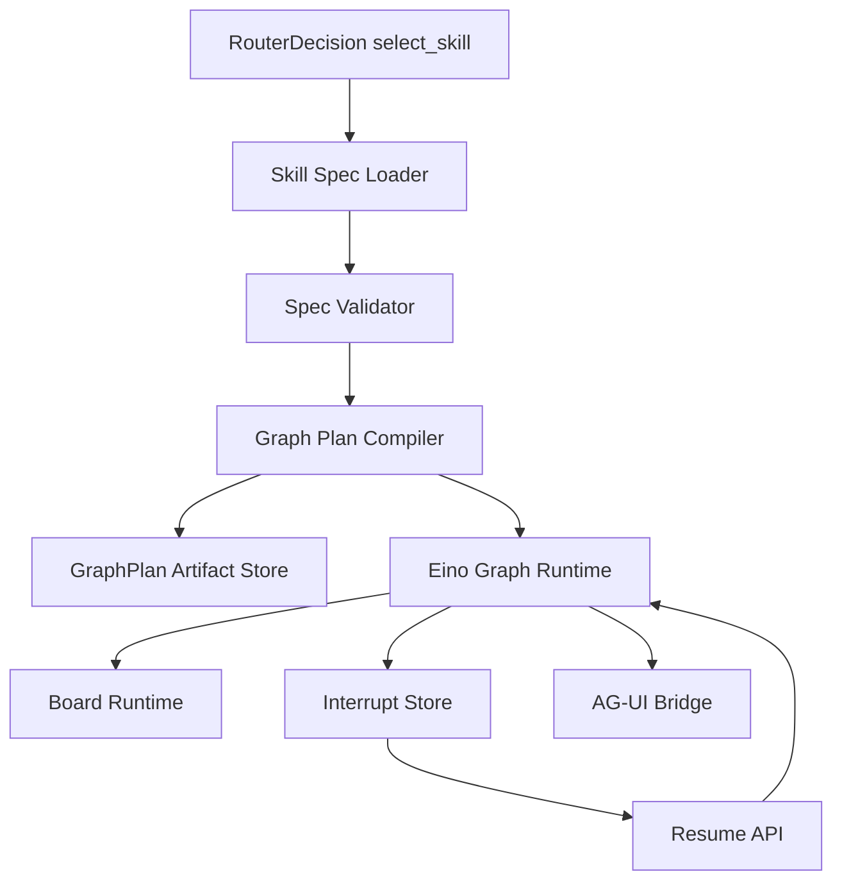
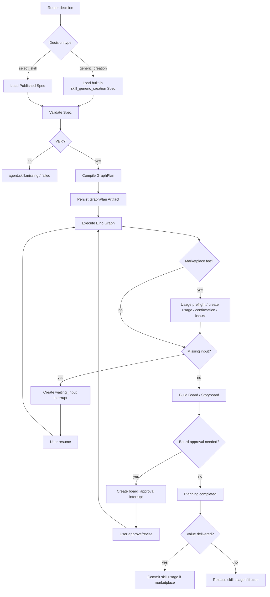

# M3 Skill Runtime Spec 与 Eino Graph Plan 设计

状态：active  
owner：Agent 服务责任域 / 业务服务责任域  
更新时间：2026-07-01  
适用范围：Skill Runtime Spec、Skill 静态校验、Graph Template、Graph Plan Compiler、Eino Graph Runtime、User Gate、Interrupt / Resume  
相关代码路径：`services/agent/internal/runtime/skill/**`、`services/agent/internal/runtime/graph/**`、`services/agent/internal/runtime/eino/**`、`services/business/internal/application/skillcatalog/**`  
相关契约：`SkillRuntimeSpec.v1`、`GraphTemplate.v1`、`GraphPlan.v1`、`BoardPatch.v1`、`AGUIEventEnvelope.v1`

## 0. 阶段目标与闭环

M3 让一个 Published Skill 能够被加载、校验、编译成本次 run 的 Graph Plan，并由 Eino Graph 执行确定性阶段，支持缺字段、Board 审核和 resume。

闭环：

```text
Router 选择 published Skill
  -> 加载 SkillRuntimeSpec
  -> 静态校验 spec、tool binding、output elements
  -> 编译 GraphPlan 快照
  -> Eino Graph 执行 brief/board/storyboard/user_gate
  -> 需要输入或确认时 interrupt
  -> 用户 resume
  -> Graph 继续执行或完成
```

M3 不执行生成类 Tool，Preflight 在 M4；市场 Skill 使用费节点在 GraphPlan 中声明，实际冻结、扣费、释放由 M5 的业务 RPC 接入。

## 1. 架构设计



职责：

| 模块 | 职责 |
| --- | --- |
| Spec Loader | 通过业务 RPC 获取 published spec，不加载 draft。 |
| Spec Validator | 校验 schema、level、tool bindings、output elements、confirmation policy。 |
| Graph Compiler | 将 GraphTemplate 编译为本次 run 不可变 GraphPlan。 |
| Eino Graph Runtime | 执行节点、分支、User Gate、Snapshot、Callback。 |
| Interrupt Store | 保存 waiting_input、board_approval、confirmation 等中断。 |

## 2. 技术实现细节

### 2.1 Skill Runtime Spec 必填

| 字段 | 说明 |
| --- | --- |
| `schema_version` | 固定 `skill_runtime_spec.v1` |
| `skill_id`、`version`、`status`、`level`、`scope` | 路由和权限 |
| `routing` | Router 摘要 |
| `input_schema` | 缺字段和控件 |
| `stages` | 阶段列表 |
| `board_schema_ref` | Board schema |
| `graph_template_ref` | Graph 模板 |
| `tool_bindings` | 可调用 Tool 引用 |
| `confirmation_policy` | 生成前确认和锁路径 |
| `safety_policy` | 输入、Prompt、产物安全 |
| `output_elements` | 前端可渲染元素类型 |

### 2.2 Graph Plan 规则

1. Graph Plan running 后不改拓扑。
2. Graph Plan 绑定 `skill_id + skill_version + skill_spec_digest`。
3. 副作用节点必须有 idempotency key。
4. Tool / RPC 节点声明超时、重试和补偿策略。
5. User Gate 必须保存 interrupt。
6. Resume 校验 `interrupt_id`、`board_version`、`payload_digest`。

### 2.3 Run 状态扩展

```text
created -> routing -> planning -> waiting_input
planning -> waiting_confirmation
waiting_input -> resuming -> planning
waiting_confirmation -> resuming -> planning
planning -> completed
planning -> failed
```

### 2.4 市场 Skill 计费节点

市场 Skill 的 GraphPlan 必须显式包含 Skill 使用费节点，避免在 Graph 外侧隐式扣费。

节点清单：

| node_key | node_type | 说明 |
| --- | --- | --- |
| `marketplace_usage_preflight` | `business_rpc` | 校验 listing、entitlement、pricing、permission |
| `marketplace_usage_record_create` | `business_rpc` | 创建 `SkillUsageRecord(status=confirmation_required)` 并返回 `usage_id` |
| `marketplace_usage_confirmation_gate` | `user_gate` | 展示 Skill 使用费确认 |
| `marketplace_usage_freeze` | `business_rpc` | 冻结 Skill 使用费 |
| `marketplace_usage_running` | `business_rpc` | 用户确认并冻结后标记 usage running |
| `value_delivered_checkpoint` | `control` | 判断是否达到 `value_delivered_stage` |
| `marketplace_usage_mark_delivered` | `business_rpc` | 写入交付阶段和 delivery artifact |
| `marketplace_usage_commit` | `business_rpc` | 达成交付后扣 Skill 使用费并进入结算 |
| `marketplace_usage_release` | `business_rpc` | 未交付、取消或失败时释放冻结 |

市场 Skill GraphPlan 基准链路：

```text
select marketplace skill
  -> marketplace.entitlement.check
  -> marketplace.pricing.estimate
  -> marketplace.usage_record.create(status=confirmation_required)
  -> user_gate.skill_usage_confirmation
  -> credit.skill_usage.freeze
  -> marketplace.usage.mark_running
  -> execute planning graph
  -> value_delivered_checkpoint
  -> marketplace.usage.mark_delivered
  -> credit.skill_usage.commit
  -> continue tool preflight if media generation needed
```

规则：

1. `value_delivered_stage=storyboard_ready` 时，分镜写入 Board 并保存版本后才扣 Skill 使用费。
2. Skill 使用费扣费成功后，后续视频或音乐生成失败不自动退 Skill 使用费，除非 refund policy 明确允许。
3. Tool 生成费仍由 M4 ToolPlan 处理，不和 Skill 使用费合并成同一 ledger source。
4. `billing_nodes` 必须写入 GraphPlan 快照，历史 run 按快照恢复。

GraphPlan billing 示例：

```json
{
  "graph_plan_id": "gp_123",
  "skill_id": "skill_market_city_tourism_video_pro",
  "skill_version": "1.0.0",
  "skill_spec_digest": "sha256:...",
  "billing_nodes": [
    {
      "node_key": "marketplace_usage_record_create",
      "fee_type": "skill_usage",
      "creates_usage_record": true,
      "initial_status": "confirmation_required",
      "idempotency_key_template": "run:{run_id}:skill_usage:create"
    },
    {
      "node_key": "marketplace_usage_freeze",
      "fee_type": "skill_usage",
      "requires_user_confirmation": true,
      "idempotency_key_template": "run:{run_id}:skill_usage:freeze"
    },
    {
      "node_key": "marketplace_usage_commit",
      "fee_type": "skill_usage",
      "value_delivered_stage": "storyboard_ready",
      "idempotency_key_template": "run:{run_id}:skill_usage:commit"
    }
  ]
}
```

### 2.5 Generic Creation Graph 内置化

Generic Creation 不是临时 fallback 文案，而是平台内置 L0 Skill：

| 字段 | 固定值 |
| --- | --- |
| `skill_id` | `skill_generic_creation` |
| `skill_source` | `system_builtin` |
| `level` | `L0` |
| `scope` | `system_default` |
| `skill_usage_points` | `0` |
| `listing_id` | `null` |
| `version_status` | `published` |
| `listing_status` | `null` |

触发条件：

1. Router 输出 `decision=generic_creation`。
2. 用户输入有明确创作意图，但不匹配任何 published Skill。
3. 默认 Skill 与市场 Skill 都低置信，且不需要拒绝。
4. 用户显式选择“自由创作”。

Generic Graph 节点：

| node_key | node_type | 输出 |
| --- | --- | --- |
| `intent_normalizer` | `llm` | 创作目标、媒介、风格、缺失字段 |
| `output_type_clarify` | `control/user_gate` | 澄清用户要图片、视频、音乐、文案或复合内容 |
| `generic_brief_builder` | `llm` | `brief` element |
| `generic_direction_builder` | `llm` | `creative_direction` element |
| `generic_prompt_draft_builder` | `llm` | 提示词草稿 |
| `skill_suggest` | `llm/control` | 推荐可切换的 Published Skill |
| `generic_board_initializer` | `state` | 创建 CreativeBoard |
| `generic_board_review_gate` | `user_gate` | Board 审核 |
| `generic_preflight_router` | `control` | 是否进入 M4 ToolPlan |

规则：

1. Generic Graph 必须编译为 GraphPlan，并绑定 `skill_id + skill_version + skill_spec_digest`。
2. Generic Graph 不进入 Marketplace，不产生 Skill 使用费。
3. Generic Graph 不默认调用图片、视频、音乐生成 Tool。
4. Generic Graph 只做 brief、创作方向、提示词草稿、Skill 推荐和澄清。
5. 当用户意图明确后，可切换到具体 Published Skill，并重新生成 GraphPlan。
6. 视频、音乐等高成本生成仍进入 M4 ToolPlan 确认。
7. Generic Graph 生成的 Board 元素必须使用 `CreativeElement.v1`，前端不得按 generic 场景硬编码。
8. Router Eval 必须覆盖“未命中垂直 Skill 但可自由创作”的正例，以及“应拒绝/应澄清”的负例。

Generic GraphPlan 示例：

```json
{
  "graph_plan_id": "gp_generic_123",
  "skill_id": "skill_generic_creation",
  "skill_source": "system_builtin",
  "skill_version": "1.0.0",
  "skill_spec_digest": "sha256:generic_creation_v1",
  "forbidden": ["direct_paid_generation_without_confirmation"],
  "billing_nodes": [],
  "nodes": [
    {"node_key": "intent_normalizer", "node_type": "llm"},
    {"node_key": "output_type_clarify", "node_type": "control"},
    {"node_key": "generic_brief_builder", "node_type": "llm"},
    {"node_key": "generic_direction_builder", "node_type": "llm"},
    {"node_key": "generic_prompt_draft_builder", "node_type": "llm"},
    {"node_key": "skill_suggest", "node_type": "control"},
    {"node_key": "generic_board_initializer", "node_type": "state"},
    {"node_key": "generic_board_review_gate", "node_type": "user_gate"},
    {"node_key": "generic_preflight_router", "node_type": "control"}
  ]
}
```

## 3. 用户旅程

1. 用户明确选择或 Router 自动选择 Skill。
2. Agent 告知“将按某 Skill 流程继续”。
3. Skill Graph 构建 brief 和初始 Board。
4. 缺少必填字段时，Graph 进入 waiting_input。
5. 用户补充字段。
6. Graph resume，生成 storyboard 和 prompt 草稿。
7. 用户审核 Board。
8. Graph 完成 planning，等待 M4 preflight。
9. 如果 Router 输出 generic_creation，则按内置 `skill_generic_creation` 生成 brief、direction、可选 storyboard 和 Board 审核，不进入市场计费。

## 4. 用户交互

| 阶段 | 前端展示 |
| --- | --- |
| Skill selected | 顶部 Skill Tag、流程说明、输入摘要 |
| Graph stage started | 工作区阶段状态和右侧过程说明 |
| waiting_input | 控件式澄清问题 |
| board_approval | Board 审核卡，支持确认、修改、拒绝 |
| graph stage completed | Board 更新和下一步建议 |
| skill usage confirmation | 合并费用披露卡中的 Skill 使用费确认 |
| graph failed | 错误类型、trace_id、可恢复建议 |

## 5. 业务设计

业务服务职责：

- 保存 Skill、SkillVersion、Published spec、Tool bindings、output elements。
- 审核和发布 Skill 版本。
- 根据用户空间返回可运行 spec。
- 校验 Tool binding 是否允许该 Skill level 使用。
- 返回平台内置 `skill_generic_creation` spec，供 Router generic_creation 决策编译 GraphPlan。

Agent 服务职责：

- 加载 published spec。
- 编译和执行 Graph Plan。
- 保存 run、board、interrupt、event 和 snapshot。

## 6. 表设计

Agent DB：

| 表 | 字段 |
| --- | --- |
| `agent_runs` | `skill_id`、`skill_version`、`skill_spec_digest`、`graph_plan_id`、`graph_plan_digest`、`stage` |
| `agent_artifacts` | `artifact_type=graph_plan`、`content_json`、`content_digest` |
| `agent_tasks` | `graph_plan_id`、`graph_stage`、`node_key`、`status`、`idempotency_key`、`billing_ref_id` |
| `agent_interrupts` | `interrupt_type`、`node_key`、`board_version`、`payload_digest`、`resume_context` |

Business DB：

| 表 | 字段 |
| --- | --- |
| `skill_versions` | `version`、`status`、`skill_spec_json`、`skill_spec_digest` |
| `skill_tool_bindings` | `skill_id`、`version_id`、`tool_id`、`tool_type` |
| `skill_output_elements` | `element_type`、`editable`、`referable`、`schema_json` |
| `skill_review_records` | `review_status`、`static_validation_result`、`reviewer_id` |

## 7. Prompt Schema 示例

```json
{
  "schema_version": "prompt_schema.v1",
  "prompt_id": "brief_builder.v1",
  "purpose": "skill_graph_node_llm",
  "inputs": {
    "user_input": "string",
    "router_params": "object",
    "skill_defaults": "object",
    "required_fields": "array<object>"
  },
  "output_schema_ref": "BriefElement.v1",
  "rules": [
    "缺少必填字段时不得编造",
    "输出必须适合写入 CreativeBoard.brief",
    "不输出生成 Tool 调用指令"
  ]
}
```

## 8. Tool Schema 模板示例

```json
{
  "schema_version": "tool_schema_template.v1",
  "tool_id": "graph.user_gate.waiting_input",
  "tool_type": "user_gate",
  "input_schema": {
    "run_id": "string",
    "graph_plan_id": "string",
    "node_key": "string",
    "field": "string",
    "question": "string",
    "control_type": "text|single_select|multi_select|asset_picker"
  },
  "output_schema": {
    "interrupt_id": "string",
    "status": "waiting",
    "expires_at": "string"
  },
  "idempotency_required": true
}
```

## 9. Skill Schema 示例

```json
{
  "schema_version": "skill_runtime_spec.v1",
  "skill_id": "skill_city_tourism_video",
  "version": "1.0.0",
  "level": "L3",
  "stages": ["intent", "brief", "board", "storyboard", "approval", "generation_preflight"],
  "input_schema": {
    "required": [
      {
        "field": "city_or_destination",
        "type": "string",
        "question": "你想宣传哪个城市或景区？"
      }
    ],
    "optional": [
      {
        "field": "duration_sec",
        "type": "number",
        "default": 30,
        "options": [15, 30, 60]
      }
    ]
  },
  "graph_template": {
    "entry_node": "brief_builder",
    "nodes": [
      {"node_key": "brief_builder", "node_type": "llm", "stage": "brief"},
      {"node_key": "required_input_check", "node_type": "control", "stage": "brief"},
      {"node_key": "collect_city_gate", "node_type": "user_gate", "stage": "brief"},
      {"node_key": "storyboard_planner", "node_type": "llm", "stage": "storyboard"},
      {"node_key": "value_delivered_checkpoint", "node_type": "control", "stage": "storyboard"},
      {"node_key": "board_review_gate", "node_type": "user_gate", "stage": "approval"}
    ]
  }
}
```

## 10. 流程图



## 11. Eino 使用说明

M3 首次正式启用 Eino Graph：

- ChatModel 节点用于 brief、elements、storyboard、prompt 草稿。
- Control 节点用于缺字段判断和状态分支。
- State 节点用于 Board read/write。
- User Gate 节点用于 waiting_input、board_approval。
- Snapshot 节点用于恢复点。
- Callback 记录 `graph_plan_id`、`node_key`、`stage`、`latency_ms`、`error_class`。

Eino Adapter 边界：

```go
type GraphRuntime interface {
    Compile(plan GraphPlan) (ExecutableGraph, error)
    Invoke(ctx context.Context, input GraphInput) (GraphResult, error)
    Resume(ctx context.Context, interruptID string, input ResumeInput) (GraphResult, error)
}
```

目录要求：

```text
services/agent/internal/runtime/einoadapter/
  chatmodel.go
  graph.go
  graph_tool.go
  interrupt.go
  callback.go
```

Router、Board、Graph Compiler 和 ToolPlan 只依赖内部接口，不直接依赖 Eino SDK 类型。

不在 M3 使用：

- 生成类 Tool。
- Tool 生成费扣费。
- 自定义代码节点。

## 12. 开发细节

目录建议：

```text
services/agent/internal/runtime/graph/
  compiler.go
  graph_plan.go
  generic_graph.go
  nodes/
    llm_node.go
    user_gate_node.go
    state_node.go
    validation_node.go
services/agent/internal/runtime/eino/
  graph_runtime.go
  callbacks.go
services/agent/internal/runtime/einoadapter/
  graph.go
  interrupt.go
  callback.go
```

测试：

- Spec 必填字段校验。
- 未发布 Skill 拒绝。
- GraphPlan digest 稳定。
- 缺字段进入 interrupt。
- resume 幂等。
- Board approval 后继续执行。

## 13. 开发注意事项

- 不确定 Eino API 时先查当前依赖和官方文档，不臆造调用。
- Graph 节点职责必须单一。
- Running GraphPlan 不原地改拓扑。
- Resume 必须校验 Board 版本。
- Skill prompt_policy 不能覆盖系统安全。
- 市场 Skill 使用费节点必须在 GraphPlan 中显式声明，不允许散落在 Handler 外层。

## 14. 验收标准

- [ ] Published Skill 可被加载并校验。
- [ ] 非 published Skill 不可运行。
- [ ] Skill Runtime Spec 可编译成 GraphPlan。
- [ ] GraphPlan 包含 skill_spec_digest。
- [ ] 缺字段进入 waiting_input。
- [ ] 用户 resume 后可继续执行。
- [ ] Board approval gate 可中断和恢复。
- [ ] 市场 Skill GraphPlan 包含 usage preflight、confirmation、freeze、value delivered、commit、release 节点。
- [ ] 冻结前已创建 `SkillUsageRecord(status=confirmation_required)`，Agent run 可持有 `usage_id`。
- [ ] `value_delivered_stage=storyboard_ready` 时只在 Board 分镜版本保存后扣 Skill 使用费。
- [ ] Generic Creation Graph 以内置 L0 Skill 形式运行，绑定 spec digest 且 Skill 使用费为 0。
- [ ] Eino SDK 类型被限制在 `runtime/einoadapter/**`。
- [ ] 所有节点状态有 AG-UI 事件。

## 15. 风险

| 风险 | 影响 | 缓解 |
| --- | --- | --- |
| Graph 过复杂 | 实现慢、难测试 | 先支持 llm/control/state/user_gate/snapshot 基础节点。 |
| Spec 校验不足 | 市场 Skill 越权 | M3 建基础校验，M5 加市场权限矩阵。 |
| Resume 重复执行 | 重复写状态或扣费 | User Gate resume 幂等，副作用延后到 M4。 |
