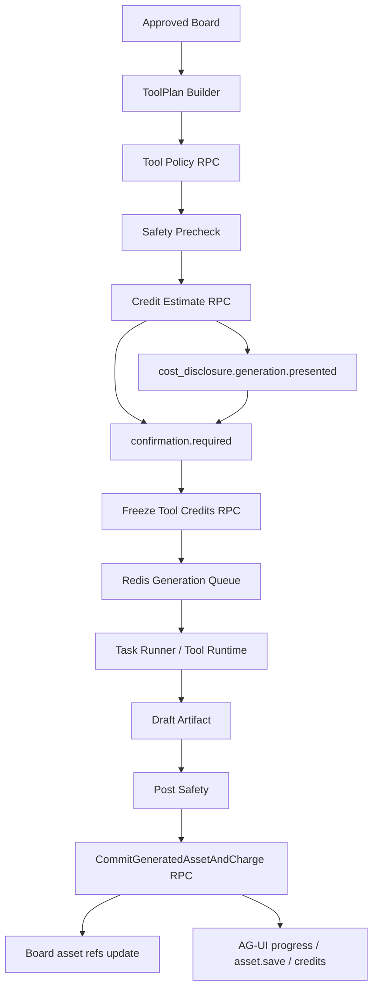
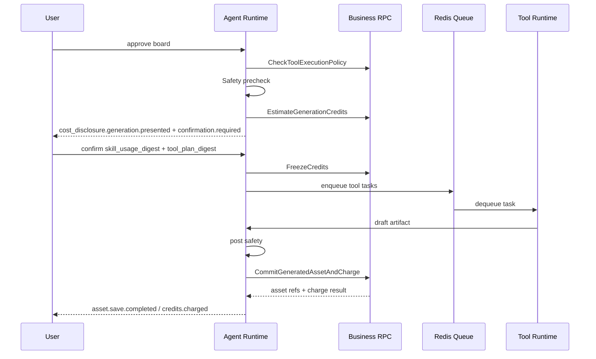

# M4 Preflight 与 Tool Runtime 资产扣费设计

状态：active  
owner：Agent 服务责任域 / 业务服务责任域  
更新时间：2026-07-01  
适用范围：ToolPlan、生成前安全、积分预估、用户确认、冻结积分、Redis 任务队列、Tool Runtime、资产提交、扣费和释放  
相关代码路径：`services/agent/internal/runtime/toolplan/**`、`services/agent/internal/runtime/tasks/**`、`services/agent/internal/infra/queue/**`、`services/business/internal/application/credit/**`、`services/business/internal/application/assetcommit/**`  
相关契约：`ToolPlan.v1`、`ConfirmationPayload.v1`、`SafetyEvidenceDTO`、`CreditService`、`AssetCreditCommitService`、`AGUIEventEnvelope.v1`

## 0. 阶段目标与闭环

M4 让用户确认后的生成任务形成完整闭环：生成前校验、积分预估、确认、冻结、执行、保存资产、扣费或释放。

闭环：

```text
Board approved
  -> Compile prompts
  -> Build ToolPlan
  -> Tool Policy Check
  -> Safety Check
  -> Credit Estimate
  -> User Confirmation
  -> Freeze Credits
  -> Execute Tool Tasks
  -> Post Safety
  -> Commit Assets And Charge
  -> Update Board / Events / Snapshot
```

M4 不结算市场 Skill 使用费；当 GraphPlan 带有 Skill 使用费节点时，M4 只展示 Skill 使用费当前状态，并通过 `cost_disclosure.generation.presented` 披露 ToolPlan 生成费，后台仍按 Skill 使用费和 Tool 生成费两条账处理。

## 1. 架构设计



Redis 用途：

| 用途 | Key 示例 | 事实源 |
| --- | --- | --- |
| 生成队列 | `dora:agent:generation_jobs` | 否 |
| inflight 队列 | `dora:agent:generation_jobs:inflight` | 否 |
| 并发锁 | `dora:agent:lock:user:{user_id}:tool:{tool_type}` | 否 |
| 事件广播 | `dora:agent:events:{run_id}` | 否，AG-UI 事件最终在 Agent DB |
| 短期缓存 | `dora:agent:cache:tool_policy:{tool_id}` | 否 |

## 2. 技术实现细节

### 2.1 ToolPlan 规则

1. ToolPlan 绑定 `board_id` 和 `board_version`。
2. ToolPlan 有 `tool_plan_digest`。
3. 每个 item 有稳定 `task_key` 和 `idempotency_key`。
4. 依赖关系用 `depends_on` 表达。
5. 总积分预估来自业务服务，不由 Agent 自行计算最终值。
6. ToolPlan 变更后旧 confirmation 失效。

### 2.2 SkillUsagePlan 与 ToolPlan 关系

| 对象 | 费用类型 | 来源阶段 | 结算阶段 |
| --- | --- | --- | --- |
| `SkillUsagePreflight.v1` | Skill 使用费 | M3/M5 Graph billing nodes | M5 |
| `ToolPlan.v1` | Tool 生成费 | M4 Preflight | M4 |
| `SkillUsageDisclosure.v1` | Skill 使用费披露 | M3/M5 UI 汇总 | 不直接入账 |
| `ToolGenerationDisclosure.v1` | Tool 生成费披露 | M4 UI 汇总 | 不直接入账 |

规则：

1. 前端可以复用同一个 `CostDisclosureCard` 组件，但协议事件必须区分 Skill 使用费披露和 Tool 生成费披露。
2. 用户确认时，提交的 payload 必须绑定当前阶段 digest：Skill 阶段绑定 `skill_usage_digest`，Tool 阶段绑定 `tool_plan_digest`。
3. 只有 combined confirmation 路径才同时绑定 `skill_usage_digest` 和 `tool_plan_digest`；ledger source 始终分开。
4. 默认 Skill 的 Skill 使用费为 0，也要展示“Skill 使用费：0 积分；生成素材费：按生成前预估”。
5. Skill 使用费已达成交付并扣费后，Tool 生成失败只释放 Tool 冻结，不自动逆转 Skill usage ledger。

### 2.3 Skill 使用费确认与 Tool 生成费确认时序

默认时序分两阶段：

| 阶段 | 触发 | 已知费用 | 用户确认 | 后续动作 |
| --- | --- | --- | --- | --- |
| `skill_usage_confirmation` | 用户显式选择付费市场 Skill，且 Graph 还未执行 | Skill 使用费明确，Tool 生成费未知或仅为范围提示 | `cost_disclosure.skill_usage.presented`，确认 `skill_usage_digest` | 创建/冻结 Skill usage，执行 Graph 到交付阶段 |
| `tool_generation_confirmation` | Board approved 且 ToolPlan 已生成 | Tool 生成费逐项预估，Skill 使用费为 0/已冻结/已扣费状态 | `cost_disclosure.generation.presented`，确认 `tool_plan_digest` | 冻结 Tool 费，入队生成 |

合并确认只允许在 ToolPlan 已存在时发生：

1. 用户从已有 Board 或历史 run 直接选择“生成素材”。
2. Skill usage 尚未确认，且 ToolPlan 已完成预估。
3. `CostDisclosureCard` 在 combined confirmation payload 中同时包含 `skill_usage_digest` 和 `tool_plan_digest`。
4. 后端按顺序执行 `FreezeSkillUsageCredits -> FreezeCredits`；第二步失败时必须释放第一步冻结。

默认从自然语言开始的新市场 Skill 路径：

```text
select paid marketplace skill
  -> show skill usage disclosure
  -> confirm skill_usage_digest
  -> freeze skill usage
  -> execute planning graph
  -> value_delivered_checkpoint
  -> commit skill usage
  -> build ToolPlan
  -> show tool generation disclosure
  -> confirm tool_plan_digest
  -> freeze tool credits
  -> execute tool tasks
```

确认 payload：

```json
{
  "schema_version": "confirmation_payload.v1",
  "confirmation_type": "skill_usage|tool_generation|combined_cost",
  "run_id": "run_123",
  "board_id": "board_123",
  "board_version": 3,
  "skill_usage": {
    "usage_id": "usage_123",
    "skill_usage_digest": "sha256:skill_usage_preflight",
    "status": "confirmation_required"
  },
  "tool_plan": {
    "tool_plan_id": "tp_123",
    "tool_plan_digest": "sha256:tool_plan",
    "estimated_points": 480
  },
  "expires_at": "2026-07-01T10:00:00Z"
}
```

### 2.4 Confirmation 规则

确认对象是 digest：

```text
confirmation_id
run_id
board_id
board_version
tool_plan_id
tool_plan_digest
estimated_points
expires_at
```

用户确认后才能冻结积分，冻结成功后才能入队执行。

### 2.5 资产提交规则

1. 生成产物先为 draft artifact。
2. 后置安全通过后才能提交资产。
3. 资产服务保存成功后才能扣费。
4. 保存失败释放冻结。
5. 部分成功按 item 扣费和释放。
6. `CommitGeneratedAssetAndCharge` 必须幂等。

### 2.6 Tool Registry 与 Model Registry 绑定

Skill 绑定 Tool 能力，不直接绑定供应商模型。Tool Runtime 根据 Tool Registry、Model Registry、用户空间策略和成本策略选择模型。

`ModelRegistry.v1` 示例：

```json
{
  "model_id": "video_model_default",
  "model_type": "video_generation",
  "provider_alias": "internal_vendor_a",
  "status": "available",
  "capabilities": {
    "supports_text_to_video": true,
    "supports_image_to_video": true,
    "max_duration_sec": 10,
    "supported_aspect_ratios": ["9:16", "16:9", "1:1"]
  },
  "quality_profile": {
    "speed": "medium",
    "cost": "high",
    "motion_quality": "high"
  },
  "policy": {
    "allowed_skill_levels": ["L3", "L4"],
    "requires_confirmation": true
  }
}
```

绑定规则：

1. Skill 声明需要 `video_generation`、`aspect_ratio=9:16`、`duration_sec=5-10`、可选 `reference_image`。
2. Tool Registry 校验能力和权限，Model Registry 选择满足条件的模型。
3. 管理端可调整 provider/model，但不影响 Skill Runtime Spec digest。
4. AG-UI 只展示模型能力摘要和费用，不展示供应商敏感配置。

### 2.7 异步 Provider callback / polling 协议

视频、音乐、图生视频等 Tool 默认按异步 Provider 设计，Tool Registry 必须声明异步策略。

```json
{
  "async_policy": {
    "mode": "sync|polling|callback",
    "provider_task_id_field": "task_id",
    "callback_signature_required": true,
    "artifact_ttl_seconds": 86400,
    "max_poll_attempts": 60,
    "polling_interval_seconds": 5,
    "provider_timeout_seconds": 600,
    "cancel_supported": false,
    "partial_result_supported": true
  }
}
```

规则：

1. Provider 创建任务后必须保存 `provider_task_id`、`task_key`、`idempotency_key`。
2. polling 模式超过 `max_poll_attempts` 进入 `failed`，并释放未保存成功 item 的冻结积分。
3. callback 模式必须校验签名，callback 只更新 Agent task 状态，不直接扣费。
4. `artifact_url` 必须在 TTL 内转存为 draft artifact，过期未转存视为失败。
5. Provider cancel 不支持时，用户取消只停止后续提交和扣费，不承诺取消供应商成本。
6. partial result 只对已通过后置安全且保存成功的 item 扣费。

## 3. 用户旅程

1. 用户确认 Board。
2. Agent 展示即将生成的素材列表、模型/Tool 摘要、预计积分、失败规则。
3. 如果 Skill 使用费已经在 M3/M5 确认并扣费，费用卡展示已扣费状态，不重复确认。
4. 用户确认 ToolPlan 生成费。
5. 系统冻结 Tool 生成费。
6. 任务进入排队和生成。
7. 前端展示逐项进度。
8. 成功项保存为资产并扣费。
9. 失败项释放积分并给出重试入口。

## 4. 用户交互

组件：

| 组件 | 事件 | 行为 |
| --- | --- | --- |
| ToolPlanCard | `tool_plan.created` | 展示生成任务、依赖、预计耗时 |
| CreditEstimateCard | `tool_plan.estimated` | 展示预计积分和余额 |
| ConfirmationCard | `confirmation.required` | 绑定 digest 确认或拒绝 |
| CostDisclosureCard | `cost_disclosure.skill_usage.presented` | Skill 执行前展示 Skill 使用费和后续 Tool 费说明 |
| CostDisclosureCard | `cost_disclosure.generation.presented` | ToolPlan 后展示 Tool 生成费和 Skill 使用费状态 |
| ProgressCard | `generation.progress` | 展示 task 级进度 |
| AssetPreviewCard | `asset.save.completed` | 展示已保存资产 |
| ErrorRetryCard | `tool.call.failed` / `asset.save.failed` | 展示失败原因和重试 |

UX 文案要求：

- “保存成功后才扣除生成积分。”
- “部分失败时，未成功保存的项目会释放冻结积分。”
- “确认后如果修改分镜或参数，需要重新预估积分。”
- “Skill 使用费和生成素材费分开结算，当前页面合并展示总成本。”
- “本次若仅确认 Skill 使用费，生成素材费会在分镜确认后另行预估。”
- “若 Skill 方案费已按交付规则扣除，后续素材失败只释放素材生成费。”

## 5. 业务设计

业务服务 RPC：

| RPC | 用途 | 事务/幂等 |
| --- | --- | --- |
| `CheckToolExecutionPolicy` | 校验 Tool 是否允许 | 读，短缓存 |
| `EstimateGenerationCredits` | 预估生成积分 | 幂等读写，保存 estimate |
| `FreezeCredits` | 冻结积分 | 写，idempotency_key |
| `PrepareGeneratedAssetObjects` | 生成上传 slot | 写，idempotency_key |
| `CommitGeneratedAssetAndCharge` | 保存资产并扣费 | 写事务，idempotency_key |
| `ReleaseFrozenCredits` | 释放冻结 | 写，idempotency_key |

业务规则：

- 业务服务拥有积分余额、冻结、扣费和资产保存的最终解释权。
- Agent 传入 SafetyEvidence 摘要，不传完整敏感内容。
- 写操作记录 audit：actor、space、project、run_id、trace_id、result。
- 重试同一 task 时必须复用 task_key 和幂等键，成功保存过的 item 不重复扣费。
- 用户取消 run 时，未开始和未保存成功的 Tool item 释放冻结；已保存成功的资产不自动退款。
- 部分成功时，ToolPlan 可进入 `partially_completed`，Board 写入成功 asset_ref 和失败摘要。

## 6. 表设计

Agent DB：

| 表 | 字段 |
| --- | --- |
| `agent_artifacts` | `artifact_type=tool_plan|draft_asset`、`content_digest`、`business_ref_id` |
| `agent_tasks` | `tool_plan_id`、`task_key`、`tool_id`、`status`、`progress_percent`、`cancel_requested` |
| `agent_tool_calls` | `tool_id`、`input_digest`、`output_digest`、`attempt`、`latency_ms`、`error_class` |
| `agent_interrupts` | `interrupt_type=confirmation`、`confirmation_payload`、`payload_digest` |
| `agent_events` | `tool_plan.*`、`credits.*`、`generation.*`、`asset.save.*` |

Business DB：

| 表 | 字段 |
| --- | --- |
| `credit_estimates` | `estimate_id`、`account_id`、`project_id`、`estimate_points`、`status` |
| `credit_estimate_items` | `estimate_item_id`、`item_type`、`tool_id`、`estimate_points` |
| `credit_freezes` | `freeze_id`、`estimate_id`、`run_id`、`frozen_points`、`status` |
| `credit_ledger_entries` | `entry_type`、`points_delta`、`source_type`、`source_id` |
| `asset_commit_batches` | `commit_id`、`freeze_id`、`run_id`、`commit_status` |
| `asset_commit_items` | `artifact_id`、`estimate_item_id`、`asset_id`、`charge_status` |

## 7. Prompt Schema 示例

```json
{
  "schema_version": "prompt_schema.v1",
  "prompt_id": "prompt_compiler.v1",
  "purpose": "compile_board_to_tool_inputs",
  "inputs": {
    "board": "CreativeBoard.v1",
    "storyboard": "Storyboard.v1",
    "selected_shots": "array<string>",
    "target_tool": "string"
  },
  "output_schema_ref": "PromptElement.v1",
  "rules": [
    "不暴露系统 Prompt",
    "不得引用未授权资产",
    "输出后必须安全检查"
  ]
}
```

## 8. Tool Schema 模板示例

```json
{
  "schema_version": "tool_registry.v1",
  "tool_id": "video_gen.default",
  "tool_type": "video_gen",
  "input_schema_ref": "video_gen.input.v1",
  "output_schema_ref": "generated_video.output.v1",
  "capabilities": {
    "max_duration_sec": 10,
    "supported_aspect_ratios": ["9:16", "16:9", "1:1"],
    "supports_reference_image": true
  },
  "model_selection": {
    "required_model_type": "video_generation",
    "bind_by_capability": true,
    "model_registry_ref": "ModelRegistry.v1"
  },
  "cost_policy": {
    "pricing_unit": "per_second",
    "base_points": 50,
    "points_per_second": 20
  },
  "runtime_policy": {
    "timeout_ms": 300000,
    "max_retries": 1,
    "concurrency_limit_per_user": 2,
    "idempotency_required": true
  }
}
```

## 9. Skill Schema 示例

```json
{
  "schema_version": "skill_runtime_spec.v1",
  "skill_id": "skill_city_tourism_video",
  "tool_bindings": {
    "image_generation": ["image_gen.default"],
    "video_generation": ["video_gen.default"],
    "music_generation": ["music_gen.default"],
    "asset_commit": ["asset_rpc.commit_generated_asset"]
  },
  "confirmation_policy": {
    "require_before_generation": true,
    "require_credit_estimate": true,
    "lock_board_paths": ["/brief", "/storyboards", "/prompts", "/tool_plans"]
  },
  "safety_policy": {
    "precheck_user_input": true,
    "check_prompt_before_tool": true,
    "postcheck_generated_asset": true
  }
}
```

## 10. 流程图



## 11. Eino 使用说明

M4 使用 Workflow 和 Tool：

- `generation_preflight_package` 封装 ToolPlan、安全、积分预估。
- `cost_disclosure_package` 按阶段生成 Skill 使用费披露或 Tool 生成费披露，不直接入账。
- `video_asset_generation_package` 封装任务执行，可作为 Graph Tool 被上层 Graph 调用。
- `asset_commit_package` 封装资产提交和扣费 RPC。
- Interrupt / Resume 用于确认生成。
- Callback 记录 task_key、tool_id_alias、model_id_alias、latency_ms、retry_count、error_class。

## 12. 开发细节

目录建议：

```text
services/agent/internal/runtime/toolplan/
  builder.go
  preflight.go
  credit.go
  safety.go
services/agent/internal/runtime/tasks/
  task_runner.go
  idempotency.go
services/agent/internal/infra/queue/
  redis_generation_queue.go
```

测试：

- ToolPlan digest 变化导致旧 confirmation 失效。
- Freeze 幂等。
- Worker 重启后 inflight requeue。
- 成功保存后扣费。
- 保存失败释放。
- 部分成功逐项结算。

## 13. 开发注意事项

- 不在 Agent 里自行扣费。
- 不在确认前冻结积分。
- 不在资产保存失败时扣费。
- Redis 队列不是事实源，任务状态必须落 Agent DB。
- Tool 输入摘要和日志必须脱敏。
- 不把 Skill 使用费和 Tool 生成费写成同一 freeze 或 ledger source。
- 取消、重试、worker 重启都必须先读 DB task 状态，再决定是否执行 Tool 或扣费。

## 14. 验收标准

- [ ] ToolPlan 绑定 board_version 和 digest。
- [ ] Confirmation 绑定 tool_plan_digest。
- [ ] CostDisclosureCard 支持 Skill 使用费披露和 Tool 生成费披露两种事件。
- [ ] 确认 payload 按当前阶段绑定 `skill_usage_digest` 或 `tool_plan_digest`。
- [ ] 从自然语言进入付费市场 Skill 时，先确认 Skill 使用费，再在 ToolPlan 生成后确认 Tool 生成费。
- [ ] 只有 ToolPlan 已存在时才允许 combined_cost 一次确认。
- [ ] 冻结积分前必须用户确认。
- [ ] 生成任务支持 Redis 队列和恢复。
- [ ] 资产保存成功后扣费。
- [ ] 保存失败释放冻结。
- [ ] 部分成功可逐项扣费和释放。
- [ ] 重试不会对已成功保存 item 重复扣费。
- [ ] 用户取消会释放未开始或未保存成功的 Tool 冻结。
- [ ] Tool Registry 绑定能力，Model Registry 选择具体模型。
- [ ] AG-UI 可展示生成进度和失败重试。

## 15. 风险

| 风险 | 影响 | 缓解 |
| --- | --- | --- |
| 重复执行 Tool | 重复成本 | task idempotency key + Redis lock + DB 状态。 |
| 扣费争议 | 信任损失 | digest 确认、保存成功后扣费、失败释放。 |
| 长任务中断 | 状态丢失 | Agent DB task 状态 + inflight requeue。 |
