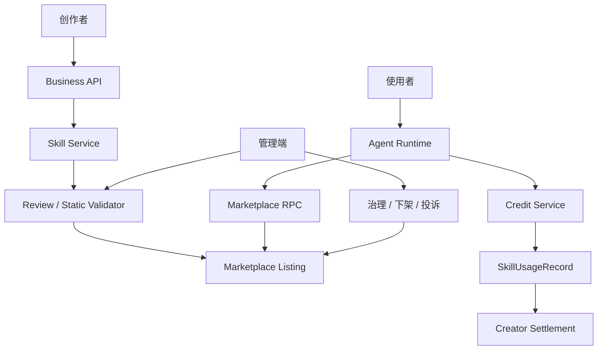
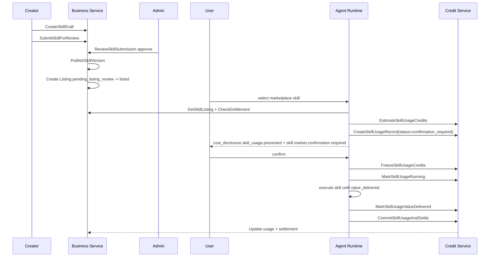

# M5 开放 Skill 市场与两段积分结算设计

状态：active  
owner：业务服务责任域 / 管理端责任域 / Agent 服务责任域  
更新时间：2026-07-01  
适用范围：Skill 创建、审核、发布、上架、安装、使用费、创作者结算、评分举报、市场治理、两段积分链路  
相关代码路径：`services/business/internal/application/skillcatalog/**`、`services/business/internal/application/credit/**`、`services/business/internal/application/notification/**`、`admin_frontend/src/features/resources/**`、`services/agent/internal/infra/rpc/**`  
相关契约：`SkillPackage.v1`、`SkillMarketplaceListing.v1`、`SkillPricingPolicy.v1`、`SkillPermissionPolicy.v1`、`SkillUsageRecord.v1`

## 0. 阶段目标与闭环

M5 把 Skill 从平台配置扩展为开放生态商品：普通用户、企业和合作方可以创建 Skill，经过审核后进入市场；使用者可以安装、选择、付费使用；平台记录使用、退款、投诉和结算。

闭环：

```text
创作者创建 Skill 草稿
  -> 静态校验
  -> 提交审核
  -> 平台审核通过
  -> 发布冻结版本
  -> 上架市场或企业可见
  -> 用户选择市场 Skill
  -> 创建 usage record 并绑定 preflight digest
  -> 用户确认 Skill 使用费
  -> 冻结 Skill 使用费
  -> 达到 value_delivered_stage
  -> 扣减 Skill 使用费
  -> 进入 creator settlement
```

Tool 生成费仍由 M4 处理，M5 只新增 Skill 使用费和市场治理。

## 1. 架构设计



微服务职责：

| 服务 | 职责 |
| --- | --- |
| Business Skill/Marketplace | 草稿、版本、审核、listing、安装、评分、举报、治理 |
| Business Credit/Settlement | Skill 使用费预估、冻结、扣减、退款、结算 |
| Agent | 读取 listing/pricing，展示确认，触发使用费 RPC，保存 usage_id 引用 |
| 管理端 | 审核、下架、治理、结算和审计 |

## 2. 技术实现细节

### 2.1 SkillVersionStatus 与 MarketplaceListingStatus

Skill 内容版本和市场上架必须拆成两套独立状态机。

`SkillVersionStatus`：

```text
draft -> submitted -> reviewing -> rejected -> draft
reviewing -> approved -> published -> deprecated -> archived
published -> archived
```

`MarketplaceListingStatus`：

```text
draft -> pending_listing_review -> listed
pending_listing_review -> removed
listed -> unlisted -> listed
listed -> suspended -> listed
suspended -> removed
unlisted -> removed
```

规则：

1. Published 版本不可原地修改。
2. run 绑定 `skill_id + skill_version + skill_spec_digest`。
3. 只有 `SkillVersionStatus=published` 的版本可以创建 listing。
4. listing 暂停、恢复、下架、移除不改变 SkillVersion 内容。
5. 平台默认 Skill 使用费固定为 0。
6. 市场 Skill 必须配置 pricing、permission、data visibility 和 settlement policy。
7. 历史 run 使用快照版本恢复；listing 后续被 suspended 或 removed 不影响已保存快照的只读查看。

### 2.2 两段积分

| 费用 | 触发 | 扣费点 | 失败处理 |
| --- | --- | --- | --- |
| Skill 使用费 | 使用市场 Skill | 达到 `value_delivered_stage` | 未交付释放，已交付按退款策略 |
| Tool 生成费 | 生成图片/视频/音乐等 | 资产保存成功后 | 保存失败释放 |

### 2.3 MarketplaceSkillRoutingPolicy

市场 Skill 路由遵循 M0 冻结策略：

1. 平台默认 Skill 和已安装 Skill 先进入 primary candidate。
2. 未安装市场 Skill 默认只进入 `marketplace_candidate`。
3. 付费市场 Skill 未经用户确认不得执行。
4. 免费默认 Skill 与付费市场 Skill 能力重叠时，默认免费 Skill 优先。
5. 用户显式表达市场 Skill、创作者、模板或点击市场卡片时，才可直接选择市场 Skill。
6. Router Guard 必须校验 `SkillVersionStatus=published`、`MarketplaceListingStatus=listed`、entitlement、pricing、permission 和 Tool availability。

### 2.4 Skill 使用费 Graph 节点

市场 Skill GraphPlan 必须包含以下计费节点：

```text
marketplace_usage_preflight
  -> marketplace_usage_confirmation_gate
  -> marketplace_usage_freeze
  -> execute planning graph
  -> value_delivered_checkpoint
  -> marketplace_usage_commit
```

异常补偿：

| 场景 | 节点 | 结果 |
| --- | --- | --- |
| 用户拒绝费用 | `marketplace_usage_confirmation_gate` | 不冻结、不执行 |
| 冻结后未交付 | `marketplace_usage_release` | 释放 Skill 使用费冻结 |
| `storyboard_ready` 已交付 | `marketplace_usage_commit` | 扣 Skill 使用费并进入结算 |
| Tool 生成失败 | M4 ToolPlan | 释放 Tool 费冻结，不自动退 Skill 使用费 |

### 2.5 SkillPermissionPolicy.v1

```json
{
  "asset_permission": {
    "can_read_user_uploaded_assets": true,
    "can_read_project_assets": true,
    "can_read_enterprise_assets": false,
    "can_write_draft_assets": true,
    "can_write_final_assets": false
  },
  "tool_permission": {
    "allowed_tool_types": ["llm", "image_gen", "video_gen"],
    "forbidden_tool_ids": ["external_http", "business_write"],
    "max_parallel_tool_tasks": 4
  },
  "credit_permission": {
    "can_trigger_skill_usage_fee": true,
    "can_trigger_generation_fee": true,
    "requires_user_confirmation": true,
    "max_skill_usage_points": 500,
    "max_generation_points_per_run": 2000
  },
  "runtime_permission": {
    "can_use_graph": true,
    "can_use_custom_code": false,
    "can_use_external_http": false,
    "can_use_user_api_key": false
  },
  "data_visibility": {
    "creator_can_view_user_inputs": false,
    "creator_can_view_outputs": false,
    "creator_can_view_aggregated_metrics": true
  }
}
```

### 2.6 CreatorDataVisibilityPolicy

开放市场默认数据隔离：

1. 创作者不能查看用户原始输入。
2. 创作者不能查看用户上传资产。
3. 创作者不能查看 Creative Board 详情。
4. 创作者不能查看生成资产。
5. 创作者只能查看聚合使用量、收入、评分、举报和脱敏错误摘要。
6. 创作者调试日志需要用户授权和脱敏能力；第一阶段不提供。

管理端展示时，只能显示聚合指标和脱敏摘要，不提供“查看用户素材”“查看完整 Board”入口。

### 2.7 SkillStaticReviewChecklist

第一版不提供沙盒执行，因此静态审核必须覆盖：

1. manifest schema。
2. runtime spec schema。
3. graph template compile。
4. tool binding permission。
5. output_elements whitelist。
6. prompt injection static scan。
7. 尝试覆盖系统规则。
8. 尝试绕过确认。
9. 夸大能力。
10. 定价在平台上下限内。
11. 版权声明完整。
12. 安全声明完整。
13. Router 正负样例合理。
14. 与默认 Skill 高度重合但诱导付费。
15. 未授权访问资产或企业数据。

### 2.8 SettlementPolicy 与风控熔断

`settlement_policy`：

```json
{
  "platform_commission_rate": 0.3,
  "hold_period_days": 14,
  "refund_before_settlement": "deduct_from_pending",
  "refund_after_settlement": "deduct_from_future_balance",
  "violation_action": "freeze_pending_settlement"
}
```

风险自动处理：

| 指标 | 触发结果 |
| --- | --- |
| 最近 100 次使用失败率超过阈值 | `review_status=risk_review` |
| 退款率超过阈值 | 降权或暂停推荐 |
| 举报超过阈值 | 暂停新用户使用，保留历史 run 恢复 |
| Router 高置信误选率高 | 从自动推荐移除 |
| Tool 成本异常 | 限制 `max_generation_points_per_run` |
| Prompt 安全命中率高 | `listing_status=suspended` |

### 2.9 SkillUsageRecord 创建时机和状态机

usage record 必须在用户确认前创建，不得等扣费后补写。

创建时机：

```text
marketplace_usage_preflight
  -> CheckSkillEntitlement
  -> EstimateSkillUsageCredits
  -> CreateSkillUsageRecord(status=confirmation_required)
  -> status=confirmation_required
  -> emit cost_disclosure.skill_usage.presented
```

规则：

1. `CreateSkillUsageRecord(status=confirmation_required)` 是幂等写操作，幂等键为 `run_id + listing_id + skill_version + pricing_policy_digest`。
2. usage record 创建时写入 immutable snapshot：`skill_id`、`skill_version`、`skill_spec_digest`、`listing_id`、`pricing_policy_digest`、`permission_policy_digest`、`creator_id`、`settlement_policy_digest`。
3. 用户拒绝、取消或确认超时，usage record 保留为 `confirmation_declined`、`cancelled` 或 `expired`，不冻结、不结算。
4. 用户确认后，`FreezeSkillUsageCredits` 只能消费 `confirmation_required` 状态和匹配的 `skill_usage_digest`。
5. 冻结成功后必须调用 `MarkSkillUsageRunning(usage_id)`，GraphPlan 后续节点只处理 running usage。
6. 达到 `value_delivered_stage` 后，先写 `value_delivered_at` 和 `delivery_artifact_ref`，再扣费。
7. `CommitSkillUsageAndSettle` 成功后进入 `charged` 和 `settlement_pending`。
8. 冻结后未交付失败或取消必须调用 `ReleaseSkillUsageCredits(usage_id)` 并进入 `released`；已扣费争议进入 `refund_pending`、`refunded` 或 `refund_rejected`。

状态机：

```text
confirmation_required -> confirmation_declined
confirmation_required -> cancelled
confirmation_required -> expired
confirmation_required -> frozen
frozen -> running
running -> value_delivered
value_delivered -> charged
charged -> settlement_pending
frozen -> released
running -> released
charged -> refund_pending -> refunded
charged -> refund_pending -> refund_rejected
```

`SkillUsageRecord.v1` 示例：

```json
{
  "usage_id": "usage_123",
  "run_id": "run_123",
  "listing_id": "listing_123",
  "skill_id": "skill_market_city_tourism_video_pro",
  "skill_version": "1.0.0",
  "skill_spec_digest": "sha256:spec",
  "pricing_policy_digest": "sha256:pricing",
  "permission_policy_digest": "sha256:permission",
  "settlement_policy_digest": "sha256:settlement",
  "usage_status": "confirmation_required",
  "skill_usage_points": 120,
  "value_delivered_stage": "storyboard_ready",
  "skill_usage_digest": "sha256:usage_preflight",
  "confirmation_id": "confirm_123",
  "freeze_id": null,
  "ledger_entry_id": null,
  "settlement_id": null,
  "delivery_artifact_ref": null,
  "expires_at": "2026-07-01T10:00:00Z"
}
```

### 2.10 个人/企业安装后的版本升级策略

安装记录必须把“安装对象”和“使用版本策略”分开。

| 安装范围 | 默认策略 | 升级规则 |
| --- | --- | --- |
| personal | `latest_published` | 新 run 默认使用最新 published 版本；每次使用前按当前 listing pricing 展示确认 |
| enterprise | `pinned` | 企业管理员安装时锁定版本；升级必须管理员手动确认 |
| project | `pinned` | 项目级复现优先，默认固定安装时版本 |
| platform_default | `latest_published` | 平台可升级，但必须保留历史 run digest |

策略值：

```text
latest_published
pinned
manual_upgrade_required
disabled
```

规则：

1. 历史 run 永远按 `skill_id + skill_version + skill_spec_digest` 恢复。
2. 新 run 根据 installation 的 `version_policy` 选择版本。
3. 个人安装默认 `latest_published`，但每次使用前以当前 listing pricing 为准展示确认。
4. 企业安装默认 `pinned`，v2 涨价、权限变化、数据可见性变化或 Tool 能力变化时必须企业管理员重新确认。
5. 版本升级如果改变 pricing、permission、data_visibility、required_capabilities，必须重新确认安装。
6. `deprecated` 版本不允许新安装；已有安装可继续创建 run 到 `support_until`。
7. `archived` 版本不允许新 run，仅支持历史查看和必要的只读恢复。
8. listing suspended 不改变 installation 版本，但阻止新 run 使用 marketplace source。

安装字段：

| 表 | 新增字段 |
| --- | --- |
| `skill_installations` | `installed_skill_version`、`installed_spec_digest`、`version_policy`、`pricing_policy_snapshot_id`、`permission_policy_snapshot_id`、`auto_upgrade_allowed`、`upgrade_requires_admin_confirmation`、`available_upgrade_version`、`upgrade_status`、`upgrade_required_reason`、`last_version_check_at` |
| `skill_installation_versions` | `installation_id`、`from_version`、`to_version`、`change_summary`、`requires_reconfirmation`、`confirmed_by`、`confirmed_at` |

### 2.11 创作者端发布后台与用户端市场前台

前台和后台分工必须在 active PRD 中拆开：

| 端 | 页面 | 能力 |
| --- | --- | --- |
| 创作者端发布后台 | `CreatorSkillDraftList` | 草稿、审核中、被拒、已发布版本列表 |
| 创作者端发布后台 | `CreatorSkillEditor` | metadata、routing、input schema、Prompt、Board schema、Graph template |
| 创作者端发布后台 | `CreatorSubmitReview` | 提交审核并锁定版本 |
| 创作者端发布后台 | `CreatorSkillReviewResult` | 静态审核 15 项、失败原因、修改建议 |
| 创作者端发布后台 | `CreatorSkillVersionPage` | 版本冻结、发布记录、digest、升级影响 |
| 创作者端发布后台 | `CreatorListingSettings` | listing 文案、价格、权限、版权、安全、上架申请 |
| 创作者端发布后台 | `CreatorSettlementPage` | pending、eligible、settled、reversed、frozen |
| 用户端市场前台 | `MarketplaceHome` | 搜索、分类、价格、评分、作者、默认/市场标识 |
| 用户端市场前台 | `MarketplaceListingDetail` | 能力说明、输入要求、价格、交付阶段、退款规则、数据隔离说明 |
| 用户端市场前台 | `MarketplaceInstallOrUse` | 个人安装、企业安装、直接使用 |
| 用户端市场前台 | `MarketplaceCandidateDrawer` | workspace 中展示 marketplace candidates |
| 用户端市场前台 | `InstalledSkillsPage` | 查看已安装 Skill、禁用、移除 |
| 用户端市场前台 | `EnterpriseSkillInstallations` | 企业可见范围、成员授权、积分上限 |
| 用户端市场前台 | `ReportRateRefundEntry` | 使用后评分、举报、退款入口 |

数据边界：

1. 创作者端只看自己的 Skill、listing、聚合指标、收入、评分、举报和脱敏错误摘要。
2. 用户端市场前台不展示 runtime spec 原文、系统 Prompt、供应商信息和创作者不可见的用户数据。
3. 管理端审核后台是平台治理入口，不等同于创作者发布后台。

### 2.12 P1 企业预算、搜索排序和退款仲裁补充

这些能力不阻塞用户复核后的 M7 active 拆分和 M0 active 契约冻结，但必须进入 M5/M6 首期任务排期和验收补充。

企业预算字段：

| 字段 | 说明 |
| --- | --- |
| `per_user_daily_limit` | 单成员每日市场 Skill 使用积分上限 |
| `per_skill_monthly_limit` | 单 Skill 每月企业积分上限 |
| `requires_admin_approval_over_points` | 单次预估超过阈值时要求管理员审批 |
| `allowed_departments` | 可使用部门范围 |
| `disabled_tools` | 企业禁用 Tool 列表 |

市场排序因素：

| 因素 | 用途 |
| --- | --- |
| 相关性 | 匹配用户 intent、output_type、行业和语言 |
| 安装状态 | 已安装、企业已授权、可直接使用优先 |
| 质量指标 | 评分、成功率、失败率、退款率、举报率 |
| 商业指标 | 价格、30 天使用量、平台精选 |
| 风险指标 | `risk_score`、`health_status`、重复发布惩罚 |

退款仲裁状态：

```text
refund_requested
refund_reviewing
refund_approved
refund_rejected
refund_reversed
settlement_adjusted
```

### 2.13 新增 RPC

| RPC | 用途 |
| --- | --- |
| `ListMarketplaceSkills` | 市场搜索、筛选、排序 |
| `GetSkillListing` | 市场详情、定价、权限、评价 |
| `CreateSkillDraft` | 创建草稿 |
| `SubmitSkillForReview` | 提交审核 |
| `ReviewSkillSubmission` | 审核通过/拒绝 |
| `PublishSkillVersion` | 发布冻结版本 |
| `InstallMarketplaceSkill` | 个人或企业安装 |
| `CheckSkillInstallationUpgrade` | 检查安装版本是否需要升级或重新确认 |
| `UpgradeSkillInstallation` | 个人/企业安装升级 |
| `PinSkillInstallationVersion` | 企业或项目固定版本 |
| `UpdateEnterpriseSkillUsagePolicy` | 更新企业预算、审批、部门和禁用 Tool |
| `CheckSkillEntitlement` | 检查可用性 |
| `EstimateSkillUsageCredits` | 预估 Skill 使用费 |
| `CreateSkillUsageRecord` | 创建 confirmation_required usage record |
| `FreezeSkillUsageCredits` | 冻结 Skill 使用费 |
| `MarkSkillUsageRunning` | 冻结成功后标记 usage running |
| `MarkSkillUsageValueDelivered` | 标记达到交付阶段 |
| `CommitSkillUsageAndSettle` | 扣费并进入结算 |
| `ReleaseSkillUsageCredits` | 未交付失败或取消时释放冻结 |
| `RefundSkillUsageCredits` | 已扣费后的退款或逆转 |
| `CreateSkillRefundCase` | 创建退款仲裁单 |
| `ReviewSkillRefundCase` | 退款通过、拒绝、逆转和结算调整 |
| `ReportSkill` | 举报 |
| `RateSkillUsage` | 评分 |

## 3. 用户旅程

### 3.1 创作者发布 Skill

1. 创建 Skill 草稿。
2. 填写 metadata、路由、输入字段、Prompt、Board schema、Tool 绑定、计费、版权声明。
3. 系统静态校验。
4. 提交审核。
5. 平台审核内容、安全、Tool、价格、版权。
6. 审核通过后发布版本。
7. 上架市场或企业可见。

### 3.2 用户使用市场 Skill

1. 在市场发现或被 Agent 推荐。
2. 查看详情、作者、费用、权限、评价。
3. 点击使用。
4. Agent 调用 `CreateSkillUsageRecord(status=confirmation_required)` 创建 usage record。
5. Agent 展示 `CostDisclosureCard`，说明 Skill 使用费、交付阶段、后续 Tool 生成费预估方式。
6. 用户确认后冻结 Skill 使用费。
7. Agent 执行 Skill 到交付阶段。
8. 达到 `value_delivered_stage` 后标记交付并扣减 Skill 使用费。
9. 如需生成媒体，再进入 M4 Tool 生成费链路。

### 3.3 企业使用市场 Skill

1. 企业管理员安装市场 Skill。
2. 配置成员可见范围、企业积分使用规则和 `version_policy=pinned`。
3. 成员在企业空间使用。
4. 新版本发布后，管理员手动确认升级或继续固定旧版本。
5. 企业账单记录 Skill 使用费和 Tool 生成费。

## 4. 用户交互

用户端：

- 市场 Skill 候选展示“作者、评分、Skill 使用费、是否另有生成费”。
- 使用前必须展示确认卡：费用、交付阶段、退款策略、权限摘要、创作者数据不可见说明。
- 使用后展示评分、收藏、举报入口。
- 市场前台必须提供搜索、详情、安装确认、使用入口和已安装 Skill 管理。

创作者端发布后台：

- 草稿列表展示 `draft/submitted/reviewing/rejected/approved/published`。
- 编辑页分区展示 metadata、routing、input schema、Prompt、Board schema、Graph template、Tool binding。
- 提交前展示静态审核 15 项结果。
- 发布后展示版本 digest、listing 状态、价格、权限、版权、安全声明和升级影响。

管理端：

| 页面 | 核心交互 |
| --- | --- |
| Skill 审核列表 | 状态筛选、风险筛选、批量分派、详情 Drawer |
| 审核详情 | Runtime Spec、Prompt 摘要、Tool 绑定、价格、版权、安全声明 |
| 市场治理 | 暂停、恢复、下架、投诉、失败率、退款率 |
| 结算管理 | usage record、hold period、平台分成、创作者结算 |
| Tool 权限矩阵 | Skill level 与 Tool 绑定权限 |

高风险操作必须 preview / confirm。

## 5. 业务设计

角色：

| 角色 | 能力 | 边界 |
| --- | --- | --- |
| 普通创作者 | 创建个人 Skill、申请发布、设置价格 | 不能创建 Tool、不能自带 API Key |
| 企业创作者 | 创建企业 Skill、企业内发布或申请市场 | 企业私有数据不能进入公开 Skill |
| 平台审核员 | 审核内容、版权、价格、权限、安全 | 不暴露系统 Prompt 和供应商成本 |
| 使用者 | 浏览、安装、使用、评价、举报 | 付费前必须确认 |
| 平台运营 | 推荐、榜单、下架、投诉、结算治理 | 不直接修改已发布版本内容 |

业务规则：

1. 市场 Skill 必须静态校验通过才能提交审核。
2. 价格不得超过平台上下限。
3. 投诉、失败率、退款率过高可暂停 listing。
4. 结算进入 hold period。
5. 违规下架后停止新建 run，历史 run 按 snapshot 恢复。
6. 创作者不获取用户原始输入、上传资产、Board 详情和生成资产。
7. 默认 Skill 使用费固定为 0；市场 Skill 可设置 Skill 使用费。
8. Skill 使用费和 Tool 生成费默认分阶段披露；UI 可复用同一个 `CostDisclosureCard`，账务和结算必须分离。
9. 企业安装市场 Skill 后，企业管理员拥有成员可见范围和企业积分规则控制权。
10. usage record 在 preflight 阶段创建，用户拒绝、超时、冻结、交付、扣费、退款都必须通过状态机追踪。
11. 个人安装默认 `latest_published` 并在每次使用前展示当前 listing 价格；企业和项目安装默认 `pinned`，升级必须由管理员手动确认。

## 6. 表设计

Business DB：

| 表 | 关键字段 |
| --- | --- |
| `skill_drafts` | `draft_id`、`creator_type`、`creator_id`、`status`、`draft_json` |
| `skill_versions` | `skill_id`、`version`、`status`、`spec_digest`、`published_at` |
| `skill_reviews` | `review_id`、`skill_id`、`version_id`、`review_status`、`risk_summary` |
| `skill_marketplace_listings` | `listing_id`、`skill_id`、`skill_version`、`listing_status`、`title`、`health_status`、`risk_score`、`auto_suspended_reason`、`last_health_check_at` |
| `skill_pricing_policies` | `pricing_type`、`skill_usage_points`、`value_delivered_stage`、`refund_policy`、`settlement_policy` |
| `skill_permission_policies` | `asset_permission`、`tool_permission`、`credit_permission`、`runtime_permission`、`data_visibility` |
| `skill_installations` | `install_scope`、`space_id`、`enterprise_id`、`status`、`installed_skill_version`、`installed_spec_digest`、`version_policy`、`pricing_policy_snapshot_id`、`permission_policy_snapshot_id`、`auto_upgrade_allowed`、`upgrade_requires_admin_confirmation`、`available_upgrade_version`、`upgrade_status` |
| `skill_installation_versions` | `installation_id`、`from_version`、`to_version`、`change_summary`、`requires_reconfirmation`、`confirmed_by` |
| `skill_enterprise_usage_policies` | `enterprise_id`、`installation_id`、`per_user_daily_limit`、`per_skill_monthly_limit`、`requires_admin_approval_over_points`、`allowed_departments`、`disabled_tools` |
| `skill_usage_records` | `usage_id`、`run_id`、`listing_id`、`skill_id`、`skill_version`、`skill_spec_digest`、`pricing_policy_digest`、`permission_policy_digest`、`usage_status`、`skill_usage_points`、`value_delivered_stage`、`delivery_artifact_ref` |
| `skill_refund_cases` | `refund_case_id`、`usage_id`、`refund_status`、`request_reason`、`reviewer_id`、`settlement_adjustment_id` |
| `skill_creator_settlements` | `usage_id`、`gross_points`、`platform_commission_points`、`hold_until`、`settlement_status` |
| `skill_reports` | `report_id`、`listing_id`、`reason`、`status` |
| `skill_ratings` | `rating_id`、`usage_id`、`score`、`comment_summary` |
| `skill_moderation_logs` | `action`、`before_status`、`after_status`、`operator_id`、`trace_id` |
| `skill_marketplace_health_metrics` | `listing_id`、`window_size`、`failure_rate`、`refund_rate`、`report_count`、`router_misselect_rate`、`safety_hit_rate` |

Agent DB：

| 表 | 字段 |
| --- | --- |
| `agent_runs` | `listing_id`、`skill_usage_id`、`marketplace_usage_status` |
| `agent_events` | `skill.market.*` 事件 |
| `agent_artifacts` | `artifact_type=skill_usage_summary` |

## 7. Prompt Schema 示例

```json
{
  "schema_version": "prompt_schema.v1",
  "prompt_id": "skill_review_static_summary.v1",
  "purpose": "review_assistance",
  "inputs": {
    "runtime_spec": "SkillRuntimeSpec.v1",
    "marketplace_listing": "SkillMarketplaceListing.v1",
    "copyright_statement": "string",
    "safety_statement": "string"
  },
  "output_schema": {
    "risk_flags": "array<string>",
    "static_review_checklist_result": "array<SkillStaticReviewItemResult.v1>",
    "review_summary": "string",
    "suggested_decision": "approve|reject|manual_review"
  },
  "policy": {
    "human_final_decision_required": true,
    "do_not_execute_skill": true
  }
}
```

## 8. Tool Schema 模板示例

```json
{
  "schema_version": "tool_schema_template.v1",
  "tool_id": "marketplace.skill.get",
  "tool_type": "business_rpc",
  "input_schema": {
    "listing_id": "string",
    "skill_id": "string",
    "space_id": "string"
  },
  "output_schema": {
    "listing": "SkillMarketplaceListing.v1",
    "pricing": "SkillPricingPolicy.v1",
    "permission": "SkillPermissionPolicy.v1",
    "entitlement": "SkillEntitlementSummary.v1",
    "installation": "SkillInstallationSummary.v1"
  },
  "runtime_policy": {
    "timeout_ms": 3000,
    "cache_ttl_seconds": 60
  }
}
```

## 9. Skill Schema 示例

```json
{
  "schema_version": "skill_package.v1",
  "skill_id": "skill_market_city_tourism_video_pro",
  "name": "高级城市文旅宣传视频",
  "version": "1.0.0",
  "level": "L3",
  "creator": {
    "creator_type": "personal",
    "creator_id": "creator_123",
    "display_name": "城市影像工作室"
  },
  "scope": "marketplace_public",
  "required_capabilities": [
    "llm.structured_output",
    "creative_board.v1",
    "tool.image_gen",
    "tool.video_gen"
  ],
  "permissions": {
    "asset_permission": {
      "can_read_user_uploaded_assets": true,
      "can_read_project_assets": true,
      "can_read_enterprise_assets": false,
      "can_write_draft_assets": true,
      "can_write_final_assets": false
    },
    "tool_permission": {
      "allowed_tool_types": ["llm", "image_gen", "video_gen"],
      "forbidden_tool_ids": ["external_http", "business_write"],
      "max_parallel_tool_tasks": 4
    },
    "credit_permission": {
      "can_trigger_skill_usage_fee": true,
      "can_trigger_generation_fee": true,
      "requires_user_confirmation": true,
      "max_skill_usage_points": 500,
      "max_generation_points_per_run": 2000
    },
    "runtime_permission": {
      "can_use_graph": true,
      "can_use_custom_code": false,
      "can_use_external_http": false,
      "can_use_user_api_key": false
    },
    "data_visibility": {
      "creator_can_view_user_inputs": false,
      "creator_can_view_outputs": false,
      "creator_can_view_aggregated_metrics": true
    }
  },
  "marketplace": {
    "listing_allowed": true,
    "version_status": "published",
    "listing_status": "listed",
    "default_skill_usage_points": 120,
    "settlement_policy": {
      "platform_commission_rate": 0.3,
      "hold_period_days": 14
    }
  }
}
```

## 10. 流程图



## 11. Eino 使用说明

M5 不改变 Eino Graph 核心，但增加 marketplace RPC Tool：

- `marketplace.skill.get` 用于读取 listing、pricing、permission。
- `marketplace.entitlement.check` 用于校验安装、企业授权和 listing 状态。
- `marketplace.pricing.estimate` 用于生成 Skill 使用费预估。
- `credit.skill_usage.create_record` 用于创建 `confirmation_required` usage record。
- `credit.skill_usage.freeze` 用于冻结 Skill 使用费。
- `credit.skill_usage.mark_running` 用于冻结后标记 usage running。
- `credit.skill_usage.mark_delivered` 用于写入交付阶段和 delivery artifact。
- `credit.skill_usage.commit` 用于 value_delivered 后扣费。
- `credit.skill_usage.release` 用于未交付失败或取消时释放冻结。
- `credit.skill_usage.refund` 用于退款或违规逆转。
- Skill 使用费节点必须放在 GraphPlan billing nodes 内，不和 Tool 生成费混用。

## 12. 开发细节

业务服务目录建议：

```text
services/business/internal/application/skillmarketplace/
  listing.go
  review.go
  installation.go
  usage.go
  rating.go
  report.go
services/business/internal/application/settlement/
  skill_creator_settlement.go
```

管理端目录建议：

```text
admin_frontend/src/features/skill-marketplace/
  ReviewListPage.jsx
  ReviewDetailDrawer.jsx
  ListingGovernancePage.jsx
  SettlementPage.jsx
```

测试：

- 创建草稿。
- 提交审核后版本锁定。
- 审核通过后发布/上架。
- 未确认费用不得冻结。
- preflight 阶段创建 usage record，拒绝或超时不冻结不扣费。
- value delivered 后扣费和 usage record。
- 个人安装 `latest_published`，企业安装 `pinned`，升级需重新确认。
- 系统失败释放 Skill 使用费。
- listing 暂停不改变 SkillVersion 内容。
- 创作者看不到用户原始输入、上传资产、Board 详情和生成资产。
- 风控阈值触发 `risk_review` 或 `listing_status=suspended`。

## 13. 开发注意事项

- 第一版不提供沙盒执行和不扣真实积分测试。
- 自定义 Skill 不允许自定义外部 HTTP Tool。
- 自定义 Skill 不允许自带模型 API Key。
- 平台审核最终决策必须人工确认。
- 结算要考虑投诉和退款 hold period。
- 静态审核失败不得进入人工通过快捷路径。
- listing 恢复必须重新校验 health metrics、权限、价格和 Tool 可用性。
- 安装升级如果改变 pricing、permission、data_visibility 或 required_capabilities，必须重新确认。

## 14. 验收标准

- [ ] 创作者可创建并提交 Skill。
- [ ] 平台可审核、拒绝、发布、上架、暂停。
- [ ] SkillVersionStatus 和 MarketplaceListingStatus 使用双状态机。
- [ ] 市场 Skill 有 listing、pricing、permission。
- [ ] 用户使用前看到 Skill 使用费确认。
- [ ] usage record 在 preflight 阶段创建，状态机覆盖拒绝、过期、冻结、运行、交付、扣费、释放、退款。
- [ ] CostDisclosureCard 分阶段展示 Skill 使用费确认与 Tool 生成费确认，Tool 阶段展示 Skill usage 当前状态。
- [ ] 未交付价值不扣 Skill 使用费。
- [ ] 平台默认 Skill 使用费为 0。
- [ ] usage record 绑定 run_id、skill_version、listing_id。
- [ ] 个人/企业安装版本升级策略可配置、可确认、可追溯。
- [ ] 企业安装可配置成员日限额、Skill 月限额、超额审批、部门范围和禁用 Tool。
- [ ] 市场搜索排序纳入相关性、安装状态、质量、商业和风险因素。
- [ ] 退款仲裁覆盖 requested、reviewing、approved、rejected、reversed、settlement_adjusted。
- [ ] 创作者端发布后台和用户端市场前台页面边界清晰。
- [ ] 结算记录可追溯。
- [ ] 静态审核清单 15 项可记录结果。
- [ ] 创作者默认不能查看用户输入、上传资产、Board 详情和生成资产。
- [ ] 风控熔断可根据失败率、退款率、举报、安全命中和成本异常暂停或降权 listing。

## 15. 风险

| 风险 | 影响 | 缓解 |
| --- | --- | --- |
| 市场 Skill 质量不稳定 | 用户信任下降 | 审核、评分、举报、失败率监控、暂停机制。 |
| 计费争议 | 投诉和退款 | value_delivered_stage、冻结/扣费分离、refund_policy。 |
| 创作者诱导 Router | 误选付费 Skill | routing 审核、negative intents、Router Eval。 |
