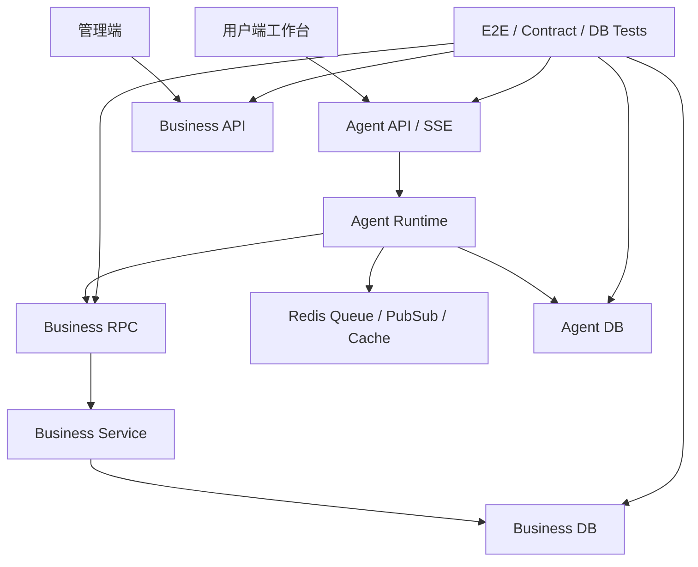
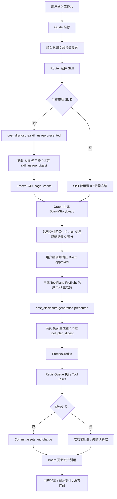

# M6 前后台体验与端到端验收设计

状态：active  
owner：前端责任域 / 管理端责任域 / 测试与验收责任域  
更新时间：2026-07-01  
适用范围：用户端 Agent 工作台、Creative Board 通用渲染、管理端 Skill 市场与审核治理、城市文旅 Skill E2E、性能并发、Redis 缓存与事件、测试验收  
相关代码路径：`frontend/**`、`admin_frontend/**`、`services/agent/**`、`services/business/**`、`tests/**`  
相关契约：`Agent API`、`Business API`、`AGUIEventEnvelope.v1`、`CreativeBoard.v1`、`SkillMarketplaceListing.v1`

## 0. 阶段目标与闭环

M6 将 M1-M5 的后端能力落到用户端和管理端体验，并用“城市文旅宣传视频 Skill”跑通端到端闭环。

闭环：

```text
用户端进入工作台
  -> Guide/Router 推荐城市文旅 Skill
  -> 生成 Board 和 Storyboard
  -> 用户编辑并确认
  -> Preflight 估算和确认
  -> 生成素材、保存资产、扣费/释放
  -> 作品或资产可查看

管理端
  -> 审核 Skill
  -> 治理 listing
  -> 查看 Tool/模型策略
  -> 查看积分、使用记录、结算、退款、举报和审计
```

M6 完成后，系统具备一个可演示、可测试、可继续迭代的 AIGC 创作平台主路径；正式 active 文档拆分、数据库迁移、灰度发布、观测告警和运营接管进入 M7。

## 1. 架构设计



系统运行视角：

- 用户端以 AG-UI 事件为实时状态源，以 snapshot/replay 兜底。
- 管理端以 Business API 为主，不消费 AG-UI。
- 测试层同时验证浏览器、API、RPC、Redis、Agent DB、Business DB。

## 2. 技术实现细节

### 2.1 用户端页面结构

```text
/workspace/:project_id
  TopBar：项目名 / Skill Tag / Board 版本 / 积分 / 导出
  MainBoard：Creative Board 通用渲染
  RightAgentPanel：对话、过程、确认、错误和下一步
  BottomPromptComposer：自然语言输入、素材引用、Skill 选择
/skill-marketplace
  MarketplaceHome：搜索 / 分类 / 推荐 / 已安装 / 免费付费筛选
/skill-marketplace/:listing_id
  ListingDetail：作者 / 评分 / 价格 / 权限 / 隐私 / 版本 / 退款规则
/skill-marketplace/:listing_id/install
  InstallConfirm：个人或企业安装 / 版本策略 / 权限和费用确认
/workspace/:project_id/marketplace-candidates
  MarketplaceCandidateDrawer：默认 Skill / 已安装 Skill / 市场候选对比
/installed-skills
  InstalledSkills：已安装 Skill / 禁用 / 移除 / 版本策略
/enterprise/skill-installations
  EnterpriseInstallations：可见范围 / 成员授权 / 企业积分上限 / 手动升级
```

### 2.2 创作者端发布后台页面结构

```text
/creator/skills
  SkillDraftList：草稿 / 审核中 / 被拒 / 已发布
/creator/skills/new
  SkillEditor：metadata / routing / input schema / Prompt / Board schema / Graph template
/creator/skills/:draft_id/edit
  SkillEditor：编辑草稿，提交审核后锁定版本
/creator/skills/:skill_id/versions
  VersionList：版本 digest / 发布状态 / 升级影响
/creator/skills/:skill_id/review-result
  ReviewResult：静态审核 15 项 / 失败原因 / 修改建议
/creator/skills/:skill_id/listing
  ListingSettings：文案 / 价格 / 权限 / 版权 / 安全 / 上架申请
/creator/skills/:skill_id/analytics
  CreatorAnalytics：聚合用量 / 收入 / 评分 / 举报 / 脱敏错误摘要
/creator/settlements
  CreatorSettlements：pending / eligible / settled / reversed / frozen
```

### 2.3 管理端页面结构

```text
/admin/skills/reviews
/admin/skills/reviews/:review_id
/admin/skills/marketplace
/admin/skills/marketplace/:listing_id
/admin/skills/settlements
/admin/skills/reports
/admin/tools
/admin/models
/admin/credits/ledger
/admin/audit-logs
```

### 2.4 性能与并发目标

| 场景 | 目标 |
| --- | --- |
| 入口 Guide | P95 < 3s，失败可降级为固定兜底文案 |
| Router | P95 < 5s，JSON schema pass rate >= 99% |
| Board Patch | P95 < 1s，冲突返回 409 |
| Event Replay | 单页默认 10，最大 100 |
| Tool Task | 按 tool_type/user/space 限流 |
| Redis Worker | 支持 inflight requeue |
| 管理端列表 | 默认 10 条分页，支持筛选 |

### 2.5 Redis 使用

| 能力 | 用途 |
| --- | --- |
| Queue | 生成任务排队 |
| Pub/Sub 或 Stream | 事件广播，DB 仍为最终事件事实源 |
| Cache | Skill Catalog、Tool Policy、Model Summary 短缓存 |
| Lock | 用户级/Tool级并发控制 |
| Rate Limit | Router、Tool、市场接口限流 |

## 3. 用户旅程

### 3.1 城市文旅 Skill 主路径

1. 用户进入项目工作台。
2. Agent 动态建议“城市文旅宣传视频”。
3. 用户输入“帮我做一个杭州夏季文旅宣传视频，现代国风，30 秒”。
4. Router 选择 Skill。
5. Eino Graph 生成 brief、元素、分镜、旁白、Prompt。
6. 用户编辑第 2 个镜头并确认 Board。
7. Agent 展示 ToolPlan 和积分。
8. 用户确认，系统冻结积分。
9. 任务生成参考图、视频片段和 BGM。
10. 成功资产保存并扣费，失败项释放。
11. 用户查看资产、创建变体、导出或发布作品。

### 3.1.1 Generic Creation 主路径

1. 用户输入明确创作需求，但不命中任何 published Skill。
2. Router 输出 `generic_creation` 并绑定内置 `skill_generic_creation`。
3. Eino Graph 生成 brief、creative direction、可选 storyboard。
4. 用户确认 Board。
5. 如需生成素材，进入 M4 ToolPlan 预估和确认。
6. Skill 使用费显示 0，Tool 生成费按 ToolPlan 结算。

### 3.2 付费市场 Skill 路径

1. 用户在候选中看到市场 Skill、作者、评分、Skill 使用费和生成费说明。
2. 未安装时，前端显示安装或企业授权要求，不自动执行。
3. 用户显式选择市场 Skill。
4. 前端先展示 `CostDisclosureCard` 的 Skill 使用费确认：Skill 使用费、交付阶段、退款摘要和后续 Tool 生成费说明。
5. 用户确认后冻结 Skill 使用费。
6. Graph 生成 storyboard 并写入 Board。
7. 达到 `value_delivered_stage=storyboard_ready` 后扣 Skill 使用费。
8. 用户在 Board approved 后点击生成素材，前端展示 `cost_disclosure.generation.presented`：Tool 逐项预估、Skill usage 当前状态和本次 Tool 确认摘要。
9. 用户确认后冻结 Tool 生成费，资产保存成功后逐项扣费。
10. 后续 Tool 生成失败时，只释放失败 Tool item 的冻结，展示“Skill 方案费已按交付规则扣除”。

### 3.3 企业安装市场 Skill 路径

1. 企业管理员在市场详情页安装 Skill。
2. 配置成员可见范围、企业积分使用上限和可用 Tool。
3. 成员在企业空间使用该 Skill。
4. usage、ledger、settlement 记录 enterprise_id、space_id 和 run_id。
5. 管理端可禁用安装，禁用后成员不能新建 run，历史 run 仍可查看。
6. 新版本发布后，企业管理员手动确认升级；未确认前继续使用 pinned 版本。

### 3.4 Listing 暂停路径

1. 风控或管理员将 listing 改为 `suspended`。
2. Router Guard 不再把该 listing 作为 primary candidate。
3. 市场详情页展示不可用原因和替代默认 Skill。
4. 历史 run 按 `skill_id + skill_version + skill_spec_digest` 恢复为只读或可继续非付费步骤。

### 3.5 管理端审核路径

1. 创作者提交市场 Skill。
2. 审核员打开审核详情。
3. 查看 spec、Tool 绑定、价格、版权、安全声明和静态审核 15 项结果。
4. 审核通过并发布。
5. 运营上架或暂停 listing。
6. 财务/运营查看 usage 和结算。

### 3.6 举报、退款和结算路径

1. 用户对一次 usage 发起举报或退款请求。
2. 管理端查看脱敏 usage 摘要、ledger、交付阶段、资产提交结果和审计链路。
3. 运营执行退款、拒绝或转风险审核。
4. 退款发生在结算前时从 pending settlement 扣除；结算后从未来余额抵扣。
5. 违规时冻结待结算金额，并记录审计。

## 4. 用户交互

### 4.1 用户端交互

| 状态 | UI |
| --- | --- |
| empty | Board 区展示“创意板将在输入后生成”，右侧展示 Guide |
| routing | 右侧显示“正在理解需求”，主区不闪烁 |
| board_ready | 主区展示 Brief、Element、Storyboard |
| editing | 局部卡片进入编辑态，提交 Patch |
| waiting_confirmation | ConfirmationCard 固定在右侧 |
| cost_disclosure | 分阶段展示 Skill 使用费或 Tool 生成费；确认时绑定当前阶段 digest |
| generating | ProgressCard + AssetPreview 预览骨架 |
| partial_success | 成功资产可用，失败项可重试 |
| completed | 展示总结、下一步动作、导出 |

### 4.2 管理端交互

管理端采用白色高密度后台风格：

- 列表页：PageHeader + FilterBar + DataTable + Pagination。
- 详情页：Drawer 展示结构化字段，不直接输出 raw JSON。
- 高风险操作：preview -> confirm -> result -> audit hint。
- 敏感字段：系统 Prompt、完整密钥、供应商响应、用户私有素材不可明文展示。
- 市场治理页展示 health_status、risk_score、失败率、退款率、举报数和自动暂停原因。
- 创作者分析页只展示聚合用量、收入、评分、举报和脱敏错误摘要。

## 5. 业务设计

M6 验收业务闭环：

| 能力 | 业务服务 | Agent 服务 | 前端 |
| --- | --- | --- | --- |
| Skill 路由 | 提供 Published Skill Catalog | Router 和 Guard | 展示推荐和候选 |
| Board | 无业务事实 | 保存 Board/patch/snapshot | 通用渲染 |
| 生成扣费 | 积分、资产事实 | ToolPlan、任务、事件 | 确认和进度 |
| 市场 Skill | listing、pricing、usage、settlement | 使用费确认和 usage 引用 | 候选和费用提示 |
| 管理治理 | 审核、下架、审计 | 不参与 | 管理端 CRUD |
| 企业安装 | 安装授权和企业积分规则 | Router Guard 读取 entitlement | 管理端配置、用户端可见 |
| 风控退款 | report、refund、settlement reversal | 仅引用 usage_id | 管理端处理、用户端状态 |

## 6. 表设计

M6 不新增核心表，只验证前面阶段表的联动。

验证表：

| 数据库 | 表 |
| --- | --- |
| Agent DB | `agent_sessions`、`agent_runs`、`agent_events`、`agent_creative_boards`、`agent_creative_board_versions`、`agent_tasks`、`agent_tool_calls`、`agent_interrupts`、`agent_snapshots` |
| Business DB | `skills`、`skill_versions`、`skill_marketplace_listings`、`skill_usage_records`、`skill_creator_settlements`、`credit_estimates`、`credit_freezes`、`credit_ledger_entries`、`assets`、`asset_commit_batches` |

数据一致性口径：

- Agent run 中的 asset_ref 必须能在 Business DB 查到对应资产。
- Business ledger 的 run_id 必须能追溯 Agent run。
- usage record 的 listing_id、skill_version、run_id 必须完整。
- usage record 的 skill_spec_digest 必须与 Agent run 快照一致。
- listing 暂停不改变 skill_versions 内容。
- event sequence 在同一 run 内单调递增。

## 7. Prompt Schema 示例

城市文旅端到端 Skill 使用的 Prompt 集：

```json
{
  "schema_version": "prompt_bundle.v1",
  "skill_id": "skill_city_tourism_video",
  "prompts": [
    {
      "prompt_id": "city_tourism.brief_builder.v1",
      "output_schema_ref": "BriefElement.v1"
    },
    {
      "prompt_id": "city_tourism.storyboard_planner.v1",
      "output_schema_ref": "Storyboard.v1"
    },
    {
      "prompt_id": "city_tourism.prompt_compiler.v1",
      "output_schema_ref": "PromptElement.v1"
    }
  ],
  "safety": {
    "quoted_user_input": true,
    "prompt_injection_guard": true,
    "no_system_prompt_exposure": true
  }
}
```

## 8. Tool Schema 模板示例

端到端验收 ToolSet：

```json
{
  "schema_version": "toolset.v1",
  "toolset_id": "city_tourism_video.toolset.v1",
  "tools": [
    "llm.structured",
    "prompt.compile",
    "safety.precheck",
    "image_gen.default",
    "video_gen.default",
    "music_gen.default",
    "media.compose",
    "asset.commit",
    "credit.estimate",
    "credit.freeze",
    "credit.commit",
    "credit.release",
    "marketplace.skill.get",
    "credit.skill_usage.freeze",
    "credit.skill_usage.commit",
    "credit.skill_usage.refund"
  ],
  "runtime_policy": {
    "max_parallel_tasks_per_run": 4,
    "max_video_tasks_per_user": 2,
    "queue": "redis"
  }
}
```

## 9. Skill Schema 示例

```json
{
  "schema_version": "skill_runtime_spec.v1",
  "skill_id": "skill_city_tourism_video",
  "version": "1.0.0",
  "level": "L3",
  "status": "published",
  "scope": "system_default",
  "name": "城市文旅宣传视频",
  "defaults": {
    "duration_sec": 30,
    "aspect_ratio": "9:16",
    "language": "zh-CN",
    "shot_count": 6
  },
  "stages": [
    "intent",
    "brief",
    "board",
    "storyboard",
    "approval",
    "generation_preflight",
    "generation",
    "asset_commit",
    "refinement",
    "completion"
  ],
  "marketplace": {
    "listing_allowed": true,
    "default_skill_usage_points": 0
  }
}
```

## 10. 流程图



主流程默认分两次确认。只有 ToolPlan 已存在且 Skill usage 尚未确认时，才允许 combined confirmation；后端必须按 `FreezeSkillUsageCredits -> FreezeCredits` 顺序执行，第二步失败时释放第一步冻结。

## 11. Eino 使用说明

M6 验证 Eino 能力组合：

- ChatModel Router 命中城市文旅 Skill。
- Eino Graph 执行 brief、storyboard、approval、preflight。
- Workflow 处理 Preflight 和 Asset Commit。
- GraphPlan billing nodes 覆盖付费市场 Skill 的确认、冻结、交付、扣费和释放。
- Tool Runtime 并发执行 image/video/music task。
- Interrupt / Resume 覆盖 Board approval 和 credit confirmation。
- Callback / Trace 支持端到端排障。

## 12. 开发细节

前端：

```text
frontend/src/features/agent-workspace/
  AgentWorkspaceShell.jsx
  RightAgentPanel.jsx
  PromptComposer.jsx
frontend/src/features/creative-board/
  CreativeBoardView.jsx
  BoardElementRenderer.jsx
  StoryboardCard.jsx
  ToolPlanCard.jsx
  ConfirmationCard.jsx
frontend/src/features/marketplace/
  MarketplaceHome.jsx
  ListingDetail.jsx
  InstallConfirm.jsx
  MarketplaceCandidateDrawer.jsx
  InstalledSkillList.jsx
  EnterpriseInstallations.jsx
frontend/src/features/creator-skills/
  SkillDraftList.jsx
  SkillEditor.jsx
  ReviewResult.jsx
  ListingSettings.jsx
  CreatorAnalytics.jsx
  CreatorSettlements.jsx
```

管理端：

```text
admin_frontend/src/features/skill-marketplace/
  ReviewListPage.jsx
  ReviewDetailDrawer.jsx
  ListingGovernancePage.jsx
  SettlementPage.jsx
  ReportsPage.jsx
  InstallationGovernancePage.jsx
```

测试：

```text
tests/e2e/agent-workspace/
tests/contract/business-rpc/
tests/contract/agent-api/
tests/agent/agui/
tests/db/agent/
tests/db/business/
```

## 13. 开发注意事项

- 前端 route、API hook、AG-UI reducer 必须分层，不用单个巨型页面承载所有状态。
- 管理端详情不展示 raw JSON；Spec 用结构化分组和折叠摘要。
- 创作者后台和管理端运营页都不得展示用户原始输入、上传资产、完整 Board 或生成资产。
- 浏览器验收必须点击下拉、打开 Drawer/Modal、测试断线 replay。
- 城市文旅 Skill 只是端到端样例，不允许把文旅字段写死到平台核心组件。
- 性能优化优先缓存 Skill Catalog、Tool Policy、Model Summary。

## 14. 验收标准

用户端：

- [ ] 入口动态 Guide 可用。
- [ ] 明确输入命中城市文旅 Skill。
- [ ] 未命中具体 Skill 但有创作意图时进入 Generic Creation Graph。
- [ ] Board/Storyboard 可通用渲染和编辑。
- [ ] 生成前展示 ToolPlan 和积分确认。
- [ ] CostDisclosureCard 分阶段展示 Skill 使用费、Tool 生成费、交付阶段和退款摘要。
- [ ] 生成进度、部分失败、重试、资产保存可见。
- [ ] Skill 使用费已交付扣费后，Tool 生成失败只释放 Tool 费用并给出清晰说明。
- [ ] 用户端市场前台可搜索、查看详情、安装、确认版本策略并进入工作台使用。
- [ ] Workspace Marketplace Candidate Drawer 可展示默认、已安装和市场候选的价格/安装/权限差异。
- [ ] Installed Skills 和 Enterprise Skill Installations 支持禁用、移除、授权、积分上限和升级确认。

创作者端：

- [ ] 创作者可创建草稿、编辑 Skill Package、查看静态审核结果、发布版本和提交 listing。
- [ ] 创作者可查看版本 digest、升级影响、聚合收入、评分、举报和脱敏错误摘要。
- [ ] 创作者结算页展示 pending、eligible、settled、reversed、frozen。
- [ ] 创作者端不展示用户原始输入、上传资产、Board 详情和生成资产。

管理端：

- [ ] Skill 审核详情可查看 spec、Tool、价格、版权、安全。
- [ ] Listing 可上架、暂停、恢复、下架。
- [ ] usage、ledger、settlement 可追溯。
- [ ] 企业安装市场 Skill 后，成员可用范围和企业积分规则生效。
- [ ] 个人安装默认 `latest_published`，企业安装默认 `pinned`，升级策略可验证。
- [ ] Listing 暂停后，新 run 不能使用该市场 Skill，历史 run 可按快照查看。
- [ ] 举报、退款、结算 reversal、pending settlement freeze 可审计。
- [ ] 创作者分析页不展示用户输入、上传资产、Board 详情和生成资产。
- [ ] 高风险操作有 preview/confirm/audit。

测试：

- [ ] AG-UI event schema、顺序、replay 通过。
- [ ] RPC contract fixture 通过。
- [ ] Agent DB 与 Business DB 边界验证通过。
- [ ] Redis worker 重启恢复通过。
- [ ] 并发限流和幂等测试通过。
- [ ] 付费市场 Skill E2E、企业安装 E2E、listing suspended E2E、Tool 失败后的费用 UX E2E 通过。

## 15. 风险

| 风险 | 影响 | 缓解 |
| --- | --- | --- |
| 前端场景硬编码 | 后续 Skill 扩展困难 | CreativeElement 通用渲染验收。 |
| 管理端信息过载 | 审核效率下降 | 分组、摘要、风险标签、Drawer。 |
| E2E 外部 Tool 不稳定 | 验收不可重复 | 本地 fake provider + contract test + 真实链路单独报告。 |
| Redis 与 DB 状态不一致 | 任务重复或丢失 | DB 为事实源，Redis 重启后 reconcile。 |
| E2E 通过后直接开发 | 契约和迁移漏项 | 进入 M7 做 active 拆分、migration、feature flag 和发布治理。 |
