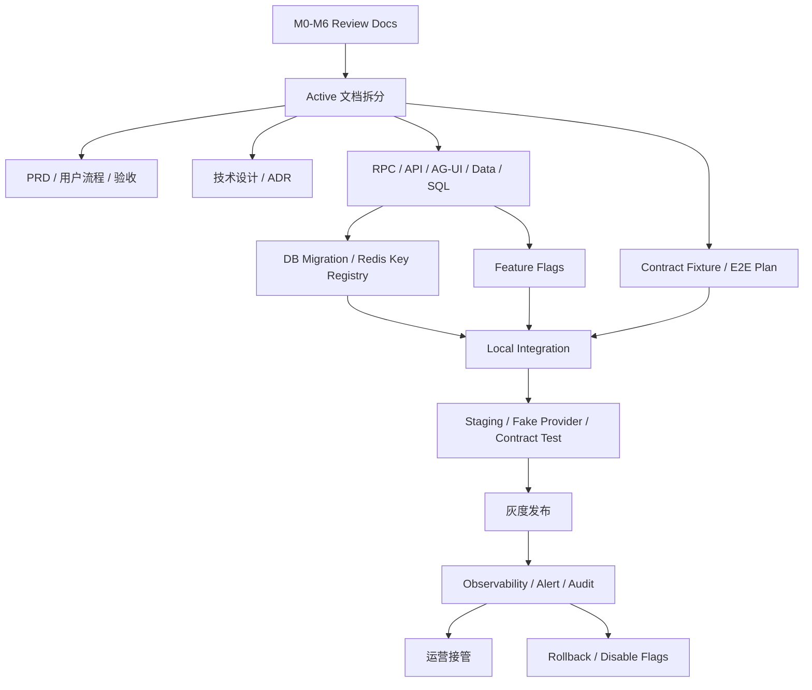
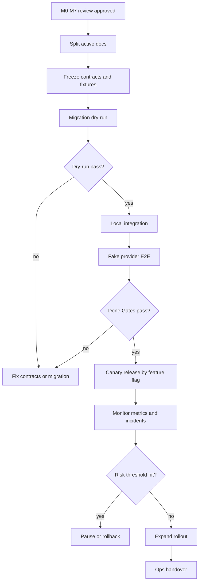

# M7 契约拆分、迁移发布与运营治理设计

状态：active  
owner：文档与契约责任域 / 测试与验收责任域 / 运维治理责任域  
更新时间：2026-07-01  
适用范围：M0-M6 审核通过后的 active 事实源拆分、数据库迁移、配置灰度、发布验收、观测告警、回滚和运营接管  
相关代码路径：`docs/**`、`api/**`、`db/migrations/**`、`services/agent/**`、`services/business/**`、`frontend/**`、`admin_frontend/**`、`tests/**`  
相关契约：`StateEnumRegistry.v1`、`Agent API`、`Business API`、`Business RPC`、`AGUIEventEnvelope.v1`、`Agent DB`、`Business DB`、`Redis Key Registry`

## 0. 阶段目标与闭环

M7 不新增用户创作能力。它负责把前置阶段 review 设计转成可执行、可回滚、可观测、可运营的正式重构计划，确保系统从“设计通过”进入“工程落地和生产治理”时不会丢契约、丢数据、丢审计或丢验收证据。

闭环：

```text
M0-M6 review 通过
  -> 拆分 active PRD / 技术设计 / 契约 / SQL / 测试事实源
  -> 生成需求映射矩阵和迁移清单
  -> 准备 feature flags / Redis key / migration / fixtures
  -> 本地集成和 fake provider 验收
  -> 灰度发布和监控
  -> 运营接管、回滚预案、遗留风险登记
```

M7 不做：

- 不修改已发布 SkillVersion 内容。
- 不在未冻结契约前写业务代码。
- 不把 review 文档直接作为 active 开发事实源。
- 不用 Redis 替代 PostgreSQL 最终状态。

M7 入口裁决：

| 事项 | 裁决 |
| --- | --- |
| review 方向 | 通过 |
| P0 文档补丁 | 已完成 |
| active 拆分 | 已进入 M7 active 契约拆分 |
| M0 active 契约冻结 | active 契约拆分后的第一道工程 Gate |
| M1-M6 分阶段开发 | M0 active 契约冻结后才允许按责任域开发 |
| 研发编码 | 当前不允许直接编码 |

## 1. 架构设计



责任域：

| 责任域 | M7 职责 |
| --- | --- |
| 文档与契约 | 拆 active 文档、冻结字段、生成契约索引和变更记录 |
| Agent 服务 | 输出实现映射矩阵、迁移 Agent Runtime 数据、接入观测 |
| 业务服务 | 输出 RPC/SQL/事务/审计映射，迁移 Business DB |
| 前端 / 管理端 | 输出页面和 AG-UI 消费映射，接入 feature flag |
| 测试与验收 | 维护 contract fixture、E2E、DB、Redis、性能报告 |
| 运维治理 | feature flag、发布批次、监控告警、回滚和事故登记 |

## 2. 技术实现细节

### 2.0 Active 化前 P0 补丁 Gate

以下 P0 缺口必须在 M7 拆分 active 事实源前完成：

| P0 | 归属阶段 | active 输出 |
| --- | --- | --- |
| Skill 使用费 usage record 创建时机和状态机 | M5 | RPC 契约、SQL、fixture、业务状态机测试 |
| Skill 使用费确认与 Tool 生成费确认时序 | M3 / M4 / M5 | AG-UI 事件、ConfirmationPayload、Graph billing node、E2E fixture |
| 创作者端 Skill 发布后台页面和验收 | M5 / M6 | 创作者 PRD、路由、页面状态、API 契约、权限矩阵、E2E 验收 |
| 用户端 Skill 市场前台页面和安装/使用路径 | M5 / M6 | 用户端 PRD、市场路由、安装路径、工作台使用路径、AG-UI/API fixture |
| Skill installation 版本策略和升级规则 | M5 | installation 表、升级 RPC、管理端确认、历史 run fixture |
| Generic Creation Graph 作为平台内置 L0 fallback 的正式 spec | M1 / M3 / M6 | 内置 L0 Skill Spec、GraphTemplate、RouterDecision fixture、Board E2E |

Gate 规则：

1. P0 文档补丁已完成，用户已确认 review 完成并进入 M7 active 契约拆分。
2. 当前不得把 review 文档作为研发编码依据。
3. PR-1 契约事实源已随 M7 active 启动升级为 active；后续 PR-2 到 PR-5 必须按本 Gate 逐步扩大范围。
4. M7 active 拆分完成后，先做 M0 active 契约冻结，再允许各责任域输出实现映射矩阵并启动 M1-M6 分阶段开发。
5. 实现映射矩阵必须逐条引用 active 契约，不能引用 review 文档行号作为开发依据。

### 2.0.1 P1 首期排期和验收补充

以下 P1 不阻断 active 拆分，但应进入首期排期、验收补充或运营策略：

| P1 | 归属阶段 | 补充口径 |
| --- | --- | --- |
| 异步模型 Provider callback / polling | M4 | `provider_task_id`、polling interval、callback endpoint/signature、artifact URL TTL、provider timeout、cancel、partial result |
| 市场搜索、排序和反作弊 | M5 / 10 | 相关性、安装状态、评分、成功率、退款率、举报率、30 天使用量、价格、平台精选、企业授权、风险分 |
| 退款仲裁细分状态 | M5 / 10 | `refund_requested`、`refund_reviewing`、`refund_approved`、`refund_rejected`、`refund_reversed`、`settlement_adjusted` |
| 企业积分预算和审批规则 | M5 / M6 | `per_user_daily_limit`、`per_skill_monthly_limit`、`requires_admin_approval_over_points`、`allowed_departments`、`disabled_tools` |
| 数据留存、删除和导出 | M6 / 10 | Board 保留周期、draft artifact 过期、删除项目后的 Runtime 数据处理、离职成员数据归属、审计日志保留 |
| Skill 相似度和重复发布治理 | M5 / 10 | 高相似降权、复制默认 Skill 不得收费、同创作者重复模板限制、企业私有 Skill 不得复制公开市场后收费 |

P1 验收要求：

1. P1 可以作为首期任务排期，不阻止 M7 Contract-first active 拆分和 M0 active 契约冻结。
2. P1 中涉及字段、状态或策略的内容，在实现前仍必须进入 active 契约和 fixture。
3. 市场反作弊、退款仲裁和数据留存属于运营治理能力，不能只做前端展示。

### 2.1 Active 事实源拆分

| Review 来源 | Active 目标（字段级事实源） | 内容 |
| --- | --- | --- |
| `00` | `docs/00`（本目录 active 设计依据） | 微服务边界、阶段依赖、总体验收 |
| `01-M0` | `api/thrift/**`、`api/openapi/**`、`api/agui/**`、`api/schemas/**`、`db/migrations/**` | RPC/API/AG-UI/schema/SQL/状态枚举 |
| `02-M1` | `services/agent/internal/runtime/{guide,router}/**` + `internal/contracts/foundation/**` | Guide、Router、Guard、Eval |
| `03-M2` | `internal/contracts/boardgraph/**`、`db/migrations/**` | Board、Element、Patch、Replay |
| `04-M3` | `services/agent/internal/runtime/{skillgraph,eino,turnloop}/**` | Skill Runtime、GraphPlan、Interrupt、Eino Adapter |
| `05-M4` | `internal/contracts/toolasset/**`、`services/agent/internal/application/workbench/**` | ToolPlan、Credit、Asset、Redis Queue |
| `06-M5` | `internal/contracts/skillmarket/**`、`services/business/internal/application/marketplace/**` | Marketplace、Usage、Settlement、Governance |
| `07-M6` | `tests/e2e/**`、`internal/contracts/releasegate/**` | E2E、前后台验收、性能并发 |
| `09/10` | `api/schemas/**`、`internal/contracts/skillmarket/**` | Skill 分层、Tool/Model、市场风控和数据隔离 |

拆分规则：

1. 每个 active 文档必须标注来源 review 文档和裁决摘要。
2. 字段级事实源必须落在 Thrift、OpenAPI、AG-UI JSON Schema、migration 和 fixture。
3. 设计文档不得成为字段最终事实源；字段以契约文件为准。
4. active 文档拆分后，review 文档保留为阶段审核记录。

### 2.2 Feature Flag 与发布批次

| Flag | 默认 | 作用 |
| --- | --- | --- |
| `agent_core_refactor.enabled` | false | 新 Agent Runtime 主开关 |
| `creative_guide.enabled` | false | M1 Guide |
| `chatmodel_router.enabled` | false | M1 Router |
| `creative_board.enabled` | false | M2 Board |
| `eino_graph_runtime.enabled` | false | M3 Graph |
| `tool_generation_runtime.enabled` | false | M4 ToolPlan/Task |
| `skill_marketplace.enabled` | false | M5 市场 |
| `paid_marketplace_skill.enabled` | false | M5 付费 Skill |
| `marketplace_settlement.enabled` | false | M5 结算 |
| `admin_marketplace_governance.enabled` | false | M6 管理端治理 |

发布批次：

1. `batch_0_contract`：只发布契约、migration dry-run、fixture。
2. `batch_1_agent_readonly`：Agent 新模型只读写测试空间。
3. `batch_2_board_router`：M1/M2 用户端灰度。
4. `batch_3_graph_tool`：M3/M4 生成链路灰度。
5. `batch_4_marketplace_free`：免费市场 Skill 和安装灰度。
6. `batch_5_marketplace_paid`：付费市场 Skill、结算和退款灰度。
7. `batch_6_general_availability`：完成运营接管。

### 2.3 迁移原则

1. PostgreSQL migration 只做向前兼容的 additive 变更，禁止上线阶段直接删除旧列和旧表。
2. 所有业务事实迁移走 Business 服务 migration job，不由 Agent 服务直接写 Business DB。
3. 旧 session 默认只读归档；新 session 使用新 Agent Runtime。
4. 需要回填的引用必须写 `migration_jobs` 和校验报告。
5. Redis key 只用于缓存、队列、锁和事件，不作为迁移最终事实。

### 2.4 Redis Key Registry

| Key | 类型 | TTL | 说明 |
| --- | --- | --- | --- |
| `dora:agent:generation_jobs` | list/stream | none | 生成任务队列 |
| `dora:agent:generation_jobs:inflight` | list/stream | none | worker inflight |
| `dora:agent:events:{run_id}` | pubsub/stream | 24h | AG-UI 广播 |
| `dora:agent:lock:user:{user_id}:tool:{tool_type}` | lock | 5m | 用户 Tool 并发锁 |
| `dora:agent:cache:skill_catalog:{space_id}` | cache | 60s | Skill Catalog |
| `dora:agent:cache:tool_policy:{tool_id}` | cache | 60s | Tool Policy |
| `dora:agent:cache:model_registry:{model_type}` | cache | 60s | Model Registry |
| `dora:business:event_outbox:{shard}` | stream | none | 业务事件分发 |

### 2.5 观测指标

| 类别 | 指标 |
| --- | --- |
| Router | schema pass rate、misselect rate、P95 latency、fallback rate |
| Board | patch conflict rate、payload size、snapshot restore success |
| Graph | node failure rate、interrupt resume success、billing node success |
| Tool | queue lag、task success rate、retry rate、provider timeout |
| Credit | freeze success、commit success、release success、duplicate prevention |
| Marketplace | paid confirmation conversion、refund rate、report rate、listing suspend count |
| Redis | queue depth、inflight stale count、lock contention |
| DB | migration duration、slow query、deadlock、storage growth |

## 3. 用户旅程

### 3.1 工程交付旅程

1. 用户审核 M0-M7 review 文档。
2. 文档与契约责任域拆分 active 事实源。
3. 各工程责任域输出需求映射矩阵。
4. 契约测试先跑通，再开发服务实现。
5. 本地 fake provider 验证 Router、Board、Graph、Tool、Marketplace。
6. 测试责任域出具验收报告。

### 3.2 灰度用户旅程

1. 用户进入被灰度的空间。
2. Feature flag 决定使用新工作台。
3. 用户完成 Guide、Router、Board、Preflight、生成和资产保存。
4. 失败时前端展示可恢复错误，后台记录 trace_id。
5. 运营可按 run_id、usage_id、asset_id 追溯。

### 3.3 运营接管旅程

1. 运营查看发布批次和关键指标。
2. listing 或 Tool 异常触发告警。
3. 运营执行暂停、降权、退款、回滚或关停 flag。
4. 系统写入审计和事故记录。

## 4. 用户交互

管理端新增发布治理入口：

| 页面 | 交互 |
| --- | --- |
| Release Dashboard | 批次、flag、指标、当前风险 |
| Migration Jobs | dry-run、执行、校验、失败重试 |
| Contract Fixtures | fixture 版本、通过率、失败差异 |
| Runtime Health | Router、Graph、Tool、Credit、Marketplace 指标 |
| Incident Review | 事故、影响范围、处理动作、复盘 |

用户端交互要求：

- 灰度期间不向用户展示内部发布批次。
- 新旧链路切换失败时，给出统一错误和重试入口。
- 付费确认、资产扣费、退款状态必须可追溯。

## 5. 业务设计

M7 Done Gate：

| Gate | 条件 |
| --- | --- |
| P0 Patch Done | usage record、两阶段 CostDisclosure、创作者后台、用户市场、installation 版本策略、Generic Graph 六项文档补丁完成 |
| Contract Done | RPC/API/AG-UI/SQL/schema/fixture 全部冻结 |
| Migration Done | migration dry-run、up/down、校验报告完成 |
| Runtime Done | M1-M5 主链路通过本地和 fake provider 验收 |
| UI Done | 用户端和管理端关键路径 E2E 通过 |
| Ops Done | feature flag、监控、告警、回滚和事故模板完成 |
| Business Done | Skill 使用费、Tool 生成费、退款、结算和审计可追溯 |

业务规则：

1. 未通过对应 PR Done Gate，不允许扩大下一批 active 拆分范围或进入 M1-M6 业务代码开发。
2. 未通过 Contract Done，不允许进入服务代码重构。
3. 未通过 Migration Done，不允许灰度。
4. 未通过 Ops Done，不允许打开付费市场 Skill。
5. 回滚只允许通过关闭 flag、暂停 listing、释放未提交冻结和切回旧入口，不删除已产生账务事实。
6. 生产事故处理必须优先保护用户资产、积分和审计链路。

## 6. 表设计

Business DB：

| 表 | 字段 | 说明 |
| --- | --- | --- |
| `system_feature_flags` | `flag_key`、`enabled`、`scope_type`、`scope_id`、`config_json`、`updated_by` | 灰度开关 |
| `release_batches` | `batch_id`、`batch_name`、`status`、`started_at`、`completed_at`、`rollback_plan` | 发布批次 |
| `migration_jobs` | `job_id`、`job_type`、`status`、`dry_run_result`、`validation_result`、`idempotency_key` | 迁移任务 |
| `contract_fixture_runs` | `run_id`、`fixture_version`、`target`、`status`、`diff_summary` | 契约 fixture 执行 |
| `runtime_health_metrics` | `metric_id`、`metric_type`、`window_start`、`window_end`、`value_json` | 运行指标 |
| `operational_incidents` | `incident_id`、`severity`、`status`、`impact_summary`、`resolution_summary`、`trace_refs` | 事故记录 |

Agent DB：

| 表 | 字段 | 说明 |
| --- | --- | --- |
| `agent_release_audits` | `audit_id`、`run_id`、`release_batch_id`、`feature_flags_json`、`trace_id` | Agent run 发布追溯 |
| `agent_runtime_health_snapshots` | `snapshot_id`、`run_id`、`graph_plan_id`、`task_summary`、`error_summary` | 运行健康快照 |

所有表仍禁止数据库级 `FOREIGN KEY` / `REFERENCES`。

## 7. Prompt Schema 示例

```json
{
  "schema_version": "prompt_schema.v1",
  "prompt_id": "release_risk_summary.v1",
  "purpose": "release_governance_assistance",
  "inputs": {
    "release_batch": "ReleaseBatch.v1",
    "contract_fixture_summary": "ContractFixtureSummary.v1",
    "runtime_metrics": "RuntimeHealthMetrics.v1",
    "incident_history": "array<IncidentSummary.v1>"
  },
  "output_schema": {
    "risk_flags": "array<string>",
    "recommended_action": "continue|pause|rollback|manual_review",
    "summary": "string"
  },
  "policy": {
    "human_final_decision_required": true,
    "do_not_modify_flags": true,
    "do_not_execute_migration": true
  }
}
```

## 8. Tool Schema 模板示例

```json
{
  "schema_version": "tool_schema_template.v1",
  "tool_id": "release.health.check",
  "tool_type": "ops_workflow",
  "input_schema": {
    "release_batch_id": "string",
    "metric_window_minutes": "integer",
    "required_gates": "array<string>"
  },
  "output_schema": {
    "passed": "boolean",
    "failed_gates": "array<string>",
    "metric_summary": "object",
    "recommended_action": "continue|pause|rollback"
  },
  "runtime_policy": {
    "timeout_ms": 10000,
    "idempotency_required": true
  }
}
```

## 9. Skill Schema 示例

```json
{
  "schema_version": "skill_runtime_spec.v1",
  "skill_id": "skill_internal_release_guard",
  "version": "1.0.0",
  "level": "L0",
  "scope": "platform_internal",
  "status": "published",
  "routing": {
    "domains": ["release_governance", "ops_review"],
    "intent_examples": ["检查本批次是否可以继续灰度"],
    "negative_intents": ["替我直接上线", "跳过迁移校验"],
    "priority": 10
  },
  "tool_bindings": {
    "health_check": ["release.health.check"],
    "contract_fixture": ["contract.fixture.run"],
    "migration_validate": ["migration.validate"]
  },
  "confirmation_policy": {
    "human_final_decision_required": true,
    "can_modify_feature_flags": false
  }
}
```

## 10. 流程图



## 11. Eino 使用说明

M7 不新增用户创作 Graph，但可以把发布检查做成内部 Workflow：

- `release_health_check_workflow` 汇总 fixture、migration、runtime metrics。
- `migration_validation_workflow` 校验 dry-run、row count、digest 和回滚脚本。
- `incident_triage_workflow` 只生成风险摘要，不自动执行回滚。
- 所有内部 Workflow 通过 `runtime/einoadapter/**` 接入，不直接在运营代码里散落 Eino SDK 类型。
- Callback/Trace 不记录系统 Prompt、供应商原始响应、用户隐私全文和密钥。

## 12. 开发细节

目录建议：

```text
services/business/internal/application/releaseops/
services/agent/internal/runtime/releaseaudit/
internal/contracts/releasegate/
tests/fixtures/contracts/
tests/e2e/
```

测试：

- contract fixture 全量通过。
- migration up/down dry-run 通过。
- fake provider E2E 通过。
- Redis worker 重启和 reconcile 通过。
- feature flag 开关和回滚通过。
- 付费市场 Skill 退款、结算 reversal 和 listing suspended 通过。

## 13. 开发注意事项

- 不把 M7 写成上线承诺；它是进入正式实现和发布治理的设计阶段。
- 不在未审核通过前修改 active 契约。
- 不在回滚中删除已经产生的积分账务、资产和审计记录。
- 不把运维指标只放在日志里，关键指标必须可查询和可告警。
- 不让内部 Release Guard Skill 执行高风险写操作，只给出检查结论。

## 14. 验收标准

- [ ] M0-M7 review 文档全部通过用户审核。
- [x] P0 Patch Done：六项 active 化前文档补丁均已落入对应阶段和 M7 Gate。
- [x] User Confirmed：review 已完成并进入 M7 active 契约拆分。
- [ ] active 文档拆分清单明确，字段级事实源路径明确。
- [ ] feature flags、Redis key、migration、fixture 和回滚策略完整。
- [ ] 本地集成、fake provider、contract fixture、DB/Redis、E2E 验收入口明确。
- [ ] 发布批次、观测指标、事故处理和运营接管有页面和表设计。
- [ ] 回滚不破坏用户资产、积分账务、Skill usage、ledger 和审计记录。
- [ ] 内部 Eino Workflow 只辅助判断，不自动执行上线或回滚。

## 15. 风险

| 风险 | 影响 | 缓解 |
| --- | --- | --- |
| review 文档直接进开发 | 字段事实源不稳定 | M7 强制 active 拆分和契约冻结。 |
| migration 不可回滚 | 数据风险 | additive migration、dry-run、校验报告和 flag 回滚。 |
| 付费能力灰度过快 | 扣费争议 | 先免费市场，再付费市场，保留暂停和退款链路。 |
| 指标缺失 | 事故定位慢 | 运行指标、审计、trace_id 和 incident 表。 |
