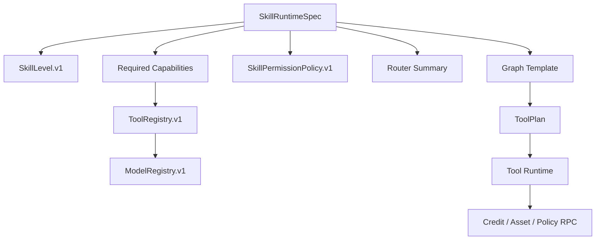
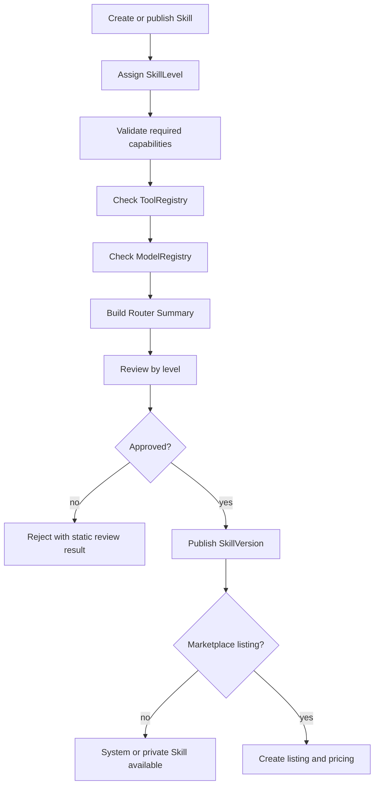

# Skill 分层、Tool 清单与场景 Skill 示例

状态：active  
owner：产品责任域 / Agent 服务责任域 / 业务服务责任域  
更新时间：2026-07-01  
适用范围：Skill Level、Tool Registry、Model Registry、场景 Skill 样例、Router 候选和市场审核  
相关代码路径：`services/agent/internal/runtime/skill/**`、`services/agent/internal/runtime/toolplan/**`、`services/business/internal/application/toolpolicy/**`、`services/business/internal/application/skillcatalog/**`、`api/**`  
相关契约：`SkillLevel.v1`、`ToolRegistry.v1`、`ModelRegistry.v1`、`SkillRuntimeSpec.v1`、`SkillPermissionPolicy.v1`

## 0. 阶段目标与闭环

本专题用于冻结 Skill 分层、必要 Tool、模型能力注册和典型场景 Skill，避免 M1-M7 在“什么是 Skill”“Skill 能用哪些 Tool”“场景能力如何落到 Graph/Board/Tool”上各自解释。

闭环：

```text
定义 SkillLevel
  -> 冻结必要 Tool 清单
  -> 定义 ModelRegistry 能力选择
  -> 给出 10 个场景 Skill 样例
  -> Router / Graph / ToolPlan / 审核 / 管理端按同一能力边界实现
```

## 1. 架构设计



边界：

1. Skill 声明能力需求，不直接绑定供应商模型。
2. Tool Registry 管 Tool 能力、输入输出、计费、并发和安全要求。
3. Model Registry 管供应商别名、模型能力、质量画像和可用策略。
4. Skill Level 决定审核强度、可用 Tool 范围、市场可售性和费用规则。

## 2. 技术实现细节

### 2.1 SkillLevel.v1

| Level | 名称 | 创建者 | 可用能力 | 可进市场 | 审核 | Skill 使用费 |
| --- | --- | --- | --- | --- | --- | --- |
| L0 | 平台默认轻量 Skill | platform | LLM / Board / Prompt | 否 | 平台内部审核 | 固定 0 |
| L1 | Prompt Skill | 普通用户 | LLM / Prompt Compiler | 是 | 静态审核 | 可设置 |
| L2 | Guided Board Skill | 用户 / 企业 | LLM / Board / Prompt / 低风险 Tool | 是 | 静态审核 | 可设置 |
| L3 | Graph Skill | 高级用户 / 企业 / 平台 | Graph / Image / Video / Music / Asset | 是 | 强审核 | 可设置 |
| L4 | Partner Package Skill | 合作方 / 平台 | 受控 Graph Tool / 多 Tool package | 是 | 强审核 + 运营准入 | 可设置 |

规则：

1. 平台默认 Skill 的 Skill 使用费固定为 0。
2. 市场 Skill 可以设置 Skill 使用费，但 Tool 生成费始终通过 ToolPlan 单独预估和结算。
3. L3/L4 才能默认使用视频、音乐、合成等高成本 Tool。
4. L4 需要平台运营准入，不允许普通用户直接发布。

### 2.2 必要 Tool 清单

| Tool ID | 类型 | 必需性 | 说明 |
| --- | --- | --- | --- |
| `llm.structured` | structured LLM | 必需 | Router、Brief、Storyboard、审核辅助结构化输出 |
| `llm.chat` | chat LLM | 必需 | Guide、能力问答、解释性消息 |
| `llm.board_patch_interpreter` | structured LLM | 必需 | 用户编辑转 BoardPatch |
| `prompt.compile` | prompt | 必需 | Board/Storyboard 转生成 Tool 输入 |
| `safety.precheck` | safety | 必需 | 输入和 Prompt 生成前安全 |
| `safety.postcheck` | safety | 必需 | 生成产物保存前安全 |
| `tool.policy.check` | policy | 必需 | Tool 权限、限流、成本和可用性 |
| `credit.estimate` | credit | 必需 | Tool 生成费预估 |
| `credit.freeze` | credit | 必需 | Tool 生成费冻结 |
| `credit.commit` | credit | 必需 | Tool 生成费扣减 |
| `credit.release` | credit | 必需 | Tool 生成费释放 |
| `asset.commit` | asset | 必需 | 生成资产保存和引用 |
| `image_gen.default` | image | 必需 | 文生图 |
| `image_edit.default` | image | 推荐 | 图像编辑、局部重绘 |
| `video_gen.default` | video | 必需 | 文生视频 |
| `image_to_video.default` | video | 推荐 | 图生视频 |
| `music_gen.default` | music | 必需 | BGM 生成 |
| `voice_gen.default` | voice | 推荐 | 旁白和角色语音 |
| `subtitle.align` | media | 推荐 | 字幕对齐 |
| `media.compose` | media | 必需 | 多素材合成 |
| `media.transcode` | media | 必需 | 格式转码 |
| `marketplace.skill.get` | business RPC | 必需 | listing、pricing、permission 和 entitlement |
| `credit.skill_usage.freeze` | credit | 必需 | Skill 使用费冻结 |
| `credit.skill_usage.commit` | credit | 必需 | Skill 使用费扣减和结算 |
| `credit.skill_usage.refund` | credit | 必需 | Skill 使用费退款或逆转 |

### 2.3 ModelRegistry.v1

```json
{
  "model_id": "video_model_default",
  "model_type": "video_generation",
  "provider_alias": "internal_vendor_a",
  "status": "available",
  "capabilities": {
    "supports_text_to_video": true,
    "supports_image_to_video": true,
    "max_duration_sec": 10,
    "supported_aspect_ratios": ["9:16", "16:9", "1:1"]
  },
  "quality_profile": {
    "speed": "medium",
    "cost": "high",
    "motion_quality": "high"
  },
  "policy": {
    "allowed_skill_levels": ["L3", "L4"],
    "requires_confirmation": true
  }
}
```

Model 选择规则：

1. Skill 只声明能力，例如 `video_generation`、`9:16`、`5-10s`、可选 `reference_image`。
2. Tool Runtime 根据 Tool Registry、Model Registry、空间策略和预算选择模型。
3. 管理端调整模型供应商不改变 Skill spec digest。
4. 前端展示能力摘要和费用预估，不展示供应商密钥、原始成本和内部失败详情。

## 3. 用户旅程

### 3.1 平台默认 Skill 使用

1. 用户输入创作需求。
2. Router 优先命中 L0 默认 Skill。
3. 前端展示 Skill 使用费 0 积分。
4. Graph 生成 Board。
5. 如需媒体生成，再进入 ToolPlan 预估和确认。

### 3.2 市场 Skill 使用

1. 用户明确选择市场 Skill 或点击市场卡片。
2. Router Guard 校验 listing、entitlement、permission 和 pricing。
3. 前端展示作者、价格、交付阶段、退款摘要和 Tool 费说明。
4. 用户确认 Skill 使用费。
5. Graph 到达交付阶段后扣 Skill 使用费。
6. 媒体生成继续按 ToolPlan 结算。

## 4. 用户交互

用户端：

| 场景 | 交互 |
| --- | --- |
| 默认 Skill | Skill Tag 显示“平台默认”，费用卡显示 Skill 使用费 0 |
| 市场 Skill 候选 | 展示作者、评分、使用费、是否需安装 |
| Tool 预估 | 展示图片、视频、音乐、合成等逐项预估 |
| 模型能力 | 展示“支持 9:16 短视频、参考图、最长 10 秒”等能力摘要 |

管理端：

- Tool Registry 页面管理 Tool 状态、输入输出 schema、并发、计费和安全要求。
- Model Registry 页面管理模型能力、供应商别名、状态、质量画像和 Skill Level 可用范围。
- Skill 审核页按 Skill Level 展示可用 Tool 和风险提示。

## 5. 业务设计

业务规则：

1. L0 只能由平台创建，不进入市场。
2. L1/L2/L3 市场上架必须通过静态审核。
3. L4 需要合作方准入和运营审核。
4. 任何 Skill 都不能直接创建 Tool 或自带外部 API Key。
5. Skill 使用费和 Tool 生成费必须分离。
6. Tool 计费、资产保存、退款和结算由业务服务拥有最终事实。

## 6. 表设计

Business DB：

| 表 | 关键字段 | 说明 |
| --- | --- | --- |
| `skill_versions` | `skill_id`、`version`、`level`、`status`、`spec_digest` | Skill 不可变版本 |
| `skill_tool_bindings` | `skill_id`、`version`、`required_capability`、`tool_id`、`binding_policy` | Skill 到 Tool 能力绑定 |
| `tool_registry` | `tool_id`、`tool_type`、`status`、`input_schema_ref`、`output_schema_ref`、`runtime_policy` | Tool 注册 |
| `tool_policies` | `tool_id`、`allowed_skill_levels`、`requires_confirmation`、`concurrency_policy`、`cost_policy` | Tool 策略 |
| `model_registry` | `model_id`、`model_type`、`provider_alias`、`status`、`capabilities`、`quality_profile`、`policy` | 模型注册 |
| `model_routing_policies` | `model_type`、`space_id`、`priority_rules`、`cost_cap`、`fallback_model_id` | 模型路由 |

Agent DB：

| 表 | 关键字段 | 说明 |
| --- | --- | --- |
| `agent_runs` | `skill_id`、`skill_version`、`skill_spec_digest`、`skill_level` | 运行快照 |
| `agent_tool_calls` | `tool_id`、`model_id_alias`、`input_digest`、`output_digest` | Tool 调用摘要 |

## 7. Prompt Schema 示例

```json
{
  "schema_version": "prompt_schema.v1",
  "prompt_id": "skill_capability_router_summary.v1",
  "purpose": "summarize_skill_for_router",
  "inputs": {
    "skill_level": "L0|L1|L2|L3|L4",
    "runtime_spec": "SkillRuntimeSpec.v1",
    "tool_bindings": "array<ToolBindingSummary.v1>",
    "marketplace_policy": "MarketplaceSkillRoutingPolicy.v1"
  },
  "output_schema": {
    "capability_summary": "string",
    "positive_examples": "array<string>",
    "negative_examples": "array<string>",
    "required_capabilities": "array<string>"
  },
  "rules": [
    "不得生成未注册 Tool",
    "不得夸大模型能力",
    "市场付费能力必须标注确认要求"
  ]
}
```

## 8. Tool Schema 模板示例

```json
{
  "schema_version": "tool_registry.v1",
  "tool_id": "video_gen.default",
  "tool_type": "video_gen",
  "required_model_type": "video_generation",
  "input_schema_ref": "video_gen.input.v1",
  "output_schema_ref": "generated_video.output.v1",
  "capability_requirements": {
    "supports_text_to_video": true,
    "supports_image_to_video": true,
    "supported_aspect_ratios": ["9:16", "16:9", "1:1"]
  },
  "permission_policy": {
    "allowed_skill_levels": ["L3", "L4"],
    "requires_confirmation": true
  },
  "runtime_policy": {
    "timeout_ms": 300000,
    "max_retries": 1,
    "concurrency_limit_per_user": 2,
    "idempotency_required": true
  }
}
```

## 9. Skill Schema 示例

```json
{
  "schema_version": "skill_runtime_spec.v1",
  "skill_id": "skill_city_tourism_video",
  "version": "1.0.0",
  "level": "L3",
  "scope": "system_default",
  "required_capabilities": [
    "llm.structured",
    "creative_board.v1",
    "image_generation",
    "video_generation",
    "music_generation",
    "media_compose"
  ],
  "tool_binding_policy": {
    "bind_by_capability": true,
    "forbidden_tool_ids": ["external_http", "business_write"]
  },
  "marketplace": {
    "listing_allowed": true,
    "default_skill_usage_points": 0
  }
}
```

## 10. 场景 Skill 示例

| 序号 | 场景 Skill | Level | 来源 | 输出 | Tool |
| --- | --- | --- | --- | --- | --- |
| 1 | 城市文旅宣传视频 | L3 | 默认 | brief / storyboard / narration / video plan | LLM、image、video、music、compose |
| 2 | 电商商品短视频广告 | L3 | 市场 / 默认 | selling points / script / storyboard / CTA / video | LLM、image、video、voice |
| 3 | 商品主图与详情页素材包 | L2/L3 | 市场 | main image / scene image / selling point image | image、image_edit |
| 4 | 短剧脚本与预告片 | L3 | 市场 | characters / plot / storyboard / trailer | LLM、video、voice |
| 5 | 歌曲创作与 MV 分镜 | L3 | 默认 / 市场 | lyrics / style / MV storyboard | LLM、music、video |
| 6 | 品牌活动海报 | L2 | 默认 / 市场 | poster concept / copy / visual | LLM、image |
| 7 | 个人 IP 短视频口播 | L2/L3 | 市场 | script / storyboard / cover | LLM、voice、video |
| 8 | 文旅海报与城市口号 | L2 | 默认 | slogan / poster / copy | LLM、image |
| 9 | 知识科普短视频 | L3 | 市场 | outline / script / subtitles / video | LLM、voice、video、subtitle |
| 10 | 企业新品发布整合广告包 | L4 | 企业 / 合作方 | poster / video / talk / social copy | LLM、image、video、compose |

## 11. 流程图



## 12. Eino 使用说明

- L0/L1 可以只使用 ChatModel 和 Board Patch。
- L2 可以使用轻量 Graph 和低风险 Tool。
- L3 使用 Eino Graph、User Gate、Workflow、ToolPlan 和 Graph Tool。
- L4 可以封装多个 Graph Tool，但必须通过平台运营准入。
- Eino Adapter 负责把 Graph、Tool、Interrupt、Callback 封装为项目内部接口。

## 13. 开发细节

1. 先落 `SkillLevel.v1`、`ToolRegistry.v1`、`ModelRegistry.v1` schema，再实现 Router 和 ToolPlan。
2. Tool Registry 和 Model Registry 走业务服务管理端 CRUD，Agent 通过 RPC 读取摘要。
3. ToolPlan 中保存 `tool_id` 和 `model_id_alias`，不保存供应商密钥和原始响应。
4. Router Eval fixture 必须覆盖默认 Skill、已安装市场 Skill、未安装市场 Skill、付费市场 Skill。
5. 场景 Skill 示例先作为 fixture 和验收数据，不写死到前端组件。

## 14. 开发注意事项

- 不允许 Skill 直接绑定供应商 API Key。
- 不允许市场 Skill 自行声明外部 HTTP Tool。
- 不把 Tool 的成本策略写进 Agent 常量。
- 不把场景字段写死到 Board 前端组件。
- Model Registry 的 provider_alias 不是用户可见字段。

## 15. 验收标准

- [ ] SkillLevel L0-L4 定义完整。
- [ ] 必要 Tool 清单可映射到 Tool Registry。
- [ ] ModelRegistry 支持按能力选择模型。
- [ ] 10 个场景 Skill 都能映射到 Level、输出和 Tool。
- [ ] 默认 Skill 使用费固定为 0。
- [ ] 市场 Skill 使用费和 Tool 生成费分离。
- [ ] Router、审核、ToolPlan 都使用同一 Skill Level 和 Tool 能力口径。
