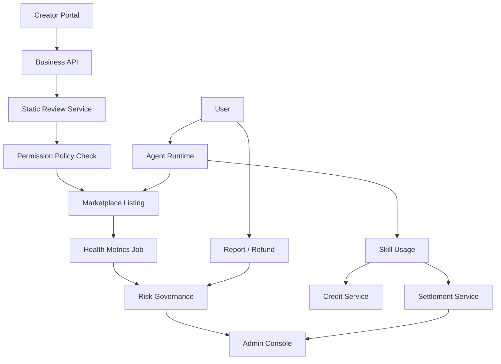
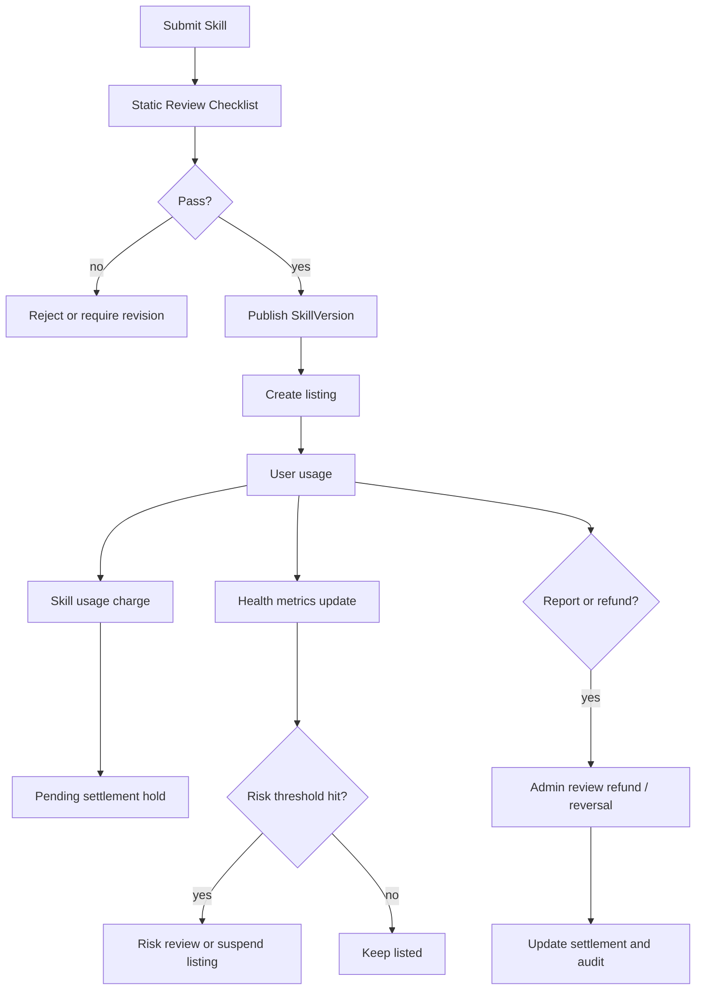

# 开放市场风控与数据隔离设计

状态：active  
owner：业务服务责任域 / 管理端责任域 / 安全与测试责任域  
更新时间：2026-07-01  
适用范围：开放 Skill 市场、创作者数据隔离、静态审核、风险熔断、举报退款、结算和管理端治理  
相关代码路径：`services/business/internal/application/skillmarketplace/**`、`services/business/internal/application/settlement/**`、`services/business/internal/application/credit/**`、`admin_frontend/src/features/skill-marketplace/**`、`services/agent/internal/infra/rpc/**`  
相关契约：`CreatorDataVisibilityPolicy.v1`、`SkillStaticReviewChecklist.v1`、`MarketplaceHealthPolicy.v1`、`SettlementPolicy.v1`、`SkillPermissionPolicy.v1`

## 0. 阶段目标与闭环

本专题用于冻结开放市场第一阶段的安全和治理边界。第一阶段不提供沙盒执行和创作者调试用户数据，因此必须通过静态审核、权限矩阵、数据隔离、风险指标和结算 hold period 保证市场可控。

闭环：

```text
创作者提交 Skill
  -> 静态审核清单
  -> 权限和数据隔离校验
  -> 上架后健康指标监控
  -> 风险熔断 / 举报 / 退款
  -> 结算 hold / reversal / freeze
  -> 管理端审计
```

## 1. 架构设计



服务边界：

1. Business 服务保存市场、审核、风控、结算和审计事实。
2. Agent 服务只读取 listing/pricing/permission/entitlement 摘要，保存 usage_id 引用。
3. 管理端只展示脱敏数据和聚合指标。
4. 创作者后台默认只展示聚合指标，不展示用户创作内容。

## 2. 技术实现细节

### 2.1 CreatorDataVisibilityPolicy.v1

```json
{
  "schema_version": "creator_data_visibility_policy.v1",
  "creator_can_view_user_inputs": false,
  "creator_can_view_uploaded_assets": false,
  "creator_can_view_creative_board_details": false,
  "creator_can_view_generated_assets": false,
  "creator_can_view_aggregated_metrics": true,
  "creator_can_view_income": true,
  "creator_can_view_ratings": true,
  "creator_can_view_reports": true,
  "creator_can_view_sanitized_error_summary": true,
  "debug_log_access": "not_available_in_first_phase"
}
```

数据展示边界：

| 数据 | 创作者可见 | 管理员可见 | 说明 |
| --- | --- | --- | --- |
| 用户原始输入 | 否 | 默认脱敏摘要 | 管理员查看全文需要高风险授权流程 |
| 上传资产 | 否 | 否 | 第一阶段不提供原图查看 |
| Creative Board 详情 | 否 | 默认摘要 | 用于争议处理时只显示结构化摘要 |
| 生成资产 | 否 | 摘要和 asset_id | 不展示完整私有素材 |
| 用量和收入 | 是 | 是 | 聚合维度 |
| 评分和举报 | 是 | 是 | 举报内容脱敏 |
| 错误日志 | 脱敏摘要 | 脱敏摘要 | 不展示 Prompt、供应商响应、密钥 |

### 2.2 SkillStaticReviewChecklist.v1

| 序号 | 检查项 | 自动/人工 | 失败结果 |
| --- | --- | --- | --- |
| 1 | manifest schema | 自动 | 拒绝提交 |
| 2 | runtime spec schema | 自动 | 拒绝提交 |
| 3 | graph template compile | 自动 | 拒绝提交 |
| 4 | tool binding permission | 自动 | 拒绝提交 |
| 5 | output_elements whitelist | 自动 | 拒绝提交 |
| 6 | prompt injection static scan | 自动 + 人工 | 风险审核 |
| 7 | 尝试覆盖系统规则 | 自动 + 人工 | 拒绝 |
| 8 | 尝试绕过确认 | 自动 + 人工 | 拒绝 |
| 9 | 夸大能力 | 人工 | 拒绝或要求修改 |
| 10 | 定价在平台上下限内 | 自动 | 拒绝提交 |
| 11 | 版权声明完整 | 人工 | 要求补充 |
| 12 | 安全声明完整 | 人工 | 要求补充 |
| 13 | Router 正负样例合理 | 人工 | 要求修改 |
| 14 | 与默认 Skill 高度重合但诱导付费 | 人工 | 拒绝或降权 |
| 15 | 未授权访问资产或企业数据 | 自动 + 人工 | 拒绝 |

审核结果必须写入 `skill_reviews.static_validation_result`，管理端详情用分组结果展示。

### 2.3 MarketplaceHealthPolicy.v1

```json
{
  "schema_version": "marketplace_health_policy.v1",
  "window_size": 100,
  "failure_rate_risk_threshold": 0.25,
  "refund_rate_risk_threshold": 0.15,
  "report_count_suspend_threshold": 5,
  "router_misselect_rate_threshold": 0.1,
  "tool_cost_anomaly_multiplier": 2.0,
  "safety_hit_rate_suspend_threshold": 0.2
}
```

自动处理：

| 指标 | 自动结果 | 人工动作 |
| --- | --- | --- |
| 最近 100 次失败率过高 | `review_status=risk_review` | 审核质量和 Tool 绑定 |
| 退款率过高 | 降权或暂停推荐 | 查看退款原因 |
| 举报超过阈值 | `listing_status=suspended` | 投诉处理 |
| Router 高置信误选率高 | 移出自动推荐 | 调整 routing examples |
| Tool 成本异常 | 限制生成积分上限 | 检查 Prompt 和 Tool 参数 |
| Prompt 安全命中率高 | 暂停 listing | 安全复审 |

### 2.4 SettlementPolicy.v1

```json
{
  "schema_version": "settlement_policy.v1",
  "platform_commission_rate": 0.3,
  "hold_period_days": 14,
  "refund_before_settlement": "deduct_from_pending",
  "refund_after_settlement": "deduct_from_future_balance",
  "violation_action": "freeze_pending_settlement",
  "enterprise_billing_owner": "enterprise_account",
  "points_cash_conversion": "platform_internal_policy"
}
```

结算规则：

1. Skill 使用费扣费后进入 pending settlement。
2. hold period 内发生退款，从 pending settlement 扣除。
3. 已结算后发生退款，从创作者未来余额抵扣。
4. listing 违规时冻结 pending settlement。
5. 企业空间使用市场 Skill 时，账单归属企业账户，创作者结算仍按 usage record 计算。

## 3. 用户旅程

### 3.1 创作者视角

1. 创建 Skill 并提交审核。
2. 查看静态审核结果和需要修复的风险项。
3. 审核通过并上架后，查看聚合使用量、收入、评分、举报和脱敏错误摘要。
4. listing 进入风险审核时，收到原因和整改建议。
5. 结算页查看 pending、eligible、settled、reversed、frozen 状态。

### 3.2 用户视角

1. 使用市场 Skill 前看到费用、交付阶段、退款规则和数据隔离说明。
2. 使用后可评分、收藏、举报或发起退款。
3. 退款处理时可看到当前状态和处理结果。

### 3.3 管理员视角

1. 审核详情查看静态审核清单、权限矩阵、价格、版权和安全声明。
2. 市场治理页查看 health_status、risk_score 和自动暂停原因。
3. 举报处理页查看脱敏 usage 摘要、ledger、交付阶段和审计记录。
4. 结算页处理 hold、退款 reversal、违规冻结和结算批次。

## 4. 用户交互

管理端页面：

| 页面 | 核心交互 |
| --- | --- |
| 审核详情 | 15 项静态审核结果、风险标签、通过/拒绝/要求修改 |
| 市场治理 | health_status、risk_score、暂停/恢复/下架、高风险确认 |
| 举报退款 | 脱敏 usage 摘要、处理意见、退款动作、审计提示 |
| 创作者结算 | pending、eligible、settled、reversed、frozen 分组 |
| 创作者分析 | 聚合用量、收入、评分、举报、脱敏错误摘要 |

用户端费用卡：

- 展示“创作者无法查看你的原始输入、上传素材、创作板详情和生成资产”。
- 展示 Skill 使用费扣费点和退款摘要。
- 展示 Tool 生成费按生成前预估、资产保存成功后扣费。

## 5. 业务设计

业务规则：

1. 静态审核失败不得上架。
2. 风险熔断只影响新用户和新 run，不修改已发布 SkillVersion。
3. 被 suspended 的 listing 不得进入 Router primary candidate。
4. 创作者不能通过分析、报错、评价或举报绕过数据隔离。
5. 所有退款、恢复、暂停、移除和结算 reversal 都必须写审计日志。
6. 结算状态与 listing 状态分离，违规可以冻结结算但不改写历史 usage。

P1 首期治理规则：

| 能力 | 规则 |
| --- | --- |
| 市场搜索排序 | 相关性、安装状态、评分、成功率、退款率、举报率、30 天使用量、价格、平台精选、企业授权和风险分共同参与排序 |
| 排序反作弊 | 异常评分、互刷、重复安装、退款诱导、低价引流高 Tool 成本必须降权或进入风险审核 |
| 退款仲裁 | 退款单独建 case，状态覆盖 `refund_requested`、`refund_reviewing`、`refund_approved`、`refund_rejected`、`refund_reversed`、`settlement_adjusted` |
| 数据留存删除 | Board、draft artifact、运行快照、审计日志分别配置留存期；删除项目后 Runtime 数据进入不可恢复删除或法务保留队列 |
| 数据导出 | 用户导出只包含自己的项目、资产引用、run 摘要和账务摘要；不导出创作者系统 Prompt 和平台策略 |
| 相似重复治理 | 高相似 Skill 降权；复制默认 Skill 不得收费；同创作者重复模板限制发布；企业私有 Skill 不得复制到公开市场后收费 |

## 6. 表设计

Business DB：

| 表 | 关键字段 | 说明 |
| --- | --- | --- |
| `skill_reviews` | `review_id`、`review_status`、`static_validation_result`、`risk_summary`、`reviewer_id` | 静态审核和人工审核 |
| `skill_permission_policies` | `asset_permission`、`tool_permission`、`credit_permission`、`runtime_permission`、`data_visibility` | 权限矩阵 |
| `skill_marketplace_listings` | `listing_status`、`health_status`、`risk_score`、`auto_suspended_reason`、`last_health_check_at` | listing 风控状态 |
| `skill_marketplace_health_metrics` | `listing_id`、`window_size`、`failure_rate`、`refund_rate`、`report_count`、`router_misselect_rate`、`safety_hit_rate` | 健康指标 |
| `skill_usage_records` | `usage_id`、`run_id`、`listing_id`、`skill_usage_digest`、`usage_status`、`value_delivered_stage`、`refund_status` | 使用和退款 |
| `skill_marketplace_search_metrics` | `listing_id`、`query_hash`、`rank_position`、`click_count`、`install_count`、`conversion_rate`、`abuse_score` | 搜索排序和反作弊 |
| `skill_reports` | `report_id`、`usage_id`、`reason`、`status`、`sanitized_summary` | 举报 |
| `skill_refund_cases` | `refund_case_id`、`usage_id`、`refund_status`、`review_result`、`settlement_adjustment_id`、`audit_log_id` | 退款仲裁 |
| `skill_similarity_reviews` | `review_id`、`source_skill_id`、`target_skill_id`、`similarity_score`、`decision`、`reviewer_id` | 相似和重复发布治理 |
| `skill_data_retention_jobs` | `job_id`、`scope_type`、`scope_id`、`retention_policy`、`delete_after`、`legal_hold`、`status` | 留存、删除和导出治理 |
| `skill_creator_settlements` | `settlement_id`、`usage_id`、`gross_points`、`platform_commission_points`、`hold_until`、`settlement_status` | 结算 |
| `skill_moderation_logs` | `action`、`before_status`、`after_status`、`operator_id`、`reason`、`trace_id` | 审计 |

Agent DB：

| 表 | 关键字段 | 说明 |
| --- | --- | --- |
| `agent_runs` | `run_id`、`skill_id`、`skill_version`、`skill_spec_digest`、`listing_id`、`skill_usage_id` | usage 追溯 |
| `agent_events` | `event_type`、`payload_json`、`dedupe_key` | 用户端状态 |

## 7. Prompt Schema 示例

```json
{
  "schema_version": "prompt_schema.v1",
  "prompt_id": "marketplace_static_risk_summary.v1",
  "purpose": "review_assistance",
  "inputs": {
    "runtime_spec": "SkillRuntimeSpec.v1",
    "permission_policy": "SkillPermissionPolicy.v1",
    "pricing_policy": "SkillPricingPolicy.v1",
    "router_examples": "array<string>",
    "copyright_statement": "string",
    "safety_statement": "string"
  },
  "output_schema": {
    "checklist_results": "array<SkillStaticReviewItemResult.v1>",
    "risk_summary": "string",
    "suggested_decision": "approve|reject|manual_review"
  },
  "policy": {
    "human_final_decision_required": true,
    "do_not_execute_skill": true,
    "do_not_reveal_system_rules": true
  }
}
```

## 8. Tool Schema 模板示例

```json
{
  "schema_version": "tool_schema_template.v1",
  "tool_id": "marketplace.health.evaluate",
  "tool_type": "business_workflow",
  "input_schema": {
    "listing_id": "string",
    "window_size": "integer",
    "health_policy": "MarketplaceHealthPolicy.v1"
  },
  "output_schema": {
    "health_status": "healthy|risk_review|auto_suspended",
    "risk_score": "number",
    "triggered_rules": "array<string>",
    "recommended_action": "none|demote|suspend|restrict_generation_points"
  },
  "runtime_policy": {
    "timeout_ms": 5000,
    "idempotency_required": true
  }
}
```

## 9. Skill Schema 示例

```json
{
  "schema_version": "skill_marketplace_listing.v1",
  "listing_id": "listing_123",
  "skill_id": "skill_market_city_tourism_video_pro",
  "skill_version": "1.0.0",
  "listing_status": "listed",
  "health_status": "healthy",
  "pricing_policy": {
    "skill_usage_points": 120,
    "value_delivered_stage": "storyboard_ready",
    "refund_policy": "not_delivered_release"
  },
  "data_visibility_policy_ref": "creator_data_visibility.default.v1",
  "settlement_policy_ref": "settlement_policy.default.v1"
}
```

## 10. 流程图



## 11. Eino 使用说明

- Eino Graph 只保存 `skill_usage_id`、`listing_id` 和 billing node 状态，不向创作者输出用户数据。
- Callback/Trace 不记录系统 Prompt、供应商原始响应、完整用户输入、上传资产内容和 Board 全量内容。
- 市场 Skill 风险处理发生在 Business 服务，Agent 通过 RPC 获取最新 listing 和 entitlement 摘要。

## 12. 开发细节

1. 先实现审核清单结果结构，再实现管理端审核详情。
2. 风险指标通过定时任务或事件汇总写入 `skill_marketplace_health_metrics`。
3. listing 自动暂停需要写 `auto_suspended_reason` 和 moderation log。
4. 退款和结算 reversal 必须走幂等键，避免重复退款。
5. 创作者分析接口只能查询聚合表或脱敏视图。

## 13. 开发注意事项

- 不提供创作者查看用户原文或素材的临时入口。
- 不把 listing 暂停实现为修改 SkillVersion。
- 不把失败率、退款率、举报数只做前端计算，必须落业务事实。
- 不允许人工审核绕过 schema、权限和价格硬校验。
- 不在日志中记录完整 Prompt、密钥或供应商原始响应。

## 14. 验收标准

- [ ] CreatorDataVisibilityPolicy 默认保护用户输入、上传资产、Board 和生成资产。
- [ ] 静态审核清单 15 项可记录、展示和阻断。
- [ ] 风控指标可触发 risk_review、降权或 listing suspended。
- [ ] listing suspended 不改变 SkillVersion 内容。
- [ ] 举报、退款、结算 reversal 和违规冻结有审计记录。
- [ ] 创作者分析只展示聚合指标和脱敏摘要。
- [ ] 用户端费用卡展示数据隔离和退款摘要。
- [ ] 市场搜索排序、反作弊、相似重复发布治理有指标、状态和人工处理入口。
- [ ] 数据留存、删除、导出和法务保留策略可配置、可审计。
