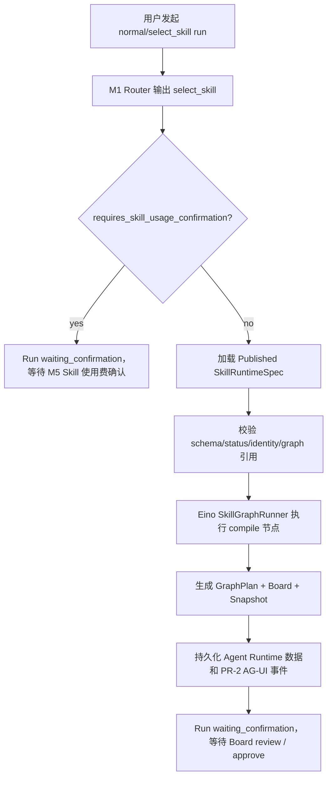

# M3 Skill Runtime Spec 与 Eino Graph Runtime 实现

状态：active
owner：Agent Runtime / 文档与契约责任域 / 测试与验收责任域
更新时间：2026-07-01
适用范围：Published Skill Runtime Spec 加载、静态校验、Eino Graph runner、GraphPlan / Board / Snapshot / AG-UI 事件生成，以及工作台 `select_skill` 到 Board review gate 的闭环
相关代码路径：`services/agent/internal/runtime/skillgraph/**`、`services/agent/internal/runtime/eino/skill_graph.go`、`services/agent/internal/application/workbench/app_run_routing.go`、`services/agent/internal/infra/repository/board_graph.go`
相关契约：`docs/active/contracts/pr-2-agent-runtime-contracts.md`、`api/schemas/graph/**`、`api/schemas/board/**`、`api/agui/events/graph.plan.created.schema.json`、`api/agui/events/board.snapshot.updated.schema.json`

## 目标

- `select_skill` 路由命中免费系统 Skill 时，加载 Business Gateway 返回的 Published `skill_runtime_spec.v1`。
- 在 Agent Runtime 内完成 spec schema、identity、published status、level、scope、graph node / edge / terminal 引用校验。
- 通过 Eino `compose.Graph` runner 执行 Skill Graph 编译节点，输出非 Generic 的 `GraphTemplate`、`GraphPlan`、`CreativeBoard`、`BoardSnapshot` 和 PR-2 AG-UI 事件。
- 工作台 run 停在 `waiting_confirmation`，等待 Board review / approve；M3 不执行 Tool、模型 provider、积分估算、积分冻结或资产提交。

## 非目标

- 不生成 ToolPlan，不展示 Tool 生成费确认。
- 不创建 SkillUsageRecord，不冻结或扣减 Skill 使用费。
- 不执行 Marketplace 付费 Skill Graph；`requires_skill_usage_confirmation=true` 的 run 仍停在 Skill 使用费确认门前，M5 接管后续。
- 不接真实模型 provider；当前 Graph 节点输出为确定性契约对象，真实生成链路进入 M4 / M6 gate。

## 业务闭环



## 实现说明

| 模块 | 说明 |
| --- | --- |
| `skillgraph.Runtime` | 解析 `skill_runtime_spec.v1`，构建 Skill 专属 `GraphTemplate` / `GraphPlan` / Board / Snapshot / AG-UI payload。 |
| `eino.SkillGraphRunner` | 使用 Eino `compose.Graph` 包装 Skill Graph compile 节点，保持 M2 / M3 运行入口一致。 |
| `App.startM3SkillRuntime` | 从 Business Gateway 加载 spec，执行 Eino runner，重排 AG-UI seq，写入 Board/Graph 状态。 |
| `Repository.SaveBoardGraphForWorkbenchRun` | 统一保存 Generic fallback 和 Published Skill Graph 的 Board/Graph 数据，并把 `skill_spec_digest` 写入 `runs.skill_selection`。 |
| `StaticGateway.GetPublishedSkillSpec` | 测试桩默认返回有效 `skill_runtime_spec.v1`，避免旧假数据污染 M3 测试。 |

## 开发注意事项

1. `skill_runtime_spec.v1` 必须匹配 Router 选择的 `skill_id` 和 catalog 版本，且 `status=published`。
2. `GraphTemplateID` 不得使用 `gtemplate_generic_creation`；Generic L0 fallback 只属于 `generic_creation` 路由。
3. `Board.ToolPlanAllowed=false`，Board approve 后才进入 M4 ToolPlan 估算和 Tool 生成费确认。
4. `skill_spec_digest` 必须持久化到 `runs.skill_selection`，供 M4/M5 后续 digest 绑定和审计追溯。
5. M3 只发布 `graph.plan.created` 与 `board.snapshot.updated`；不得发布 `cost_disclosure.*`、`credits.*` 或 `generation.*`。

## 验收口径

- [x] Published Skill spec 可以编译为 Skill GraphPlan，且 GraphPlan 不是 Generic fallback。
- [x] 非 published spec 会被拒绝。
- [x] spec 中未声明的 entry、terminal 或 edge node 会被拒绝。
- [x] 工作台 `select_skill` 免费系统 Skill 会加载 Published spec、生成 Board/Graph、停在 Board review gate。
- [x] M3 路径不调用模型、Tool、积分估算、积分冻结或资产提交 RPC。

## 本地验证记录

2026-07-01 已执行：

```bash
go test ./services/agent/internal/runtime/skillgraph ./services/agent/internal/runtime/eino ./services/agent/internal/application/workbench
go test ./services/agent/internal/runtime/skillgraph ./services/agent/internal/runtime/eino ./services/agent/internal/runtime/creation ./services/agent/internal/infra/repository ./services/agent/internal/api/http ./services/agent/internal/application/workbench
make active-contract-gate
make development-ci-gate
```

结果：

```text
ok github.com/FigoGoo/Dora-Agent/services/agent/internal/runtime/skillgraph
ok github.com/FigoGoo/Dora-Agent/services/agent/internal/runtime/eino
ok github.com/FigoGoo/Dora-Agent/services/agent/internal/application/workbench
ok github.com/FigoGoo/Dora-Agent/services/agent/internal/runtime/creation
ok github.com/FigoGoo/Dora-Agent/services/agent/internal/infra/repository
ok github.com/FigoGoo/Dora-Agent/services/agent/internal/api/http
active contract gate passed
development CI gate passed
```
