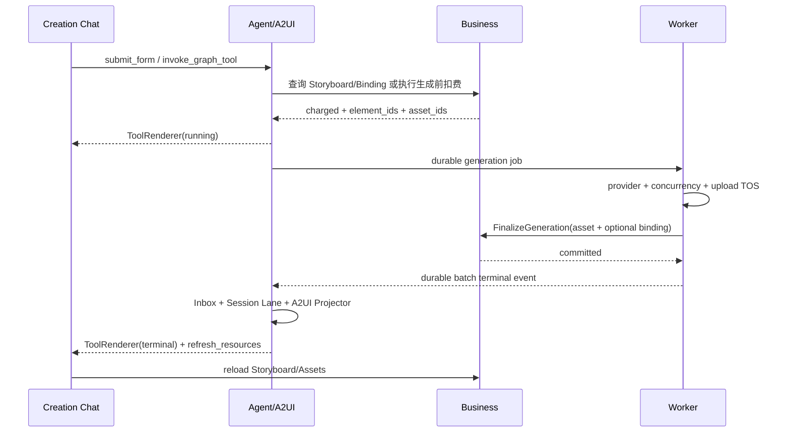

# AIGC A2UI 全栈详细设计

> 状态：Target Design
> 日期：2026-07-14
> 适用范围：用户端创作页聊天框中的服务端驱动交互卡片
> 关联文档：[AIGC ChatModelAgent 详细设计](./aigc-chatmodelagent-demo-design.md)、[AIGC Tool 与 Storyboard 详细设计](./aigc-tool-storyboard-design.md)、[AIGC Generation Worker 详细设计](./aigc-worker-design.md)

## 1. 目标与边界

A2UI 是 Agent 将对话、表单、审核、Tool 进度和生成状态投影到用户端创作页聊天框的协议。它解决“服务端决定展示什么交互、前端用受控组件渲染”的问题，但不承载业务真值。

强制边界：

1. A2UI 是投影协议，不是 Storyboard、Asset、积分、Operation、Batch 或 Job 的业务真源。
2. Agent 负责根据可信运行结果生成或投影 A2UI；Business 负责 Storyboard、Binding、Asset 和积分真值；Worker 不构造 A2UI。
3. 所有可交互组件以 `Card` 为基类。`Card` 自带 Markdown 文本展示能力；其他组件通过组合 Card 公共字段扩展，Go 和 React 实现不依赖语言级继承。
4. A2UI 主要出现在创作页聊天框。左侧 Storyboard、素材库和任务明细仍由 Business/Agent Read API 提供，聊天卡只展示摘要、必要交互和刷新指令。
5. 后端只发布白名单组件和白名单 Action；前端不执行服务端下发的 JavaScript、任意 URL、HTML 或动态模块路径。
6. 协议整包严格校验。未知版本、未知 Action、非法组件树或非法属性不得部分执行。

## 2. 所有权

| 对象 | 唯一所有者 | A2UI 的关系 |
| --- | --- | --- |
| Storyboard、Element、Asset、Binding | Business | A2UI 只保存稳定 ID、摘要和查询入口 |
| 积分账户、扣费流水 | Business | A2UI 只展示脱敏后的扣费结果和汇总 |
| Session、Run、Turn、Graph、Operation、Batch、Job | Agent | Agent 将状态投影为 Tool/Status Card |
| Provider 执行、上传 TOS、生成重试 | Worker | Worker 只发领域事件，不直接写 A2UI |
| A2UI EventLog、Action Receipt、Projection Cursor | Agent | 聊天框可恢复投影的持久化真源 |
| 组件实现与注册表 | Frontend | 只渲染协议允许的组件和动作 |

## 3. 组件模型

### 3.1 Card 基类

所有组件共享以下 Card 能力：

```go
type Card struct {
    ID              string            `json:"id"`
    ComponentType   string            `json:"component_type"`
    ComponentVersion string           `json:"component_version"`
    Markdown        string            `json:"markdown,omitempty"`
    Title           string            `json:"title,omitempty"`
    Status          string            `json:"status,omitempty"`
    Disabled        bool              `json:"disabled,omitempty"`
    Visible         bool              `json:"visible"`
    Data            map[string]string `json:"data,omitempty"`
    Children        []Component       `json:"children,omitempty"`
}
```

具体组件通过嵌入/组合 Card 公共字段实现，不使用一套与 Card 平行的重复元数据。例如：

```go
type SingleChoice struct {
    Card
    Name     string         `json:"name"`
    Options  []ChoiceOption `json:"options"`
    Required bool           `json:"required"`
}
```

```typescript
type SingleChoiceProps = CardProps & {
    name: string;
    options: ChoiceOption[];
    required: boolean;
};
```

后端 `Component` 接口统一暴露 `BaseCard()`、`Validate()` 和稳定类型标识；前端所有 Props 都与 `CardProps` 取交集。这样新增组件仍自动继承 Markdown、状态、可见性、版本和子树约束。

约束：

- `ID` 在同一 Session 中稳定，更新同一卡片时不得换 ID。
- `Markdown` 支持 CommonMark 子集；渲染前必须清洗，不支持原始 HTML、脚本、iframe、事件属性或危险协议链接。
- `Data` 只允许字符串标量和公开 ID，不存放密钥、Provider 原始请求、签名 URL、内部 Binding Token 或完整错误堆栈。
- `Children` 有最大深度、最大数量和总 payload 大小限制，禁止递归环。
- `Status` 使用统一枚举：`idle`、`waiting_user`、`running`、`succeeded`、`partial_failed`、`failed`、`cancelled`、`stale`、`unsupported`。

### 3.2 组件清单

| 组件 | 用途 | 关键属性 | 是否提交值 |
| --- | --- | --- | --- |
| `Card` | Markdown、标题、容器和通用状态 | `markdown`、`children` | 否 |
| `SingleChoice` | 单选 | `name`、`options`、`required` | 是 |
| `MultiChoice` | 多选 | `name`、`options`、`min/max` | 是 |
| `SubmitButton` | 提交当前 Card 的表单或命令 | `action_id`、`label`、`confirm` | 触发提交 |
| `TextInput` | 单行输入 | `name`、`min/max_length`、`pattern` | 是 |
| `TextArea` | 多行输入 | `name`、`min/max_length` | 是 |
| `NumberInput` | 数值输入 | `name`、`min/max/step` | 是 |
| `DateTimeInput` | 日期、时间或区间输入 | `name`、`mode`、`min/max`、`timezone` | 是 |
| `SliderInput` | 有界数值或区间选择 | `name`、`min/max/step` | 是 |
| `Toggle` | 布尔选择 | `name`、`on/off_label` | 是 |
| `FileUpload` | 上传用户素材 | `accept`、`max_files`、`max_bytes` | 只提交上传后的 Business Asset ID |
| `AssetPicker` | 从用户资产库选择已有素材 | `media_types`、`min/max`、`project_scope` | 是 |
| `ImageGallery` | 多图片展示 | `asset_ids`、`layout`、`selectable` | 可选 |
| `VideoGallery` | 多视频展示 | `asset_ids`、`poster_asset_ids` | 可选 |
| `AudioGallery` | 多音频展示 | `asset_ids`、`preload=metadata` | 可选 |
| `VerticalSteps` | 纵向步骤条 | `steps[]`、`current_step` | 否 |
| `ProgressBar` | 有界进度展示 | `value`、`max`、`label` | 否 |
| `ToolRenderer` | Graph Tool 的高层状态与操作 | `tool_key`、`operation_id`、`summary` | 可触发白名单控制命令 |
| `StatusRenderer` | 通用运行、成功、错误和空状态 | `code`、`message`、`retryable` | 可选 |
| `ActionButton` | 触发单个白名单动作 | `action_id`、`label`、`confirm` | 触发动作 |
| `FormCard` | 多输入组件的业务组合 | `schema_id`、`children` | 是 |
| `ApprovalCard` | 审核 Spec/Storyboard/高风险动作 | `approval_id`、`decision_version` | 是 |

上述组件是首期协议基线。新增组件必须同时增加后端结构、验证器、前端注册、降级渲染、测试和协议兼容说明，不能只在 JSON 中临时发明新 `component_type`。

### 3.3 组合而非任意嵌套

允许的典型组合：

```text
Card
├── Markdown
├── VerticalSteps
├── ImageGallery
├── SingleChoice
└── SubmitButton
```

后端注册表定义每种父组件允许的子类型。例如 `SubmitButton` 不允许子组件，媒体 Gallery 不允许嵌套表单，`ApprovalCard` 只能包含审核说明、单选决定和一个提交按钮。

## 4. 协议

### 4.1 Envelope

```json
{
  "a2ui_version": "1.0",
  "event_id": "evt_01...",
  "session_id": "ses_01...",
  "seq": 1024,
  "action": "append_card",
  "card": {
    "id": "tool:generate_media:op_01...",
    "component_type": "ToolRenderer",
    "component_version": "1.0",
    "markdown": "正在生成 6 个镜头素材。",
    "status": "running",
    "visible": true,
    "data": {
      "tool_key": "generate_media",
      "operation_id": "op_01..."
    },
    "children": []
  }
}
```

Envelope 规则：

1. `event_id` 全局唯一，重复投递必须得到相同内容。
2. `seq` 在 Session 内严格单调，由持久化 EventLog 分配。
3. 首期只支持 `append_card`、`update_card`、`remove_card`、`refresh_resources` 和 `resolve_interaction`。
4. `update_card` 必须携带 `base_card_version` 和递增 `card_version`；版本不连续时前端回源历史或快照 API。
5. `remove_card` 仅隐藏投影，不删除 EventLog 或业务记录。

### 4.2 Action

```go
type UIAction struct {
    ActionID        string          `json:"action_id"`
    ActionType      string          `json:"action_type"`
    TargetID        string          `json:"target_id"`
    ExpectedVersion int64           `json:"expected_version"`
    IdempotencyKey  string          `json:"idempotency_key"`
    PayloadSchema   string          `json:"payload_schema"`
    Payload         json.RawMessage `json:"payload"`
}
```

白名单 Action：

| Action | 处理方 | 用途 |
| --- | --- | --- |
| `submit_form` | Agent API | 提交普通对话表单，形成新的 UserMessage/结构化输入 |
| `decide_approval` | Agent/Business Command Adapter | 按冻结版本批准或拒绝 |
| `invoke_graph_tool` | Agent | 调用允许从 UI 显式触发的高层 Graph Tool |
| `control_operation` | Agent | 取消 Operation 或重试可恢复失败 |
| `refresh_resources` | Frontend | 刷新 Storyboard、Asset、Job Read API |
| `select_assets` | Business | 提交用户已选的 Business Asset ID |

不支持任意 HTTP method、任意 URL、任意 Graph Node、任意 Tool 名称、任意命令文本或脚本。`action_id + idempotency_key` 必须 first-write-wins；同键不同 payload 返回冲突。

### 4.3 服务端校验

服务端按以下顺序 fail closed：

1. 校验 A2UI 协议版本和 Envelope 大小。
2. 校验 Action、Card、组件类型和版本均已注册。
3. 校验组件树深度、数量、父子关系和字段约束。
4. 清洗 Markdown，拒绝危险链接和 HTML。
5. 校验 Asset ID 属于当前用户/项目且类型匹配；不得信任客户端 URL。
6. 校验交互 Action 的权限、目标版本、状态机和幂等键。
7. Agent 本地事务写 Action Receipt 和 Durable SessionInput/Outbox；涉及 Business 的命令由 Business 本地事务写领域结果与幂等 Receipt。跨 Module 通过稳定键、Outbox/Inbox 恢复，不假设分布式事务，再异步投影结果。

### 4.4 前端降级

- 未知 `a2ui_version`：整包拒绝并展示本地固定错误提示。
- 已知 Envelope、未知组件：渲染不可交互的 `unsupported` Card，保留安全 Markdown 摘要，不执行子动作。
- 卡片更新出现版本缺口：暂停该卡更新并按 `card_id` 回源。
- Action 提交超时：用原幂等键查询 receipt，不能直接生成新键重复提交。
- 媒体临时 URL 过期：按 Asset ID 重新请求 Business 签名 URL。

## 5. 后端设计

### 5.1 包目录

```text
agent/internal/a2ui/
├── protocol/       # Envelope、版本和 JSON codec
├── component/      # Card 及所有内置组件
├── action/         # Action 类型、receipt 和 command adapter
├── registry/       # 组件/Action 注册表
├── validator/      # schema、树、Markdown、权限前置校验
├── projector/      # 领域事件到 Card 的确定性投影
├── publisher/      # EventLog append-once 与 SSE 通知
└── testkit/        # golden、非法 payload 和兼容性夹具
```

目录属于 Agent Module，不得导入 Business 或 Worker 的 `internal` 包。跨 Module 只使用已发布 RPC/DTO/Event 契约。

### 5.2 投影链路

```text
Agent/Business/Worker Domain Event
→ Agent Inbox（按 source + event_id 去重）
→ A2UI Projector（纯确定性映射）
→ SessionEventLog AppendOnce
→ 事务后 SSE wake-up
→ Frontend reducer
```

Projector 失败不回滚已完成的业务操作；Inbox 保持可重试状态。重试必须生成同一个稳定 `event_id/card_id/card_version`，不得重复追加语义相同的卡片。

### 5.3 生成任务投影

`generate_media` 首次被接受时创建一张稳定 `ToolRenderer`：

- Card ID：`tool:generate_media:<operation_id>`。
- `running`：展示已接受数量、前置扣费积分和 Operation ID 摘要。
- `succeeded`：展示成功/失败数量和本次实际已扣积分，不在聊天内复制全部素材。
- `partial_failed/failed/cancelled`：展示可恢复错误摘要和允许的取消/重试动作。
- 终态附加 `refresh_resources`，让前端刷新 Business Storyboard/Asset 和 Agent Job Read API。

Worker 不更新 Card。Worker 的 Batch 终态事件进入 Agent Inbox 后，由 Agent Projector 更新同一张 Card。

## 6. 前端设计

### 6.1 包目录

```text
frontend/src/features/aigc/a2ui/
├── protocol/       # Envelope/组件解析、版本协商
├── registry/       # component_type 到 React renderer
├── renderer/       # 递归渲染、Error Boundary、降级卡
├── components/
│   ├── card/
│   ├── input/
│   ├── media/
│   ├── progress/
│   ├── tool/
│   └── status/
├── actions/        # 白名单提交器和 receipt 查询
├── hooks/          # SSE、历史回放、卡片回源
├── state/          # seq/card_version reducer
└── tests/          # contract、a11y、XSS、回放测试
```

现有 `a2uiProtocol.js` 应迁移到上述独立目录；迁移期间保留兼容导出，完成调用方切换后再移除旧入口。

### 6.2 前端责任

1. 组件只通过 Registry 渲染，不使用动态 `eval` 或服务端模块路径。
2. 所有输入状态以 `card_id + component_id` 隔离；收到终态更新后禁用重复提交。
3. `SubmitButton` 汇总同 Card 下可提交组件，先执行本地 schema 校验，再提交一次 Action。
4. Gallery 只接收 Asset ID；URL、poster、时长、MIME 由 Business Asset API 返回。
5. SSE 实时事件和历史回放必须进入同一 reducer，按 `seq` 和 `card_version` 去重。
6. 每个交互组件支持键盘、焦点、屏幕阅读器标签、禁用态和错误说明。

## 7. 与 Agent、Business、Worker 的交互



`W-->>AG` 表示通过 Outbox/消息基础设施进行持久化投递，不是 Worker 进程直接调用 ChatModelAgent。

## 8. 安全与隐私

1. Markdown 使用 allowlist sanitizer，外链统一增加安全属性；默认禁用图片 data URI。
2. A2UI 不下发 TOS 永久地址、Provider token、模型原始 response、内部 RPC 地址或堆栈。
3. 输入组件限制长度、文件类型/大小和提交频率；服务端再次校验，不能只依赖前端。
4. 所有 Action 绑定当前用户、项目、Session、Card 和 expected version，防止跨会话重放。
5. 错误 Card 使用公开错误码和可操作说明；内部错误写日志并通过 trace ID 关联。
6. 卡片内容、输入和媒体展示遵循内容安全、审计、删除与数据保留策略。

## 9. 非功能要求

| 指标 | 目标 |
| --- | --- |
| EventLog 写入成功率 | 月度不低于 99.99% |
| 已提交事件到 SSE 可见延迟 | P95 ≤ 1 秒，P99 ≤ 3 秒 |
| 历史回放 1,000 条事件 | P95 ≤ 2 秒 |
| 单个 Envelope | 默认 ≤ 256 KiB |
| 单 Card 组件树 | 深度 ≤ 8，组件数 ≤ 100 |
| Action API | P95 ≤ 500 ms（不含异步生成） |
| 可恢复性 | 进程重启后按 EventLog/Inbox 继续，不丢已提交交互 |
| 可访问性 | 关键交互满足 WCAG 2.1 AA |

## 10. 可执行验收用例

1. 给定只含 Markdown 的 Card，前端正确展示；注入 `script`、事件属性、危险协议链接时被清洗或整包拒绝。
2. 给定单选、多选、文本/日期/数值/滑块/开关输入、AssetPicker 和提交按钮，缺失 required 值或超出约束时不提交；填写正确后只产生一个 Action Receipt。
3. 同一 `idempotency_key` 重复提交相同 payload，返回第一次结果；改变 payload 返回 409 conflict。
4. 多图片、视频、音频组件只携带 Asset ID；越权或 MIME 不匹配的 Asset 被服务端拒绝。
5. 纵向步骤条收到乱序旧版本事件时不回退；出现版本缺口时触发单卡回源。
6. Graph Tool 被接受后出现一张 `running` Tool Card；Batch 终态事件重复投递十次仍只更新同一张卡一次。
7. Worker/Agent 任一进程在终态投递窗口崩溃，重启后 Inbox/Outbox 可恢复并最终更新 Card。
8. 未知组件不执行任何 Action，前端显示安全的 `unsupported` Card；未知协议版本整包拒绝。
9. SSE 断线后以最后 `seq` 重连，历史和实时事件不重复、不乱序、不丢失。
10. 生成成功后聊天卡发出 `refresh_resources`，左侧 Storyboard/Asset 从 Business Read API 读取到最新绑定。
11. 键盘可完成选择、输入和提交，焦点顺序正确，错误信息可被屏幕阅读器读取。
12. 256 KiB、深度 8、组件 100 的边界 payload 可处理；任一超限 payload 被明确拒绝且不写部分事件。

## 11. 实施顺序

1. 固化协议、Card 基类、组件/Action Registry 和 JSON contract tests。
2. 建立 Agent `internal/a2ui` 独立包与 EventLog/Inbox Projector。
3. 迁移前端协议到独立 `a2ui/` 目录，完成 Card、输入、媒体、步骤、Tool、Status 组件。
4. 将现有聊天、Approval 和 Generation ToolRun 切换到统一 Projector。
5. 接入 Business Asset 签名 URL/Storyboard Read API 与生成终态 `refresh_resources`。
6. 完成 XSS、越权、幂等、回放、可访问性、故障恢复和性能验收后，再允许增加新组件。
