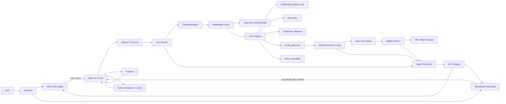
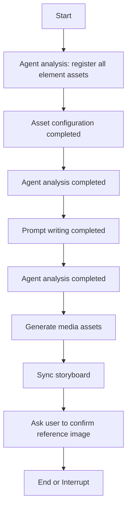

# AIGC ChatModelAgent Demo 详细设计

本文档描述 Dora-Agent 中 AIGC 创作智能体 Demo 的终版设计。设计目标是用 Eino ADK 的 `ChatModelAgent` 作为创作决策中枢，用 Eino Component 注册模型与工具，用 Eino Compose Graph 承载媒体生成等阶段性业务流程，并通过 A2UI 协议把 Agent 事件流渲染到前端。

## 1. 设计目标

1. 支持持续多轮创作：用户可以在任意阶段继续补充需求、修改故事板、替换素材、确认或否决生成结果。
2. `ChatModelAgent` 是运行时决策中心：结合当前上下文、Skill planner、故事板状态、工具描述和历史记忆，自主决定回复用户、调用工具、触发确认或继续生成。
3. DeepSeek LLM 作为模型中枢，优先使用 `agenticdeepseek` + `*schema.AgenticMessage`，便于后续承载图片、音频、视频、文件等多模态内容。
4. 使用事件流返回：后端基于 Eino Runner 读取 Agent event stream，再转换为 SSE/A2UI 消息推送到前端。
5. 前端左右分离：左侧是故事板，右侧是聊天窗口。故事板通过结构化事件独立更新，聊天窗口通过 A2UI 渲染对话、卡片、确认请求和进度。
6. Skill 从数据库读取：Skill 只描述创作能力、流程规划和要使用的 tool key。工具说明、参数 schema 和执行逻辑在 Tool Registry 中注册。
7. 关键阶段使用 Interrupt/Resume：规范确认、故事板确认、元素资产确认、关键帧确认、镜头视频确认、音频确认、最终导出确认都可以暂停并等待用户。
8. 对话、创作状态、故事板、媒体资产、异步任务、checkpoint 和 memory 全部持久化。

## 2. Eino 模块 - 业务作用

| Eino 模块 | 业务作用 |
| --- | --- |
| `adk.ChatModelAgent` | AIGC 创作智能体大脑。负责理解用户多轮意图、读取 Skill planner、选择工具、解释结果、提出确认问题。 |
| `adk.Runner` | Agent 执行入口。负责流式事件输出、checkpoint 管理、interrupt/resume 入口。生产调用不直接执行 `agent.Run()`。 |
| `adk.TurnLoop` | 会话级多轮运行时。负责同一 session 内用户输入排队、打断、空闲退出和生命周期管理。 |
| `adk.Middleware` | Agent 能力增强层。包括 tool 异常封装、PatchToolCalls、Skill、Summarization、Reduction、ToolSearch、上下文注入和观测。 |
| `component model.AgenticModel` | DeepSeek 模型适配层。Demo 使用 `agenticdeepseek`，模型 key 后续由配置或密钥服务提供。 |
| `component tool.BaseTool` | 模型可调用工具。所有工具通过 `ToolInfo` 暴露名称、说明和参数 schema。 |
| `compose.Graph` | 复杂业务流程编排。主要用于 `media_generator` 内部的素材生成、状态同步、确认中断等阶段。 |
| `compose.CheckPointStore` | Graph/Runner 的中断恢复存储。Demo 可用 Redis 或 DB-backed store。 |
| `schema.AgenticMessage` | 多模态消息结构。承载文本、工具调用、工具结果、图片、音频、视频和文件引用。 |
| `callbacks.Handler` | 观测与审计。记录模型、工具、Graph 节点、耗时、token、错误和 trace_id。 |
| A2UI Adapter | 业务层协议适配器，不是 Eino Tool。负责把 Runner/Graph 事件转换成前端可渲染的 SSE JSONL。 |

## 3. 总体架构



核心边界：

1. `ChatModelAgent` 负责「下一步该做什么」。
2. Skill planner 负责提供「当前创作能力的流程语义和依赖关系」。
3. Tool Registry 负责提供「能调用什么工具、工具如何入参、工具返回什么」。
4. Compose Graph 只承载工具内部明确有依赖的业务流程，例如媒体生成，不承载整段对话决策。
5. A2UI 只负责 UI 协议渲染，不参与工具选择，也不作为模型可调用 tool。

## 4. 运行时流转

### 4.1 普通用户消息

1. 前端右侧聊天框发送用户消息，或左侧故事板发送编辑事件。
2. API 写入 `messages`、`storyboard_edit_events`，加载当前 session 状态。
3. Session TurnLoop 将输入转成 `*schema.AgenticMessage`。
4. Runner 以 `EnableStreaming=true` 执行 ChatModelAgent，并带入：
   - `session_id`
   - `skill_id`
   - `current_stage`
   - `FinalVideoSpec` 最新版本摘要
   - `Storyboard` 最新版本摘要
   - 已绑定资产与生成任务状态
   - memory summary
   - pending interrupt/checkpoint
5. ChatModelAgent 根据上下文决定直接回复、调用工具、触发确认或继续阶段。
6. Runner 事件进入 Event Bus。
7. A2UI Adapter 将事件转换为聊天消息、进度卡片、故事板 patch、确认请求。
8. API 持续以 SSE 返回给前端。

#### 4.1.1 消息历史重建规则

多轮会话能否稳定运行，取决于每一轮是否能从持久化记录重建出合法的 `*schema.AgenticMessage` 链。Demo 必须实现 `MessageRebuilder`：

```go
type MessageRecord struct {
    ID              string
    SessionID       string
    RunID           string
    Role            string
    Content         string
    ContentBlocks   []byte
    ToolCallID      string
    ToolName        string
    ParentMessageID string
    Seq             int64
    CreatedAt       time.Time
}

type MessageRebuilder interface {
    BuildAgenticMessages(ctx context.Context, sessionID string, limit MessageWindow) ([]*schema.AgenticMessage, error)
    AppendFromAgentEvent(ctx context.Context, sessionID string, event *adk.TypedAgentEvent[*schema.AgenticMessage]) error
}
```

重建约束：

1. 按 `seq` 严格排序，保证 user/assistant/tool 的相对顺序不变。
2. assistant tool call 必须保留 `tool_call_id`、`tool_name`、arguments。
3. tool result 必须引用原始 `tool_call_id`。
4. 中断、取消或异常导致缺失 tool result 时，先由 `PatchToolCallsMiddleware` 补齐占位结果，再进入模型。
5. 大型内容不直接重建进消息，只放摘要和 `artifact_id`。
6. 被 summarization 压缩的历史以 summary message 加最近窗口消息的方式重建。
7. 事件流中的 streaming chunk 只用于前端展示，落库时必须合并成完整 message 或完整 tool result。

### 4.2 Interrupt/Resume

关键阶段需要用户确认时，工具或 Graph 节点调用 `compose.Interrupt(ctx, info)`，Runner 事件中出现 `Action.Interrupted`。

后端处理：

1. 保存 `checkpoint_id`、`interrupt_id`、`stage_key`、`artifact_version`。
2. 向前端发送 A2UI `InterruptRequest`。
3. 前端渲染确认卡片，也允许用户修改故事板、提示词或资产绑定。
4. 用户确认后调用 resume API。
5. 后端执行 `runner.ResumeWithParams(ctx, checkpointID, ResumeParams{Targets: map[interruptID]payload})`。
6. Agent/Graph 从 checkpoint 继续执行。

#### 4.2.1 Checkpoint 映射

Runner 与 Graph 都可能产生 checkpoint。必须通过 `checkpoints` 表建立统一映射，避免用户确认后恢复到错误节点。

```go
type CheckpointMapping struct {
    ID                 string
    SessionID          string
    RunID              string
    Scope              string // runner, tool_graph
    ToolCallID         string
    ToolKey            string
    GraphName          string
    NodePath           string
    RunnerCheckpointID string
    GraphCheckpointID  string
    InterruptID        string
    StageKey           string
    SpecVersion        int
    StoryboardVersion  int
    Status             string // pending, resumed, cancelled, expired
}
```

恢复规则：

1. 用户侧只传业务 `checkpoint_id` 和 `interrupt_id`，不暴露底层 Runner/Graph key。
2. 如果 interrupt 来自普通 tool，使用 Runner `ResumeWithParams`。
3. 如果 interrupt 来自 `media_generator` 内部 Graph，先恢复 Runner，再由 tool 内部根据 `GraphCheckpointID` 和 `NodePath` 恢复 Graph。
4. Resume payload 必须包含用户确认时看到的 `spec_version` 和 `storyboard_version`，版本不一致时先生成冲突提示，不直接恢复。
5. 每个 interrupt 只能成功 resume 一次；重复提交返回同一个 resume result 或幂等确认结果。

### 4.3 多轮修改

多轮对话不是一次性 workflow。每一轮都把当前创作状态重新注入 ChatModelAgent：

1. 用户说「把苏寂改得更苍老，竹林色调再冷一点」。
2. Agent 看到当前 `FinalVideoSpec`、`storyboard.key_elements`、`shots`、资产引用和 Skill planner。
3. Agent 可选择调用：
   - `text_editor` 修改 Final Video Spec 中视觉风格。
   - `storyboard_designer` 修改角色和镜头说明。
   - `media_generator` 标记受影响素材重新生成。
4. 工具返回结构化 diff。
5. 故事板左侧同步更新，并在需要时中断等待用户确认。

### 4.4 异步 Job 回流

媒体生成通常超过一次 Agent run 的生命周期。`media_generator` 创建长任务后，不应让 Agent 阻塞等待所有结果；它需要把任务转后台，并在 job 完成后把结果重新推回同一 session 的 TurnLoop。

```go
type JobWakeupEvent struct {
    SessionID         string
    JobID             string
    ToolCallID        string
    StageKey          string
    Status            string
    AssetIDs          []string
    ErrorCode         string
    StoryboardVersion int
}
```

回流规则：

1. Worker 完成任务后写入 `assets`、`generation_jobs`、`storyboard_events`。
2. Worker 发送 `job.status` 和 `storyboard.patch`，前端可立即更新左侧故事板。
3. 如果 job 完成满足下一阶段依赖，SessionRuntime 将 `JobWakeupEvent` 推入 TurnLoop。
4. ChatModelAgent 在下一轮看到 job 结果，决定继续生成、请求用户确认、重试失败任务或进入剪辑。
5. 重复 job 回调按 `job_id + status_version` 幂等处理。

## 5. Middleware 设计

Middleware 是 Demo 的核心稳定性层。它们都挂到 `ChatModelAgentConfig.Handlers` 上，并尽量只做横切能力，不承载业务路由。

### 5.1 推荐链路顺序

```go
Handlers: []adk.TypedChatModelAgentMiddleware[*schema.AgenticMessage]{
    patchToolCallsMW,
    toolExceptionMW,
    skillMW,
    reductionMW,
    summarizationMW,
    contextInjectionMW,
    toolSearchMW,
    observabilityMW,
}
```

说明：

1. `patchToolCallsMW` 放最前，修复 interrupt、cancel 或异常导致的 dangling tool calls。
2. `toolExceptionMW` 包装所有 tool 调用，把工具异常规范化为可持久化、可展示、可重试的结果。
3. `skillMW` 负责 DB-backed Skill 发现和加载，让模型看到可用 Skill 的 name/description，并在需要时加载完整 planner。
4. `reductionMW` 处理大工具结果，避免图片分析、PDF 分析、长剧本、视频任务日志撑爆上下文。
5. `summarizationMW` 压缩长对话，保留最近关键用户消息和已确认创作约束。
6. `contextInjectionMW` 在压缩之后注入当前 session 的瞬态业务状态，不让过期状态进入 memory。
7. `toolSearchMW` 在工具库很大时启用，按 Skill 和当前阶段动态暴露工具。
8. `observabilityMW` 或 callback handler 记录 trace、耗时、token、错误和事件。

### 5.2 ToolExceptionMiddleware

职责：

1. 覆盖 `WrapInvokableToolCall`、`WrapStreamableToolCall`、`WrapEnhancedInvokableToolCall`、`WrapEnhancedStreamableToolCall`。
2. 捕获 provider 错误、参数错误、业务校验错误、超时、panic。
3. 返回统一 JSON envelope，避免单个工具错误直接破坏整条创作会话。
4. 通过 `adk.SendEvent` 发送 `tool.error` custom event，用于 A2UI 右侧错误卡片和后台审计。
5. 对不可恢复错误仍返回 error，让 Runner 终止并暴露系统异常。

错误结构：

```go
type ToolErrorEnvelope struct {
    ToolKey           string `json:"tool_key"`
    Code              string `json:"code"`
    UserMessage       string `json:"user_message"`
    TechnicalMessage  string `json:"technical_message,omitempty"`
    Retryable         bool   `json:"retryable"`
    SuggestedAction   string `json:"suggested_action,omitempty"`
    Provider          string `json:"provider,omitempty"`
    ProviderRequestID string `json:"provider_request_id,omitempty"`
    TraceID           string `json:"trace_id"`
}
```

错误分类：

| 类型 | 示例 | Agent 看到的处理建议 |
| --- | --- | --- |
| `validation_error` | 缺少镜头 ID、参数类型错误 | 重新组织参数后再次调用工具。 |
| `asset_not_found` | 引用资产不存在 | 询问用户上传或调用生成工具补齐。 |
| `provider_rate_limit` | 图片/视频供应商限流 | 告知用户稍后重试，或切换模型偏好。 |
| `provider_failed` | 生成失败、内容被拒 | 调整提示词或请求用户确认替代方案。 |
| `timeout` | 视频任务长时间无结果 | 将任务转后台并继续轮询或提示用户稍后查看。 |
| `fatal` | 数据损坏、checkpoint 不可恢复 | 终止当前 run，要求人工介入。 |

### 5.3 Skill Middleware

内置 Skill Middleware 面向文件系统 progressive disclosure。Demo 需要做 DB-backed 适配：

```go
type SkillStore interface {
    ListEnabledSkills(ctx context.Context, userID string) ([]SkillSummary, error)
    GetSkillContent(ctx context.Context, skillID string) (*SkillDocument, error)
}
```

Skill 解析规则：

1. 必须解析 `<name>`、`<description>`、`<planner>`。
2. planner 中使用 `** tool-key **` 引用工具。
3. 其他标签只作为补充说明，不作为工具 schema 或入参定义。
4. 入参由模型基于 ToolInfo、当前上下文和用户意图决定。
5. 解析后校验 tool key 是否存在于 Tool Registry。

结构化结果：

```go
type SkillPlan struct {
    SkillID     string
    Name        string
    Description string
    Stages      []SkillStage
}

type SkillStage struct {
    Key         string
    Title       string
    Goal        string
    ToolKeys    []string
    DependsOn   []string
    PauseAfter  bool
    Instruction string
}
```

`SkillPlan` 是 Agent 上下文，不是固定执行器。它帮助 ChatModelAgent 判断阶段、依赖、暂停点和推荐工具。

### 5.4 Summarization Middleware

Summarization 负责压缩长对话，但需要保留创作关键事实：

1. 已确认的 Final Video Spec 字段。
2. 用户明确锁定的视觉风格、模型偏好、角色设定。
3. 最近 N 轮用户修改意见。
4. 当前故事板版本号和待确认项。
5. 未完成 job 和 pending interrupt。

摘要写入 `memories`，并在下一轮通过 `contextInjectionMW` 注入。

### 5.5 Reduction Middleware

Reduction 负责处理大型工具结果：

1. PDF/文本/图片分析原文保存到对象存储或 DB，模型上下文只保留摘要和引用。
2. 大型工具结果截断后，保留 `artifact_uri`、`full_result_id`、`summary`。
3. 视频生成日志、音频波形、关键帧列表不直接塞入上下文。
4. 对故事板只注入 compact view，不注入完整历史版本。

### 5.6 ContextInjectionMiddleware

自定义上下文注入层。每次模型调用前读取 session 状态并注入稳定结构：

```json
{
  "session_id": "sess_xxx",
  "skill": {
    "name": "武侠短片创作",
    "current_stage": "storyboard_review",
    "available_tool_keys": ["text_editor", "storyboard_designer", "media_generator"]
  },
  "final_video_spec": {
    "version": 3,
    "locked_fields": ["aspect_ratio", "visual_style", "model_preference"]
  },
  "storyboard": {
    "version": 8,
    "key_elements_count": 5,
    "shots_count": 12,
    "pending_confirmations": ["element_ref_suji"]
  },
  "assets": {
    "ready": 6,
    "generating": 3,
    "failed": 1
  }
}
```

注入原则：

1. 注入状态摘要，不注入完整大对象。
2. 大对象通过 artifact ID/tool 查询。
3. 用户最新输入和最近修改优先级最高。
4. 已确认约束不可被工具默认覆盖，除非用户明确修改。
5. 注入内容必须标记为 transient，不写入 `messages`，不进入 summarization，不落入 `memories`。
6. 需要持久化的事实必须来自业务表、tool result 或用户消息，而不是 transient prompt。

### 5.7 Model Retry / Failover / Cancel

Demo 需要为模型和长任务提供系统级稳定性策略：

1. DeepSeek 模型调用配置 `ModelRetryConfig`，至少处理临时网络错误、空输出、限流和 5xx。
2. 可选配置 `ModelFailoverConfig`，在 DeepSeek 不可用时切换备用模型或返回可恢复错误。
3. 每次 Runner run 创建独立 `WithCancel()`，用户点击停止生成时按 `CancelAfterChatModel` 或 `CancelAfterToolCalls` 安全停止。
4. Cancel 产生的 checkpoint 必须写入 `checkpoints`，前端展示“已停止，可继续或重新生成”。
5. 对媒体 provider 的重试不放在模型重试里，由 `generation_jobs` 的 retry policy 控制。

## 6. Skill.md 与 Tool Registry

### 6.1 Skill.md 示例

```md
<name>
武侠短片创作
</name>

<description>
根据用户上传的剧本、图片、PDF 或文本，规划并生成故事驱动型武侠短片。
</description>

<planner>
1. 分析上传剧本/PDF/图片/文本，形成资源摘要。 -> ** multimodal_analyze_tool **
   depends_on: []
   pause_after: true

2. 编写 Final_Video_Spec.md，包含标题、类型、画幅、时长、视觉风格、语言、模型偏好。 -> ** text_editor **
   depends_on: [1]
   pause_after: true

3. 生成故事板，包含关键元素、镜头列表、音频层。 -> ** storyboard_designer **
   depends_on: [1,2]
   pause_after: true

4. 设置元素资产。用户已上传则绑定，否则生成缺失元素。 -> ** media_generator **
   depends_on: [3]
   pause_after: true

5. 每个镜头生成最终视频，严格参考该镜头元素图像。 -> ** media_generator **
   depends_on: [2,3,4]
   pause_after: true

6. 基于故事板规划 audio_layers；Demo 阶段不生成真实音频文件。 -> ** media_generator **
   depends_on: [3]
   pause_after: true

7. 所有资源就绪后生成装配计划，并引导用户查看可导出清单；Demo 阶段不生成真实最终成片。 -> ** video_assembler **
   depends_on: [3,4,5,6]
   pause_after: true
</planner>
```

### 6.2 Stage Ledger

Stage Ledger 记录 Skill planner 的阶段事实，不负责决定下一步调用什么工具。它是 ChatModelAgent 的上下文和工具保护栏。

```go
type StageRun struct {
    ID                string
    SessionID         string
    SkillID           string
    StageKey          string
    Status            string // pending, running, waiting_user, confirmed, skipped, failed
    DependsOn         []string
    ToolKeys          []string
    PauseAfter        bool
    LastToolCallID    string
    LastCheckpointID  string
    InputArtifactIDs  []string
    OutputArtifactIDs []string
    StartedAt         *time.Time
    FinishedAt        *time.Time
}
```

约束：

1. `depends_on` 未满足时，相关工具可以返回 `dependency_not_ready`，而不是悄悄执行。
2. `pause_after=true` 的阶段完成后必须进入 `waiting_user`，除非用户明确配置自动继续。
3. 用户确认后阶段进入 `confirmed`。
4. 用户跳过阶段必须有一条 user message 或 resume payload 作为依据。
5. Stage Ledger 不替代 ChatModelAgent 决策，只把阶段事实注入上下文。

### 6.3 Tool Registry

工具注册时定义能力说明和参数 schema：

```go
type ToolRegistry interface {
    Register(toolKey string, tool tool.BaseTool, meta ToolMeta) error
    Get(toolKey string) (tool.BaseTool, bool)
    ListByKeys(keys []string) []tool.BaseTool
    ListSummaries(ctx context.Context) ([]ToolSummary, error)
}

type ToolMeta struct {
    Key         string
    Category    string
    StageHints  []string
    OutputKinds []string
    Provider    string
}
```

Tool key 分类：

| tool key | 业务作用 |
| --- | --- |
| `multimodal_analyze_tool` | 分析用户上传的文本、PDF、图片、参考素材，输出资源摘要、角色/场景候选、可绑定资产建议。 |
| `text_editor` | 创建和修改文本类 artifact，包括 `Final_Video_Spec.md`、提示词草稿、旁白文本。 |
| `storyboard_designer` | 生成和修改故事板，包括关键元素、镜头列表、音频层、资产需求。 |
| `media_generator` | 绑定已有资产、生成元素图、关键帧、视频片段、音频层，并同步故事板状态。 |
| `video_assembler` | 汇总视频、音频、字幕和元数据，生成最终可导出视频。 |

### 6.4 Tool 调用 envelope

每个业务 tool 都需要稳定的入参 envelope，避免模型自由组织参数导致工具不可校验。

```go
type ToolInvocationEnvelope[T any] struct {
    SessionID                 string `json:"session_id" jsonschema:"required"`
    SkillID                   string `json:"skill_id,omitempty"`
    StageKey                  string `json:"stage_key,omitempty"`
    RequestID                 string `json:"request_id" jsonschema:"required"`
    IdempotencyKey            string `json:"idempotency_key" jsonschema:"required"`
    ExpectedSpecVersion       int    `json:"expected_spec_version,omitempty"`
    ExpectedStoryboardVersion int    `json:"expected_storyboard_version,omitempty"`
    Action                    string `json:"action" jsonschema:"required"`
    Payload                   T      `json:"payload" jsonschema:"required"`
}

type ToolResultEnvelope[T any] struct {
    Status            string             `json:"status"`
    RequestID         string             `json:"request_id"`
    IdempotencyKey    string             `json:"idempotency_key"`
    SpecVersion       int                `json:"spec_version,omitempty"`
    StoryboardVersion int                `json:"storyboard_version,omitempty"`
    ArtifactIDs       []string           `json:"artifact_ids,omitempty"`
    PatchEventIDs     []string           `json:"patch_event_ids,omitempty"`
    NextConfirmationID string            `json:"next_confirmation_id,omitempty"`
    Data              T                  `json:"data,omitempty"`
    Error             *ToolErrorEnvelope `json:"error,omitempty"`
}
```

所有 tool 必须遵守：

1. `idempotency_key` 由后端或模型生成并落库，重复调用返回同一结果或安全 no-op。
2. `expected_*_version` 与当前版本不一致时返回 `version_conflict`。
3. `action` 必须来自工具注册时的枚举，例如 `create_spec`、`patch_storyboard`、`generate_element_assets`。
4. 工具返回结构化结果和 artifact/event 引用，不返回大块二进制或长日志。

生成式工具额外约束：

1. `image2_generate_image`、`seedance_generate_video` 等 provider tool 不得把 provider 原始响应直接返回给 Agent。
2. 禁止在 tool result 中返回 `b64_json`、`data_url`、临时 provider 视频地址、完整 provider payload、长日志和大文本。
3. 返回给 Agent 的 `data` 只包含业务摘要：`assets`、`asset_ids`、`provider_task_id/status`、`target_type/target_id`、`storyboard_updates`、`render_events`。
4. 原始媒体内容只允许在工具内部用于上传 TOS；provider URL 可以写入 asset metadata 供审计，但不进入 Agent 上下文。
5. A2UI Adapter 负责把 `data.render_events` 拆成 SSE 事件，例如 `a2ui.data_model_update` 和 `storyboard.patch`，前端据此更新左侧故事板和素材渲染状态。

## 7. 关键业务对象

### 7.1 Final Video Spec

Final Video Spec 是全局创作契约，由 `text_editor` 生成和维护，不单独作为 tool。

```go
type FinalVideoSpec struct {
    ID                      string
    SessionID               string
    Version                 int
    Title                   string
    VideoType               string
    TargetAudience          string
    OutputLanguage          string
    DurationSec             int
    AspectRatio             string
    NarrativeDriver         string
    Background              string
    Characters              []CharacterSpec
    VisualStyle             string
    ImageGenerationStandard string
    SoundStyle              string
    ModelPreference         ModelPreference
    LockedFields            []string
}
```

用途：

1. 约束故事板生成。
2. 约束提示词编写。
3. 约束图像、视频、音频生成。
4. 作为用户确认后的稳定上下文。

### 7.2 Storyboard

故事板是左侧页面的主数据模型。

```go
type Storyboard struct {
    ID          string
    SessionID   string
    SpecID      string
    Version     int
    Status      string
    KeyElements []KeyElement
    Shots       []Shot
    AudioLayers []AudioLayer
}

type KeyElement struct {
    Key          string
    Type         string
    Name         string
    Description  string
    Prompt       string
    AssetIDs     []string
    Status       string
    LockedByUser bool
}

type Shot struct {
    ShotID           string
    Index            int
    DurationSec      float64
    SceneDescription string
    CameraDesign     string
    Narration        string
    ReferenceElements []string
    Prompt           string
    KeyframeAssetID  string
    VideoAssetID     string
    Status           string
}

type AudioLayer struct {
    LayerID     string
    Type        string
    Description string
    Prompt      string
    AssetID     string
    Status      string
}
```

状态建议：

| 对象 | 状态 |
| --- | --- |
| Storyboard | `draft`、`reviewing`、`confirmed`、`generating`、`partial_ready`、`ready` |
| KeyElement | `planned`、`asset_required`、`bound`、`generating`、`ready`、`needs_review`、`failed` |
| Shot | `planned`、`prompt_ready`、`generating_keyframe`、`keyframe_ready`、`generating_video`、`video_ready`、`needs_review`、`failed` |
| AudioLayer | `planned`、`prompt_ready`、`generating`、`ready`、`needs_review`、`failed` |

## 8. Tool 设计

所有业务 tool 都实现 `tool.InvokableTool` 或 `tool.EnhancedInvokableTool`。Demo 阶段优先使用普通 `InvokableTool` 返回 JSON 字符串；当需要直接返回图片、音频、视频 block 时，再升级到 Enhanced Tool。

工具入参必须由 `ToolInvocationEnvelope` 包裹，业务 payload 按 action 区分：

| tool key | action 示例 | 必填版本 |
| --- | --- | --- |
| `multimodal_analyze_tool` | `analyze_resources` | 无 |
| `text_editor` | `create_spec`、`patch_spec`、`lock_spec_fields` | `expected_spec_version` |
| `storyboard_designer` | `create_storyboard`、`patch_storyboard`、`plan_asset_requirements` | `expected_spec_version`、`expected_storyboard_version` |
| `media_generator` | `bind_existing_assets`、`generate_element_assets`、`generate_shot_keyframes`、`generate_shot_videos`、`generate_audio_layers` | `expected_storyboard_version` |
| `video_assembler` | `create_preview`、`export_final_video` | `expected_spec_version`、`expected_storyboard_version` |

局部修改统一使用 JSON Patch 子集：

```go
type JSONPatchOp struct {
    Op    string `json:"op"`   // add, replace, remove
    Path  string `json:"path"` // /key_elements/0/prompt
    Value any    `json:"value,omitempty"`
}
```

### 8.1 multimodal_analyze_tool

典型 payload：

```go
type AnalyzeInput struct {
    ResourceIDs []string `json:"resource_ids"`
    Goal        string   `json:"goal"`
    ResourceKinds []string `json:"resource_kinds,omitempty"`
}
```

输出：

1. 剧本一句话总结。
2. 内容类型识别：文本、PDF、图片、角色参考、场景参考。
3. 关键人物、场景、道具、风格线索。
4. 可直接绑定的用户资产建议。
5. 后续 Final Video Spec 草案线索。

### 8.2 text_editor

负责文本 artifact 的创建和修改：

1. `Final_Video_Spec.md`
2. 旁白文案
3. 镜头提示词草稿
4. 用户确认后的版本固化

输出必须包含 artifact version 和结构化 diff，便于持久化与左侧页面刷新。

典型 payload：

```go
type TextEditorInput struct {
    ArtifactType string            `json:"artifact_type"` // final_video_spec, narration, prompt
    ArtifactID   string            `json:"artifact_id,omitempty"`
    Patch        []JSONPatchOp     `json:"patch,omitempty"`
    Fields       map[string]any    `json:"fields,omitempty"`
    LockFields   []string          `json:"lock_fields,omitempty"`
    Reason       string            `json:"reason,omitempty"`
}
```

### 8.3 storyboard_designer

负责故事板设计和局部修改：

1. 根据 Final Video Spec 生成 key_elements、shots、audio_layers。
2. 根据用户修改更新指定元素或镜头。
3. 输出 asset requirements，供 `media_generator` 处理。
4. 支持局部 patch，不要求每次重建完整故事板。

典型 payload：

```go
type StoryboardDesignerInput struct {
    StoryboardID string        `json:"storyboard_id,omitempty"`
    Operation    string        `json:"operation"` // create, patch, regenerate_shots, plan_asset_requirements
    Patch        []JSONPatchOp `json:"patch,omitempty"`
    Scope        []string      `json:"scope,omitempty"` // key_element ids, shot ids, audio layer ids
    Instruction  string        `json:"instruction,omitempty"`
}
```

### 8.4 media_generator

`media_generator` 是复合工具，内部使用 Compose Graph。



内部节点：

| Graph 节点 | 作用 |
| --- | --- |
| `load_storyboard_context` | 读取故事板、Final Video Spec、用户上传资产、已有生成结果。 |
| `register_asset_requirements` | 为 key_elements、shots、audio_layers 建立资产需求清单。 |
| `bind_existing_assets` | 将用户上传或预先存在的媒体绑定到合适元素和镜头，避免重复生成。 |
| `plan_missing_assets` | 对缺失素材生成任务计划。 |
| `write_generation_prompts` | 基于 spec、storyboard 和模型偏好编写图像/视频/音频提示词。 |
| `dispatch_generation_jobs` | 创建图片、视频、音频生成任务。 |
| `wait_or_subscribe_jobs` | Demo 可等待短任务完成，长任务进入后台订阅。 |
| `sync_storyboard_assets` | 将 asset_id、状态和预览图同步到故事板。 |
| `request_reference_confirm` | 对关键参考图或关键帧触发 `compose.Interrupt`。 |

典型 payload：

```go
type MediaGeneratorInput struct {
    StoryboardID string   `json:"storyboard_id"`
    TargetType   string   `json:"target_type"` // key_element, shot, audio_layer, all
    TargetIDs    []string `json:"target_ids,omitempty"`
    MediaKinds   []string `json:"media_kinds"` // image, keyframe, video, audio
    BindAssetIDs []string `json:"bind_asset_ids,omitempty"`
    ProviderHint string   `json:"provider_hint,omitempty"`
    AsyncMode    string   `json:"async_mode"` // wait_short, background
}
```

`media_generator` 的 Graph 必须用 `compose.WithNodeTriggerMode(compose.AllPredecessor)` 编译成 DAG，并配置 `compose.WithCheckPointStore(store)`。所有 StreamReader 必须在工具内部关闭。

`media_generator` 支持的媒体类型：

1. 元素图片：角色、场景、道具、风格参考。
2. 镜头关键帧。
3. 镜头视频。
4. 音频层：旁白、环境音、音乐、音效。Demo 阶段只记录规划和占位状态，不生成真实音频文件。

### 8.5 video_assembler

Demo 阶段负责最终装配计划，不做真实剪辑：

1. 校验镜头视频、音频层规划、字幕和 spec 是否就绪。
2. 按 Storyboard shot order 生成时间线装配计划。
3. 输出可导出清单和缺失项。
4. 触发用户确认。
5. 不保存最终视频 asset。

典型 payload：

```go
type VideoAssemblerInput struct {
    StoryboardID string `json:"storyboard_id"`
    Operation    string `json:"operation"` // create_preview, export_final_video
    TimelineID   string `json:"timeline_id,omitempty"`
    ExportPreset string `json:"export_preset,omitempty"`
}
```

## 9. A2UI 与前端设计

A2UI 参考 CloudWeGo 官方文档：[Eino A2UI Protocol](https://www.cloudwego.io/zh/docs/eino/quick_start/chapter_10_a2ui_protocol/)。

本项目中 A2UI 的定位：

1. A2UI 是 UI 协议适配层，不是 tool。
2. 后端读取 Runner/Graph/Worker 事件，转换为 SSE JSONL。
3. 前端根据 `surface_id`、`data_model_key`、`interrupt_id` 渲染聊天和故事板。

### 9.1 SSE 事件类型

| event | 用途 |
| --- | --- |
| `chat.delta` | 右侧聊天流式文本。 |
| `chat.message` | 完整 assistant/user/tool 消息。 |
| `a2ui.begin_rendering` | 开始渲染某个 UI surface。 |
| `a2ui.surface_update` | 更新卡片、确认面板、进度条、提示词预览。 |
| `a2ui.data_model_update` | 更新结构化数据模型，例如故事板。 |
| `a2ui.delete_surface` | 删除或替换 UI surface。 |
| `a2ui.interrupt_request` | 用户确认、编辑、选择或补充信息请求。 |
| `storyboard.snapshot` | 左侧故事板完整快照。 |
| `storyboard.patch` | 左侧故事板局部 patch。 |
| `tool.progress` | 工具或 Graph 节点进度。 |
| `job.status` | 后台媒体任务状态。 |
| `error` | 用户可见错误。 |

所有 SSE 事件统一 envelope：

```json
{
  "id": "evt_001",
  "session_id": "sess_xxx",
  "run_id": "run_xxx",
  "seq": 128,
  "event": "storyboard.patch",
  "surface_id": "storyboard:left",
  "data_model_key": "storyboard.current",
  "payload": {},
  "created_at": "2026-07-05T12:00:00Z"
}
```

协议约束：

1. `seq` 在单个 session 内单调递增。
2. 前端断线重连时通过 `Last-Event-ID` 或 `after_seq` 续传。
3. `storyboard.patch` payload 使用 `JSONPatchOp[]`，并携带 `base_version` 和 `next_version`。
4. `a2ui.interrupt_request` 必须携带 `checkpoint_id`、`interrupt_id`、`spec_version`、`storyboard_version` 和用户可提交的 action schema。
5. `chat.delta` 只用于流式展示；最终必须有对应 `chat.message` 或 `agent_events` 完整记录。
6. 前端按 `surface_id` 分发，左侧故事板和右侧聊天不共享本地 mutable state。
7. 重复事件按 `id` 幂等丢弃。

### 9.2 左侧故事板

页面能力：

1. 展示 Final Video Spec 摘要。
2. 展示 key_elements、shots、audio_layers。
3. 支持编辑单项字段。
4. 支持资产绑定、替换、重新生成。
5. 支持确认参考图、关键帧、视频片段、音频层。
6. 所有修改写回 session，并作为下一轮 Agent 上下文。

### 9.3 右侧聊天

页面能力：

1. 对话消息流。
2. Agent 分析过程卡片。
3. 工具执行进度卡片。
4. 确认卡片。
5. 错误与重试卡片。
6. 导出入口。

### 9.4 Storyboard Patch Payload

```json
{
  "storyboard_id": "sb_xxx",
  "base_version": 8,
  "next_version": 9,
  "ops": [
    {
      "op": "replace",
      "path": "/shots/2/prompt",
      "value": "冷郁竹林中，苏寂握住旧剑..."
    }
  ],
  "source": "storyboard_designer",
  "tool_call_id": "call_xxx"
}
```

后端应用 patch 时必须先校验 `base_version`。版本不一致时不应用 patch，并向右侧聊天发送冲突说明卡片。

## 10. 持久化设计

建议使用 Postgres 存业务数据，Redis 存 checkpoint/cache/短期运行状态，对象存储存媒体文件。

| 表 | 作用 |
| --- | --- |
| `skills` | 存储用户提供的 Skill.md、版本、状态、owner。 |
| `sessions` | 创作会话，记录用户、当前 skill、当前阶段、状态。 |
| `messages` | 多轮对话消息，包括 user/assistant/tool/system 摘要。 |
| `tool_calls` | 模型发起的工具调用，记录 arguments、tool_call_id、idempotency_key、结果状态。 |
| `memories` | 会话长期摘要、用户偏好、已确认创作约束。 |
| `final_video_specs` | Final Video Spec 版本化 artifact。 |
| `storyboards` | 故事板版本快照。 |
| `storyboard_events` | 用户编辑和工具 patch 事件。 |
| `stage_runs` | Skill planner 阶段账本，记录依赖、状态、确认点、输入输出 artifact。 |
| `assets` | 上传或生成的图片、音频、视频、文件。 |
| `generation_jobs` | 异步生成任务。 |
| `checkpoints` | Runner/Graph checkpoint 映射和元数据。 |
| `agent_events` | Agent、工具、Graph、worker 事件审计与回放。 |

核心字段示例：

```go
type Session struct {
    ID                string
    UserID            string
    SkillID           string
    CurrentStageKey   string
    CurrentSpecID      string
    CurrentStoryboardID string
    Status            string
    CreatedAt         time.Time
    UpdatedAt         time.Time
}

type CheckpointRecord struct {
    ID              string
    SessionID       string
    RunnerCheckpoint string
    InterruptID     string
    StageKey        string
    ArtifactVersion int
    Status          string
    CreatedAt       time.Time
}
```

### 10.1 版本一致性

`final_video_specs`、`storyboards`、`storyboard_events` 必须使用乐观锁。

```go
type VersionedArtifact struct {
    ID        string
    SessionID string
    Version   int
    Status    string
    UpdatedAt time.Time
}

type StoryboardEvent struct {
    ID              string
    SessionID       string
    StoryboardID    string
    BaseVersion     int
    NextVersion     int
    Source          string // user, tool, worker
    ToolCallID      string
    Ops             []JSONPatchOp
    CreatedAt       time.Time
}
```

写入规则：

1. API、tool、worker 写故事板时必须携带 `base_version`。
2. 版本一致才应用 patch 并生成 `next_version`。
3. 版本冲突返回 `version_conflict`，由 Agent 向用户解释并请求选择保留哪一版。
4. 用户手动编辑优先级高于后台 worker patch；worker patch 冲突时改为 `needs_review`。

### 10.2 Job 幂等与重试

```go
type GenerationJob struct {
    ID             string
    SessionID      string
    ToolCallID     string
    IdempotencyKey string
    Provider       string
    TargetType     string
    TargetID       string
    Status         string // queued, running, succeeded, failed, cancelled
    RetryCount     int
    MaxRetries     int
    StatusVersion  int
    ResultAssetIDs []string
    ErrorCode      string
    CreatedAt      time.Time
    UpdatedAt      time.Time
}
```

约束：

1. `idempotency_key` 唯一索引，避免重复扣费或重复生成。
2. provider callback 必须携带 `job_id` 或可映射的 provider request id。
3. 同一个 `status_version` 的重复回调只处理一次。
4. `failed` 且可重试的任务由 job retry policy 重试，不由模型直接循环调用 provider。
5. 用户取消生成时，将 job 标记为 `cancelled`，并通过 provider adapter 尽力取消远端任务。

## 11. 后端代码设计

建议新增包结构：

```text
internal/aigc/
  app/
    bootstrap.go
    config.go
  api/
    handler_session.go
    handler_message.go
    handler_resume.go
    handler_storyboard.go
    sse.go
  agent/
    factory.go
    runtime.go
    message_rebuilder.go
    prompt.go
  middleware/
    tool_exception.go
    context_injection.go
    db_skill.go
    observability.go
  skill/
    parser.go
    store.go
    planner.go
    stage_ledger.go
  tools/
    registry.go
    call_store.go
    multimodal_analyze.go
    text_editor.go
    storyboard_designer.go
    media_generator/
      tool.go
      graph.go
      nodes.go
    video_assembler.go
  storyboard/
    model.go
    patch.go
    service.go
  spec/
    model.go
    service.go
  memory/
    service.go
  session/
    runtime.go
    service.go
  events/
    bus.go
    model.go
  a2ui/
    adapter.go
    surfaces.go
    protocol.go
  persistence/
    repositories.go
    checkpoint_store.go
    message_store.go
    stage_run_store.go
    tool_call_store.go
  jobs/
    queue.go
    worker.go
    wakeup.go
```

### 11.1 AgentFactory

职责：

1. 创建 DeepSeek AgenticModel。
2. 从 Tool Registry 读取基础工具集。
3. 创建 middleware chain。
4. 创建 ChatModelAgent。
5. 创建 Runner，并绑定 checkpoint store。

伪代码：

```go
func (f *AgentFactory) NewRunner(ctx context.Context, sessionID string) (*adk.TypedRunner[*schema.AgenticMessage], error) {
    model, err := f.modelFactory.NewDeepSeekAgenticModel(ctx)
    if err != nil {
        return nil, err
    }

    tools := f.toolRegistry.ListForSession(ctx, sessionID)
    handlers := f.middlewareFactory.NewHandlers(ctx, sessionID)

    agent, err := adk.NewChatModelAgent(ctx, &adk.ChatModelAgentConfig[*schema.AgenticMessage]{
        Name:        "AIGCChatModelAgent",
        Description: "A content creation agent that plans, edits and generates AIGC storyboards and media.",
        Instruction: f.promptBuilder.BaseInstruction(),
        Model:       model,
        ToolsConfig: adk.ToolsConfig{
            ToolsNodeConfig: compose.ToolsNodeConfig{
                Tools: tools,
            },
        },
        Handlers: handlers,
    })
    if err != nil {
        return nil, err
    }

    return adk.NewTypedRunner(adk.TypedRunnerConfig[*schema.AgenticMessage]{
        Agent:           agent,
        EnableStreaming: true,
        CheckPointStore: f.checkpointStore,
    }), nil
}
```

这段代码必须在 Phase 0 中被替换成当前 Eino 版本下可编译的最小实现。设计文档中的伪代码只表达依赖关系，不作为最终代码签名。

### 11.2 SessionRuntime

职责：

1. 维护每个 session 的 TurnLoop。
2. 将用户消息、故事板编辑、确认动作转成 Agent input。
3. 将 Runner events 交给 Event Bus 和 A2UI Adapter。
4. 支持打断、恢复和空闲回收。

```go
type UserInputEvent struct {
    SessionID string
    Type      string
    Text      string
    Payload   any
}

type SessionRuntime interface {
    PushUserMessage(ctx context.Context, event UserInputEvent) error
    Resume(ctx context.Context, sessionID string, checkpointID string, interruptID string, payload any) error
    Stop(ctx context.Context, sessionID string) error
}
```

### 11.3 A2UI Adapter

职责：

1. 读取 `AgentEvent`、tool progress、job status、storyboard patch。
2. 转换成 SSE 事件。
3. 根据目标 surface 分发到左侧或右侧。

```go
type Adapter interface {
    ConvertAgentEvent(ctx context.Context, event *adk.TypedAgentEvent[*schema.AgenticMessage]) ([]SSEEvent, error)
    ConvertDomainEvent(ctx context.Context, event DomainEvent) ([]SSEEvent, error)
}
```

## 12. API 设计

| API | 方法 | 作用 |
| --- | --- | --- |
| `/api/aigc/sessions` | `POST` | 创建创作 session，选择或上传 skill。 |
| `/api/aigc/sessions/:id/messages` | `POST` | 发送用户消息，返回 SSE。 |
| `/api/aigc/sessions/:id/resume` | `POST` | 对 interrupt 进行确认、拒绝或提交编辑，返回 SSE。 |
| `/api/aigc/sessions/:id/cancel` | `POST` | 取消当前 Agent run 或后台生成任务。 |
| `/api/aigc/sessions/:id/storyboard` | `GET` | 获取左侧故事板当前快照。 |
| `/api/aigc/sessions/:id/storyboard` | `PATCH` | 用户编辑故事板局部字段。 |
| `/api/aigc/sessions/:id/events` | `GET` | 事件回放或断线续传。 |
| `/api/aigc/uploads` | `POST` | 上传用户素材。 |
| `/api/aigc/assets/:id` | `GET` | 获取媒体资产元数据或预签名访问地址。 |

`POST /messages` 请求：

```json
{
  "text": "用这个剧本做一个两分钟武侠短片",
  "skill_id": "skill_wuxia_video",
  "resource_ids": ["res_script_pdf_1"],
  "client_state": {
    "storyboard_version": 8
  }
}
```

`POST /resume` 请求：

```json
{
  "checkpoint_id": "ckpt_session_run_1",
  "interrupt_id": "interrupt_ref_image_suji",
  "decision": "approved",
  "payload": {
    "storyboard_version": 9,
    "edits": []
  }
}
```

`POST /cancel` 请求：

```json
{
  "run_id": "run_xxx",
  "job_ids": ["job_xxx"],
  "mode": "after_tool_calls"
}
```

`409 version_conflict` 响应：

```json
{
  "error": {
    "code": "version_conflict",
    "current_spec_version": 4,
    "current_storyboard_version": 10,
    "client_storyboard_version": 8
  }
}
```

## 13. 业务流程设计

默认视频创作流程由 Skill planner 提供，ChatModelAgent 按当前上下文执行。

### 13.1 资源准备与分析

1. 用户上传剧本、PDF、图片或文本。
2. Agent 调用 `multimodal_analyze_tool`。
3. 工具输出资源摘要、关键元素候选和可绑定资产。
4. A2UI 右侧展示分析卡片。

### 13.2 Final Video Spec

1. Agent 调用 `text_editor` 创建 `Final_Video_Spec.md`。
2. 规范包含标题、类型、受众、语言、时长、画幅、叙事驱动、背景、角色、视觉风格、声音风格、模型偏好。
3. 右侧展示规范确认卡片。
4. 用户确认后，字段进入 locked 状态。

### 13.3 故事板设计

1. Agent 调用 `storyboard_designer`。
2. 工具输出 key_elements、shots、audio_layers。
3. 左侧故事板完整渲染。
4. 用户可以直接编辑某一项。
5. 用户确认后进入资产配置。

### 13.4 元素资产配置

1. Agent 调用 `media_generator`。
2. Graph 注册所有元素资产需求。
3. 如果用户已经上传角色图、参考图、场景图，则绑定到对应 key element。
4. 对缺失元素生成图像。
5. 故事板左侧同步资产状态。
6. 对关键参考图触发确认。

### 13.5 提示词与素材生成

1. Graph 编写图像、视频、音频层规划提示词。
2. Graph 发起媒体生成任务。
3. Worker 写入资产，更新任务状态。
4. 故事板根据 asset_id 和状态持续 patch。
5. 关键帧、镜头视频按阶段询问用户确认；音频层在 Demo 阶段只确认规划。

### 13.6 最终剪辑与导出

1. Agent 调用 `video_assembler`。
2. 工具校验所有依赖资产和音频层规划。
3. 生成装配计划和导出清单。
4. 用户确认后展示 Demo 完成状态。

## 14. 变更影响与重生成规则

| 用户修改 | 影响范围 | 推荐动作 |
| --- | --- | --- |
| 修改 Final Video Spec 的画幅/时长 | 全局故事板和剪辑 | 重新规划 shots，保留可复用资产。 |
| 修改视觉风格 | key elements、keyframes、video prompts | 重新生成提示词和受影响图像/视频。 |
| 修改角色设定 | 对应 key element 和引用该元素的 shots | 重新生成角色参考图和相关镜头。 |
| 替换角色参考图 | 绑定 asset，影响相关镜头 | 标记相关镜头需重新生成。 |
| 修改某个镜头说明 | 单个 shot | 重新写该镜头 prompt，重新生成关键帧/视频。 |
| 修改音频风格 | audio_layers 规划 | 更新音频层规划和装配清单。 |

所有影响范围由工具返回结构化 diff，故事板服务负责落库和发事件。

## 15. Demo 实施阶段

### Phase 0: Eino 可编译 Spike

1. 创建最小 `agenticdeepseek` 或 mock `model.BaseModel[*schema.AgenticMessage]`。
2. 创建一个 `echo_tool`，验证 `ToolInfo`、tool call、tool result 的完整链路。
3. 创建 `ChatModelAgent + TypedRunner + CheckPointStore`。
4. 接入 `PatchToolCallsMiddleware`、自定义 `ToolExceptionMiddleware`。
5. 编写一个会触发 `compose.Interrupt` 的 approval tool，并验证 `ResumeWithParams`。
6. 编译通过后再进入业务工具实现。

验收：本地 `go test ./internal/aigc/...` 能跑通最小 Agent、工具调用、interrupt/resume、消息落库重建。

### Phase 1: Agent 基座

1. DeepSeek AgenticModel 配置。
2. ChatModelAgent + Runner。
3. Tool Registry 基础实现。
4. DB-backed Skill store 和 parser。
5. MessageRebuilder。
6. SSE event stream。

验收：用户发消息后，Agent 能读取 Skill，选择工具，持久化消息链，并在下一轮重建上下文。

### Phase 2: 持久化与多轮

1. sessions/messages/memories/storyboards 基础表。
2. ContextInjectionMiddleware。
3. Summarization + Reduction。
4. TurnLoop session runtime。
5. Stage Ledger。
6. checkpoint 映射。

验收：连续多轮修改时，Agent 能看到当前 spec/storyboard/asset 状态。

### Phase 3: 故事板

1. Final Video Spec artifact。
2. Storyboard 数据模型。
3. `text_editor` 和 `storyboard_designer`。
4. 左侧故事板 snapshot/patch。

验收：用户确认规范后生成故事板，且可局部修改。

### Phase 4: 媒体生成 Graph

1. `media_generator` tool。
2. Compose Graph 节点。
3. 异步任务队列和 worker stub。
4. 关键参考图确认 Interrupt/Resume。
5. JobWakeupEvent 回流 TurnLoop。

验收：元素资产注册、绑定、生成、故事板同步和确认闭环可跑通。

### Phase 5: 剪辑导出

1. `video_assembler`。
2. 预览和导出任务。
3. 最终视频 asset。

验收：所有资源 ready 后可生成预览并导出。

## 16. 可运行性验收清单

Demo 进入联调前，必须满足以下 10 个条件：

1. **Eino 最小链路可编译**：`agenticdeepseek/mock model + ChatModelAgent + TypedRunner + Tool + Middleware + Interrupt/Resume` 有测试覆盖。
2. **消息历史可重建**：从 DB 可还原合法 `*schema.AgenticMessage`，并保留 tool call 与 tool result 的配对关系。
3. **Checkpoint 可恢复**：Runner checkpoint、Graph checkpoint、interrupt_id、tool_call_id、stage_key 有统一映射，并支持一次性 resume。
4. **异步 job 可回流 Agent**：worker 完成后不仅更新 UI，还能通过 `JobWakeupEvent` 推回 TurnLoop。
5. **A2UI/SSE schema 固定**：所有事件有 `id/session_id/run_id/seq/event/surface_id/payload`，支持断线续传和幂等去重。
6. **Tool schema 可校验**：每个工具 action 都有稳定 payload、版本字段和 `idempotency_key`。
7. **版本冲突可处理**：spec/storyboard patch 全部基于乐观锁，冲突时不覆盖用户编辑。
8. **Middleware transient 边界清楚**：ContextInjection 不落库、不进入 summarization、不污染 memory。
9. **阶段账本可查询**：每个 Skill stage 有状态、依赖、输入输出 artifact、确认点。
10. **取消、重试、幂等完整**：模型重试、provider job 重试、用户 cancel、重复确认、重复 callback 都有明确策略。

## 17. 非目标

Demo 阶段不实现复杂多 Agent 协作，不把整体创作流程改写成固定 workflow，也不要求一次性接入真实图片、视频、音频供应商。媒体 provider 可以先用 adapter + mock worker 接口，保证 Agent、Skill、Tool、Graph、A2UI、持久化链路先闭环。
