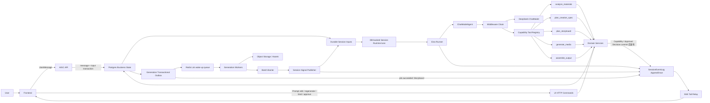

# AIGC ChatModelAgent Demo 详细设计

> 状态：Current Implementation + Target Gaps
> 日期：2026-07-12
> 关联文档：[AIGC Tool 编排与动态故事板详细设计](./aigc-tool-storyboard-design.md)、[AIGC Generation Worker 详细设计](./aigc-worker-design.md)

本文档记录 Dora Agent 当前 ChatModelAgent、Runner、持久化 Session Runtime、Capability Tool、A2UI 和后续目标。Tool 暴露面、动态故事板和局部操作以 `aigc-tool-storyboard-design.md` 为准；异步 Batch、Job、Worker 和 Finalization 以 `aigc-worker-design.md` 为准。当前产品定位是受信本地 Demo，没有面向公网的真实登录鉴权、租户授权或接口限流。

本地 Demo 的验收目标是跑通 Agent Tool、durable Approval/Continuation、Worker、Batch Barrier、SessionEventLog/SSE 和 React 投影，并保留 DeepSeek 与真实 Image2。Image2 使用 `DORA_IMAGE2_API_KEY` 调用真实同步 Adapter，`b64_json` 解码后写入本地素材目录；Seedance 可使用确定性 MP4 占位，Audio 使用 Demo WAV，Assembly 使用 JSON manifest。验收不要求真实视频/音频合成、拼接或转码，也不得据此宣称这些生产 Provider 已完成。

### 当前实施状态

| 能力 | 状态 | 当前边界 |
| --- | --- | --- |
| ChatModelAgent + Runner | 已实现 | DeepSeek `ChatModelAgent` 通过 Eino Runner 执行；ModelReceipt、PatchToolCalls、Reduction、Summarization、动态 TurnContext、按 run 动态 Skill 和 ToolException 已接入。SkillBackend 为空时不注入指令或 loader。 |
| 五个 Capability Tool | 已实现 | Runner fail-closed 固定注册并校验 Registry 恰好为五个 Tool，不接受可变 ToolKeys，也不存在旧 Agent Registry 工厂；每个 Tool 是 `validate_request → execute_capability → validate_result` bounded Graph。 |
| 内部推理 | 已实现 | `prepare_messages → chat_model → decode_json` 显式子图供分析、Spec、Storyboard 和 Prompt 生成复用；Creation Spec 使用精确字段 schema，并只在任何持久化前允许一次模型/schema 重试。该子图不暴露为 Tool。 |
| Session Runtime | 已实现 | 自研 DB-backed `sessionruntime.Manager` 使用 started-input HOL、冻结 context boundary、RunID 因果 transcript、Session fence 和稳定 TurnID 串行处理 UserMessage、生产 Runner/Approval ResumeRequested、ApprovalContinuationResult 和 BatchContinuationResult；不是 `adk.NewTurnLoop`。 |
| Runner/Tool receipt | 已实现 | 外层 Agent 原始 Provider response 先写 ModelReceipt；外层 A2UI normalizer 只提取单个顶层对象并做一次明确闭合符修复，逻辑 ToolCall 幂等基键和完整 Turn output 继续分层冻结。 |
| Spec/Storyboard/Candidate 审核 | 已实现 | Spec/Storyboard 保留系统 chat Approval 卡，同一 Session 只允许一个可操作审核并按流程串行；系统 Approval 存在时抑制模型候选预览。Candidate 每项仍是 durable Approval，但预览与统一确认只在左侧 Storyboard，相关 Job 全终态后一次提交冻结候选批次。 |
| Dynamic Context | 已实现 | 每轮注入 confirmed/latest Spec 以及 Active/Pending 动态 Storyboard、Module、PromptSlot 和 AssetSlot compact view。 |
| Generation 回流 | 部分实现 | 正常媒体/装配 Batch 使用 `on_failure`；每次 `generate_media`/`assemble_output` 在 chat 只维护一张稳定高层 ToolRun，终态发 `refresh_resources` 刷新左侧 Storyboard/Assets/Jobs，不调用模型解释。Barrier 把完整不可变 PostBatchPayload 写入 Operation/terminal outbox 和 durable BatchContinuationResult.Result；只有 partial/failed/cancelled 需要可信 system Turn。无独立 PostBatchContinuation/Stage Ledger/ToolOperationResult。 |
| 前端定向操作 | 已实现 | 槽位本地上传后直接绑定、素材预览与 Candidate 统一审核、音频原生试听、通过高层 ToolRun `operation_id` 执行取消、带 dispatch snapshot 的局部重生成，以及 replay-first、只恢复 provider/transient 失败的 `retry_failed` 均不经过 Agent。 |
| A2UI/Event | 部分实现 | 严格 A2UI 1.0/known-action parser 与整包 fail-closed 不变；模型外层 normalizer 只清理单对象格式噪声，不放宽协议。聊天不展开 Operation/Job/Stage 多卡或逐 Job 节点；Operation/Batch/Job 的状态版本仍留在 Store/read model。generic required 表单、EventLog/Tail 已实现；无全域 Projector/Inbox。 |
| Interrupt 基础设施 | 部分实现 | 生产 generic Runner interrupt 通过 `/messages/resume → durable ResumeRequested → Session Runtime Processor` 恢复；Approval-bound mapping 必须走 Decision API。五 Tool 的 Spec/Storyboard 审核不使用 Runner interrupt；无 Runtime 直连仅用于测试兼容。 |
| 本地媒体执行 | 部分真实 | 验收保留真实 Image2；Seedance 可使用确定性占位 Adapter，Audio/Assembly 使用 Demo Adapter。结果都通过本地 Uploader 和静态路由进入 Asset/Finalization/A2UI 链路；不验收真实视频、音频或装配质量。 |

### 本地全流程运行契约

- 仍需 PostgreSQL、Redis、`DORA_DEEPSEEK_API_KEY` 和 `DORA_IMAGE2_API_KEY`；DeepSeek 同时用于外层 Agent 和 Capability 内部 ChatModel 子图，Image2 用于真实图片生成。
- `DORA_LOCAL_DEMO=true`、`DORA_LOCAL_ASSET_DIR=.local/aigc-assets`、`DORA_LOCAL_ASSET_BASE_URL=/api/aigc/local-assets` 是推荐显式配置。`APP_ENV=local` 且 TOS 凭据缺失时，入口也会自动采用该本地目录和 Demo Provider。
- `DORA_IMAGE2_API_KEY` 必须保留；即使 `DORA_LOCAL_DEMO=true`，真实 Image2 也优先于图片占位 Adapter。`DORA_SEEDANCE_API_KEY` 可留空（启动示例只允许 `unset DORA_SEEDANCE_API_KEY`），以使用本地视频占位。
- 本地 Uploader 使用确定性 object key 落盘，Router 通过 `/api/aigc/local-assets/<object-key>` 静态提供文件；该路由只适用于受信开发环境，不是私有对象存储或签名 URL 方案。
- 当前验收样例落盘真实 Image2 图片、占位 MP4、Demo WAV 和 Assembly JSON。只有图片调用真实媒体 Provider；其余输出只验证状态、费用、Binding、审批和 UI 投影，不代表合成、拼接或转码质量。

## 1. 设计目标

1. 使用 Eino ADK `ChatModelAgent` 作为创作决策中枢，理解用户意图并选择高层 Capability Tool。
2. Agent 只决定整体规划和正常生产推进，不直接调用业务 CRUD、Provider、余额、权限或用户资产 Tool。
3. 故事板根据当前场景动态创建模块和元素，不预先枚举所有角色、场景、歌词、分镜或音乐类型。
4. 明确区分整体 Replan 与局部操作：新背景/新目标触发整体规划；前端 Prompt 编辑和目标重生成走定向 HTTP Command。
5. 提示词生成是元素规划之后的独立 Graph 内部 ChatModel Node，不作为 Agent-facing `prepare_prompts` Tool。
6. Graph 只执行有界流程；图片、视频和音频任务持久化为 Operation/Batch/Job 后立即返回 `accepted`。
7. Worker 的终态 Job/Batch 通过 generation outbox 投影 UI；Batch 终态只创建一次带完整可信 `PostBatchPayload` 的 Durable `BatchContinuationResult`，必要时最多触发一次 Agent 解释。
8. 前端左右分离：左侧是动态故事板，右侧是聊天、工具阶段、确认和错误卡片。
9. 对话、创作规范、动态故事板 Revision、PromptSlot、资产绑定、Approval、Operation、Batch、Job、SessionInput 和外部 EventLog 持久化；独立 Stage Ledger/ToolOperationResult 尚未实现。
10. 支持断线恢复、版本冲突、用户打断、迟到结果保护、技术重试和业务重生成。

## 2. Eino 模块与业务作用

| Eino 模块 | 业务作用 |
| --- | --- |
| `adk.ChatModelAgent` | 理解创作意图、读取 Skill 和当前状态、选择 Agent-facing Capability Tool、解释结果。 |
| `adk.Runner` | Agent 生产执行入口，负责事件流、Agent checkpoint 和 interrupt/resume。 |
| `sessionruntime.Manager` | 当前 Session 级串行运行时，使用数据库 lease/fence 处理 UserMessage、Runner/Approval ResumeRequested、ApprovalContinuationResult 和 BatchContinuationResult；概念上承担 TurnLoop 职责。 |
| `adk.Middleware` | 当前为 ModelReceipt、消息修复、Reduction、Summarization、动态 TurnContext、按 run 条件注入的 Skill 和工具异常；Tool Search/额外 Observability 尚未接入当前 Runner。 |
| `component model.BaseModel` | DeepSeek 或兼容模型适配层。当前代码使用 `*schema.Message`，后续可升级 AgenticMessage。 |
| `component tool.BaseTool` | 只承载五个高层 Capability Tool 的模型调用外壳。 |
| `compose.Graph` | 当前用于五个 Capability 的三节点 bounded 外壳，以及共享的三节点内部 ChatModel 子图。UI 局部 Command 当前是 HTTP + Domain Service。 |
| `compose.Workflow` | 字段映射明确且无循环的短 DAG，可用于部分 UI Command。 |
| `compose.CheckPointStore` | 保存 Runner checkpoint；当前 Spec/Storyboard durable 审核不使用。 |
| `callbacks.Handler` | 记录模型、Tool、Graph 节点、Token、耗时、错误、Trace 和版本。 |
| A2UI Publisher | 当前 Agent、generation outbox、Capability/Approval Decision publisher 分别发布 Action；`job.succeeded` 的 Finalization 投影只刷新 Storyboard，不发布 Candidate chat 卡。统一 Projector/Inbox 是后续目标。 |

边界要求：

1. 生产代码通过 Runner 执行 Agent，不直接调用 `agent.Run()`。
2. Graph 固定拓扑并预先 Compile；动态 Module、Element 和 Scope 放在 Graph State。
3. Graph 不跨分钟等待 Provider，不使用 Checkpoint 代替 Operation/Batch/Job 状态。
4. Provider、Storage、Billing 和 Asset Finalizer 由 Worker 调用，不进入 Agent Tool Registry。

## 3. 总体架构



核心决策：

1. `ChatModelAgent` 负责“下一步做什么”。
2. Capability Graph 负责“这一步如何安全执行”。
3. UI 定向 Command 负责“用户明确指定的哪个目标要修改”。
4. Worker 负责“如何可靠完成外部媒体任务”。
5. 当前各 publisher 负责“领域状态如何展示”；统一 A2UI Domain Projector 是后续收敛目标。

## 4. Session 输入模型

Session Runtime 需要区分输入类型，不能把所有事件都伪装成普通用户消息。

```go
type SessionInput interface {
    sessionInput()
}

type UserMessage struct {
    InputID  string
    EventID  string
    MessageID string
    ContextMessageSeq int64
}

type ResumeRequested struct {
    InputID         string
    EventID         string
    ApprovalID      string
    DecisionVersion int
    MappingID       string
    MappingEpoch    int64
    CheckpointID    string
    InterruptID     string
    Content         string
    Data            json.RawMessage
}

type ApprovalContinuationResult struct {
    InputID            string
    EventID            string
    ApprovalID         string
    DecisionVersion    int
    ExecutionEpoch     int64
    RequestedDecision  string
    EffectiveStatus    string
    ArtifactType       string
    ArtifactID         string
    ArtifactVersion    int
    StoryboardID       string
    StoryboardVersion  int
    CommandKind        string
    CommandResult      json.RawMessage
    ContextMessageSeq  int64
}

type BatchContinuationResult struct {
    InputID               string
    EventID               string
    ResultVersion         int
    OperationID           string
    BatchID               string
    StageStatus           string
    ApprovalID            string
    NeedsAgentExplanation bool
    ContextMessageSeq      int64
    Result                json.RawMessage // exact immutable PostBatchPayload
}

type SessionInputRecord struct {
    InputID      string
    SessionID    string
    InputType    string // user_message, resume_requested, approval_continuation_result, batch_continuation_result
    SourceID     string
    Payload      any
    Priority     int
    EnqueueSeq   int64
    ContextMessageSeq int64
    Status       string // pending, claimed, running, retry_wait, resolved, dead
    TurnID       string
    ClaimOwner   string
    ClaimFence   int64
    LeaseUntil   *time.Time
    Attempts     int
    AvailableAt  time.Time
}

type SessionRuntimeLease struct {
    SessionID  string
    OwnerID    string
    FenceToken int64
    LeaseUntil time.Time
}

type SessionTurnRun struct {
    TurnID             string
    InputID            string
    SessionID          string
    RunnerRunID        string
    ParentTurnID       string
    ClaimFence         int64
    Kind               string
    Status             string // prepared, running, waiting_interrupt, committing, committed, retry_wait, dead
    RunnerCheckpointID string
    Attempt            int
    ContextMessageSeq  int64
    ContextSeqFrozen   bool
    OutputPayload      json.RawMessage
    OutputDigest       string
}

func (UserMessage) sessionInput() {}
func (ResumeRequested) sessionInput() {}
func (ApprovalContinuationResult) sessionInput() {}
func (BatchContinuationResult) sessionInput() {}

// PostBatchPayload 由 Barrier 构造并通过 generation Outbox 原样进入 Result。
type PostBatchPayload struct {
    SessionID             string
    WorkflowRunID         string
    StageRunID            string
    OperationID           string
    ToolCallID            string
    BatchID               string
    BatchVersion          int
    Status                string
    Cost                  CostSummary
    Jobs                  []JobTerminalResult
    NeedsAgentExplanation bool
    CreatedAt             time.Time
}
```

输入路由：

| 输入 | 是否进入 Durable Session lane / Runner | 处理方式 |
| --- | --- | --- |
| 用户聊天、重新提供背景/目标 | 是 | Message 与 `UserMessage` Input 同事务持久化 → 自研 Session lane → Runner → ChatModelAgent |
| 左侧 Prompt 直接修改 | 否 | UI HTTP Command → Storyboard Service |
| 左侧目标重新生成 | 否 | UI HTTP Command → Operation/Batch/Job |
| 手工绑定资产 | 否 | UI HTTP Command → Storyboard Service |
| Generic Runner interrupt 确认 | 是 | `POST .../messages/resume` 校验非 Approval-bound mapping；Runtime 配置下确认 Message + 固定 InputID 的 `ResumeRequested` 同事务提交，Processor 串行 Resume |
| Approval-bound Runner interrupt 决策 | 是 | 必须调用 Approval Decision API，由 decision outbox 创建 `approval:<id>:resume:<version>`；generic resume 明确拒绝 |
| Durable Approval 提交 | 是（新 Turn） | `ApprovalContinuation` 先确定性执行冻结 Command；提交后 UPSERT `approval:<id>:continuation-result:<decision_version>`，Session lane 以可信 system 内部事件启动新的 Agent Turn。它不 Resume 原 Runner checkpoint，也不伪造用户消息。 |
| 单个 `job.status` | 否 | generation outbox publisher 更新对应高层 Capability ToolRun 汇总；Job 明细仅保存在 Store/read model |
| Batch Terminal | 可选 | SessionSignalPublisher 直接 UPSERT `BatchContinuationResult`，Result 携带完整可信 PostBatchPayload；无需解释时不调用 Agent |

用户定向 UI 操作完成后，可以向聊天区投影一条系统摘要，但不能伪造为用户消息，也不需要 Agent 再确认是否执行。

Session Runtime lane 使用 head-of-line 因果规则，不是全局优先级抢占：

1. 最早已启动且未终态的 Input（`Attempts > 0`）拥有 Session HOL；即使进入 `retry_wait` 或尚未到 `AvailableAt`，后续输入也不能越过。
2. 只有不存在 started head 时，才在未开始输入中按 `UserMessage=300`、`ResumeRequested=200`、`ApprovalContinuationResult=200`、`BatchContinuationResult=100` 的优先级选择，同优先级再按 `enqueue_seq`。
3. 当前运行中的 Turn 仍不可被新消息抢占；安全点抢占是后续增强。
4. `job.status` 永不进入 Session lane。

所有会触发 Agent 的输入都必须先持久化：

```text
HTTP UserMessage transaction
→ INSERT messages(user) + UPSERT session_inputs
   input_id = message:<message_id>

generic Runner interrupt confirmation transaction
→ INSERT messages(user) + UPSERT session_inputs
   input_id = checkpoint:<mapping_id>:resume:<mapping_epoch>

Approval-bound Interrupt Decision transaction
→ INSERT session.input_requested Outbox
   input_id = approval:<approval_id>:resume:<decision_version>

deterministic Durable Approval command committed
→ UPSERT session_inputs
   input_id = approval:<approval_id>:continuation-result:<decision_version>
→ fresh Agent turn receives trusted system event; never resumes the original Tool stack

generation Batch terminal Outbox consumer
→ UPSERT session_inputs
   input_id = batch:<batch_id>:continuation:<result_version>
→ best-effort NOTIFY/Wake(session_id)
→ lease owner first resumes started HOL; otherwise selects unstarted by priority + enqueue_seq
→ get-or-create stable TurnID by InputID
→ run or recover the same SessionTurnRun
→ Tool/Command effects use stable Turn/Input idempotency keys
→ commit TurnRun + Input resolution; Message/Event writes use stable IDs and AppendOnce
```

`session_inputs` 使用稳定 InputID/SourceID 和每 Session `enqueue_seq`；EnqueueSeq 由独立 Session Input Counter 分配，不是外部 SSE seq。`session_turn_runs` 以 InputID 固定稳定 TurnID。Runtime 必须持有 `session_runtime_leases` 的有效 FenceToken。统一 Domain Projector/Inbox 尚未实现，因此不应把它写成当前 Session Runtime 的组成部分。

Lease 使用数据库时间。当前 Owner 续租不增加 FenceToken；只有 `lease_until < now()` 或显式交接时，新的 Owner 才通过 CAS 接管并递增 FenceToken。Claim Input、保存 checkpoint、执行 Turn-scoped Command 和最终 Commit 都校验 `(session_id, owner_id, fence_token, lease_until)`。

```text
input: pending → claimed → running → resolved
claimed|running --transient/lease expired--> retry_wait → pending
turn: prepared → running → committing → committed
runner interrupt: running → waiting_interrupt → durable ResumeRequested
prepared|running --recoverable--> retry_wait → running with same turn_id
```

当前 Runtime 按 Session 串行处理输入；新消息排队，不抢占正在运行的 Runner。没有 frozen Turn output 的输入超过重试上限时进入 dead，并与稳定、脱敏的 `a2ui.error` SessionEvent 同事务提交；已经冻结完整 output 的 Turn 不受普通 MaxAttempts dead-letter 限制，而是继续重试权威投影/完成回执。安全点抢占属于后续增强项。

生产 Spec/Storyboard Approval 在 Capability 返回 `waiting_user` 后结束原 Runner 调用，用户决定由 durable deterministic continuation 执行。与之独立，生产 Runner 的真实 Interrupt 会保存 CheckpointMapping 并进入 `waiting_interrupt`；用户确认通过 `/messages/resume` 形成 durable `ResumeRequested`。Runtime 未配置时的 HTTP 直连只用于测试兼容。

外层 Agent 模型调用的完整响应先按 `TurnID + model-call ordinal` first-write-wins，流式输出先拼接/冻结再交给 ReAct；ToolCallID 和原始 idempotency base 跨 checkpoint resume 保持稳定。Runner 的完整 Agent event output 又先冻结到 TurnRun，再进行权威 Message/Event 投影。重领复用原 TurnID/checkpoint，投影失败只重放 frozen output；已经 `committed` 时只补做 Input Resolve。该模型 receipt 只覆盖外层 Agent ChatModel，不覆盖 Capability 内部 ChatModel 子图。

事务保存的 UserMessage 始终是输入事实；当前尚未用一个最终事务原子提交全部 Message/EventLog/Turn/Input。MessageRebuilder 依靠稳定 RunID 因果分组、冻结边界和 AppendOnce 输出投影避免后排用户与前序回复错配；`waiting_interrupt` 通过 CheckpointMapping 恢复，不能把未闭合 Tool 链扁平化成普通历史。内存 Wake/Notification 只用于降低延迟，不能承载输入事实。

## 5. 普通用户消息流

```text
Frontend POST message
→ transactionally persist Message + session_inputs(message:<message_id>)
→ best-effort wake Runtime
→ fenced durable Session lane claims the input with started-HOL semantics
→ get or recover stable SessionTurnRun
→ MessageRebuilder restores valid history
→ ContextInjection loads latest compact state
→ Runner executes ChatModelAgent
→ Agent responds or calls Capability Tool
→ freeze full Turn output receipt
→ project valid history/EventLog with stable IDs, then commit TurnRun + Input resolve
→ SSE relay tails EventLog to frontend
```

每轮模型上下文至少包括：

- 当前用户消息和最近窗口消息。
- 非空 SkillBackend 返回的 Skill 摘要；Backend 为空时本 run 不注入 Skill 指令或 loader。当前没有独立 Stage Ledger 事实表。
- 最新 Creation Spec 版本摘要。
- Active/Pending Storyboard Revision 摘要。
- 动态 Module 数、待审核目标、stale 目标。
- 当前 ContextInjection 尚未加载活跃 Operation/Batch、费用、Pending Approval 或 Memory Summary；这些是后续 compact context 扩展项。

### 5.1 MessageRebuilder

```go
type MessageRecord struct {
    ID              string
    SessionID       string
    RunID           string
    Role            string
    Content         string
    ContentBlocks   []byte
    ToolCallID      string
    ToolName        string
    ParentMessageID string
    Seq             int64
    CreatedAt       time.Time
}

type MessageRebuilder interface {
    BuildMessages(ctx context.Context, sessionID string, limit MessageWindow) ([]*schema.Message, error)
    AppendFromAgentEvent(ctx context.Context, sessionID string, event *adk.AgentEvent) error
}
```

重建约束：

1. 持久化 `seq` 是物理日志顺序，不直接等于模型因果顺序；按稳定 `RunID` 把一次 Turn 的 user/assistant/tool 行组成一个组，组内保持 user → assistant/tool 链。
2. 各组按 owning user seq 建立逻辑顺序；`CurrentMessageID` 对应组放在已入队前序 Turn 输出之后，避免后写的前序 Assistant 被错误排到当前 User 后面。
3. `ThroughSeq` 过滤整个后排用户组，不能只删 user 行而留下孤儿 assistant/tool；窗口 `Limit` 是分组、过滤和逻辑排序后的软消息预算，只能选择完整 Run，不能切开 ToolCall/Result 链；当前用户 Run 必须完整保留，因此结果允许超过 Limit。
4. UserMessage 入队事务冻结其消息 seq；Batch explanation 第一次成为 HOL 时冻结所有已终结 UserMessage 的最大 seq，`ContextSeqFrozen=true` 允许明确冻结为 0，重试不得扩大边界。
5. Assistant Tool Call 必须保留 `tool_call_id/name/arguments`，Tool Result 必须引用原 Tool Call。
6. Interrupt/Cancel 导致的 dangling Tool Call 先由 PatchToolCallsMiddleware 修复。
7. 大型内容只注入摘要和 ArtifactRef；Streaming Chunk 只用于展示，落库时合并成完整消息或完整 Tool Result。
8. UI Command Event 不混入模型消息历史；只通过当前状态摘要进入上下文。

## 6. 整体规划与局部操作语义

### 6.1 整体 Storyboard Replan

触发条件：

- 用户提供新的故事背景。
- 用户修改创作目标、输出类型、受众或整体叙事。
- 用户明确要求整体重做故事板。
- Creation Spec 的结构性约束变化并标记 `storyboard_replan_required`。

流程：

```text
UserMessage
→ Agent calls plan_creation_spec when needed
→ Agent calls plan_storyboard(mode=replan)
→ element-planning ChatModel infers modules/counts/elements/prompt purposes/assets/dependencies only
→ normalize missing/duplicate module, element and asset-slot IDs/keys into unique candidate identities
→ independent prompt ChatModel generates every Prompt for every Provider-backed asset slot
→ fail before persistence if any required review Prompt is still missing
→ complete candidate revision
→ semantic reconciliation and reuse analysis
→ pending revision review
→ promote after approval
```

`plan_storyboard` 不接收 TargetID、Scope 或 JSON Patch。元素规划节点禁止输出 Prompt 文本；统一 Prompt 节点在领域规范化之后运行。若 `preserve_approved_assets=true`，Promotion 的最终 CAS 会把审核期间旧 Active Revision 新激活、且语义/依赖仍兼容的 Binding rebase 到 Pending Revision；依赖签名变化的槽仍保持 stale。

### 6.2 Prompt 局部编辑

用户在左侧某个 Module 的 Element 中直接修改 Prompt：

```text
Frontend update_target_prompt
→ exact TargetID and versions
→ direct replace PromptSlot and increment PromptRevision
→ mark only prompt-derived outputs stale
→ update Storyboard panel
```

该流程不调用 Agent/LLM，不重新规划 Module 和元素数量。AI rewrite 是后续能力；当前内部 ChatModel 会在 `plan_storyboard` 提交 Pending Revision/Approval 前补齐候选 Prompt，并在 `generate_media` 派发前为 Active Revision 做安全兜底。定向重生成缺 Prompt 时直接拒绝。

### 6.3 目标局部重生成

用户点击某个 Element/AssetSlot 的“重新生成”：

```text
Frontend regenerate_target_media
→ GenerationEpoch + 1
→ persist frozen RegenerationDispatchSnapshot in Storyboard DomainEvent
→ create scoped Operation/Batch/Job from the snapshot
→ return accepted
→ Worker finalization
→ Candidate Asset review
→ activate selected candidate
```

`RegenerationDispatchSnapshot` 冻结 Provider、媒体类型、用户、Spec/Storyboard version、预计积分、解析后的 GenerationInput 和 Provider Payload。Command 已提交但 Workflow 派发前崩溃时，同幂等重放从该 snapshot 恢复，不根据当前 Storyboard 重新解释请求。旧 Active Asset 在候选通过前继续保留。

### 6.4 上传素材填充

```text
Frontend selects local file
→ upload `/api/aigc/assets`
→ persist available Asset + object storage location
→ bind_target_asset with exact TargetID/AssetSlot and versions
→ activate user-selected binding and propagate stale dependency closure
→ render image/video/audio preview from the bound Asset URL
```

上传、绑定和局部重生成都是确定性 UI Command，不先转换为用户聊天消息。Pending Revision 存在、媒体类型与 Slot 不匹配或版本栅栏过期时，上传后的绑定步骤会被拒绝。音频槽位和 A2UI `AudioPreview` 使用原生 `<audio controls preload="metadata">` 试听。

上传与绑定是两个独立 HTTP 提交。绑定失败时，已经上传的 available Asset 会保留在当前素材列表，不会进入 Worker Finalization 回滚。当前 Demo 上传从 Session 记录取得 `user_id`，若表单提供不同值会返回 403；Asset GET 要求 query `session_id`、校验 Session 匹配及 `availability=available`。这些仍只是 Session 关联检查，不是登录用户授权。上传未设置显式文件大小限制或幂等键，TOS 对象使用 `public-read` URL。认证授权、限额、私有对象/签名 URL 和上传幂等是生产化安全待办。

### 6.5 Operation 取消与失败恢复

```text
Operation card cancel
→ CancelBatch(original batch_id)
→ original workflow keeps its identity and converges through Barrier

Operation card retry_failed
→ lookup existing recovery by request idempotency key first
→ exact replay returns the frozen recovery workflow
→ select previous jobs with status=failed + error_stage=provider + transient classification
→ verify current SpecVersion and BindingToken
→ exclude superseded/orphaned jobs
→ create a new <kind>_recovery Operation/Batch/Jobs
→ leave the original terminal workflow unchanged
```

当前筛选读取持久化 `ErrorStage` 并复用 Provider 错误分类器，只允许 provider/transient failure；Billing、Binding、Validation、superseded 和 orphaned 不会进入 Recovery。新 Job 会重新运行完整 Provider 流程；只恢复 Finalization 而不重新调用 Provider仍是后续能力。前端已把 `cancelling` 映射为“取消中”并纳入 in-progress 状态。

## 7. Durable Approval 与 Runner Interrupt 边界

当前五个 Capability 的审核行为如下：

```text
plan_creation_spec / plan_storyboard
→ persist reviewing Artifact + durable Approval
→ publish ordinary a2ui.action Approval card after commit
→ Capability returns waiting_user and the bounded Graph ends
→ decide_approval
→ deterministic ApprovalContinuation executes frozen approve/reject command
→ UPSERT stable ApprovalContinuationResult after command commit
→ Session lane starts a fresh Agent turn from a trusted system event
```

Candidate Asset Approval 同样是 durable continuation，但不再逐项发布 chat A2UI 卡。Job Finalization 只更新当前高层 Capability ToolRun，终态通过 `refresh_resources` 刷新左侧；左侧 Storyboard 等该板相关 Job 全终态后，一次调用 `POST /api/aigc/sessions/:id/storyboards/:sid/candidate-approvals/decision`。首次请求校验 expected Storyboard version，并按幂等键持久冻结当时所有 pending Candidate 的 `(approval_id, binding_id, expected_decision_version)`；每个子项再使用稳定 child key 调用现有 durable Decision。部分失败返回逐项结果和 HTTP 207；同键重试只续作冻结集合，不会混入点击后新增 Candidate。Spec/Storyboard 仍使用系统 chat Approval 和单项 Decision API，并受同 Session 唯一、串行约束。

Spec/Storyboard 的 chat Approval Card 是唯一审核入口。它由系统在领域提交后发布，`data.approval_id` 绑定冻结 Approval，Markdown 仅展示候选详情；当前 A2UI 没有独立 Button 组件，因此决策 UI 固定为必选的“确认/拒绝” `SingleChoice` 加卡片统一“提交”控件。同一 Session 同一时刻最多有一张可操作的 Spec/Storyboard Approval，Spec 决定完成后才能进入 Storyboard 审核；系统 Approval 存在期间，模型产生的同候选预览必须被抑制，不能形成第二张确认卡。前端仅对携带 `approval_id` 的卡片调用 Approval Decision API。用户在聊天框键入“确认”、提交普通无 `approval_id` 表单，或点击模型仿制的确认文案，都只产生 UserMessage，绝不能被解释成 Approval Decision。Capability 返回 `waiting_user` 后，模型不得输出“请回复确认/输入确认”等伪入口或仿制 Approval 表单；发布前的协议校验必须拒绝这类最终输出并进行有界纠错重试。

Continuation claim 带 executor/epoch/`LeaseOwner/LeaseUntil`：有效 lease 被其他 owner 持有时只做 lease-aware 延后，不计普通失败次数、不确认 outbox；真正执行失败才保存 `failed`，下一轮 Relay 可重新 claim 同一 executor/epoch。Approval Outbox 坏行按 AvailableAt 指数退避，10 次后 dead，且不阻塞其他到期行。冻结领域命令已提交、外层 Continuation ledger 尚未落库时，重放检查 Spec 状态、Storyboard command receipt 或 Artifact ReviewCommandReceipt，只补 Command Ledger/applied；stale/superseded 则固化确定性 no-op。命令 applied 后使用 `approval:<id>:continuation-result:<decision_version>` 幂等 UPSERT 新输入；若 Enqueue 失败，原 Approval Outbox 不确认，重放只补输入而不重复命令。新 Turn 收到的是 trusted system event，不恢复已经结束的 bounded Graph，也不伪造用户消息。Spec/Storyboard Decision A2UI 使用稳定 decision version，只投影冻结 status/version；Candidate 批量决定只投影带 Aggregate Version 的 Storyboard 和批次摘要。

Approved continuation 的下一步由服务端 machine-readable directive 冻结，不交给模型自由路由：Creation Spec v1 选择 `plan_storyboard(create)`，后续 Spec 选择 `plan_storyboard(replan,preserve_approved_assets=true)`；Storyboard/Candidate 审批从冻结 command result 中读取最终 Aggregate。Aggregate 尚有 Candidate、缺少匹配 active Binding，或任一 Provider-backed/required 生产槽未 active 时选择 `generate_media(auto_next,all_eligible)`；仅当无待审 Candidate 且全部生产槽 active 时选择 `assemble_output(preview,video)`。Middleware 为该 directive 生成稳定 ToolCall ID，并要求 ToolCall/Result 严格配对。每个续作 Turn 恰好执行这一项；执行完成后模型返回的任何额外 ToolCall 都被替换为 strict A2UI stop card，后续阶段只能由新的 durable event 开启新 Turn。

Artifact Store/ApprovalRuntime 已实现 receipt-backed `export_result` 审核命令：首次执行以 latest + reviewing fence 校验，并在同一事务写 Artifact 生命周期和 first-write-wins `aigc_artifact_command_receipts`；重放先读 receipt 的不可变结果快照，因此旧 A 已提交、随后新 B 激活后，A 只能补外层 ledger，不能重新激活 A。当前 `assemble_output(preview/export)` generation ingress 仍不创建该 Approval，Demo Assembly Worker 继续自动生成 manifest Asset。

### 7.1 生产 Runner Resume 与 Capability Interrupt 边界

Generic Runner checkpoint 的 durable Resume 已接入生产 Session Runtime；以下 Mapping 状态与 runner scope 契约是当前实现。Approval-bound outer/inner Graph checkpoint 与 durable fallback 的完整原子协议仍是目标，而且不是当前 Spec/Storyboard 审核流程。无 Runtime 的同步 HTTP Resume 只保留为测试兼容路径。

```go
type CheckpointMapping struct {
    ID                 string
    ApprovalID         string
    SessionID          string
    RunID              string
    Scope              string // runner, bounded_tool_graph
    ToolCallID         string
    ToolKey            string
    GraphName          string
    NodePath           string
    RunnerCheckpointID string
    GraphCheckpointID  string
    InterruptID        string
    MappingEpoch       int64
    DecisionVersion    int
    StageKey           string
    ArtifactID         string
    ArtifactVersion    int
    StoryboardVersion  int
    TargetRevision     int
    PromptRevision     int
    GenerationEpoch    int
    Status             string // pending, resume_queued, resuming, resume_applied, resumed, cancelled, expired, stale
}

type StatefulInterruptState struct {
    ApprovalID        string
    ArtifactID        string
    ArtifactVersion   int
    StoryboardVersion int
    TargetRevision    int
    PromptRevision    int
    GenerationEpoch   int
}

type ApprovalContinuation struct {
    ApprovalID     string
    DecisionVersion int
    Executor       string // runner_resume, deterministic_continuation
    ExecutionEpoch int64
    Status         string // requested, claimed, applied, failed
    LeaseOwner     string
    LeaseUntil     *time.Time
}
```

约束：

```text
FK checkpoint_mappings.approval_id → approvals.id
UNIQUE (approval_id, interrupt_id)
UNIQUE (session_id, interrupt_id)
UNIQUE (approval_id) WHERE mapping.status IN (pending, resume_queued, resuming, resume_applied)
PRIMARY KEY approval_continuations (approval_id, decision_version)
UNIQUE approval_command_ledger (approval_id, decision_version, command_kind)
```

`Approval.ReviewMode` 记录不可变来源 `interrupt|durable`，`Approval.ExecutionMode` 记录当前执行路径 `interrupt|durable|durable_fallback`。Fallback 不能改写审核来源。

目标恢复规则：

1. Graph 在 Interrupt 前先事务创建 Approval 和 `approval.requested` Outbox；`StatefulInterruptState` 必须显式携带 ApprovalID。Runner Interrupt Adapter 在发布 UI 前保存可由 ApprovalID 寻址的 CheckpointMapping；Approval 是业务真源。
2. Approval-bound mapping 的客户端统一提交 `approval_id` 和 decision；generic `/messages/resume` 明确拒绝任何非空 ApprovalID。服务端锁定 Approval 并根据当前 `ExecutionMode=interrupt|durable|durable_fallback` 路由，不信任客户端 mode，也不暴露底层存储 key。
3. Decision 事务 CAS `pending → approved|rejected`、递增 DecisionVersion，并插入唯一 ApprovalContinuation：`interrupt` 选择 `runner_resume`，`durable|durable_fallback` 选择 `deterministic_continuation`；同事务写对应 Outbox。
4. Approval `runner_resume` Outbox 使用 `session.input_requested`，payload 为 `ResumeRequested{ApprovalID, DecisionVersion, MappingID, MappingEpoch}`。Generic Runner 确认则由 `/messages/resume` 以 mapping+epoch 派生 `checkpoint:<mapping_id>:resume:<epoch>`，携带 CheckpointID/InterruptID/Content/Data。两者消费时都重读 Mapping，客户端或队列中的 checkpoint 地址一律不可信。
5. `deterministic_continuation` Outbox 使用 `approval.continuation_requested`；消费者执行冻结的 approve/reject Command，不调用 Runner Resume。命令 applied 后 UPSERT stable `ApprovalContinuationResult`，由 Session lane 以 trusted system event 开启新 Agent Turn；输入写入失败时 Outbox 保持 pending，重放不得再次执行命令。
6. Approval 两类消费者只能 CAS claim 当前 `(approval_id, decision_version, executor, execution_epoch)`，并受 `LeaseOwner/LeaseUntil` 约束。有效 lease 只触发延后重试；过期 lease 可由新 owner 在同 executor/epoch 重新 claim，只有 executor fallback 才增加 epoch。确定性命令使用 Command Ledger/ApprovalContinuation/领域 receipt；Runner/Graph 路径先冻结完整输出、Apply Continuation、成功投影，再以 `resuming → resume_applied → resumed` 两阶段 receipt 补最终完成回执。后半段失败时不得再次调用外部 Resume。
7. Resume 前校验 Artifact、Storyboard、Target、Prompt、GenerationEpoch、MappingEpoch 和 Session Fence。版本不匹配时将 Approval 标记 `stale`，不恢复旧状态。
8. `scope=runner` 使用 RunnerCheckpointID；目标 `scope=bounded_tool_graph` 必须同时保留 outer Runner 与 inner Graph checkpoint。目标恢复协调器先恢复 outer Runner，再由 Tool 外壳消费 `GraphResumeEnvelope{GraphCheckpointID, ApprovalID, DecisionVersion}` 恢复 inner Graph，不能把 GraphCheckpointID 直接传给 Runner。
9. Runner Interrupt Adapter 必须先保存 CheckpointMapping，再以稳定 source key AppendOnce 到共享 SessionEventLog。`/messages/resume` 在 Runtime 配置下只验证 session/scope/checkpoint/interrupt/mapping/epoch、持久化确认 Message + Input 并返回 202；HTTP 不 claim、不直调 Runner。Processor claim `pending|resume_queued → resuming`；若进程停在外部调用期间，重领同一 Input 复用稳定 TurnID 并允许从 `resuming` at-least-once 调用 Runner。完整 Runner output 先冻结；Approval-bound 路径 Apply Continuation 时若 lease busy，则保持 `resuming`、在 `LeaseUntil + 100ms` 后重试且不发完成进度。Apply → 权威投影成功后才执行 `resuming → resume_applied → resumed → interrupt_resolved`。`resume_applied/resumed` 重放只补回执/事件。只有无 Runtime 的同步兼容路径才会在调用错误时释放 `resuming → pending`。
10. Reconciler 只能在 Continuation 尚未 applied 且不存在有效 claimed lease 时，把 `runner_resume` CAS 为 `deterministic_continuation`、ExecutionEpoch+1，并把 Mapping 标记 stale/expired、旧 SessionInput 标记 dead/superseded。迟到 Resume 或 Interrupt Adapter 因 mode/executor/epoch 不匹配只能 no-op。
11. Checkpoint 在 Decision 前丢失时，Reconciler 将 ExecutionMode 切到 `durable_fallback`，并创建或更新同一 `approval:<id>` 卡；Decision 后丢失时沿用同一 DecisionVersion 自动切换 Continuation executor，不能要求用户再次决定。
12. Fallback 执行冻结的 approve/reject Command，然后写入同一稳定 ApprovalContinuationResult；它不 Resume 原 checkpoint，也不重新执行或重新规划 Artifact。后续新 Agent Turn 只读取已提交事实并决定继续下一个 Capability、解释拒绝结果或重新规划。
13. Mapping 完成到 `resumed` 后发布稳定 `a2ui.interrupt_resolved`（identity 为 session/checkpoint/interrupt），前端只据此关闭对应 interrupt surface；若完成回执或 resolved 事件发布失败，`resume_applied/resumed` 重放只补缺失回执/事件。HTTP 200 本身不能替代持久化事件。

所有 Interrupt Resume 和 Durable Fallback 都必须执行 `ClaimApprovalContinuation → ReloadApprovalDecisionAndVersions → Branch`：approved 执行冻结的 Activate/Promote Command；rejected 执行 Reject Command；stale/cancelled 直接结束，绝不能隐式落入 Promote。

审核模式：

| Artifact | mode | approved | rejected |
| --- | --- | --- | --- |
| Material Analysis | `none` | 保存即成为最新分析事实 | 重新分析 |
| Creation Spec | `durable` | Activate Spec Revision | Reject Spec Revision |
| Storyboard Revision | `durable` | Promote Revision | Reject/Archive Pending Revision |
| Prompt Direct Edit | `none` | 用户保存即生效 | 不适用 |
| Prompt AI Rewrite | 待实现 | 当前 UI 只支持直接 replace | 不适用 |
| Candidate Asset | `durable` | Activate Binding | Reject Binding |
| Assembly Plan | `none` | 保存即成为当前计划 | 不适用 |
| Preview/Export Demo manifest | `none` | Worker 自动保存 manifest Asset | 不适用 |

上表描述当前产品 ingress，不否定已经实现的 `export_result` Artifact 审核命令基础设施；只有未来 ingress 显式创建 Approval 后，该能力才进入正常 Assembly 流程。

## 8. 异步媒体回流

`generate_media` 和 UI `regenerate_target_media` 的 Graph 只执行到 Dispatch：

```text
guard/load/ensure prompt/estimate
→ create Operation + Batch + Jobs + Outbox
→ return accepted
```

Worker 按 `aigc-worker-design.md` 执行：

```text
Provider submit/poll
→ media fetch/probe
→ object storage
→ pending Asset
→ persist immutable Provider usage receipt
→ binding token check
→ actual billing
→ Asset available + candidate/active binding by frozen policy + Job terminal
→ Batch Barrier
```

Generation outbox 的 Job 事件只更新当前 `generate_media` 或 `assemble_output` 的单张高层 ToolRun 汇总，不创建独立 Job/Operation/Stage 聊天卡。Batch 达到 `completed/partial_failed/failed/cancelled` 后，Barrier 写唯一 terminal outbox，并同步完成 Operation 状态与费用汇总。

正常 `generate_media` 和 `assemble_output` 创建的 Batch 固定为 `WakePolicy=on_failure`。`completed` 不启动 Agent Turn：generation outbox 完成同一张高层 ToolRun，并发送 `refresh_resources` 让左侧重读 Storyboard、Assets 和 Jobs；素材预览和 Candidate 统一确认只存在于左侧，不发布逐项 Candidate chat Approval。只有 `partial_failed/failed/cancelled` 把 `NeedsAgentExplanation` 置为 true，由模型解释已经持久化的失败事实；成功路径不依赖模型复述 Tool Result。

当前回流：

```text
SessionSignalPublisher consumes batch terminal Outbox
→ UPSERT durable BatchContinuationResult by batch/version
   Result = exact immutable PostBatchPayload
→ durable Session lane claims BatchContinuationResult by input_id
→ NeedsAgentExplanation=false: commit without Agent
→ NeedsAgentExplanation=true: fresh Agent turn explains persisted batch/operation status once from a trusted system event
```

`PostBatchPayload` 已包含 Session/Workflow/Stage/Operation/ToolCall/Batch 关联、BatchVersion、终态、完整 CostSummary、逐 Job target/slot/status/disposition/result asset IDs/error code/gross/refund/net、解释策略与创建时间，并同时保存于 Operation.Result 和 terminal outbox。当前没有额外的 PostBatchContinuation Graph、ActiveBatchID fence、StageRun 或 ToolOperationResult。Candidate Approval 在单 Job Finalization 中创建。未来若引入独立 PostBatchContinuation，应放在 terminal outbox 与 SessionInput 之间，并保持现有稳定 InputID；不能把“Graph 未实现”误写成“当前 continuation 没有完整结果”。

| Batch status | Domain Event | Stage status | A2UI status |
| --- | --- | --- | --- |
| `completed` | `batch.completed` | Operation `completed` | Operation success |
| `partial_failed` | `batch.partial_failed` | Operation `partial_failed` | Operation partial |
| `failed` | `batch.failed` | Operation `failed` | Operation error |
| `cancelled` | `batch.cancelled` | Operation `cancelled` | Operation cancelled |

Batch Terminal 是四种终态的统称，不是第五种领域事件。

## 9. Middleware 设计

Middleware 只承载横切能力，不承载 Storyboard 路由或业务状态机。

### 9.1 当前顺序

```go
Handlers: []adk.ChatModelAgentMiddleware{
    a2uiOutputNormalizerMW,
    nextCapabilityRepeatGuardMW,
    modelReceiptMW,
    nextCapabilityDirectiveMW,
    patchToolCallsMW,
    reductionMW,
    summarizationMW,
    turnContextMW,
    skillMW,
    toolExceptionMW,
}
```

1. A2UI output normalizer 位于 receipt wrapper 外层；内层 receipt 先冻结原始 Provider 输出，normalizer 再向 ReAct/重试层返回确定性清理副本。
2. NextCapabilityRepeatGuard 位于 receipt 外层：受信 Capability 已完成后，它先让 receipt 冻结模型尝试的额外 ToolCall，再把该输出替换成严格 A2UI stop card。
3. ModelReceipt 冻结原始完整模型响应、合成的受信 ToolCall 和 ToolCallID；未配置持久化 Store 时省略这一层。
4. NextCapabilityDirective 位于 receipt 内层，把 approved continuation 的唯一受信 directive 转成稳定 ToolCall；无 directive 时透传模型。
5. PatchToolCalls 修复不完整 Tool Call 链。
6. Reduction 先处理大型 Tool Result，Summarization 再压缩长期会话事实。
7. TurnContext 在压缩后注入最新 Spec/Storyboard 瞬态状态。
8. Dynamic Skill middleware 在每个 Agent run 先调用 `SkillBackend.List`：空列表直接透传，不注入 Eino Skill 系统指令或 `skill` loader；导入 Skill 后下一 turn 在同一 Runner 自动启用。`skill` loader 的 ToolCall/Tool result（包括错误）保留给内部 ReAct 历史，但服务端不把它们投影为用户 `tool_runs` 卡。ToolException 规范化其余预期业务异常。

当前 Runner 没有接入 ToolSearch 或额外 Observability Middleware；五 Tool Registry 是固定小集合，不需要动态 Tool Search。

#### ModelReceipt 语义

`ModelReceiptMiddleware` 只包装外层 ChatModelAgent model。durable Turn 从可信 CommandContext 取得稳定 RequestID 作为 TurnID，并用 Eino RunLocal 的 model-call ordinal 定位 `aigc_model_output_receipts`；first write wins。Stream 会被完整消费、`ConcatMessages` 并持久化，receipt 保存未经 A2UI 格式清理的原始 Provider message。外层 normalizer 重放时再次确定性处理该原始值，因此审计事实不会被清理结果覆盖。

Normalizer 不改变严格 parser：它跳过 ToolCall message，拒绝 DSML 和多个顶层对象，只能提取恰好一个顶层 JSON object，并最多修复一个可由括号栈明确判定的不匹配闭合符。候选仍须通过普通 `ParseActionEnvelopeContent`；它不会补字段、改版本、删除未知 Action 或把任意自然语言解释成 UI。

Middleware 同时把 receipt 中冻结的 ToolCallID 写入可信 CommandContext。每个逻辑 ToolCall 的初始 idempotency base 用以 ToolCallID 派生的 RunLocal key 冻结并随 Runner checkpoint resume，Capability 再将 tool name、逻辑 call slot 和 canonical intent digest 纳入最终幂等键。Capability Runtime 自己的 `prepare_messages → chat_model → decode_json` 内部子图不经过该 Middleware，不能把 Agent model receipt 保证扩大到所有 LLM 调用。

### 9.2 ToolExceptionMiddleware

```go
type CapabilityError struct {
    ToolKey          string
    Code             string
    UserMessage      string
    TechnicalMessage string
    Retryable        bool
    SuggestedAction  string
    TraceID          string
}
```

错误分类：

| code | 示例 | 处理 |
| --- | --- | --- |
| `validation_error` | 缺少业务意图、候选结构非法 | Agent 修正参数或请用户补充 |
| `dependency_not_ready` | Spec/Storyboard/Approval 未就绪 | 告知依赖并停止调用 |
| `version_conflict` | 当前 Revision 已变化 | 加载最新状态后重新决策 |
| `permission_denied` | 用户无资产或模型权限 | 不重试 |
| `insufficient_balance` | 最终计费时余额不足 | 不重新调用 Provider，等待业务处理 |
| `provider_rejected` | 内容审核或参数永久失败 | 请求用户调整 Prompt |
| `transient_failure` | 网络、限流、暂时 5xx | 由所属层重试 |
| `fatal` | 数据损坏、关联错误 | 终止并告警 |

模型重试只处理模型调用；Provider、Storage、Billing 和 Finalization 重试由 Worker 状态机处理。

### 9.3 Skill Middleware

Skill 只提供阶段语义和推荐 Capability Tool，不直接暴露内部 Query/Command 或 Provider。

```go
type SkillStage struct {
    Key         string
    Title       string
    Goal        string
    ToolKeys    []string
    DependsOn   []string
    PauseAfter  bool
    Instruction string
}
```

示例：

```md
<planner>
1. 分析用户素材。 -> ** analyze_materials **
   depends_on: []
   pause_after: true

2. 生成完整创作规范。 -> ** plan_creation_spec **
   depends_on: [1]
   pause_after: true

3. 创建完整动态故事板。 -> ** plan_storyboard **
   depends_on: [1,2]
   pause_after: true

4. 推进缺失的图片、关键帧、视频或音频生产。 -> ** generate_media **
   depends_on: [3]
   pause_after: true

5. 生成装配计划或导出。 -> ** assemble_output **
   depends_on: [3,4]
   pause_after: true
</planner>
```

Skill 中不再引用 `write_the_prompt`、Image2、Seedance、余额查询或资产 CRUD。

### 9.4 Reduction 和 Summarization

Reduction：

1. 大型素材分析原文保存为 Artifact，模型只看摘要和引用。
2. Provider 原始响应、媒体日志和 base64 不进入对话上下文。
3. Storyboard 只注入 compact view，不重复注入全部历史 Revision。
4. Tool Result 保留 Operation、Batch、Artifact、Event 和费用摘要。

Summarization 必须保留：

- 用户最新背景和创作目标。
- 已确认 Creation Spec 和锁定字段。
- Active/Pending Storyboard Revision。
- 动态 Module 摘要和用户锁定 Prompt。
- 最近用户修改意见。
- Pending Approval、活跃 Batch 和 stale 目标。

### 9.5 ContextInjectionMiddleware

```json
{
  "session": {"id": "sess_xxx", "stage": "storyboard_review"},
  "creation_spec": {"version": 4, "status": "confirmed"},
  "storyboard": {
    "id": "sb_xxx",
    "version": 12,
    "plan_revision": 3,
    "active_revision_id": "sbr_3",
    "pending_revision_id": null,
    "modules": [
      {"id": "mod_character", "title": "角色", "count": 2},
      {"id": "mod_shot", "title": "分镜", "count": 8}
    ],
    "stale_targets": ["shot_03:keyframe"]
  },
  "operations": {"waiting_jobs": 1, "waiting_user": 0},
  "approval": null
}
```

注入内容是 transient：不写入 Messages，不进入 Memory，不作为持久化事实来源。

## 10. Stage Ledger（后续目标）

当前代码只有 `internal/aigc/skill/stage_ledger.go` 的内存演示结构，没有接入生产 Session Runtime、Capability 或 Postgres。生产进度真源是 Operation/Batch/Job；以下模型不得作为当前持久化保证。

```go
type StageRun struct {
    ID                string
    SessionID         string
    SkillID           string
    StageKey          string
    Status            string
    DependsOn         []string
    ToolKeys          []string
    PauseAfter        bool
    OperationID       string
    ActiveBatchID     string
    ScopeType         string
    ScopeIDs          []string
    InputRevision     int
    Attempt           int
    LastToolCallID    string
    LastCheckpointID  string
    InputArtifactIDs  []string
    OutputArtifactIDs []string
}
```

状态：

```text
pending
running
waiting_jobs
waiting_user
completed
partial
failed
cancelled
stale
superseded
```

规则：

1. Stage Ledger 记录事实，不替代 Agent 决策。
2. 未满足 `depends_on` 时 Capability Tool 返回 `dependency_not_ready`。
3. 异步 Tool 创建 Batch 后 Stage 进入 `waiting_jobs`。
4. 只有 ActiveBatchID 对应的 Batch Terminal 能推进当前 Stage。
5. 迟到、取消或旧 PlanRevision 的 Signal 不推进 Stage。
6. `pause_after=true` 完成后进入 `waiting_user`，除非用户配置自动继续。

## 11. Capability Tool Registry

当前生产 Runner 固定使用以下 Registry；不接受可变 ToolKeys，启动时要求 key 集合和数量恰好为五，任何缺失或额外 Tool 都 fail closed，且不存在旧 Agent Registry 工厂：

| tool key | 业务作用 |
| --- | --- |
| `analyze_materials` | 分析用户素材并保存 Analysis Revision。 |
| `plan_creation_spec` | 创建或修订完整 Creation Spec。 |
| `plan_storyboard` | 首次创建或整体 Replan：先规划动态元素/数量/Prompt purpose，再由独立内部模型节点统一生成 Prompt，形成完整 Revision。 |
| `generate_media` | 推进正常生产并创建持久化媒体 Batch。 |
| `assemble_output` | 生成装配计划或异步导出。 |

不注册给 Agent：

- `prepare_prompts` / `write_the_prompt`
- `image2_generate_image`
- `seedance_generate_video`
- Prompt/Storyboard/Asset/Balance/Permission CRUD
- UI Prompt Edit/Target Regenerate/Asset Bind/Approval Command

### 11.1 Tool Meta

```go
type ToolMeta struct {
    Key            string
    Exposure       string // agent
    Execution      string // bounded_sync, async_dispatch
    UserVisible    bool
    Billable       bool
    SideEffect     string
    PublicStageKey string
    OutputKinds    []string
}
```

### 11.2 服务端 CommandContext

身份和关联字段由 Gateway/Middleware 注入，不放进 LLM 参数 schema：

```go
type CommandContext struct {
    TenantID    string
    UserID      string
    SessionID   string
    RunID       string
    ToolCallID  string
    WorkflowID  string
    StageRunID  string
    OperationID string
    RequestID   string
    TraceID     string
}
```

Agent 只提供业务意图，例如 `mode`、`background`、`goal`、`instruction`、`phase`、`policy`。

### 11.3 Capability Result

```go
type CapabilityResult[T any] struct {
    Status            string // completed, accepted, waiting_user, partial, failed, cancelled
    RequestID         string
    OperationID       string
    BatchID           string
    StageRunID        string
    SpecVersion       int
    StoryboardID      string
    StoryboardVersion int
    ArtifactRefs      []ArtifactRef
    EventIDs          []string
    Cost              *CostSummary
    Data              T
    Error             *CapabilityError
}
```

Tool 返回领域结果，不返回 A2UI 指令、`render_events`、base64、Provider 临时地址或长日志。

### 11.4 当前 Eino Graph 拓扑

五个 Agent Tool 共享相同的外层 bounded DAG：

```text
START
→ validate_request       // trusted SessionID、RequestID、IdempotencyKey
→ execute_capability     // 调用 typed Runtime Handler
→ validate_result        // 校验 completed/accepted/waiting_user/partial/failed/cancelled
→ END
```

Runtime 中所有 LLM 推理和缺失 Prompt 补齐复用同一个显式 Eino 子图：

```text
START
→ prepare_messages       // system + JSON user payload
→ chat_model             // Eino ChatModel Node
→ decode_json            // 截取并校验 JSON object
→ END
```

内部子图不是 Agent Tool。`plan_storyboard` 对同一个已编译子图做两次职责不同的显式调用：第一次元素规划禁止 Prompt 文本，领域层规范化标识；第二次 Prompt 生成接收完整 target/purpose 列表并必须逐项返回。业务 Query、CAS Command、Workflow dispatch 当前仍在 `execute_capability` Handler 中调用领域服务；后续可按可观测性需要继续拆节点。

## 12. 关键业务对象

### 12.1 Creation Spec

```go
type CreationSpec struct {
    ID              string
    SessionID       string
    Version         int
    Status          string
    OutputType      string
    Title           string
    Background      string
    Goal            string
    TargetAudience  string
    OutputLanguage  string
    DurationSeconds int
    AspectRatio     string
    NarrativeDriver string
    VisualStyle     string
    SoundStyle      string
    ModelPreference map[string]any
    LockedFields    []string
}
```

当前 `FinalVideoSpec` 可以作为短视频场景的兼容 Projection，逐步迁移为通用 Creation Spec。

### 12.2 Dynamic Storyboard

Storyboard 的完整结构以 `aigc-tool-storyboard-design.md` 为准。核心包括：

- Aggregate Version 和 PlanRevision。
- Active/Pending Storyboard Revision。
- LLM 动态推理的 Module 和 Element。
- Module PlannedCount 和 Capabilities。
- Element TargetRevision、LockedFields。
- 多 Purpose PromptSlot。
- Candidate/Active AssetSlot。
- AssetSlot 级 GenerationEpoch 和 InputFingerprint。
- 确定性 DependencyEdge。

`StoryboardAggregate.ResolveGenerationInput(target_id, asset_slot)` 是 dispatch、Finalization BindingToken 重算和 Candidate Approval 校验的单一语义源。它统一解析依赖 Asset、Target/Prompt Revision、GenerationEpoch 与 InputFingerprint；Prompt 只按同一 purpose 匹配规则选择，并且只有元素恰好一个 PromptSlot 时才允许该单一 Prompt fallback。各入口不得复制另一套 Prompt 或依赖推断。

固定的 `KeyElements/Shots/AudioLayers` 只作为当前短视频 UI 兼容 Projection，不再是核心模型的唯一结构。

### 12.3 Operation、Batch 和 Job

Operation 表达一次高层业务动作；Batch 表达一组需要一起完成的 Job；Job 是 Worker 最小执行单元。

Job 除 Worker 文档字段外，还必须冻结：

```text
storyboard_version_at_dispatch
target_id
target_revision
prompt_revision
generation_epoch
asset_slot
spec_version
aggregate_version
input_fingerprint
binding_mode
approval_policy
charge_policy
result_disposition
compensation_status
```

这些字段决定迟到结果是否仍能绑定当前 Storyboard。普通媒体 Job 的 `SpecVersion` 必须与 Active Revision/Confirmed Spec 一致，`AggregateVersion=0`，由 Target/Prompt/Epoch/Fingerprint 允许无关 Aggregate 编辑；Assembly Job 同时冻结非零 `AggregateVersion`，任何整板变化都会使旧 manifest 结果失效。

底层 `Asset.availability=available` 与 Storyboard `ArtifactBinding.state=candidate|active|superseded` 是两个维度。Review-required Job 成功时只创建 Candidate Binding；ApprovalContinuation 才切换 Active Binding。

## 13. Capability Tool 流程摘要

详细 ToolInfo、输入输出和节点见 `aigc-tool-storyboard-design.md`。

### 13.1 `analyze_materials`

```text
validate_request
→ authorize/read available Asset text and trusted metadata
→ internal prepare_messages → chat_model → decode_json
→ save analysis revision; media requiring content extraction enters missing_inputs
→ validate_result
```

当前没有 PDF/图片/音视频内容提取节点；这些输入返回 `partial`，不会由文本模型猜测内容。

### 13.2 `plan_creation_spec`

```text
validate_request
→ internal ChatModel subgraph returns the exact Creation Spec field schema
→ decode + domain schema validation
→ on first model/decode/schema failure, retry once before any write
→ only a valid complete candidate may save a reviewing revision
→ create durable Approval and return waiting_user
→ later deterministic continuation activates or rejects revision
```

Creation Spec schema 固定为 `title/video_type/target_audience/output_language/duration_seconds/aspect_ratio/narrative_driver/visual_style/sound_style/model_preference/markdown/fields`。模型不得改名、缩写或用说明文字替代对象；`title/video_type` 非空、`duration_seconds` 为正数，视觉内容还要求非空 `aspect_ratio`。两次尝试都失败时直接返回错误；在候选通过前不调用 Spec Save 或 CreateApproval，因此失败没有 Revision、Approval 或 Outbox 副作用。

### 13.3 `plan_storyboard`

```text
validate_request
→ require confirmed Spec
→ load optional analysis (only artifact.ErrNotFound is treated as absent; other failures abort planning)
→ load Storyboard/Active Revision; AggregateNotFound creates a new aggregate, other failures abort planning
→ element-planning ChatModel infers Modules, counts, Elements, PromptSlot purposes, AssetSlots and Dependency DAG; no Prompt text
→ normalize missing/duplicate Module/Element IDs and Module/Element/AssetSlot keys into unique candidate identities
→ independent prompt ChatModel generates review Prompts for every Provider-backed AssetSlot in one pass, regardless of model-provided requires_prompt
→ reject the plan unless the response exactly covers every requested target/purpose once with non-empty text
→ validate and compute RevisionDiff
→ save Pending Revision + durable Approval; return waiting_user
→ later deterministic continuation promotes or rejects Pending Revision
```

Promotion 会在最终 CAS 上 rebase 审核期间旧 Active Revision 新激活、且 generation-compatible 的资产；依赖签名不兼容的 Slot 仍 stale。Storyboard Command 使用 canonical payload fingerprint，数据库事件以 `(storyboard_id, command_id)` 复合唯一；相同 ID 不同 payload 是 conflict，而不是成功 replay。

### 13.4 `generate_media`

```text
load Active Revision and reject while Pending exists
→ safety-fill missing unlocked Prompt through internal ChatModel subgraph
  (empty, partial, duplicate or extra responses fail; re-check user locks before CAS writes)
→ exclude Candidate/Active/in-flight slots
→ resolve Dependency DAG input + InputFingerprint
→ select earliest eligible media rank
→ create Operation/Batch/Jobs/generation Outbox → accepted
→ none eligible → classify and freeze completed/no_op receipt
```

空选择必须区分五个稳定 reason：`waiting_candidate_approval`、`generation_jobs_in_flight`、`dependency_blocked`、`production_complete`、`no_targets_for_requested_phase`。no-op receipt 以调用 idempotency key first-write-wins 冻结 intent fingerprint、Storyboard ID/version、状态和 reason；同键重放只返回该 receipt，参数或冻结内容变化返回 idempotency conflict。`auto_next` 若实际存在 ready target 却被选择器漏掉会 fail closed，不能误报 `production_complete`。

### 13.5 `assemble_output`

```text
load Active Revision and required bindings
→ treat required missing/candidate/stale slots as missing_dependencies
→ build/save immutable versioned AssemblyPlan artifact
   freeze Spec/Storyboard version, active bindings, manifest, mode/output/instruction
→ validate/plan: completed or partial
→ preview/export + missing_dependencies: partial, no dispatch
→ preview/export + ready: create Operation/Batch/Job → Demo Assembly Worker uploads JSON manifest Asset
```

除纯 validate 外，同幂等键先读取 frozen AssemblyPlan 并核对 session/kind/creator/mode；Job Payload 和 InputFingerprint 从该 Artifact 派生，不用当前 Storyboard 重建旧请求。Assembly Token 同时冻结 SpecVersion 与 AggregateVersion。当前 Assembly Provider 只上传 JSON manifest，不执行真实合成/转码。

## 14. A2UI 与前端

### 14.1 当前 UI 来源

1. ChatModelAgent 直接输出聊天类 A2UI Action，例如说明和信息收集卡片。
2. Generation Outbox 的 `SessionSignalPublisher` 从 Operation、Job、Batch、Billing durable truth 计算同一张高层 Capability ToolRun；终态发布 `refresh_resources`，不把素材或 Candidate Approval 投影到 chat。
3. Capability 创建的 Storyboard/Spec Approval 卡与 Approval Decision 仍在业务事务提交后直接发布 Action。

统一 Domain Event Projector/Inbox 尚未实现；`job.succeeded` 只是专用可重试 projector，因此当前仍不能承诺从所有领域事件完整重建 UI 投影。Generation/Approval Outbox 单行失败按指数退避，普通事件 10 次后 dead；Job 终态/补偿 settlement 同事务写入的内部 `batch.finalize_requested` 持续重试直至确认，以恢复 Barrier。当前没有 publisher claim lease 或 dead-row 管理 API。

后端不根据自然语言或任意 Tool Result 猜测 UI；Worker 也不拼装 A2UI。

协议边界严格限定为 `a2ui_version="1.0"` 和已知的 `append_card/update_card`。后端 parser 与前端实时/历史入口保持同一整包 fail-closed 语义：未知版本、未知 Action 或无效 Card 拒绝整包。parser 自身不做修复；仅模型外层 normalizer 可提取恰好一个顶层对象，并最多修复一个明确不匹配的闭合符，随后仍调用同一个严格 parser。若无 ToolCall 的最终响应仍非法，模型层最多纠错重试一次；每次原始输出分别冻结到连续 receipt ordinal，重放不再次调用 Provider。Generic 表单提交前统一检查所有 required TextInput、SingleChoice、MultiChoice 和 FileUpload。

Generation 投影不创建 Operation、Job 或内部 Stage 的独立聊天卡。`generate_media` 与 `assemble_output` 分别只维护 `tool_run:generate_media`、`tool_run:assemble_output` 一张稳定高层 Capability 卡：展示简洁总体状态、完成/总数与错误摘要，以 Batch/Operation 版本门禁单调更新，并携带 `operation_id` 支持取消或失败重试；它不展开逐 Job 节点，不展示图片/视频/音频/manifest。Operation/Batch/Job、逐 Job `status_version`、结果 Asset 和费用仍是 Store/REST read model 的 durable truth。Batch 终态追加 `refresh_resources`，由前端重新拉取左侧 Storyboard、Assets 和 Jobs。该 ToolRun 仍是 UI projection，不是持久化 Stage Ledger。同一 Turn 的成功 Tool Result 已投影且没有其他公开 Tool 时，模型生成的重复进度卡不得发布或持久化；失败、错配或混合 Tool Turn 仍保留可操作解释。

Agent UI 不是把未冻结的 Runner stream 直接当最终事实。Processor 先把完整 Agent events 和 digest 写入 `session_turn_runs.output_payload_json`，再做权威 Message/Event 投影；投影失败重放相同 receipt，不再次调用 Runner/模型。实时 Tool 进度是 best-effort latency hint，成功发布后在 frozen event 中记录 `ProgressPublished`，权威重放跳过已确认项、只补失败/未确认项。Approval-bound Resume 在 Continuation Apply 前缓冲/抑制完成进度，避免领域命令尚未提交就向用户显示完成。

### 14.2 前端区域

左侧动态故事板：

- 渲染 Module、PlannedCount 和 Element。
- 根据 Module Capabilities 决定是否展示 Prompt、Asset、Timeline 和审核控件。
- 直接调用 Prompt Update、Target Regenerate、Asset Bind 和 Approval API。
- 在具体 AssetSlot 选择本地文件，先 multipart 上传 Asset，再按 Target/Slot/版本直接绑定。
- 展示 Active/Candidate/Superseded Asset。
- 相关 Job 全终态后显示一次“统一确认”入口；单次 POST 冻结并批准当前精确 Candidate 批次，部分失败使用同一幂等键恢复。
- 图片、视频和音频按媒体类型预览；音频使用原生 controls 播放器。
- 展示 stale 原因和受影响范围。

右侧聊天：

- 普通消息和信息收集卡。
- 每次 `generate_media`/`assemble_output` 一张稳定高层 ToolRun，展示总体进度与可理解的错误摘要，不展开逐 Job 卡或结果预览。
- 高层 ToolRun 通过 `operation_id` 对非终态提供取消，对 `failed/partial_failed` 提供“重试失败项”；重试创建新的 recovery workflow。
- 整体 Spec/Storyboard Revision 的系统 Approval；同 Session 唯一且串行，系统卡存在时不显示模型重复预览。Candidate 审核不进入右侧 chat。
- Batch 终态摘要、可信费用和错误/重试计划。

### 14.3 内部领域事件与外部 SSE

内部 generation outbox 和 Storyboard DomainEvent 不直接作为浏览器 SSE；各 publisher 生成具体 `a2ui.action` 后才 AppendOnce 到 SessionEventLog。Storyboard/Approval publisher 当前位于业务事务之后，而不是由统一 Inbox Projector 消费。

外部 SSE 线协议只包含：

| event | 用途 |
| --- | --- |
| `a2ui.ready` | 建立流和当前 seq。 |
| `a2ui.action` | Agent Action 或领域事件投影后的 Action。 |
| `a2ui.interrupt_request` | 用于生产 Runner 的真实 Eino Checkpoint Interrupt；当前 Spec/Storyboard 审核不发送。 |
| `a2ui.interrupt_resolved` | 生产 Runner/Approval Resume 完成后的持久化关闭信号；按 session/checkpoint/interrupt 稳定去重。 |
| `a2ui.error` | 用户可见协议错误，或 Session Runtime 在无 frozen output 的 Turn 终态失败时写入的持久化安全错误；使用命名空间避免与 EventSource 连接级 `error` 冲突。 |

统一 envelope：

```json
{
  "id": 128,
  "event_id": "evt_001",
  "session_id": "sess_xxx",
  "seq": 128,
  "event": "a2ui.action",
  "surface_id": "storyboard",
  "data_model_key": "storyboard.current",
  "payload": {"actions": []},
  "created_at": "2026-07-10T12:00:00Z"
}
```

规则：

1. `seq` 在 Session 内单调递增并持久化。
2. 支持 `Last-Event-ID` 或 `after_seq` 断线续传；服务端取两者可解析 cursor 的较大值。
3. 重复 EventID 幂等丢弃。
4. Storyboard Patch 放在 `a2ui.action` 的 payload 中，并带 `base_version/next_version`。
5. 当前 durable Spec/Storyboard Approval 使用普通 chat `a2ui.action` 卡，不使用 `a2ui.interrupt_request`；Candidate Approval 不发布 chat 卡，只由 Storyboard 批量确认与 Storyboard Action 展示。
6. Preview/Export Demo manifest 当前自动完成，不创建 Export Approval。
7. Worker 迟到结果只投影为 superseded，不覆盖 Active Asset。
8. Storyboard、Approval 和 Generation publisher 使用稳定 card_id/EventID；Agent 只新增聊天说明卡。
9. 内部 Domain/Outbox Event 不分配外部 Session seq；只有具体外部 A2UI Row 调用 `AppendSessionEventOnce` 时分配。
10. 前端丢弃不递增的 live seq；Storyboard 全量 snapshot 按 Aggregate Version 合并，Patch 仅在 `base_version == current.version` 时应用，检测到向前缺口会回源 REST。
11. 客户端只在收到 `a2ui.interrupt_resolved` 后关闭相应 interrupt surface；普通 durable Approval 从不伪造该事件。
12. Session Input/Turn 没有 frozen output 且耗尽重试时，`dead` 状态与稳定 `a2ui.error` Row 在同一 PostgreSQL 事务提交；公开 code 为 `session_turn_failed`，不暴露内部错误正文。已有 frozen output 时继续修复投影，不能错误转成 terminal error。
13. 会话切换增加客户端 generation，并 Abort 旧 REST 请求；旧 SSE 或迟到异步响应必须同时通过 session ID 和 generation 栅栏才能写回状态。
14. 实时消费与历史恢复的聊天卡 `append_card/update_card` 共用同一 reducer，`action.payload`、card 和 patch 合并结果一致。
15. Approval 决策缓存键绑定 `approval_id + decision + expected_decision_version`；终态 approval 写入 session-scoped tombstone，慢 hydration/历史 append 不能复活已关闭卡片。

最小 EventLog 契约：

```text
session_event_log(
  session_id, seq, event_id, event_type,
  producer_kind, source_key, projection_index,
  surface_id?, data_model_key?, payload_json, created_at
)
PRIMARY KEY (session_id, seq)
UNIQUE (event_id)
UNIQUE (session_id, producer_kind, source_key, projection_index)
```

稳定 `source_key`：Agent frozen output 使用 `turn:<turn_id>:event:<ordinal>`；Runtime terminal error 使用 `turn:<turn_id>:dead`（没有 Turn 时使用 input identity）；当前其他 publisher 使用稳定业务 EventID。Interrupt/Domain Projection 的专用 source key 是后续统一 projector 的契约。

`AppendSessionEventOnce` 在 `session_event_counters` 上锁：先按 source key 查重，不存在时分配下一个 seq 并插入 EventLog。未来 Domain Projector 必须把 Inbox processed 和全部投影 Row 放在同一事务。

Producer 写 EventLog 后发送进程内 best-effort Notification。每个 SSE 连接以 EventLog 为真源，维护自己的 cursor：

```text
connect(after_seq / Last-Event-ID)
→ SELECT session_event_log WHERE seq > cursor ORDER BY seq LIMIT N
→ write + flush succeeded
→ advance connection-local cursor
→ wait for in-process notification or periodic poll
→ query again
```

Notification 丢失或进程在 Append 后崩溃不影响持久化 Row；TailRelay 总是按序补读，只有 consumer 完成 SSE write/flush 才推进连接 cursor，周期 poll 保证遗漏通知可恢复。`a2ui.ready` 不设置 SSE `id`，只有持久化 EventLog Row 推进 Last-Event-ID；Row 当前使用 event_id，服务端重连时反查 seq。

公开投影/REST DTO 不等于内部 Aggregate：Storyboard 移除 AppliedCommand ID/hash ledger；Generation 移除 Provider Payload/Result、BindingToken、lease、provider request/task、Billing/Refund/Compensation ID 和原始错误正文，失败 Job 不暴露 ResultAssetIDs；Approval Decision 只返回公开 status/version，不返回 frozen command、Continuation 或 Outbox；Asset 只返回当前 Session 中 `availability=available` 的记录。

### 14.4 card_id

```text
chat card: <business-key>:<event-id>
capability tool run: tool_run:generate_media | tool_run:assemble_output
storyboard: storyboard:<session_id>
approval: approval:<approval_id>
```

当前聊天不创建 `operation:<operation_id>`、`job:<job_id>` 或内部 Stage 卡；媒体生成与装配分别只有稳定的 `tool_run:generate_media`、`tool_run:assemble_output`。`operation_id` 保存在对应卡数据中用于控制，底层明细由 REST read model 提供；独立持久化 Stage Ledger 仍是后续目标。

## 15. 持久化设计

当前主要 Postgres 表：

| 表 | 作用 |
| --- | --- |
| `aigc_sessions` / `aigc_messages` | Session 与消息历史。 |
| `aigc_skills` | Skill 文档。 |
| `aigc_final_video_spec_revisions` | Versioned Creation Spec candidate/confirmed/rejected Revision。 |
| `aigc_storyboard_aggregates` | 动态 Storyboard Snapshot、Active/Pending 指针和版本。 |
| `aigc_storyboard_domain_events` | 动态 Storyboard CAS DomainEvent。 |
| `aigc_storyboards` / `aigc_storyboard_events` | 旧固定 Storyboard 兼容表。 |
| `aigc_artifact_revisions` | MaterialAnalysis、AssemblyPlan 等版本化 Artifact。 |
| `aigc_artifact_command_receipts` | Artifact review command 的 first-write-wins 请求与不可变结果快照；与 lifecycle 变更同事务。 |
| `aigc_assets` | 上传或生成媒体元数据、对象存储位置和 availability。 |
| `aigc_approvals` / `aigc_approval_decisions` | Approval 和一次性决策。 |
| `aigc_candidate_approval_batches` | 按 Storyboard version/幂等键冻结统一确认时的精确 Candidate Approval/Binding/DecisionVersion 集合。 |
| `aigc_approval_continuations` / `aigc_approval_command_ledger` | deterministic continuation、lease 和冻结命令幂等。 |
| `aigc_generation_operations` / `aigc_generation_batches` / `aigc_generation_workflow_jobs` | 当前 Generation Workflow 真源。 |
| `aigc_generation_outbox_events` | Generation Transactional Outbox。 |
| `aigc_point_accounts` / `aigc_point_transactions` | 余额、扣费和退款交易。 |
| `aigc_model_output_receipts` | 外层 Agent ChatModel 按 durable TurnID + model-call ordinal 冻结的完整响应。 |
| `aigc_session_inputs` / `aigc_session_input_counters` | Durable SessionInput 和每 Session enqueue 顺序。 |
| `aigc_session_runtime_leases` / `aigc_session_turn_runs` | Session fence、稳定 TurnID、冻结 ContextMessageSeq/ContextSeqFrozen、完整 OutputPayload/OutputDigest 和 Turn 状态。 |
| `aigc_session_event_log` / `aigc_session_event_counters` | 外部 A2UI SSE Row 和单调 seq。 |
| `aigc_checkpoint_mappings` | 生产 Runner/Approval Interrupt 的 durable mapping。 |

`stage_runs`、`tool_operation_results`、统一 `inbox_events`、`memories` 和通用领域 `outbox_events` 当前不存在，是后续目标表。

当前 Redis List 只是 Job 唤醒传输，Recovery Scheduler 从 Postgres 扫描 due/expired Job 补投；Redis Checkpoint 也是运行设施，两者都不是业务唯一真源。Redis Streams/ACK/Reclaim 尚未接入。

### 15.1 版本一致性

写 Storyboard 使用三层保护：

1. Aggregate `Storyboard.Version`：全局乐观锁和事件顺序。
2. `TargetRevision/PromptRevision/AssetSlot.GenerationEpoch/SpecVersion`：内容、Prompt、具体资产槽位和 Confirmed Spec 的并发与 Job 有效性。
3. `InputFingerprint`：真正影响普通目标生成结果的输入一致性；其 `AggregateVersion=0`，不会因无关目标编辑失效。
4. Assembly `AggregateVersion`：装配输入覆盖整板，必须与派发时 Aggregate 快照严格一致。

用户编辑优先。Worker Token 不匹配时保存 Asset 但标记 superseded；普通目标 Token 匹配而全局版本只因其他目标变化时，重新加载并按 TargetID 绑定。Assembly 不执行这种放宽，AggregateVersion 变化即 superseded。

### 15.2 幂等

| 层级 | 幂等键 |
| --- | --- |
| Agent/UI Command | 服务端 RequestID/IdempotencyKey |
| Agent Model Output | `(durable TurnID, model-call ordinal)` first-write-wins；InputDigest 仅审计，完整 stream 先拼接冻结 |
| Logical ToolCall | frozen ToolCallID + checkpoint RunLocal 中冻结的初始 idempotency base + tool/call-slot/canonical intent digest |
| User Message | SessionID + ClientMessageID/RequestID；事务复用原 MessageID/InputID |
| Operation | IdempotencyKey + immutable RequestFingerprint（session/user/kind/semantic workflow shape） |
| Batch | 当前阶段与 OperationID 一对一 |
| Job | Batch + Target + Slot + Variant |
| Provider | Stable Job IdempotencyKey |
| Storage | Session/Job/OutputIndex Object Key |
| Asset | SourceJobID + OutputIndex |
| Prompt | Target + Purpose + Revision |
| Storyboard Command/Event | `(storyboard_id, command_id)` + canonical payload fingerprint + BaseVersion CAS |
| UI Regeneration | Command Event 中冻结的 RegenerationDispatchSnapshot |
| Assembly Plan | Artifact IdempotencyKey + immutable session/kind/creator/derived-from/content |
| Artifact Review | ReviewCommand IdempotencyKey + immutable session/kind/artifact/version/expected reviewing/decision/require-latest；receipt 保存结果快照 |
| Billing | `generation:charge:<job_id>` + immutable kind/user/points/reference/operation/batch/job/breakdown |
| Outbox | Stable IdempotencyKey；attempt backoff；普通事件 10 次后 dead，`batch.finalize_requested` 永不 dead-letter |
| Session Signal | Consumer + EventID |
| Session Input | Session + InputType + SourceID |
| Turn Output | InputID / stable TurnID + first-write-wins OutputPayload/OutputDigest；frozen output 投影重试不受普通 MaxAttempts dead-letter |
| Approval Continuation | ApprovalID + DecisionVersion |
| Approval Command | ApprovalID + DecisionVersion + CommandKind |
| Session Event | Session + ProducerKind + SourceKey + ProjectionIndex |

技术重试复用 Job 和 GenerationEpoch；用户业务重生成创建新 Operation 并增加 GenerationEpoch。

所有幂等键都必须绑定请求语义，而不是只依赖唯一索引：Operation 跨 session/kind 或不同 workflow fingerprint、Storyboard 同 CommandID 不同 payload、Billing 同 key 不同金额/引用，以及 Assembly 同 key 不同 frozen plan 都返回 conflict。

当前遵循 Worker 文档的 `one Operation = one Batch`。未来若支持 1:N，必须增加 Operation Barrier 和 Tool Call 级费用汇总，不能只更换 Batch 幂等键。

## 16. 后端代码设计

```text
internal/aigc/
  agent/
    factory.go
    runtime.go
    message_rebuilder.go
    context_injection.go

  capability/
    registry.go
    context.go
    result.go
    analyze_materials/
    plan_creation_spec/
    plan_storyboard/
    generate_media/
    assemble_output/

  ui_commands/
    prompt.go
    regenerate.go
    asset_binding.go
    approval.go

  storyboard/
    aggregate.go
    revision.go
    module.go
    dependency.go
    command_service.go
    query_service.go
    projector.go

  operation/
    models.go
    command_service.go
    result_store.go

  generation/
    batch.go
    job.go
    outbox_dispatcher.go
    worker.go
    finalizer.go
    batch_finalizer.go

  sessionruntime/
    manager.go
    runtime.go
    signal_router.go
    inbox_store.go
    session_input_store.go
    session_input_dispatcher.go

  events/
    envelope.go
    session_event_log.go
    publisher.go
    projector.go
```

### 16.1 AgentFactory

职责：

1. 创建 ChatModel。
2. 从 Registry 读取五个 Agent-facing Capability Tool。
3. 创建 Middleware Chain。
4. 创建 ChatModelAgent。
5. 创建 Runner 并绑定 CheckPointStore。

```go
func (f *AgentFactory) NewRunner(ctx context.Context, sessionID string) (*adk.Runner, error) {
    model, err := f.models.NewChatModel(ctx)
    if err != nil {
        return nil, err
    }
    tools := f.registry.ListAgentCapabilities(ctx)
    handlers := f.middlewares.New(ctx, sessionID)

    agent, err := adk.NewChatModelAgent(ctx, &adk.ChatModelAgentConfig{
        Name:        "AIGCChatModelAgent",
        Description: "Plans dynamic storyboards and advances AIGC production through high-level capabilities.",
        Instruction: f.prompts.BaseInstruction(),
        Model:       model,
        ToolsConfig: adk.ToolsConfig{
            ToolsNodeConfig: compose.ToolsNodeConfig{Tools: tools},
        },
        Handlers: handlers,
    })
    if err != nil {
        return nil, err
    }

    return adk.NewRunner(ctx, adk.RunnerConfig{
        Agent:           agent,
        EnableStreaming: true,
        CheckPointStore: f.checkpoints,
    }), nil
}
```

伪代码表达依赖关系；最终签名以项目当前 Eino 版本为准。

### 16.2 SessionRuntime

职责：

1. 以数据库 Session Lease/Fence 管理跨实例唯一 Session lane Owner。
2. 以 started-input HOL 串行 Claim 已持久化的 UserMessage、generic/Approval ResumeRequested、ApprovalContinuationResult 和可选 BatchContinuationResult；优先级只选择未开始输入。
3. 冻结 ContextMessageSeq，并按 RunID 因果组重建消息；当前不抢占正在执行的 Runner，安全点抢占是后续增强项。
4. 对 Runner Resume 重读 mapping+epoch；`resuming` 崩溃恢复使用同一 Turn identity，外层 model receipt、ToolCall 幂等和完整 Turn output receipt 吸收 at-least-once replay。
5. 先冻结完整 Runner output；Approval-bound Resume 先取得/Apply Continuation lease，再权威投影，随后提交 `resume_applied → resumed → interrupt_resolved`。
6. frozen output 投影失败持续按 receipt 修复；无 frozen output 且耗尽预算时，把 dead 状态与稳定安全 `a2ui.error` Event 同事务写入。
7. 空闲回收，不丢 Durable Input；换 Owner 时递增 FenceToken。

```go
type SessionRuntime interface {
    Wake(ctx context.Context, sessionID string) error // best-effort latency hint only
    Stop(ctx context.Context, sessionID string) error
}
```

生产 Runner Resume 只能在持有当前 FenceToken 的 Session lane 消费 `ResumeRequested` 时执行。Runtime 配置下 HTTP 只入队；无 Runtime 的同步直连才是兼容 Demo。`JobStatus` 不创建 SessionInput；`Wake` 不携带 payload，丢失后由 pending-input poll 恢复。

### 16.3 A2UI Event Projector（后续目标）

```go
type EventProjector interface {
    ProjectAgentEvent(ctx context.Context, event *adk.AgentEvent) ([]SSEEvent, error)
    ProjectDomainEvent(ctx context.Context, event DomainEvent) ([]SSEEvent, error)
}
```

当前 generation `SessionSignalPublisher` 承担局部 projector 职责：读取 Operation/Job/Batch durable 状态后更新单张高层 Capability ToolRun，并在终态投影 `refresh_resources`；不投影 Job/Operation 明细、素材预览或 Candidate chat Approval。Capability 创建的 Spec/Storyboard 卡和对应 Approval Decision 仍在事务后直发；Candidate 批量决定只刷新左侧资源与批次摘要。目标 Projector 是确定性适配器，不调用 LLM，并以 Inbox 与业务提交解耦。

## 17. API 设计

| API | 方法 | 作用 |
| --- | --- | --- |
| `/api/aigc/sessions` | `POST` | 创建 Session。 |
| `/api/aigc/sessions/:id/messages` | `POST` | 同事务保存用户消息和 Durable UserMessage Input，返回 message_id/input_id。 |
| `/api/aigc/sessions/:id/messages/resume` | `POST` | Generic Runner interrupt 确认；生产 Runtime 下以 mapping+epoch 固定 InputID，同事务保存确认 Message/Input，HTTP 不 claim/直调 Runner；Approval-bound mapping 拒绝。 |
| `/api/aigc/sessions/:id/storyboard` | `GET` | 获取 Active/Pending Storyboard。 |
| `/api/aigc/sessions/:id/assets` | `GET` | 获取 Session 素材列表，供动态 Slot 选择和上传后刷新。 |
| `/api/aigc/sessions/:id/jobs` | `GET` | 返回脱敏 Job 进度；保留 Provider 名称，但不暴露 Payload/Result、BindingToken、Provider task/request、lease 与账务内部 ID。 |
| `/api/aigc/sessions/:id/storyboards/:sid/targets/:tid/prompt` | `PATCH` | 修改确定 Target Prompt。 |
| `/api/aigc/sessions/:id/storyboards/:sid/targets/:tid/regenerate` | `POST` | 定向重生成资产。 |
| `/api/aigc/sessions/:id/storyboards/:sid/targets/:tid/assets/:aid/bind` | `POST` | 绑定已有 Asset。 |
| `/api/aigc/sessions/:id/approvals/:aid/decision` | `POST` | 提交 durable Approval；兼容真实 interrupt 时才按 execution mode 路由。 |
| `/api/aigc/sessions/:id/storyboards/:sid/candidate-approvals/decision` | `POST` | 相关 Job 全终态后统一批准 Candidate；按 Storyboard version + 幂等键冻结精确目标并逐项恢复 durable Decision，部分执行返回 207。 |
| `/api/aigc/sessions/:id/generation-operations/:oid/control` | `POST` | `cancel` 取消原 Batch；`retry_failed` replay-first，只为 provider/transient 且语义仍有效的失败 Job 新建 `_recovery` Operation/Batch/Jobs。 |
| `/api/aigc/sessions/:id/generation-operations/:oid` | `GET` | 查询 Operation/Batch/Jobs 聚合状态，其中 Job 使用同一脱敏视图。 |
| `/api/aigc/sessions/:id/events` | `GET` | 按 seq 回放。 |
| `/api/aigc/sessions/:id/events/stream` | `GET` | 按 after_seq/Last-Event-ID cursor 回放并持续 Tail。 |
| `/api/aigc/assets` | `POST` | multipart 上传素材并保存对象存储 Asset。 |
| `/api/aigc/assets/:asset_id?session_id=:session_id` | `GET` | 仅返回属于该 Session 且 available 的 Asset 元数据与已保存 URL。 |
| `/api/aigc/admin/generation/jobs/:job_id/compensation/finalize` | `POST` | 仅永久补偿失败可用；要求 `AIGC_ADMIN_TOKEN` Bearer Token，固化人工退款/`manual_final` 并重跑 Barrier。 |

生产 generic Runner interrupt 使用 durable `/messages/resume`；仅当 Runtime 未配置时，该路由才退化为同步测试路径。Spec/Storyboard 使用单项 Approval Decision API，Candidate 使用 Storyboard 级批量 Decision API；Approval-bound mapping 禁止 generic resume。

安全边界：这些 API 当前只适用于受信本地 Demo。`ensureSession`、Session/User 关联和 available Asset 过滤不是登录鉴权或租户授权，服务也没有通用 rate limit/Provider 配额。人工 Compensation 端点的 `AIGC_ADMIN_TOKEN` 只是最小 Demo 保护，不替代后台 RBAC 与审计。Provider 下载具备 HTTPS/重定向/私网地址/响应体大小防护，但不改变上述业务安全边界。本地 `/api/aigc/local-assets/*` 是开发环境静态文件路由，不提供私有对象鉴权；验收中的 Image2 是真实 Provider，而 Seedance 占位 Adapter、Audio 和 Assembly 仍不是生产媒体能力。

Prompt Update 示例：

```json
{
  "base_version": 12,
  "target_revision": 4,
  "prompt_revision": 2,
  "purpose": "keyframe",
  "mode": "replace",
  "prompt": "雨夜竹林，冷蓝色调……",
  "idempotency_key": "ui:prompt:shot_03:3"
}
```

Target Regenerate 示例：

```json
{
  "base_version": 13,
  "target_revision": 5,
  "prompt_revision": 3,
  "asset_slot": "keyframe",
  "media_kind": "image",
  "idempotency_key": "ui:regen:shot_03:keyframe:4"
}
```

异步响应：

```json
{
  "status": "accepted",
  "operation_id": "op_xxx",
  "batch_id": "batch_xxx",
  "stage_run_id": "stage_xxx"
}
```

## 18. 业务流程

### 18.1 正常创作

```text
素材分析
→ Creation Spec 审核
→ 动态 Storyboard Revision 审核
→ 元素资产 Batch
→ 相关 Job 全终态后，左侧 Storyboard 统一确认 Candidate 批次
→ Keyframe Batch
→ 相关 Job 全终态后，左侧 Storyboard 统一确认 Candidate 批次
→ Video/Audio Batch
→ 相关 Job 全终态后，左侧 Storyboard 统一确认 Candidate 批次
→ Assembly
→ Final Review
```

### 18.2 新背景或新目标

```text
UserMessage
→ Agent updates Creation Spec
→ Agent calls plan_storyboard(replan)
→ complete pending revision
→ reuse/updated/added/archived diff
→ user approval
→ approved: atomically promote + apply RequirementDiff + invalidate affected dependency closure
→ rejected/stale/cancelled: leave Active Revision and Requirements unchanged
```

### 18.3 Prompt 局部编辑

```text
Storyboard UI
→ direct Prompt Command
→ new Prompt Revision
→ stale exact outputs
→ UI offers regenerate
```

### 18.4 局部重生成

```text
Storyboard UI exact target
→ scoped Operation/Batch
→ Worker
→ Candidate Asset
→ 等该 Storyboard 相关 Job 全终态
→ 左侧 Storyboard 批量 durable approval
→ activate
→ downstream stale propagation
```

### 18.5 Batch 部分失败

```text
Batch partial_failed
→ one terminal signal
→ load latest target states
→ keep succeeded/current results
→ create retry plan only for failed or superseded targets
→ user chooses retry or continue
```

## 19. 变更影响规则

| 用户动作 | 影响 |
| --- | --- |
| 新背景/目标 | 整体 Replan Candidate；批准前不影响 Active。 |
| 全局画幅/时长/风格变化 | Replan 或按影响分析失效 Storyboard 派生结果。 |
| 修改单个 Prompt | 只增加该 Prompt Revision 并失效其派生 Slot。 |
| 点击重新生成 | 只增加 GenerationEpoch，创建新 Candidate。 |
| 激活新的元素 Asset（Approval 或 auto-approve） | 失效引用该元素的下游 Keyframe/Video/Assembly。 |
| 激活新的 Keyframe | 失效该镜头 Video/Assembly。 |
| 修改镜头顺序或时长 | 失效字幕、音频时间线和 Assembly。 |
| UI 展开、备注 | 不产生媒体失效。 |

影响范围由确定性 Dependency Service 计算，不由 Agent 或 Worker 自由判断。`auto_approve` 直接激活不会跳过依赖传播；Assembly 只有在所有 required Slot 都是 active 时才派发，stale required Slot 必须先重生成。

## 20. 费用和成功边界

遵循 Worker 设计：

1. Dispatch 校验 Provider 注册、参数白名单/边界、预计费用和余额；图片估算按输出数量相乘，但不预占额度。
2. Provider 完成后保存 Pending Asset，并在任何外部 Charge 前冻结 Provider usage receipt（actual points + breakdown）。
3. 扣费前再次校验 Target Binding Token。
4. 实际费用由服务端根据真实模型、媒体类型、数量、时长和已经冻结的 Provider usage receipt 计算；恢复不能用后续响应改写 receipt。
5. 使用稳定 Billing IdempotencyKey 幂等扣费；同 key 还校验 kind/user/points/reference/operation/batch/job/breakdown 不可变，任何差异返回 conflict。
6. Job 只在 Asset、费用和 Candidate/Active Binding 完成后进入 succeeded；当前 generation Job/outbox 与 Asset/Storyboard/Approval 使用幂等的多事务收尾，并非一个跨聚合数据库事务。领域 Commit 不发布 UI，随后 `job.succeeded` outbox 更新高层 ToolRun 并触发 `refresh_resources`；Candidate durable Approval 保留在服务端供左侧 Storyboard 批量入口消费。投影失败不会回滚 Job 或触发补偿。
7. 完整 PostBatchPayload 和 Batch CostSummary 包含可信的 gross/refund/net 本轮费用与逐 Job 结果，并写入 Operation/terminal outbox/BatchContinuationResult；当前没有独立 ToolOperationResult。

如果 Token 在扣费前已过期，默认不向用户扣费，底层 Asset quarantine 且 ResultDisposition 标记 superseded，Job 以 `failed/error_code=result_superseded` 进入 Worker 已知终态。Provider 输入/配置、401/403 和大多数 4xx 为永久错误，网络/存储/5xx 默认 transient。Billing 的账户不存在、余额不足、引用交易不存在、超额退款和幂等冲突为永久业务拒绝；其他数据库/基础设施失败可重试并进入 `retry_wait/phase=billing_charge`。

扣费后发生 Binding CAS 竞态时，Job 进入明确失败并创建 `billing.compensation_requested`；使用 `generation:refund:<job_id>:<billing_transaction_id>` 幂等补偿。Compensation 以 `pending → running` claim/lease 防止并发退款；可重试失败会先持久化 `retry_wait/next_run_at` 与 successor outbox，再把原 generation outbox 标记 published（不是 Redis List ACK）。只有显式永久补偿失败才允许受 `AIGC_ADMIN_TOKEN` Bearer 保护的管理端点固化人工退款/`manual_final`；Batch 在补偿完成或人工终结前不发布最终费用汇总。用户看到的本轮费用是 gross charge 减去去重后的 refund。

`binding_mode/approval_policy/charge_policy` 在 Batch/Job 创建时冻结。Review-required 结果只创建 Candidate Binding；只有 auto-approve 才允许 Worker 直接切 Active，但两条激活路径都会传播依赖 stale。当前 Worker 文档的 `postpaid_no_reservation` 模式会承担并发 Batch 生成完后余额不足的风险；生产可选幂等 Reservation，但最终扣费仍发生在结果完成后。

Provider 每次真实 Poll 前持久增加 ProviderPollAttempts，默认总上限 120，跨重启不重置；accepted/pending 不增加 RetryCount，只有真实可重试错误消耗 MaxAttempts 失败预算。Seedance 202 取消不视为 confirmed，Provider cancelled 收敛为 Job cancelled，未知状态 fail closed。Worker 技术重试先按 SourceJobID 恢复完整/部分 Provider Asset receipt；完整 receipt 直接续 Finalization，partial receipt 留在 Job 并在最终失败/取消时 quarantine。Job 终态/补偿 settlement 与 `batch.finalize_requested` 同 mutation，普通 Generation/Approval Outbox 才在 10 次失败后 dead；当前仍无 publisher claim lease/dead-row 管理。

Finalization 领域 Commit 失败时保留 Commit 前的原 Job ID，并用该 ID 重读最新 Job；retry/permanent 分类和最终返回保留原始 Commit error，不允许零值 Job 或派生的 `job not found` 掩盖根因。这样错误会稳定收敛到 `retry_wait` 或明确失败，而不是停留在 `finalizing`。

## 21. 当前代码状态映射

| 领域 | 已实现 | 部分/待实现 |
| --- | --- | --- |
| Agent | Runner + ChatModelAgent + current middleware；fail-closed 固定五 Tool Registry；每 run 动态 Skill（空 Backend 不注入、导入后下 turn 生效）；outer Agent model/ToolCall receipt；approved continuation 唯一受信 ToolCall + repeat stop guard | `adk.NewTurnLoop` 未使用，当前为自研 DB-backed Session Manager；内部 Capability ChatModel 不使用 outer receipt |
| Graph | 五个三节点 bounded Graph；共享内部 ChatModel 三节点子图 | Handler 内业务步骤尚未全部拆成独立节点 |
| Context | confirmed/latest Spec + Active/Pending Dynamic Storyboard compact view | Operation/Batch/费用/Approval/Memory compact view 待加入 |
| Approval/Interrupt | durable deterministic Spec/Storyboard/Candidate continuation；冻结 Aggregate 决定 generate_media 或 assemble_output；lease-aware claim；Artifact review receipt；generic Runner interrupt 已走 durable ResumeRequested | 主 Assembly ingress 不创建 Export Approval；Approval outer/inner checkpoint 自动 fallback 原子协议待完善；无 Runtime 直连仅测试兼容 |
| Generation | Operation/Batch/Job、五种 receipt-backed generate_media no-op、成功 Batch `on_failure`、durable Barrier trigger、outbox backoff/dead、完整 PostBatchPayload、Provider usage receipt、Billing immutable idempotency、Barrier/BindingToken | 独立 PostBatchContinuation、Stage Ledger、ToolOperationResult、publisher claim/dead 运维待实现 |
| Provider | 本地验收保留真实 Image2 sync Adapter；Seedance 可使用确定性占位 Asset，Audio/Assembly 使用 Demo WAV/manifest；真实 Seedance Key 仍支持 Submit/Poll/Cancel + 默认 120 次持久 Poll 上限 | Seedance/Audio/Assembly 占位不是真实合成或转码能力；真实音频/装配 Provider 待实现 |
| Session Runtime | started HOL、冻结 context、RunID 因果 transcript、Turn output receipt、projection retry、terminal error | Message/EventLog/Turn/Input 的统一 effective-turn 最终事务待实现 |
| Event/SSE | SessionEventLog AppendOnce、durable terminal `a2ui.error`、cursor Tail、Last-Event-ID、前端 seq/version fence、`interrupt_resolved`；`job.succeeded` 可重试投影 Storyboard，Candidate 不进入 chat | Spec/Storyboard 卡及其 Decision 仍事务后直发；全域 Projector/Inbox 待实现 |
| Queue | Redis List + DB Recovery Scheduler | Streams/ACK/Reclaim 待实现 |

## 22. 后续实施阶段

### 已完成基线

1. 五个 Agent Capability Tool、可信 CommandContext 和 bounded Graph。
2. Dynamic Storyboard、BindingToken、Operation/Batch/Job 和 Generation Outbox。
3. Durable SessionInput、Session Fence/Stable TurnID 和 SessionEventLog Tail Relay。
4. started-input HOL、因果 transcript、外层 model/ToolCall receipt、完整 Turn output receipt、lease-aware Approval 和 Artifact review receipt。

### Phase 1：一致性与投影

1. 为仍直发的 Capability/Approval Decision 增加 Transactional Outbox，并把现有 Finalization 专用投影收敛到统一 Domain Projector/Inbox。
2. 独立 PostBatchContinuation、ToolOperationResult 和可选持久化 Stage Ledger。
3. 收敛 Turn 的 Message/EventLog/TurnRun/Input/必要 Outbox commit 边界；当前 frozen output + AppendOnce 不是该最终原子事务的替代品。

### Phase 2：Runtime 与 Provider 完整性

1. Redis Streams/ACK/Reclaim 或正式固化 DB-first + List wake-up 方案。
2. 真实音频、真实视频装配、Worker lease heartbeat 和 Outbox publisher claim/lease；本地占位媒体不算作这些目标的完成。
3. ContextInjection 增加 Operation/Batch/费用/Approval compact view。

### Phase 3：可选 Graph 细化

1. 将 Query/Guard/Validator/Command 从 Handler 拆成可观测 Eino Node。
2. 仅在确有同步暂停需求时接入真实 Capability `compose.Interrupt` 和 outer/inner checkpoint。
3. 接入 AI Prompt Rewrite、Prompt Artifact/回滚和安全点 preemption。

## 23. 验收清单

1. Agent Registry 精确暴露五个高层 Capability，生产环境没有 Echo、Prompt、Provider 或 CRUD Tool。
2. `plan_storyboard` schema 不包含 TargetID、Scope 和 Patch。
3. 元素规划 ChatModel 只声明动态模块/元素/数量/Prompt purpose/Asset/Dependency；缺失/重复 ID/key 被领域层规范化后，由独立 Prompt ChatModel 节点统一生成所有 Provider-backed AssetSlot Prompt，空值、遗漏、重复或额外项任一出现时不提交审核。UI Prompt Edit 当前是直接 replace，AI Rewrite 待实现。
4. 动态 Storyboard 可以创建无分镜的音乐场景和有分镜的短剧场景。
5. Replan 先生成 Pending Revision，确认前不替换 Active。
6. UI Prompt Edit 和 Target Regenerate 不产生 Agent Run 或 Tool Call。
7. 每个 Target 有稳定 ID、TargetRevision、PromptRevision 和 GenerationEpoch。
8. 用户编辑后，旧 Job 结果只能 superseded，不能覆盖当前 Asset。
9. Graph 派发媒体 Job 后立即返回 accepted。
10. Provider、上传、Asset、Billing、Storyboard Binding 完成后 Job 才 succeeded。
11. Job 状态只归并更新该 Capability 的单张高层 ToolRun；一个 Batch terminal 只创建一个带完整 PostBatchPayload 的稳定 `BatchContinuationResult` 和一个 `refresh_resources`，并且最多创建一条解释用 SessionInput。
12. Batch 结果包含可信的逐 Job AssetRef/状态/错误码和本轮 gross/refund/net 费用汇总。
13. Approval 版本不匹配时进入 stale，不恢复旧 Graph。
14. 只有外部 SessionEventLog Row 分配 seq；SSE Relay 能在 Append 后崩溃、NOTIFY 丢失和断线时按序补读且不跳洞。
15. MessageRebuilder 按 RunID 因果组和冻结 ContextMessageSeq 恢复合法 Tool Call/Result 链；ThroughSeq 不留下后排孤儿输出，Limit 作为软预算只选择完整 Run，并完整保留当前用户 Run。
16. ContextInjection 不污染 Messages、Summary 和 Memory。
17. Rejected durable Approval 永不执行 Activate/Promote。
18. Approval Decision、唯一 ApprovalContinuation 和 Command Ledger 只能产生一次冻结命令效果。
19. 当前 Spec/Storyboard Approval 只产生普通 durable `a2ui.action` 卡，不产生 interrupt 卡；同一 Session 只能有一个可操作系统 Approval 且必须串行，存在时抑制模型预览；generic Runner interrupt 则使用 durable `/messages/resume`。
20. BatchContinuationResult 不需要 Agent 解释时，不启动新的 Agent Turn。
21. `a2ui.ready` 不带 SSE id；EventLog Row 才能推进 Last-Event-ID。
22. UserMessage、生产 Runner/Approval ResumeRequested、ApprovalContinuationResult 和 BatchContinuationResult 都先持久化；generic resume 的确认 Message/Input 在 PostgreSQL 同事务提交，started Input 在 retry_wait 仍保持 HOL，跨实例 Session Fence 和 Stable TurnID 只允许一个有效 Turn 状态。Approval/需解释 Batch 的新 Turn 都使用可信 system event，不伪造 user message。
23. 普通媒体 BindingToken 校验 SpecVersion 但不冻结 AggregateVersion；Assembly 同时冻结两者。
24. 槽位本地上传后按精确版本直接绑定，动态 Active/Candidate 图片、视频、音频与 Assembly manifest 的预览只在左侧工作区；音频可试听，聊天 ToolRun 不复制素材。
25. Operation 取消不创建新 Operation；`retry_failed` replay-first，只为 provider/transient 且语义有效的失败创建 recovery Operation，排除 stale/superseded/orphaned Job。
26. `auto_approve` 上游替换传播 dependency stale；required stale Slot 阻止 Assembly preview/export 派发。
27. Worker 领域 Commit 后不直接发布 UI；`job.succeeded` outbox 可重试更新高层 ToolRun 并发出 `refresh_resources`，不发布素材或 Candidate chat Approval。
28. failed ApprovalContinuation 可重领；有效 claim lease 只触发 lease-aware 延后、不消费失败预算；领域 commit receipt 可补齐 ledger；Approval/Generation outbox 普通单行失败退避、10 次后 dead，不阻塞后续 Row，`batch.finalize_requested` 则持续恢复 Barrier。
29. Provider pending Poll 不消耗失败 RetryCount，但持久 Poll 总预算默认 120 且跨重启有效；Provider usage/result receipt 支持恢复；Compensation successor schedule 落库后 ACK 原事件，终态/settlement 的 durable Barrier trigger 可重放。
30. 用户 Job API 不泄露 Payload/Result、BindingToken、Provider task/request、lease、错误正文和账务内部字段（Provider 名称保留）；Storyboard/Approval 也使用公开 DTO，Asset detail 只返回指定 Session 的 available Asset。
31. Storyboard command payload fingerprint 与 `(storyboard_id,command_id)` 复合唯一拒绝变体重放；局部重生成保存 dispatch snapshot；replan promotion rebase 审核期间新批准的兼容资产。
32. Assembly Plan 是冻结 Spec/Storyboard/manifest 的不可变 Artifact；本地验收的图片来自真实 Image2，Seedance 可输出确定性 MP4 占位 Asset，Demo Audio 输出 WAV，Demo Assembly 输出 JSON manifest。它们完整经过 Worker/Asset/Finalization/A2UI，但只有 Image2 属于真实 Provider 调用，视频/音频/装配不属于真实合成或转码验收。
33. 当前是受信本地 Demo；真实鉴权、租户授权、接口/Provider 限流、正式后台 Compensation RBAC 和生产媒体能力尚未实现。
34. Runtime 配置下 `/messages/resume` 不在 HTTP claim/调用 Runner；Processor 可从 `resuming` 以同一 Turn identity replay，先冻结 output，Approval-bound 路径 Apply Continuation 后才权威投影，再依次固化 `resume_applied/resumed` 和 `a2ui.interrupt_resolved`。Approval-bound mapping 不能走 generic resume。
35. 外层 Agent model receipt 按 TurnID/ordinal 重放相同响应；流式响应在 ADK 使用前完整冻结，ToolCallID 与原始 idempotency base 跨 resume 稳定；内部 Capability ChatModel 不在该保证内。
36. frozen Turn output 的权威投影失败不会重调 Runner/模型，也不会因普通 MaxAttempts 进入 dead；无 frozen output 的终态失败与脱敏 `a2ui.error` Row 同事务，TailRelay 在 consumer 成功后才推进 cursor。
37. Artifact review 首次旧 revision 被 latest fence 拒绝；旧 A 已提交后即使新 B 激活，A 的重放也只读 immutable receipt 补 ledger，不重新激活 A。当前 Assembly ingress 仍不自动创建 Export Approval。
38. 每个 approved continuation Turn 只执行 directive 指定的一个 Capability；完成后任意额外 ToolCall 都变成严格 A2UI stop card。
39. Candidate 最终激活后只读取冻结 command result 中的 Aggregate：全部生产槽 active 才确定性调用 `assemble_output(preview,video)`，否则调用 `generate_media(auto_next,all_eligible)`。
40. `generate_media` 空选择返回五种稳定 reason，并以 intent + Storyboard version 冻结幂等 receipt；不得把 in-flight、待审或 dependency blocked 误报为 production complete。
41. 正常媒体和装配 Batch 使用 `on_failure`；每次 Capability 的成功由 generation outbox 更新同一张高层 ToolRun 并 `refresh_resources`，不依赖模型解释。
42. 派发、Finalization 和 Candidate 审批都复用 `ResolveGenerationInput`，包括唯一 PromptSlot fallback；Finalization Commit error 保留原 Job ID 和原始错误。
43. Candidate durable Approval 不产生逐项 chat 卡；相关 Job 全终态后左侧 Storyboard 一次 POST 冻结精确批次，同一幂等键可恢复逐项 Decision 且不纳入新 Candidate。
44. 每个 Agent run 都重新 List Skill；空列表不注入指令/loader，运行中导入后下一 turn 无需重启即可使用，内部 loader progress/error 不生成用户 ToolRun 卡。
45. Chat 中一次 `generate_media`/`assemble_output` 只能存在一张稳定高层 ToolRun，不得输出 Operation/Job/Stage 多卡、逐 Job 节点或素材预览；底层事实从 Store/read model 读取，终态刷新左侧资源。

## 24. 非目标

1. 不把整体创作流程改成一条跨分钟常驻 Graph。
2. 不为每种角色、场景、歌词、分镜或乐器建立固定后端 enum。
3. 不让 Agent 直接调用业务系统 CRUD、余额、权限或 Provider。
4. 不让 Worker 决定下一 Skill Stage、生成 A2UI 或直接调用 Runner。
5. 不使用进程内队列作为媒体任务唯一状态。
6. 不在 Tool Result 中传递 base64、Provider 临时 URL、完整 Payload 或长日志。

## 25. 最终决策摘要

```text
ChatModelAgent：理解意图，只选择高层 Capability。
Capability Graph：完成一次有界规划或派发。
UI 定向 HTTP Command：执行用户确定目标的 Prompt 编辑、上传绑定和局部重生成。
Dynamic Storyboard：保存持续演进、版本化、可局部寻址的创作状态。
Durable Session Lane：started HOL + 因果 transcript + 分层 receipt，冻结后再投影并可精确重放。
Worker：可靠完成 Provider、对象存储、费用和资产回填。
Batch Barrier：只在业务终态写一次 terminal outbox，并按需向 Session 投递一次解释输入。
A2UI Publisher：当前按 Agent、Generation、Storyboard、Approval 和 Runtime terminal error 分路径写 SessionEventLog；TailRelay 按 seq 投递，后续再收敛为统一领域 Projector。
```
