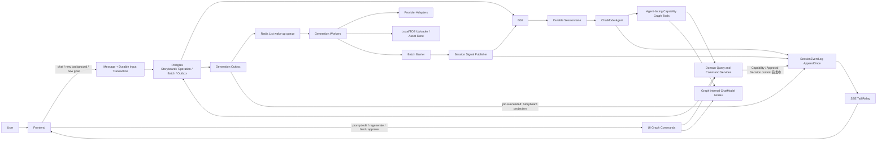
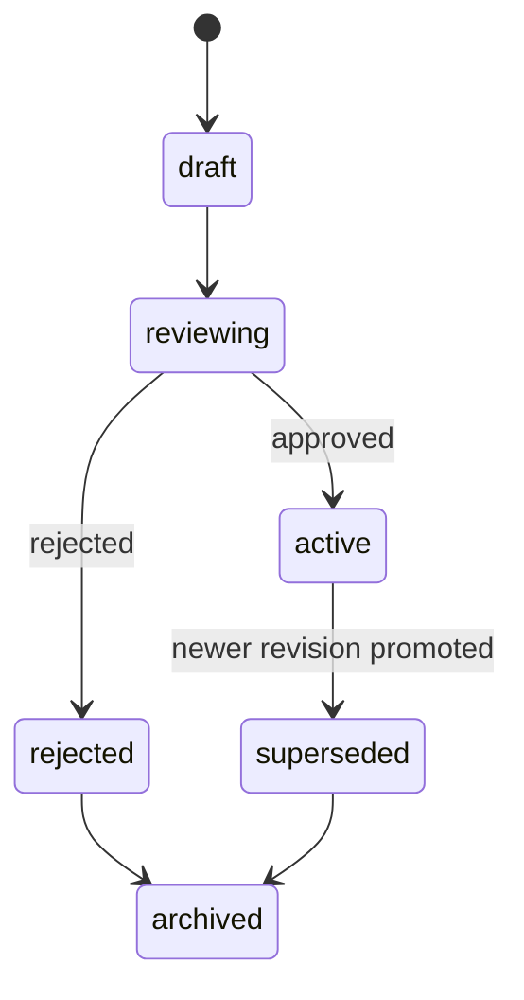

# AIGC Tool 编排与动态故事板详细设计

> 状态：Current Implementation + Target Gaps
> 日期：2026-07-12
> 适用范围：Dora Agent 的 Agent Tool、UI 定向操作、Graph 内部节点、动态故事板、媒体生成衔接
> 关联文档：[AIGC ChatModelAgent Demo 详细设计](./aigc-chatmodelagent-demo-design.md)、[AIGC Generation Worker 详细设计](./aigc-worker-design.md)

## 1. 文档目标

本文档同时记录 Dora Agent 当前可运行实现和后续目标。凡标记为“待实现”的能力不得作为当前运行保证；README 只描述已经可运行的行为。当前部署定位是受信本地 Demo，不具备面向公网的真实登录鉴权、租户授权和接口限流。本地验收保留 DeepSeek 与真实 Image2：Image2 结果解码后走本地素材链路；Seedance、Audio 和 Assembly 可使用占位实现，不要求真实视频/音频合成、拼接或转码。

文档解决以下问题：

1. Agent 到底可以调用哪些 Tool，哪些能力只能在 Graph 或 Worker 内部使用。
2. 提示词生成应该作为 Tool，还是作为 Graph 内部 ChatModel 节点。
3. 故事板如何根据用户场景动态创建模块，而不是预先枚举所有业务元素类型。
4. 如何区分“整体重新规划故事板”和“对当前元素做局部操作”。
5. 图片、视频、音频等长任务如何与 Worker、对象存储、费用和 Storyboard 回填衔接。
6. 用户编辑发生在生成期间时，如何防止旧 Job 覆盖新提示词或新资产。
7. 如何让前端持续收到确定性的进度、Patch、候选资产和审核请求。

## 2. 文档边界和优先级

三份设计文档分别负责不同边界：

| 文档 | 负责边界 |
| --- | --- |
| 本文档 | Tool 暴露面、Graph 节点、动态故事板、版本与依赖语义、局部操作 |
| `aigc-worker-design.md` | Batch/Job、可靠队列、Provider、对象存储、Finalization、费用、Batch Barrier |
| `aigc-chatmodelagent-demo-design.md` | ChatModelAgent、Runner、自研 Durable Session lane、Middleware 和 A2UI |

如果出现交叉问题，使用以下规则：

1. 异步执行和 Job 成功边界以 Worker 设计为准。
2. Agent Tool Registry 和 Storyboard 语义以本文档为准。
3. Agent 运行、会话输入和 UI 投影以 ChatModelAgent 设计为准。

### 2.1 实施状态总览

| 能力 | 状态 | 当前实现边界 |
| --- | --- | --- |
| 五个 Agent Capability Tool | 已实现 | Runner fail-closed 固定注册并校验恰好五个：`analyze_materials`、`plan_creation_spec`、`plan_storyboard`、`generate_media`、`assemble_output`；不存在旧 Agent Registry 工厂。 |
| Skill 渐进加载 | 已实现 | 每个 Agent run 调用 `SkillBackend.List`；空列表不注入 Eino Skill 指令或 `skill` loader，导入后下一 turn 在同一 Runner 生效；loader 的内部 progress/error 不进入用户 `tool_runs`。 |
| Capability Graph 外壳 | 已实现 | 每个 Tool 预编译为 `validate_request → execute_capability → validate_result` 的 bounded Eino Graph。 |
| 内部 ChatModel 推理 | 已实现 | `prepare_messages → chat_model → decode_json` 是显式 Eino 子图；Creation Spec 使用精确字段 schema，持久化前最多重试一次且失败无写副作用；Storyboard 规划与 Prompt 生成仍走各自严格领域校验。 |
| Spec/Storyboard/Candidate 审核 | 已实现 | Spec/Storyboard 保留系统 chat Approval，同一 Session 只允许一个可操作审核并按流程串行；系统 Approval 存在时抑制模型重复预览。Candidate 每项仍创建 durable Approval，但素材预览与统一确认只在左侧 Storyboard，相关 Job 全终态后一次冻结并批准精确候选批次。 |
| 动态 Storyboard | 已实现 | Active/Pending Revision、动态 Module/Element/数量、Dependency DAG、PromptSlot、AssetSlot、Binding 和稳定 ID；`ResolveGenerationInput` 是派发/Finalization/候选审批的单一语义源。 |
| 局部操作 | 已实现 | Prompt 直接替换、上传资产填充、局部重生成、候选资产审核、整板 Replan；AI Prompt Rewrite 尚未接入 UI Command。 |
| Operation/Batch/Job | 已实现 | 创建时与 generation Outbox 同事务；Worker、Barrier、费用和 Session Signal 均使用持久化状态。 |
| Operation 控制 | 已实现 | 非终态 Operation 可取消；`retry_failed` replay-first，只为仍语义有效的 provider/transient 失败 Job 创建新的 recovery Operation/Batch/Jobs，不回退原终态。 |
| Provider | 部分实现 | 本地验收配置 `DORA_IMAGE2_API_KEY` 使用真实同步 Image2 Adapter；Seedance 可留空并生成确定性 MP4 占位 Asset，音频生成 Demo WAV，Assembly 生成 Demo JSON manifest。真实 Seedance Key 仍支持持久化 Submit/Poll/Cancel。 |
| Batch 回流 | 部分实现 | 正常媒体/装配 Batch 使用 `on_failure`；每次 `generate_media`/`assemble_output` 在 chat 只维护一张稳定高层 ToolRun，终态 `refresh_resources` 刷新左侧 Storyboard/Assets/Jobs。Barrier 已把完整不可变 `PostBatchPayload` 写入 Operation、terminal outbox 与 durable `BatchContinuationResult.Result`，只有失败类终态按需启动 Agent 解释。没有独立 Stage Ledger、ToolOperationResult 或 PostBatchContinuation Graph。 |
| UI 事件 | 部分实现 | 严格 A2UI 1.0/known-action parser 与整包 fail-closed 不变；模型外层 normalizer 只提取单个顶层对象并做极有限闭合符修复。Operation/Batch/Job 及逐 Job `status_version` 仍在 Store/read model，chat 不展开 Operation/Job/Stage 多卡、逐 Job 节点或素材预览；尚无全域 Projector/Inbox。 |
| 队列 | 部分实现 | 当前 Redis List/BLPOP 仅作唤醒传输，Postgres Job + Outbox + Recovery Scheduler 保证恢复；Generation/Approval Outbox 已有 attempts 和指数退避，普通事件 10 次后 dead，`batch.finalize_requested` 持续重试，尚无 publisher claim lease、dead-row 管理 API 和 Redis Streams/ACK/Reclaim。 |
| Durable Turn 因果与 receipt | 已实现 | 已启动输入保持 Session HOL；消息按 RunID 因果分组和冻结边界重建；外层 Agent Model receipt、完整 Turn output receipt、稳定 ToolCall 幂等和 durable terminal error 已接入。 |
| Artifact 审核 receipt | 已实现但入口有限 | Artifact Review 命令以 first-write-wins receipt 与生命周期同事务提交，防止旧版本重放回滚新 Active；当前 `assemble_output` 主流程仍不自动创建 Export Result Approval。 |

### 2.2 本地 Demo 的 Tool/Worker 边界

本地 Demo 仍完整执行五个 Agent-facing Tool、Capability Graph、durable Approval、Operation/Batch/Job、Worker、Finalization、Batch Barrier 和 A2UI/SSE。差异只在 Worker-only Provider/Storage Adapter：

- 当前本地验收样例落盘真实 Image2 图片、确定性 MP4、Demo WAV 和 JSON manifest。Agent 不能选择或覆盖这一 Provider 策略。
- `assemble_output` 的成功只表示装配计划经过同一持久化链路收尾，不表示真实成片已经合成或转码。
- `DORA_LOCAL_ASSET_DIR=.local/aigc-assets` 使 Uploader 落盘，Asset URL 使用 `/api/aigc/local-assets/<object-key>`；本地不需要 TOS。Image2 Key 必须保留，Seedance Key 可留空。
- PostgreSQL、Redis、DeepSeek Key 和 Image2 Key 是当前验收流程的必需依赖；占位 Provider 不是离线 ChatModel。

## 3. 强制设计决策

以下决策是实现时必须遵守的约束：

1. Agent 只调用高层、用户可感知的 Capability Graph Tool。
2. 业务查询、业务写入、权限、费用、资产和用户数据能力只能在 Graph 内部使用，不能独立注册给 Agent。
3. `plan_storyboard` 只负责首次创建或整体重新规划，不能承担元素级 Prompt 编辑或定向重生成。
4. 用户在左侧故事板修改提示词或点击重新生成时，前端直接调用 UI Graph Command，不先转换为普通聊天消息，也不依赖 Agent 再决定是否执行。
5. `prepare_prompts` / `write_the_prompt` 不进入 Agent Tool Registry。提示词生成是元素规划之后的独立 Graph 内部 ChatModel 节点。
6. 图片、视频、音频 Provider 只作为 Worker-only Adapter，不注册给 Agent，也不由 Agent 选择 Provider 原始参数。
7. Graph 是有界执行：长媒体任务创建 Operation、Batch、Job 和 Outbox 后立即返回 `accepted`，不得在 Graph 内阻塞等待 Provider。
8. Postgres 是 Storyboard、Prompt、Asset Binding、Approval、Operation、Batch、Job 和 Event 的业务真源。
9. Storyboard 的语义模块、元素类型、字段和数量由 LLM 根据场景推理；后端只固定最小协议、生命周期和确定性校验。
10. 所有目标使用稳定 ID。Job、Approval、UI Command 不得长期引用数组下标。
11. 所有写操作必须经过版本校验和幂等。当前 Transactional Outbox 覆盖 generation，并承载 Worker Finalization 后的 Storyboard 投影；Candidate chat Approval 不再投影。Spec/Storyboard 创建卡和 Decision 仍在业务事务后直发，统一领域 Projector/Inbox 属于后续目标。
12. 旧资产和旧 Storyboard Revision 保留可追踪，不因为重规划或重生成直接物理删除。
13. Approved ApprovalContinuation 只允许服务端 directive 指定的一个 Capability；本 Turn 完成后不得继续串联第二个 ToolCall，下一阶段必须等待新的 durable event。
14. `ResolveGenerationInput` 是 Prompt、Dependency Asset 和 InputFingerprint 的唯一解释器；dispatch、Finalization 与 Candidate Approval 不得复制或放宽其语义。

## 4. 总体架构



核心职责：

- Agent 决定何时进行整体规划、何时推进正常生产。
- 前端决定具体编辑哪个 Prompt、重新生成哪个目标，以及在相关 Job 全终态后何时统一确认当前候选批次。
- Graph 负责上下文加载、LLM 推理、校验、权限、版本、费用检查和持久化命令。
- Worker 负责 Provider、下载校验、对象存储、Asset、实际扣费、Storyboard 回填和 Job 终态。
- Batch Barrier 决定一组 Job 何时达到业务终态并产生唯一 terminal outbox；当前发布器直接幂等写入 `BatchContinuationResult` Durable SessionInput，再按需启动一次 Agent 解释。

## 5. 四种调用面

| 调用面 | 调用者 | 实现形态 | Agent Registry | 用户感知 |
| --- | --- | --- | --- | --- |
| Agent-facing Graph Tool | ChatModelAgent | Eino Tool 外壳 + 预编译 Graph/Workflow | 注册 | 媒体/装配仅展示单张高层 Capability ToolRun |
| UI 定向 Command | 前端确定性操作 | 当前为 HTTP Command + Domain Service；后续可按需要抽成 Graph | 不注册 | 展示目标操作状态 |
| Graph-internal Node | Capability Handler | 当前 ChatModel 是显式子图，其他 Query/Command 是 typed Go/Domain Service | 不注册 | 默认不单独展示 |
| Worker-only Capability | Worker | Provider/Storage/Media Adapter | 不注册 | 只通过领域事件展示 |

“用户可感知”与“Agent 可调用”不是同一个概念。局部重生成是用户可感知流程，但它由前端直接调用，不需要开放给 Agent。

## 6. Tool 元数据

当前 `ToolMeta` 只有 Category、StageHints、OutputKinds 和 Provider。目标设计建议扩展为：

```go
type ToolMeta struct {
    Key            string
    Exposure       string // agent, ui, graph_internal, worker
    Execution      string // bounded_sync, async_dispatch, worker
    UserVisible    bool
    Billable       bool
    SideEffect     string // none, db_write, external
    PublicStageKey string
    OutputKinds    []string
}
```

这些元数据服务于注册校验、权限、可观测性和 UI 投影，不由 LLM 自由填写。

## 7. Agent-facing Graph Tool 清单

当前生产 Agent Registry 精确包含五个高层 Tool。Runner 不接受可变 `ToolKeys`，并在启动时校验 Registry 数量和固定 key 集合，缺失或混入任何 Tool 都 fail closed。

| name | description | 目的 | 执行方式 |
| --- | --- | --- | --- |
| `analyze_materials` | 分析用户文字、文件名、MIME、URL 和可信 metadata，保存版本化摘要；当前不读取图片、PDF、音视频二进制内容。 | 建立可追踪的素材清单事实 | 有界同步 |
| `plan_creation_spec` | 根据用户背景、创作目标、受众、时长、画幅、叙事、视觉、声音和模型偏好创建或修订完整创作规范。 | 维护全局创作约束 | 有界同步 + 审核 |
| `plan_storyboard` | 根据已确认创作规范创建完整动态故事板 Revision；元素规划只输出 Module/Element、数量、内容、PromptSlot purpose、AssetSlot 与 Dependency，不输出 Prompt 文本。领域层修复缺失/重复标识后，独立内部 ChatModel 节点为所有 Provider-backed 槽统一生成 Prompt；响应必须 exact-set 覆盖后才提交审核。仅用于首次规划或整体重规划，不能用于局部 Prompt 或资产编辑。 | 动态规划模块、元素数量、内容、Prompt 和依赖 | 有界同步 + 审核 |
| `generate_media` | 推进当前已确认故事板的正常生产，对 Active Revision 再做缺失 Prompt 安全补齐，并为下一可执行阶段创建图片、关键帧、视频或音频任务。 | 正常生产推进 | 异步派发 |
| `assemble_output` | 校验当前故事板和已确认资产，生成装配计划，并按输出类型创建预览或最终导出任务。 | 素材合成与导出 | 计划同步；渲染异步 |

部分旧 Tool 和 Media Graph 实现只保留为隔离测试素材；生产入口、HTTP 路由和 Redis 队列不再装配它们，也不存在把旧 Provider、CRUD、Prompt Tool 装配进 Runner 的旧 Agent Registry 工厂。`write_the_prompt`、`image2_generate_image` 和 `seedance_generate_video` 不属于生产 Agent Registry。

### 7.1 `analyze_materials`

推荐 ToolInfo description：

```text
Analyze the user's brief and trusted asset metadata, persist a versioned summary,
and explicitly report media that still requires multimodal/content extraction.
```

业务输入：

```go
type AnalyzeMaterialsIntent struct {
    AssetIDs     []string `json:"asset_ids"`
    Goal         string   `json:"goal"`
    Instruction  string   `json:"instruction,omitempty"`
}
```

该 Tool 只消费 `availability=available` 的 Asset，并把文字、文件名、MIME、URL 和可信 metadata 交给内部 ChatModel 子图。图片、PDF、视频和音频内容提取尚未接入；这类 Asset 会在结果中列入 `missing_inputs`，Tool 返回 `partial`，不会臆测二进制内容。

流程：

```text
validate_request
→ load and authorize available Asset metadata
→ internal model graph: prepare_messages → chat_model → decode_json
→ validate summary
→ save MaterialAnalysis Revision
→ validate_result
```

返回：分析 artifact 引用、版本、摘要、可复用资产 ID、缺失输入。大型原文和 Provider 原始结果不进入 Agent 上下文。

### 7.2 `plan_creation_spec`

推荐 ToolInfo description：

```text
Create or revise the complete creation specification from the user's background,
goal and confirmed material analysis. Produce a versioned candidate for review and
report whether the active storyboard requires whole replanning.
```

业务输入：

```go
type PlanCreationSpecIntent struct {
    Mode        string `json:"mode"` // create, revise
    Background  string `json:"background,omitempty"`
    Goal        string `json:"goal,omitempty"`
    Instruction string `json:"instruction,omitempty"`
}
```

流程：

```text
validate_request
→ for revise, load optional previous confirmed Spec (only spec.ErrNotFound means absent)
→ load optional material analysis (only artifact.ErrNotFound means absent)
  other storage/decode errors fail closed
→ internal model graph returns the exact Creation Spec field schema
→ decode and validate the complete candidate
→ retry once on the first model/decode/schema failure, before any write
→ save reviewing Spec Revision
→ create durable Approval and publish Approval card after commit
→ return waiting_user

later decide_approval
→ claim deterministic ApprovalContinuation
→ approved: ActivateCreationSpecRevision
→ rejected: RejectCreationSpecRevision
```

精确 schema 字段为 `title/video_type/target_audience/output_language/duration_seconds/aspect_ratio/narrative_driver/visual_style/sound_style/model_preference/markdown/fields`；字段不得改名、缩写或由解释文本替代。领域校验至少要求非空 `title/video_type`、正整数 `duration_seconds`，以及视觉内容的非空 `aspect_ratio`。首次模型、JSON 解码或 schema 校验失败后最多再调用一次内部模型；候选通过前不保存 Spec、不创建 Approval、不写对应 Outbox，两次失败直接返回且无持久化副作用。

只要故事背景、创作目标或全局约束发生结构性变化，结果必须明确返回 `storyboard_replan_required=true`，由 Agent 再调用 `plan_storyboard(mode=replan)`。

### 7.3 `plan_storyboard`

推荐 ToolInfo description：

```text
Create a complete dynamic storyboard revision from the confirmed creation
specification. Use only for initial planning or whole-storyboard replanning.
Infer the required modules, element counts, element contents, prompt purposes and
dependencies. Prompt text is generated by a later internal model node. Never use
for local target, prompt or asset edits.
```

业务输入：

```go
type PlanStoryboardIntent struct {
    Mode                   string `json:"mode"` // create, replan
    Instruction            string `json:"instruction,omitempty"`
    PreserveApprovedAssets bool   `json:"preserve_approved_assets,omitempty"`
}
```

Agent schema 中禁止出现：

- `target_id` / `target_ids`
- `scope`
- `patch`
- 数组下标路径
- Provider 参数

流程：

```text
validate_request
→ require confirmed Creation Spec
→ load optional material analysis (only artifact.ErrNotFound means absent; other errors fail closed)
→ load current Storyboard/Active Revision; AggregateNotFound creates a new aggregate, other errors fail closed
→ element-planning model graph: prepare_messages → chat_model → decode_json
   (declare PromptSlot purpose only; prompt text is forbidden)
→ allocate unique candidate Module/Element IDs and Module/Element/AssetSlot keys when missing or duplicated
→ normalize and validate dynamic Modules, Elements, PromptSlots, AssetSlots and Dependency DAG
→ reject any AssetSlot.media_kind outside the closed domain set before persistence
→ scan every registered-Provider AssetSlot regardless of model-provided requires_prompt
→ independent prompt model graph fills every target_id/purpose Prompt in one unified pass
→ require an exact one-to-one response set; empty, omitted, duplicated or extra entries fail the whole plan before persistence
→ compute RevisionDiff and save complete Pending Revision with CAS/domain event
→ create durable Approval and publish Storyboard/Approval cards after commit
→ return waiting_user

later decide_approval
→ claim deterministic ApprovalContinuation
→ approved: PromoteStoryboardRevision
→ rejected: RejectAndArchivePendingRevision
→ UPSERT stable ApprovalContinuationResult and start a fresh trusted-system Agent turn
```

若 replan 选择 `preserve_approved_assets=true`，审核期间旧 Active Revision 仍可能接收已在途 Job 的成功结果。Promotion 的最终 CAS 会重新读取旧 Active Revision，把这期间新激活且目标/Prompt/Slot/Dependency 仍兼容的 Binding rebase 到 Pending Revision；依赖签名变化的槽不会误复用，而是推进 GenerationEpoch 并保持 stale。

输出必须包含完整候选 Revision，以及：

- `added_targets`
- `updated_targets`
- `reused_targets`
- `archived_targets`
- `reusable_assets`
- `stale_outputs_after_promotion`

未审核通过之前，不得替换 Active Revision，也不得自动创建付费媒体任务。

### 7.4 `generate_media`

推荐 ToolInfo description：

```text
Advance normal production for the active storyboard. Deterministically select the
next eligible production stage, reuse or prepare missing prompts internally, bind
compatible existing assets, and dispatch durable media jobs. Do not use for a
targeted regeneration requested from the storyboard UI.
```

业务输入：

```go
type GenerateMediaIntent struct {
    Phase  string `json:"phase"`  // auto_next, element_images, keyframes, videos, audio
    Policy string `json:"policy"` // single_next, all_eligible
}
```

Agent 不提供目标 ID。当前实现根据 Active Storyboard、Pending 审核状态、Dependency DAG、Slot 状态、候选/在途 Job 和媒体阶段顺序选择目标；没有独立持久化 Stage Ledger。

派发前流程：

```text
validate_request
→ reject when a Pending Storyboard Revision exists
→ fill missing/stale unlocked Prompt through the internal ChatModel subgraph
  (response must exactly cover requested target_id/purpose pairs; empty, partial, duplicate or extra entries fail)
→ re-check user locks before each CAS update so a concurrently locked Prompt is never overwritten
→ skip Candidate/Active/in-flight slots
→ ResolveGenerationInput from Dependency DAG and compute InputFingerprint
→ select the earliest eligible media rank for auto_next
→ create Operation + Batch + Jobs + generation Outbox transactionally
→ return accepted; no eligible target is classified and frozen as completed/no_op
```

空选择不能使用笼统 reason，也不能由 Agent 猜测已完成。当前协议只接受：

- `waiting_candidate_approval`：存在 Candidate/CandidateIDs，等待用户审核；
- `generation_jobs_in_flight`：至少一个非 Assembly 媒体 Job 尚未终态；
- `dependency_blocked`：依赖、Prompt 或未知槽状态阻止继续；
- `production_complete`：无 Candidate/在途 Job，且全部 required/Provider-backed 生产槽都有匹配的 Active Binding；
- `no_targets_for_requested_phase`：存在 ready 生产目标，但与显式请求 phase 不匹配。

Capability 以调用 idempotency key 保存 `generate_media_noop_receipt`，冻结 intent fingerprint、Storyboard ID/version、`completed/no_op` 和 reason。同键重放只读该 receipt；参数或 receipt 内容变化返回 conflict。`auto_next` 若分类仍发现 ready target，却被选择器遗漏，必须 fail closed，不能返回 no-op。

异步初次返回：

```json
{
  "status": "accepted",
  "operation_id": "op_xxx",
  "batch_id": "batch_xxx",
  "stage_run_id": "stage_xxx",
  "selected_targets": ["element_hero"],
  "job_count": 1
}
```

Graph 返回后即结束。Provider 完成、资产上传和 Storyboard 回填由 Worker 完成。

### 7.5 `assemble_output`

推荐 ToolInfo description：

```text
Validate the active storyboard and confirmed assets, build a versioned assembly
plan, report missing dependencies, and optionally dispatch a preview or final
render for the requested output type.
```

流程：

```text
LoadCreationContext
→ ValidateAssemblyReadiness
→ BuildTimelineOrOutputManifest
→ Save immutable Assembly Plan Artifact
   derived_from = {storyboard aggregate version, confirmed spec version}
   content = full manifest, active bindings, output type, instruction, mode, missing dependencies
→ Branch
    validate/plan + ready → completed
    any required missing/candidate/stale → partial + missing_dependencies; no dispatch
    preview/export + ready → CreateOperationBatchJobsAndOutbox from frozen plan → accepted
```

除纯 `validate` 外，幂等重放先读取已经保存的 Assembly Plan Artifact，并核对 session/kind/creator/mode，不能用当前 Storyboard 重建 manifest。Assembly Job Payload 携带该冻结 manifest；BindingToken 同时冻结 SpecVersion、AggregateVersion 和 manifest fingerprint，任一整体输入变化都使旧装配结果 superseded。

## 8. UI Graph Command 清单

这些操作来自左侧故事板中的确定目标，不进入 Agent Tool Registry。

| command | description | 是否调用 LLM | 是否异步 |
| --- | --- | --- | --- |
| `update_target_prompt` | 直接替换指定元素 Prompt，递增 PromptRevision 并传播 stale | 否 | 否 |
| `regenerate_target_media` | 使用当前确认 Prompt 为指定资产槽位生成新的候选资产；Prompt 缺失时直接拒绝 | 否 | 是 |
| `bind_target_asset` | 将用户已有资产绑定到指定目标和资产槽位 | 否 | 否 |
| `decide_approval` | 确认或拒绝 Spec、Storyboard Revision | 否；执行冻结的 deterministic continuation | Decision 同步，Continuation 可由 relay 补执行 |
| `approve_candidate_batch` | 相关 Job 全终态后一次确认当前 Storyboard 的所有 pending Candidate | 否；冻结精确子 Approval 集合并逐项执行原 durable Decision | 同步返回逐项 200/207；同键重试恢复未完成项 |
| `control_generation_operation` | 取消原 Batch，或以 `retry_failed` 为有效失败 Job 创建新的 Recovery Operation/Batch/Jobs | 否 | 请求同步返回；Worker 异步执行 |

### 8.1 `update_target_prompt`

请求：

```go
type UpdateTargetPromptCommand struct {
    StoryboardID    string
    ExpectedVersion int
    TargetID       string
    TargetRevision int
    PromptRevision int
    Purpose        string
    Prompt         string
    PromptRef      string
}
```

流程：

```text
Authorize
→ LoadExactTarget
→ Validate Aggregate, Target and Prompt revisions
→ replace PromptSlot content
→ LockUserEditedPrompt
→ MarkPromptDerivedOutputsStale
→ Save Aggregate + DomainEvent with CAS
→ Return new versions
```

该命令不改变模块结构和元素数量，不调用 `plan_storyboard`。AI 定向改写当前尚未接入该 HTTP Command。整体规划时，`plan_storyboard` 会在保存 Pending Revision 和创建 Approval 前通过内部 ChatModel 子图补齐缺失 Prompt；`generate_media` 还会对已批准 Active Revision 执行安全补齐。定向 `regenerate_target_media` 不调用 LLM，Prompt 缺失时返回冲突。

### 8.2 `regenerate_target_media`

请求：

```go
type RegenerateTargetMediaCommand struct {
    StoryboardID          string
    BaseVersion          int
    ModuleID             string
    TargetID             string
    AssetSlot             string
    MediaKind             string
    ExpectedTargetRevision int
    ExpectedPromptRevision int
    Instruction          string
    IdempotencyKey       string
}
```

流程：

```text
Authorize
→ LoadExactTargetAndSlot
→ ValidatePromptAndReferences
→ IncrementGenerationEpoch
→ persist RegenerationDispatchSnapshot in the same Storyboard DomainEvent
→ CreateOneScopeOperationBatchJobsAndOutbox from that frozen snapshot
→ Return accepted
```

`RegenerationDispatchSnapshot` 冻结 Provider、媒体类型、用户、Spec/Storyboard 版本、估算费用、解析后的 GenerationInput 和 Provider Payload。HTTP 响应丢失后，服务端先按幂等键读取已存在 Recovery Workflow；若只提交了 Storyboard Command，则从该 DomainEvent 的 snapshot 继续派发，不能根据已经变化的 Storyboard 重新构造输入。重新生成只创建 Candidate Asset，旧 Active Asset 在候选通过审核前继续保留。

### 8.3 `bind_target_asset`

流程：

```text
upload through `/api/aigc/assets` when the user selects a local file
→ AuthorizeAssetOwnership
→ ValidateAssetKindAndRequirement
→ ValidateTargetVersion
→ Bind and activate the user-selected Asset
→ MarkDependencyClosureStale
→ Save Aggregate + DomainEvent with CAS
```

手工绑定和 Worker 回填必须经过同一个 Storyboard Command Service，不能分别实现不同的版本规则。

动态 Storyboard 槽位内可直接选择本地文件：先以 multipart 调用 `/api/aigc/assets` 写入对象存储和 available Asset，再携带 Aggregate/Target/Prompt/GenerationEpoch 栅栏调用 bind endpoint 并激活用户选中的 Binding。两步是独立 HTTP 提交；存在 Pending Revision、Asset 类型不匹配或任一版本过期时绑定被拒绝，已经上传的 Asset 仍保留在素材库。动态 Storyboard 的 Active/Candidate 音频与显式 A2UI `AudioPreview` 使用原生 `<audio controls preload="metadata">` 播放器；通用聊天附件和旧 Storyboard 音频层仍只按普通文件展示。

### 8.4 `decide_approval`

Approval 必须绑定：

```text
approval_id
artifact/revision/asset id
storyboard version
target revision
prompt revision
generation epoch
decision version
```

如果用户提交时版本已变化，Approval 进入 `stale`，返回最新快照，不能恢复旧状态并覆盖新编辑。

### 8.5 当前 Approval 模式

生产主路径统一使用 durable Approval：

| Artifact | Checkpoint | 决策后的执行 |
| --- | --- | --- |
| Creation Spec / Storyboard Revision | 无 | `ApprovalContinuation` 执行冻结的 Activate/Promote 或 Reject Command；提交后 UPSERT stable ApprovalContinuationResult，以 trusted system event 启动新 Agent Turn。 |
| Candidate Asset | 无 | 每项仍由 `ApprovalContinuation` 激活 Candidate Binding；UI 通过 Storyboard 级批次统一批准，服务端逐项复用同一 stable Result/Command Ledger。 |

当前五个 bounded Capability Graph 不在审核点调用 `compose.Interrupt`，因此 Spec/Storyboard/Candidate 审批不会恢复原 Tool 调用栈。冻结命令 applied 后，Approval Relay 幂等 UPSERT `approval:<id>:continuation-result:<decision_version>`；Session lane 以可信 system 内部事件开启新的 Agent Turn。Approved Turn 不让模型自由选择下游：Creation Spec v1/v2+ 分别固定 `plan_storyboard(create)` / `plan_storyboard(replan,preserve_approved_assets=true)`；Storyboard/Candidate 从冻结 command result 中读取最终 Aggregate，仅当无 Candidate 且全部 Provider-backed/required 生产槽都有匹配 active Binding 时固定 `assemble_output(preview,video)`，否则固定 `generate_media(auto_next,all_eligible)`。中间件只执行这一条受信 ToolCall，完成后的任意额外 ToolCall 都转换为 strict A2UI stop card。Rejected/stale/expired 只解释或重新规划，绝不伪造用户消息。通用 Runner 的真实 interrupt 已接入生产 durable SessionInput：`messages/resume` 在 Runtime 配置下只验证 mapping 并持久化确认 Message + `ResumeRequested`，由 Session Runtime 串行恢复 Runner。Approval-bound mapping 禁止走 generic resume，仍必须通过 Approval Decision 路由。无 Runtime 的 HTTP 直连 Resume 只保留为测试兼容路径。

Spec/Storyboard 的系统 Approval Card 必须携带 `data.approval_id`，可用 Markdown 展示 Revision 详情，但不能把 Markdown 文案当作交互。当前 A2UI 不提供独立 Button 组件；权威卡使用 required `SingleChoice(decision)` 展示“确认/拒绝”，再由 Card 的统一提交控件触发单项 Decision API。同一 Session 同一时刻最多存在一张可操作的 Spec/Storyboard Approval，Spec 决定完成后才能发布 Storyboard 审核；系统 Approval 存在时必须抑制模型对同一候选生成的预览卡，避免并行确认入口。普通聊天消息和无 `approval_id` 的 A2UI 表单只进入 UserMessage 路径，即使内容恰好为“确认”也不改变 Approval。`waiting_user` 后模型不得生成“请回复确认/输入确认”或自行拼装审核控件；模型最终 ActionEnvelope 若包含这种伪入口，必须在持久化和发布前 fail closed，并只允许有界纠错重试。

当前规则：

1. 创建 Approval 时冻结 Artifact/Storyboard/Target 版本以及 approve/reject Command；Spec/Storyboard 初始卡在 Approval 提交后直接 AppendOnce，且卡片携带 `approval_id` 并使用 `SingleChoice + Card submit`。发布前按 Session 校验不存在另一张可操作 Spec/Storyboard Approval；系统卡存在时抑制同候选模型预览。Candidate Approval 不发布 chat 卡，`job.succeeded` 只触发左侧资源刷新。
2. Spec/Storyboard 调用单项 `decide_approval`。Candidate 由左侧 Storyboard 在相关 Job 全终态后一次调用 `candidate-approvals/decision`，仅支持 `approved`；服务端先按 Storyboard version + 幂等键冻结精确 `(approval_id,binding_id,expected_decision_version)` 集合，再逐项执行原 Decision。
3. Decision 请求使用稳定幂等键；`ApprovalContinuation` 以 `(approval_id, decision_version)` 唯一，executor 为 `deterministic_continuation`。
4. Continuation claim 后重读决定和当前版本，执行冻结 Command，并以 Command Ledger/领域 receipt 防止重复 Activate/Promote/Reject。若领域提交后、外层 ledger 尚未落库就崩溃，重试会检查 Spec 状态、Storyboard command receipt 或 Artifact review receipt，确认已提交后只补写 ledger/continuation applied。
5. 冻结 Command applied 后 UPSERT stable `ApprovalContinuationResult`；若 Enqueue 失败，Approval Outbox 保持 pending，重放只补输入而不重跑命令。新输入开启 fresh Agent Turn，不 Resume 原 Runner checkpoint。
6. Continuation claim 带 `LeaseOwner/LeaseUntil`。有效 lease 被其他执行者持有时，`Apply` 返回未取得执行权；Session Runtime/Relay 延后到 lease 到期后再试，不把协调等待算作普通错误，也不确认 outbox 或发布成功。真正执行失败才保存 `failed` 并允许同一 executor/epoch 再次 claim；Relay 对每行错误隔离，按 AvailableAt 指数退避，累计 10 次后标记 dead，同时继续扫描其他到期行。
7. Spec/Storyboard Decision A2UI 使用稳定 `approval_id + decision_version`，只包含该决定冻结的 status/version；决定后的可变 Storyboard 快照使用包含 Aggregate Version 的独立事件 ID。Candidate 批次只发布 Storyboard + batch summary，不发布单项 chat Decision。两者都不是全域领域 Projector。
8. Candidate 批次每个子决定使用稳定 child idempotency key；中途失败返回逐项结果和 HTTP 207。同一批次键重试只继续冻结目标，不重新扫描并混入新 Candidate。
9. 若未来让某个 Capability Artifact 使用真实 Interrupt，必须复用已经持久化的 mapping/ResumeRequested/Session Runtime 链路，并补齐 Approval executor/outer-inner checkpoint 契约，不能只把 `review_mode` 字段改成 `interrupt`。

CheckpointMapping 状态不是一个模糊的“已恢复”布尔值：`resume_queued` 只表示 durable Resume 输入已排队，外部 Runner/Graph 尚未执行；`resuming` 表示 Session Runtime 已 claim、调用进行中。进程若停在 `resuming`，同一 InputID/TurnID 允许 at-least-once replay，Tool/Command 通过稳定幂等键吸收重复。Runner 输出先冻结；Approval-bound Resume 在投影前 Apply Continuation，遇到有效 lease 则保持 `resuming` 并重试，不发布完成进度。Apply 与输出投影都成功后才进入 `resume_applied`，此时只剩最终完成回执；`resumed` 才表示回执完成。`resume_applied` 重放只能补回执和 `a2ui.interrupt_resolved`，不能再次执行外部 Resume。

当前审核契约：

| Artifact | review_mode | approve command | reject command |
| --- | --- | --- | --- |
| Material Analysis | `none` | 保存后直接成为最新分析事实 | 不适用；用户可通过新素材重新分析 |
| Creation Spec | `durable` | `ActivateCreationSpecRevision` | `RejectCreationSpecRevision` |
| Storyboard Revision | `durable` | `PromoteStoryboardRevision` | `RejectAndArchivePendingRevision` |
| 用户直接 Prompt Edit | `none` | 用户保存即生效 | 不适用 |
| AI Prompt Rewrite | 待实现 | 当前 UI Command 只支持直接替换 | 不适用 |
| Candidate Asset | `durable` | `ActivateArtifactBinding` | `RejectArtifactBinding` |
| Assembly Plan | `none` | 保存后成为当前计划 | 不适用 |
| Preview/Export Demo manifest | `none` | Worker 自动完成并保存 manifest Asset | 不适用 |

当前 Artifact Store/ApprovalRuntime 同时实现了 receipt-backed `export_result` 审核命令能力，但主 `assemble_output(preview/export)` ingress 仍按上表自动保存 Demo manifest，不创建该 Approval。`aigc_artifact_command_receipts` 在 Artifact 生命周期事务内 first-write-wins 地冻结 idempotency key、session、kind、artifact/version、预期 `reviewing`、approve/reject、`require_latest` 和结果快照：首次执行用 latest fence 拒绝旧候选；一旦旧 A 的命令已提交，之后新 B 激活也不会让 A 的重放重新激活 A，重放只读取 A 的不可变 receipt 补外层 Continuation ledger。

所有 durable 决策均执行 `ClaimApprovalContinuation → ReloadApprovalDecisionAndVersions → Branch`。Rejected、stale 和 cancelled 分支永不执行 Promote/Activate。

### 8.6 `control_generation_operation`

前端高层 Capability ToolRun 通过 `operation_id` 在非终态显示“取消任务”，在 `failed/partial_failed` 显示“重试失败项”：

```text
cancel
→ CancelBatch on the original Operation.BatchID
→ cancel queued jobs immediately; best-effort cancel submitted provider tasks
→ Barrier publishes the eventual cancelled terminal state

retry_failed
→ lookup recovery by request idempotency key before any mutable preflight
→ exact replay returns the frozen recovery workflow
→ read the original Operation/Batch/Jobs
→ keep only status=failed + error_stage=provider + ProviderErrorRetryable=true
→ require SpecVersion and BindingToken to still match current state
→ exclude superseded/orphaned results
→ create a new <kind>_recovery Operation + Batch + Jobs
→ leave the original terminal workflow immutable
```

两种动作都通过 `/api/aigc/sessions/:session_id/generation-operations/:operation_id/control` 提交稳定幂等键。当前 retry 使用持久化 `ErrorStage` 和统一 Provider 错误分类器筛选 transient/provider 失败；新 Job 会重新执行完整 Provider 流程，Finalization-only Recovery 仍是目标。已终态 Batch 的 cancel 是幂等 no-op，HTTP 仍返回 202。前端已把 `cancelling` 映射为“取消中”并纳入 in-progress 状态。

## 9. Graph 内部节点清单

当前实现需要区分“实际 Eino Node”和 `execute_capability` Handler 内的逻辑操作：

```text
每个 Agent-facing Capability Graph
START → validate_request → execute_capability → validate_result → END

共享内部 ChatModel 子图
START → prepare_messages → chat_model → decode_json → END
```

只有上述六类名称是当前实际编译的 Eino Node。下面的 Query、Guard、Validator 和 Command 名称用于描述 Handler 内部职责或后续拆分目标，当前并不分别出现在 Graph 拓扑中。

### 9.1 Query Node

| name | description |
| --- | --- |
| `LoadCreationContext` | 一次加载身份、分析、Spec、Active/Pending Storyboard、Stage、Approval 和 Operation 摘要。 |
| `LoadStoryboardScope` | 按稳定 ID 加载指定 Module、Element、Prompt、Asset Slot 和依赖。 |
| `FindReusableAssets` | 在用户和租户权限范围内按 requirement fingerprint 查找可复用资产。 |
| `LoadOperationAggregate` | 加载 Operation、Batch、Job 和 Tool Result 聚合状态。 |

### 9.2 Guard 和 Transform Node

| name | kind | description |
| --- | --- | --- |
| `AuthorizeCommand` | guard | 校验 actor、tenant、session 和 capability 权限。 |
| `CheckExpectedVersions` | guard | 在副作用前校验 Aggregate/Target/Prompt Version。 |
| `NormalizeCreationInput` | transform | 标准化用户目标、素材引用和输出偏好。 |
| `SelectNextEligibleTargets` | transform | 根据状态、依赖、审核和生产顺序选择下一批目标。 |
| `ReconcileSemanticIdentities` | transform | 对齐新旧 Revision，分类 reused/updated/added/archived。 |
| `ComputeAssetRequirementDiff` | transform | 计算 Pending Revision 的资产需求差异，但不修改 Active Requirement。 |
| `JoinPromptCandidates` | parallel_join | 后续可选拆分：若 Prompt 推理改为 fan-out，用于汇总并行结果；当前实现没有该独立步骤。 |

### 9.3 Inference Node

| name | Eino 类型 | description |
| --- | --- | --- |
| `InferMaterialAnalysis` | ChatModel | 根据文字和可信 Asset metadata 生成结构化摘要；多模态内容读取待实现。 |
| `InferCreationSpec` | ChatModel | 生成完整创作规范候选。 |
| `InferScenarioAndDynamicModules` | ChatModel | 根据场景动态决定需要的模块。 |
| `InferModuleElementsAndCounts` | ChatModel | 生成每个模块的元素数量和具体元素。 |
| `InferTargetPrompts` | ChatModel | 当前一次接收完整 target/purpose 列表，为所有 Provider-backed 槽统一返回 Prompt；空值、遗漏、重复或额外项任一出现则整次规划失败。 |
| `RewriteTargetPrompt` | ChatModel | 后续目标；当前 UI Prompt Command 不调用模型。 |

这些节点不是 Tool。LLM 只在 Graph 给定的上下文和输出 schema 内推理，不能绕过 Command Service 写业务数据。

### 9.4 Validator Node

| name | description |
| --- | --- |
| `ValidateProductionReadiness` | 返回 missing、stale、conflict 和 ready，不产生写操作。 |
| `ValidateAssemblyReadiness` | 校验 Active Revision、已确认资产和输出依赖。 |
| `CheckEntitlementsAndEstimateCost` | 校验权限、模型可用性、预计费用和当前余额，不接受客户端最终费用。 |
| `ValidateStoryboardCandidate` | 校验 ID 唯一、数量一致、引用完整、时间线合法、锁定约束和模块协议。 |
| `ValidatePromptCandidate` | 校验用途、引用标签、语言、品牌限制、Provider 限制和长度。 |
| `ValidateMutationPolicy` | 校验 actor 允许修改的字段和状态迁移。 |
| `ComputeDependencyImpact` | 根据确定性依赖图计算 stale 闭包。 |
| `ComputeInputFingerprint` | 对真正影响生成的输入生成稳定 hash。 |

LLM 可以提出变化，但失效范围、权限、费用和状态迁移必须由确定性节点计算。

### 9.5 Command Node

| name | description |
| --- | --- |
| `SaveMaterialAnalysisRevision` | 保存分析 Revision；当前没有该领域的 Transactional Outbox。 |
| `SaveCreationSpecRevision` | 保存 Spec candidate/active Revision。 |
| `SavePendingStoryboardRevision` | 保存完整 Pending Storyboard Revision 和 RequirementDiff，不覆盖 Active。 |
| `PromoteStoryboardRevision` | 当前审核通过后切换 Active Revision；完整 RequirementDiff 物化仍是后续目标。 |
| `AttachPromptRevision` | 保存 Prompt Artifact 并更新目标 Prompt Slot。 |
| `MarkDerivedOutputsStale` | 标记依赖闭包 stale，保留旧资产。 |
| `ApplyAssetRequirementDiff` | 只在 Revision Promote 或已批准的 Active Mutation 事务中创建、复用、取消资产需求。 |
| `BindAssetVersionToTarget` | 校验 token 后绑定候选或激活 Asset。 |
| `CreateGenerationOperation` | 原子创建 Operation、Batch、Jobs 和 dispatch Outbox。 |
| `CreateApproval` | 创建 durable Approval；Spec/Storyboard 卡当前事务后直发，Worker Candidate 只创建服务端 durable 行，不发布 chat 卡。 |
| `RecordApprovalDecision` | 持久化一次性审核决策。 |
| `SaveAssemblyRevision` | 保存装配计划和来源版本。 |

这些 Command 可以实现为少数领域服务，不需要每一项都创建 Eino Tool：

```text
CreationQueryService
CreationSpecCommandService
StoryboardCommandService
PromptService
GenerationOperationService
ApprovalService
AssemblyService
```

### 9.6 Worker-only Capability

| capability | 职责 |
| --- | --- |
| `ImageGenerationProvider` | 当前本地验收必须保留 Image2 Key，使用真实同步 Handler；`b64_json` 解码后通过本地 Uploader 持久化。无 Key 的 PNG fallback 仍存在，但不属于本轮真实 Image2 验收。 |
| `VideoGenerationProvider` | 有 Seedance Key 时持久化 submit/poll/cancel、ProviderTaskID 和下一次 Poll 时间；本地 Demo 无 Key 时同步写入确定性 MP4 占位 Asset。 |
| `AudioGenerationProvider` | 当前 Demo WAV Adapter；真实 TTS/音乐 Provider 待接入。 |
| `AssemblyProvider` | 当前生成 JSON assembly manifest；真实媒体渲染器待接入。 |
| `MediaFetcherProbe` | 下载、MIME、尺寸、时长、hash、可播放性校验。 |
| `ObjectStorage` | 使用确定性 object key 上传并返回 storage URI。 |
| `AssetFinalizer` | 幂等保存 Asset、绑定 token 校验和 Storyboard 回填。 |
| `BillingService` | 生成完成后的可信费用计算和幂等扣费。 |
| `BatchFinalizer` | Batch Barrier、积分汇总和单次 Session Signal。 |

## 10. Graph 节点类型和元数据

下面的统一节点类型是后续细化 Graph 时的目标元数据；当前外层 Graph 只使用 typed Lambda，内部推理子图使用 Lambda + ChatModel Node：

```go
type NodeMeta struct {
    Key          string
    Kind         string // guard, query, transform, inference, validator, branch, parallel_join, command, dispatch, interrupt, subgraph
    Visibility   string // internal, public_stage
    SideEffect   string // none, db, external
    RetryOwner   string // graph, worker, user, none
    PublicStage  string
}
```

| 节点类型 | 推荐实现 | 是否允许副作用 |
| --- | --- | --- |
| Guard | typed Lambda | 无；失败即终止或分支 |
| Query | typed Lambda | 只读 |
| Transform | typed Lambda | 无 |
| Inference | ChatModel Node | 不直接写业务数据 |
| Validator | typed Lambda | 无 |
| Parallel Join | Parallel/Subgraph + typed join | 无 |
| Command | typed Lambda + Domain Service | 数据库写入 |
| Branch | Graph Branch | 无 |
| Dispatch | typed Lambda | 只创建持久化任务和 Outbox |
| Interrupt | StatefulInterrupt Lambda | 当前生产 Capability 未使用；未来如启用必须同时接入 checkpoint/resume |
| Subgraph | AddGraphNode | 复用有界子流程 |

Worker、Finalizer 和 Batch Barrier 是运行时组件，不是 Eino Graph Node。全域 Event Projector 当前尚未实现。

Graph 使用固定拓扑并预先 `Compile`。动态模块、元素和作用范围放在 Graph State 中，不为每个用户临时编译一套 Graph。

```go
runnable, err := graph.Compile(ctx,
    compose.WithGraphName(toolKey),
    compose.WithNodeTriggerMode(compose.AllPredecessor),
)
```

当前 durable 审核不需要 Graph Checkpoint。Runner CheckPointStore 供生产 generic Runner interrupt 的 durable `/messages/resume` 使用，但不是 Storyboard 的长期存储；无 Runtime 直连只用于测试兼容。

## 11. 用户可见高层 Capability ToolRun

内部 Graph 节点、Operation、Batch 和 Job 不逐一暴露到 chat。所有 `generate_media` 调用归并到 `tool_run:generate_media`，所有 `assemble_output` 调用归并到 `tool_run:assemble_output`，后续 generation outbox 事件继续更新同一能力卡。卡片只呈现符合用户心智的能力名称、总体状态、完成/总数、简短失败摘要和必要操作，不把 Provider、Finalization、Billing 等内部 Stage 展开为多卡或逐 Job 节点。同一 Turn 的成功 Tool Result 已完成权威投影且没有其他公开 Tool 时，模型进度复述必须被抑制；失败或混合 Tool Turn 仍允许输出解释。

| 高层 ToolRun | 内部 durable truth | chat 展示 |
| --- | --- | --- |
| `generate_media` | Operation/Batch/Jobs、Provider/Finalization/Billing、结果 Asset | 素材生成中/完成/部分失败/失败/已取消、总体计数、简短错误；`operation_id` 支持取消/失败重试 |
| `assemble_output` | Assembly Operation/Batch/Job、manifest Asset | 合成准备中/完成/失败/已取消、简短错误；`operation_id` 支持取消/失败重试 |

逐 Job 状态、`status_version`、费用和结果 Asset 仍持久化在 Store，并通过 REST read model 提供给左侧工作区或诊断界面。Batch 终态在完成高层卡的同时发送 `refresh_resources`，前端统一重新读取 Storyboard、Assets 和 Jobs；素材预览与 Candidate 统一审核只出现在左侧，不复制到 ToolRun。这里的 ToolRun 是 A2UI 投影，不是持久化 Stage Ledger。

## 12. 同步与异步策略

### 12.1 短 LLM 任务

素材摘要、Spec、模块规划、元素规划和 Prompt 生成是有界任务，Graph 可以同步等待。当前 `plan_storyboard` 在领域层规范化完整 target/purpose 列表后，只发起一次 Prompt ChatModel 调用并要求逐项返回；任一 Provider-backed 槽缺失 Prompt，整次规划失败且不保存 Pending Revision。若未来按 Provider/模块拆成 fan-out，才需要有界并行和 join receipt，不能把它描述成现状。

不要使用进程内“无限异步阻塞队列”。Graph 退出后需要继续执行的任务必须持久化。

### 12.2 图片、视频和音频任务

所有媒体生成统一使用 Worker 设计：

```text
Graph transaction
→ Operation + Batch + Jobs + job.dispatch Outbox
→ return accepted
→ Redis List wake-up queue; DB Recovery Scheduler re-enqueues due/expired Jobs
→ Worker submit/poll/finalize
→ Batch Barrier
→ single Session Signal
```

即使图片 Provider 很快，也建议创建持久化 Job，以统一幂等、费用、资产和崩溃恢复。

## 13. 统一调用契约

### 13.1 服务端注入 CommandContext

身份和关联字段不能由 LLM 自由填写：

```go
type CommandContext struct {
    TenantID    string
    UserID      string
    SessionID   string
    RunID       string
    ToolCallID  string
    WorkflowID  string
    StageRunID  string
    OperationID string
    RequestID   string
    TraceID     string
}
```

Agent Tool schema 只暴露业务意图。Gateway/Middleware 通过 `context.Context` 注入可信 CommandContext，并生成稳定 RequestID、IdempotencyKey 和 Expected Version。

### 13.2 UI Command Envelope

前端确定性操作需要明确目标和版本：

```go
type UICommandEnvelope[T any] struct {
    StoryboardID string
    BaseVersion  int
    TargetID     string
    TargetRevision int
    IdempotencyKey string
    Payload      T
}
```

### 13.3 Capability Result

```go
type CapabilityResult[T any] struct {
    Status            string // completed, accepted, waiting_user, partial, failed, cancelled
    OperationID       string
    BatchID           string
    StageRunID        string
    StoryboardID      string
    StoryboardVersion int
    ArtifactRefs      []ArtifactRef
    EventIDs          []string
    Cost              *CostSummary
    Data              T
    Error             *CapabilityError
}
```

异步 Tool 首次不伪造最终资产结果，只返回 `accepted`。当前最终结果保存在 `Operation.Result`，并通过 terminal outbox 原样进入 `BatchContinuationResult.Result` 的不可变 `PostBatchPayload`；独立持久化 `ToolOperationResult` 仍是目标能力。

```go
type ArtifactRef struct {
    AssetID     string
    StorageURI  string // 对象存储真源地址
    DeliveryURL string // 可选短期访问地址，不作为真源
    Kind        string
    Version     int
}
```

Provider 临时 URL、base64、完整响应和长日志不得进入 Agent 上下文。

## 14. 动态故事板领域模型

### 14.1 聚合根和 Revision

```go
type StoryboardAggregate struct {
    ID                string
    SessionID         string
    Version           int // 任意持久化变更的全局乐观锁
    PlanRevision      int // 整体重规划次数
    ActiveRevisionID  string
    PendingRevisionID string
    Status            string
}

type StoryboardRevision struct {
    ID                         string
    StoryboardID               string
    BaseRevisionID             string
    DerivedFromSpecVersion     int
    DerivedFromAnalysisVersion int
    Status                     string // draft, reviewing, active, rejected, superseded, archived
    Scenario                   string
    Modules                    []StoryboardModule
    Dependencies               []DependencyEdge
    CreatedAt                  time.Time
}
```

整体 Replan 创建新的 Pending Revision。审核前 Active Revision 不变；审核通过后原子切换 Active 指针。

### 14.2 动态 Module

```go
type StoryboardModule struct {
    ID             string
    Key            string
    SemanticType   string // LLM 推理，自由字符串，不做领域枚举
    Title          string
    Description    string
    Order          int
    PlannedCount   int
    Required       bool
    ReviewRequired bool
    Revision       int
    Capabilities   ModuleCapabilities
    Elements       []StoryboardElement
    Metadata       map[string]any
}

type ModuleCapabilities struct {
    HasQuantity    bool
    RequiresPrompt bool
    RequiresAsset  bool
    HasTimeline    bool
    OutputModality string // text, image, video, audio, data
}
```

后端不预先枚举角色、场景、歌词、分镜、乐器等类型。LLM 根据场景动态产生：

- 短剧可能包含剧情、角色、场景、道具、分镜、对白。
- 纯音乐可能包含主题、结构段落、速度、调性、乐器、编曲、混音，不包含分镜。
- 歌曲可能包含主题、歌词、段落、人声和乐器。
- 商品广告可能包含商品、卖点、品牌约束、场景、镜头、文案和旁白。

这些只是 Few-shot 示例，不是数据库 enum。

### 14.3 Element、Prompt Slot 和 Asset Slot

```go
type StoryboardElement struct {
    ID              string
    Key             string
    SemanticType    string
    Title           string
    Revision        int
    Content         map[string]any
    LockedFields    []string
    PromptSlots     []PromptSlot
    AssetSlots      []AssetSlot
    ReviewState     string
    Metadata        map[string]any
}

type PromptSlot struct {
    Purpose      string // element_image, keyframe, video, audio, lyrics...
    PromptRef    string
    Revision     int
    Status       string // missing, generating, reviewing, ready, stale, failed
    LockedByUser bool
}

type AssetSlot struct {
    Key             string
    Role            string
    MediaKind       string // image, illustration, keyframe, video, audio, music, voice, text, script, lyrics
    Required        bool
    GenerationEpoch int
    ActiveBindingID string
    CandidateIDs    []string
    Status          string // missing, candidate, active, stale, failed
}
```

一个元素可以有多个 Prompt Slot 和 Asset Slot。例如一个镜头可以同时有 keyframe Prompt、video Prompt、keyframe Asset 和 video Asset。

`AssetSlot.MediaKind` 是领域闭合集合，不是模型自由文本。Planner prompt 明示上述允许值，`ValidateRevision` 在任何持久化或 Provider 选择前拒绝未知值，不能让 `providerFor` 静默跳过无法识别的媒体槽。

`queued/running/waiting_provider/finalizing` 属于 Operation/Batch/Job Projection，不写入 Storyboard AssetSlot。否则每次 Provider Poll 都会增加 Storyboard Version，制造无意义的编辑冲突和 CAS 热点。

### 14.4 Asset Binding Revision

```go
type ArtifactBinding struct {
    ID               string
    StoryboardID     string
    TargetID         string
    AssetSlot        string
    AssetID          string
    State            string // candidate, active, rejected, superseded
    ArtifactRevision int
    AttemptID        string
    TargetRevision   int
    PromptRevision   int
    GenerationEpoch  int
    InputFingerprint string
    CreatedAt        time.Time
}
```

底层 Asset 的可用性与 Storyboard Binding 状态是两个维度：

```go
type Asset struct {
    ID           string
    Availability string // pending_billing, available, quarantined, deleted
}
```

Worker 可以把底层 Asset 置为 `available`，但对 `review_required` Slot 只能创建 `ArtifactBinding.state=candidate`，不能切换 `AssetSlot.ActiveBindingID`。只有用户确认或预先冻结的自动审核策略通过后，才切换 Active Binding。

## 15. 版本模型

| 版本 | 何时变化 | 作用 |
| --- | --- | --- |
| `Storyboard.Version` | 任意 Storyboard 持久化变化 | 全局事件顺序和乐观锁 |
| `PlanRevision` | 整体创建或 Replan 激活 | 区分结构性规划版本 |
| `Module.Revision` | 模块内容或元素集合变化 | 模块级并发与复用 |
| `Element.Revision` | 元素内容、引用或结构变化 | 目标内容级并发 |
| `PromptSlot.Revision` | Prompt 更新 | 判断媒体 Job 使用的 Prompt 是否仍有效 |
| `AssetSlot.GenerationEpoch` | 用户明确再次生成某个资产槽位 | 区分业务重生成和技术重试 |
| `ArtifactRevision` | 新候选资产产生 | 资产历史和回滚 |

用户修改 Prompt 时：

```text
Storyboard.Version + 1
PromptSlot.Revision + 1
```

Prompt-only 修改不增加 `Element.Revision`，避免错误失效该元素其他 Purpose 的 Prompt/Asset Slot。元素描述、引用或结构变化时才增加 `Element.Revision`。

用户只点击重新生成时：

```text
Storyboard.Version + 1
AssetSlot.GenerationEpoch + 1
Element/Prompt Revision 不变
```

### 15.1 Storyboard Command 幂等

每个领域 Command 对完整语义 payload 做 canonical JSON SHA-256 fingerprint，并把 `command_id → fingerprint` 保存到 Aggregate snapshot。`checkAppliedCommand` 在版本校验前运行：相同 CommandID、相同 fingerprint 返回已提交 Aggregate；相同 CommandID、不同 payload 返回 `ErrIdempotencyConflict`，不会把“换目标/换 Prompt/换决定”的请求误当作成功重放。

PostgreSQL DomainEvent 的唯一约束是复合键 `(storyboard_id, command_id)`，不是全局 `command_id`。这样不同 Storyboard 可安全复用上游 request 命名规则，同一 Storyboard 内仍只有一个命令事实。公开 Storyboard DTO 会移除 `AppliedCommandIDs/AppliedCommandHashes`，客户端不能用内部 ledger 推断或伪造幂等状态。

## 16. ID-based Mutation 和 Event

外部命令使用稳定 ID，不接受数组索引 JSON Pointer：

```go
type StoryboardMutationCommand struct {
    CommandID       string
    IdempotencyKey  string
    StoryboardID    string
    BaseVersion     int
    Actor           string
    Source          string // user, agent_graph, worker, approval
    TargetID        string
    ExpectedRevision int
    Field           string
    Operation       string // set, unset, add_ref, remove_ref, reorder
    Value           any
}
```

服务端在最新快照中解析 TargetID，并在事务内应用修改。未来 Event Projector 可以为前端生成当前版本对应的 JSON Patch，但该数组路径只能用于应用到指定 `base_version` 的快照，不能写入 Job 作为长期目标。

当前 Storyboard 持久化采用：

```text
current snapshot
+ append-only storyboard event
```

两者在同一事务内提交。Storyboard/Capability 的通用 transactional projection outbox 尚未实现；Worker Finalization 后只有 Storyboard UI 由 generation `job.succeeded` outbox 投影，Candidate durable Approval 不进入 chat。

## 17. 依赖图和失效传播

```go
type DependencyEdge struct {
    FromTargetID string
    FromSlot     string
    ToTargetID   string
    ToSlot       string
    Relation     string
}
```

推荐规则：

| 变化 | stale 范围 |
| --- | --- |
| 创作背景、目标发生结构性变化 | 生成新 Pending Revision；批准后按 ReplanDiff 失效 |
| 元素描述或约束变化 | 元素 Prompt/Asset，以及引用它的下游目标 |
| 元素图片 Prompt 变化 | 对应元素图片；引用关系按 Active Asset 切换时继续传播 |
| 镜头关键帧 Prompt 变化 | 该关键帧、依赖关键帧的视频和装配 |
| 镜头视频 Prompt 变化 | 该镜头视频和装配，不必失效已确认关键帧 |
| 激活新的元素图片 | 引用它的镜头关键帧、视频和装配 |
| 激活新的关键帧 | 该镜头视频和装配 |
| 镜头顺序、时长变化 | 字幕、音频时间线和装配 |
| 音频元素或音频资产变化 | 音频输出和装配 |
| UI 展开状态、备注等非生成字段 | 不产生生成失效 |

启动候选资产重生成本身不立即失效下游，因为 Active Asset 尚未改变。候选经 Approval 激活后传播依赖失效；冻结为 `auto_approve` 的 Worker Binding 在直接激活上游新 Asset 时也执行同一 `markDependencyClosure`，不能绕过 stale 传播。

## 18. 标准业务流程

### 18.1 首次创建

```text
UserMessage
→ analyze_materials
→ plan_creation_spec
→ spec approval
→ plan_storyboard(mode=create)
→ dynamic modules + counts + initial prompts
→ storyboard revision approval
→ promote active revision
→ generate_media(auto_next)
```

### 18.2 整体重新规划故事板

触发条件：用户重新提供故事背景、创作目标，或明确要求整体重做。

```text
UserMessage(new background/goal)
→ plan_creation_spec(mode=revise) when global spec changed
→ plan_storyboard(mode=replan)
→ infer complete candidate revision
→ semantic identity reconciliation
→ produce ReplanDiff
→ save pending revision + RequirementDiff
→ user review
→ approved: promote + apply requirements + mark stale atomically
→ rejected/stale/cancelled: archive pending without touching active state
```

ReplanDiff 分类：

```text
reused    语义和生成输入未变化，复用 ID/Prompt/Asset
updated   保留稳定 ID，但内容或 Prompt 变化
added     新建稳定 ID 和资产需求
archived  从新 Revision 移除，但保留历史引用
```

### 18.3 局部修改 Prompt

```text
User edits one prompt in Storyboard UI
→ update_target_prompt
→ target/version check
→ save new prompt revision
→ lock user prompt
→ mark only prompt-derived outputs stale
→ emit prompt.revised + storyboard.patched
→ UI shows regenerate action
```

不调用 Agent，不重新规划模块和元素数量。

### 18.4 局部重生成

```text
User clicks regenerate on exact target/slot
→ regenerate_target_media
→ GenerationEpoch + 1
→ create operation/batch/job/outbox
→ return accepted
→ Worker provider/finalization
→ candidate asset ready
→ user approves candidate
→ switch active binding
→ mark downstream stale
```

### 18.5 用户在 Job 运行期间再次编辑

1. 用户编辑成功后，目标 Revision 或 Prompt Revision 变化。
2. 如果用户再次点击重生成，GenerationEpoch 变化。
3. 旧 Job 可以 best-effort cancel，但正确性不能依赖 Provider cancel 成功。
4. 迟到结果仍上传和保存为 Asset。
5. Worker 比较 BindingToken；不匹配则标记 `superseded`，不得绑定。
6. 未受影响目标的 Job 继续正常回填。

## 19. Generation Binding Token

Job 派发时冻结：

```go
type GenerationBindingToken struct {
    StoryboardID     string
    TargetID         string
    AssetSlot        string
    TargetRevision   int
    PromptRevision   int
    GenerationEpoch  int
    SpecVersion      int
    AggregateVersion int
    InputFingerprint string
}
```

两种 Token 范围必须区分：

- 普通图片、视频和音频目标冻结 `SpecVersion`，并在 Finalization 时重读 Confirmed Spec；`AggregateVersion=0`，有效性由 Target/Prompt/Epoch/Fingerprint 决定，因此无关目标编辑不会误杀结果。
- Assembly 冻结 `SpecVersion + AggregateVersion`。装配 manifest 代表整个 Active Storyboard 快照，任何 Spec 或 Aggregate 版本变化都使旧 Assembly Job superseded。
- Assembly manifest 先保存为不可变、版本化 `assembly_plan` Artifact；同一幂等键只能重放完全相同的 session/kind/creator/mode/derived-from/content，不能把新的当前 Storyboard 填入旧请求。
- `StoryboardVersionAtDispatch` 仍保留作审计；它不是普通目标的全局语义栅栏。

`StoryboardAggregate.ResolveGenerationInput(target_id, asset_slot)` 是三条路径共享的单一语义源：Capability dispatch、Worker Finalization 当前 token 重算、Candidate Approval 激活前校验。它统一返回 TargetRevision、Prompt/PromptRevision、GenerationEpoch、Dependency InputAssetIDs 和 InputFingerprint；Prompt purpose 匹配只有一套规则，且仅在元素恰好一个 PromptSlot 时允许该单一 Prompt fallback。任何调用方都不得另写一套 prompt fallback 或依赖解析。

当前 `InputFingerprint` 由下列 Storyboard 语义输入确定：

```text
storyboard id + active revision derived spec/analysis versions + scenario
target id + target revision
asset slot + generation epoch
resolved prompt text + prompt revision
resolved dependency asset IDs + dependency readiness/error state
```

Provider/model 参数仍冻结在 Job Payload 与 Operation RequestFingerprint 中，不由各入口临时混入 `ResolveGenerationInput` 的语义 hash。

Worker Finalization：

- Token 匹配：允许继续扣费和绑定。
- Token 匹配但全局 Storyboard Version 已变化：读取最新快照，重新解析 TargetID 和 Patch 路径后重试绑定。
- Token 不匹配：底层 Asset 保持可审计，Binding/ResultDisposition 标记 `superseded`，不覆盖当前目标。
- Target 已归档或删除：ResultDisposition 标记 `orphaned`，Asset 可进入用户资产库但不绑定。

在当前 Worker Job 状态集合中，结果处置使用正交字段表达：

```go
type GenerationResultDisposition string

const (
    DispositionBoundCandidate GenerationResultDisposition = "bound_candidate"
    DispositionBoundActive    GenerationResultDisposition = "bound_active"
    DispositionSuperseded     GenerationResultDisposition = "superseded"
    DispositionOrphaned       GenerationResultDisposition = "orphaned"
)
```

| 条件 | Job 终态 | result_disposition | Required Target 语义 |
| --- | --- | --- | --- |
| Token 匹配，需人审 | `succeeded` | `bound_candidate` | 生成成功，Stage 后续 waiting_user |
| Token 匹配，冻结为自动激活 | `succeeded` | `bound_active` | 生成成功 |
| Token 不匹配 | `failed` + `error_code=result_superseded` | `superseded` | 本轮未满足当前目标，可创建新重生成计划 |
| Target 已归档 | `failed` + `error_code=target_orphaned` | `orphaned` | 不满足 Required Target |

这样 Batch Barrier 仍然只依赖 Worker 已定义的 `succeeded/failed/cancelled` 终态，不会因为未知 `superseded` 状态永久等待。

这是对 `aigc-worker-design.md` 中 `GenerationJob` 的必需扩展。Job 必须持久化完整 BindingToken、`result_disposition`、`binding_mode`、`approval_policy`、`charge_policy` 和补偿状态。普通媒体生成幂等主键使用 SpecVersion、TargetRevision、PromptRevision、GenerationEpoch 和 InputFingerprint，不能因为无关目标改变全局版本就重复生成；Assembly 则显式加入 AggregateVersion 全局栅栏。

## 20. Worker Finalization 衔接

本文遵循 `aigc-worker-design.md` 的成功边界：

```text
Provider output ready
→ fetch and media probe
→ deterministic object storage upload
→ save pending_billing Asset
→ Provider completed response enters LifecycleWorker finalizing
→ persist immutable provider usage receipt (actual points + breakdown) on Job before Charge
→ revalidate GenerationBindingToken
→ calculate actual cost
→ idempotent ChargePoints
→ transactionally set Asset available
   + create candidate/active binding according to frozen binding_mode
   + create durable Candidate Approval when required
→ separate generation transaction records Job terminal + job.succeeded Outbox + batch.finalize_requested
→ outbox projects Storyboard A2UI with retry; no Candidate chat card
→ best-effort TryFinalizeBatch; durable trigger recovers failures/replay
```

任何上传、Asset、费用或 Storyboard Binding 尚未完成时，Job 都不能标记 `succeeded`。

Batch/Job 创建时必须冻结：

```go
type GenerationDeliveryPolicy struct {
    BindingMode   string // candidate, active
    ApprovalPolicy string // review_required, auto_approve
    ChargePolicy   string // postpaid_no_reservation, reserve_then_settle
}
```

`review_required` 时 Worker 只把底层 Asset 置为 `available` 并创建 Candidate Binding；ApprovalContinuation 切换 `ActiveBindingID` 并传播下游 stale。只有明确冻结为 `auto_approve` 时，Worker 才能直接创建 Active Binding，但同样必须传播依赖 stale。`assemble_output` 只接受 `required + status=active + ActiveBindingID!=empty` 的槽位；required stale Slot 会进入 `missing_dependencies`，preview/export 不派发。

默认使用“结果仍可交付才扣费”的业务规则：

1. 扣费前 Token 已过期，不向用户扣费，底层 Asset 保留，Binding/ResultDisposition 进入 superseded。
2. 扣费成功后最终事务因极小竞态发现 Token 过期，Job 进入 `failed/error_code=binding_conflict_after_charge`，不得伪造成功。
3. Dispatch 阶段校验 Provider 已注册、Provider 参数白名单/边界并做预计费用和余额检查；图片估算乘以输出数量。它不是 Reservation，实际费用由 Worker 根据已经冻结的 Provider usage receipt 或可信默认规则计算。
4. Billing 临时失败进入 `retry_wait/phase=billing_charge`，只重试扣费。
5. 永久余额或账户拒绝进入 `failed/error_stage=billing/error_code=billing_rejected`，Pending Asset 不对用户可用，Batch 可以正常达到失败终态。此类 Billing 失败不符合当前 `retry_failed` 的 provider/transient 筛选；用户补充余额后仅续跑 Finalization、不重复 Provider 的专用 Recovery Operation 仍是目标。

Provider usage receipt 在首次进入 Finalization 时写入 `ProviderUsageRecorded/ProviderActualPoints/ProviderCostBreakdown`，此后不可被后续 Provider 响应覆盖；扣费成功但本地记录失败时，恢复仍以同一 receipt 和 billing idempotency key 重查/续作，防止费用漂移。

领域 Commit 返回错误时，FinalizationEngine 使用 Commit 前冻结的原 Job ID 重读最新 Job，并把原始 Commit error 原样交给 retry/permanent 分类。错误路径不能用零值 Job 覆盖 ID，也不能以派生的 `job not found` 掩盖根因；可重试错误必须进入 `retry_wait`，永久错误必须进入明确失败，而不是继续卡在 `finalizing`。

错误分类边界：Provider 输入/配置、401/403 和大多数 4xx 是永久错误；网络、对象存储、5xx 等默认可重试。Billing 的账户不存在、余额不足、引用交易不存在、退款超过原扣费和幂等冲突是永久业务错误；其余存储/基础设施错误可重试。同一 billing idempotency key 永久绑定 kind、user、points、reference、operation/batch/job 和 breakdown，改变任一字段会返回 conflict，而不是复用旧交易。

可靠性边界：每次真实 Provider Poll 前持久增加 `ProviderPollAttempts`，默认总上限 120，跨 Worker 重启不重置；accepted/pending 不增加失败 `RetryCount`，只有真实可重试错误消耗该预算。Provider cancelled 收敛为 Job cancelled，未知状态 fail closed。Compensation 失败会先原子保存 `retry_wait + next_run_at + successor outbox`，再把当前 generation outbox 标记 published（不是 Redis List ACK），避免同一事件热循环。所有 Job 终态和补偿 settlement 与 `batch.finalize_requested` 同 mutation；该事件持续退避直至确认，其他 Generation/Approval Outbox 单行才在 10 次后进入 dead。当前仍缺少 publisher claim lease 和 dead-row 管理/重放 API。

扣费后 Binding CAS 竞态必须有可执行补偿契约：

```text
event: billing.compensation_requested/completed/failed
idempotency_key: generation:refund:<job_id>:<billing_transaction_id>
job.compensation_status: not_required/pending/retry_wait/completed/manual_final
asset availability: available but unbound, or quarantined by policy
binding disposition: superseded
```

Batch 在补偿进入 `completed`，或经显式业务决策进入 `manual_final` 并固化实际费用前，不发布最终费用汇总。补偿完成后必须重新触发 Batch Barrier；`CurrentRoundPoints = gross_charged_points - deduplicated_refunded_points`。Worker 不能自行猜测是否退款。人工终结仅允许 `compensation_status=pending + retryable=false + error_code=compensation_failed`，通过 `POST /api/aigc/admin/generation/jobs/:job_id/compensation/finalize` 和 `AIGC_ADMIN_TOKEN` Bearer Token 提交退款点数/交易 ID；该 Demo Token 不是完整后台 RBAC/审计。

`postpaid_no_reservation` 与当前 Worker 文档一致，但多个 Batch 可能同时通过预检查，平台需要接受“Provider 已产生成本但最终余额不足”的风险。生产环境可选 `reserve_then_settle`：Dispatch 只做幂等额度 Reservation，不是最终扣费；Finalization 按实际费用结算并释放余额。无论选择哪种模式，都必须冻结在 Batch 上，不能由 Worker 临时决定。

`min_success` Batch 只有在所有 Job 终态后才能终态；如果希望达到阈值立即完成，必须先原子取消其余 Job，确保费用和结果不会在终态事件之后继续变化。

## 21. Batch Barrier 与 Durable Session Lane

```text
job progress/terminal
→ update batch counters
→ all jobs terminal OR remaining jobs atomically cancelled
→ compensation settlement gate
   pending/retry_wait → keep batch finalizing or cancelling; no terminal event
   not_required/completed/manual_final → continue
→ evaluate CompletionPolicy
→ calculate gross charge / deduplicated refund / net charge
→ CAS batch waiting_jobs|finalizing|cancelling → completed/partial_failed/failed/cancelled
→ persist immutable Batch cost snapshot
→ persist full immutable PostBatchPayload into Operation.Result
→ write exactly one batch terminal Outbox
→ SessionSignalPublisher UPSERT durable BatchContinuationResult by stable InputID
   Result = exact PostBatchPayload JSON
→ fenced Session Runtime claims the input
→ no explanation needed: commit input without Agent
→ explanation needed: run one Agent turn with persisted Batch/Operation status
```

Job、Asset 和 Storyboard 更新不会按单个 Job 唤醒 Agent。只有 Batch 终态会创建 `BatchContinuationResult`，并且最多再启动一次 Agent 解释。

正常 `generate_media` 和 `assemble_output` Batch 冻结 `WakePolicy=on_failure`。成功 Batch 的 `NeedsAgentExplanation=false`：generation outbox 完成同一张高层 Capability ToolRun，并发出 `refresh_resources` 让前端重读左侧 Storyboard、Assets 和 Jobs；素材预览与 Candidate 统一确认不进入 chat，左侧 Storyboard 在相关 Job 全终态后开放一次统一确认。只有 `partial_failed/failed/cancelled` 需要模型解释。因此成功链路不依赖模型生成一段结果说明才能对用户可见。

当前 `PostBatchPayload` 包含 SessionID、WorkflowRunID、StageRunID、OperationID、ToolCallID、BatchID/Version、终态、完整 CostSummary、逐 Job 的 target/slot/status/disposition/asset IDs/error code/gross/refund/net、`NeedsAgentExplanation` 和 CreatedAt。它是 Barrier 事务生成的可信快照，不是 Publisher 或 Agent 从 Provider Payload 拼接的轻量摘要。

`completed/partial_failed/failed/cancelled` 四种终态都通过 Barrier 产生唯一 terminal outbox。Barrier 同时更新 Operation 状态和费用汇总；当前没有额外的 StageRun 收尾。

Candidate Asset Approval 仍在单个 Job Finalization 中逐项创建，而不是由 Batch 回流统一创建；变化的是用户入口和投影：不发布单项 chat 卡。左侧 Storyboard 等相关 Job 全终态后一次 POST，服务端冻结当时所有 pending Candidate 的精确 Approval/Binding/DecisionVersion 集合，并以稳定 child key 逐项执行；部分失败可用同一幂等键恢复且不纳入新 Candidate。取消意图使用独立 `batch.cancel_requested` 持久化；取消事务和每次 Job/Compensation settlement 后重新触发 Barrier。

后续目标是在现有 Barrier 和 Durable SessionInput 之间增加独立 PostBatchContinuation Graph；“完整 PostBatchPayload 已持久化”不等于该 Graph 已实现：

```text
Durable Inbox claim
→ Validate ActiveBatchID and current Storyboard revision
→ LoadOperationAggregate
→ ReconcileResultsWithCurrentRevision
→ classify completed/partial/failed/superseded
→ idempotently persist one effective ToolOperationResult, Stage transition and Approval
→ write Outbox
→ optionally write session.input_requested
   input_id=batch:<batch_id>:continuation:<result_version>
→ durable SessionInput consumer → fenced Session lane claim by input_id
→ INSERT/GET session_turn_runs with stable turn_id
→ freeze/replay authoritative Turn output; target state is one final atomic commit
```

上述目标引入前，文档和 UI 不得宣称已经存在 `ToolOperationResult`、持久化 Stage Ledger 或 ActiveBatchID fence。

Agent 只解释已经持久化的可信结果或选择下一个高层 Capability，不判断 Batch 是否完成，也不创建或去重 Approval。

`UserMessage`、Runner/Approval Interrupt 的 `ResumeRequested`、deterministic durable Approval 的 `ApprovalContinuationResult` 和 `BatchContinuationResult` 使用同一 Session lane。InputID 分别为 `message:<message_id>`、generic Runner 的 `checkpoint:<mapping_id>:resume:<mapping_epoch>`、Approval Runner 的 `approval:<approval_id>:resume:<decision_version>`、deterministic Approval 的 `approval:<approval_id>:continuation-result:<decision_version>` 和 `batch:<batch_id>:continuation:<result_version>`。当前 Spec/Storyboard durable Approval 不生成 Runner ResumeRequested；它在冻结命令确定性提交后生成 ApprovalContinuationResult 并开启新 Turn，不能恢复原 Tool 调用栈。

Input Claim/ACK 本身不等于 exactly-once。Runtime 必须持有 `session_runtime_leases` 的 Session Fence，重领同一 Input 时复用稳定 TurnID/checkpoint。最早已启动且未终态的输入（`Attempts > 0`）是 Session head-of-line，即使进入 `retry_wait`，后续输入也不能越过；只有不存在 started head 时，才在未开始输入中按 UserMessage=300、ResumeRequested=200、ApprovalContinuationResult=200、BatchContinuationResult=100 和 `enqueue_seq` 选择。

User Message 与 Durable Input 同事务保存，并冻结其 `ContextMessageSeq`。MessageRebuilder 按稳定 RunID 把 user/assistant/tool 物理行组成一个因果组；`ThroughSeq` 排除整个后排用户组，当前组在前序 Turn 输出之后，`Limit` 最后应用。需要解释的 Batch 第一次成为 head 时，从已终结 UserMessage 冻结最大边界；`ContextSeqFrozen=true` 可表达显式零边界，重试不会读取后来到达的用户消息。

外层 ChatModelAgent 的原始 Provider response 先按 `TurnID + model-call ordinal` 写入 first-write-wins model receipt。Receipt 外层 normalizer 跳过 ToolCall message，只能从格式噪声中提取恰好一个顶层 JSON object，并最多修复一个明确不匹配的闭合符；多个对象、DSML、歧义结构或无法通过严格 A2UI parser 的候选仍失败。无 ToolCall 的最终 assistant 若归一化后仍非法，模型层最多重试一次；每次原始尝试占连续 receipt ordinal，重放不再次调用模型。该 receipt 不覆盖 Capability 内部 ChatModel 子图。Runner 的完整 Agent event receipt 又在权威投影前冻结，投影失败只重放冻结输出。

当前尚未把 Message、SessionEventLog、TurnRun、Input 和必要 Outbox 收敛为一个 effective-turn 最终事务；权威投影依靠 frozen output、稳定 source key 和 AppendOnce 可重放。没有 frozen output 的 Input/Turn 耗尽预算时，`dead` 状态与稳定、脱敏的 `a2ui.error` SessionEventLog Row 在同一 PostgreSQL 事务提交，随后由 Tail Relay 按 seq 投递。进程内 Push/NOTIFY 只可作为唤醒提示。

当前实现阶段遵循 Worker 文档的 `one Operation = one Batch`。若未来一个 Tool Call 需要顺序创建多个 Batch，必须先移除相应唯一约束，并增加 Operation Barrier 和 Tool Call 级二次费用汇总；不能只修改 ID 规则。

终态映射：

| Batch status | Domain Event | Stage status | A2UI status |
| --- | --- | --- | --- |
| `completed` | `batch.completed` | `completed` 或 `waiting_user` | `success` 或 `review` |
| `partial_failed` | `batch.partial_failed` | `partial` 或 `waiting_user` | `partial` |
| `failed` | `batch.failed` | `failed` | `a2ui.error` |
| `cancelled` | `batch.cancelled` | `cancelled` | `cancelled` |

“Batch Terminal”是以上四种状态的统称，不是第五种领域事件。

## 22. 状态机

### 22.1 Storyboard Revision



### 22.2 Prompt Slot

```text
missing → generating → reviewing → ready
ready → stale
stale → generating
generating → failed
```

### 22.3 Asset Binding

```text
candidate → active
candidate → rejected
candidate → superseded
active → superseded when another candidate is activated
```

### 22.4 Approval

```text
pending → approved/rejected
pending → stale when bound versions no longer match
pending → expired/cancelled

approval_continuation: requested → claimed → applied
claimed --lease expired--> claimed by a new lease owner, same executor/epoch
runner_resume --checkpoint invalid--> deterministic_continuation with execution_epoch + 1

checkpoint_mapping:
pending → resume_queued → resuming → resume_applied → resumed
pending → resuming → resume_applied → resumed  // 兼容同步 HTTP Resume
```

## 23. 领域事件和 A2UI

推荐事件：

```text
storyboard.revision_created
storyboard.revision_promoted
storyboard.patched
prompt.revised
asset.candidate_ready
asset.activated
asset.superseded
operation.accepted
operation.progressed
batch.completed / partial_failed / failed / cancelled
approval.requested / decided / stale
approval.continuation_requested / session.input_requested
```

统一事件至少包含：

```text
schema_version, event_id, event_type, session_id
operation_id?, batch_id?, stage_run_id?
storyboard_id, storyboard_version
target_id?, target_revision?
prompt_revision?, generation_epoch?
result_disposition?, aggregate_version, occurred_at
```

当前 UI 写入 SessionEventLog 的来源有三类：

1. ChatModelAgent 输出的聊天类 A2UI Action。
2. Generation Outbox 的 `SessionSignalPublisher` 从 Operation/Job/Batch durable 状态计算单张高层 Capability ToolRun；终态发布 `refresh_resources`，不投影 Operation/Job 明细、素材预览或 Candidate chat Approval。
3. Capability 创建的 Storyboard/Spec Approval 卡和 Approval Decision 仍在各自业务事务提交后直接发布 A2UI Action。

后端不得根据自然语言或任意 Tool Result 猜测 UI。

当前 A2UI 合同只接受 `a2ui_version="1.0"` 和已知的 `append_card/update_card`。后端 parser、前端实时 SSE 与历史回放仍采用整包 fail-closed；parser 本身不修复 JSON。模型外层 provider-output normalizer 只允许“单个顶层 object + 最多一个明确闭合符修复”，结果仍须通过严格 parser，不能借此接受未知版本、Action 或 Card。归一化后仍非法时才进入最多一次模型级纠错重试。Generic 表单提交前统一校验 required TextInput、SingleChoice、MultiChoice 和 FileUpload。

Generation Outbox 不创建 Operation、Job 或内部 Stage 的独立聊天卡。`generate_media`、`assemble_output` 分别只更新 `tool_run:generate_media`、`tool_run:assemble_output`，以 Batch/Operation 版本门禁保证单调状态，并携带 `operation_id` 保留取消与失败重试；不展开逐 Job Node，也不展示本地媒体或 Assembly manifest。Operation/Batch/Job、逐 Job `status_version`、费用与结果 Asset 继续作为 Store/REST read model 的 durable truth。Batch 终态附带 `refresh_resources`，前端据此刷新左侧 Storyboard、Assets 和 Jobs。该 ToolRun 仍不是持久化 Stage Ledger。

当前没有通用 Domain Event Projector/Inbox，也没有持久化 Capability ToolRun 聚合。`job.succeeded` 的专用 Finalization projector 使用稳定 Job/Storyboard source key 重试；其他 publisher 同样必须提供稳定 EventID，避免重复卡。Generation Outbox 的普通投影事件失败不会阻止同批后续 Row；失败 Row 按 AvailableAt 退避，累计 10 次后进入 dead。`batch.finalize_requested` 不是 UI 投影事件，遵循持续恢复 Barrier 的例外语义。

内部 generation Outbox 和 Storyboard DomainEvent 不直接占用外部 Session seq。只有具体 A2UI Row 通过 `AppendSessionEventOnce` 时分配 seq：

```text
PRIMARY KEY session_event_log(session_id, seq)
UNIQUE(event_id)
UNIQUE(session_id, producer_kind, source_key, projection_index)
```

Agent source key 使用 TurnID/ordinal；其他当前 publisher 使用稳定业务 EventID。AppendOnce 与 Session Event Counter 在一个事务内查重和分配 seq。没有 frozen Turn output 且耗尽重试的 Session Runtime 会在 Input/Turn 置 dead 的同一事务追加稳定 `turn:<turn_id>:dead`（无 Turn 时为 input identity）的脱敏 `a2ui.error` Row，公开 code 固定为 `session_turn_failed`，内部错误正文只留在 Turn 记录。Domain Projector 的 Inbox processed + projection 同事务是后续目标。

进程内 Notification 只用于降低延迟。SSE Tail Relay 以 EventLog 为真源，始终执行 `WHERE seq > cursor ORDER BY seq`，只有 consumer 完成 SSE write/flush 后才推进连接游标，并用周期 poll 兜底通知丢失；`after_seq` 与 `Last-Event-ID` 取较大 cursor，`a2ui.ready` 不设置 SSE `id`，不会抢先推进浏览器 Last-Event-ID。前端只接受单调递增的 live seq；全量 Storyboard 按 Aggregate Version 合并，Patch 只在 `base_version == current.version` 时应用，检测到向前缺口会回源 REST。会话切换以 session generation + AbortController 隔离旧 REST/SSE 响应；实时与历史聊天卡共用 reducer。Approval 决策缓存绑定 approval/decision/version，终态 tombstone 阻止慢 hydration 或重复事件复活卡片。当前外部主路径发送 `a2ui.ready`、`a2ui.action`、`a2ui.interrupt_resolved` 和 `a2ui.error`；应用错误使用命名空间，不能占用 EventSource 的连接级 `error` 事件。`a2ui.interrupt_request` 只用于真实 Runner checkpoint（生产确认走 durable `/messages/resume`），Resume 完成后以稳定 `(session, checkpoint, interrupt)` 事件关闭对应 surface。

## 24. 当前 API

```text
GET   /api/aigc/sessions/:session_id/storyboard
GET   /api/aigc/sessions/:session_id/assets
GET   /api/aigc/sessions/:session_id/jobs
POST  /api/aigc/assets
GET   /api/aigc/assets/:asset_id?session_id=:session_id
PATCH /api/aigc/sessions/:session_id/storyboards/:storyboard_id/targets/:target_id/prompt
POST  /api/aigc/sessions/:session_id/storyboards/:storyboard_id/targets/:target_id/regenerate
POST  /api/aigc/sessions/:session_id/storyboards/:storyboard_id/targets/:target_id/assets/:asset_id/bind
POST  /api/aigc/sessions/:session_id/approvals/:approval_id/decision
POST  /api/aigc/sessions/:session_id/storyboards/:storyboard_id/candidate-approvals/decision
POST  /api/aigc/sessions/:session_id/generation-operations/:operation_id/control
GET   /api/aigc/sessions/:session_id/generation-operations/:operation_id
GET   /api/aigc/sessions/:session_id/events?after_seq=:seq
GET   /api/aigc/sessions/:session_id/events/stream?after_seq=:seq
POST  /api/aigc/sessions/:session_id/messages/resume
POST  /api/aigc/admin/generation/jobs/:job_id/compensation/finalize
```

`messages/resume` 是生产 generic Runner interrupt 确认入口：Runtime 配置下只持久化 mapping+epoch 固定的 ResumeRequested，且确认 Message/Input 在 PostgreSQL 同事务提交；Approval-bound mapping 被拒绝。无 Runtime 的 Runner 直连只用于测试兼容。

Candidate 批量 Decision 当前只支持 `approved`，请求必须携带 `expected_storyboard_version` 和稳定 `idempotency_key`。服务端拒绝相关 Job 尚未全终态的请求；首次成功建批时冻结精确 pending Candidate 集合，返回逐项结果，未完整执行时使用 HTTP 207。

现有通用 Storyboard JSON Patch Endpoint 可以作为迁移兼容层，但目标 API 使用稳定 TargetID、字段 allowlist 和 TargetRevision。

## 25. 权限与安全

1. 当前系统是受信本地 Demo。Agent Capability 的 CommandContext 由服务端运行上下文注入，模型不能覆盖；但 HTTP 尚未实现真实登录认证、租户级授权或通用速率限制。
2. 当前 UI 路由的 `ensureSession` 只校验 Session 存在。上传从 Session 记录取得 `user_id`，表单若提供不同值会返回 403；Asset detail 要求 query `session_id`，并校验 Session 匹配和 `availability=available`。这些仍不是登录用户级授权，Session/User/Tenant 认证是生产待办。
3. 当前上传没有显式大小限制或上传幂等键；TOS 路径使用 `public-read` URL，本地 `/api/aigc/local-assets/*` 则是开发静态路由。两者都不是生产私有资产方案；生产需要限额、内容校验、私有对象/短期签名 URL 和上传幂等。
4. Agent 不得调用余额、用户资产和权限 CRUD；Graph 内 Query/Command 按业务目的最小授权。
5. Worker 根据 Batch/Job 数据库真源恢复身份关联，不信任队列 payload 中的用户字段。
6. Provider callback 尚未接入；未来接入时必须验签，并通过 ProviderTaskID 反查 Job。
7. Tool Result、日志和 Agent 上下文不记录 API Key、完整 base64 或敏感 Provider Payload。
8. 费用值由服务端规则计算，客户端和 LLM 只能看到估算或最终可信汇总。
9. Session Jobs 和 Operation detail 对外返回前移除 Job Payload/Result、BindingToken、Provider task/request、lease、User/幂等键与 Billing/Refund/Compensation 交易 ID、内部错误正文；失败 Job 不暴露 ResultAssetIDs。
10. Storyboard PublicView 移除 Command ID/hash ledger；Approval Decision 响应只返回公开 approval/decision 状态，不返回 frozen command、Continuation 或 Outbox；Asset 列表/detail 只返回当前 Session 中 `availability=available` 的记录。
11. Provider 下载使用大小上限、重定向限制和非公网地址防护，但这不替代入口鉴权、租户配额与 Provider 侧配额/限流。
12. 人工 Compensation endpoint 只在配置 `AIGC_ADMIN_TOKEN` 后启用并使用常量时间 Bearer 校验；生产仍需正式后台身份、权限和审计日志。

## 26. 错误与恢复

| 错误 | 处理 |
| --- | --- |
| Storyboard 全局版本冲突 | 返回当前版本和自 base 以来变化目标；UI 刷新或重放命令。 |
| Target Revision 冲突 | 拒绝编辑，返回最新 Target。 |
| Prompt 校验失败 | 保留旧 Prompt，返回字段级错误。 |
| Provider 永久错误 | 输入/配置、认证授权和大多数 4xx 不技术重试；Job 持久化 provider error stage/code。 |
| Provider 临时失败 | 网络、存储、5xx 等按预算技术重试，不新增 GenerationEpoch。 |
| 用户明确重新生成 | 新 Operation + GenerationEpoch，不属于技术重试。 |
| Worker 生成结果上传/绑定失败 | 由 Job Finalization phase 依据持久化状态和幂等键恢复；是否重调 Provider 取决于已保存的阶段。 |
| 本地槽位上传后绑定失败 | 上传与绑定是两个 HTTP 提交；available Asset 保留在素材库，用户刷新版本后可重新绑定。 |
| 旧 Job 结果 | 保存 Asset，标记 superseded，不绑定。 |
| Batch 部分失败 | `retry_failed` replay-first，只为仍语义有效的 provider/transient 失败创建新 Recovery Workflow。 |
| Approval 版本过期 | 标记 stale，返回最新快照。 |
| Artifact 审核命令已提交、Continuation ledger 尚未提交 | 先读取 first-write-wins ReviewCommandReceipt；只补 ledger，不重新检查旧生命周期或重新激活旧版本。 |
| Generation/Approval Outbox 发布失败 | 单行隔离、指数退避；普通事件 10 次后 dead，内部 `batch.finalize_requested` 持续恢复，不阻塞其他到期行。 |
| Worker Finalization 后 Storyboard UI 发布失败 | `job.succeeded` generation outbox 保持 pending 并重试，不回滚已提交领域结果；Candidate 不存在 chat 卡投影。 |
| Capability/Approval Decision UI 发布失败 | 当前仍无对应领域 Outbox 补投；全域 Projector/Inbox 是待实现项。 |
| Session Turn 无 frozen output 且耗尽重试 | 在 Input/Turn 置 dead 的同一事务追加稳定、脱敏 `a2ui.error` SessionEvent；Tail Relay 按 cursor 重放。 |

## 27. 当前代码状态映射

| 领域 | 已实现 | 尚未实现/仍为兼容 |
| --- | --- | --- |
| Agent Tool | Runner 固定且 fail-closed 地只接受五个 Capability；旧 Prompt/Provider/CRUD Tool 不可见，也没有旧 Agent Registry 工厂 | 部分旧 Tool 和 Media Graph 实现只保留隔离测试，不进入生产入口、路由或队列 |
| Graph | 外层三节点 bounded Graph；共享内部 ChatModel 三节点子图 | 逻辑 Query/Guard/Command 尚未全部拆成独立 Eino Node；无生产 Capability Interrupt |
| Storyboard | 动态 Aggregate、Active/Pending、Module/Element、Dependency DAG、Prompt/Asset Slot、CAS DomainEvent、command fingerprint、复合命令唯一约束、replan promotion rebase、统一 `ResolveGenerationInput` | 旧固定 Storyboard 仅兼容；Storyboard UI 还没有 Transactional Outbox/Projector |
| 局部创作 | Prompt replace、上传后绑定、带持久化 DispatchSnapshot 的局部重生成、Candidate Review、整板 Replan | AI Prompt Rewrite、独立 Prompt Artifact/回滚待实现 |
| Generation | Operation/Batch/Job、五种 receipt-backed generate_media no-op、成功 Batch `on_failure`、durable Barrier trigger、generation Outbox backoff/dead、完整 PostBatchPayload、Provider usage receipt、Billing immutable idempotency、BindingToken/InputFingerprint、对象存储 | Redis Streams、Outbox publisher claim/dead 管理、全域 Inbox、独立 PostBatchContinuation/Stage Ledger 待实现 |
| Provider | 本地验收保留真实 Image2 同步 Adapter；Seedance 可用确定性 MP4 占位 Asset，Audio/Assembly 使用 Demo WAV/manifest；真实 Seedance Key 仍支持 Submit/Poll/Cancel + 默认 120 次持久 Poll 上限 | Seedance/Audio/Assembly 占位不是真实合成或转码能力；真实音频 Provider 和真实最终视频装配待实现 |
| Approval/Interrupt | Spec/Storyboard/Candidate 走 durable deterministic continuation；冻结 Aggregate 决定 generate_media/assemble_output；一个 Turn 只执行一个受信 ToolCall并以 stop card 阻断额外调用；generic Runner interrupt 走 durable ResumeRequested | 五 Tool 审核不使用 Runner interrupt；无 Runtime 直连仅测试兼容，Approval outer/inner Graph checkpoint 待完善 |
| Session Runtime | started-input HOL、ContextMessageSeq/RunID 因果 transcript、外层 model receipt、ToolCall 幂等、完整 Turn output receipt、durable terminal error | Message/EventLog/Turn/Input 的统一 effective-turn 最终事务仍待实现 |
| Artifact Review | latest reviewing fence、first-write-wins command receipt、receipt-first crash recovery | 主 Assembly ingress 仍不创建 Export Result Approval |
| SSE | SessionEventLog AppendOnce、每 Session seq、Last-Event-ID、Tail/poll、terminal error 重放；Generation Finalization 投影可重试 | Capability/Approval Decision 发布仍位于业务事务之后；全域 Domain Projector/Inbox 待实现 |

## 28. 推荐包结构

```text
internal/aigc/
  capability/
    registry.go
    context.go
    result.go
    analyze_materials/
    plan_creation_spec/
    plan_storyboard/
    generate_media/
    assemble_output/

  storyboard/
    aggregate.go
    revision.go
    module.go
    dependency.go
    command_service.go
    query_service.go
    event.go
    projector.go

  prompt/
    model.go
    inference.go
    validator.go
    service.go

  operation/
    models.go
    command_service.go
    result_store.go

  generation/
    batch.go
    job.go
    worker.go
    finalizer.go
    batch_finalizer.go

  ui_commands/
    prompt.go
    regenerate.go
    asset_binding.go
    approval.go

  sessionruntime/
    signal_router.go
    post_batch_continuation.go
    session_input_store.go
    session_lease_store.go
    turn_run_store.go
    approval_continuation.go

  events/
    outbox.go
    session_event_log.go
    session_event_relay.go
    projector.go
```

## 29. 后续实施重点

### 已完成基线

1. 五个 Agent Capability、可信 CommandContext 和结构化 Capability Result。
2. 外层 bounded Graph 与内部 ChatModel 子图。
3. 动态 Storyboard、局部 Command 和 Generation Operation/Batch/Job。
4. Durable Approval、Durable SessionInput 和 SessionEventLog Tail Relay。
5. Session HOL/因果 transcript、外层 Agent model receipt、完整 Turn output receipt、稳定 ToolCall 幂等和 Artifact review receipt。

### 下一阶段：一致性和投影

1. 为仍直发的 Capability/Approval Decision 补 Transactional Outbox，并把现有 `job.succeeded` 专用投影收敛到统一 Domain Projector/Inbox。
2. 聚合持久化 Capability ToolRun/ToolOperationResult，并增加独立 PostBatchContinuation。
3. 将 Finalization 的 generation Job、Asset、Storyboard/Approval commit 收敛到可证明的一致性边界。
4. 为当前 `retry_failed` Recovery Operation 增加运营审计，并实现只续跑 Finalization 的独立恢复模式；provider/transient 错误分类和 replay-first 已完成。

### 下一阶段：Provider 和传输

1. Redis List 迁移为 Streams/ACK/Reclaim，或明确保留 DB-first + List wake-up 模型。
2. 接入真实音频生成和最终视频装配 Provider；当前真实 Image2 不改变 Seedance MP4、Audio WAV、Assembly manifest 仍为占位链路的事实，后者不算作这一目标的完成。
3. 保留现有 Worker/Finalization heartbeat，增加 Outbox publisher claim/lease 和 dead-row 告警、查询、重放能力。

### 可选阶段：更细 Graph 与 Interrupt

1. 将 Handler 内 Query/Guard/Validator/Command 逐步拆成可观测 Eino Node。
2. 仅在确有同步暂停需求时，为指定 Artifact 接入真实 `compose.Interrupt`、outer/inner checkpoint 和 Runner Resume。
3. 接入 AI Prompt Rewrite、独立 Prompt Artifact 和历史回滚。

## 30. 测试设计

### 30.1 Tool Registry

- Agent Registry 只包含五个目标 Capability Tool。
- 不包含 Prompt、Provider、余额、权限和资产 CRUD Tool。
- `plan_storyboard` schema 不包含 target、scope 和 patch。
- CommandContext 字段不出现在 LLM Tool schema。

### 30.2 Creation Spec 与模型输出边界

- `plan_creation_spec` 首次返回模型错误、JSON 解码失败或 schema 不合法时，只在任何持久化之前发起一次重试。
- 第二次返回完整合法候选时只保存一个 reviewing Revision 并创建一个 Approval；两次都失败时不保存 Revision、不创建 Approval，也不产生对应 Outbox。
- 外层模型原始 Provider message 先原样写入 receipt；重放从同一 receipt 确定性归一化，不以清理后的副本覆盖审计事实。
- normalizer 只接受可提取为单个顶层对象的输出，并最多修复一个可明确判定的不匹配闭合符；多个对象、DSML、歧义结构及仍无法通过严格 A2UI parser 的结果均拒绝。

### 30.3 Storyboard

- LLM 可创建不含分镜的音乐模块和包含分镜的短剧模块。
- Module/Element ID 在 Replan 复用时保持稳定。
- Pending Revision 未确认前不替换 Active。
- Replan 删除目标只归档，不破坏历史 Asset。
- ID-based Command 在元素重排后仍修改正确目标。
- 同一 `(storyboard_id, command_id)`、相同 payload 精确重放；改变任一命令 payload 返回 idempotency conflict，且不同 Storyboard 的同名 command 不冲突。
- replan 审核期间旧 Active Job 新激活的兼容 Binding 在 Promotion CAS 时 rebase；依赖签名不兼容时保持 stale。
- 非生成字段变化不产生 stale。
- 所有已注册 Provider 的资产槽都在 Pending Revision/Approval 创建前补齐 Prompt，即使模型给出 `requires_prompt=false`；内部节点返回空值、遗漏、重复或额外项时不提交审核。

### 30.4 Prompt 和局部重生成

- Prompt 修改只更新指定 Target 的 Prompt Revision。
- Prompt 用户锁定后，整体 Replan 不静默覆盖。
- 点击重生成只增加 GenerationEpoch，不修改 Prompt Revision。
- 局部重生成命令已提交、Workflow 尚未创建时，重放从持久化 RegenerationDispatchSnapshot 恢复同一 Provider 输入。
- Candidate 未激活前不替换 Active Asset。
- 激活 Candidate 后只失效依赖闭包。

### 30.5 异步和并发

- Graph 派发后立即返回 accepted，不等待 Provider。
- 用户编辑后旧 Job 完成不会覆盖当前 Target。
- 无关目标变化不会错误阻止当前 Job 回填。
- Confirmed SpecVersion 变化会阻止旧普通媒体结果；AggregateVersion 变化只严格阻止 Assembly 结果。
- Provider、上传、扣费、绑定的每个阶段可独立重试。
- Job 未完成 Finalization 时不能 succeeded。
- Dispatch、Finalization 与 Candidate Approval 对同一目标调用 `ResolveGenerationInput` 得到相同 Prompt fallback、依赖资产和指纹；Finalization Commit 失败保留原 Job ID/原始错误并离开 `finalizing`。
- `generate_media` 空选择精确分类五种 no-op reason；相同幂等键重放同一 receipt，变更 intent 返回 conflict。
- 一个 Batch 只产生一个有效 Session Signal。
- 同一 IdempotencyKey 不重复生成、上传、扣费或绑定。

### 30.6 UI 和事件

- Prompt 编辑和局部重生成不产生 Agent Tool Call。
- 槽位本地上传完成后直接绑定正确 Target/AssetSlot；动态 Active/Candidate 图片、视频、音频与 Assembly manifest 只在左侧预览，音频可在浏览器试听。
- 高层 Capability ToolRun 通过 `operation_id` 取消原 Batch；`retry_failed` 先返回同幂等键已有 Recovery，再只复制 provider/transient 且语义有效的失败 Job，不复制 superseded/orphaned Job。
- Job 进度只归并更新同一张高层 ToolRun，不生成独立 Job/Operation/Stage 卡，也不唤醒 Agent。
- Batch Terminal 只创建一个幂等 `BatchContinuationResult`，并且最多启动一次 Agent Turn。
- Generation outbox 可重放高层 ToolRun 并在终态发出 `refresh_resources`；Operation/Batch/Job 明细只从 Store/read model 读取，素材与 Candidate 不产生 chat 卡，Capability/Decision 的全域 Event Projector 重建仍是后续测试目标。
- 断线重连按 seq 补齐 Patch、候选资产和 Approval。
- Rejected durable Approval 永不执行 Activate/Promote。
- Approval Decision、Continuation Outbox 和冻结 Command 幂等，崩溃后由 relay 补执行。
- 当前同一 Session 的 Spec/Storyboard 审核唯一且串行，只创建一张可操作 durable Approval 卡，不产生 interrupt 卡；系统 Approval 存在时抑制模型候选预览。
- BatchContinuationResult 标记 `NeedsAgentExplanation=false` 时不启动 Agent Turn。
- 正常媒体/装配成功使用 `on_failure`，由单张高层 ToolRun + `refresh_resources` 展示结果；approved continuation 每 Turn 只执行一个受信 Capability，Candidate 冻结 Aggregate 决定 generate/assemble，额外 ToolCall 输出 stop card。
- BatchContinuationResult.Result 完整等于 Barrier 冻结的 PostBatchPayload，并包含可信 CostSummary 与逐 Job 终态。
- Generation/Approval poison outbox row 退避并最终 dead，不阻塞同批其他到期行。
- Approval 决定后领域命令已提交但 Continuation receipt 未写入时，重试只补 receipt，不重复执行命令。
- 旧 Artifact A 的审核命令已提交、随后新 B 激活时，A 的重放命中不可变 ReviewCommandReceipt，只补 Continuation ledger，不重新激活 A。
- SSE 断线按 cursor 补读；Storyboard Patch 版本缺口触发 REST 刷新；成功 Runner Resume 产生 `a2ui.interrupt_resolved`。
- HTTP UserMessage 保存后、Runtime 唤醒前崩溃，pending Input 仍可被轮询领取。
- started Input 进入 `retry_wait` 后仍锁住 Session HOL，后续更高优先级输入不能越过；仅未开始输入按 priority/enqueue_seq 选取。
- ThroughSeq 排除后排 UserMessage 的整个 RunID 因果组，当前用户组排序在前序 Turn 输出后；逻辑窗口 Limit 是只选择完整 Run 的软预算，不能切开 ToolCall/Result，当前用户 Run 必须完整保留。Batch explanation 的零/非零上下文边界一经冻结不扩大。
- 外层模型响应按 TurnID/ordinal 重放同一 receipt；ToolCallID 与原始 idempotency base 跨 Resume 保持稳定，Turn 已产生外部副作用但 ACK 前崩溃时不重复生效。
- Turn output 已冻结但投影失败时不重调 Runner/模型且不因普通 MaxAttempts 置 dead；无 frozen output 的终态失败与稳定 `a2ui.error` Row 同事务，Tail Relay 可在通知丢失后补读。
- 两个 Runtime 争抢同一 Session 时只有当前 FenceToken 能提交。
- EventLog Append 后进程内通知丢失或 SSE 断线时，Relay 都按 seq 补读；`ready` 不推进 Last-Event-ID。
- 所有目标复用成功时不创建空 Batch，也不进入 `waiting_jobs`。

## 31. 当前验收标准

当前实现必须满足：

1. Agent 只决定整体规划和正常生产推进，不接触业务 CRUD 和 Provider Tool。
2. `prepare_prompts/write_the_prompt` 不再作为 Agent Tool；元素规划后由独立 Graph 内部 ChatModel 节点统一生成 Prompt。
3. `plan_storyboard` 能根据用户场景动态创建模块和元素数量，并在独立 Prompt 节点补齐全部 Provider-backed 槽后生成完整可审核 Revision。
4. 新背景或新目标触发整体 Replan；单个 Prompt 修改不会触发 Replan。
5. 前端可以对确定元素修改 Prompt、局部重生成、绑定资产和审核候选。
6. Storyboard 所有目标有稳定 ID 和目标级版本。
7. 旧 Job 结果无法覆盖用户新编辑。
8. 重生成结果先成为 Candidate，用户确认后才切换 Active。
9. Graph 不跨分钟等待媒体任务；等待状态持久化在 Operation/Batch/Job。
10. Provider、对象存储、实际扣费、Asset 和 Storyboard Binding 完成后 Job 才成功。
11. 多 Job 只在 Batch 终态创建一次带完整 `PostBatchPayload` 的 `BatchContinuationResult`，并按需向 Agent 发送最多一次解释输入。
12. 旧 Storyboard Revision、Prompt 和 Asset 可审计、可回滚、可重放。
13. 所有 Agent 输入先持久化；started-input HOL、冻结消息边界、Session Fence、Stable TurnID、外层模型/Turn output receipt 和稳定幂等键共同约束重放。Message/EventLog/Turn/Input 的统一原子 Commit 仍是目标，不能当作现状。
14. ApprovalID + DecisionVersion 唯一定位 durable Continuation；冻结命令不会重复生效。
15. 内部事件不占外部 seq；Session Runtime terminal error 与 dead 状态原子落库，SessionEventLog AppendOnce、cursor Tail Relay、前端 seq/version 栅栏保证 SSE 可按序恢复。
16. 当前仅为受信本地 Demo；验收图片来自真实 Image2，Seedance 可使用本地 MP4 占位，Audio 使用 Demo WAV，Assembly 使用 JSON manifest。只验收 Image2 的真实 Provider 调用和完整 Tool → Worker → Finalization/Barrier → A2UI 流程；真实视频/音频合成、转码、鉴权/限流及其他生产媒体 Provider 不在承诺内。
17. Approved ApprovalContinuation 每 Turn 恰好执行一个受信 Capability；Candidate 最终 Aggregate 全生产槽 active 才 assemble，否则 generate，额外 ToolCall 被 strict A2UI stop card 阻断。
18. `generate_media` 五种 no-op reason 使用持久化 receipt 幂等；成功 Batch 通过 `on_failure` + 单张高层 ToolRun + `refresh_resources` 展示，不依赖模型解释。
19. `ResolveGenerationInput` 是 dispatch/finalization/candidate approval 的单一语义源；Finalization Commit error 保留原 Job ID 和原始错误，不无限停在 `finalizing`。
20. Candidate durable Approval 不发布逐项 chat 卡；相关 Job 全终态后左侧 Storyboard 只 POST 一次，服务端冻结精确批次并以同一幂等键恢复逐项 Decision。
21. 每个 Agent run 都动态 List Skill；空列表不注入 Skill 指令/loader，导入后下一 turn 无需重启即可启用，loader progress/error 不投影到用户 ToolRun。
22. 每次 `generate_media`/`assemble_output` 在 chat 只有一个稳定高层 ToolRun，不得投影 Operation/Job/Stage 多卡、逐 Job 节点或结果素材；卡片通过 `operation_id` 保留取消/重试，终态刷新左侧 Storyboard/Assets/Jobs。
23. 同一 Session 的 Spec/Storyboard Approval 唯一且串行；系统 Approval 存在时必须抑制模型预览，避免同时出现多个确认入口。

## 32. 最终原则

```text
Agent 决定：何时整体规划、何时推进正常生产。
Frontend 决定：具体编辑哪个 Prompt、重生成哪个资产。
LLM Node 决定：场景需要什么动态模块、元素和 Prompt。
Domain Service 决定：能不能写、哪些依赖失效、版本是否匹配。
Worker 决定：如何可靠调用 Provider、上传、扣费和完成资产回填。
Batch Barrier 决定：何时产生一次终态 outbox，并按需向同一 Session 投递一次解释输入。
```
