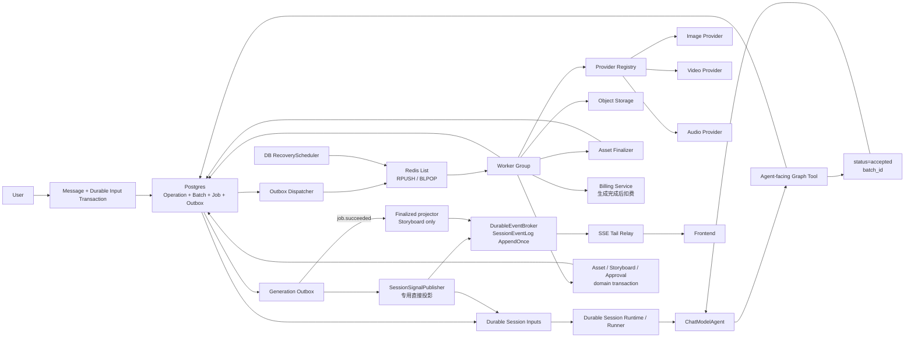
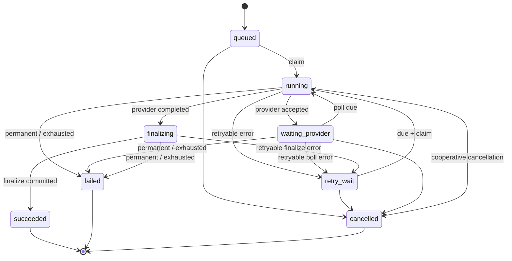

# AIGC Generation Worker 详细设计

> 状态：Implementation Sync（当前实现 + 目标架构）
> 日期：2026-07-11
> 适用范围：Dora Agent 图片、视频、音频等异步媒体生成任务
> 关联模块：`internal/aigc/generation`、`internal/aigc/server`、`internal/aigc/session`
> 关联设计：[AIGC Tool 编排与动态故事板详细设计](./aigc-tool-storyboard-design.md)、[AIGC ChatModelAgent Demo 详细设计](./aigc-chatmodelagent-demo-design.md)

## 1. 文档目标

本文档同时记录 Dora Agent 中 Generation Worker 的**当前实现**和**目标架构**，覆盖职责边界、数据模型、状态机、队列与恢复、Provider 执行、媒体收尾、Batch Barrier、领域事件以及 Session Runtime 唤醒机制。

阅读约定：第 2 节是截至 2026-07-11 的实现基线；第 3 节之后保留完整目标契约。章节中标为“当前”的内容描述已运行代码，标为“目标”或“建议”的内容不应被理解为已经落地。该实现面向受信本地 Demo，未提供公网生产所需的真实登录鉴权、租户授权和全局/用户/Provider 限流。当前本地验收 profile 保留 DeepSeek 和由 `DORA_IMAGE2_API_KEY` 启用的真实 Image2；Seedance、Audio 和 Assembly 可使用本地占位实现。验收要求 Worker 生命周期、媒体落盘、Finalization、Barrier、Session Signal 和 A2UI 投影连通，不要求 Seedance/Audio/Assembly 的真实生产，也不执行真实合成或转码。

设计需要解决以下核心问题：

1. Graph 创建异步任务后立即结束，不在内存中阻塞等待图片或视频生成。
2. Worker 可以独立部署、水平扩容和故障恢复，不持有 Agent 或 Graph 的运行时状态。
3. 同一批多个 Job 只在达到业务完成边界时投递一次持久化 SessionInput；目标态再由确定性 PostBatchContinuation 先完成 Stage/Tool Result 收尾，并且最多唤醒 Agent 一次。
4. Provider 成功不等于 Job 成功；对象存储、Asset、Storyboard 和生成后扣费完成后才能进入最终成功状态。
5. 数据库与消息队列之间不丢任务，重复投递和重复消费不会造成重复生成、重复扣费或重复写入。
6. `session_id`、`stage_run_id`、`batch_id` 等关联信息从服务端上下文持久化传递，Worker 不自行推断会话归属。
7. Job/Operation 结果可投影给前端；只有 Batch 业务边界才能投递 Agent continuation input，并按需触发 Agent 解释。

## 2. 当前实现与目标差距

当前主链路位于：

- `internal/aigc/generation/command.go`
- `internal/aigc/generation/postgres_workflow_store.go`
- `internal/aigc/generation/lifecycle_worker.go`
- `internal/aigc/generation/finalization.go`
- `internal/aigc/generation/barrier.go`
- `internal/aigc/generation/outbox_dispatcher.go`
- `internal/aigc/generation/recovery_scheduler.go`
- `internal/aigc/generationruntime/outbox.go`
- `internal/aigc/sessionruntime`
- `internal/aigc/events`

`generation.Dispatcher`、旧 `generation.Worker`、`server/event_bridge.go` 和旧 `JobWakeupRunner` 仅保留给隔离测试；生产入口不再装配旧 Media Graph 或旧 generation store。`cmd/aigc-agent/main.go` 只使用 Operation/Batch/Job 工作流。

### 2.1 当前运行链路

```text
generate_media / assemble_output / UI Command
→ GenerationCommandService
→ PostgreSQL 同事务写 Operation + Batch + Jobs + generation Outbox
→ OutboxDispatcher
→ Redis List RPUSH
→ LifecycleWorker BLPOP + DB StatusVersion/lease claim
→ Provider Submit / Poll / Cancel 或同步 Provider Adapter
→ LocalUploader（本地 Demo）或 TOS + pending_billing Asset
→ BindingToken/Fingerprint 校验
→ 幂等 Billing + Asset/Storyboard/Approval 收尾
→ Job terminal + generation Outbox + batch.finalize_requested（同一 Job mutation）
→ Batch Barrier 固化 gross/refund/net 并写唯一 Batch terminal Outbox
→ Durable BatchContinuationResult SessionInput（Result 携带完整 PostBatchPayload）
→ 无需解释时直接提交；需要解释时由 Session Runtime 串行调用 Runner
```

Redis List 只是唤醒层，不是恢复真源。`RecoveryScheduler` 会周期扫描 PostgreSQL 中到期的 `queued/waiting_provider/retry_wait` Job 和过期的 `running/finalizing` lease，并重新入队；所以 List 消息被 `BLPOP` 后丢失不会形成永久孤儿，但当前仍没有队列侧 ACK/Pending/Reclaim 语义。

### 2.2 实施状态矩阵

| 能力 | 状态 | 当前实现 | 目标差距 |
| --- | --- | --- | --- |
| Operation/Batch/Job | 已实现 | `GenerationCommandService` 和 `PostgresWorkflowStore` 原子创建 Operation、Batch、Jobs。 | 补充更强的关系约束和运营查询。 |
| Transactional generation Outbox | 已实现 | Workflow 创建、Job/Batch 状态转换与对应 Outbox 在同一 generation store 事务提交；普通失败 Row 按 attempts 指数退避并在 10 次后 dead，内部 `batch.finalize_requested` 持续退避直到确认，poison row 不阻塞其他到期 Row。 | Dispatcher 尚无多实例 claim lease、dead-row 查询/重放和专用告警。 |
| Worker 状态机与恢复 | 已实现 | StatusVersion CAS、Job lease、Provider/Finalization 调用心跳续租、`next_run_at`、DB RecoveryScheduler、Provider receipt 恢复已接通。 | 补运营指标和人工恢复操作。 |
| Redis 队列 | 部分实现 | 当前为 Redis List `RPUSH/BLPOP`；重复唤醒由 DB CAS 消解。 | Redis Streams Consumer Group、`XACK/XAUTOCLAIM` 尚未实现。 |
| Seedance | 真实/本地双路径 | 配置 Key 时使用持久化 `Submit/Poll/Cancel` Adapter；无 Key 且启用本地 Demo 时，同步 Adapter 写入确定性 MP4 占位 Asset。真实路径的 `provider_task_id`、下次 Poll 时间和预算持久化，DELETE 202 不误判取消已确认。 | 本地 MP4 不是真实视频生成或转码；真实 Provider webhook、Retry-After/配额级限流和更细 code 映射仍可增强。 |
| Image2 | 真实/本地双路径 | 先创建持久化 Job；配置 Key 时由真实同步 `JobHandlerProviderAdapter` 完成，无 Key 且启用本地 Demo 时写入确定性 PNG 占位 Asset。 | 本地 PNG 不是真实图像生成；真实同步调用仍占用一个 Worker 槽，且没有独立 Poll/Cancel。 |
| Audio | Demo 已实现 | `DemoAudioJobHandler` 生成并上传确定性的两秒 WAV，占位性质写入 Asset metadata。 | 替换为生产音频 Provider。 |
| Assembly | Demo 已实现 | `DemoAssemblyJobHandler` 生成并上传 assembly manifest JSON，完整走 Asset、Billing 与 Finalization 链路。 | 尚未执行真实的音视频合成、转码或成片导出。 |
| 对象存储与 Asset | 已实现 | 本地 Uploader 或 TOS Uploader、确定性 `aigc/sessions/<session>/assets/<asset>/<filename>` key、`source_job_id + output_index` 唯一约束、`pending_billing/available/quarantined` 已接通。本地文件通过 `/api/aigc/local-assets/*` 提供。 | 本地静态路由不是生产私有对象存储；对象 GC、PutIfAbsent/内容一致性审计仍是目标能力。 |
| Billing 与补偿 | 部分实现 | 生成前 Provider/参数/余额预检、Postpaid 幂等 charge/refund、不可变幂等 payload 校验、Provider usage receipt、Batch gross/refund/net 聚合、Compensation Barrier 和受 Bearer Token 保护的人工终结端点已实现。 | `reserve_then_settle` 只有策略枚举，正式后台 RBAC/审计未实现。 |
| BindingToken/Fingerprint | 已实现 | 普通媒体使用 Target/Prompt revision、GenerationEpoch、SpecVersion 和独立重算的 InputFingerprint；Assembly 额外冻结 AggregateVersion。 | 继续补齐并发与故障注入测试。 |
| Operation 控制/恢复 | 已实现但有边界 | `cancel` 作用于原 Batch；`retry_failed` replay-first，只为 `status=failed + error_stage=provider + ProviderErrorRetryable=true` 且语义仍有效的 Job 新建 recovery Operation/Batch/Jobs。 | Recovery 会重跑完整 Provider 流程；Finalization-only Recovery 待实现。 |
| Candidate/Approval | 已实现但投影不完整 | Job Finalization 仍将 Asset、Storyboard Candidate/Active Binding 和每项 durable Approval 在一个领域事务中提交；Candidate 不再逐项投影 chat A2UI 审核卡。左侧故事板在相关 Job 全部终态后发起一次候选批量确认，服务端冻结精确候选集并逐项执行 durable decision。 | 候选批量结果和其他 Capability/Approval Decision 仍有直发窗口，没有全域 Outbox→Inbox Projector。 |
| Approval Relay 恢复 | 已实现 | Continuation 带 executor/epoch/lease；有效 lease 只延后协调重试，真正失败才写 `failed`；Command Ledger、Storyboard/Spec 及 Artifact Review receipt 可补齐领域提交后的崩溃窗口。 | 增加 dead-row 管理和人工恢复指标；完整 outer/inner checkpoint fallback 仍是目标。 |
| Finalization 原子边界 | 部分实现 | Asset availability、Storyboard Binding、必要的 Approval 在一个 PostgreSQL 事务中提交；后续 generation Job 终态与 `batch.finalize_requested` 在同一 mutation 提交；Commit error 保留原 Job ID/原始错误并稳定进入 retry 或失败。 | 领域事务与 generation Job terminal/Outbox 仍是两个事务，尚未形成统一跨聚合原子提交。 |
| Batch terminal/Agent continuation | 部分实现 | 正常媒体/装配 Batch 使用 `on_failure`；成功由 durable A2UI projection 展示。Barrier 产生完整不可变 `PostBatchPayload`，写入 Operation.Result 和唯一 terminal Outbox，并原样放入 durable `BatchContinuationResult.Result`；仅失败类终态可选 Agent explanation。 | 没有独立持久化 Stage Ledger、ToolOperationResult 或 PostBatchContinuation Graph。 |
| Durable Session Runtime | 部分实现 | UserMessage、generic/Approval ResumeRequested、ApprovalContinuationResult、BatchContinuationResult、started-input HOL、因果 transcript、Session Lease/Fence、Stable TurnID、外层 Agent model receipt 和完整 Turn output receipt 已实现；frozen output 的投影修复不受普通 MaxAttempts 上限。 | Message/EventLog/Turn/Input 尚未形成完整 effective-turn 原子提交。 |
| Agent Skill 动态装配 | 已实现 | 每次 Agent run 都重新调用 `SkillBackend.List`；结果为空时不注入 Skill 指令，也不向模型提供 `skill` 工具。运行中导入 Skill 后，下一 turn 即可见，无需重启 Runner。 | Skill 执行不属于 Worker 职责；仍由 Agent Runner 保持每轮动态查询边界。 |
| A2UI/SSE | 部分实现 | A2UI 1.0/known-action 整包 fail-closed、generic required 表单校验、Operation/Job/Public Stage 顶层与逐节点 `status_version` 门禁、DurableEventBroker、terminal `a2ui.error`、Tail Relay 与回放已实现；成功 Job 可展示 result assets。 | Capability/Approval Decision 仍事务后直发，尚无统一 Domain Projector/Inbox。 |

### 2.3 当前主要剩余问题

1. Redis List 没有 ACK/reclaim；正确性依赖 PostgreSQL 扫描恢复，吞吐与延迟语义不同于目标 Streams 方案。
2. Outbox Dispatcher 已实现 attempts、指数 backoff、普通事件 10 次后 dead 和 poison-row 隔离；内部 `batch.finalize_requested` 为防止 Batch 永久挂起而持续重试。但仍未实现 `SKIP LOCKED` claim lease、dead-row 查询/重放或多实例发送栅栏。
3. Batch terminal 后直接生成 durable SessionInput；代码中没有独立的 Stage Ledger、ToolOperationResult 或 PostBatchContinuation Graph，因此不能声称 Stage 已被确定性收尾。
4. `BatchContinuationResult.Result` 已携带 Barrier 的完整 `PostBatchPayload`；缺少的是独立 Stage/ToolOperationResult/PostBatchContinuation Graph，不是可信 Job/费用快照。
5. Worker Finalization 的 Storyboard/Operation/Job UI 已由 generation outbox 重试；Candidate Approval 不再逐项发布 chat 卡。Spec/Storyboard Approval 创建卡、Approval Decision 与候选批量结果仍在领域事务后直调 DurableEventBroker，缺少能将 Inbox marker 与全部外部投影 Row 同事务提交的全域 Projector。
6. Asset/Storyboard/Approval 领域提交与 generation Job terminal/Outbox 尚非同一事务，恢复依赖幂等和重试，仍存在可观测的中间窗口。

### 2.4 本地验收 Worker 配置与输出契约

推荐显式配置：

```text
APP_ENV=local
DORA_LOCAL_DEMO=true
DORA_LOCAL_ASSET_DIR=.local/aigc-assets
DORA_LOCAL_ASSET_BASE_URL=/api/aigc/local-assets
DORA_DEEPSEEK_API_KEY=<set-only-in-local-environment>
DORA_IMAGE2_API_KEY=<set-only-in-local-environment>
DORA_SEEDANCE_API_KEY=
```

在这个 profile 中：

1. DeepSeek 用于外层 Agent 和 Capability 内部 ChatModel；`DORA_IMAGE2_API_KEY` 必须非空，使图片 Job 走真实同步 Image2 Adapter，而不是确定性 PNG 占位 Adapter。密钥只在本地环境配置，不写入代码、文档、日志或版本库。
2. `DORA_LOCAL_DEMO=true` 仍允许未配置 Seedance Key 时生成确定性 MP4，Audio 生成两秒 440 Hz WAV，Assembly 仅保存包含冻结 Job/Payload 信息的 JSON manifest。这三者是链路占位，不输出真实成片，不执行真实合成或转码。
3. 所有输出仍走 Uploader → `pending_billing` Asset → BindingToken/Billing → available/Binding → Job terminal → Batch Barrier，因此可以验证 Worker 状态机和跨层投影。
4. `LocalUploader` 将确定性 object key 写到 `DORA_LOCAL_ASSET_DIR`，Asset URL 使用 `DORA_LOCAL_ASSET_BASE_URL/<object-key>`；Router 只在配置本地目录时挂载静态路由。
5. Worker 本身仍依赖 PostgreSQL 和 Redis；完整验收需要 DeepSeek 和 Image2 Key。使用 `LocalUploader` 时 Seedance/TOS Key 均不是必需凭据，ffmpeg 也不是运行依赖。

## 3. 设计原则

本节描述目标原则；当前已落实到 Operation/Batch/Job、generation Outbox、LifecycleWorker、Barrier、Durable SessionInput 和 SessionEventLog。Stage Ledger、ToolOperationResult、PostBatchContinuation Graph、Redis Streams 及全域 Projector/Inbox 仍是目标能力。

### 3.1 职责分离

```text
ChatModelAgent：理解意图、选择高层 Capability Tool、解释结果
Capability Tool：校验依赖、创建 Operation/Batch/Job 并返回 accepted
Worker：可靠执行单个 Job 和媒体收尾
Batch Finalizer：判断 Batch 是否达到业务终态
Event Publisher：可靠发布领域事件
Session Runtime：按 session_id 串行处理 durable input
目标 PostBatchContinuation：确定性处理 Batch 终态并保存 Stage/Approval/Tool Result
Runner：处理用户输入、Resume 和可选 BatchContinuationResult explanation
```

当前 Worker 不直接调用 Agent，也不决定下一 Skill Stage。Generation 的 Outbox Publisher 会直接构造专用 Operation/Job A2UI 投影；这不等同于 Worker 本身运行 Agent，也不等同于已经具备通用 Domain Projector。

### 3.2 Postgres 是唯一业务真源

以下状态必须持久化在 Postgres：

- Workflow/Stage 当前状态（目标；当前只有关联 ID，没有持久化 Stage Ledger）
- Generation Batch
- Generation Job
- Provider task ID
- Asset 与 Storyboard 绑定
- 扣费交易与本轮积分汇总
- Outbox 事件
- 消费幂等记录（SessionInput/EventLog 已有；通用 Domain Inbox 未实现）

当前 Redis List、进程内 channel 和 Eino checkpoint 都是运行设施，不是业务状态真源；目标 Redis Streams 同样只承担传输，不承担业务真源。

### 3.3 至少一次投递与幂等消费

跨 Postgres 与 Redis/Kafka 很难获得端到端“严格一次”语义。本设计采用：

```text
至少一次投递 + 原子状态转换 + 幂等 Provider/Storage/Asset/Outbox
```

### 3.4 Graph 有界执行，等待持久化

Capability Tool 负责一次有界计算或命令，创建 Operation/Batch/Job 并提交后即结束。当前 Capability Graph 是有界 Tool 外壳，尚未持久化 StageRun：

```text
Capability Tool Run：completed / accepted
业务 StageRun：仅携带 stage_run_id，未接 Stage Ledger
Generation Operation：accepted / waiting_jobs
Generation Batch：waiting_jobs
Generation Job：queued/running/...
```

当前图片或视频完成后，Batch terminal Outbox 直接 UPSERT `BatchContinuationResult` Durable SessionInput。`NeedsAgentExplanation=false` 时 Session Runtime 直接提交；为 `true` 时才调用 Runner 解释。目标态是在写入可选解释 Input 前，先运行确定性 PostBatchContinuation 保存 Stage、ToolOperationResult 和必要 Approval。两种形态都不恢复原 Tool 调用栈，也不让原 Graph invocation 长时间等待。

## 4. 总体架构

下图描述当前主链路：



目标态在当前链路上增加两项，而不是替换 Postgres 真源：

1. Redis List 升级为 Streams Consumer Group，补充 ACK/Pending/Reclaim；DB Recovery 继续保留。
2. Batch terminal 先进入 PostBatchContinuation，原子保存 Stage/ToolOperationResult/必要 Approval；所有领域 UI 事件经 Outbox→Inbox Projector 写入 SessionEventLog。

## 5. 核心术语

| 名称 | 含义 |
| --- | --- |
| Operation | 一次用户或 Agent 发起的高层业务操作，例如“生成镜头 3 关键帧”。 |
| StageRun | Skill/Workflow 中一个业务阶段的持久化运行实例；当前 Generation 只透传其 ID，目标态接持久化 Ledger。 |
| Batch | 一次 Operation 为达到业务目标创建的一组相关 Job；目标态再绑定到有效 StageRun。 |
| Job | Worker 可独立领取和执行的最小异步单元。 |
| Provider Task | 外部图片/视频 Provider 返回的任务实例。 |
| Finalization | Provider 结果完成后的校验、上传、Asset 保存、Storyboard 绑定和实际积分扣除。 |
| Batch Barrier | 判断一个 Batch 的必要 Job 是否全部进入终态的同步点。 |
| Outbox | 与业务数据同事务写入、随后可靠发布的领域事件。 |
| Batch terminal signal | Batch Barrier 写入的唯一终态 Outbox；当前直接形成 Durable SessionInput，目标态先进入 PostBatchContinuation。 |

## 6. 职责边界

本节给出目标职责边界；其中 Worker、Barrier 和 generation Outbox 已基本落地，Stage/PostBatch 与全域投影部分按标注执行。

### 6.1 Graph Tool 职责

生产 Runner fail-closed 地固定注册并校验恰好五个高层 Graph Tool：`analyze_materials`、`plan_creation_spec`、`plan_storyboard`、`generate_media`、`assemble_output`，不接受外部 ToolKeys 覆盖，也不存在旧 Agent Registry 工厂。其中只有 `generate_media` 和 `assemble_output(preview/export)` 创建 Generation Workflow；前三者完成 Artifact/Spec/Storyboard 的有界规划。Prompt、Image2、Seedance、Audio、Assembly、Billing 和业务 CRUD 都不单独注册给 Agent。

Graph Tool 负责：

1. 从服务端 `CommandContext` 获取可信 `session_id`、`user_id`、`run_id`、`tool_call_id` 和幂等键；Tool 外壳会补稳定的 `stage_run_id`。
2. 加载当前 Spec、动态 Storyboard 和 Asset；StageRun 加载是目标能力。
3. 校验输入和版本；当前会校验 Provider 注册状态、Provider 参数白名单/边界、预计积分和账户余额，但没有额度 Reservation、真实租户权限或接口限流，最终扣费不在 Tool 内执行。
4. 构造 Generation Plan。
5. 创建 Batch 和 Job。
6. 在同一数据库事务中写入 `job.dispatch` Outbox。
7. 目标：将 StageRun 置为 `waiting_jobs`；当前只把 `stage_run_id` 持久化到 Operation/Batch/Job。
8. 返回 `accepted + operation_id + batch_id`。

`plan_storyboard` 的上游契约是：元素规划 ChatModel 只声明动态 Module/Element、数量、PromptSlot purpose、AssetSlot 和依赖，不生成 Prompt 文本；领域层先为缺失/重复 ID/key 分配唯一候选标识，再由独立后继 ChatModel 节点统一为每个已注册 Provider 的 AssetSlot 生成可审核 Prompt，即使模型给出 `requires_prompt=false`。响应必须与请求的 `target_id/purpose` 集合精确一一对应，空值、遗漏、重复或额外项任一出现时都不创建 Pending Revision/Approval，也不会流入 Generation Job。`generate_media` 对 Active Revision 的安全补全使用相同 exact-set 校验，并在 CAS 写入前重新尊重用户锁定。

Graph Tool 不负责等待 Provider 完成。

### 6.2 Worker 职责

Worker 负责：

1. 从队列领取 Job；当前 Redis List 只提供唤醒，可靠恢复由 PostgreSQL Scheduler 提供。
2. 对 Job 执行原子 claim 和 lease。
3. 调用 Provider submit/poll/cancel。
4. 执行 Provider 错误分类与重试调度。
5. 校验 Provider 输出。
6. 将最终媒体上传对象存储。
7. 幂等保存 Asset。
8. 绑定或 patch Storyboard。
9. 在生成结果完成业务收尾后，幂等扣除该 Job 的实际积分。
10. 持久化扣费交易和 Job 积分明细，并上报给对应 Tool Operation。
11. 更新 Job 状态。
12. 调用 Batch Finalizer 汇总本轮积分。
13. 写入 Job/Batch generation Outbox；Asset/Storyboard/Approval 的通用领域 Outbox 仍是目标。

### 6.3 Worker 明确不负责

Worker 不得：

- 选择要执行哪个 Agent Tool。
- 根据对话决定下一阶段。
- 每完成一个 Job 就直接执行 Runner。
- 拼装面向用户的 A2UI 卡片。
- 通过自然语言判断失败是否重试。
- 接受 LLM 传入的任意 `session_id`、`user_id` 或费用账户。

动态 Storyboard 的本地“上传素材”不经过 Generation Worker：前端先调用 `/api/aigc/assets` 保存 available Asset，再调用 target bind endpoint。两次 HTTP 提交彼此独立，绑定失败时 Asset 保留在素材库。上传从 Session 记录取 UserID，并拒绝表单中的不同 UserID；Asset detail 要求 Session 匹配且 available。当前仍无真实登录用户授权、显式大小限制或上传幂等；TOS 使用 `public-read` URL，本地 Uploader 使用开发静态路由。这些属于 HTTP/Asset 安全边界，而不是 Worker Finalization 的恢复职责。

用户 API 不返回完整内部 Job。Session Jobs 和 Operation detail 会清除 Payload/Result、BindingToken、Provider task/request、lease、User/幂等键、原始错误正文以及 Billing/Refund/Compensation 交易 ID；非 succeeded Job 也清除 ResultAssetIDs。Storyboard PublicView 清除 Command fingerprint ledger，Approval Decision 响应不暴露 frozen command/Continuation/Outbox。可见成品通过按 Session/availability 过滤的 Asset API 获取。

### 6.4 Session Runtime 职责

当前 Session Runtime 负责：

1. 幂等 UPSERT `user_message`、`resume_requested`、`approval_continuation_result`、`batch_continuation_result` 四类 Durable SessionInput。
2. 使用 Session Lease/Fence 和稳定 TurnID 串行 claim/执行/提交；started input 保持 HOL，只有没有 started head 时才按优先级选择未开始输入。
3. 冻结 UserMessage/Approval continuation/Batch explanation 的消息边界，按 RunID 因果组重建 transcript。
4. deterministic Approval command 提交后，用 stable ApprovalContinuationResult 以 trusted system event 开启新 Turn；不 Resume 原 checkpoint、不伪造 user message。对无需解释的 BatchContinuationResult 直接提交，需要解释时同样用 trusted system event 调用 Runner。
5. 以外层 Agent model receipt、稳定 ToolCall 幂等和完整 Turn output receipt修复 Runner/投影重放；无 frozen output 的终态失败写 durable `a2ui.error`。
6. 轮询发现崩溃遗留 Input，进程内 Wake 只用于降低延迟。

目标 PostBatchContinuation 层额外负责：

1. 根据 Batch 真源校验 `session_id/stage_run_id/operation_id/tool_call_id` 和 ActiveBatch。
2. 幂等保存 ToolOperationResult、Stage、必要 Approval 和 Outbox。
3. 只有需要解释时才写 `session.input_requested`，并把可信 Job/Asset/费用快照交给 Runner。

## 7. 数据模型

本节代码块是目标领域模型。当前实现以 `internal/aigc/generation/models.go` 为准：策略被嵌套在 `DeliveryPolicy`，版本围栏被嵌套在 `BindingToken`，Batch 费用被嵌套在 `CostSummary`；generation Outbox 当前有 `pending/published/dead`、`attempts` 与 `available_at`，尚无 `publishing` claim lease 和 dead-row 管理接口。

### 7.1 CommandContext

`CommandContext` 由服务端创建，不作为模型可自由填写的 Tool 参数：

```go
type CommandContext struct {
    TenantID                  string
    UserID                    string
    SessionID                 string
    RunID                     string
    ToolCallID                string
    WorkflowID                string
    StageRunID                string
    OperationID               string
    RequestID                 string
    IdempotencyKey            string
    ExpectedSpecVersion       int
    ExpectedStoryboardVersion int
    TraceID                   string
}
```

当前 DurableAgentProcessor 注入 User/Session/Run/Request/Idempotency/Trace；Capability Tool 外壳根据可信运行上下文补 ToolCallID、StageRunID 和 scoped idempotency。模型只能填写 Agent-facing intent，不能覆盖该结构。

### 7.2 GenerationBatch

```go
type GenerationBatch struct {
    ID            string
    SessionID     string
    UserID        string
    WorkflowRunID string
    StageRunID    string
    OperationID   string
    ToolCallID    string

    Kind             string // element_images, shot_keyframe, shot_video, audio
    Status           string
    CompletionPolicy string // all_required, allow_partial, min_success
    WakePolicy       string // on_terminal, on_failure, never
    BindingMode      string // candidate, active
    ApprovalPolicy   string // review_required, auto_approve
    ChargePolicy     string // postpaid_no_reservation, reserve_then_settle

    RequiredJobs  int
    OptionalJobs  int
    SucceededJobs int
    FailedJobs    int
    CancelledJobs int

    ExpectedSpecVersion       int
    ExpectedStoryboardVersion int
    ResultStoryboardVersion   int

    GrossChargedPoints int64            // 原始成功扣费总额
    RefundedPoints     int64            // 已完成补偿/退款总额
    ChargedPoints      int64            // 用户最终净费用 = gross - refunded
    CostBreakdown      map[string]int64 // 按媒体类型、模型或计费项汇总的净额
    BalanceAfter       *int64           // 最后一次扣费/退款后的余额，可选快照

    ErrorCode    string
    ErrorMessage string
    Version      int
    CancelRequested   bool
    CancelRequestedAt *time.Time

    CreatedAt   time.Time
    UpdatedAt   time.Time
    TerminalAt  *time.Time
}
```

当前 `generate_media` 与 `assemble_output` 创建的正常 Batch 固定 `WakePolicy=on_failure`：`completed` 的 `NeedsAgentExplanation=false`，成功 Operation/Job/Storyboard/Asset 由 generation outbox 的 durable A2UI projection 展示；Candidate Binding 在左侧故事板中展示和统一确认，不为每个 Candidate Approval 追加 chat 卡。只有 `partial_failed/failed/cancelled` 才进入 Agent explanation Turn。成功可见性不依赖模型解释。

建议索引与约束：

```text
PRIMARY KEY (id)
INDEX (session_id, created_at)
INDEX (stage_run_id, status)
INDEX (status, updated_at)
UNIQUE (session_id, operation_id)
UNIQUE (session_id, tool_call_id)
```

### 7.3 GenerationJob

```go
type GenerationJob struct {
    ID        string
    BatchID   string
    SessionID string // 为查询和路由冗余；真源仍可由 Batch 校验

    Provider   string
    MediaKind  string
    StoryboardID string
    TargetType string
    TargetID   string
    AssetSlot  string
    VariantKey string
    Required   bool

    StoryboardVersionAtDispatch int // 仅用于审计和最新 Patch rebase
    TargetRevision              int
    PromptRevision              int
    GenerationEpoch             int
    SpecVersion                 int
    AggregateVersion            int
    InputFingerprint            string
    BindingMode                 string
    ApprovalPolicy              string
    ChargePolicy                string

    Status string
    Phase  string // provider_submit, provider_poll, artifact_finalize, billing_charge

    Attempt     int
    MaxAttempts int
    ProviderPollAttempts    int // 每次真实 Poll 前持久增加，重启不重置
    MaxProviderPollAttempts int // 未指定时默认 120
    NextRunAt   time.Time

    LeaseOwner string
    LeaseUntil *time.Time

    ProviderTaskID   string
    ProviderRequestID string
    ProviderStatus    string
    ProviderUsageRecorded bool
    ProviderActualPoints  int64
    ProviderCostBreakdown map[string]int64

    PromptHash      string
    InputAssetHash  string
    IdempotencyKey  string
    StatusVersion   int

    Payload        map[string]any
    ProviderResult map[string]any
    ResultAssetIDs []string
    ResultDisposition string // bound_candidate, bound_active, superseded, orphaned

    ChargedPoints         int64
    CompensatedPoints     int64
    NetChargedPoints      int64
    CostBreakdown         map[string]int64
    BillingStatus         string // not_started, charging, charged, failed
    BillingTransactionID  string
    BillingIdempotencyKey string
    CompensationStatus    string // not_required, pending, retry_wait, completed, manual_final
    CompensationEventID   string
    RefundTransactionID   string
    CancelRequested       bool

    ErrorStage   string
    ErrorCode    string
    ErrorMessage string
    Retryable    bool

    CreatedAt  time.Time
    UpdatedAt  time.Time
    StartedAt  *time.Time
    TerminalAt *time.Time
}
```

建议约束：

```text
PRIMARY KEY (id)
FOREIGN KEY (batch_id) REFERENCES generation_batches(id)
INDEX (batch_id, status)
INDEX (status, next_run_at)
INDEX (lease_until)
UNIQUE (batch_id, target_type, target_id, asset_slot, media_kind, variant_key)
UNIQUE (idempotency_key)
UNIQUE (billing_idempotency_key)
UNIQUE (billing_transaction_id) WHERE billing_transaction_id IS NOT NULL
```

普通媒体由 `TargetRevision + PromptRevision + GenerationEpoch + SpecVersion + InputFingerprint + AssetSlot` 构成 Storyboard BindingToken；`AggregateVersion=0`，全局 `StoryboardVersionAtDispatch` 只用于审计和在无关目标变化后重新计算最新 Target 路径。Assembly manifest 覆盖整板输入，因此 Token 额外冻结非零 `AggregateVersion`；SpecVersion 或 AggregateVersion 任一变化都会使旧 Assembly 结果失效。

普通媒体 token 的当前值必须调用 `StoryboardAggregate.ResolveGenerationInput(target_id, asset_slot)` 重算；该方法也是 Capability dispatch 和 Candidate Approval 激活前校验的单一语义源。它统一解析 Dependency Asset、Prompt/PromptRevision、TargetRevision、GenerationEpoch 和 InputFingerprint，并且仅在元素恰有一个 PromptSlot 时使用单一 Prompt fallback。Worker/Adapter 不得自行复制另一套 Prompt 匹配或 dependency 解析。

Assembly manifest 先保存为不可变、版本化 `assembly_plan` Artifact，冻结来源 Spec/Storyboard version、Active bindings、输出类型、instruction、mode 和 missing dependencies。同一幂等键重放必须命中同一 session/kind/creator/mode 的 frozen plan；Job Payload 使用该 plan，不从当前 Storyboard 重建 manifest。

Assembly 派发前还有 readiness 栅栏：所有 required Slot 必须同时具备 ActiveBindingID 且 `status=active`。上游替换传播出的 required `stale` Slot 会被视为 missing dependency，`preview/export` 返回 partial 而不创建 Assembly Job。

`BindingMode/ApprovalPolicy/ChargePolicy` 在 Batch/Job 创建时冻结：

- `review_required + candidate`：Worker 只创建 Candidate Binding，用户审核后才切 Active。
- `auto_approve + active`：Worker 可以在 Finalization 中直接切 Active，但上游替换必须与人工激活一样传播 dependency stale。
- Worker 不得根据 Provider 结果或自然语言临时改变这些策略。

`superseded/orphaned` 是结果处置，不新增无法被 Barrier 识别的 Job 状态。Token 过期时 Job 使用 `failed + error_code=result_superseded/target_orphaned`，并填写 `ResultDisposition`；Required Job 因此按失败进入 CompletionPolicy。

### 7.4 OutboxEvent

以下是目标完整 Outbox 模型。当前 `generation.OutboxEvent` 已包含稳定 `IdempotencyKey`、aggregate/session/operation/batch/job 关联、`Destination`、`AvailableAt`、attempts 和 payload；状态已有 `pending/published/dead`，但没有 `publishing` 与 publisher lease。

```go
type OutboxEvent struct {
    ID               string
    SchemaVersion    string
    EventType        string
    AggregateType    string
    AggregateID      string
    AggregateVersion int

    SessionID   string
    StageRunID  string
    OperationID string
    ToolCallID  string
    BatchID     string
    JobID       string

    Destination string // media.jobs, session.signals, session.inputs, ui.events
    Payload     map[string]any

    Status      string // pending, publishing, published, dead
    Attempts    int
    NextRunAt   time.Time
    LeaseOwner  string
    LeaseUntil  *time.Time

    CreatedAt   time.Time
    PublishedAt *time.Time
}
```

建议唯一约束：

```text
UNIQUE (event_type, aggregate_type, aggregate_id, aggregate_version, destination)
```

Outbox/Domain Event 是内部事实，不分配浏览器使用的 Session seq。当前 Generation Publisher 或其他直接 Publisher 生成具体 A2UI Row 后，通过共享 `SessionEventLog.AppendOnce` 分配 seq；目标态由 Agent Action、Runner Interrupt 或 Domain Projector 统一完成这一步。Worker 本身不写 SessionEventLog，也不使用无锁 `MAX(seq)+1`。

### 7.5 InboxEvent

这是目标模型。当前 Durable SessionInput 自身通过唯一 `InputID/SourceID` 去重，Generation Outbox 通过稳定事件 ID 重放；尚没有供所有 Domain Projector 共用的 `InboxEvent` 表。目标 Session Signal/PostBatchContinuation、A2UI Projector 等消费端使用 Inbox 去重：

```go
type InboxEvent struct {
    ConsumerName string
    EventID      string
    SessionID    string
    ProcessedAt  time.Time
}
```

```text
UNIQUE (consumer_name, event_id)
```

### 7.6 DurableSessionInput

UserMessage、Resume、Approval Continuation Result 和 Batch Continuation 使用持久化输入，而不是从 HTTP/Outbox Consumer 直接调用内存 `runtime.Push`：

```go
type DurableSessionInput struct {
    InputID      string
    SessionID    string
    InputType    string // user_message, resume_requested, approval_continuation_result, batch_continuation_result
    SourceID     string // message_id, mapping+epoch, approval+decision_version, batch+result_version
    Payload      map[string]any
    Priority     int
    EnqueueSeq   int64
    ContextMessageSeq int64 // inclusive causal transcript boundary; may be explicit zero
    Status       string // pending, claimed, running, retry_wait, resolved, dead
    TurnID       string
    Attempts     int
    AvailableAt  time.Time
    ClaimOwner   string
    ClaimFence   int64
    LeaseUntil   *time.Time
    CreatedAt    time.Time
    ResolvedAt   *time.Time
}
```

```text
PRIMARY KEY (input_id)
UNIQUE (session_id, input_type, source_id)
UNIQUE (session_id, enqueue_seq)
UNIQUE (turn_id) WHERE turn_id IS NOT NULL
INDEX (session_id, status, priority DESC, enqueue_seq, available_at)
```

EnqueueSeq 由独立的 Session Input Counter 在入队事务中分配，不是外部 SSE seq。

当前 Session 串行化已经使用：

```text
session_runtime_leases(session_id PK, owner_id, fence_token, lease_until)
session_turn_runs(
  turn_id PK, input_id UNIQUE, session_id, runner_run_id, parent_turn_id?, claim_fence,
  status, runner_checkpoint_id?, attempt,
  context_message_seq, context_seq_frozen,
  output_payload_json?, output_digest?, committed_at?
)
```

只有当前 Session Lease/Fence Owner 能 Claim、运行和提交。最早已启动且未终态的 Input（`Attempts > 0`）拥有 Session head-of-line；它在 `retry_wait` 或尚未到 `AvailableAt` 时会阻塞后续输入，UserMessage=300、ResumeRequested=200、ApprovalContinuationResult=200、BatchContinuationResult=100 的优先级只用于“当前没有 started head”时选择未开始输入，再以 `enqueue_seq` 排序。首次 Claim 固化 TurnID；lease 回收复用同一 TurnID。

当前 HTTP UserMessage 已通过 `AppendMessageAndEnqueue` 在一个事务中保存 Message 与 Durable Input，并把该 Message seq 冻结为 `ContextMessageSeq`。消息读取按稳定 RunID 将 user/assistant/tool 物理行组成因果组：ThroughSeq 排除整个后排用户组，当前用户组排在前序 Turn 输出之后。Limit 是逻辑排序后的软消息预算，只从尾部选择完整 Run；不能切开 ToolCall/Result 链，当前用户 Run 必须完整保留，因此结果可超过 Limit。Batch explanation 第一次成为 head 时，按所有已终结 UserMessage 冻结最大边界；`ContextSeqFrozen=true` 区分显式零边界，后续重试不扩大窗口。

外层 ChatModelAgent 的完整响应按 durable `TurnID + model-call ordinal` first-write-wins；流式响应先拼接并冻结，再交给 ReAct。模型生成的 ToolCallID 进入可信 CommandContext，原始 Tool 幂等基键通过 checkpoint RunLocal 跨 resume 冻结，Capability 再结合 Tool 名、逻辑 call slot 和 canonical intent digest 派生领域幂等键。该 model receipt 不覆盖 Capability 内部 ChatModel 子图。

Runner 的完整 Agent event receipt 在权威 Message/EventLog 投影前写入 `output_payload_json`。投影失败重放同一 receipt，不再调用 Runner/模型；成功发送的实时进度在 receipt 中以 `ProgressPublished` 确认，只补未确认项。已有 frozen output 的 Turn 不受普通 MaxAttempts dead-letter 上限影响。当前仍没有把完整 Message、全部 EventLog、`session_turn_runs=committed`、`session_inputs=resolved` 和必要 Outbox 收敛到一个最终事务；“一个 committed/effective Turn 的全部输出原子可见”仍是目标，而不是当前保证。

生产 Runner interrupt 确认使用同一 durable lane。Runtime 配置下，`POST .../messages/resume` 以 mapping ID + MappingEpoch 派生固定 InputID `checkpoint:<mapping_id>:resume:<epoch>`，并通过 `AppendMessageAndEnqueue` 将用户确认 Message 与 `ResumeRequested` 在 PostgreSQL 同事务提交；HTTP 不 claim mapping、不直接调用 Runner。Processor 重读并校验 session/scope/checkpoint/interrupt/mapping/epoch，Approval-bound mapping 则拒绝 generic resume、要求走 Approval Decision。首次执行从 pending/resume_queued claim 到 resuming；若进程停在 resuming，恢复以相同 InputID、TurnID 做 at-least-once Runner replay。Runner 输出先冻结；Approval-bound Resume 必须先 Apply Continuation，若别的 owner 仍持有效 lease，则保持 `resuming` 并延后到 `LeaseUntil + 100ms`，不投影完成或确认成功。Apply 和权威输出投影都成功后才依次提交 `resuming → resume_applied → resumed` 并发布稳定 `a2ui.interrupt_resolved`。无 Runtime 的同步 Runner Resume 仅是测试兼容路径。

Deterministic durable Approval 不走上述 Resume：Approval Relay 先确定性提交冻结命令，再 UPSERT `approval:<approval_id>:continuation-result:<decision_version>`。若输入 Enqueue 失败，Approval Outbox 保持 pending，重放只补输入而不重复命令。Session lane 将该结果作为 trusted system event 开启 fresh Agent Turn；approved 可选择后续 Capability，rejected/stale/expired 只解释或重新规划，不能恢复已经结束的 Tool 调用栈，也不能伪造用户消息。

Generic Runner interrupt 的 durable ResumeRequested 已实现；尚未完成的是 Capability Approval 的完整 outer/inner checkpoint 原子协议。该目标仍要求 Approval 先由 Graph 事务创建，checkpoint 可读后再保存 Mapping、Interrupt EventLog 与 Turn/Input 状态。当前 Candidate Asset 使用 durable Approval，不依赖 Graph checkpoint；Spec/Storyboard 即使声明 interrupt execution mode，在没有可读 Mapping 时也会转为 deterministic durable fallback。

## 8. Job 状态机

### 8.1 状态定义

| 状态 | 含义 |
| --- | --- |
| `queued` | 已创建，等待 Worker 领取。 |
| `running` | Worker 已 claim，当前正在执行 `phase`。 |
| `waiting_provider` | Provider 已受理，等待下一次 poll 或 webhook。 |
| `finalizing` | Provider 已完成，正在上传、保存 Asset、绑定 Storyboard 或执行生成后扣费。 |
| `retry_wait` | 遇到可恢复错误，等待 `next_run_at` 后重试。 |
| `succeeded` | Provider 以及所有适用的对象存储、Asset、Storyboard Binding/Approval 和实际积分扣除均已完成。 |
| `failed` | 达到重试上限或遇到永久错误。 |
| `cancelled` | 已由用户、Batch 或系统取消。 |

补充映射：

- Billing 临时失败：`retry_wait + phase=billing_charge`，只重试扣费。
- Billing 永久拒绝：`failed + error_stage=billing + error_code=billing_rejected`，不能无限停留在 `finalizing`。
- BindingToken 过期：`failed + error_stage=storyboard_bind + error_code=result_superseded + result_disposition=superseded`。
- Target 已归档：`failed + error_code=target_orphaned + result_disposition=orphaned`。
- Candidate 成功：`succeeded + result_disposition=bound_candidate`；它表示生成和候选绑定完成，不表示用户已激活该候选。

### 8.2 状态图



### 8.3 合法状态转换

状态转换必须使用 CAS 或行锁，不允许任意覆盖。当前 `PostgresWorkflowStore.MutateJob` 先行锁 `aigc_generation_workflow_jobs`，再校验 `status_version` 并原子写状态与 Outbox；下面是等价的目标 SQL 语义示意：

```sql
UPDATE aigc_generation_workflow_jobs
SET status = 'running',
    phase = :phase,
    lease_owner = :worker_id,
    lease_until = :lease_until,
    status_version = status_version + 1
WHERE id = :job_id
  AND status IN ('queued', 'retry_wait')
  AND next_run_at <= NOW()
RETURNING *;
```

如果没有返回记录，说明 Job 已被其他 Worker claim、尚未到期或已进入终态。目标 Streams 消费者可安全 ACK；当前 List 消息已经被 BLPOP 删除，DB Recovery 会在仍可运行时再次唤醒。

## 9. Batch 状态机与完成策略

### 9.1 Batch 状态

| 状态 | 含义 |
| --- | --- |
| `waiting_jobs` | Batch 已创建，仍有 Job 未终态。 |
| `finalizing` | Job 已终态，正在汇总 Tool 本轮积分、计算聚合结果或业务补偿。 |
| `cancelling` | 已收到取消请求，正在停止非终态 Job 并结算费用/补偿。 |
| `completed` | 满足 CompletionPolicy。 |
| `partial_failed` | 允许部分成功，但存在失败或取消 Job。 |
| `failed` | 必要 Job 未达到成功条件。 |
| `cancelled` | Batch 已取消。 |

### 9.2 CompletionPolicy

支持三种策略：

1. `all_required`：全部 required Job 成功才算完成。
2. `allow_partial`：至少一个 Job 成功即可进入 `partial_failed`，由 Agent/用户决定是否继续。
3. `min_success`：所有 Job 终态后，成功数达到阈值即可完成；若达到阈值后希望提前结束，必须先原子取消其余非终态 Job。

短视频默认建议：

```text
关键帧/镜头视频：all_required
候选图片批量生成：allow_partial
非必要风格备选：min_success
```

### 9.3 Batch Barrier

每个 Job 终态、取消/失败收敛和补偿结算 mutation 都在同一事务写稳定幂等的 `batch.finalize_requested`。消费该事件时调用 `TryFinalizeBatch(batchID)`；提交后的直接调用只用于低延迟，失败不改变已提交 Job，由 Outbox 恢复：

```text
BEGIN

SELECT batch FOR UPDATE

如果 batch 已终态：
    直接返回

聚合所有 Job 状态

如果仍有任何 Job 未终态：
    更新统计，COMMIT

只有所有 Job 已终态，或剩余 Job 已在同一决策中原子取消时，才评估最终 CompletionPolicy。

如果任一已扣费 Job 的 compensation_status 为 pending / running / retry_wait：
    如果 batch.cancel_requested：保持 batch.status = cancelling
    否则：更新 batch.status = finalizing
    更新统计，COMMIT

只有 compensation_status 全部为 not_required / completed / manual_final 时，费用结算才达到 Barrier 终态。

根据 CompletionPolicy 计算 Batch 状态
如果 batch.cancel_requested=true：
    全部 Job succeeded → completed（领域提交先于迟到 cancel）
    部分 Job succeeded → partial_failed
    无 Job succeeded → cancelled
按 billing_transaction_id 和 refund_transaction_id 去重
汇总 gross_charged_points / refunded_points / net charged_points / cost_breakdown

如果达到 Batch 终态：
    更新 batch.status / counters / gross/refunded/net points / cost_breakdown / version
    构造完整不可变 PostBatchPayload
    写入 operation.result
    根据终态 INSERT batch.completed / batch.partial_failed / batch.failed / batch.cancelled OutboxEvent（同一 payload）

COMMIT
```

数据库行锁和 Outbox 唯一约束共同保证同一 Batch 的终态事件只创建一次。`batch.finalize_requested` 的消费者在 Barrier 已应用、但 Outbox ACK/标记 published 前崩溃时可以安全重放；该内部事件不会因 10 次失败进入 dead，而会持续退避直到确认，避免终态 Job 再无 Scheduler 唤醒时把 Batch 永久挂住。

`PostBatchPayload` 包含 Session/Workflow/Stage/Operation/ToolCall/Batch 关联、BatchVersion、终态、CostSummary、逐 Job 的 target/slot/status/disposition/result asset IDs/error code/gross/refund/net、解释策略与创建时间。Batch Barrier 只拥有这份可信快照、Batch/Operation 终态和终态 Outbox；它不修改 Stage、不创建 Approval，也不写最终 ToolOperationResult。当前 Publisher 把该 payload 原样放入 Durable SessionInput，因此缺失的是独立业务收尾 Graph，而不是结果/费用上下文。

补偿 Worker 每次提交 `compensation_status=completed/manual_final` 时必须在同一 mutation 写新的 settlement `batch.finalize_requested`；随后可 best-effort 直接调用 Barrier 降低延迟。`manual_final` 表示业务已明确接受人工处理和当前净额，不是可重试错误的别名。

`min_success` 不允许在仍有 Job 继续运行和产生费用时提前发布终态。若产品要求达到阈值立即完成，Batch Finalizer 必须先原子取消其余非终态 Job，再计算一次最终费用和状态。

## 10. 队列与投递设计

### 10.1 当前方案与目标方案

当前：

```text
Postgres Transactional generation Outbox
→ Outbox Dispatcher
→ Redis List RPUSH
→ LifecycleWorker BLPOP

Postgres runnable-job scan
→ RecoveryScheduler
→ Redis List RPUSH
```

目标：

```text
Postgres Transactional Outbox
→ Outbox Dispatcher
→ Redis Streams Consumer Group
→ Worker
```

目标 Redis key：

```text
Stream: dora:aigc:generation:jobs
Group:  dora-aigc-generation-workers
Consumer: <hostname>:<pid>:<uuid>
```

### 10.2 投递流程

当前 `GenerationCommandService` 在同一事务中：

```text
INSERT aigc_generation_operations
INSERT aigc_generation_batches
INSERT aigc_generation_workflow_jobs
INSERT aigc_generation_outbox_events(event_type=job.dispatch, job_id=...)
COMMIT
```

当前 Outbox Dispatcher：

1. 扫描全部 `pending` 事件，再按 `available_at <= now` 选择到期 Row；limit 只计算到期 Row，未来 Row 或 poison Row 不形成头阻塞。
2. 对 `media.jobs` 目的地执行 `RPUSH`；其他事件交给 SessionSignalPublisher。
3. 发布成功后标记 `published`。
4. 发布失败时 Attempts+1 并按指数退避更新 AvailableAt；达到 10 次标记 `dead`。单行错误会汇总但不停止后续 Row，稳定 idempotency key 允许 ACK/mark 间隙后的重复投递。

它还没有 claim/lease，多实例 Dispatcher 可能同时发布同一事件；也没有 dead-row 查询/重放 API，消费端必须保持幂等。目标 Dispatcher 再增加：

1. 使用 `FOR UPDATE SKIP LOCKED` claim 待发送事件。
2. `XADD` 到 Redis Stream。
3. 成功后将 Outbox 标记为 `published`。
4. 发布失败则更新 `attempts` 和 `next_run_at`。

即使在 `XADD` 成功但 Outbox 标记失败时崩溃，事件可能重复发送；Worker 通过 Job claim 和状态机保证重复消息安全。

### 10.3 Worker 消费

当前 Worker 使用 `BLPOP`，消息取出后没有 ACK。队列 payload 为：

```json
{
  "job_id": "job_xxx",
  "idempotency_key": "job:job_xxx:wake:3",
  "enqueued_at": "2026-07-11T12:00:00Z"
}
```

Worker 只信任 `job_id`，完整 Job、Session、Batch、策略和 Provider 参数从 Postgres 加载。`LifecycleWorker` 通过 `status_version`、`lease_owner/lease_until`、状态和 `next_run_at` 拒绝重复或过早唤醒。

目标 Streams Worker 使用：

```text
XREADGROUP：领取新消息
XACK：业务状态提交后确认
XAUTOCLAIM：回收长时间未确认消息
```

### 10.4 延迟重试和 Provider Poll

当前和目标都不把 Redis 当延迟队列，而使用数据库 `next_run_at`：

1. Worker 将 Job 更新为 `retry_wait` 或 `waiting_provider`。
2. 写入 `next_run_at`。
3. 正常 Provider pending 路径在状态事务中创建带 `available_at` 的新 `job.dispatch` Outbox。
4. RecoveryScheduler 还会扫描到期 Job 与过期 lease，并直接写 List wakeup，修复 Outbox/List 或进程崩溃留下的空档。

这样 Seedance Worker 不需要长时间阻塞等待视频生成。每次真实 Poll 前先持久增加 `ProviderPollAttempts`，默认 `MaxProviderPollAttempts=120`，所以 Worker 重启不能重置总预算；达到上限时以 `provider_poll_exhausted` 终态失败。正常 Submit/Poll 仍增加观测用 `Attempt`，accepted/pending 不增加失败 `RetryCount`；只有真实可重试错误消耗 `MaxAttempts` 失败预算。目标实现可再为 RecoveryScheduler 增加调度 claim，减少多实例重复入队；重复唤醒在当前也不会重复生效。

## 11. Worker 进程设计

当前生产入口使用 `LifecycleWorker`：`WorkflowStore + JobQueue + ProviderAdapter map + FinalizationEngine + BatchBarrier`。下面的组件拆分、批量 QueueConsumer 和 reclaim loop 是面向 Redis Streams/独立 Worker 部署的目标形态。

### 11.1 组件结构

```go
type Worker struct {
    ID string

    Queue        QueueConsumer
    Jobs         JobRepository
    Batches      BatchRepository
    Providers    ProviderRegistry
    Finalizer    AssetFinalizer
    CostCalculator GenerationCostCalculator
    Billing      BillingService
    BatchBarrier BatchFinalizer

    RetryPolicy RetryPolicy
    Limiter     ConcurrencyLimiter
    Clock       Clock
    Logger      Logger
    Metrics     Metrics
}
```

### 11.2 核心接口

```go
type QueueMessage struct {
    StreamID string
    EventID  string
    JobID    string
}

type QueueConsumer interface {
    Receive(ctx context.Context, max int, block time.Duration) ([]QueueMessage, error)
    Ack(ctx context.Context, streamIDs ...string) error
    ClaimStale(ctx context.Context, idleFor time.Duration, max int) ([]QueueMessage, error)
}

type JobRepository interface {
    Get(ctx context.Context, jobID string) (GenerationJob, error)
    Claim(ctx context.Context, jobID, workerID string, leaseUntil time.Time) (GenerationJob, bool, error)
    RenewLease(ctx context.Context, jobID, workerID string, leaseUntil time.Time) error
    SaveProviderSubmission(ctx context.Context, req ProviderSubmissionUpdate) (GenerationJob, error)
    SchedulePoll(ctx context.Context, req PollScheduleUpdate) (GenerationJob, error)
    ScheduleRetry(ctx context.Context, req RetryUpdate) (GenerationJob, error)
    PrepareFinalization(ctx context.Context, req FinalizationPrepareUpdate) (GenerationJob, error)
    CommitChargedFinalization(ctx context.Context, req ChargedFinalizationUpdate) (GenerationJob, error)
    MarkFailed(ctx context.Context, req FailureUpdate) (GenerationJob, error)
    MarkCancelled(ctx context.Context, jobID string, expectedVersion int) (GenerationJob, error)
}

type BatchFinalizer interface {
    TryFinalize(ctx context.Context, batchID string) (GenerationBatch, bool, error)
}
```

### 11.3 运行循环

```go
func (w *Worker) Run(ctx context.Context) error {
    group, ctx := errgroup.WithContext(ctx)

    for i := 0; i < w.Concurrency(); i++ {
        group.Go(func() error {
            return w.consumeLoop(ctx)
        })
    }

    group.Go(func() error {
        return w.reclaimLoop(ctx)
    })

    return group.Wait()
}
```

主循环不得吞掉未知错误。可恢复错误记录指标后继续，不可恢复的队列/存储错误应使进程退出并由进程管理器重启。

### 11.4 单消息处理

```go
func (w *Worker) handleMessage(ctx context.Context, msg QueueMessage) error {
    job, claimed, err := w.Jobs.Claim(
        ctx,
        msg.JobID,
        w.ID,
        w.Clock.Now().Add(w.LeaseDuration()),
    )
    if err != nil {
        return err
    }
    if !claimed {
        return w.Queue.Ack(ctx, msg.StreamID)
    }

    err = w.executeClaimedJob(ctx, job)
    if err != nil {
        return err
    }
    return w.Queue.Ack(ctx, msg.StreamID)
}
```

目标 Streams 处理原则：

1. 先 claim DB Job，再调用外部服务。
2. 外部调用期间不持有数据库事务。
3. 执行时间较长时定期续租 lease。
4. 所有业务状态提交后再 ACK Stream 消息。
5. ACK 失败会导致重复消息，但重复 claim 是安全的。

当前 List 实现没有第 4、5 步的 ACK；`BLPOP` 后依靠 DB lease/CAS 和 RecoveryScheduler 重新唤醒。Provider `Submit/Poll/Cancel` 调用期间已有按 `lease_duration/3` 续租的 heartbeat。

## 12. Provider Adapter 设计

### 12.1 当前接口

```go
type ProviderResponse struct {
    State      string // accepted, pending, completed, failed, cancelled
    TaskID     string
    RequestID  string
    Status     string
    RetryAfter time.Duration
    Result     ProviderResult
}

type ProviderCancelResult struct {
    Confirmed bool
    Status    string
}

type ProviderAdapter interface {
    Submit(ctx context.Context, job GenerationJob) (ProviderResponse, error)
    Poll(ctx context.Context, job GenerationJob) (ProviderResponse, error)
    Cancel(ctx context.Context, job GenerationJob) (ProviderCancelResult, error)
}
```

错误分类通过 `generation.ExecutionError{Stage, Code, Retryable}` 返回；LifecycleWorker 将可重试错误写为 `retry_wait`。

当前 Provider trust boundary 还会校验：Image2/Seedance prompt 非空且不超过长度上限，model/size/ratio/resolution 白名单，图片 `n=1..4`，视频 duration/fps 上界。除字段缺失/null 外，整数参数只接受 JSON number，拒绝 Handler 的 Go `int` 无法解码的任何字符串。输入/配置、401/403 和大多数 4xx 为永久错误；网络、存储和 5xx 等默认可重试。正常 accepted/pending Poll 增加持久 `ProviderPollAttempts`、但不消耗 `RetryCount`；只有真正 transient failure 消耗 MaxAttempts 预算。未列入协议白名单的状态按永久协议错误 fail closed：Seedance task status 使用 `seedance_unknown_status`，未知通用 `ProviderResponse.State` 使用 `provider_protocol_error`。

### 12.2 图片 Provider

当前 Image2 始终先创建持久化 Job。有 `DORA_IMAGE2_API_KEY` 时，由同步 `Image2JobHandler` 经 `JobHandlerProviderAdapter` 在 `Submit` 中完成真实生成、当前 Uploader 上传和 pending Asset 保存；本地 Demo 无 Key 时，由 `DemoVisualJobHandler` 在同一同步 Adapter 中写入确定性 PNG 占位 Asset：

```text
running(provider_submit)
→ finalizing
→ succeeded
```

Image2 Adapter 的 `Poll/Cancel` 不支持；同步外部调用期间仍有 Job lease heartbeat。Job 持久化统一了幂等、费用、事件和崩溃恢复语义，但若未来图片 Provider 支持异步任务，仍应换成真正的 Submit/Poll Adapter。无 Key 时的本地 PNG 仅是兼容回退，不属于图片模型能力；当前本地端到端验收明确配置 `DORA_IMAGE2_API_KEY` 并走真实 Image2 路径。

### 12.3 视频 Provider

有 `DORA_SEEDANCE_API_KEY` 时，当前 Seedance 按异步生命周期实现：

```text
running(provider_submit)
→ 保存 provider_task_id
→ waiting_provider
→ Scheduler 到期重新投递
→ running(provider_poll)
→ waiting_provider 或 finalizing
```

Worker 不应在一个 goroutine 中持续轮询数分钟。Seedance DELETE 返回 202 只表示取消请求被接受，`ProviderCancelResult.Confirmed=false`；后续 Poll 返回 `cancelled/canceled` 才把 Job 收敛为 cancelled，`expired` 仍是 failed，未知状态不得继续无限 pending。

本地 Demo 无 Seedance Key 时不模拟远端轮询，而是由 `DemoVisualJobHandler` 的同步 Adapter 写入确定性 MP4 占位 Asset。它验证相同 Operation/Job/Finalization/Barrier 契约，但不执行视频生成或转码。

### 12.4 音频 Provider

当前 `DemoAudioJobHandler` 经同步 Provider Adapter 生成确定性的两秒、440Hz WAV，通过当前配置的 LocalUploader 或 TOS 上传，并写入 `demo_placeholder=true` metadata。它让音频 Storyboard 走完整 Worker/Asset/Binding 流程，但不是生产音频生成模型。

### 12.5 Provider 幂等

Provider 支持幂等 key 时，使用稳定的 `job.IdempotencyKey`。发生“请求超时但不知道 Provider 是否已受理”的情况时：

1. 使用相同幂等 key 重试。
2. 如果 Provider 支持按 request key 查询，优先查询原任务。
3. 不得直接生成新的随机 key，否则可能重复计费。

当前 LifecycleWorker 在 `Attempt>0` 时还会先按 `source_job_id + output_index` 查找已经落库的 Provider Asset receipt：完整输出已存在则直接进入 Finalization，不再调用 Provider；只存在部分确定性输出时先把 partial receipt 写回 Job，后续同一幂等请求可补齐剩余 index。最终失败或取消时这些未交付 Asset 会 quarantine。异步 Submit 已被 Provider 接受、但 `provider_task_id` 尚未写入 Job 的崩溃窗口，通过相同 Job 幂等键 replay Submit 恢复；取消请求也先做这次 replay，再取消恢复出的 task，避免孤儿成本。

## 13. Job Finalization

### 13.1 成功判定

Provider 返回成功只表示生成完成，不表示业务 Job 完成。最终成功顺序：

```text
Provider completed
→ freeze provider usage receipt on Job before external billing
→ 校验媒体文件
→ 上传对象存储
→ 幂等保存待激活 Asset
→ 校验 Storyboard BindingToken
→ 计算并扣除该 Job 实际积分
→ 记录扣费交易与积分明细
→ 将底层 Asset 置为 available
→ 按冻结的 BindingMode 创建 Candidate 或 Active Binding
→ Job terminal + terminal generation Outbox + batch.finalize_requested（同一 mutation）
→ best-effort TryFinalizeBatch 汇总 Tool 本轮积分；失败由上述 Outbox 恢复
```

当前 Image2、Seedance、demo audio 和 demo assembly Provider Handler 在返回 completed 前已经通过所选 LocalUploader 或 TOS 上传并保存 `pending_billing` Asset；FinalizationEngine 从这些 Asset ID 继续进行 Token、Billing、Binding 和 terminal 收尾。首次进入 Finalization 时把 `ActualPoints/CostBreakdown` 冻结为不可变 Provider usage receipt，崩溃恢复不能用后续 Provider 响应改写费用。未来 Provider 也可以只返回媒体描述，再由统一 PendingArtifactStore 上传，但不能绕过 `pending_billing` 隔离。

Token 在扣费前已经过期时，不向用户扣费：底层 Asset 被置为 `quarantined` 并记录 disposition，Job 进入 `failed/result_superseded` 或 `failed/target_orphaned`。Review-required 结果成功创建 Candidate Binding 和 durable Approval 即可进入 `succeeded/bound_candidate`；用户是否激活该候选由后续 Approval 决定。

### 13.2 Object Storage

当前 `asset.NewObjectKey` 使用可重复计算的路径：

```text
aigc/sessions/<session_id>/assets/<asset_id>/<sanitized-filename>
```

`asset_id` 由 Source Job/Output 等稳定输入生成，Provider Handler 使用入口选择的 LocalUploader 或 TOS Uploader。数据库已有 Asset 唯一约束：

```text
UNIQUE (source_job_id, output_index)
```

目标仍应补充对象侧 `PutIfAbsent` 或“相同 key 只能覆盖相同 content hash”的契约和 orphan GC。数据库提交失败后重试 finalization 时，不应再次生成 Provider 内容。

### 13.3 Finalization 事务

Provider、对象存储和 Billing 都是外部调用，不能放在长数据库事务中。当前 Finalization 拆成以下可恢复边界：

1. Provider Handler 使用稳定 Asset/Object key 上传并 UPSERT `pending_billing` Asset。
2. Generation Job 进入 `finalizing/artifact_finalize`，保存 ResultAssetIDs 和 immutable Provider usage receipt，并在扣费前校验重新计算的 BindingToken/Fingerprint。Finalization 使用独立 lease owner/heartbeat，过期 `running/finalizing` 由 RecoveryScheduler 接管。
3. 使用 `generation:charge:<job_id>` 幂等扣费，交易表以 idempotency key 唯一；Job 单独记录 BillingTransactionID 和费用明细。
4. 再次校验 Token。Asset `available`、Storyboard Candidate/Active Binding 和必要的 durable Approval 在一个领域事务中提交。
5. Generation Job 随后在自己的 `MutateJob` 事务中进入 `succeeded` 并写 `job.succeeded` Outbox；Barrier 再聚合 Batch。

因此当前有两层不同的“原子”：

- **已实现**：Operation/Batch/Job 状态与其 generation Outbox 原子；Asset availability、Storyboard Binding、Approval 三者彼此原子。
- **尚未实现**：上述领域提交与 Generation Job terminal/Outbox 不是同一个事务。领域事务成功后再提交 Job terminal + `job.succeeded` Outbox；该 Outbox 重读 Job 并投影 Storyboard，同时 generation 状态投影维护 Operation/Job 卡，但不逐项投影 Candidate Approval chat 卡。投影失败保持 Outbox pending，不回滚领域结果或触发错误退款；跨事务恢复仍依赖稳定 Asset、Command、Approval、Billing 和 Outbox 幂等键。

目标统一事务语义如下；这是期望边界，不是当前已经存在的单个事务：

第一阶段保存媒体，但不向用户暴露尚未扣费的结果：

```text
BEGIN

UPSERT asset(source_job_id, output_index, status = pending_billing)
更新 job.result_asset_ids
更新 job.status = finalizing, job.phase = billing_charge

COMMIT
```

第二阶段先校验 BindingToken，再使用稳定的 `billing_idempotency_key` 调用 `ChargePoints`。目标第三阶段在一个短事务中再次校验 Token，并提交扣费结果和全部业务终态：

```text
BEGIN

LOCK job
校验 billing_transaction_id 尚未被其他执行者写入
更新 job.charged_points / cost_breakdown / billing_transaction_id
更新 asset.availability = available
LOCK storyboard
再次校验 target_revision / prompt_revision / generation_epoch / input_fingerprint
如果 binding_mode=candidate：创建 Candidate Binding，不切 ActiveBindingID
如果 binding_mode=active：切换 Active Binding，并在同一事务传播下游 stale
更新 job.result_disposition = bound_candidate / bound_active
更新 job.status = succeeded
INSERT asset.ready OutboxEvent
INSERT job.cost_recorded OutboxEvent
INSERT job.succeeded OutboxEvent

COMMIT
```

当前和目标都要求：如果扣费成功后数据库提交失败，Worker 以相同 `billing_idempotency_key` 和冻结 Provider usage receipt 重试；Billing 返回原交易而不是再次扣费。Billing idempotency key 不只是唯一索引，还不可变绑定 kind、user、points、reference、operation/batch/job 和 breakdown；任一字段不同返回 conflict。对象存储 key、Asset 唯一约束、Storyboard `(storyboard_id, command_id)+payload fingerprint` receipt、Approval ID 和扣费幂等键共同保证 Finalization 可恢复。

领域事务提交后、Generation Job terminal 前崩溃时，Finalization 的 commit inspector 会按 Asset/Binding/Approval/Storyboard command receipt 识别已经完成的提交，并只补写 Job succeeded/outbox；不会把当前版本变化误判为失败或重复扣费。已扣费 Job 的 stale finalizing lease 若恢复后确认无法提交，则进入幂等 compensation，而不是永久卡住。

领域 Commit 本身返回错误时，FinalizationEngine 使用 Commit 前冻结的原 Job ID 重读最新 Job，并将原始 Commit error 传给 retry/permanent 分类和调用方。不得用 mutation 回调中的零值/被覆盖 Job 身份继续处理，也不得让派生的 `job not found` 掩盖原始错误。可重试错误持久化为 `retry_wait`，永久错误进入明确失败和必要补偿，均释放 lease，避免 Job 无限停在 `finalizing`。

如果扣费成功后第二次 Token/CAS 校验发现用户编辑已抢先提交：

1. Job 进入 `failed/error_code=binding_conflict_after_charge`，ResultDisposition 为 `superseded`。
2. 写入 `billing.compensation_requested` Outbox。
3. 使用 `generation:refund:<job_id>:<billing_transaction_id>` 作为补偿幂等键。
4. 持久化 `compensation_status=pending/retry_wait/completed/manual_final` 和退款交易 ID/积分。
5. Batch 在补偿完成，或明确固化为需要人工处理的失败终态前，不发布最终费用汇总。

`billing.compensation_completed` 和人工 `manual_final` Command 都必须重新触发 `TryFinalizeBatch`。补偿通过 `pending → running` 原子 claim 和 lease 防止并发 Refund；可重试失败只进入 `retry_wait`。只有 `pending + Retryable=false + error_code=compensation_failed` 才允许 `POST /api/aigc/admin/generation/jobs/:job_id/compensation/finalize` 使用 `AIGC_ADMIN_TOKEN` Bearer Token 固化 `manual_final` 与人工退款点数/交易 ID，Worker 不能自动吞掉。该 Token 是 Demo 管理保护，不是正式后台 RBAC/审计。

### 13.4 Storyboard 并发

多个 Job 可能同时绑定同一个 Storyboard。Finalizer 必须：

1. 读取最新 Storyboard 版本并按稳定 TargetID 定位目标，不能复用派发时数组下标。
2. 比较 TargetRevision、PromptRevision、GenerationEpoch 和 InputFingerprint。
3. Token 匹配但全局 Storyboard Version 因无关目标变化时，重新计算 AssetBindingOps 并只重试 Storyboard finalization。
4. Token 不匹配时不绑定，按 `failed/result_superseded` 收尾，不重新调用 Provider。
5. 使用乐观锁或 `FOR UPDATE` 应用 Candidate/Active Binding。
6. 用户修改优先；Target 已归档时使用 `failed/target_orphaned`，不得静默绑定到错误目标。

整体 replan 审核并不暂停旧 Active Revision 的在途 Job。当 `preserve_approved_assets=true` 时，Promotion 在最终 Storyboard CAS 上把审核期间新激活、且目标/Prompt/Slot/Dependency 仍 generation-compatible 的 Binding rebase 到 Pending Revision；依赖签名变化的槽清空 ActiveBinding、推进 GenerationEpoch 并保持 stale。这样 Job finalization 和 replan promotion 的先后顺序都不会丢失已批准资产，也不会错误复用不兼容结果。

局部重生成在推进 GenerationEpoch 的同一 Storyboard DomainEvent 中保存 `RegenerationDispatchSnapshot`，冻结 Provider、媒体类型、用户、Spec/Storyboard version、预计积分、GenerationInput 与 Provider Payload。若 Command 已提交而 Workflow 创建前崩溃，HTTP 重放从 snapshot 恢复；不能按当前 Storyboard 状态重新解释同一幂等请求。

### 13.5 Candidate Asset 统一确认

Review-required Job 的 Finalization 仍会为每个 Candidate Binding 创建独立 durable Approval；这些 Approval 是领域命令、幂等和崩溃恢复的边界，不是一项一张的 chat A2UI 交互边界。`job.succeeded` 之后只投影 Storyboard/Operation/Job，Candidate 预览与选中状态留在左侧故事板。Spec Revision 和 Storyboard Revision 的 Approval 仍保留独立 chat 审核卡，不受候选素材批量流程影响。

当前统一确认边界如下：

1. 左侧故事板识别当前 Candidate Binding 及其关联 Job，只有相关 Job 全部进入终态且没有 Pending Storyboard Revision 时，才开放“确认并采用全部素材”。
2. 前端按当前 `storyboard_id + storyboard.version` 冻结稳定幂等请求，以一个批量 `POST /api/aigc/sessions/:session_id/storyboards/:storyboard_id/candidate-approvals/decision` 取代“每项一个 POST”，提交 `expected_storyboard_version` 和 `decision=approved`；网络或部分结果重试必须复用同一冻结请求。
3. 服务端再次校验该 Session/Storyboard 的 Generation Job 全部终态、Storyboard Version 精确匹配，然后从当前 Storyboard 收集仍为 pending 的 Candidate Approval，将 `approval_id + binding_id + expected_decision_version` 精确冻结为持久化 `CandidateApprovalBatch`。重试只重放该冻结批次，不会夹带后来新增的 Candidate。
4. 服务端对冻结 Targets 逐项调用原 durable Decision/Continuation 链路，每项使用由 `batch_id + approval_id` 派生的稳定幂等键。因此请求失败后可继续执行未完成项，已应用的命令只恢复 Continuation/回执，不重复激活 Binding。
5. 响应保留逐项 `approved/stale/expired/cancelled/conflict/failed` 结果与批次 Summary；存在未完成失败项时返回 `207 Multi-Status`，客户端按 item result 移除已达终态项并保留可重试项。这是“一次用户批量决策 + 服务端逐项 durable 执行”的部分结果语义，不是将多个 Approval 强行合并为一个不可恢复事务。

### 13.6 对象存储孤儿清理

上传成功但业务永远无法提交时可能产生孤儿对象。需要定时 GC：

1. 扫描 `aigc/sessions/<session_id>/assets/<asset_id>` 对象。
2. 查询是否存在对应 Asset/Job 引用。
3. 超过保留期且无引用时删除。

## 14. 生成后扣费与 Tool 积分汇总

### 14.1 完整时序

当前只实际执行 `charge_policy=postpaid_no_reservation`：Tool 不预扣或预占最终费用，Finalization 根据可信 CostCalculator 在结果上传、保存且 BindingToken 仍有效后扣费。Capability/UI dispatch 已执行 Provider 注册、参数边界、预计积分和当前账户余额预检；图片估算按 `n` 乘以单图价格。但预检不是 Reservation，并发 Batch 仍可能同时通过检查，因此最终扣费仍可能因余额变化失败。

`reserve_then_settle` 当前只有冻结策略常量，没有 Reservation Service。目标生产环境可在 Dispatch 时创建幂等额度 Reservation，Finalization 按实际费用结算并释放剩余额度；Reservation 不是最终扣费。

```text
Capability Tool：创建 Operation/Batch/Jobs，只返回 accepted
Worker：执行 Provider 生成并保存待激活 Asset
Worker：冻结 Provider usage receipt（actual points + breakdown）
Worker：校验 BindingToken，过期结果不扣费且按 superseded 失败收尾
Worker：计算该 Job 实际积分
Worker → Billing：ChargePoints（幂等）
Worker：保存 billing_transaction_id + charged_points + cost_breakdown
Worker：将 Asset 置为 available，按 BindingMode 创建 Candidate/Active Binding，标记 Job terminal
Worker → Batch Finalizer：TryFinalizeBatch(batch_id)
Batch Finalizer：等待 Job 和 Compensation 全部结算，固化 gross/refund/net 费用快照
Batch Finalizer：发布对应的唯一 Batch 终态事件
当前：直接写 Durable BatchContinuationResult；按 WakePolicy 可选让 Runner 解释
目标：PostBatchContinuation 确定性保存 Stage/Approval/ToolOperationResult，再按需让 Runner 解释可信结果和净积分
```

这里的异步结果不会恢复已经结束的 Go 函数或原 Graph 调用栈。当前可信费用快照保存在 Batch `CostSummary` 和完整 `PostBatchPayload` 中，后者同时写入 Operation.Result、terminal outbox 和 `BatchContinuationResult.Result`，并投影到 Operation 卡片；代码中尚无持久化 ToolOperationResult。目标 PostBatchContinuation 再用它补全同一个 `operation_id/tool_call_id/batch_id` 的 ToolOperationResult。

### 14.2 扣费接口

Billing 是 Worker Finalization 使用的领域端口，不注册成 Agent 可直接选择的 Tool。当前 `BillingGateway` 支持幂等 `Charge/Refund`，Postgres 交易表以 idempotency key 唯一；完全相同的重放返回第一次结果，改变 kind、user、points、reference、operation/batch/job 或 breakdown 会返回 `ErrIdempotencyConflict`。生成前余额检查由当前 Capability Preflight 直接读取账户完成。下面接口还包含目标态的 Reservation 扩展：

```go
type ChargePointsRequest struct {
    UserID        string
    SessionID     string
    OperationID   string
    BatchID       string
    JobID         string
    IdempotencyKey string // generation:charge:<job_id>
    Points         int64
    Breakdown      map[string]int64
}

type ChargePointsResult struct {
    TransactionID string
    ChargedPoints int64
    BalanceAfter  int64
}

type BillingService interface {
    CheckAvailablePoints(ctx context.Context, userID string, estimatedPoints int64) error
    ChargePoints(ctx context.Context, req ChargePointsRequest) (ChargePointsResult, error)
}

// 可选生产扩展；postpaid_no_reservation 模式不调用。
type BillingReservationService interface {
    Reserve(ctx context.Context, userID, operationID, idempotencyKey string, estimatedPoints int64) (reservationID string, err error)
    Settle(ctx context.Context, reservationID, idempotencyKey string, actualPoints int64) error
    Release(ctx context.Context, reservationID, idempotencyKey string) error
}

type GenerationCostCalculator interface {
    Calculate(ctx context.Context, job GenerationJob, result map[string]any) (points int64, breakdown map[string]int64, err error)
}
```

积分数由服务端可信计费规则根据实际模型、媒体类型、数量、时长和冻结 Provider usage receipt 计算，不能接受 LLM 或客户端直接传入的最终积分值。Provider usage receipt 必须先于外部 Charge 持久化，Charge 成功/本地失败后的恢复仍复用相同费用输入。

### 14.3 Tool 侧汇总结果

`GenerationJob` 的扣费和补偿字段是每项费用的业务真源。当前 Batch Finalizer 在终态事务中计算不可变 `CostSummary`，并把逐 Job 终态/费用写入 `PostBatchPayload`。下面的 ToolOperationResult 是目标模型，尚未持久化：

```go
type JobCostItem struct {
    JobID         string
    MediaKind     string
    GrossChargedPoints int64
    RefundedPoints     int64
    NetChargedPoints   int64
    TransactionID      string
    RefundTransactionID string
    Breakdown          map[string]int64
}

type ToolCostSummary struct {
    OperationID       string
    ToolCallID        string
    BatchID           string
    GrossChargedPoints int64
    RefundedPoints     int64
    CurrentRoundPoints int64 // 最终净额
    BalanceAfter       *int64
    Items              []JobCostItem
}
```

汇总规则：

1. 只汇总已经获得 `billing_transaction_id` 的原始扣费，并以该 ID 去重。
2. 退款以 `refund_transaction_id` 去重；`compensation_status=pending/retry_wait` 时 Barrier 不得终态。
3. `GrossChargedPoints = SUM(job.charged_points)`。
4. `RefundedPoints = SUM(job.compensated_points)`。
5. `CurrentRoundPoints = GrossChargedPoints - RefundedPoints`；失败且从未扣费的 Job 计为 0。
6. `partial_failed` 只汇总已经结算终态的净额，同时保留失败项和 `manual_final` 风险信息。
7. Job 终态/补偿结算与 `batch.finalize_requested` 同事务提交；Barrier 再把 Batch 终态费用快照和唯一终态 Outbox 在一个事务中更新。目标 PostBatchContinuation 必须使用该快照写 ToolOperationResult，不能重新猜测费用。
8. 当前保持 `one tool_call_id/operation_id = one Batch`，因此“本轮”就是该 Batch；若未来允许一个 Tool Call 创建多个 Batch，必须再按 `tool_call_id` 二次汇总后才能返回。

### 14.4 失败与重试

- Provider、上传或待激活 Asset 保存失败：不扣积分。
- FinalizationEngine 将 retryable 扣费错误写入 `retry_wait/phase=billing_charge`，只重试扣费。当前 BillingAdapter 把账户不存在、余额不足、引用交易不存在、超额退款和幂等冲突分类为永久业务拒绝；其余数据库/基础设施错误为 transient，可使用同一 billing key 重试。
- 扣费成功但本地提交失败：以相同幂等键重查原扣费交易，再重试本地提交。
- 扣费永久失败：Job 进入 `failed`、`error_stage=billing`、`error_code=billing_rejected`；Pending Asset 被 quarantine、不绑定 Storyboard，Batch 可以达到失败终态。由新的 Recovery Operation 继续 Finalization 是目标运营能力，不能通过原地回退 terminal Job 状态实现。
- 已扣费 Job 后续因 Storyboard 冲突无法完成时，写入 `billing.compensation_requested`，使用 `generation:refund:<job_id>:<billing_transaction_id>` 幂等执行；Batch 在补偿完成或固化为人工处理失败前不发布最终费用汇总。
- Compensation 可重试失败时，Service 在同一 Job mutation 中保存 `compensation_status=retry_wait`、`next_run_at` 和下一条 `billing.compensation_requested` Outbox；Publisher 随后把原 generation outbox 标记 published（不是 Redis List ACK）。后续 schedule 是唯一重试所有者，避免旧事件热循环。补偿 `completed/manual_final` 则与 settlement `batch.finalize_requested` 同 mutation 提交。

## 15. 重试设计

### 15.1 错误分类

| 错误类型 | 示例 | 重试策略 |
| --- | --- | --- |
| Validation | 缺少 prompt、目标不存在 | 不重试，直接失败。 |
| Authorization | 权限不足、账户不可扣费 | 不重试或等待业务修复。 |
| Billing Transient | 积分服务 timeout、5xx | 只重试 `billing_charge`。 |
| Billing Rejected | 余额不足、账户冻结 | 不重新生成，进入计费失败或人工补偿。 |
| Rate Limit | Provider 429 | 指数退避重试。 |
| Transient Network | timeout、连接重置、5xx | 指数退避重试。 |
| Provider Rejected | 内容审核拒绝、参数永久无效 | 不自动重试，由 Agent/用户修改。 |
| Poll Pending | 视频仍在生成 | 不是 transient 错误，不增加 RetryCount；每次真实 Poll 计入持久总预算，默认最多 120 次。 |
| Storage Transient | 上传超时 | 只重试 finalization。 |
| Storyboard Conflict | 版本冲突 | 重新读取并重算 patch，不重新生成。 |
| Fatal Data | Job/Batch 关联损坏 | 失败并告警。 |

### 15.2 退避

```text
delay = min(base * 2^retry_count, maxDelay) + jitter
```

建议默认值：

```text
Provider submit：最多 3 次，base 2s，max 1m
Provider poll：由 Provider next_poll_after 决定；持久总上限默认 120 次，耗尽后 `provider_poll_exhausted`
对象存储：最多 5 次，base 1s，max 2m
Storyboard patch：最多 5 次，短退避
Billing charge：使用同一幂等键重试，最多次数由业务补偿策略决定
Generation/Approval Outbox publish：普通事件失败后指数退避，最多 10 次后进入 dead；`batch.finalize_requested` 持续重试直至 ACK；当前无自动告警/重放 API
```

### 15.3 当前 Operation 级失败恢复

前端对 `failed/partial_failed` Operation 调用 `retry_failed` 时，服务端不会回退原 Job 或原 Operation：

```text
lookup existing recovery by request idempotency key first
→ exact replay returns the frozen recovery without mutable preflight
load original Operation + Batch + Jobs
→ select previous.status = failed
→ require previous.error_stage = provider
→ require ProviderErrorRetryable(previous.error_message) = true
→ revalidate current Confirmed Spec and BindingToken
→ skip superseded/orphaned results
→ create a new <kind>_recovery Operation + Batch + Jobs
→ dispatch the new Jobs through the normal Worker lifecycle
```

当前筛选读取持久化 `ErrorStage` 并复用 Provider 错误分类器，只允许 transient/provider failure；不会把 Billing、Binding、Validation、superseded 或 orphaned 当成可重生成故障。新 Job 仍会重新执行完整 Provider 流程，因此它不是只续跑上传、Billing 或 Binding 的 Finalization-only Recovery，后者仍是目标能力。原终态记录保持不可变，Recovery Operation 通过 `result.recovery_of_operation_id` 关联原 Operation；recovery idempotency key 若已绑定到其他 session/kind/source operation 会返回 conflict。

## 16. 取消设计

### 16.1 取消入口

取消由 Session/UI Command 请求，不能在仍有 Job/补偿未结算时直接发布 `batch.cancelled`：

```text
batch.status = cancelling
batch.cancel_requested = true
batch.cancel_requested_at = now
所有非终态 job.cancel_requested = true
尚未 submit 的 Job 原子进入 cancelled
已 submit 的 Job best-effort Provider Cancel，并按 ChargePolicy 处理迟到结果/补偿
写入 operation.cancel_requested / job.cancel_requested Outbox
所有 Job 和 Compensation 结算终态后由 Batch Barrier 写唯一 batch.cancelled Outbox
```

取消事务必须在把尚未 submit 的 Job 原子置为 cancelled 时，同事务写唯一 `batch.finalize_requested` Outbox；提交后可以立即 best-effort 调用 `TryFinalizeBatch` 降低延迟。这样“所有 Job 尚未 submit、在取消事务中已全部变成 cancelled”的 Batch 也能恢复到终态。之后每个 Job 取消完成和每个 Compensation settlement 都以同样的 durable trigger 再次触发 Barrier。

### 16.2 Worker 行为

Worker 在以下位置检查取消：

1. claim 前。
2. Provider submit 前。
3. 每次 Provider poll 前。
4. Finalization 提交前。

已获得 `provider_task_id` 时，调用 Provider `Cancel`，但 Provider Cancel 是 best effort。取消后的迟到结果可保存为审计数据，但默认不绑定 Storyboard，也不推进 Stage。

### 16.3 取消与完成竞态

使用 Batch/Job `status_version` 做 CAS：

- 如果取消请求先提交，Worker 不得再将 Job 绑定为当前结果；迟到结果按取消时冻结的 ChargePolicy 进入 cancelled/superseded/compensation 流程。
- 如果成功/其他终态先提交，`CancelBatch` 当前幂等返回原 Aggregate，HTTP control 仍返回 202；不会回退终态，也不会把已完成结果改为 cancelled。
- 不允许无条件 Save 造成最后写入者覆盖终态。

## 17. 领域事件设计

### 17.1 目标统一事件 Envelope

当前 generation Outbox 已携带 aggregate/session/operation/batch/job 关联和嵌套 payload，但没有以下完整 `schema_version/trace/storyboard` 扁平 Envelope；该结构是后续跨领域事件标准化目标。

```json
{
  "schema_version": "1.0",
  "event_id": "evt_xxx",
  "event_type": "batch.completed",
  "session_id": "session_xxx",
  "workflow_run_id": "workflow_xxx",
  "stage_run_id": "stage_xxx",
  "operation_id": "operation_xxx",
  "tool_call_id": "tool_call_xxx",
  "batch_id": "batch_xxx",
  "job_id": "job_xxx",
  "storyboard_id": "sb_xxx",
  "storyboard_version": 12,
  "target_id": "shot_03",
  "target_revision": 4,
  "prompt_revision": 2,
  "generation_epoch": 3,
  "result_disposition": "bound_candidate",
  "aggregate_version": 7,
  "trace_id": "trace_xxx",
  "payload": {
    "status": "completed",
    "cost_summary": {
      "current_round_points": 168,
      "balance_after": 832,
      "items": [
        {"job_id": "job_1", "media_kind": "image", "charged_points": 48},
        {"job_id": "job_2", "media_kind": "video", "charged_points": 120}
      ]
    }
  },
  "occurred_at": "2026-07-10T12:00:00Z"
}
```

这是目标内部领域事件 Envelope，使用 `event_id + aggregate_version` 排序和去重，不包含外部 SSE seq。当前 Generation 专用 Publisher 或 Storyboard/Approval 直接 Publisher 生成具体外部 Row 后，由 DurableEventBroker 通过 SessionEventLog AppendOnce 分配 seq；目标态再由统一 A2UI Projector 使用稳定 producer/source key 完成。

### 17.2 事件集合

当前 generation Outbox 已实际产生：

- `operation.accepted`
- `operation.cancel_requested`
- `job.dispatch`
- `job.cancel_requested`
- `job.succeeded`
- `job.failed`
- `job.cancelled`
- `batch.finalize_requested`
- `batch.completed`
- `batch.partial_failed`
- `batch.failed`
- `batch.cancelled`
- `billing.compensation_requested`
- `billing.compensation_completed`
- `billing.compensation_failed`

以下是目标扩展集合，其中多数细粒度 progress/Asset/Storyboard 事件尚未由 generation Outbox 产生。

Job 事件：

- `job.queued`
- `job.started`
- `job.waiting_provider`
- `job.finalizing`
- `job.cost_recorded`
- `job.retry_scheduled`
- `job.succeeded`
- `job.failed`
- `job.cancelled`

Artifact/Storyboard 事件：

- `asset.ready`
- `asset.candidate_ready`
- `asset.activated`
- `asset.superseded`
- `asset.failed`
- `storyboard.patched`
- `storyboard.sync_failed`

Billing 事件：

- `billing.compensation_requested`
- `billing.compensation_completed`
- `billing.compensation_failed`

Batch 事件：

- `batch.started`
- `batch.progressed`
- `batch.completed`
- `batch.partial_failed`
- `batch.failed`
- `batch.cancelled`

Session Input 事件：

- `session.input_requested`
- `session.input_resolved`

### 17.3 UI 与 Agent 的事件边界

当前边界：

```text
operation.accepted / terminal job / terminal batch / billing event
    → SessionSignalPublisher 构造 Operation/Job 卡片
    → DurableEventBroker AppendOnce SessionEventLog

job.succeeded
    → generation outbox 重读已提交 Job
    → PublishFinalized 只补投影 Storyboard；generation 事件另维护 Operation/Job 卡
    → DurableEventBroker AppendOnce SessionEventLog

Capability 创建 Spec/Storyboard Approval、这两类 Approval Decision
    → commit 成功后 direct publish A2UI

候选素材批量 Decision
    → 不发布逐项 Candidate chat 卡
    → 全批处理后 direct publish 一次 Storyboard + batch summary

batch.completed / partial_failed / failed / cancelled
    → UPSERT Durable BatchContinuationResult SessionInput
    → NeedsAgentExplanation=false：直接 Commit
    → NeedsAgentExplanation=true：Session Runtime 以 trusted system event 串行调用 Runner 解释

Session Input/Turn 无 frozen output 且耗尽重试
    → 同一 PostgreSQL 事务把 Input/Turn 置 dead
    → AppendOnce 稳定、脱敏 error SessionEventLog Row
    → TailRelay 按 seq 投递
```

正常媒体和装配 Batch 使用 `on_failure`：成功时上述 generation outbox projection 是唯一必需的用户可见路径，BatchContinuationResult 直接 commit，不调用模型；只有 partial/failed/cancelled 才要求 Agent 解释。因而成功 Asset、Storyboard 中的 Candidate Binding 和结果预览必须由 durable projection 完整展示，不能依赖模型从 Tool Result 重述；单个 Candidate Approval chat 卡不再属于该可见契约。

当前没有统一 Projector Inbox；但 `job.started/waiting_provider/finalizing/retry_scheduled` 已由 Generation Outbox 形成外部进度 Row，并同时更新 Job 卡和 `tool_run:<tool_call_id|stage_run_id>` Public Stage。Operation/Stage 顶层状态使用 Batch/Operation 版本门禁，逐 Job Node 使用各自 `status_version`；node-only patch 不参与顶层比较，前端仍按节点稳定 ID 拒绝乱序回滚。Finalization projector 的失败 Row 按 generation outbox AvailableAt 退避、10 次后 dead，Dispatcher 继续同批后续到期 Row；Spec/Storyboard Capability/Decision 和候选批量结果直发仍有事务窗口。Approval Decision 事件使用稳定 decision version，只投影冻结 status/version；可变 Storyboard snapshot 使用独立 Aggregate Version 事件。DurableEventBroker 保证外部 Row 持久化和去重，但目前 publisher 默认使用 `agent_action` producer kind；这与目标 `domain_projector` producer 分类仍有差距。

A2UI 线协议只接受 `a2ui_version="1.0"` 与 `append_card/update_card`；后端、前端实时 SSE 和历史回放都对未知版本/Action 或无效 Card 整包 fail closed。Generic required TextInput、SingleChoice、MultiChoice、FileUpload 在提交前统一校验。成功 Job 的 `result_asset_ids` 触发 available Asset 刷新，并在 ToolRun 卡展示本地图片/视频/音频预览或 Assembly JSON manifest 链接。

Runtime terminal error 的 source identity 是稳定 `turn:<turn_id>:dead`（没有 Turn 时使用 input identity），公开 code 为 `session_turn_failed`，只包含安全提示、input/turn/type 和 `retryable=false`；内部错误正文留在 Turn 记录。已有 frozen Turn output 时不走该终态路径，而是持续修复权威投影/完成回执。

Review-required 音频 Job 仍创建 durable Candidate Approval，但 `job.succeeded` projector 不为它生成独立 chat 卡。Job/Operation 结果可展示音频 Asset，动态 Storyboard 的 Active/Candidate 音频 Asset 以原生 `<audio controls preload="metadata">` 试听，并纳入左侧故事板统一候选确认；通用聊天附件和旧 Storyboard 音频层不在该承诺范围内。

所有外部 Row 以 SessionEventLog 为真源。TailRelay 按 `seq > cursor` 查询并只在 SSE consumer write/flush 成功后推进 cursor；进程内 Notification 是可丢的低延迟提示，周期 poll 会恢复遗漏通知。这条保证适用于 generation 投影、Agent frozen output 和 runtime terminal error，但不等于已经存在统一领域 Projector。

目标边界：

```text
每个 job.* / asset.* / storyboard.*：
    → A2UI Projector，实时更新工具进度、故事板和已确认的费用明细

batch.completed / partial_failed / failed / cancelled：
    → Session Signal Router / Durable Inbox
    → 确定性 PostBatchContinuation 收尾 Stage、Approval、ToolOperationResult
    → 需要解释时写 session.input_requested Outbox 和 Durable SessionInput
    → 自研 Durable Session lane 按 input_id Claim 结果
    → Agent 至多解释一次可信结果，不创建或去重 Approval
```

目标态内部领域事件不直接作为浏览器 SSE；A2UI Projector 将其转换为外部 `a2ui.action`，并把 Inbox processed 与全部 SessionEventLog 投影 Row 同事务提交。当前 Producer 使用进程内通知降低延迟，SSE Tail Relay 始终从 EventLog 按 `seq > cursor ORDER BY seq` 补读；`after_seq` 与可解析的 `Last-Event-ID` 取较大值，`a2ui.ready` 不占日志 cursor。前端丢弃不递增的 live seq，Storyboard snapshot/patch 使用 Aggregate Version/base_version 栅栏，缺口回源 REST。生产 Runner Resume 由 durable Processor 完成后发布稳定 `a2ui.interrupt_resolved`；无 Runtime 直连只用于测试兼容。正确性不依赖通知。

## 18. Session Runtime 与 Agent 唤醒

### 18.1 路由原理

当前 `session_id` 来源链：

```text
HTTP/Auth/Session Runtime
→ CommandContext.SessionID
→ GenerationBatch.SessionID
→ GenerationJob.BatchID
→ OutboxEvent.SessionID
→ SessionSignalPublisher
→ Durable BatchContinuationResult SessionInput
→ RuntimeManager 唤醒该 session lane 进行 Claim
→ 可选 Runner explanation
```

队列消息当前只包含 `job_id`；Worker 从 PostgreSQL Job/Batch 读取租户与关联信息。Batch terminal 的完整 `PostBatchPayload` 由 Barrier 在锁定 Operation/Batch/Jobs 的事务中构造，保存到 Operation.Result 和 terminal outbox；Publisher 不信任 Provider payload，只做类型化解码并把相同 JSON 放入 SessionInput。目标 PostBatchContinuation 仍需重新读取 Batch/Stage 并验证 ActiveBatch。

### 18.2 当前 BatchContinuationResult 与目标 SessionSignal

当前写入 Session Runtime 的结构为：

```go
type BatchContinuationResult struct {
    InputID               string
    EventID               string
    ResultVersion         int
    OperationID           string
    BatchID               string
    StageStatus           string
    ApprovalID            string
    NeedsAgentExplanation bool
    Result                json.RawMessage // exact immutable PostBatchPayload
}
```

`Result` 当前已经携带 Barrier 的完整 `CostSummary`、JobTerminalResults、ResultAssetIDs、错误码和关联版本；外层字段保留用于 Session lane 的稳定 identity/routing。目标独立 PostBatchContinuation 仍可定义通用 SessionSignal/Inbox，但不能再把当前输入描述为轻量结果：

```go
type SessionSignal struct {
    EventID       string
    Type          string // batch.completed, batch.partial_failed, batch.failed, batch.cancelled
    SessionID     string
    WorkflowRunID string
    StageRunID    string
    BatchID       string
    OperationID   string
    ToolCallID    string
    CostSummary   ToolCostSummary // 事件快照；消费时仍以 Batch/Tool Operation Result 为准
}
```

### 18.3 Signal 消费

以下是目标 PostBatchContinuation/Inbox 伪代码，当前代码尚无 `SignalRouter`、通用 Inbox、Stage Store 或 ToolOperationResult：

```go
func (r *SignalRouter) Handle(ctx context.Context, signal SessionSignal) error {
    return r.inbox.Once(ctx, "post-batch-continuation", signal.EventID, func(ctx context.Context) error {
        batch, err := r.batches.Get(ctx, signal.BatchID)
        if err != nil {
            return err
        }
        if batch.SessionID != signal.SessionID ||
            batch.StageRunID != signal.StageRunID ||
            batch.OperationID != signal.OperationID ||
            batch.ToolCallID != signal.ToolCallID {
            return ErrSignalCorrelation
        }

        stage, err := r.stages.Get(ctx, batch.StageRunID)
        if err != nil {
            return err
        }
        if stage.Status != "waiting_jobs" || stage.ActiveBatchID != batch.ID {
            return nil // 迟到、已取消或已被新版本替代
        }

        // continuation 在同一事务中保存 ToolResult/Stage/Approval，
        // 并在需要解释时写 session.input_requested Outbox。
        _, err = r.continuation.Run(ctx, batch, stage)
        return err
    })
}
```

### 18.4 Durable Session lane 输入

当前 Batch terminal Outbox 以 `(batch_id, batch.version)` 派生稳定 InputID，直接 UPSERT Durable SessionInput；Session Lease/Fence Owner 串行处理。无需解释的输入直接 commit；需要解释时以可信 `system` 内部事件开启新 Turn，不伪造 user message。它是自研 durable session lane 调用 Eino Runner，不是已经实现的 Eino `TurnLoop` 实例。

ApprovalContinuationResult 进入同一 lane 时，服务端 directive 每个 Turn 只注入一个受信 Capability。Candidate/Storyboard 审批从冻结 command result 的 Aggregate 判断：全部生产槽 active 且无 Candidate 时调用 `assemble_output(preview,video)`，否则调用 `generate_media(auto_next,all_eligible)`；该 Capability 完成后任何额外 ToolCall 都由 strict A2UI stop card 阻断，等待新的持久化事件。

目标 PostBatchContinuation 先校验 ActiveBatchID 和当前 Storyboard Revision，以 `(batch_id, batch.version)` 唯一键原子保存 ToolOperationResult、Stage、Approval 和 Outbox；只有需要 Agent 解释或选择后续高层 Capability 时，才写入持久化 SessionInput：

```text
PostBatchContinuation transaction
→ INSERT session.input_requested Outbox
   input_id=batch:<batch_id>:continuation:<result_version>
→ Outbox consumer UPSERT session_inputs(input_id unique)
→ current Session Fence owner claims pending input
→ INSERT/GET stable session_turn_runs by input_id
→ run or recover the same TurnID/checkpoint
→ atomically commit messages/EventLog + TurnRun committed + Input resolved
```

结构化 Payload：

```json
{
  "input_id": "batch:batch_xxx:continuation:1",
  "event_id": "evt_input_xxx",
  "result_version": 1,
  "type": "batch_continuation_result",
  "batch_id": "batch_xxx",
  "stage_run_id": "shot_03_keyframe",
  "status": "completed",
  "asset_ids": ["asset_1"],
  "storyboard_version": 12,
  "cost_summary": {
    "current_round_points": 168,
    "balance_after": 832,
    "items": [
      {"job_id": "job_1", "charged_points": 48},
      {"job_id": "job_2", "charged_points": 120}
    ]
  },
  "next_decision": "request_keyframe_confirmation"
}
```

目标 Continuation 提交后、进程在通知 Session Runtime 前崩溃时由 Outbox 补投。当前 Batch path 没有独立 Continuation Outbox，generation terminal Outbox 本身就是可重放来源；SessionInput 已提交但 Wake 丢失时由 Manager polling 发现。Claim 或物理 Runner 调用后崩溃时，新的 Session Fence Owner复用稳定 TurnID；`ResumeRequested` 和 `UserMessage` 使用相同 durable lane。

InputID Claim/Resolve 单独不能证明 exactly-once。当前 SessionInput、TurnRun 和 Fence 保证稳定 Turn 身份；外层模型响应由 `(TurnID, ordinal)` first-write-wins receipt 冻结，逻辑 ToolCallID/幂等基键跨 resume 保持不变，完整 Agent event output 又在权威投影前冻结。投影失败只重放 frozen output，已有 receipt 的 Turn 不会因普通 attempt 上限 dead-letter。把 Message、SessionEventLog、TurnRun、Input 和必要 Outbox 的最终提交收敛为一个原子事务仍是目标增强。

Approval Runtime 当前已使用唯一 `(approval_id, decision_version)` Continuation、executor/epoch、`LeaseOwner/LeaseUntil` 和 Command Ledger。有效 claim lease 是协调等待：Session Runtime/Relay 延后到 lease 到期后再试，不计入普通失败预算、不确认 outbox；只有真正执行失败才写 `failed` 并允许同一 executor/epoch 再 claim。领域命令成功但外层 Continuation ledger 未写入时，replay 会检查 Spec 状态、Storyboard command receipt 或 Artifact ReviewCommandReceipt，只补 ledger/applied；stale/superseded 则固化确定性 no-op。

Artifact Review receipt 与 Artifact lifecycle 在同一事务 first-write-wins，冻结 session/kind/artifact/version/expected reviewing/decision/require-latest 和结果快照。首次旧 revision 受 latest fence 拒绝；旧 A 已提交、随后新 B 激活时，A 的重放先命中 receipt，只补外层 ledger而不会重新激活 A。该 Store/ApprovalRuntime 能力支持 `export_result` 审核命令，但当前 Assembly generation ingress 仍自动保存 Demo manifest，不创建 Export Result Approval。

Checkpoint 状态中，`resume_queued` 仅表示 durable Resume 输入已排队，不能据此认定外部 Runner 已执行；`resuming` 是 claim/in-flight。Runner 输出先冻结，Approval-bound Resume 先 Apply Continuation、再投影；只有两者成功后 `resume_applied` 才表示外部 Runner/Graph Resume 与输出投影已执行、仅待完成回执，`resumed` 才是完成态。恢复 `resume_applied` 时只补 completion receipt 与 `a2ui.interrupt_resolved`，不得再次调用外部 Resume。generic Runner mapping 的现有 resume 状态已实现；Approval outer/inner checkpoint 自动 fallback/reconciler 的完整原子协议仍是目标，不能仅凭“有 mapping/无 mapping”宣称已自动切换。

目标通用 Projector 应根据已持久化领域状态生成唯一投影。当前 `job.succeeded` generation outbox 只为 Finalization 补投影 Storyboard，Candidate Approval 不生成 chat 卡；Capability 创建的 Spec/Storyboard 卡和其 Decision 仍是事务后直发。Candidate 则由故事板统一动作创建冻结批次，服务端再逐项执行或恢复 durable decision。Agent 不得自行猜测 Batch 是否完成、自行计算积分或重复创建 Approval；它应直接使用 `BatchContinuationResult.Result` 中的可信净积分和逐 Job 结果。

## 19. 并发控制

### 19.1 并发层级

建议同时限制：

- Worker 全局并发。
- 每 Provider 并发。
- 每租户/用户并发。
- 每 Batch 并发。
- 视频和图片独立并发池。
- Session Runtime 跨实例唯一 Owner 与 FenceToken（独立于 Worker Job lease）。

示例：

```text
global = 32
image2 = 16
seedance_submit = 8
seedance_poll = 32
per_user = 4
per_batch = 8
```

### 19.2 不同工作负载隔离

建议至少逻辑分离：

```text
image.submit
video.submit
video.poll
artifact.finalize
```

避免大量长视频任务阻塞图片和最终上传。

### 19.3 Lease 与心跳

当前 Job lease 默认 30 秒，Provider 调用 heartbeat 周期为 `lease_duration/3`（最低 1 秒），RecoveryScheduler 在主入口每 10 秒扫描一次。下面是目标部署可调示例，不是当前固定配置：

```text
lease_duration = 60s
heartbeat_interval = 20s
reclaim_idle = 90s
```

Worker 处理 Provider 调用时续租；当前没有队列 Reclaimer，RecoveryScheduler 只根据数据库 lease 到期重入 List。目标 Streams Reclaimer 只能回收 pending 且对应 DB lease 已过期、Job 非终态的消息。

Session Lease 与 Job Lease 不能复用。当前 Session Owner 失联后，接管者原子增加 `fence_token`，SessionInput/TurnRun 提交校验当前 fence。目标还要把 Message 和 Turn-scoped EventLog 的最终事务全部纳入 fence；独立 Domain Projector 则使用 Inbox/source key，不依赖 Session Fence。

## 20. 幂等设计

下表区分当前约束与目标增强；不能把目标组合唯一键当成数据库已经存在的约束。

| 层级 | 当前实现 | 目标增强 |
| --- | --- | --- |
| User Message | `MessageID/InputID` 稳定，SessionInput source 唯一。 | 明确公开 `session_id + client_request_id` 契约。 |
| Agent Model Output | `aigc_model_output_receipts` 以 durable `TurnID + model-call ordinal` first-write-wins；完整 stream 先拼接、冻结再进入 ReAct。仅覆盖外层 Agent model。 | 增加 receipt 运营审计；不要扩大到 Capability 内部 ChatModel。 |
| Logical ToolCall | 冻结模型 ToolCallID；checkpoint RunLocal 保存初始 Command idempotency base，Capability key 再绑定 tool/call-slot/canonical intent digest。 | 增加统一查询与冲突诊断。 |
| Operation | `operation.idempotency_key` 唯一；immutable RequestFingerprint 覆盖 session/user/kind、Job 实际继承后的 Batch DeliveryPolicy、有效 Provider Poll 上限和完整语义 workflow shape。完全相同才返回已有 Aggregate，跨 session/kind 或不同 payload 返回 conflict。 | 保持并增加运营查询。 |
| Batch | `operation_id` 唯一，当前一个 Operation 一个 Batch。 | 若支持一 Operation 多 Batch，引入明确序号/幂等键。 |
| Job | `job.idempotency_key` 唯一。 | 增加数据库组合约束 `(batch,target,slot,media,variant)`。 |
| Provider | 稳定 `job.idempotency_key`；Seedance Poll 按 `provider_task_id` 无新建副作用。 | Provider request-key 查询和 webhook 去重。 |
| Object Storage | 稳定 AssetID 与 object key。 | PutIfAbsent/content-hash 一致性条件。 |
| Asset | `UNIQUE(source_job_id, output_index)`。 | 保持并增加对象 GC。 |
| Storyboard | `(storyboard_id, command_id)` 复合唯一、canonical command payload fingerprint、aggregate version CAS、BindingToken；相同 ID 不同 payload 返回 conflict。 | 补通用领域 Outbox/Inbox。 |
| UI regeneration | Storyboard command event 保存完整 `RegenerationDispatchSnapshot`；重放可从 frozen Provider/Generation input 继续创建 Workflow。 | 增加显式 dispatch ledger 查询。 |
| Assembly Plan | 版本化 Artifact + 全内容 idempotency 校验，冻结 Spec/Storyboard version 和 manifest；Job token 额外冻结 AggregateVersion/fingerprint。 | 真实渲染 Provider。 |
| Artifact Review | `aigc_artifact_command_receipts` first-write-wins，并与 lifecycle 变更同事务；latest reviewing fence + immutable result snapshot 防旧版本重放回滚。 | 当前 Assembly ingress 若需导出审核，再显式创建 Export Result Approval。 |
| Billing | `generation:charge:<job_id>` 唯一；重放还校验 kind/user/points/reference/operation/batch/job/breakdown 完全一致。 | Reservation 幂等。 |
| Billing Compensation | `generation:refund:<job_id>:<billing_transaction_id>` 唯一。 | 人工处理审计。 |
| Batch Cost | 按 billing/refund transaction ID 去重，Batch 终态事务重算。 | 写入 ToolOperationResult。 |
| Generation Outbox | `idempotency_key` 唯一并 attempt backoff；普通事件 10 次后 dead，内部 `batch.finalize_requested` 永不 dead-letter。 | publisher claim lease、dead-row 查询/重放/告警。 |
| Batch continuation | `session_id + input_type + source_id` 唯一的 Durable SessionInput。 | PostBatch Inbox `(consumer_name,event_id)` 唯一。 |
| Turn Output | `input_id` 与稳定 `turn_id` 一一对应；`OutputPayload + OutputDigest` 在权威投影前 first-write-wins，frozen output 的投影重试不受普通 MaxAttempts dead-letter。 | 将消息/EventLog/Turn/Input 收敛为统一最终事务。 |
| External Session Event | `event_id` 和 `(session_id,producer_kind,source_key,projection_index)` 唯一。 | 由统一 Projector 正确设置 producer kind。 |

Generation Job 幂等键应包含真正影响生成结果的版本：

```text
session_id
storyboard_id
spec_version
target_type + target_id
target_revision
prompt_revision
generation_epoch
asset_slot + media_kind + variant_key
input_fingerprint
provider + model + generation_parameters_hash
```

全局 Storyboard Version 不进入生成语义幂等主键，否则用户修改无关目标也会造成重复生成。它仍保存在 Job 中用于审计和 Patch rebase。用户明确点击“重新生成”时增加 `generation_epoch` 或 `variant_key`；Worker 技术重试保持这些值不变。

## 21. 可观测性

### 21.1 日志字段

目标日志统一包含；当前主入口仅覆盖部分字段，需要随独立 Worker/可观测性建设补齐：

```text
trace_id
session_id
workflow_run_id
stage_run_id
operation_id
batch_id
job_id
provider
provider_task_id
worker_id
attempt
phase
status_version
```

### 21.2 Metrics

建议指标：

- `generation_queue_lag_seconds`
- `generation_jobs_claimed_total`
- `generation_jobs_succeeded_total`
- `generation_jobs_failed_total`
- `generation_job_duration_seconds`
- `generation_provider_duration_seconds`
- `generation_finalize_duration_seconds`
- `generation_job_retry_total`
- `generation_job_lease_expired_total`
- `generation_batch_duration_seconds`
- `generation_batch_partial_failed_total`
- `generation_outbox_pending_total`
- `generation_outbox_oldest_age_seconds`
- `session_signal_delivery_total`
- `session_signal_duplicate_total`

### 21.3 告警

至少配置：

- Outbox 最老事件超过阈值。
- Queue lag 持续升高。
- Provider 失败率突增。
- Job 长期停留 `running/finalizing`。
- Lease 频繁过期。
- Storyboard sync failure。
- Batch 长期 `waiting_jobs` 且无活跃 Job。
- Session Signal 进入 dead letter。

## 22. 配置建议

```go
type WorkerConfig struct {
    WorkerID string

    Concurrency         int
    ReceiveBatchSize    int
    ReceiveBlockTimeout time.Duration

    LeaseDuration    time.Duration
    HeartbeatInterval time.Duration
    ReclaimIdle       time.Duration

    ProviderTimeouts map[string]time.Duration
    ProviderLimits   map[string]int
    PerUserLimit     int
    PerBatchLimit    int

    RetryPolicies map[string]RetryPolicyConfig
    ShutdownTimeout time.Duration
}
```

优雅停机：

1. 停止领取新消息。
2. 等待当前短任务完成。
3. 对超时任务停止续租，使其他 Worker 可回收。
4. 提交已完成的状态和 Outbox。
5. 目标 Streams Worker 不 ACK 尚未完成业务提交的消息；当前 List Worker 没有 ACK，依靠 DB Recovery。

## 23. 当前包结构与目标增量

```text
internal/aigc/generation/
  models.go
  state_machine.go
  command.go               # 创建/取消 Operation + Batch + Jobs
  workflow_store.go
  postgres_workflow_store.go
  barrier.go
  lifecycle_worker.go
  finalization.go
  outbox_dispatcher.go
  recovery_scheduler.go
  redis_queue.go            # 当前 List/BLPOP
  legacy_provider_adapter.go
  handlers/
    image2.go
    seedance.go
    demo_audio.go
    demo_assembly.go

internal/aigc/generationruntime/
  adapters.go               # Asset/Storyboard/Approval/Billing
  outbox.go                  # SessionInput + A2UI direct projection

internal/aigc/sessionruntime/
  manager.go
  models.go
  store.go
  postgres_store.go

internal/aigc/events/
  models.go
  postgres_store.go
  relay.go
```

目标新增而非当前文件：Redis Streams queue/consumer、publisher claim lease 与 dead-row 运维面、PostBatchContinuation + Stage/ToolOperationResult Store，以及通用 Domain Inbox/Projector。Outbox 的 attempt backoff/dead 状态本身已经存在。

## 24. 当前迁移映射

| 旧/兼容路径 | 当前主路径 | 状态与下一步 |
| --- | --- | --- |
| `generation.Dispatcher` 直接 Save + Redis Enqueue | `GenerationCommandService` + `PostgresWorkflowStore` 同事务创建 Operation/Batch/Jobs/Outbox。 | 已迁移；旧 Dispatcher 不再进入生产装配，仅保留测试。 |
| 单个 `GenerationJob` 无 Batch | `GenerationOperation` → `GenerationBatch` → `GenerationJob`，关联 stage/tool/session。 | 已迁移；StageRun 仍只有 ID，没有 Ledger。 |
| `Worker.RunOnce` running→同步 handler→succeeded | `LifecycleWorker` 按 submit/poll/finalize/cancel phase 执行，带 CAS/lease/heartbeat。 | 已迁移。 |
| 图片/视频都用长同步 Handler | 有真实 Key 时 Seedance 走 Submit/Poll/Cancel、Image2 走同步 Provider Adapter；本地 Demo 无 Key 时二者都走确定性占位 Adapter。 | 真实视频已迁移；占位路径仅用于链路兼容。当前本地验收使用真实 Image2，Seedance 可占位；真实图片可按 Provider 能力继续异步化。 |
| 无音频 Provider | deterministic demo WAV Provider。 | Demo 已补齐；生产 Provider 待接。 |
| 无本地对象存储 | `LocalUploader` 落盘并通过 `/api/aigc/local-assets/*` 静态提供 Asset。 | 仅适用于受信开发环境，不替代私有对象存储。 |
| Worker 先 succeeded 再 sync Storyboard | Pending Asset→Fingerprint fence→Billing→Asset/Binding/Approval→Job terminal。 | 主语义已迁移；跨领域提交与 Job terminal 尚非单事务。 |
| 业务提交后直接 Redis Enqueue | generation Transactional Outbox→带 backoff/dead 的 Dispatcher→Redis List。 | Outbox 已迁移；Streams/ACK/Reclaim、Dispatcher claim lease 和 dead-row 运维待实现。 |
| Redis List 丢消息形成孤儿 | PostgreSQL RecoveryScheduler 重扫 due/expired Job 并重新入 List。 | 已消除永久孤儿；List 仍非可确认队列。 |
| 每个终态 Job 调 `JobWakeupRunner` | Batch Barrier 只写一个终态 Outbox，Publisher UPSERT Durable BatchContinuationResult。 | 已迁移；独立 PostBatchContinuation/ToolResult/Stage 收尾待实现。 |
| HTTP/信号直接 Push 内存 Runtime | Durable SessionInput + Session Lease/Fence + Stable TurnID + polling discovery。 | 已迁移。 |
| Memory Broker 是事件真源 | SessionEventLog AppendOnce + per-session counter + Tail Relay；内存通知只降延迟。 | 已迁移。 |
| Worker/领域逻辑直接发易失 UI | DurableEventBroker 持久化外部 Row；`job.succeeded` 专用投影覆盖 Finalization Storyboard，generation 状态投影覆盖 Operation/Job。Candidate Approval 不再逐项发 chat 卡。 | Spec/Storyboard Capability/Decision 与候选批量结果仍直发；全域 Outbox/Inbox Projector 待实现。 |

## 25. 后续实施计划

### Phase A：完成可靠传输层

1. Redis List 升级为 Streams Consumer Group，增加 `XACK/XAUTOCLAIM`。
2. 保留现有 attempts/backoff、普通事件 10 次后 dead 与 Barrier trigger 持续重试语义，增加 `SKIP LOCKED` claim lease、dead-row 查询/告警/重放和并发发送栅栏。
3. 保留 DB RecoveryScheduler，Streams 只优化交付，不替代 Postgres 真源。

验收：并发运行多个 Dispatcher/Worker 并在任意点杀进程，任务最终恢复且不重复生成或扣费。

### Phase B：收敛 Finalization 原子边界

1. 设计能让 Asset/Storyboard/Approval 和 Job terminal/Outbox 共用的 transaction boundary，或引入明确的可恢复 Saga 状态。
2. 统一 Provider PendingArtifactStore，避免 Provider Handler 与 Finalizer 职责重复。
3. 完成对象 PutIfAbsent/content-hash 契约、orphan GC 和运维恢复。
4. 实现 `reserve_then_settle` 或从当前公开策略中移除它。

验收：任何 crash point 恢复后，用户不会看到 Job terminal 与 Asset/Binding/Approval 相互矛盾的状态。

### Phase C：实现确定性 PostBatchContinuation

1. 增加持久化 Stage Ledger、ActiveBatch fence 和 ToolOperationResult。
2. 引入 PostBatch Inbox，以 `(batch_id,batch_version)` 幂等运行 Continuation。
3. 先原子保存 Stage/ToolResult/必要 Approval，再按需创建 Agent explanation SessionInput。
4. SessionInput 携带或可查询可信 Job、Asset、Storyboard 与 CostSummary，禁止 Agent 猜测费用。

验收：同一 Batch 只生效一次业务 Continuation，四种终态都能收尾 Stage，且最多产生一次有序 Agent 解释。

### Phase D：统一领域投影与运营能力

1. 为 Storyboard、Asset、Approval 和 Generation 补齐领域 Outbox。
2. 实现通用 Inbox/Projector，并在一个事务中提交 Inbox marker 与 SessionEventLog Rows。
3. 正确区分 `agent_action/domain_projector/runner_interrupt` producer kind。
4. 增加 progress 事件、死信、手动恢复和运维页面。

验收：重复/乱序领域事件只生成稳定外部投影，SSE 断线后按 cursor 无洞回放。

## 26. 测试设计

本节同时列出当前回归要求和目标故障注入清单。涉及 Redis Streams ACK/Reclaim、PostBatchContinuation/Stage/ToolOperationResult、通用 Projector Inbox 或统一跨聚合事务的用例，在对应 Phase 完成前属于待实现验收，不应计入当前已覆盖范围。

### 26.1 单元测试

- Job 合法/非法状态转换。
- CAS claim 只有一个 Worker 成功。
- RetryPolicy 错误分类和退避。
- Provider submit 同步完成与异步 accepted。
- Poll pending 不增加失败 RetryCount，但会增加持久 ProviderPollAttempts，并在默认 120 次边界终态失败。
- Worker 重启不能重置 Provider Poll 预算；Provider cancelled 收敛为 Job cancelled，未知状态 fail closed。
- Finalization 每个 phase 可独立重试。
- BindingToken 匹配时创建 Candidate/Active Binding，过期时按 failed/superseded 收尾。
- Review-required Job succeeded 不得切换 Storyboard ActiveBindingID。
- 扣费只能发生在生成结果上传并保存之后。
- 相同 `billing_idempotency_key` 重试只产生一笔扣费交易。
- Batch CompletionPolicy。
- Batch 积分总额等于去重后的 Job 扣费明细之和。
- Batch Barrier 只创建一个终态 Outbox。
- Job 终态与 `batch.finalize_requested` 同 mutation；Barrier 首次失败或应用后 ACK 丢失都能重放，触发事件不会在 10 次后 dead。
- Batch 必须等待所有 Job 终态，或先原子取消剩余 Job。
- Billing permanent rejection 能使 Job/Batch 到达明确失败终态。
- 扣费后 Binding CAS 失败只创建一次补偿交易。
- Compensation pending/retry_wait 阻止 Batch 终态；completed/manual_final 后重新触发 Barrier。
- Batch 和 Tool Operation 的费用等于 gross charge - deduplicated refund。
- Session Signal correlation 和幂等。
- （目标）PostBatchContinuation 提交后、SessionInput 发布前崩溃，Outbox 能补投相同 InputID。
- SessionInput Claim、Runner 调用或 ACK 前崩溃，恢复后复用稳定 TurnID；（目标）补齐 checkpoint 与 effective-turn 原子提交后只允许一个 committed Turn。
- HTTP UserMessage 落库后、Runtime Wake 前崩溃，pending Input 可被轮询领取。
- Approval Resume 与 Fallback 并发时只有当前 executor/epoch 能应用冻结命令。
- 全部 queued Job 在取消事务内变成 cancelled 时，取消事务会触发 Barrier 并最终发布一次 batch.cancelled。
- cancelling Batch 等待补偿时保持 cancel intent；补偿结束后按已提交结果收敛：无 succeeded 为 cancelled，部分 succeeded 为 partial_failed，全部 succeeded 为 completed。

### 26.2 数据库并发测试

- 两个 Worker 同时 claim 同一 Job。
- 多个 Job 同时完成并锁同一 Batch。
- 多个 Job 同时 patch 同一 Storyboard。
- 无关 Target 修改只触发 Patch rebase，不使有效 Job superseded。
- 同一 Target Prompt/GenerationEpoch 修改使旧 Job superseded，且不得绑定。
- 取消和成功同时提交。
- Outbox 唯一约束防止重复完成事件。
- 两个 Runtime 同时 claim 同一 Session，只有当前 FenceToken 能提交 Turn。
- EventLog Counter 并发追加不重复、不乱序，不使用 `MAX(seq)+1`。
- （目标）Domain Projector 重复/乱序消费只产生一次稳定 source-key 投影。

### 26.3 故障恢复测试

在以下位置强制杀死进程并重启：

1. Batch/Job 已落库，Outbox 尚未发布。
2. Redis 已收到消息，Outbox 尚未标记 published。
3. Worker 收到消息，尚未 claim Job。
4. Job 已 claim，Provider submit 前。
5. Provider 已受理，provider_task_id 落库前。
6. Provider 已完成，对象存储上传前。
7. 对象存储上传后，Asset 落库前。
8. Billing 已扣费，本地交易记录落库前。
9. Job 成功，Tool 积分汇总提交前。
10. Job/Batch 已完成，领域事件尚未发布。
11. （目标）Session Signal 已发布、PostBatchContinuation 处理前；当前链路验证 BatchContinuationResult 已持久化、Session Runtime 处理前。
12. HTTP Message 与 UserMessage Input 已提交，Runtime Wake 前。
13. SessionInput 已 claim、Runner/Turn commit 前；checkpoint 恢复属于目标态用例。
14. Turn 的 Tool 副作用已提交，SessionInput ACK 前。
15. SessionEventLog 已 Append，进程内 Notification 或 SSE write 前。
16. Approval Decision 已提交，Resume/Fallback claim 前以及 claim lease 失效时。

每个测试都应验证：

- 任务最终可恢复。
- 不重复扣费。
- 不重复创建 Provider 任务。
- 不重复绑定 Storyboard。
- 当前 Batch terminal 只生成一个 Durable BatchContinuationResult，Agent 最多消费一个对应 Input；（目标）PostBatchContinuation 只处理一次有效 Batch Signal。
- 只有当前 Session Fence 可以提交，一个 Input 最多形成一个 committed/effective Turn。
- Resume/Fallback 只有一个 executor/epoch 应用审核命令。
- SSE Relay 从 EventLog 按 seq 补齐，不因通知丢失或发送失败跳洞。

### 26.4 端到端测试

下面区分当前和目标链路。当前在 Batch terminal 后直接创建携带完整 PostBatchPayload 的 Durable BatchContinuationResult，并由专用 Publisher/Direct Publish 写 A2UI；目标再增加 Inbox/Stage/ToolOperationResult：

```text
Agent 调用 Graph Tool
→ 创建 Batch/Jobs
→ Worker 执行真实 Image2，Seedance/Audio/Assembly 使用本地占位 Provider
→ 上传 LocalUploader（或测试 Uploader）
→ 保存待激活 Asset
→ Billing mock 扣除每个 Job 实际积分
→ Asset/Storyboard 更新，Job succeeded
→ Batch completed
→ Barrier 固化 Operation.Result/PostBatchPayload + terminal Outbox
→ 当前：Durable BatchContinuationResult.Result = PostBatchPayload → 可选 Runner explanation
→ 目标：Durable Inbox + PostBatchContinuation → Stage/ToolOperationResult → 可选 Runner explanation
→ A2UI/Agent 向用户显示生成结果和本轮积分
```

至少覆盖：

- 真实 Image2 输出与占位 MP4/WAV/JSON manifest 均通过同一 LifecycleWorker、Finalization 和 Barrier 链路；Seedance/Audio/Assembly 不调用真实媒体 Provider 或 ffmpeg。
- 本地 Asset URL 使用 `/api/aigc/local-assets/<object-key>`，Router 可读取已落盘文件。
- 单图片成功。
- 多图片并行全部成功。
- 部分图片失败。
- 视频 submit 后多次 poll。
- Storyboard 在生成期间被用户修改。
- Candidate Asset 生成完成但用户尚未审核。
- Candidate 不逐项生成 chat 卡；相关 Job 全终态后左侧故事板仅发起一次批量 Decision，服务端冻结精确 Targets。
- 批量 Candidate Decision 在中途失败后可以按同一幂等键续跑，响应保留已成功、stale/conflict 和可重试失败的部分结果。
- Token 过期结果保留 Asset、Job failed/superseded、Required Batch 正确失败或 partial。
- 用户中途取消 Batch。
- 扣费服务暂时失败后仅重试扣费，不重复生成。
- 扣费成功但 Worker 崩溃，恢复后不重复扣费。
- 多 Job 的本轮积分汇总正确，完成回复携带总额和明细。
- Session 断线后恢复并接收完成事件。
- 两个 Session 并行生成，信号不会串会话。

## 27. 安全要求

1. 当前是受信本地 Demo，HTTP 侧尚无真实登录鉴权、租户授权或接口限流；`ensureSession`/SessionID 关联检查不能作为公网安全边界。
2. Worker 从 Batch/Job 数据库记录获取 `session_id/user_id`，不信任队列或 Provider 回调中的租户字段。
3. 当前 Asset 和 Storyboard 路由校验 Session 关联与 available 状态；生产仍需登录用户/租户所有权授权。
4. Provider webhook 尚未接入；未来必须验证签名并根据 `provider_task_id` 反查 Job。
5. Provider 下载器限制重定向、响应体大小（图片 25 MiB、视频 512 MiB），生产阻止私网/loopback 地址并要求 HTTPS；本地 loopback Provider 测试允许 HTTP。这是 SSRF/资源保护，不是业务鉴权或 Provider 限流。
6. 日志不得记录 API key、完整 base64、敏感用户内容或长期签名 URL。
7. 生产对象存储使用最小权限凭证和确定性前缀隔离；本地 `/api/aigc/local-assets/*` 是无私有对象鉴权的开发路由，只能用于受信环境。
8. 费用、权限和用户资产接口使用领域方法，不向 Worker 暴露通用 CRUD。
9. 人工 Compensation endpoint 仅在配置 `AIGC_ADMIN_TOKEN` 后启用并做常量时间 Bearer 校验；生产需要正式后台 RBAC 与操作审计。
10. 当前本地验收的 Image2 走真实 Provider，因此必须对 API key、提示词、Provider 响应和 base64 内容执行脱敏与大小限制。Seedance 可使用确定性 MP4 占位，Audio 可使用确定性两秒 WAV，Assembly 只输出 JSON manifest；这些占位实现不执行真实合成或转码。

## 28. 验收标准

以下是完整目标态验收标准，不代表当前全部通过；当前实施状态以第 2.2 节矩阵为准：

1. Graph 创建 Job 后立即返回 `accepted`，业务 Stage 进入 `waiting_jobs`。
2. Worker 可以独立部署，重启后不依赖原 Graph/Agent 内存状态。
3. Provider 成功但对象存储、扣费或 Storyboard 失败时，Job 不得标记 `succeeded`。
4. 一个 Batch 只产生一个有效终态 signal。
5. 任一 Batch 终态事件必须携带并校验原始 `session_id/stage_run_id/operation_id/tool_call_id`。
6. Worker 不直接调用 Agent；当前 Batch terminal 直接形成 Durable SessionInput，必要时由自研 Session lane 串行解释；目标 PostBatchContinuation 再先确定性收尾。
7. 重复队列消息不会重复生成、重复上传、重复扣费或重复绑定。
8. Worker 崩溃后 lease 可以被其他 Worker 回收。
9. 视频 Provider 任务可以跨进程重启继续 poll，同时保留并执行持久化总 Poll 上限。
10. Job/Batch/Asset/Storyboard 事件可以持久化、审计和回放。
11. 用户能看到真实的 queued/running/waiting_provider/finalizing/succeeded/failed 进度。
12. 同一 Session 多 Job 并发完成不会产生重复或乱序 Agent 回复。
13. 实际积分只在生成结果完成后扣除，失败重试不会产生重复交易。
14. Tool Operation 按 Batch 汇总本轮积分，完成事件和用户回复展示同一个可信总额。
15. Job 使用 TargetRevision、PromptRevision、GenerationEpoch 和 InputFingerprint 防止迟到结果覆盖用户编辑。
16. Review-required 结果只创建 Candidate Binding 和每项 durable Approval，用户确认前不切换 Active Asset；不逐项发布 Candidate chat 卡。左侧故事板必须等待相关 Job 全终态后仅提交一次候选批量 Decision，服务端按 Storyboard/Version/当前 Candidate 冻结精确批次，逐项可恢复执行并返回部分结果。Spec/Storyboard Approval chat 卡仍保留，并必须携带 `approval_id`，以 `SingleChoice + Card submit` 调用 Decision API；聊天文字“确认”仅是 UserMessage，不能推进审核，模型也不得提示该伪入口。
17. `completed/partial_failed/failed/cancelled` 四种 Batch 终态都通过唯一 Signal 和幂等 Continuation 有效收尾一次 Stage；取消不遗留 `waiting_jobs`。
18. Billing permanent rejection 和补偿失败都有明确 Job/Batch 终态，不无限停留在 `finalizing`。
19. Pending Compensation 阻止 Batch Terminal；退款完成后费用汇总展示去重后的净额。
20. UserMessage、ResumeRequested、ApprovalContinuationResult 和 BatchContinuationResult 全部先持久化；当前 started HOL、冻结 context、Session Fence、Stable TurnID、model/ToolCall/Turn output receipt 约束重放；Approval/需解释 Batch 使用 trusted system event，最终原子 Commit 仍是目标。
21. Batch 取消意图独立持久化，纯 queued 取消也能触发 Barrier；若领域成功提交先于迟到 cancel，全部成功保持 completed、部分成功为 partial_failed、无成功才为 cancelled。
22. Approval Resume 与 Durable Fallback 共享唯一 Continuation/Command Ledger，迟到 executor/epoch 无业务效果。
23. 内部 Domain Event 不分配外部 seq；SessionEventLog AppendOnce 是外部 SSE 顺序真源。
24. SSE Relay 在 NOTIFY 丢失、Append 后崩溃和断线时都能按 cursor 无洞重放。
25. 无 frozen output 的 Input/Turn 耗尽预算时，dead 状态与稳定脱敏 `a2ui.error` EventLog Row 同事务；已有 frozen output 时继续修复投影，不错误 dead-letter。
26. Artifact review 的首次旧版本由 latest fence 拒绝，已提交旧命令的重放由 immutable receipt 吸收，不回滚新 Active。

## 29. 最终决策摘要

### 29.1 当前已采用

1. Worker 是独立异步执行组件，不嵌入 Agent，也不持有原 Capability Graph invocation。
2. Capability Tool 创建 Operation/Batch/Jobs 并返回 `accepted`；Postgres 是全部 Generation 业务状态真源。
3. Operation/Batch/Job 状态与 generation Outbox 事务化提交；Redis **List/BLPOP** 只是唤醒层，DB RecoveryScheduler 修复丢失唤醒和过期 lease。
4. LifecycleWorker 使用状态机、StatusVersion CAS、Job lease/heartbeat 和稳定幂等键；当前没有 Redis ACK/reclaim。
5. 真实 Seedance 使用持久化 Submit/Poll/Cancel，202 取消未确认、cancelled 状态与未知协议状态均有明确收敛；每个 Job 的 Poll 总上限默认 120 且跨重启持久化。真实 Image2 使用同步 Adapter；当前本地验收必须配置 DeepSeek 和 `DORA_IMAGE2_API_KEY`，Seedance/Audio/Assembly 可用同步确定性占位 Adapter。无 Image2 Key 的 PNG 占位路径只是兼容回退，不是当前验收 profile。
6. Provider Handler 将结果上传当前配置的 LocalUploader 或 TOS，并保存 `pending_billing` Asset；Finalization 通过统一 `ResolveGenerationInput` 重新计算 BindingToken/Fingerprint、幂等扣费，再提交 Asset/Storyboard/Approval。普通媒体校验 SpecVersion 但放宽无关 Aggregate 变化，Assembly 严格校验 SpecVersion + AggregateVersion。
7. Asset/Storyboard/Approval 彼此在一个领域事务中提交，但与 Generation Job terminal/Outbox 仍是不同事务，恢复依赖幂等与重试。
8. Job 终态和补偿 settlement 与 `batch.finalize_requested` 同 mutation，直接 Barrier 调用只用于降延迟；该 trigger 可无限退避重放。Batch Barrier 等待全部 Job/Compensation，固化 gross/refund/net，并只写一次四种 Batch terminal Outbox。
9. 正常媒体/装配 Batch 使用 `on_failure`；成功由 durable generation A2UI projection 展示。Batch terminal 直接 UPSERT Durable BatchContinuationResult，其 Result 完整携带 Barrier 的 PostBatchPayload；成功直接提交，只有失败类终态由 Session Runtime 串行调用 Runner。
10. UserMessage、generic/Approval ResumeRequested、ApprovalContinuationResult 和 BatchContinuationResult 都走 Durable SessionInput、Session Lease/Fence 和稳定 TurnID；仅无 Runtime Runner 直连是测试兼容例外。
11. Generation 使用专用 A2UI 投影，`job.succeeded` 可重试发布 Finalization Storyboard，并由 generation 状态投影维护 Operation/Job；不发布逐项 Candidate Approval chat 卡。Spec/Storyboard Approval 卡及其 Decision、候选批量结果仍事务后直发。DurableEventBroker 将外部 Row AppendOnce 到 SessionEventLog，SSE Relay 按 cursor Tail。
12. Review-required 结果创建 Candidate Binding 和每项 durable Approval，用户确认前不切 Active；迟到结果 quarantine 并以 superseded/orphaned 失败收尾。左侧故事板等待相关 Job 全终态后只提交一次 `candidate-approvals/decision`；服务端冻结 Storyboard/Version/当前 Candidate 精确 Targets，用稳定子幂等键逐项执行/恢复 durable decision，并以 Summary + item results 表达部分结果。
13. Operation control 的 cancel 作用于原 Batch；`retry_failed` replay-first，保留原终态并仅为语义仍有效的 provider/transient 失败 Job创建新的 Recovery Operation/Batch/Jobs。
14. Provider usage receipt 在 Charge 前冻结；Billing 幂等键校验不可变金额/业务引用；Compensation 具有原子 claim/lease 和受 `AIGC_ADMIN_TOKEN` 保护的人工终结入口。
15. Storyboard command 使用 payload fingerprint 与 `(storyboard_id,command_id)` 复合唯一；局部重生成保存 dispatch snapshot，replan promotion 会 rebase 审核期间新批准的兼容资产。
16. Generation/Approval Outbox 普通单行失败指数退避、10 次后 dead，不阻塞其他到期 Row；内部 `batch.finalize_requested` 不 dead-letter，持续恢复 Barrier。
17. Session Runtime 使用 started-input HOL 和冻结的因果 transcript 边界；优先级只选择未开始输入。
18. 外层 Agent 模型、逻辑 ToolCall 和完整 Turn output 使用分层 receipt；frozen output 的投影失败不会重调模型或被普通 attempt 预算丢弃。
19. Approval Continuation 的有效 lease 只触发 lease-aware 延后，不消费失败预算；approved Turn 只执行一个受信 next Capability，Candidate 最终 Aggregate 确定 generate_media/assemble_output，额外 ToolCall 被 stop card 阻断；Approval Resume 在 Apply 后才投影，随后进入 `resume_applied/resumed`。
20. Artifact review receipt 与生命周期同事务 first-write-wins，防止旧版本重放回滚；主 Assembly ingress 当前仍不创建 Export Result Approval。
21. Session Runtime terminal failure 以同事务稳定 `a2ui.error` Row进入 SessionEventLog，TailRelay 仅在 consumer 成功后推进 cursor。
22. `generate_media` 空选择用五种稳定 reason 和 receipt 幂等区分待审、在途、依赖阻塞、生产完成与 phase 不匹配；Finalization Commit error 保留原 Job ID 和原始错误。
23. Agent Runner 每次 run 都调用 `SkillBackend.List`；空列表时不注入 Skill 指令或 `skill` 工具，导入后下一 turn 生效且无需重启。

### 29.2 保留为目标

1. Redis Streams Consumer Group、ACK/Pending/Reclaim，以及多实例 Outbox Dispatcher claim lease、dead-row 管理/告警/重放。
2. 独立持久化 Stage Ledger、ToolOperationResult 和确定性 PostBatchContinuation Graph；Batch terminal 必须先收尾这些业务状态，再可选让 Agent 解释。
3. 通用 Domain Outbox/Inbox/A2UI Projector，把 Inbox marker 与全部 SessionEventLog 投影 Row 同事务提交。
4. Asset/Storyboard/Approval 与 Generation Job terminal/Outbox 的统一原子边界或显式 Saga。
5. `reserve_then_settle`、生产音频/装配 Provider、对象存储内容条件写/GC、完整进度事件，以及不会重跑 Provider 的 Finalization-only Recovery 工具；本地占位媒体不算作生产 Provider 的完成。
6. Message、SessionEventLog、TurnRun、Input 与必要 Outbox 的统一 effective-turn 最终事务，以及 Approval outer/inner checkpoint 的完整自动 fallback/reconciler。
