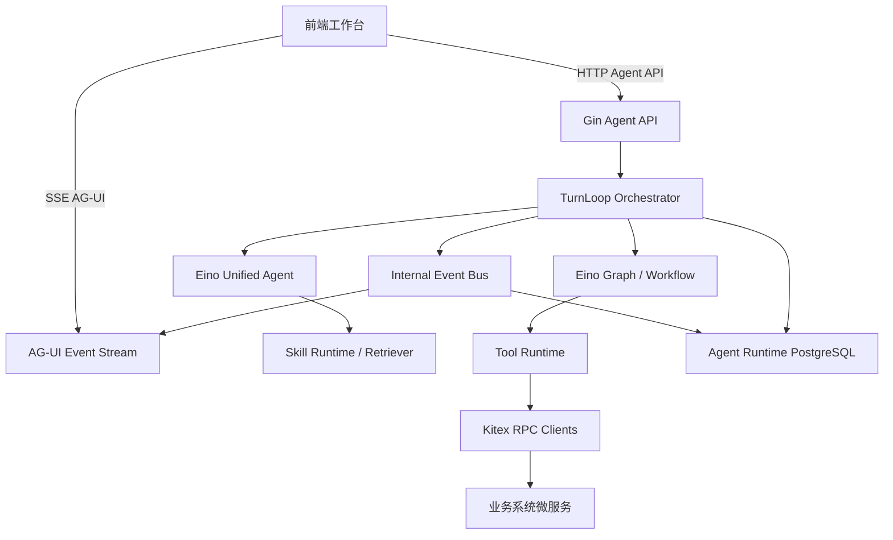

# 智能体微服务总体架构设计

状态：draft
owner：Go Eino 智能体微服务架构工程师
更新时间：2026-06-25
适用范围：`/services/agent/**`、Agent API、Eino Runtime、AG-UI 事件生产、Kitex RPC client、Agent Runtime 数据
相关代码路径：`/services/agent/**`、`/api/thrift/**`、`/api/openapi/**`、`/db/migrations/iterations/**`
相关契约：`docs/standards/AG-UI事件规范.md`、`docs/standards/RPC契约规范.md`、`docs/standards/Agent领域数据建模规范.md`、后续 `docs/contracts/**`

## 文档背景

本草案基于 `docs/product/prd/README.md` 和 `00` 到 `12` 全部 PRD，先输出智能体微服务工程前置设计。当前 PRD 套件仍为 `product_status: Draft`，因此本轮只做架构、契约需求和数据模型草案，不进入 Go 代码、IDL、migration 或正式实现。

## 目标

- 明确智能体微服务只负责 Agent Runtime、Eino 编排、Tool 编排、AG-UI 事件生产、Agent API、RPC client 和 Agent 领域数据。
- 输出工程前置需求映射矩阵，建立 PRD 条目到智能体侧产物的追踪关系。
- 定义统一 Agent 工作台的 Agent API 草案、内部事件流、AG-UI 映射、RPC client 调用需求和测试策略。
- 明确需要业务微服务确认的 RPC 能力清单，但不替业务微服务定义业务事实最终语义。

## 非目标

- 不实现 Go 代码、不生成 Kitex 代码、不编写 Thrift IDL、不创建 migration。
- 不修改 `docs/contracts/**`，本文件只提出契约需求。
- 不保存或定义积分、资产、Skill 审核、账户、企业、作品等业务事实的最终语义。
- 不设计多 Agent 体系；第一版仅围绕统一 Agent。
- 不定义平台后台、普通用户端、企业空间和作品中心的前端页面实现。

## 核心约束

- Agent 服务不能直接访问或写入业务数据库。
- 业务事实变化必须通过 Kitex RPC client 调用业务微服务。
- Agent DB 只保存会话、运行、消息、事件、Tool 调用、任务、中断、产物引用、记忆和配置等 Runtime 数据。
- 当前空间决定 Skill 池、积分账户、资产归属和历史可见范围，但最终权限和业务事实由业务微服务确认。
- 安全评估必须发生在积分预估、冻结和生成前。
- 生成类任务必须先预估并人工确认，再冻结积分，生成完成且资产保存成功后才扣费，失败、取消、超时或保存失败释放冻结积分。
- AG-UI 事件必须包含可幂等、可排序、可补偿的公共字段，不泄露系统提示词、内部推理链路、供应商原始响应、API Key、内部成本和安全策略细节。

## 产品设计读取结果

| PRD | 智能体微服务读取结论 | 工程影响 |
| --- | --- | --- |
| 00 系统概要 | 第一版统一 Agent，业务事实由业务微服务维护，AG-UI/A2UI 驱动工作台 | 建立 Agent Runtime 服务边界、Agent API、RPC client、Agent DB |
| 01 账户身份企业与空间 | 当前空间决定 Skill、积分、资产、历史；企业成员只看本人企业空间创作过程 | 所有 Agent run 必须绑定 tenant/user/space，权限通过业务 RPC 校验 |
| 02 平台后台 | 管理员配置模型、Tool、系统 Skill、审核、积分、兑换码和审计 | Agent 只读取已发布配置或调用测试能力，不承担后台业务状态 |
| 03 模型 | 文本/视觉模型由平台决定，图片/音乐/视频模型用户当前对话选择并在确认后锁定 | Agent run 保存模型选择快照，模型可选性和计价通过业务 RPC 获取 |
| 04 Tool | 平台内置 Tool 是执行边界；高风险、扣费、业务写入必须确认 | Tool Registry、风险校验、确认中断、Tool 事件、超时重试取消策略 |
| 05 Skill | Skill 是配置化可路由能力，不是业务规则；仅 Published 参与路由 | Skill 池加载、Skill 路由、Skill 输出元素校验、Skill 测试运行需求 |
| 06 工作台 | 统一 Agent、意图识别、Skill 路由、文本兜底、直接 Tool、资产和黑板 | TurnLoop 主流程、工作台事件、会话恢复、黑板草稿保存 |
| 07 积分 | 预估、确认、冻结、扣减、释放由业务微服务负责 | Agent 通过 RPC 触发估算/冻结/扣费/释放，不保存积分事实 |
| 08 资产 | 业务微服务保存资产事实和最终元素；Agent 保存过程、黑板、引用 | 资产保存 RPC、黑板事件、资产引用权限校验、保存失败释放积分 |
| 09 AG-UI/A2UI | 第一版 SSE，HTTP 确认/取消/重试/补偿查询，事件顺序和幂等 | AG-UI 事件总线、事件表、Last-Event-ID 和 run_id+sequence 补偿 |
| 10 内容安全 | LLM 提示词安全评估固定前置，失败或超时阻断 | Safety step 固化在 TurnLoop，不作为 Skill 可绕过 Tool |
| 11 通知 | Skill 审核通知由业务侧站内信负责 | Agent 不生产站内信，仅在 Skill 测试/审核相关 RPC 中记录 trace |
| 12 作品 | 作品和公开快照是业务事实，分享前文本安全评估 | Agent 可复用安全评估能力，但不保存作品或公开状态事实 |

## 工程前置需求映射矩阵

| 产品设计条目 | 工程解释 | 产出物 | owner | 契约/测试 |
| --- | --- | --- | --- | --- |
| 统一 Agent 覆盖创作场景 | 第一版只有一个 Agent Runtime，根据当前空间和 Skill 池动态路由 | Agent Runtime 总体架构、统一 Agent 配置 | Go Eino 智能体微服务架构工程师 | Agent 行为测试、Skill 路由测试 |
| 当前空间决定 Skill/积分/资产/历史 | Agent 不自行判断最终权限，每次 run 携带空间上下文并调用业务服务校验 | Agent API 上下文字段、RPC 权限上下文 | Go Eino 智能体微服务架构工程师 + 业务微服务后端工程师 | RPC contract test、权限边界测试 |
| 模型选择当前对话生效且确认后锁定 | 生成类 run 保存模型选择快照，确认后拒绝修改 | `agent_runs.model_selection_snapshot`、`chat.controls.locked` 事件 | Go Eino 智能体微服务架构工程师 | 模型锁定事件测试 |
| Skill 仅 Published 参与路由 | Skill 路由前读取当前空间可执行 Skill 池，Draft/Pending/Rejected/Deprecated 不参与 | Skill Registry/Retriever 调用需求、路由决策记录 | Go Eino 智能体微服务架构工程师 + 业务微服务后端工程师 | Skill 池过滤 contract test |
| Tool 是执行边界 | Tool 统一通过 Tool Registry 和执行器封装，不开放任意 HTTP Tool | Tool Runtime、Tool 调用事件、风险策略 | Go Eino 智能体微服务架构工程师 | Tool 权限/超时/取消测试 |
| 高风险、扣费、业务写入确认 | TurnLoop 进入 waiting_confirmation，保存 interrupt 和恢复上下文 | Interrupt/Resume API、`confirmation.required`、`interrupt.required` | Go Eino 智能体微服务架构工程师 + 前端开发工程师 | Interrupt/Resume 测试 |
| 内容安全前置 | Safety step 在预估和冻结前执行，失败或超时阻断 | Safety Workflow 节点、`safety.prompt.*` 事件 | Go Eino 智能体微服务架构工程师 | 安全阻断顺序测试 |
| 积分预估/冻结/扣费/释放 | 积分事实完全由业务 RPC 维护，Agent 只保存调用记录和事件 | Credit RPC client 需求、Tool call 记录 | 业务微服务后端工程师确认语义 | RPC mock、幂等和异常测试 |
| 生成进度和取消 | 长任务状态持久化，不依赖内存；取消后不发起新 Tool | `agent_tasks`、preempt/cancel API、`generation.progress` | Go Eino 智能体微服务架构工程师 | 长任务取消/部分完成测试 |
| 资产保存成功后扣费 | 资产事实由业务服务保存，Agent 根据保存结果触发扣费或释放需求 | Asset RPC client 需求、资产引用元数据 | 业务微服务后端工程师确认语义 | 保存失败释放测试 |
| 黑板和草稿元素 | Agent 保存草稿态黑板、分镜、脚本、提示词和过程快照 | `agent_artifacts`、`workspace.blackboard.updated` | Go Eino 智能体微服务架构工程师 + 前端开发工程师 | 黑板事件和快照恢复测试 |
| AG-UI 断线重连 | SSE 支持 Last-Event-ID 和 run_id+sequence 补偿，失败后快照恢复 | Event Store、SSE API、Snapshot API | Go Eino 智能体微服务架构工程师 | 事件重放和缺口测试 |
| 会话历史恢复 | 从历史会话恢复消息、资产引用、黑板和 run 快照 | Session API、Snapshot API、Agent DB 查询 | Go Eino 智能体微服务架构工程师 | 会话恢复测试 |
| 作品分享前安全评估 | 可复用安全评估服务能力，但作品事实和分享状态由业务服务维护 | Safety RPC/API 调用需求或内部能力复用建议 | 业务微服务后端工程师确认入口 | 分享安全 contract test 由业务侧主导 |
| 站内信通知 | Skill 审核通知不是 Agent Runtime 责任 | 无 Agent 表；仅保留 trace 关联 | 业务微服务后端工程师 | 通知业务测试 |

## 服务边界

### 智能体微服务负责

- Gin 承载 Agent API、SSE 事件流、HTTP 补偿查询、确认、取消和恢复入口。
- Eino Agent、Graph、Workflow、Tool、Skill、Retriever、Memory、Callback、Interrupt/Resume 和 TurnLoop 编排。
- 通过 Kitex client 调用业务微服务，获取账户/空间、Skill、Tool、模型、积分、资产等业务能力。
- 保存 Agent Runtime 数据：session、run、message、event、tool_call、task、interrupt、artifact、memory、runtime_config。
- 生产 AG-UI/A2UI 事件，并支持幂等、排序、断线重连和快照恢复。

### 智能体微服务不负责

- 不直接写业务数据库。
- 不保存积分账户、积分流水、业务资产、Skill 审核结果、模型供应商密钥、作品分享状态、企业成员关系等业务事实。
- 不解释业务权限最终语义。
- 不向前端泄露模型供应商原始响应、内部成本、系统提示词、安全策略细节和模型内部推理链路。

## 总体架构草案

## Agent API 草案

正式字段后续由 API 契约文档确认。本草案仅定义能力边界。

| API | 方法 | 用途 | 幂等/分页 |
| --- | --- | --- | --- |
| `/api/agent/sessions` | `POST` | 创建或恢复会话入口，绑定当前登录身份和空间 | `idempotency_key` |
| `/api/agent/sessions` | `GET` | 查询当前用户有权访问的会话列表 | 默认 `page_size=10`，定义上限 |
| `/api/agent/sessions/{session_id}` | `GET` | 获取会话摘要、最新 run 和快照状态 | 权限由业务 RPC 校验 |
| `/api/agent/sessions/{session_id}/messages` | `GET` | 分页查询会话消息 | 默认 `page_size=10` |
| `/api/agent/runs` | `POST` | 创建一次 Agent run，提交用户输入、模型选择、素材引用 | `idempotency_key` |
| `/api/agent/runs/{run_id}` | `GET` | 查询 run 状态、错误、任务和确认状态 | 只返回 Runtime 状态 |
| `/api/agent/runs/{run_id}/stream` | `GET` | SSE 实时事件流 | 支持 `Last-Event-ID` |
| `/api/agent/runs/{run_id}/events` | `GET` | 断线补偿查询 | `after_sequence`，默认 `page_size=10` |
| `/api/agent/runs/{run_id}/messages` | `POST` | 追加用户输入并推进 TurnLoop | `idempotency_key` |
| `/api/agent/runs/{run_id}/interrupts/{interrupt_id}/accept` | `POST` | 用户确认扣费、高风险或业务写入 | `idempotency_key` |
| `/api/agent/runs/{run_id}/interrupts/{interrupt_id}/reject` | `POST` | 用户拒绝确认 | `idempotency_key` |
| `/api/agent/runs/{run_id}/cancel` | `POST` | 取消或抢占长任务 | `idempotency_key` |
| `/api/agent/runs/{run_id}/snapshot` | `GET` | 事件无法补偿时返回当前快照 | 快照不替代事件事实 |

## 内部事件流与 AG-UI 映射

内部事件保存为 Agent Runtime 数据，再映射为 AG-UI 事件。事件统一包含 `event_id`、`type/event_type`、`session_id`、`run_id`、`sequence`、`timestamp`、`payload`、`trace_id`。当前规范使用 `type`，PRD 09 使用 `event_type`，需要正式契约统一命名。

| 内部事件 | AG-UI/A2UI 事件草案 | 消费组件 | 说明 |
| --- | --- | --- | --- |
| RunStarted | `agent.run.started` / `agent.started` | `message.stream` | run 开始，创建消息占位 |
| ThinkingDelta | `agent.thinking.delta` | `thinking.typewriter` | 仅输出可公开处理状态 |
| MessageDelta | `agent.message.delta` / `message.delta` | `message.stream` | 文本增量 |
| MessageCompleted | `agent.message.completed` / `message.completed` | `message.stream` | 固化消息 |
| SkillSelected | `agent.skill.selected` | `platform.tags` | 只展示公开 Skill 名称和状态 |
| SkillMissing | `agent.skill.missing` | `message.stream` | 进入文本兜底或直接 Tool |
| ControlsRequested | `chat.controls.requested` | `chat.input.controls` | 请求模型、参数或素材 |
| ControlsLocked | `chat.controls.locked` | `chat.input.controls` | 确认后锁定模型和参数 |
| SafetyEvaluated | `safety.prompt.evaluated` | `platform.tags` | 通过时可静默 |
| SafetyBlocked | `safety.prompt.blocked` | `error.notice` | 阻断，不预估不冻结 |
| CreditsEstimated | `credits.estimated` | `credit.estimate` | 展示预计积分、余额、即将过期 |
| InterruptRequired | `confirmation.required` / `interrupt.required` | `confirmation.panel` | 扣费、高风险、业务写入确认 |
| ResumeAccepted | `confirmation.accepted` / `resume.accepted` | `confirmation.panel` | 用户确认后恢复执行 |
| ToolCallStarted | `tool.call.started` / `tool.call` | `tool.status` | Tool 执行开始 |
| ToolCallCompleted | `tool.call.completed` / `tool.result` | `tool.status` | Tool 成功 |
| ToolCallFailed | `tool.call.failed` | `tool.status`、`error.notice` | Tool 失败、超时或权限错误 |
| GenerationProgress | `generation.progress` | `generation.progress` | 生成任务进度 |
| BlackboardUpdated | `workspace.blackboard.updated` | `workspace.panel` | 黑板草稿元素更新 |
| AssetSaveStarted | `asset.save.started` | `workspace.panel` | 业务资产保存中 |
| AssetSaveCompleted | `asset.save.completed` | `workspace.panel` | 保存成功后可扣费 |
| AssetSaveFailed | `asset.save.failed` | `workspace.panel`、`error.notice` | 保存失败后释放冻结积分 |
| SnapshotSaved | `process.snapshot.saved` | `workspace.panel` | 快照恢复点 |
| RunCompleted | `agent.run.completed` / `agent.completed` | `message.stream` | run 完成 |
| RunFailed | `agent.run.failed` / `agent.failed` | `error.notice` | 保留错误分类和 trace_id |
| RunCancelled | `agent.run.cancelled` | `generation.progress` | 取消后展示已完成/已释放 |

## RPC Client 调用需求清单

以下为智能体微服务调用业务微服务的能力需求，最终服务名、方法名、DTO、错误码、权限、超时、重试、幂等和 preview/confirm 语义由业务微服务后端工程师确认。

| 业务能力域 | 调用需求 | 读/写 | 关键要求 |
| --- | --- | --- | --- |
| Identity/Space | 解析当前登录身份、当前空间、租户、用户状态、企业成员状态 | 读 | 权限上下文、禁用用户阻断、被移出企业后拒绝访问 |
| Skill Catalog | 分页查询当前空间可执行 Skill 池，读取 Skill runtime 配置和输出元素结构 | 读 | 只返回 Published，可按系统/企业/个人过滤，默认分页 10 |
| Tool Catalog | 查询 Tool 可用性、风险等级、白名单、超时、重试、取消策略 | 读 | 按当前空间、用户等级、套餐、企业范围校验 |
| Model Catalog | 查询可用生成模型、默认模型、模型单价快照、模型是否可选 | 读 | 普通用户只见展示名；确认后锁定模型快照 |
| Credit | 预估积分、冻结积分、确认扣减、释放冻结、查询余额摘要 | 写 | 写操作必须幂等；冻结/扣减/释放必须 trace 和审计；失败不执行生成 |
| Asset | 校验资产引用权限、保存生成资产、保存最终资产元素、查询可引用资产摘要 | 读/写 | 业务服务保存资产事实；保存成功才允许扣费 |
| Platform Dictionary | 查询资产元素类型、作品分类等平台内置字典 | 读 | Agent 仅用于输出结构校验，不保存业务字典事实 |
| Audit | 需要业务审计的写操作记录结果 | 写 | 业务服务决定审计字段和敏感信息脱敏 |
| Content Safety Config | 获取平台指定安全评估模型或安全评估配置摘要 | 读 | 不向前端泄露策略细节；Skill 不能关闭 |
| Work/Share | 作品分享前文本安全评估可复用 Agent 安全能力 | 待确认 | 作品事实和公开快照仍由业务服务维护 |

## 错误处理

| 错误类别 | 示例 | Agent 行为 | AG-UI 行为 |
| --- | --- | --- | --- |
| user_error | 提示词为空、参数缺失、用户取消确认 | 不推进生成，可追加输入 | `error.notice` 或 `confirmation.rejected` |
| permission_denied | 空间不可用、资产无权限、Tool 不可用 | run 失败或请求补充身份 | `agent.run.failed`，展示可理解提示 |
| safety_blocked | 安全不通过、评估失败或超时 | 阻断，不预估不冻结 | `safety.prompt.blocked` |
| credit_error | 余额不足、冻结失败、扣费失败 | 不执行或触发释放补偿 | `credits.*` + `error.notice` |
| tool_error | Tool 超时、模型失败、RPC 错误 | 可恢复时保存恢复点，不可恢复则失败 | `tool.call.failed` |
| asset_error | 保存失败、元素缺失 | 不展示可用资产，触发释放 | `asset.save.failed` |
| system_error | DB、事件流、未知异常 | run failed，保留 trace_id | `agent.run.failed` |

## 可观测性

- 日志字段：`trace_id`、`service`、`env`、`tenant_id`、`user_id`、`space_id`、`session_id`、`run_id`、`turn_id`、`tool_call_id`、`task_id`、`interrupt_id`、`event_id`、`rpc_method`、`error_code`、`latency_ms`。
- 指标：run 成功率、run 失败率、Tool 成功率、Tool latency、RPC latency、安全阻断率、积分冻结失败率、资产保存失败率、SSE 重连次数、事件补偿次数。
- Trace：Agent API、TurnLoop step、Eino node、Tool call、Kitex RPC、Agent DB 写入、AG-UI event 写入需要串联同一 `trace_id`。
- 脱敏：日志和事件不记录 API Key、系统提示词、模型内部推理链路、供应商原始响应、完整兑换码、用户私密素材内容。

## 测试策略

| 测试层级 | 覆盖范围 |
| --- | --- |
| 单元测试 | Skill 路由、Tool 策略、状态机、事件映射、错误分类 |
| TurnLoop 测试 | 单轮、多轮、追加输入、确认、拒绝、恢复、取消、失败恢复 |
| RPC mock 测试 | 模型、Skill、Tool、积分、资产、权限等业务 RPC 成功和失败 |
| Contract test | 后续契约确定后覆盖请求、响应、错误码、权限、超时、重试、幂等 |
| AG-UI 测试 | 事件顺序、payload、重复 event_id、sequence 缺口、未知事件、断线重连 |
| Agent DB 测试 | CRUD、分页、幂等写、状态迁移、事件补偿、无数据库级外键约束 |
| 边界测试 | Agent 不写业务库、不保存业务事实、不泄露敏感字段 |

## 验收标准

- 已明确智能体微服务和业务微服务边界。
- 已输出 PRD 到智能体微服务的需求映射矩阵。
- 已覆盖 Agent API、AG-UI 事件、RPC client 需求、错误处理、可观测性和测试策略。
- 已识别需要业务微服务确认的 RPC 能力。
- 没有修改 Go 代码、IDL、migration 或 `docs/contracts/**`。

## 风险与待确认

- 当前 PRD 套件仍为 Draft；正式开发前需要产品体验设计师完成 Done Gate，并由主控同步契约和开发计划。
- AG-UI 标准使用 `type`，PRD 09 使用 `event_type`；正式契约需要统一字段名。
- AG-UI 标准基础事件与 PRD 09 扩展事件命名不同，例如 `agent.started` 和 `agent.run.started`；需要主控 Codex 统一兼容策略。
- 积分、资产、模型、Skill、Tool、权限等 RPC 最终语义必须由业务微服务确认。
- 内容安全评估是否完全由 Agent 内部执行，还是由业务服务提供安全评估 RPC，需要主控确认跨服务 ownership。
