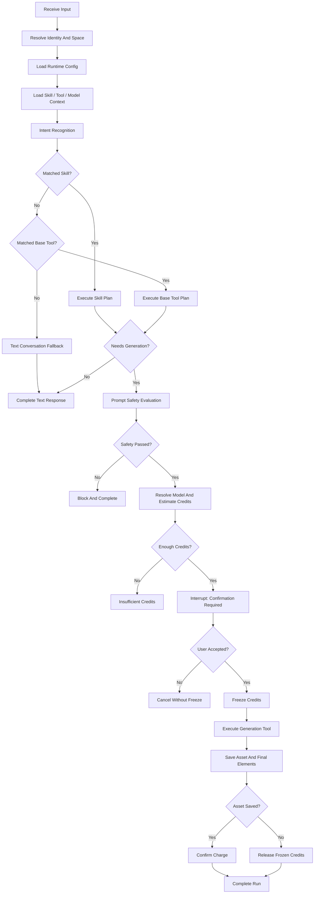

# Eino 能力选型与 TurnLoop 设计

状态：draft
owner：Go Eino 智能体微服务架构工程师
更新时间：2026-06-25
适用范围：统一 Agent、Eino 编排、Tool Runtime、Skill Runtime、Interrupt/Resume、长任务 TurnLoop
相关代码路径：`/services/agent/**`
相关契约：`docs/architecture/00-智能体微服务总体架构设计.md`、`docs/standards/TurnLoop执行规范.md`、`docs/standards/Eino智能体微服务编码规范.md`

## 文档背景

本草案根据 PRD 04、05、06、07、08、09、10 设计统一 Agent 的 Eino 能力组合和多轮执行循环。由于本轮只做设计草案，本文不写具体 Eino API 调用，不假设未验证的库接口。

## 目标

- 明确 Agent、Graph、Workflow、Tool、Skill、Retriever、Memory、Callback、Interrupt/Resume、TurnLoop 的使用边界。
- 固化“安全评估 -> 积分预估 -> 人工确认 -> 冻结 -> 生成 -> 资产保存 -> 扣费/释放”的执行顺序。
- 定义 session、run、turn、task、interrupt 的状态关系。
- 定义 Tool 调用、长任务、取消、断线重连和失败恢复策略。

## 非目标

- 不做多 Agent 架构。
- 不做拖拽 Workflow/Graph 编排。
- 不把业务规则写入 Agent、Skill 或 Tool。
- 不实现 Eino 代码或具体模型供应商适配器。

## Eino 能力选型表

| 能力 | 第一版是否使用 | 使用原因 | 边界 |
| --- | --- | --- | --- |
| Eino ADK | 使用 | 统一承载 Agent、Graph、Workflow、Tool、Callback 等运行能力 | 具体 API 以依赖版本和官方文档为准 |
| Agent | 使用 | 意图识别、Skill 路由、文本兜底、多工具动态决策 | 不直接写业务事实，不绕过 Tool |
| Graph | 使用 | 将工作台主流程拆为可观察节点：上下文加载、安全、计费、生成、保存、结算 | 节点语义稳定后再实现 |
| Workflow | 使用 | 对确定性步骤使用 Workflow：安全评估、积分闭环、资产保存结算 | 不承载开放式推理 |
| Tool | 使用 | 封装模型调用、视觉理解、业务 RPC、资产保存、文件处理 | 只能调用平台开放 Tool，业务写入走 RPC |
| Skill | 使用 | 表达可路由、可测试、可版本化的创作能力 | Skill 不是业务规则，不允许绕过安全 |
| Retriever | 使用 | 检索当前空间 Skill、历史会话摘要、资产引用、平台字典 | 检索结果需标注来源和范围 |
| Memory | 使用 | 会话短期上下文、用户授权记忆、会话摘要 | 不保存未授权敏感业务事实 |
| Callback | 使用 | 观察模型、Tool、节点、token、错误、latency 并产生内部事件 | Callback 不改变业务语义 |
| Interrupt/Resume | 使用 | 扣费、高风险、业务写入、补充输入和安全拦截 | Resume 必须校验状态、权限和幂等 |
| TurnLoop | 使用 | 多轮输入、工具后继续推理、长任务状态、中断恢复 | 不依赖进程内存作为唯一状态 |
| Multi-Agent | 不使用 | PRD 明确第一版只有一个统一 Agent | 后续版本另行设计 |
| Middleware | 使用 | trace、日志、鉴权上下文、限流、重试、超时、脱敏 | 不改变业务语义 |

## 主流程 Graph 草案

## TurnLoop 职责

- 接收用户输入、素材引用、模型选择和上下文。
- 校验 session、run、space、user 状态和权限。
- 创建或推进 run，保存消息、事件、任务和恢复点。
- 通过 Agent/Graph/Workflow 推进推理和确定性步骤。
- 调用 Tool，并在调用前后记录事件和 tool_call。
- 在扣费、高风险、业务写入或补充输入时创建 interrupt。
- 在 resume 时校验 interrupt、权限、幂等键和恢复上下文。
- 生产 AG-UI 事件并写入 Agent DB，支持 SSE 和重放。
- 长任务中维护 task 状态，支持查询、取消、失败恢复。

## session / run / turn 关系

| 对象 | 含义 | 生命周期 |
| --- | --- | --- |
| session | 一个工作台会话，聚合消息、资产引用、黑板和多个 run | `active` 到 `archived` 或 `expired` |
| turn | 用户一次输入与 Agent 响应的对话轮次 | 作为 run 内或 session 内逻辑编号保存 |
| run | 一次 Agent 执行，可能包含多个 Tool、任务和中断 | `pending` 到终态 |
| task | 长任务或生成任务状态 | 跟随 run，但可单独查询和取消 |
| interrupt | 等待用户确认、拒绝或补充输入的暂停点 | `required` 到 `resolved` 等终态 |

## run 状态机

| 当前状态 | 可迁移到 | 触发条件 |
| --- | --- | --- |
| pending | running | TurnLoop 开始执行 |
| running | waiting_confirmation | 需要扣费、高风险、业务写入或补充输入 |
| waiting_confirmation | resuming | 用户确认且 resume 幂等校验通过 |
| waiting_confirmation | cancelled | 用户拒绝或取消 |
| waiting_confirmation | failed | interrupt 过期或恢复上下文失效 |
| resuming | running | 恢复执行 |
| running | completed | 执行成功并完成结算 |
| running | failed | 不可恢复错误 |
| running | cancelled | 用户取消或抢占 |
| running | waiting_confirmation | 后续步骤再次需要确认 |

## 单轮执行

1. 前端提交用户输入和当前空间上下文。
2. Agent API 创建 `agent_runs`，保存用户消息和 `agent.run.started`。
3. TurnLoop 加载身份、空间、Skill、Tool、模型上下文。
4. Agent 做意图识别和 Skill 路由。
5. 若无需生成，输出文本回复并完成 run。
6. 若需要生成，进入安全、积分、确认、生成和保存流程。
7. 所有状态变化写入 `agent_events` 并推送 SSE。

## 多轮与追加输入

- 追加输入必须校验 session 属于当前用户和空间，且 run 状态允许继续。
- 若上一 run 已完成，则创建新 run 并关联同一 session。
- 若 run 正在 `waiting_confirmation`，追加输入默认不替代确认；需要产品确认是否允许“修改参数后重新预估”。草案建议取消当前 interrupt 后创建新 run。
- 追加输入保存为 `agent_messages`，并触发 `agent.message.delta` 或 `chat.controls.requested`。

## Tool 调用规则

- Tool 调用前必须记录 `tool.call.started` 和 `agent_tool_calls`。
- Tool 输入 DTO 按场景划分，不复用业务 ORM 或业务大对象。
- Tool 调用必须携带 `trace_id`、`session_id`、`run_id`、`space_id`、`actor_user_id`。
- 业务 RPC 写入 Tool 必须携带 `idempotency_key`。
- 只有幂等读或带幂等键写操作可以按策略重试。
- 不在 `for` 循环中逐条调用业务 RPC；需要多对象时提出批量或分页 RPC。
- Tool 输出给用户的信息必须脱敏，不展示密钥、内部成本、供应商原始响应。

## Interrupt / Resume 设计

| 场景 | interrupt payload | resume 校验 |
| --- | --- | --- |
| 积分扣费确认 | 预计积分、可用积分、即将过期积分、模型名称、资源数量或秒数 | run 状态、用户权限、模型和参数锁定、幂等键 |
| 高风险 Tool | 风险等级、公开风险说明、允许动作、过期时间 | Tool 仍可用、空间权限、幂等键 |
| 业务写入 | 业务动作摘要、preview 结果、确认影响 | 业务 RPC confirm 语义、权限、幂等键 |
| 补充输入 | 缺失字段、字段说明、允许输入格式 | 输入格式、run 状态、权限 |

Resume 成功后必须输出 `resume.accepted` 或 `confirmation.accepted`，并将 run 从 `waiting_confirmation` 推进到 `resuming` 后回到 `running`。拒绝确认时输出 `confirmation.rejected`，不执行后续 Tool。

## 安全评估步骤

- 安全评估在模型选择锁定和积分预估前完成。
- 评估对象包括用户输入、聊天控件文本、Skill 组装后的生成前提示词、上传素材标题/说明/标签、分享作品标题/简介/标签等文本。
- 安全不通过、失败或超时均阻断生成，不冻结积分。
- 保存的评估结果只包含状态、时间、评估对象摘要、用户可见原因和 trace，不保存策略细节、系统提示词或模型推理链路。
- Skill 不能关闭或绕过安全评估。

## 积分闭环步骤

| 步骤 | 执行方 | Agent 保存内容 |
| --- | --- | --- |
| 预估 | 业务微服务 | RPC 调用记录、预估摘要事件 |
| 确认 | Agent Interrupt + 前端 | interrupt、确认事件 |
| 冻结 | 业务微服务 | RPC 调用记录、冻结成功/失败事件 |
| 扣减 | 业务微服务 | 资产保存成功后的扣费结果事件 |
| 释放 | 业务微服务 | 失败、取消、超时、保存失败后的释放事件 |

Agent 不保存积分账户余额、积分批次、流水和扣费事实，只保存 Runtime 过程、trace 和事件摘要。

## 资产与黑板步骤

- 黑板草稿态元素保存在 Agent DB，用于工作台过程展示和会话恢复。
- 最终资产、最终资产元素、资产归属、预览、下载、权限由业务微服务保存。
- 资产保存成功后，Agent 才触发业务扣费确认 RPC 需求。
- 资产保存失败时，Agent 输出 `asset.save.failed`，调用积分释放需求，不展示为可用资产。
- Agent 保存资产引用元数据时只保存引用 ID、来源 run、展示摘要和权限校验结果，不复制业务资产事实。

## 长任务与取消

- 生成任务进入 `agent_tasks`，状态持久化。
- 取消或抢占后不再发起新 Tool。
- 已完成且保存成功的资产按业务规则扣费，未完成或保存失败的部分释放冻结积分。
- 长任务取消输出 `agent.run.cancelled` 和任务状态事件。
- 取消不自动回滚已经由业务服务确认成功的业务写入。

## Callback 与可观测性

| Callback | 观察点 | 输出 |
| --- | --- | --- |
| ModelCallback | token、latency、错误分类 | 内部指标和可公开 thinking 状态 |
| ToolCallback | tool_name、status、latency、error_code | Tool 事件、日志、指标 |
| GraphCallback | node、edge、state、duration | graph node 事件和 trace |
| EventCallback | AG-UI event 写入和推送 | event_id、sequence、失败补偿 |
| ErrorCallback | recoverable、error_code、trace_id | `agent.run.failed` 或可恢复提示 |

## Retriever 与 Memory

- Skill Retriever：按当前空间检索系统 Skill、企业 Skill、个人 Skill，过滤非 Published。
- Asset Retriever：按用户权限检索可引用资产摘要，不获取私有原始链接。
- History Retriever：检索会话摘要、最近消息和黑板摘要，避免一次加载全部历史。
- Dictionary Retriever：读取平台内置资产元素类型和作品分类等字典。
- Memory：默认存储短期会话摘要和用户授权偏好，不保存积分、资产权限、企业成员关系等业务事实。

## 事件输出规则

- 每次状态变化、消息增量、Tool 调用、中断、恢复、任务进度、资产保存、扣费结果和失败都输出事件。
- 同一 run 内 `sequence` 单调递增。
- `event_id` 全局唯一，重放时保持不变。
- 前端按 `event_id` 去重，按 `sequence` 合并。
- 断线后优先 `Last-Event-ID`，其次 `run_id + after_sequence`，补偿失败返回快照。

## 测试策略

- 意图识别：无 Skill、匹配 Skill、匹配基础 Tool。
- Skill 路由：当前空间 Skill 池过滤、非 Published 不参与。
- 安全评估：通过、阻断、失败、超时，验证不预估不冻结。
- 积分闭环：预估不足、确认取消、冻结失败、生成失败、保存失败、部分完成。
- Interrupt/Resume：重复确认、过期、权限变化、幂等冲突。
- Tool：权限不足、停用、超时、幂等重试、非幂等不重试。
- 长任务：进度、取消、断线重连、快照恢复。
- 事件：顺序、幂等、未知事件、payload 脱敏。

## 验收标准

- 已覆盖 Eino Agent、Graph、Workflow、Tool、Skill、Retriever、Memory、Callback、Interrupt/Resume 和 TurnLoop 选型。
- 已定义主流程、状态机、确认恢复、长任务和取消策略。
- 已明确安全、积分、资产保存和扣费顺序。
- 已保持业务事实由业务微服务通过 RPC 维护。

## 风险与待确认

- 具体 Eino API 和版本需在实现前检查仓库依赖和官方文档。
- “追加输入是否可修改等待确认中的参数”需要产品和前端确认。
- 内容安全能力的服务归属需要确认：Agent 内部固定步骤或业务安全 RPC。
- PRD 09 扩展事件命名需要和 AG-UI 标准基础事件统一。
