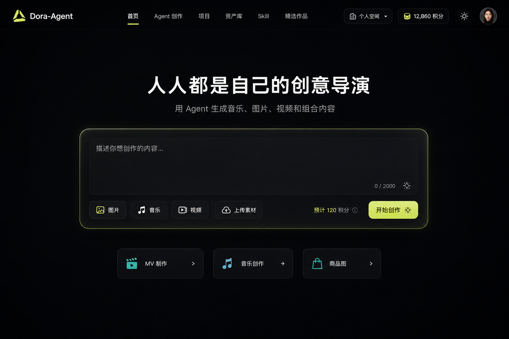

# 首页体验设计

状态：draft
owner：产品与需求责任域
更新时间：2026-06-25
适用范围：Dora-Agent Web 用户端首页，不包含 Agent 深度创作工作台

## 关联文档

- [UI/UE 设计总纲](./00-UIUE设计总纲.md)
- [站点信息架构与导航](./01-站点信息架构与导航.md)
- [统一 Agent 创作工作台体验设计](./02-统一Agent创作工作台体验设计.md)
- [视觉风格与设计 Token 规范](./08-视觉风格与设计Token规范.md)

## 设计结论

首页是轻量创作入口，不是完整工作台，不承载复杂创作过程。第一版采用用户端左右结构，左侧保持导航稳定，右侧首屏保持极简，以暗色电影级创作入口为主。

首页只解决三件事：

- 让未登录访客先看到公开创作能力和公开作品。
- 让登录用户确认当前登录身份和空间。
- 让用户从一个想法快速进入 Agent 创作。
- 让用户选择少量高频场景快速开始。

## 页面结构

```text
左侧 AppSideNav / PublicSideNav
  ↓
右侧首页内容
  Prompt 创作入口
  快捷开始
  首页公开作品
  登录后最近项目
```

## 左侧导航

左侧导航包含：

- Dora-Agent Logo。
- 首页。
- Agent 创作。
- 项目。
- 资产库。
- Skill。
- 精选作品。
- 当前空间，登录后展示。
- 主题切换。
- 登录 / 注册，未登录展示在底部。

右侧 ContextHeader 包含：

- 当前空间，登录后展示。
- 积分余额，登录后展示。
- 通知，登录后展示。
- 用户菜单，登录后展示。

首页导航不展示平台后台入口。平台后台使用独立入口和独立代码。桌面不使用顶部横向主导航。

## 居中创作入口

创作入口是右侧首页内容首屏核心。

内容包含：

- 标题：`创作，从一个想法开始`。
- 副标题：`用 Agent 生成音乐、图片、视频和组合内容`。
- 主输入框：`描述你想创作的内容...`。
- 模型类型入口：图片、音乐、视频。
- 上传素材入口。
- 预计积分消耗。
- 主按钮：`开始创作`。

交互规则：

- 已登录用户输入后点击开始创作，创建项目并进入 Agent 创作页。
- 未登录访客可以输入 Prompt；点击开始创作时弹出登录弹窗，登录后保留 Prompt 并继续创建项目。
- 选择模型类型仅作为当前对话的生成意图入口，实际模型仍按模型选择规则处理。
- 上传素材需要登录；未登录点击上传时弹出登录弹窗。
- 进入扣费确认前，首页不展示复杂参数。

## 快捷开始

首页仅展示少量高频场景，不展示完整能力矩阵。

第一版首屏展示 3 个：

- MV 制作。
- 音乐创作。
- 商品图。

快捷入口规则：

- 已登录点击后进入 Agent 创作页，并带入对应场景意图。
- 未登录点击后弹出登录弹窗，登录后继续进入对应场景。
- 首页不展示所有 Skill。
- 首页不展示完整 Tool 或模型列表。

## 最近项目

最近项目用于继续创作，但不作为首屏必需模块。

展示规则：

- 最近项目是登录后个性化数据，未登录不展示真实最近项目。
- 可放在首屏下方或后续版本。
- 若展示，最多展示 3-4 个。
- 每个项目展示封面、标题、类型、最近时间。
- 支持点击进入项目或会话。
- 无项目时展示轻量空态和开始创作入口。

## 首页公开作品

首页可以展示少量公开作品，用于让未登录访客理解平台能力。

展示规则：

- 仅使用 Shared 状态作品的公开快照。
- 未登录访客和登录用户都可以查看公开作品摘要。
- 点击公开作品进入精选作品详情或精选作品中心。
- 不展示源会话、黑板、提示词、积分、模型成本、内部用户 ID、手机号、邮箱或私有素材。
- 点赞等需要登录的动作弹出登录弹窗。

## 登录弹窗

需要登录的首页动作统一由登录弹窗承接：

- 开始创作。
- 快捷 Skill 创作。
- 上传素材。
- 选择个人资产。
- 查看最近项目。
- 点赞公开作品。

登录弹窗需要保留触发前的 Prompt、场景、公开作品位置和当前页面，登录成功后继续原动作或回到触发位置。

## 不在首页展示

以下内容不放在首页首屏：

- 黑板详情。
- 资产库完整列表。
- 当前任务详情侧栏。
- 生成进度大卡片。
- 平台后台预览。
- 用户管理、模型管理、Tool 管理等后台内容。
- 精选作品完整列表。
- 积分明细。
- 企业成员管理。

这些内容进入对应页面或 Agent 创作工作台后展示。

## 首页与工作台分工

| 页面 | 职责 |
| --- | --- |
| 首页 | 轻量入口、快速开始、最近项目 |
| Agent 创作页 | 对话、模型选择、扣费确认、生成执行、A2UI、资产、黑板 |
| 项目页 | 项目列表、会话历史、创作过程回看 |
| 资产库 | 素材管理、生成资产管理、上传素材 |
| 精选作品 | 公开作品浏览、点赞、分享、分类、标签 |

## 效果图



## 注意事项

- 首页首屏保持轻，不做 Dashboard 化。
- 首页桌面默认左右结构；左侧导航稳定，右侧内容可以保持居中视觉重心。
- 首页公开内容允许未登录访问，但所有个人化内容和创作写操作需要登录弹窗承接。
- 首页可以参考 Flova 的创作入口心智，但业务结构以 Dora-Agent PRD 为准。
- 日间和夜间主题必须使用同一套语义 token。
- 首页适配桌面 Web，不作为完整移动端创作体验。
