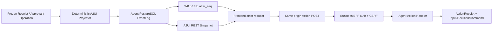

# Agent A2UI Event / Card / Action v1 契约评审

> 状态：Draft，待 Agent / Business / 前端 / 安全 / 运维联合评审；**未通过 W2-R08 实现门禁**
>
> 日期：2026-07-14
>
> 适用范围：W2 Runner 冻结结果到 Workspace EventLog、A2UI Card，以及浏览器提交白名单 Action 的最小纵切
>
> 不授权事项：本文不批准 Go/SQL/IDL/生产前端 Action，不把任何候选字段标记为 Approved

> 2026-07-16 子集批准：完整 A2UI Event/Card/Action 仍未通过 W2-R08；V1 Preview 只获准实现无 Action 的 CreationSpec Draft Card、`creation_spec.preview.completed/failed` Event 与 Snapshot/SSE 恢复。它不开放通用组件、Approval Action 或生产 A2UI availability。

关联基线：

- [Agent Runner 与 PostgreSQL Session Lane v1 设计评审](./runner-session-lane-review-v1.md)
- [Agent Session / Event 基础评审](./session-event-foundation-review.md)
- [AIGC 跨 Module 契约目录](../cross-module/aigc-contract-catalog.md)
- [功能优先开发与试跑计划](../../requirements/full-function-smoke-development-plan.md)
- [历史 Target Design：AIGC A2UI](../../aigc-a2ui-design.md)

## 1. 评审结论与范围

当前完整生产结论：**Draft，可用于跨角色逐字段评审，不可用于完整生产开工或宣称 W2-R08 已关闭。** 文档顶部冻结的 V1 Preview 无 Action 子集不受该生产结论撤销。

本文冻结的是“候选评审基线”，不是已批准实现：

1. 复用已经真实落地的 W0.5 PostgreSQL EventLog、`after_seq` SSE、Ready/Reset 和 REST 回源语义；
2. 提出最小 A2UI Event、Card、Component、Action Request/Receipt 和 Error Envelope 候选 DTO；
3. 规定严格主版本、白名单、Card Revision、Action 防重放、权限、CSRF、项目范围与日志脱敏；
4. 给出前后端固定正/负向量、浏览器刷新/重连/回放测试和无 Mock/fallback 门禁；
5. 保留需要跨角色关闭的字段、限额、保留期与发布协商决策。

本文不定义 Storyboard、Asset、Approval、Operation、Turn、Run 或 ToolReceipt 的业务真值；不允许 Worker 生成 A2UI；不暴露 Eino AgentEvent、Graph State、Checkpoint、模型原始输出、Provider 响应或内部 Tool 参数。

## 2. 当前仓库事实与目标候选必须分开

### 2.1 截至 2026-07-14 的当前事实

| 范围 | 当前事实 | 证据/影响 |
|---|---|---|
| W0.5 Snapshot | Agent 已实现 `GET /api/v1/agent/sessions/{session_id}/workspace`，版本为 `session.workspace.v1` | 当前只含 Session、User Message、Input、`event_high_watermark/min_available_seq`，不含 A2UI Card |
| W0.5 Event | 外层为 `workspace.event.v1`，当前 Payload 只允许 `session.event.v1` | 当前事件白名单只有 `session.created`、`session.input.accepted` |
| W0.5 SSE | `GET /api/v1/agent/sessions/{session_id}/events?after_seq=N`；PostgreSQL poll-first | 当前明确拒绝 `Last-Event-ID` 请求头；持久事件 `id == seq`，控制帧无 `id` |
| W0.5 Reset | `stream.reset` 的版本为 `workspace.stream-control.v1` | `cursor_expired/event_gap/projection_invalid` 均要求完整 Snapshot 回源后重连 |
| W0.5 身份 | Browser 访问 Business 同源 BFF；Agent 校验短期内部身份断言、Scope、方法、规范路径、Session 和一次性 Nonce | Redis 只参与断言防重放/连接预算，不是 Event 真源 |
| W0.5 Error | 当前 HTTP 外层是 `{ "error": { code, message, request_id, retryable, details } }` | `details` 当前固定为空对象；本契约不得破坏现有 GET 错误解码 |
| Agent A2UI | Agent Module 没有 A2UI 后端包、表、投影器、Action Handler 或 Event 类型 | 当前 Migration 和强类型投影遇到 A2UI Event 会 fail closed |
| 前端 Workspace | 正式工作台只订阅两个 W0.5 持久事件，并严格校验版本、SSE id、绑定和 seq | 新 Event 在消费者注册完成前不得发布，否则旧客户端无法消费 |
| 前端遗留 A2UI | `a2uiProtocol.js` 使用 `a2ui_version = 1.0`、`append_card/update_card` 和 one-of Component；大页面调用 `/api/aigc/**` | 没有匹配的当前 Agent 后端，字段校验和 revision/receipt/权限语义不足，不是兼容承诺 |
| 历史回放 | 遗留页面从消息正文猜测 A2UI JSON，并与实时流走不同 Transport | 目标必须改为 EventLog/REST Read Model 共用严格 reducer，不再从 Assistant 正文推断协议 |

直接证据包括当前的 [`workspace_handler.go`](../../../agent/internal/httpserver/workspace_handler.go)、[`workspaceContract.js`](../../../frontend/src/features/workspace/workspaceContract.js)、[`workspaceEventStream.js`](../../../frontend/src/features/workspace/workspaceEventStream.js) 和遗留 [`a2uiProtocol.js`](../../../frontend/src/features/aigc/a2uiProtocol.js)。

### 2.2 W2 目标候选



- Receipt/Approval/Operation 完全冻结后，确定性 Projector 才可写 A2UI；投影重试不能重跑模型、Tool、扣费或 Provider。
- EventLog 是可恢复投影真源，SSE 只是交付；业务终态仍由对应 REST/RPC 权威查询确认。
- Card 只携带展示所需摘要、稳定 ID、版本与资源引用；大对象从 Owner Read API 回源。
- Action 只表达用户意图。身份、权限、Project、金额、资源摘要、Tool Pin 和 Approval 资格由服务端重新查询。

## 3. 版本与兼容策略

### 3.1 候选版本注册表

| DTO | 候选版本 | 规则 |
|---|---|---|
| W0.5 Event 外层 | `workspace.event.v1` | 复用现有字段和 SSE `id == seq`；不静默加必填字段 |
| W0.5 Stream 控制 | `workspace.stream-control.v1` | 复用 `stream.ready/reset`；控制帧无 id、不推进 Cursor |
| A2UI Event Payload | `a2ui.event.v1` | 新 Payload Registry；不得伪装为 `session.event.v1` |
| A2UI Card | `a2ui.card.v1` | Card 快照为完整替换 DTO，不接受任意 JSON Patch |
| A2UI Component | `a2ui.component.v1` | `type + props` 严格 one-of；未知类型整 Card fail closed |
| Action Definition | `a2ui.action-definition.v1` | Card 内权威动作定义；冻结 Card revision、Action 类型、目标 exact-set 和用户可填字段 Schema |
| Action Request | `a2ui.action-request.v1` | 浏览器提交白名单意图；`action_id` 为防重放身份 |
| Action Receipt | `a2ui.action-receipt.v1` | Agent PostgreSQL 不可变回执；同义重放返回原回执 |
| A2UI Error Details | `a2ui.error-details.v1` | 嵌入现有 Error Envelope 的 `details`，不改变 W0.5 顶层错误形状 |
| A2UI REST Snapshot | `a2ui.snapshot.v1` | 独立回源，不向 `session.workspace.v1` 静默加 Card 字段 |

版本字符串必须逐值匹配；未知主版本拒绝整 DTO，不做部分执行。新增可选字段是否留在同一主版本，必须先进入前后端共享 Schema 和固定向量；删除字段、改变默认值/枚举/幂等语义/Owner 必须升主版本。

### 3.2 W0.5 兼容发布窗口

`workspace.event.v1` 的结构可复用，但 A2UI 是新增事件白名单。发布顺序候选为：

1. 前端先部署能够注册并严格解析 A2UI Event 的版本，但 Feature Flag 保持关闭；
2. Agent 向前 Migration、codec、REST Snapshot、投影器和 Action Receipt 完成；
3. 契约测试与浏览器回放通过后，按客户端能力/服务端 Flag 开启发布；
4. 观察旧消费者、未知事件、Reset 循环和积压指标；
5. 迁移窗口清零后才允许移除旧前端入口。

不允许让旧客户端在同一流中收到它不认识的 A2UI Event；具体采用能力协商、独立 Event Registry Flag 还是短期双流，是第 14 节未决策项。

## 4. Event DTO 候选

### 4.1 复用的外层 Envelope

A2UI 持久事件继续使用现有 `workspace.event.v1` 外层字段：

```json
{
  "schema_version": "workspace.event.v1",
  "payload_schema_version": "a2ui.event.v1",
  "event_id": "019f0000-0000-7000-8000-000000000101",
  "session_id": "019f0000-0000-7000-8000-000000000005",
  "project_id": "019f0000-0000-7000-8000-000000000004",
  "seq": 12,
  "event": "a2ui.card.upserted",
  "occurred_at": "2026-07-14T08:00:00Z",
  "aggregate_type": "a2ui_card",
  "aggregate_id": "019f0000-0000-7000-8000-000000000102",
  "aggregate_version": 2,
  "payload": {}
}
```

外层交叉约束：SSE event 名必须等于 `event`；SSE id 必须等于规范十进制 `seq`；Session/Project 必须等于已认证绑定。Card Event 的 `aggregate_id/version` 必须等于 `card_id/revision`；`a2ui.action.receipted` 的 `aggregate_id/version` 必须等于 `action_receipt_id/action_receipt_version`，其中 v1 的 Receipt version 固定为 1，不能使用 Card revision、重放次数或投递次数替代。

### 4.2 最小持久事件白名单

| Event | Aggregate | Payload 必填 | Reducer 语义 |
|---|---|---|---|
| `a2ui.card.upserted` | `a2ui_card` | 完整 Card、Correlation | 首次 revision 必须为 1；后续只能 `current + 1`，同 revision 同 event_id 为重复 |
| `a2ui.card.withdrawn` | `a2ui_card` | `card_id/revision/reason/correlation` | 隐藏交互面，不删除 EventLog；revision 仍连续递增 |
| `a2ui.action.receipted` | `a2ui_action_receipt` | 完整 Action Receipt 摘要、Correlation | 关闭重复提交态；不得替代权威 Approval/Operation 查询 |
| `a2ui.error.projected` | `a2ui_card` 或来源聚合 | 安全 Error Projection、Correlation | 展示固定不可执行状态；不携带内部堆栈或原始 Payload |

禁止通用 `event_type`、动态事件名、任意 JSON Patch 或由模型直接决定 Event。每个事件必须有独立 Go/TS DTO、严格 decoder 和固定向量。

### 4.3 Correlation

```json
{
  "request_id": "019f0000-0000-7000-8000-000000000110",
  "trace_id": "4f3c2f6e1a7842209bd531bff94e0123",
  "input_id": "019f0000-0000-7000-8000-000000000111",
  "turn_id": "019f0000-0000-7000-8000-000000000112",
  "run_id": "019f0000-0000-7000-8000-000000000113",
  "tool_receipt_id": "019f0000-0000-7000-8000-000000000114",
  "action_definition_id": null,
  "action_id": null,
  "action_receipt_id": null
}
```

`request_id` 必填；其他字段按来源选填，但存在时必须是规范值并能从 Agent 权威记录逐值验证。客户端不得用 Correlation 字段授予权限或猜测终态。日志默认只记录这些 ID、版本、状态、错误码和 digest。

## 5. Card 与 Component DTO 候选

### 5.1 Card

```json
{
  "schema_version": "a2ui.card.v1",
  "card_id": "019f0000-0000-7000-8000-000000000102",
  "revision": 2,
  "card_kind": "approval",
  "status": "waiting_user",
  "title": "确认创作方案",
  "summary_markdown": "请核对范围与预算。",
  "root_component_id": "root",
  "components": [
    {"schema_version":"a2ui.component.v1","component_id":"root","type":"container","props":{"layout":"column","children":["decision","submit"]}},
    {"schema_version":"a2ui.component.v1","component_id":"decision","type":"single_choice","props":{"name":"action","label":"处理方式","required":true,"options":[{"value":"approve","label":"确认"},{"value":"reject","label":"拒绝"}]}},
    {"schema_version":"a2ui.component.v1","component_id":"submit","type":"submit_action","props":{"action_definition_id":"019f0000-0000-7000-8000-000000000120","label":"提交","confirm_text":"确认提交？"}}
  ],
  "allowed_action_definition_ids": ["019f0000-0000-7000-8000-000000000120"],
  "action_definitions": [{
    "schema_version": "a2ui.action-definition.v1",
    "action_definition_id": "019f0000-0000-7000-8000-000000000120",
    "card_id": "019f0000-0000-7000-8000-000000000102",
    "card_revision": 2,
    "action_type": "approval.decide",
    "target_exact_set": [{"target_type":"approval","target_id":"019f0000-0000-7000-8000-000000000121","target_version":3,"target_digest":"sha256:..."}],
    "payload_schema": {"additional_fields":false,"fields":[{"name":"action","value_type":"enum","required":true,"enum_values":["approve","reject"]},{"name":"decision_id","value_type":"uuid_v7","required":true}]},
    "action_definition_digest": "sha256:..."
  }],
  "resource_reload_hints": ["storyboard", "assets"],
  "expires_at": "2026-07-15T08:00:00Z",
  "source": {
    "source_type": "approval",
    "source_id": "019f0000-0000-7000-8000-000000000121",
    "source_version": 3,
    "source_digest": "sha256:..."
  }
}
```

候选枚举：

- `card_kind`：`message`、`form`、`approval`、`tool_status`、`operation_status`、`error`；
- `status`：`informational`、`waiting_user`、`running`、`succeeded`、`partial`、`failed`、`cancelled`、`expired`、`superseded`、`unsupported`；
- `resource_reload_hints`：`storyboard`、`assets`、`jobs`、`run`、`approval`、`operation`，只映射前端固定 Read API，不含 URL。

Card 约束：

1. `card_id` 为规范 UUIDv7，在同一语义 Card 生命周期内稳定；`revision` 从 1 连续递增。
2. 每次 upsert 携带完整 Card；前端不得把缺失字段解释为“沿用旧值”。
3. 从 `root_component_id` 可达的全部 `submit_action.action_definition_id` 集合、`allowed_action_definition_ids` 集合和 `action_definitions[].action_definition_id` 集合必须完全相等；重复、额外、缺失、不可达或悬空定义均拒绝整 Card。非交互 Card 的三个集合必须同时为空。它标识服务端预声明的动作定义，不是浏览器重试键。Card 终态、过期或 superseded 后均不可提交。
4. `source` 只保存稳定引用、版本和 digest，不复制受保护 Intent、Prompt、金额明细或业务对象。
5. 所有 Component 必须从 `root_component_id` 可达、ID 唯一、无环；未知/重复/悬空节点拒绝整 Card。

### 5.2 W2 最小组件白名单

| `type` | 用途 | 关键 props | 交互 |
|---|---|---|---|
| `container` | 固定 Column/Row/Card 布局 | `layout/children` | 否 |
| `text` | 纯文本 | `text/usage` | 否 |
| `markdown` | 安全 CommonMark 子集 | `markdown` | 否 |
| `text_input` | 单/多行文本 | `name/label/required/min_length/max_length/multiline` | 是 |
| `single_choice` | 单选 | `name/label/required/options` | 是 |
| `multi_choice` | 多选 | `name/label/required/min_items/max_items/options` | 是 |
| `asset_picker` | 选择已授权 Business Asset | `name/media_types/min_items/max_items` | 是，只提交 Asset ID |
| `image_gallery` | 多图片展示 | `asset_ids/selectable` | 可选 |
| `video_gallery` | 多视频展示 | `asset_ids` | 否 |
| `audio_gallery` | 多音频展示 | `asset_ids` | 否 |
| `vertical_steps` | 稳定步骤及状态 | `steps` | 否 |
| `tool_renderer` | Graph Tool 高层状态 | `tool_key/tool_receipt_id/result_code` | 动作另由按钮声明 |
| `status_renderer` | 通用状态/安全错误 | `code/message/retryable` | 否 |
| `submit_action` | 提交白名单 Action | `action_definition_id/label/confirm_text`；Action 类型只从匹配 Definition 取得 | 是 |

统一节点形状：

```json
{
  "schema_version": "a2ui.component.v1",
  "component_id": "decision",
  "type": "single_choice",
  "props": {
    "name": "action",
    "label": "处理方式",
    "required": true,
    "options": [
      { "value": "approve", "label": "确认" },
      { "value": "reject", "label": "拒绝" }
    ]
  }
}
```

这不是遗留 `{ component: { Markdown: ... } }` 的兼容别名。每个 `type` 有独立 props Schema；不得接受多种类型字段、动态组件名、任意 CSS、HTML、事件属性、模块路径或脚本。

### 5.3 Markdown、媒体与边界

- Markdown 仅允许纯文本、标题、列表、强调、行内/块代码和 `https/http/mailto` 链接；禁用原始 HTML、iframe、图片语法、`data:`、`javascript:` 和事件属性。
- 服务端先做 allowlist 校验/规范化，前端仍用 React 节点安全渲染；任一端不得使用 `dangerouslySetInnerHTML`。
- Gallery 只下发 Business Asset ID；短期签名 URL、MIME、poster 和访问授权从 Business Read API 获取并按 Project 复验。
- 默认候选上限：单 Event 256 KiB、单 Card 100 个 Component、深度 8、单文本 64 KiB。最终值待性能/安全评审，未关闭前不可视为 Approved。
- 未知组件、未知 props、非法树、超限或危险 Markdown：服务端不得写部分 Event；前端若收到则整 Card 进入本地固定 `unsupported` 非交互态并触发安全遥测/REST 回源，不保留其中 Action。

## 6. Action Request / Receipt DTO 候选

### 6.1 HTTP 边界

候选路径：

- `POST /api/v1/agent/sessions/{session_id}/a2ui/actions`
- `GET /api/v1/agent/sessions/{session_id}/a2ui`：返回 `a2ui.snapshot.v1` Card Read Model 和 `event_high_watermark`

路径只是 Draft 候选。正式注册前必须完成 Business BFF、内部身份 Scope、CSRF 和所有权契约评审。

浏览器用 `X-Request-ID` 传规范 UUIDv7。Card 中的 `action_definition_id` 由服务端预先冻结，用于确认该 Card revision 允许哪一种动作；`action_id` 由浏览器在每次新的用户意图第一次点击前生成，只作为该意图的幂等身份，并在超时/断线重试中保持不变。两者不得互换或相互推导。Agent 只信任 Business 验证并签入内部断言的 RequestID、用户、Project、Session、method、canonical target、body digest、scope、nonce 和 expiry。

### 6.2 ActionDefinitionV1 权威绑定

`ActionDefinitionV1` 是服务端在 Card revision 内冻结的唯一动作权限描述，浏览器不得创建或改写。`card_id/card_revision/action_type/target_exact_set/payload_schema` 均进入 `action_definition_digest` 的确定性规范化摘要；同一 Definition ID 不得跨 Card 或 revision 复用。

`target_exact_set` 非空、按 `(target_type,target_id)` 排序且无重复。`approval.decide`、`operation.control`、`graph_tool.invoke` 分别必须且只能包含一个 `approval`、`operation`、`graph_tool_definition` target；其 `target_id/target_version/target_digest` 分别绑定权威 Approval、Operation、已审核 Tool Definition。`form.submit` 必须且只能包含一个 `session_input_form` target。Approval/Operation/Form 的 ID 必须为 UUIDv7；Tool ID 必须为 Registry 中的规范 `tool_key`；version 必须为正安全整数，digest 必须为小写 `sha256:<64hex>`。

`payload_schema.additional_fields` 在 v1 必须为 `false`；`fields` 名称唯一，只允许显式 `string/boolean/safe_integer/enum/uuid_v7/string_list/asset_id_list` 类型及对应长度、范围、枚举和数量约束，不接受任意 object/map、条件 Schema、默认隐藏值或客户端 target 字段。各 Action 的冻结形状为：

| `action_type` | `target_exact_set` | 浏览器 Payload 允许字段 |
|---|---|---|
| `form.submit` | 恰一个 `session_input_form{id,version,digest}` | Definition 声明且与可达输入组件同名同约束的用户值 |
| `approval.decide` | 恰一个 `approval{id,version,digest}` | `action: enum(approve,reject)`、`decision_id: uuid_v7` |
| `graph_tool.invoke` | 恰一个已审核 `graph_tool_definition{id,version,digest}` | Definition 声明的 Tool 表单用户值 |
| `operation.control` | 恰一个 `operation{id,version,digest}` | `command: enum(cancel)` |

### 6.3 Action Request

```json
{
  "schema_version": "a2ui.action-request.v1",
  "action_definition_id": "019f0000-0000-7000-8000-000000000120",
  "action_id": "019f0000-0000-7000-8000-000000000130",
  "card_id": "019f0000-0000-7000-8000-000000000102",
  "card_revision": 2,
  "action_type": "approval.decide",
  "payload": {
    "action": "approve",
    "decision_id": "019f0000-0000-7000-8000-000000000131"
  }
}
```

W2 最小 Action 白名单：

| `action_type` | Payload | 权威效果 |
|---|---|---|
| `form.submit` | Definition 允许的用户字段和值 | 写新的 durable UserMessage/结构化 Input；不得把隐藏字段当可信上下文 |
| `approval.decide` | `action/decision_id`，其中 `action` 仅 `approve/reject` | 写不可变 Decision Receipt；批准后的 Continuation 由 Runner 契约创建 |
| `graph_tool.invoke` | Definition 允许的 Tool 表单用户值 | 只对 Definition 冻结且已审核的 Tool 生效；仍由服务端复验 Tool Pin 与 Intent |
| `operation.control` | `command` | `command` 仅允许 `cancel`；重试失败项必须另立经评审的业务意图 |

`graph_tool.invoke` 在 Graph Tool 设计和 Executable Registry 未 Approved 时必须返回 `DESIGN_REVIEW_PENDING`；出现在协议白名单不等于获得执行授权。

Action Request 的 `payload` 只能包含匹配 Definition `payload_schema` 的用户值；禁止携带任何 target ID/version/digest，即使其值与 Definition 相同也拒绝。服务端必须按 `session_id + card_id + card_revision + action_definition_id` 读取权威 Definition，重算 digest，并把 Definition target 的 type/id/version/digest 与当前权威对象逐字段相等比较。Card A 的 Definition 不能用于操作权限相同但 ID 不同的对象 B，也不能复制到 Card B。另禁止 Action 携带或决定 user/project/session 归属、任意 URL/HTTP method、任意 Graph Node、任意 Tool 包路径、金额/预算授权、Provider 参数、内部 Binding Token、Checkpoint、Fence 或角色。

### 6.4 防重放和 Revision

1. Agent ActionReceipt 稳定键候选为 `(session_id, action_id)`，first-write-wins。
2. `action_digest` 覆盖规范化 schema version、session/card/revision、`action_definition_id`、`action_definition_digest`、`action_id`、action type 和完整 typed 用户 payload；不覆盖传输重试时间。
3. 同 `action_id + action_digest` 返回原 Receipt；同 `action_id` 不同 digest 返回 409 `ACTION_IDEMPOTENCY_CONFLICT`。
4. 当前 Card 不存在、已终态/过期、`card_revision` 非当前值、三组 Definition ID exact-set 不一致、`action_definition_id` 不在 Card allowlist、Definition digest 不一致、定义的 `action_type` 与请求不一致、target 逐字段不一致或 Payload 不精确匹配字段 Schema 时均拒绝，不能自动套用最新版本。
5. `decision_id` 等领域幂等身份仍按领域契约校验；`action_id` 不能替代 Approval Decision Receipt、ToolReceipt 或 Operation Receipt。
6. Action 响应丢失时先以原 `action_id` 重试/查询原 Receipt，不生成新 action_id。

### 6.5 Action Receipt

```json
{
  "schema_version": "a2ui.action-receipt.v1",
  "request_id": "019f0000-0000-7000-8000-000000000110",
  "action_receipt": {
    "action_receipt_id": "019f0000-0000-7000-8000-000000000132",
    "action_receipt_version": 1,
    "action_definition_id": "019f0000-0000-7000-8000-000000000120",
    "action_definition_digest": "sha256:...",
    "action_id": "019f0000-0000-7000-8000-000000000130",
    "action_digest": "sha256:...",
    "session_id": "019f0000-0000-7000-8000-000000000005",
    "project_id": "019f0000-0000-7000-8000-000000000004",
    "card_id": "019f0000-0000-7000-8000-000000000102",
    "card_revision": 2,
    "action_type": "approval.decide",
    "status": "applied",
    "result_code": "APPROVAL_DECISION_RECORDED",
    "result_refs": [
      { "type": "approval_decision", "id": "019f0000-0000-7000-8000-000000000131", "version": 1 }
    ],
    "created_at": "2026-07-14T08:00:01Z"
  }
}
```

候选 `status` 只有 `accepted`、`applied`、`rejected`。`accepted` 只表示 durable Command/Input 已提交；业务异步完成必须查询权威对象。Schema/身份/CSRF 在 Agent Receipt 事务前失败时允许只有 Error Envelope；若 Action 已进入 first-write-wins 边界，业务拒绝也应冻结 `rejected` Receipt，保证重放稳定。

`action_receipt_version` 是不可变 Receipt 聚合版本：`a2ui.action-receipt.v1` 首次写入必须为 1，first-write-wins 重放永远返回同一完整 Receipt 且不得递增、原地更新状态或覆盖结果。异步终态使用新的领域 Event/Receipt 表达。`a2ui.action.receipted` 的 Event Envelope `aggregate_version` 必须严格等于该字段，因此 v1 必须为 1；其他值是契约冲突并失败关闭。

## 7. Error Envelope 与稳定错误码

### 7.1 保持现有外层

```json
{
  "error": {
    "code": "A2UI_CARD_REVISION_CONFLICT",
    "message": "交互内容已更新，请刷新后重试",
    "request_id": "019f0000-0000-7000-8000-000000000110",
    "retryable": false,
    "details": {
      "schema_version": "a2ui.error-details.v1",
      "action_definition_id": "019f0000-0000-7000-8000-000000000120",
      "action_id": "019f0000-0000-7000-8000-000000000130",
      "action_receipt_id": null,
      "card_id": "019f0000-0000-7000-8000-000000000102",
      "current_card_revision": 3,
      "recovery": "reload_a2ui_snapshot"
    }
  }
}
```

`message` 是安全固定文案，不允许透传 SQL、RPC、模型、Provider、堆栈或原始内容。`details` 只能使用该错误码的强类型字段；不能成为任意 map。无法安全解析 action_definition_id/action_id/card_id 时必须留空，不能回显不可信输入。

### 7.2 W2 最小错误码

| HTTP | Code | retryable | Recovery |
|---:|---|---:|---|
| 400 | `A2UI_INVALID_ARGUMENT` | false | 修正本地输入；协议错误进入安全降级 |
| 400 | `A2UI_UNSUPPORTED_VERSION` | false | 停止交互并升级/刷新客户端 |
| 401 | `INTERNAL_IDENTITY_INVALID` | false | 重新认证；不重放 Action |
| 403 | `CSRF_INVALID` | false | 重新获取同源会话/CSRF |
| 403/404 | `A2UI_SCOPE_DENIED` | false | 不区分越权与不存在的资源细节 |
| 404 | `A2UI_CARD_NOT_FOUND` | false | REST Snapshot 回源 |
| 409 | `A2UI_CARD_REVISION_CONFLICT` | false | REST Snapshot 回源后由用户重新决策 |
| 409 | `ACTION_IDEMPOTENCY_CONFLICT` | false | 安全告警；禁止换键自动重试 |
| 409 | `APPROVAL_INVALID` | false | 查询/刷新权威 Approval |
| 409 | `OPERATION_VERSION_CONFLICT` | false | 查询权威 Operation |
| 422 | `DESIGN_REVIEW_PENDING` | false | 保持 Tool 不可执行 |
| 429 | `A2UI_RATE_LIMITED` | true | 按 `Retry-After` 有界重试原 action_id |
| 503 | `A2UI_PERSISTENCE_UNAVAILABLE` | true | 有界重试原 action_id；先查 Receipt |
| 503 | `A2UI_DEPENDENCY_UNAVAILABLE` | true | 仅由唯一 Retry Owner 恢复 |
| 503 | `UNKNOWN_OUTCOME` | false | 查询对应 Receipt/权威资源，禁止盲重放副作用 |
| 500 | `A2UI_INTERNAL` | false | 固定文案；通过 request_id 运维关联 |

HTTP 成功/失败不替代 SSE：HTTP Receipt 表示 Action 接收结果，后续 Card 变化仍由 EventLog 投影；SSE `a2ui.error.projected` 表示已持久化的用户可见运行错误，不伪装成原 HTTP 失败。

## 8. 身份、CSRF、Project Scope 与敏感数据

1. Browser 只访问 Business 同源 BFF，使用 HttpOnly/Secure/SameSite Cookie；所有 Action POST 必须通过 Business CSRF 校验。
2. Business 从登录 Session 和 Project Binding 解析 user/project/session，不能从 Action body 采信这些字段；owner 不匹配统一失败关闭。
3. Business 给 Agent 签发短期一次性内部断言，绑定 method、canonical target、body digest、scope、request_id、user/project/session、nonce 和 expiry。
4. Agent 需要新增精确 Action Scope；Workspace/Event Read Scope 不得隐含写权限。Redis Nonce 校验不可用时写请求失败关闭。
5. Card 中所有 Approval/Operation/Asset/Tool 引用均在 Action 时重新查询 Owner、状态和版本；Card 可见不等于仍有权限。
6. 限制 Action 大小、字段长度、频率和并发；文件本体不能进入 Action，只有经 Business 授权的 Asset ID。
7. 日志只记录 request/action/receipt/card/session/project/turn/run 等 ID、revision、稳定错误码、耗时和摘要；不记录 Cookie、CSRF、断言、Nonce、表单原文、Prompt、Markdown 全文、签名 URL、Secret 或 Provider Payload。
8. 前端遥测不得上报 Card/Form 全量内容；XSS/未知组件告警只记录版本、type、card/event ID 和 payload digest。

## 9. Cursor、Reset、REST 回源与恢复

### 9.1 正常恢复

1. 首屏先 GET W0.5 Workspace Snapshot 和独立 A2UI Snapshot；以两者 Event 高水位的一致性规则建立本地状态。
2. SSE 仍用规范 `after_seq=N` 打开；不自行发送当前 Handler 明确拒绝的 `Last-Event-ID` Header。
3. 持久事件按 `seq == cursor + 1` 应用；同 seq/event_id 是重复，其他重复或缺口触发 Reset。
4. Card reducer 额外校验 revision 连续；同 revision/event_id 幂等，旧 revision 不回退，缺口不猜测 patch。
5. `stream.ready` 只有在 cursor/window 与本地一致时进入 live；控制帧不推进 Cursor。

### 9.2 Reset 和协议失败

- 收到 `stream.reset`、Event gap、未知 A2UI 主版本、未知 Event/Component/Action、Card revision gap 或 binding drift 时，立即关闭当前流并使全部相关 Action 不可点击。
- 清空该连接代次的 Card 投影，从 A2UI Snapshot 读取完整 Card 和 `event_high_watermark`，再建立新流。
- 若 A2UI Snapshot 仍无法严格解析，展示本地固定只读错误态；不得继续展示旧 Card 为可操作，也不得从 LocalStorage、Assistant 文本或遗留 API 补齐。
- Storyboard/Asset/Job/Run/Approval/Operation 终态按 `resource_reload_hints` 调固定 REST Read API；SSE/Card 只触发刷新，不作为这些对象的业务真源。
- Redis 通知丢失、Agent 重启或 SSE 断线只允许重读 PostgreSQL EventLog；不得重新执行 Projector 上游副作用。

## 10. 遗留 `/api/aigc/**` 迁移边界

遗留 [`AigcWorkspacePage.jsx`](../../../frontend/src/features/aigc/AigcWorkspacePage.jsx) 当前调用 `/api/aigc/sessions`、`messages`、`events/stream`、`approvals/.../decision`、`messages/resume`、Storyboard、Asset、Job 和 Operation 等接口，并从消息正文恢复 A2UI。当前三个服务端 Module 没有匹配的权威实现。

迁移规则：

1. 只可选择性复用 React 展示、有限 Markdown React renderer、可访问性样式和测试思想；不得复用未冻结 Transport/DTO/权限假设。
2. 遗留 `a2ui_version: "1.0"` 不是本契约的 `a2ui.*.v1`；不得接受别名或无审计自动转换。
3. `append_card/update_card`、消息正文 JSON 历史回放、普通消息模拟表单提交、`messages/resume`、前端任意 JSON Patch 和动态 `/api/aigc/**` SSE 必须退出生产主路径。
4. 迁移 Adapter 只允许在前端离线开发/单元测试中显式使用，不能随生产 Bundle Flag 静默启用。
5. 正式 Workspace 只能使用 `/api/v1/...` 同源契约；失败时展示结构化错误/重试，不回退到 Demo、Mock、LocalStorage、静态 Card 或遗留接口。
6. 删除旧入口前要有路由/Bundle/网络请求断言，证明单一真实浏览器流程没有 `/api/aigc/**` 请求。

## 11. 固定契约向量

所有向量存为前后端共享 Golden JSON；本节仅冻结语义，精确文件位置待实现评审。

### 11.1 正向

| ID | 输入 | 必须断言 |
|---|---|---|
| `A2UI-P01` | revision 1 的 message Card + Markdown | Event/SSE/envelope/binding 全一致，安全渲染且 Cursor +1 |
| `A2UI-P02` | revision 1 approval Card，含 single_choice、submit_action 和 Definition | 可达 submit、allowlist、definitions 三集合完全相等；Definition 冻结 Approval id/version/digest 与用户字段；浏览器 action_id 独立生成 |
| `A2UI-P03` | 同 action_id、同 digest 提交两次 | 只写一个 ActionReceipt/Decision，第二次返回同 receipt_id；Receipt/Event aggregate version 始终为 1 |
| `A2UI-P04` | revision 2 完整 tool_status Card | 替换同 card_id，不重复时间线，不回退业务资源终态 |
| `A2UI-P05` | image/video/audio Gallery 只含 Asset ID | 前端经 Business Read API 取短期 URL，Card 不含对象存储凭据 |
| `A2UI-P06` | SSE 断开后以原 cursor 重连 | PostgreSQL 补读、同 Event 幂等、Ready 后 live |
| `A2UI-P07` | `stream.reset(cursor_expired)` | 旧流关闭，A2UI REST Snapshot 完整回源，再从新高水位重连 |
| `A2UI-P08` | Action HTTP 响应丢失 | 原 action_id 查询/重放返回同 version=1 Receipt，不重复 Input/决策/命令，不递增 Event aggregate_version |

### 11.2 负向

| ID | 输入 | 必须断言 |
|---|---|---|
| `A2UI-N01` | `a2ui.card.v2` | 整 Card 拒绝，无 Action、无部分渲染 |
| `A2UI-N02` | 未知 Component 或未知 props | 服务端不写部分 Event；前端固定 unsupported + 回源 |
| `A2UI-N03` | 未知 Action / Card 未声明 action_definition_id / definition 与 action_type 不匹配 | 400/409，零领域副作用 |
| `A2UI-N04` | 同 action_id 不同 payload | `ACTION_IDEMPOTENCY_CONFLICT`，原 Receipt 不变 |
| `A2UI-N05` | stale/future Card revision | `A2UI_CARD_REVISION_CONFLICT`，禁止自动套用最新 revision |
| `A2UI-N06` | 缺失/伪造 CSRF、Nonce 重放 | Business/Agent 分层失败关闭，零 Receipt/副作用 |
| `A2UI-N07` | 跨 owner/project/session Card/Approval/Asset | 403/404 安全收敛，不泄漏存在性 |
| `A2UI-N08` | `<script>`、事件属性、`javascript:`、`data:` | 不进入危险 DOM，不保留可点击 Action |
| `A2UI-N09` | seq gap、event 名/id/payload 绑定不一致 | 关闭流，Reset/REST 回源，不推进 Cursor |
| `A2UI-N10` | Card revision gap | 卡片不可交互并完整回源，不应用 JSON Patch |
| `A2UI-N11` | 超限 Event/树/文本/循环或悬空节点 | 强类型拒绝，零部分 Event |
| `A2UI-N12` | Agent/Redis/DB 不可用 | 结构化 Error；不读 Mock、不访问 `/api/aigc/**` |
| `A2UI-N13` | Tool 未审核却提交 `graph_tool.invoke` | `DESIGN_REVIEW_PENDING`，无 Run/扣费 |
| `A2UI-N14` | SSE 收到内部 Checkpoint/Graph/Provider 字段 | 合约测试失败并告警，敏感字段不进入浏览器 |
| `A2UI-N15` | Receipt version 缺失/非 1，或 Event aggregate_version 与其不等 | 整 Event 拒绝并 Reset；不推进 Cursor、不改本地提交态 |
| `A2UI-N16` | 可达 submit、allowlist、definitions 集合不相等，或 Definition digest/target exact-set 非法 | 整 Card 拒绝，无可点击 Action、无部分投影 |
| `A2UI-N17` | Payload 注入 target 字段，或用 Card A Definition 操作同权限对象 B/Card B | 400/409 安全收敛，零 Receipt、Decision、Tool Run、Operation 副作用 |

## 12. 测试与 Smoke 门禁

### 12.1 Agent

- DTO strict decoder：未知字段、重复 JSON key、多 JSON 值、未知版本/枚举全部失败关闭；
- EventLog：每 Session seq 单调，source append-once，Card revision CAS，事务/Projection Marker 恢复；
- ActionDefinition：三组 ID exact-set、Definition digest、target type/id/version/digest、用户字段 Schema 和跨 Card/跨对象替换全部严格校验；
- ActionReceipt：100 并发同键同义只一条且 version 恒为 1；Event aggregate_version 恒等于 Receipt version；异义冲突、stale Card/Approval/Operation 和跨范围全部零副作用；
- 投影器：同 Frozen Receipt 重放产生相同 event/card/revision/digest，不重跑上游；
- HTTP/SSE：Error Envelope、身份断言、Nonce、Scope、规范路径、Cursor/Ready/Reset、慢消费者与取消；
- PostgreSQL 集成：只用向前 Migration，不修改 W0 Migration；当前 W0 数据可升级/回滚风险有说明。

### 12.2 Business BFF

- Cookie/CSRF、Project owner、Session binding、method/path/body digest 和内部 Action Scope；
- RequestID 贯穿 Browser → BFF → Agent → Receipt/Error/Event；
- 越权统一收敛、撤权即时失效、断言响应丢失不导致 BFF 自行重复写；
- Action POST 和 A2UI Snapshot 只代理冻结路径，无通用 `/api/aigc/**` 反向代理。

### 12.3 前端

- Event/Card/Component/ActionDefinition/ActionReceipt/Error exact-version contract tests；
- 实时和 REST 回放进入同一 reducer；seq/event_id/card revision 幂等、缺口 Reset；
- 未知 Component/Action/主版本无可点击元素，旧 Card 不保留写能力；
- Markdown XSS、危险协议、媒体越权、键盘/焦点/屏幕阅读器；
- Action 超时复用 action_id，重载后从 Receipt/Event 恢复，不用 LocalStorage 猜成功；
- 生产构建静态扫描和运行网络断言：无 `/api/aigc/**`、无业务 Mock/fallback、无 `dangerouslySetInnerHTML`。

### 12.4 浏览器与恢复 Smoke

W2-R08 关闭至少要求单一真实 Chromium、真实 Business/Agent/PostgreSQL/Redis/etcd：

1. 已知 Card 实时渲染、硬刷新从 REST/EventLog 回放一致；
2. Approval Action 同键重放只一次，RequestID/ActionID/ReceiptID/EventID 可关联；
3. 断网、Agent 重启、Redis 通知丢失后 PostgreSQL 补读恢复；
4. Retention Reset 后旧连接关闭、完整回源、无旧代次写状态；
5. 危险 Markdown、未知版本/Component/Action 安全降级，零领域副作用；
6. 跨 owner/project、CSRF、Nonce replay、stale revision 失败关闭；
7. 浏览器网络日志证明无 `/api/aigc/**` 和 Mock/fallback；
8. Evidence 只保存脱敏 ID、版本、摘要、状态和错误码。

该集合关闭 [SMK-033](../../requirements/full-function-smoke-development-plan.md) 的协议基础，但只有真实 Run、Approval/Operation、业务资源回源与完整证据通过后，才能把整个 SMK-033 标为“通过”。

## 13. 可观测性与运维

最小指标：Event append/project/replay 延迟与失败、projection lag、per-session seq gap、Card revision conflict、Action 同义重放/异义冲突、未知 version/component/action、CSRF/Scope/Nonce 拒绝、SSE active/reset/reconnect、REST 回源失败、旧 `/api/aigc/**` 请求计数。

告警日志只包含稳定 ID/digest；Card/Form/Markdown 原文不得进入普通日志。Event、ActionReceipt、审计和用户内容的保留/删除规则必须分别评审；不得因清理 Card 投影而删除 Approval、ToolReceipt、财务或业务权威记录。

## 14. 未关闭决策

以下事项仍为 Draft，任何一项不得被实现者自行补值：

1. 新增 A2UI Event 对旧 `workspace.event.v1` 消费者的能力协商/Feature Flag/双流发布机制；
2. A2UI Snapshot 候选路径、和 W0.5 Workspace Snapshot 的高水位一致性/事务边界；
3. 每类 Component 的精确 JSON Schema、长度/数量/深度/总 payload 上限；
4. Card status/card_kind/source/reload hint 最终枚举和 revision 分配事务；
5. Action 路径、内部 Scope、HTTP status、Receipt `accepted/applied/rejected` 精确状态机；
6. `form.submit` 的结构化 Input source_type、加密、审计和表单字段数据分类；
7. `graph_tool.invoke` 与 Executable Registry/Tool Pin 的精确版本字段；未审核前必须保持不可执行；
8. `operation.control` 是否只包含 cancel，以及重试失败项应归属哪个新业务意图；
9. Error `details` 精确 one-of Schema、哪些失败必须冻结 rejected ActionReceipt；
10. Event/Card/ActionReceipt/Projection Marker 的精确向前 Migration、索引、保留和清理策略；
11. Markdown sanitizer 库、CSP、外链策略和 Asset URL 刷新契约；
12. 遗留页面拆分顺序、兼容导出删除日期和生产 Bundle 阻断方式；
13. 前端、Agent、Business、安全、运维对全部固定向量的联合签字。

## 15. W2-R08 关闭清单

- [ ] Agent 确认 Event/Card/Revision/Projection Owner 和 append-once 恢复；
- [ ] Runner 评审确认只有 Frozen Receipt/Approval/Operation 可触发确定性投影；
- [ ] Business 确认同源 BFF、CSRF、Project/Session binding 和内部 Scope；
- [ ] 前端确认最小 Component/Action Registry、严格版本、unknown fail closed 和同一 reducer；
- [ ] 安全确认 Markdown、媒体、日志、数据分类、Action 重放和跨范围门禁；
- [ ] 运维确认 retention/reset、projection lag、SSE/REST 恢复、告警与 Evidence；
- [ ] 所有正/负 Golden 同时被 Go/TS contract tests 消费；
- [ ] 真实 Chromium 刷新/重连/重放/越权/XSS/无 Mock/fallback Evidence 通过；
- [ ] 第 14 节未决策全部关闭，状态从 Draft 变为 Approved；
- [ ] 批准后才允许创建 Go/SQL/IDL/生产 Action 和修改 Event 白名单。

在上述复选项全部关闭前，完整生产 W2-R08 结论保持：**Draft，不通过生产实现门禁；生产 Graph Tool Catalog 继续 `DESIGN_REVIEW_PENDING`。** 该结论不撤销文档顶部批准的 V1 Preview 无 Action Card/Event/Snapshot 子集。
