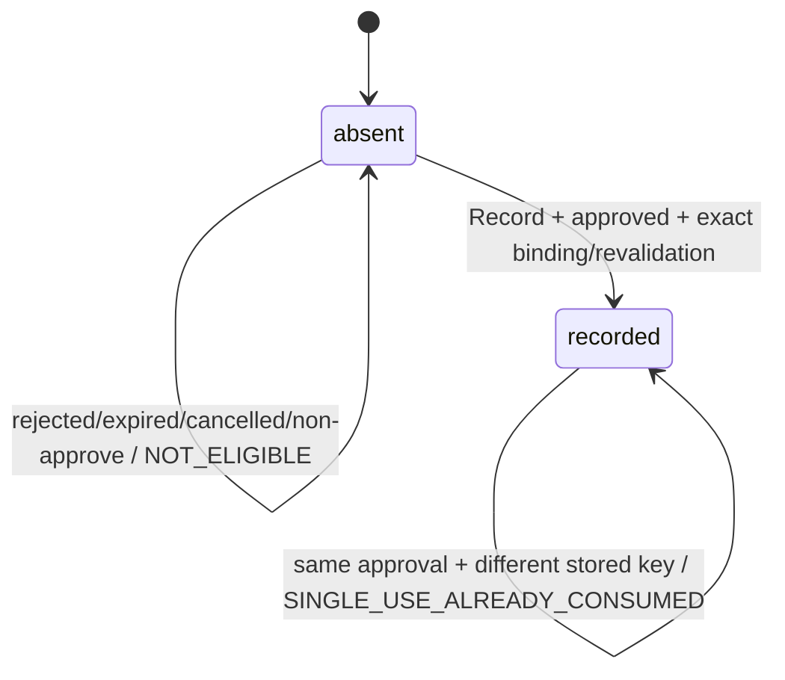

# Approval Consumption Receipt Core v1 候选契约

> 状态：Agent-owned Executable Draft / Test-only
>
> 范围：`plan_creation_spec` 的 `approval_type=candidate_activation` approved 续接，仅记录 `effect_kind=creation_spec_activation`
>
> 实现门禁：本文只冻结候选 canonical、纯状态机和 Corpus。Owner 签字、真实 PostgreSQL 原子性、Business `DecideCreationSpecCandidate`/Query 契约与 unknown-outcome 恢复证据齐备前，禁止创建生产 Migration、Repository、Runner/Graph Node、HTTP/IDL 或宣称 `SMK-009/017/033` 已通过。
>
> Corpus 状态：`w2_r04_approval_consumption` 已有 4 个 fixture、102 条向量和 11 个目标测试通过，形成 executable test-only candidate evidence；仍未 Approved，不是生产/认证 Receipt 证据。

## 1. 目标与非目标

本批只回答一个问题：已确定为 `approved` 的不可变 Decision Receipt，如何为后续高风险 effect 生成唯一、可重放、可查询且异义失败关闭的 unsigned semantic core。在安全 Owner 冻结认证/签名模型前，该 core 不是可直接传给 Business 的 wire-ready `ApprovalConsumptionReceiptV1`。

本批不定义 Approval 生产表，不修改 Approval 的 `approved` 终态，不执行扣费、模型、Candidate 激活或 Business 写入，不定义 expired/cancelled 的产品表现，也不用测试摘要冒充 Owner 签字或数据库证据。

## 2. Owner 与对象

| 对象 | 候选 Owner | canonical `schema_version` | 摘要域 |
|---|---|---|---|
| Decision authority projection | `agent.approval_store` | `approval_decision_authority.v1` | 只作 Corpus 权威输入，不代替 R03 Decision Receipt |
| Consumption intent binding | `agent.approval_store` candidate | `approval_consumption_intent_binding.v1` | `dora.approval_consumption_intent_binding.v1` |
| Revalidation observation | `agent.approval_store` candidate | `approval_consumption_revalidation_observation.v1` | 仅进入 core digest |
| Unsigned Receipt Core | `agent.approval_store` candidate | `approval_consumption_receipt_core.v1` | `dora.approval_consumption_receipt_core.v1` |
| Single-use index projection | `agent.approval_store` candidate | `approval_consumption_stored_index.v1` | 无独立语义摘要；逐值绑定 core/header digest |
| Record / Query Command | 测试专用投影 | `approval_consumption_record_command.v1` / `approval_consumption_query_command.v1` | 不作 Owner record；不含服务端首次写入材料 |
| 运维元数据 | 无语义 Owner | `approval_consumption_operational_metadata.v1` | 不进入任何语义摘要 |

摘要只接受小写 `sha256:<64hex>`。Core 中的 `request_digest` 必须等于 intent binding 在固定域下的 canonical 摘要；禁止 Trim、大小写归一、其他算法、自由文本或未版本化 JSON。R03 只有 Owner digest，并没有密码学签名/Key Version；本批因此明确不定义 `signature` 字段，`AUTHENTICATED_IDENTITY` 也只表示受信内部调用主体，不等于对象签名。最终使用数据库 Owner + 认证 RPC 查询/逐值验证，还是带 signer/key rotation 的密码学 envelope，必须由安全 Owner 先冻结；若选 envelope，它只绑定 core digest，不进入 core 自身造成递归。

`approval_consumption_stored_index.v1` 是 Agent Store 的只读唯一索引投影，全字段 required、无 null/unknown，exact canonical 为：`schema_version`、`owner=agent.approval_store`、`approval_id`、`consumption_key`、`request_digest`、`user_id/project_id/session_id`、`effect_kind`、`core_digest`。它不接受调用方写入，不拥有独立 self-digest，也不替代 Receipt Core；首写必须与 originating core 在同一 Agent 事务产生，删除/悬挂/改指均禁止。exact-key 路径必须继续取回并完整验证当前 activation core；approval-only backstop 可只依赖该受信投影做跨 schema 的 single-use/scope 判定，但真实 PostgreSQL 外键/不可悬挂/并发证据未 Approved，Corpus 只证明纯 canonical/evaluator。

## 3. Immutable intent binding

`approval_consumption_intent_binding.v1` 全字段 required、禁止 `null`、禁止未知/重复字段，必须逐值冻结：

1. Decision/Approval：`approval_id`、`presented_approval_version`、`resulting_approval_version`、`approval_expires_at`、`decision_receipt_id`、`decision_id`、`decision_digest`、`continuation_source_id`、`decision_action=approve`、`resulting_state=approved`；Consumption 使用 resulting version，不把它模糊称为 `decision_version`；
2. 主体：`user_id/project_id/session_id`；
3. parent/root：`root_tool_receipt_id/version/turn_id/run_id/request_semantic_digest`、`parent_tool_receipt_id/version/turn_id/run_id/request_semantic_digest/result_status=waiting_user/result_digest`、`original_tool_call_id`、parent ToolReceipt Owner ref/digest；root 和 direct parent 可相同但不得合并；本 candidate activation 链的普通 origin 必须显式 root self-ref，continuation parent 缺少 root ref 时失败关闭，禁止静默回退为 `root=parent`；
4. child 因果：`continuation_input_id`、`continuation_turn_id`、`continuation_run_id`、`child_tool_receipt_id`；fence、lease 和 child current version 是写入 guard，不进 intent digest；
5. Approval/effect：`scope=creation_spec_activation`、`action=activate`、`consumption_policy=single_use`、`effect_kind=creation_spec_activation`、服务端派生的 `consumption_key`；
6. Tool/Intent：Tool Pin `owner/ref/digest/tool_key/definition_version/intent_schema_version/result_schema_version/graph_key` 与 `intent_digest`；
7. target：`resource_type=creation_spec_candidate`、`resource_id`、`resource_version`、`resource_digest`、`target_exact_set_digest`；
8. expected eligibility：Approval 冻结的 authorization scope、resource snapshot 和 activation policy 三组 `owner/ref/version/digest`，作为首写当下重验的 expected binding。

UUID 字段均为小写 canonical UUIDv7；version 是 JS-safe 正整数；枚举与 key 不允许前后空白、Unicode 替代或自由值。Record 命令不接受调用方覆盖 `consumption_key`；Corpus 中该字段是服务端派生后的候选 canonical 投影。

`effect_kind` exact-set 本批只有 `creation_spec_activation`，Resource 类型固定为 `creation_spec_candidate`。`billable_execution` 的逐模型/纠错计费、quote/amount/unit 和一次性还是可重用 envelope 均未由财务与 Business Owner 冻结，必须使用另一个设计与 Corpus，不得从本契约推导。

`consumption_key` 稳定派生为：

```text
approval-consumption:v1:{resulting_approval_version}:{effect_kind}
```

共同唯一键仍是 `(approval_id, consumption_key)`。Receipt ID 不参与 request digest，但首写成功后必须作为 Receipt canonical 的不可变字段返回；重放不得换 ID。

## 4. Revalidation observation 与 Receipt Core

实时重验不属于 immutable intent。只有首写时，Agent 按 `authorization_scope → resource_snapshot → policy_snapshot` 的 exact order 生成 `revalidation_observation`；每项均为 `{kind,owner,ref,version,digest}`，kind 不可重复、缺失或额外。`recorded_at` 为注入 Clock 产生的 UTC RFC3339Nano。Observation 不进入 request digest；replay/query 返回首次 observation，不以当前 Owner snapshot 重算或改写。

`approval_consumption_receipt_core.v1` 只表示“该 approved effect 的消费权已经以此 intent 唯一登记”，不表示下游 effect 已成功。它全字段 required，固定包含：

- `receipt_id`、`receipt_version=1`、`write_state=recorded`；
- 完整 intent binding 与 `request_digest`；
- 首次 `revalidation_observation`。

Core digest 对上述“不含 core digest 自身”的完整 payload 计算；Corpus 在 fixture 外单独保存 expected digest，core 不含 self-digest 字段。`trace_id/attempt/processor_instance/read_at/current_fence/expected_child_version` 不进 request/core digest。完整 canonical golden 由本契约对应 Corpus 中的 `acr.creation_spec_activation.approved_unconsumed` fixture 固定；Manifest 必须锁定其 SHA。

Record command 必须在 JSON 中显式携带完整 `authenticated_agent_principal + user/project/session + intent_binding + request_digest`，loader/evaluator 禁止从 Decision authority 静默补齐。`first_write_material{receipt_id,recorded_at,revalidation_observation}` 不是 Record command JSON 的字段，也不由调用方提供；它是 evaluator 在确认 exact key 和 approval-only backstop 都 absent 后，才从受信 UUID/Clock 与当前 Owner facts 生成并 strict validate 的服务端输入。查到 exact-key 存量后只校验 immutable command 与 stored core，不生成或读取新 attempt 的 Receipt ID/Clock/observation，因此这些首次写入材料不能阻断合法重放。

Activation Core strict schema 必须拒绝任何 billing-only 字段：`billable_execution/quote/amount/currency/unit/charge/billing_key/model/prompt/execution_digest/primary/correction`。该 core 不得被 `Prepare*`/Charge RPC 接受，只能在未来经评审的 `DecideCreationSpecCandidate(approve)` 契约中映射。

## 5. 纯状态机



规则：

1. 只有 `approve + approved` 允许 `Record`；rejected 为零 Consumption、零 approved effect/扣费/激活，但未来可以在独立确定性分支持久 Business reject 事实，该分支只携 Decision 且禁止 Consumption；expired/cancelled 不执行原 approved effect。
2. absent 上的合法 record 是 first-write-wins，生成 version 1 canonical Receipt。
3. Record 在 trusted internal identity 验证后，先扫描完整集合查找 exact `(approval_id,consumption_key)`，再查 approval-only single-use backstop，结果不得依赖 SQL/数组返回顺序。exact key 必须完整验证 stored core 并按 stored scope 授权后，才按 `request_digest` 返回首次 core 或内部 `CONSUMPTION_DIGEST_CONFLICT`。exact key 不存在但同 Approval 已有其他 key 时，必须 strict validate Agent-owned single-use index projection（schema/owner/approval/key/request/core digest/user/project/session/effect）并按其 stored scope 授权，再返回 `SINGLE_USE_ALREADY_CONSUMED`；该 backstop 不伪造一个不满足当前 activation schema 的 core，也不返回其他 key/core。比较的不是含 observation/recorded_at 的 core digest；等价并发 Record 不会因新 Clock/observation 误报冲突。三种结果均先于当前 expiry/重验，但均不得跳过 stored validation/authorization。
4. 任何 replay/query 返回存量前，必须以 readonly validator 完整验证 core：intent required/exact enums/derived key、`request_digest=digest(intent)`、observation schema/order/time/evidence、core digest 均逐值成立。任一损坏返回 `STORED_CONSUMPTION_CORE_INVALID`，不通过“只重算外层 core digest”信任内部语义。Conflict 不返回完整 stored core/intent/observation，最多只返回未来安全评审允许的 opaque receipt ref/digest。
5. 已有 core 后再发生 current drift，即使 Business 最终 fail closed，single-use 也已消费；禁止补造第二条 core，继续需要新 Approval。Replay core 只证明历史消费已登记，不是当前 eligibility guard；Runner 在 prepared slot/外呼前仍必须 fresh guard，Business 仍须逐值重验。Catalog `APPROVAL_CONSUMPTION_CONFLICT`、Graph 草案 `IDEMPOTENCY_CONFLICT` 与本批内部 reason 的 public mapping 尚待 Owner 冻结。
6. 只有 exact 与 approval-only backstop 都 absent，evaluator 才调用一次受信 injected Clock 生成 `first_write_material.recorded_at`，先 strict validate该服务端材料，再在 `APPROVAL_EFFECT_ELIGIBILITY` 使用同一个值判断 `recorded_at < approval_expires_at`；禁止校验和落 core 各读一次 Clock。随后先把 intent 的 resource/target/expected snapshots 逐值绑定 Frozen Decision/Approval authority，再按 authorization scope → resource version/digest → target exact-set → policy snapshot 的顺序重验 current Owner facts。“intent + observation + current 一起换成另一资源”必须仍因 immutable authority mismatch 失败关闭。Agent 本地事务不得冒充跨 Module 分布式事务，Business Decide 仍需逐字段重验。
7. Query 是独立 strict command，只接受 trusted internal Agent identity、authenticated `user_id/project_id/session_id`与原 `(approval_id, consumption_key)`；A2UI、浏览器和模型不得直调。Query 不依赖当前 Decision authority 派生 key，只校验 opaque original key 语法后 lookup；读取前必须把 authenticated scope 与 stored core 逐值授权，不允许内部认证绕过跨租户隔离。Query 不接受/重算 request digest，不执行 current revalidation，只返回 `NOT_FOUND` 或授权后存量 core。
8. Query 调用方收到 core 后，必须通过独立纯 evaluator 与本地冻结的 expected `request_digest + user/project/session + approval/effect + child_tool_receipt_id` 逐值比较；任一不等返回 `CONSUMPTION_QUERY_BINDING_CONFLICT`，禁止 append child slot 或 prepare Business。Query command 自身不接收 expected digest，避免把查询又混成 Record。
9. Record 结果 unknown 后的 `NOT_FOUND` 不证明原写不会晚到，本 Draft 固定继续 `unresolved`，不释放 HOL、不换 key、不推进 Business。只有未来真实 PG 锁顺序/唯一约束证明同一 Record 重放可与 late commit 收敛时，当前最高 fence 才可原命令受控重放；在此之前 Query 失败/NOT_FOUND 都按 unknown outcome 隔离。
10. 生产实现必须在 PostgreSQL 中同时证明 `(approval_id,consumption_key)` 唯一、single-use `approval_id` 最多一条、与 child slot 原子 append-once；具体索引/锁顺序/CAS 尚未评审，本 Corpus 不能替代该证据。

## 6. 稳定失败优先级

Record 共同前缀：

```text
RECORD_REQUEST_SCHEMA → COMMAND → KEY_DERIVATION → AUTHENTICATED_AGENT_PRINCIPAL
→ IMMUTABLE_CAUSAL_SHAPE → REQUEST_DIGEST → EXISTING_CONSUMPTION
```

exact key 命中后：

```text
STORED_CORE_VALIDATION → STORED_SCOPE_AUTHORIZATION → REPLAY_OR_CONFLICT
```

exact key miss、approval-only backstop 命中后：

```text
STORED_SINGLE_USE_INDEX_VALIDATION → STORED_SCOPE_AUTHORIZATION
→ SINGLE_USE_ALREADY_CONSUMED
```

两级索引都 absent 后：

```text
FIRST_WRITE_MATERIAL_SCHEMA → IMMUTABLE_AUTHORITY_BINDING
→ APPROVAL_EFFECT_ELIGIBILITY_INCLUDING_EXPIRY → TOOL_PIN_INTENT
→ REVALIDATE_SCOPE → REVALIDATE_RESOURCE
→ REVALIDATE_TARGET_SET → REVALIDATE_POLICY → FIRST_WRITE
```

Query command：

```text
QUERY_REQUEST_SCHEMA → COMMAND → AUTHENTICATED_AGENT_PRINCIPAL → KEY_SYNTAX
→ LOOKUP → STORED_CORE_VALIDATION → STORED_SCOPE_AUTHORIZATION
```

Query-result consumer 是另一个纯 evaluator：

```text
QUERY_RESULT_SCHEMA → EXPECTED_BINDING
```

同一 evaluator 的单个向量只返回最高优先级原因。Corpus 必须用相邻层 multi-error 表驱动测试固定顺序，不得只验证最外层 schema；不得把 Query-result expected binding 塞回 Query command。

`IMMUTABLE_CAUSAL_SHAPE` 只校验显式 command 自身的 ID/version/source/parent-owner-ref 公式与 authenticated scope 是否等于 command intent，不读取当前 Decision projection。只有两级索引都 absent，`IMMUTABLE_AUTHORITY_BINDING` 才读取 Decision/Approval/Frozen Intent authority 并逐值绑定全部 causal/effect/target/expected facts；因此 exact replay 与 approval-only conflict 均不被当前 authority 缺失、状态漂移或 schema 漂移阻断。

## 7. 与 child Receipt / Business Decide 的边界

Consumption 不是 child claim 前置；时序必须是：

1. Continuation 先创建/恢复新 Turn/Run 和 stable open child ToolReceipt，复用原逻辑 `tool_call_id`，取得当前有效最高 fence，不回写 parent Receipt；
2. child request digest 只绑定 Decision/Source、新 causal IDs 与 parent request digest，不包含尚未产生的 Consumption；Tool Pin、Intent、Resource baseline 从 parent 逐值继承；
3. `approval_decision` ref 必须已在更早的 child CAS 中 append-once，保证首轮 guard/Consumption 确定失败可以形成 Decision-only terminal；Consumption 事务先逐值校验该 Decision ref 已存在，再原子首写/replay Consumption Core并只 append `approval_consumption` ref。不得在 Consumption 事务里首次补写 Decision；Consumption 只进入 execution refs 与终态 result projection，永远不回写 child request digest；
4. Business RPC 前还必须在 child 中预留稳定 prepared execution slot；slot key、CAS/fence 与 crash boundary 由 child 契约冻结，本文不自行定义；
5. approved activation 才允许未来 Business `DecideCreationSpecCandidate(approve)` 候选；rejected 路径只携 Decision，禁止 Consumption；
6. Business 语义幂等身份只允许 child 契约复用 R01 的 `tr:<child_receipt_id>:<ref_slot>:v1`，future `BIZ-AIGC-008` 不得另造第二 key；尚未冻结的是 command/query 的字段号、位置、严格校验、Decision/action/Consumption/target guard 与 late-commit 语义。unknown outcome 时 child Receipt 保持 `open/recovery_pending`，禁止冻结假失败。

上述 1～6 将在后续独立跨对象 Corpus 中冻结。本批 Consumption Corpus 不冒充 child Receipt、Business RPC 或 unknown-outcome 生产证据。

## 8. 解锁条件

生产实现仍需：

- 产品、Business、Agent、前端、安全、财务、测试 Owner 签字；
- Approval Decision/Expiry/Cancel 与 Consumption 的真实 PostgreSQL 原子性、并发与故障注入证据；
- child Receipt 与 Business Decide/Query 跨 Module 版本化契约；
- 安全 Owner 冻结 core 的 DB Owner + authenticated query 路径或 signer/key version/rotation envelope，并冻结三类冲突 reason 到 public code 的映射；
- A2UI Action/Receipt、CSRF、stale Card revision 与刷新/重连证据；
- 单一真实 Chromium 的 `SMK-009`、黑盒 Session Lane `SMK-017` 与 A2UI 安全降级 `SMK-033`。
