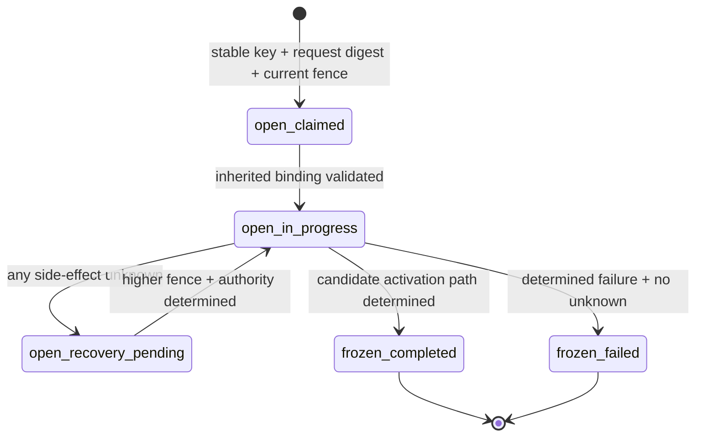

# Candidate Activation Continuation Child ToolReceipt v1 候选契约

> 状态：Agent-owned Executable Draft / Test-only Corpus Bound / 未 Approved
>
> 适用范围：`plan_creation_spec` 的 `approval_type=candidate_activation` 结构化 Decision 形成受信 Continuation Input 后，为 `effect_kind=creation_spec_activation` 创建或恢复 child ToolReceipt，并在未来 `DecideCreationSpecCandidate` 前后保存可查询、可隔离的阶段证据
>
> 实现门禁：本文只冻结测试候选 canonical、继承矩阵、纯状态机、槽位角色与失败优先级。关联的 Business Decision 文件也只提供 test-only command/query/authority canonical；两者都不定义生产表、生产 Go DTO、签名格式、HTTP/Thrift IDL、Business 事务或 Runner 实现，不得据此创建生产 Migration、Repository、RPC、Graph Node 或宣称 `SMK-009/017/033` 已通过。
>
> Corpus 状态：独立 child Corpus 已绑定 1 个 fixture、172 条向量和 11 个目标测试；共享 R01 failed-after/outcome-aware 与 R04 Consumption evidence 已通过显式 bridge 消费。该证据仍只覆盖 candidate canonical 与纯状态机，不代表生产持久化、公共 IDL/RPC、Business Query、真实 PostgreSQL 原子性或 Runtime 已实现。

关联基线：

- [Agent Runner 与 PostgreSQL Session Lane v1 设计评审](./runner-session-lane-review-v1.md)
- [Approval Continuation 跨对象证据契约 v1](./approval-continuation-cross-object-evidence-v1.md)
- [Approval Consumption Receipt v1 候选契约](./approval-consumption-receipt-contract-v1.md)
- [AIGC 跨 Module 契约目录](../cross-module/aigc-contract-catalog.md)
- [CreationSpec Candidate Decision 公共契约候选 v1](../cross-module/creation-spec-candidate-decision-contract-v1.md)
- [`plan_creation_spec` Graph Tool 设计](./graphtool/plan_creation_spec-design.md)
- [全功能冒烟推进计划](../../requirements/full-function-smoke-development-plan.md)

## 1. 目的与边界

本文只回答一个问题：同一逻辑 ToolCall 因结构化 Approval Decision 进入新的可信 Continuation Turn 时，如何用一个独立 child ToolReceipt 保存新因果、继承原动作、约束 approve/reject 分支，并在 Business 写入响应未知时保持可查询而不制造第二个业务意图。

本契约的最小链路为：

```text
frozen waiting_user parent ToolReceipt
  + immutable Approval binding
  + immutable Decision Receipt / stable SourceID Input
  -> new continuation Input / Turn / Run
  -> open child ToolReceipt
  -> Decision ref
  -> approve: Consumption ref / reject: Decision-only
  -> prepared Business Decide slot
  -> Business response or Query authority
  -> resolved Business slot
  -> open -> frozen child ToolReceipt
```

明确不在本文范围内：

1. Approval、Decision、Consumption 或 ToolReceipt 的生产物理表与事务实现；
2. Agent 内部身份断言、审计签名、Key Version、验签算法或密钥轮换；
3. `DecideCreationSpecCandidate` 的正式请求、响应与 Query IDL；关联文件只有 70 条 Agent consumer-side test-only canonical，尚无 Business producer parity、认证 envelope、正式字段编号或 Owner Approved。Storyboard、Prompt Results、Assembly Plan 必须分别设计，不得复用本文外推；
4. Graph Tool 的业务 Node、计费、模型、资源状态机或 A2UI Card/Action Schema；
5. 用本候选摘要替代 Owner 签字、真实 PostgreSQL 并发证据、跨 Module 契约测试或 Chromium Smoke。

因此，本文中的 `*V1`、字段名、槽位名和摘要域都只是 test-only candidate，不是生产兼容承诺。`billable_execution` 可能调用模型、扣费并产生另一个 waiting-user child，其逐模型计费与 child 状态机尚未评审，严禁从本文推导。

## 2. root、parent、current 与 causal 定义

本文只消费 `candidate_activation` Approval。它的 parent 可能是首个普通 Receipt，也可能是“由另一份已评审契约”产生的 frozen `waiting_user` child；本文不声称自己能产生该上游 child。为避免把“最初调用”“直接 parent”和“本次续接回执”混成一个对象，固定以下四组概念：

| 名称 | 定义 | 必须状态 | 是否可被本次续接修改 |
|---|---|---|---|
| `root` | 该逻辑 ToolCall 的首个普通 ToolReceipt；每个可续接 parent 都必须显式存 root ref（首个普通 Receipt 为 self-ref） | 在本文 candidate activation 可接受链中为 `frozen + result_status=waiting_user` | 否 |
| `parent` | 直接创建本次 Approval 的最近一个 ToolReceipt；第一次续接时可与 root 相同，后续审批时可为前一个 child | `frozen + result_status=waiting_user`，Approval ref 已在其冻结证据中 | 否 |
| `current` | 本次 Continuation Turn 对应的 child ToolReceipt | 初始 `open`；结果全部确定后才可 `frozen` | 只允许当前最高 Fence 按规则推进 |
| `causal` | Decision 产生的稳定 SourceID Input，以及本次新建的 Input/Turn/Run | Input source、Turn kind 和 Run 必须是 Agent 权威记录 | 否；重放必须解析为同一组 ID |

`root` 与 `parent` 可以是同一行，但语义不得合并：

- `root_tool_receipt_id` 在整个逻辑 ToolCall 因果链中保持不变；
- `parent_tool_receipt_id` 每次都指向直接产生当前 Approval 的 `waiting_user` Receipt；
- `current_tool_receipt_id` 是本次 child 自身 ID；
- 当前 child 不回写 root 或 parent，不把 parent 从 `waiting_user` 改成 `completed`。
- 只有明确 `turn_kind=normal/origin` 的首个普通 parent 可使用 root self-ref；任何 continuation parent 缺少 root ref 必须返回 `ROOT_TOOL_RECEIPT_INVALID`，禁止静默回退为 `root=parent`。

## 3. child key 与逻辑身份

### 3.1 唯一键

child 继续使用 ToolReceipt 共同唯一键：

```text
(session_id, continuation_turn_id, original_tool_call_id)
```

逐值约束：

1. `session_id` 必须等于 root、parent、Approval、Decision、Continuation Input/Turn/Run 的 Session；
2. `continuation_turn_id` 必须来自本次稳定 SourceID 对应的唯一 Turn，不得使用 root 或 parent Turn；
3. `original_tool_call_id` 必须等于 root 与 parent 的逻辑 `tool_call_id`；不得为 Continuation 生成新 ToolCall ID；
4. 同 key、同 `request_semantic_digest` 只允许读取、认领或恢复原 child；
5. 同 key、不同 `request_semantic_digest` 返回稳定冲突，不覆盖原 child，不换 Turn 或 ToolCall ID 规避冲突。

`user_id`、`project_id`、`run_id`、`approval_id` 和 `decision_id` 参与绑定与摘要，但都不进入 ToolReceipt 主键。

### 3.2 稳定 SourceID

Decision Continuation SourceID 候选固定为：

```text
approval-decision:{approval_id}:{decision_id}
```

同一 SourceID 必须 first-write-wins 解析为同一 `continuation_input_id/continuation_turn_id/continuation_run_id`。SourceID 只能从不可变 Decision Receipt 读取并按上式校验，不接受调用方字段；`approval_id/decision_id` 均是 canonical UUIDv7，整体长度只由固定前缀与两个 UUID 决定。同 SourceID 对应不同 ID、不同 Approval、不同 Decision 或不同 action 时立即冲突；不得创建第二个 Input 或第二个 child。current child ID 也由 child key first-write-wins，不能随 Source 重放任意新建。

## 4. 精确继承矩阵

下表是后续 Corpus 必须逐值验证的 exact-set。未列字段不得被测试夹具临时解释为“继承”或“新因果”。

| 语义字段 | 权威来源 | current child 保存/使用 | 是否进入 child request digest | 禁止行为 |
|---|---|---|---:|---|
| `user_id/project_id/session_id` | Agent 身份与 parent/Approval 权威记录交集 | 逐值相等的可信 scope | 是 | 从浏览器、模型或重复 Payload 覆盖 |
| `root_tool_receipt_id/version` | parent 的显式 root ref；首个普通 Receipt 必须 self-ref | 冻结 root 引用 | 是 | 缺失时回退为 parent、后续续接更换 root |
| `root_turn_id/root_run_id` | root Receipt | 只读审计因果 | 是 | 用 current causal ID 替代 |
| `root_request_semantic_digest` | root Receipt | 原样复制 | 是 | 重算或用 parent/current digest 冒充 |
| `parent_tool_receipt_id/version` | 直接产生 Approval 的 Receipt | 冻结直接 parent 引用 | 是 | 永远假定 parent 等于 root |
| `parent_turn_id/parent_run_id` | parent Receipt | 只读直接因果 | 是 | 使用 root 或 current ID 替代 |
| `parent_request_semantic_digest` | parent Receipt | 原样复制；是当前请求的父摘要 | 是 | 将其要求为等于 current request digest |
| `parent_result_status/result_digest` | parent frozen Result | 必须为 `waiting_user` 且摘要可重算 | 是 | parent 非 waiting_user 仍续接 |
| `original_tool_call_id` | root 与 parent | 作为 child key 第三部分并用于原业务身份 | 是 | 创建新逻辑 ToolCall |
| `continuation_input_id/turn_id/run_id` | stable SourceID 对应的 Agent 记录 | current causal identity | 是 | 重放时重新分配 |
| `continuation_source_id` | Decision Receipt | 逐值相等 | 是 | 从 action body 自由传入 |
| `approval_id/presented_approval_version/resulting_approval_version/binding_digest` | parent Approval ref + Agent Approval/Decision authority | 呈交与结果版本分离且逐值相等；approved authority 使用 resulting version | 是 | 把呈交版本当成结果版本、自动覆盖版本 |
| `decision_receipt_id/digest` | Agent immutable Decision Receipt | 逐值相等；当前 R03 不存在虚构的 Receipt version | 是 | 只保存 action 文本或自行发明 version |
| `decision_id/action/card_id/card_revision` | Decision Receipt | `action` 仅 `approve/reject` | 是 | 用 Consumption 是否存在猜 action |
| `actor_user_id/actor_project_id` | 已认证 Decision authority | 必须等于可信 scope | 是 | 采信客户端 user/project |
| `intent_digest` | R03 Approval binding | 原样继承 | 是 | 从新消息重建或让模型改写；受保护 Intent ref 当前尚无 Owner canonical，本契约不虚构 |
| `tool_key/definition_version` | parent Tool Pin | 原样继承 | 是 | 自动升级 Definition |
| `intent_schema_version/result_schema_version` | parent Tool Pin | 原样继承 | 是 | 用当前 Registry 最新版本替换 |
| `graph_key` | R03 Tool Pin | 原样继承 | 是 | 重新选择 Graph；本契约不虚构 `graph_version/prompt_pin` |
| `tool_pin_ref/tool_pin_digest` | parent/Approval binding | 原样继承并逐值复核 | 是 | 仅比较 tool key |
| `execution_digest` | parent Approval 冻结的执行审计摘要 | 原样继承，只作因果审计 | 是 | 因新 Turn/Run/Decision 改写，或声称它已决定 Candidate Decide 幂等键 |
| `parent_turn_context_digest` | R03 完整 immutable Turn Context golden | 原样继承作因果审计；不冒充未定义的 `trusted_context_digest` | 是 | 把 current actor 字段当完整上下文 |
| `resource_id/version/digest + target_exact_set_digest` | R03 Approval binding | 逐值相等 | 是 | 增删目标、静默套用新版本或虚构资源列表 |
| `current_tool_receipt_id/version` | current child store | child 自身身份与 CAS 版本 | 否 | 用 Receipt ID 改变请求语义 |
| `fence_token/lease/attempt/processor` | Session Lane/运行时 | 仅并发控制与运维证据 | 否 | 进入语义摘要或业务幂等键 |
| `execution_slots/execution_refs` | current child 执行过程 | 仅 open 期按稳定槽位推进 | 否 | 回写 request digest |
| `result_status/result_refs/result_digest` | current child 终态投影 | 仅 `open -> frozen` 一次写 | 否 | open 期预填或冻结时临时造 ref |

继承不等于继续授权。current 在越过副作用前仍须重新查询权限、资源版本、Approval 有效性和 activation policy；任一变化失败关闭，并按能否排除已发副作用决定确定失败或隔离。child-local 剩余预算/分配只能低于独立 Runtime Budget 上限，不作为“可收紧的继承字段”进入本 request canonical。

## 5. Test-only request canonical 与摘要

### 5.1 候选 canonical

后续 Corpus 的 `continuation_child_tool_receipt_request.v1` 只允许以下顶层字段，全部必填且不接受 `null`、未知字段、重复 JSON key、尾随值或宽松类型转换：

```json
{
  "schema_version": "continuation_child_tool_receipt_request.v1",
  "effect_kind": "creation_spec_activation",
  "scope": {},
  "child_key": {},
  "causal": {},
  "root": {},
  "parent": {},
  "approval": {},
  "decision": {},
  "inherited_execution": {}
}
```

各对象精确覆盖第 4 节对应行：

- `scope`：`user_id/project_id/session_id`；
- `child_key`：`session_id/continuation_turn_id/original_tool_call_id`；
- `causal`：`continuation_source_id/input_id/turn_id/run_id`；
- `root`：Receipt ID/version、root Turn/Run、request digest；
- `parent`：Receipt ID/version、parent Turn/Run、request digest、`waiting_user` result status/digest；
- `approval`：`approval_type=candidate_activation`、ID、presented/resulting approval version、binding digest；
- `decision`：Receipt ID/digest、Decision ID、action、Card ID/revision、actor user/project；
- `inherited_execution`：Intent digest、R03 五字段 Tool Pin + owner/ref/digest、execution audit digest、parent Turn Context digest、resource ID/version/digest 与 target exact-set digest。

`target_exact_set_digest` 对应的目标集合必须由 R03 已评审 canonical 固定 key、排序与去重规则；本文不另造 `resource_exact_set` 字段。有序业务输入保持原语义顺序。ID、safe integer、时间和摘要只能使用对应候选 Corpus 已冻结的规范编码。

### 5.2 摘要公式

候选摘要域固定为：

```text
dora.continuation_child_tool_receipt_request.v1
```

候选计算规则为：

```text
request_semantic_digest =
  "sha256:" + hex(
    SHA-256(
      UTF8("dora.continuation_child_tool_receipt_request.v1")
      || 0x00
      || canonical_json_bytes(request)
    )
  )
```

其中 `canonical_json_bytes` 必须由未来 Corpus 使用单一固定实现和 Golden 固定；在实现该 Corpus 前，本公式不授权生产代码自行选择 JSON canonicalization。

必须证明：

1. current request digest 因包含新 Source/Input/Turn/Run 和 Decision，通常且应当不同于 parent digest；
2. `parent_request_semantic_digest`、`execution_digest`、Tool Pin、Intent 和资源 exact-set 仍逐值继承；
3. Consumption Receipt、Business response、Query 结果、execution slots/refs、Fence、lease、时间和 attempt 都不进入 request digest；
4. 运维元数据变化不得改变 request digest；
5. request digest 相同不能替代逐字段 owner/scope/version 校验。

本文没有定义 Decision/Consumption 的生产签名；Corpus 只允许引用已冻结的 test-only authority digest，不得虚构 `signature/key_version` 字段冒充认证完成。

## 6. current child 状态、Fence 与恢复



本窄契约不产生 `frozen_cancelled`：一旦 approve/reject Decision 已确定，`plan_creation_spec` 在 pre-Business guards 通过后必须完成或恢复对应 Business Decide 分支；guard 在 Business slot prepared/发送前确定失败时，只能按第 7.1 节冻结明确的 failed Result，不能冒充 cancelled 或 Owner 已成功落地。Business slot 一旦 prepared/可能发送，取消请求或租约丢失都不能改写结果；无法安全推进时保持 `open/recovery_pending` 与 Session HOL 隔离，直至取得正式 Business authority 或未来独立取消契约获批。

状态约束：

| `write_state` | `execution_phase` | 结果字段 | 允许动作 |
|---|---|---|---|
| `open` | `claimed/in_progress/recovery_pending` | `result_status/result_refs/result_digest` 全空 | 当前最高 Fence 校验、准备 slot、查询权威、同槽 resolve |
| `frozen` | 不存在 | 完整且不可变 | 同义只读重放；投影缺失仅补 Marker/Event |

Fence 规则：

1. 只有数据库当前有效最高 Fence owner 可以准备或 resolve slot、追加 execution ref、外呼 Business 或执行 `open -> frozen`；
2. Lease 丢失或更高 Fence 出现后，旧 owner 的外呼、slot/ref 写入、冻结和终态事件全部拒绝；
3. 更高 Fence 接管只能复用原 child key、request digest、Business 幂等键和既有 slot；不能清空 ledger 或换键；
4. 恢复先查 prepared/unresolved slot 的原权威结果；只有证明副作用从未开始，才可从同一安全节点继续；
5. 任一外部副作用仍未知时，child 保持 `open/recovery_pending`，Run 保持或进入 `recovery_pending`，Input 立即进入 `quarantined` 并持续阻塞 Session HOL；不得先进入 `retry_wait`、转 `dead` 或冻结假 `failed`。

## 7. 稳定槽位与 prepared Business Decide

### 7.1 本契约的逻辑槽位 exact-set

本节冻结 test-only 逻辑角色；Graph-specific 的最终 `ref_slot/ordinal/ref_type/schema_version` 仍须由各 Tool Pin policy 和 Owner 评审后进入生产契约。

| 逻辑角色 | approve | reject | `effect_class` | authority | 规则 |
|---|---:|---:|---|---|---|
| `approval_decision` | 必须 | 必须 | `evidence_only` | Agent immutable Decision Receipt test-only authority | append-once 的 resolved reference；同 ref digest 重放、异 digest 冲突 |
| `approval_consumption` | 通过首轮 eligibility 后必须 | 禁止 | `side_effect` | Agent unsigned Consumption Core test-only authority | single-use 是不可逆语义副作用，禁止伪装为 evidence；append-once resolved；reject 出现即失败关闭；未产出 Core 时不得为了凑槽而消费 |
| `business_decide` | 通过 pre-Business guard 后必须 | 通过 pre-Business guard 后必须 | `side_effect` | 同一 schema 的 Business Decision Authority | 外呼前必须 `prepared`；响应或 Query 确认后同槽 `resolved`；guard 已确定失败且尚未 prepared 时严格不存在 |

独立 child Corpus 使用不带 version 的 test-only logical Decision ref，因为当前 R03 Decision Receipt 没有 version；不得为了复用 `authorityRefV1` 虚构 `authority_version=1`。Consumption 与 Business authority 才桥接 R04/R01 的既有 evidence。逻辑角色用于冻结 action exact-set，不冻结 approve/reject 共用的生产 `slot_ordinal`；approve 为 `Decision -> Consumption -> Business`，reject 为 `Decision -> Business`，生产 ordinal 与 Registry policy 仍待 Tool Owner 审核。

其他 Quote、Charge、Model、Candidate Write 或 Operation 槽位属于其他 Graph Tool/其他 Approval 契约，不得借本文动态添加。本 `candidate_activation` child 不产生 ModelReceipt；这不是对 `billable_execution` child 的结论。本分支直接进入原 pinned Graph 的确定性激活/拒绝路径，不运行 ReAct 重做原意图。

pre-Business determined failure 的 terminal slot exact-set 单独冻结，不能与正常 approve/reject 成功集混用：

- Consumption ref 产生前的任一确定失败（首轮 guard、Record/Query 的确定 eligibility/revalidation/stored-integrity/scope/conflict/single-use 失败）：`approval_decision` only，`approval_consumption/business_decide` 严格不存在；Record/Query unknown 不属于此类，必须保持 open/recovery_pending；
- approve 已有 Consumption，但第二次紧邻 Business prepare 的 fresh guard 失败：`approval_decision + approval_consumption`，`business_decide` 严格不存在；single-use 已消费且不能补造第二条；
- reject 的 immutable/current guard 失败：`approval_decision` only，`approval_consumption/business_decide` 严格不存在；这表示确定失败，不冒充 Business 已持久拒绝；
- 一旦 `business_decide` 已 prepared 或可能发送，以上本地终态均不再可用，必须按第 9 节取得 Business authority 后才能冻结。

因此“reject 必须调用 Business”只适用于 immutable/current guard 已通过的正常确定性 reject 分支；它禁止把有效 reject 静默改为本地成功投影，但不要求在权限、Candidate 或目标绑定已经失败时仍发送越权 RPC。

候选 ResultCode Registry 以 code 自身表达 phase，不给 `GraphToolResultV1` 增加未定义的 `failure_phase` 字段：

| ResultCode candidate | status | retryable | effect class | 必需内部 refs |
|---|---|---:|---|---|
| `APPROVAL_PRE_CONSUMPTION_NOT_ELIGIBLE` | `failed` | false | `permanent_failure` | Decision only |
| `APPROVAL_CONSUMPTION_REJECTED` | `failed` | false | `permanent_failure` | Decision only；覆盖确定 conflict/not-eligible/stored-invalid，不能覆盖 unknown |
| `APPROVAL_POST_CONSUMPTION_NOT_ELIGIBLE` | `failed` | false | `permanent_failure_after_side_effects_resolved` | Decision + Consumption exact-set |
| `APPROVAL_APPROVE_BUSINESS_NOT_COMMITTED` | `failed` | false | `permanent_failure_after_side_effects_resolved` | Decision + Consumption + negative Business authority exact-set |
| `APPROVAL_REJECT_BUSINESS_NOT_COMMITTED` | `failed` | false | `permanent_failure` | Decision + negative Business authority；authority `outcome=not_committed` 证明无业务提交 |

`permanent_failure_after_side_effects_resolved`、Consumption committed ref、Business `outcome=not_committed`、prepared unknown、漏 ref 与非法 outcome 已由 R01 增量 Corpus接受为 executable test-only evidence。独立 child Corpus 另行固定无 version Decision ref、root/parent/current 因果与 action slot exact-set，并显式桥接 R04 Consumption record 和 R01 approve/reject negative authority；两层证据都通过才构成完整 child test-only terminal evidence。

open 期的 `ACTION_SLOT_EXACT_SET` 校验的是阶段前缀而不是提前要求未来槽：两分支先只有 Decision，approve 可追加 Consumption，guard 通过后才可追加 Business prepared；任何跳级、reject Consumption、Business-before-Consumption 或未列槽都失败关闭。frozen 时才按正常分支或上述 determined-failure 集合验证完整 terminal exact-set。

### 7.2 `business_decide` prepared slot 候选

在发送 Business RPC 之前，Agent 必须以当前 Fence 原子保存一个 prepared execution slot。它必须复用 `graph-tool-result-receipt-contract-v1` 已冻结的通用 slot canonical，不得创建平行的 Business 专用 slot schema；下列是“持久 slot + pinned slot policy”的联合 exact-set。现有 `executionSlotV1` 本身不序列化 `effect_class`，该字段由 `executionSlotPolicyV1` 提供，禁止为了本文改写共享 slot DTO 或既有摘要：

```text
child_tool_receipt_id
ref_slot
slot_ordinal
ref_type
ref_schema_version
effect_class=side_effect
authority_owner=business
idempotency_key
request_digest
query_contract
resolution_state=prepared
```

约束：

1. 唯一键候选为 `(child_tool_receipt_id, ref_slot)`；
2. `idempotency_key` 复用 R01 公式 `tr:<child_tool_receipt_id>:<ref_slot>:v1`；未来 Business 公共 IDL 必须明确接受该键作为写入与查询的共同身份，本文不另造 `business_idempotency_key`；
3. `request_digest` 覆盖 future public IDL 中规范化的 method/schema、action、Decision、approve-only Consumption Core/envelope binding、user/project、Candidate/目标 exact-set、版本/content digest 与 Tool Pin/Intent；本 activation 契约禁止 Quote/amount/Charge 字段；它不等于 child request digest；
4. `query_contract` 必须指向与该写方法配套的只读权威查询；为空时不得发送 Business 命令；`ref_slot/slot_ordinal/ref_type/ref_schema_version/authority_owner/query_contract/effect_class` 必须命中未来 Approved 的 pinned Tool Definition Registry；
5. method/schema/action 只能来自未来已发布的 Business 公共契约，并由 `request_digest` 与实际严格编码的命令共同固定；它们必须排除 current Input/Turn/Run/Fence/attempt，本文不声称 parent `execution_digest` 已派生它们；
6. prepared 同槽同 Registry 字段/idempotency key/query contract/request digest 可重放读取；任一字段不同都冲突，不得换 slot；
7. 没有 prepared slot 不得发送副作用；prepared 成功不表示 Business 已执行；
8. prepared 字段一经写入永不覆盖；resolve 只能按 R01 追加 authority ref 与 `resolved_ref_digest` 并令 `resolution_state=resolved`，不得把 approve 换成 reject，不得改 Registry/key/query/request digest；
9. future public Business Decision Authority 必须以同一个 `ref_type/ref_schema_version` envelope 承载 `outcome=committed|not_committed`；positive/negative 不得占两个 slot、切换 Registry 或使用两个不兼容 schema；
10. 严格解码的 Business 响应或 Query 必须逐值绑定同一 action、Decision、approve-only Consumption、Candidate baseline 和 request digest，才可用 `outcome=committed` 的正向 Business authority resolve 原槽；
11. 确定未提交只能由同一 Business Decision Authority envelope 以 `outcome=not_committed` resolve 原槽；`committed/not_committed` 是 authority 语义而不是第二套 slot 状态。在该 authority 存在前，任何 transport/RPC 错误都仍是 `resolution_state=prepared` + unknown；
12. positive/negative ref 必须来自 Business 权威契约，不得用 HTTP/RPC 2xx、日志、Trace 或内存对象代替。更高 Fence 看到 prepared 只能 Query；除非未来 Query 证明 final not-found/no-late-commit 并指定唯一 Retry Owner，不得重发。

关联的 [`CreationSpec Candidate Decision 公共契约候选 v1`](../cross-module/creation-spec-candidate-decision-contract-v1.md) 已以 70 条向量冻结 test-only `method_key`、command/query/authority canonical、`committed/not_committed` 与 `found/not_found/conflict`；其中 `not_found` 明确仍属 unknown，绝不授权重发。这些名字与字段不是正式 Thrift/DTO 承诺，也没有认证 envelope、Business producer parity、PostgreSQL 事务或 Owner Approved，因此 prepared slot 仍只能用于 test-only Corpus，不能解锁 RPC 实现。

## 8. approve 与 reject 分支

### 8.1 共同前置

两个 action 都必须先完成：

1. 读取 root、parent、Approval、Decision、SourceID Input 和 Tool Pin 权威记录；
2. 按第 4 节逐值验证 scope、因果、版本、摘要、Intent、资源/目标 exact-set 与原业务身份；Runtime Budget 属于独立运行时边界，不得伪装成本 activation request 的继承字段；
3. 创建或恢复同 key、同 request digest 的 open child；
4. 以当前 Fence append-once 写 `approval_decision` ref；
5. 不伪造 User Message、Assistant ToolCall、Tool Result 或 ModelReceipt。

### 8.2 approve

approve 的固定顺序为：

```text
Decision determined
  -> first fresh eligibility guard
  -> first-write-wins record/query Consumption
  -> same Agent transaction append approval_consumption ref
  -> second fresh guard immediately before Business prepare
  -> prepare business_decide slot
  -> send DecideCreationSpecCandidate(action=approve)
  -> response or Query resolve same business_decide slot
  -> freeze determined child result
```

必须满足：

- Consumption 稳定键为 `(approval_id, consumption_key)`；同键同 digest 返回原 Receipt，同键异 digest 冲突；一次性策略还必须防止更换 key 二次消费；
- Consumption Core 逐值绑定 Decision、parent/root、child causal IDs/parent request digest、主体、scope、Tool Pin、Intent、Candidate/目标和 effect kind；本 activation core 不包含金额/计费字段；
- Approval 状态保持 `approved`，不能写成不存在的 `consumed`；
- Consumption 未确定存在时不得 prepare 或发送 Business approve；
- 首轮 guard 失败时按 Decision-only determined failure 冻结；Consumption 后的第二次 guard 失败时按 Decision+Consumption determined failure 冻结。两者都要求 `business_decide` 从未 prepared/发送，且不得伪造 Business authority；
- Consumption 纯 evaluator 返回的确定 schema/command/key/identity/causal/request/eligibility/Tool Pin/revalidation/stored-invalid/scope/conflict/single-use 失败统一映射为 `APPROVAL_CONSUMPTION_REJECTED`，Decision-only frozen failed并保留最小内部审计 reason；Record/Query transport error、超时、结果歧义，或 unknown 后 Query `NOT_FOUND` 一律保持 `open/recovery_pending`，不得冻结；
- 当前只有 unsigned test-only Consumption Core/ref，不得作为 Business wire Receipt。安全 Owner 未来选择 DB-ref + authenticated query 或签名 envelope 后，Business approve 才可同时绑定不可变 Decision 与已认证 Consumption envelope/core digest；任一缺失或不符均零业务副作用。

### 8.3 reject

reject 的固定顺序为：

```text
Decision determined
  -> fresh immutable/current guard
  -> assert no Consumption slot / no Consumption request
  -> prepare business_decide slot
  -> send DecideCreationSpecCandidate(action=reject)
  -> response or Query resolve same business_decide slot
  -> freeze determined child result
```

必须满足：

- 不创建、不查询为执行而新建、也不发送 Consumption Receipt；
- `approval_consumption` slot、Business request 中的 Consumption 或以 reject 消费 Approval 的任何证据一律是契约冲突；
- reject 只携带不可变 reject Decision Receipt，并逐值绑定 user/project、Approval、资源/目标 exact-set、版本/content digest；
- 本 `candidate_activation` 候选在 guard 通过后固定调用未来 `DecideCreationSpecCandidate(reject)` 持久 Business 拒绝事实；因此 action mode 不可在运行时切换为本地成功投影。guard 已确定失败且尚未 prepare 时，允许按 Decision-only failed Result 冻结，明确表示 Business reject 未落地。正常 approve slot exact-set 为 Decision + Consumption + Business Decide，正常 reject 为 Decision + Business Decide 且严格无 Consumption。

## 9. Business Query 与 unknown outcome

Business `DecideCreationSpecCandidate` 的响应超时、连接中断、解码失败、缺少必填权威 Receipt、返回摘要不匹配，全部视为 unknown outcome；RPC 框架错误分类不能证明业务未提交。关联 70 条 test-only Business Decision 向量只验证这一纯语义，尚不提供生产 Query 的线性化或 late-commit 排除证明。

恢复矩阵：

| 观察结果 | child/slot 状态 | 唯一允许动作 | 禁止动作 |
|---|---|---|---|
| 写响应严格确定 `completed` 且 binding 全等 | `business_decide=resolved(outcome=committed)` | append 同一 positive authority ref，继续终态投影 | 第二次 Decide |
| 正式 negative authority 证明业务确定未提交 | `business_decide=resolved(outcome=not_committed)` | append negative authority ref，按稳定码冻结 failed Result | 把 transport/RPC 错误当 negative authority、改 key 绕过 |
| 写响应丢失/不完整/不匹配 | `prepared` + child `open/recovery_pending` | Query 原 method/key/request digest | 盲重放写、`retry_wait`、冻结 failed |
| Query `completed` 且 request digest/资源全等 | 原槽 `resolved(outcome=committed)` | 使用原 transaction/resource Receipt | 新建业务意图 |
| Query 返回确定 conflict | child 保持隔离直到冲突被安全归类 | 告警/人工处置；原记录不变 | 覆盖、换 key、猜成功 |
| Query 返回 `not_found` | 本 Draft 一律仍 unresolved | 保持隔离；等待正式 Query 契约证明 late commit 不可能 | 直接重发 Decide |
| Query 超时、不可用或响应歧义 | 仍 unknown | 保持 prepared/recovery_pending/quarantined，按原查询有界核对 | 预算耗尽后转 dead 或放行 HOL |

`not_found` 只有在未来 Business IDL/事务模型明确证明“原命令不会在 Query 之后晚提交”，且唯一 Retry Owner 仍持有有效 Fence 时，才可能允许使用同一幂等键受控继续。在该语义冻结前，本 test-only Draft 固定把 `not_found` 视为 unresolved，以免 Query 与迟到写形成双执行窗口。

Business 已提交但 Agent resolve slot 的事务响应丢失时，更高 Fence owner 只 Query 原业务键，并把同一 authority ref resolve 到原槽；不得第二次调用 Decide。Redis 通知、EventLog/A2UI 投影或 Projection Marker 失败只允许从 frozen Receipt/权威 ref 重投，不得回到 Consumption 或 Business 写边界。

## 10. 终态投影

正常 Business 分支只有以下条件同时成立，current child 才可 `open -> frozen`：

1. root/parent/current/causal 的 immutable binding 未被篡改；外呼前 eligibility 已按当时权威状态通过；Business Decide 已提交后，Candidate 状态/version 的预期变化不可再被当成“旧基线失效”阻止冻结；
2. `approval_decision` resolved reference 已 append-once；
3. approve 的 `approval_consumption` resolved reference 已 append-once，reject 则该槽严格不存在；
4. `business_decide` 已由响应或 Query 以 `outcome=committed` authority resolve，或由正式 negative authority 以 `outcome=not_committed` resolve；terminal authority 必须精确对应 prepared request 与预期基线/结果；
5. 不存在 prepared/unresolved side-effect slot、unknown outcome、异 digest 冲突或 stale Fence；
6. `result_refs` 完全从既有 resolved `execution_refs` 按 pinned Result Schema 白名单确定性投影；
7. Canonical GraphToolResult、`result_status/result_refs/result_digest` 在同一次当前 Fence CAS 中写入。

冻结事务不得补调 Business、补写 Consumption、改变 request/parent/execution digest 或修改 root/parent。frozen child 同 key同 digest只读返回；摘要损坏时 fail closed 并告警，不能重跑原动作修复。

pre-Business determined failure 走第 7.1 节的三个严格 slot exact-set：必须证明 `business_decide` 从未 prepared/发送、无 unknown outcome，并在当前 Fence CAS 中冻结稳定 failed Result；若已有 Consumption，Result 必须投影该 ref 并明确 Approval 已 single-use consumed。此分支以“immutable binding 仍有效 + 精确记录首轮或 post-Consumption guard 的稳定失败 phase/reason/evidence + 无 Business admission”替换正常条件第 1 条的 eligibility-success 要求，并按 action/phase替换第 3/4 条 slot 要求；第 2 条 Decision、无 unresolved slot、确定性 Result 与单次 CAS 等其余条件仍全部适用。

## 11. 稳定失败优先级

创建、重放/恢复和 open mutation 必须分层，不能用一条“先重验当前 Owner、后读存量”的顺序。共同查找顺序固定为：

```text
SCHEMA_COMMAND
-> TRUSTED_IDENTITY
-> CAUSAL_SOURCE
-> SOURCE_MAPPING
-> CHILD_KEY
-> REQUEST_DIGEST
-> EXISTING_CHILD_LOOKUP
```

`EXISTING_CHILD_LOOKUP` 只按稳定 key 定位候选，不先暴露 digest 比较结果。任何 same-key hit 都先进入 `STORED_CHILD_INTEGRITY`，完整验证 stored key/request canonical/root/parent/causal refs、write state/phase、slot ledger及 frozen Result canonical/digest，再进入 `STORED_CHILD_SCOPE_AUTHORIZATION`，把 authenticated user/project/session 与 stored child scope 逐值比较；之后才比较 request digest：异 digest 返回 `TOOL_RECEIPT_CONFLICT`，同 digest且 frozen 才直接重放并不重验 Fence/当前 Registry/资源漂移，同 digest且 open 才进入恢复。任何存量损坏或跨 scope 读取均 fail closed，不能靠 conflict 暴露存在性，也不能靠重跑修复。只有 absent 才按以下顺序创建：

```text
ROOT_RECEIPT -> PARENT_RECEIPT -> APPROVAL_BINDING -> DECISION_BINDING
-> INHERITED_EXECUTION -> FIRST_WRITE_CHILD
```

open child 变更的顺序为：

```text
FENCE -> CHILD_WRITE_STATE_PHASE -> SLOT_POLICY -> ACTION_SLOT_EXACT_SET
-> EFFECT_ELIGIBILITY_REVALIDATION
-> CONSUMPTION_IF_APPROVE -> PRE_BUSINESS_FRESH_GUARD
-> BUSINESS_PREPARED -> BUSINESS_POSITIVE_AUTHORITY
-> BUSINESS_NEGATIVE_AUTHORITY -> UNKNOWN_OUTCOME -> RESULT_PROJECTION
```

`EFFECT_ELIGIBILITY_REVALIDATION` 的内部顺序固定为 pinned Definition/Schema availability → authenticated scope → Candidate resource/version/digest → target exact-set → Approval effective guard → activation policy。approve 通过后才可 Record Consumption；reject 不创建 Consumption，但仍须通过相同 guard 与 rejected Decision binding。approve 在 Consumption append 后、Business prepare 前还必须执行 `PRE_BUSINESS_FRESH_GUARD` 的同序再验证，包括 Definition/Schema revoke；此时 drift 走 Decision+Consumption determined failure，不能进入 Business。reject 首轮 guard 已紧邻 prepare，不重复消费相关阶段。合法 negative authority 的判断先于 transport unknown，不能因同次观察还带网络错误而丢弃确定未提交证据。

同一向量只返回所在层最高优先级原因。Corpus 还必须单独固定 Source mapping conflict、exact-key digest conflict、frozen replay 与 open recover 的子优先级。

候选稳定码：

| 分类 | 稳定码候选 |
|---|---|
| `SCHEMA_COMMAND` | `CHILD_RECEIPT_SCHEMA_INVALID` / `CONTINUATION_ACTION_INVALID` |
| `TRUSTED_IDENTITY` | `CONTINUATION_IDENTITY_INVALID` |
| `CAUSAL_SOURCE` | `CONTINUATION_CAUSAL_BINDING_INVALID` |
| `SOURCE_MAPPING` | `CONTINUATION_SOURCE_MAPPING_CONFLICT` |
| `CHILD_KEY` | `CHILD_RECEIPT_KEY_INVALID` |
| `REQUEST_DIGEST` | `CHILD_REQUEST_DIGEST_MISMATCH` |
| `EXISTING_CHILD_LOOKUP` | `TOOL_RECEIPT_CONFLICT` / frozen replay / open recover |
| `STORED_CHILD_INTEGRITY` | `STORED_CHILD_RECEIPT_INVALID` |
| `STORED_CHILD_SCOPE_AUTHORIZATION` | `CONTINUATION_IDENTITY_INVALID` |
| `ROOT_RECEIPT` | `ROOT_TOOL_RECEIPT_INVALID` |
| `PARENT_RECEIPT` | `PARENT_TOOL_RECEIPT_INVALID` |
| `APPROVAL_BINDING` | `APPROVAL_BINDING_INVALID` |
| `DECISION_BINDING` | `APPROVAL_DECISION_INVALID` |
| `INHERITED_EXECUTION` | `CONTINUATION_INHERITANCE_CONFLICT` |
| `FIRST_WRITE_CHILD` | `CHILD_RECEIPT_CREATE_CONFLICT` |
| `FENCE` | `STALE_FENCE` |
| `CHILD_WRITE_STATE_PHASE` | `CHILD_RECEIPT_STATE_CONFLICT` |
| `SLOT_POLICY` | `TOOL_EXECUTION_SLOT_CONFLICT` |
| `ACTION_SLOT_EXACT_SET` | `CONTINUATION_SLOT_SET_INVALID` |
| `EFFECT_ELIGIBILITY_REVALIDATION` | `APPROVAL_PRE_CONSUMPTION_NOT_ELIGIBLE` |
| `CONSUMPTION_IF_APPROVE` | `CONSUMPTION_DIGEST_CONFLICT` / `SINGLE_USE_ALREADY_CONSUMED` 内部候选；public mapping 待 Owner 冻结 |
| `PRE_BUSINESS_FRESH_GUARD` | `APPROVAL_POST_CONSUMPTION_NOT_ELIGIBLE`；不增加未定义 phase 字段 |
| `BUSINESS_PREPARED` | `BUSINESS_DECIDE_NOT_PREPARED` |
| `BUSINESS_POSITIVE_AUTHORITY` | `BUSINESS_DECIDE_RECEIPT_CONFLICT` |
| `BUSINESS_NEGATIVE_AUTHORITY` | `BUSINESS_DECIDE_NOT_COMMITTED` |
| `UNKNOWN_OUTCOME` | `UNKNOWN_OUTCOME` |
| `RESULT_PROJECTION` | `TOOL_RESULT_EVIDENCE_INVALID` |

同层内部错误还须由 Corpus 固定 exact priority；本文不授权这些候选码成为生产 API 错误码。

## 12. Test-only Corpus 已绑定证据与最小要求

独立机器真源位于：

- `agent/tests/contract/testdata/w2_r04_continuation_child/continuation_child_tool_receipt_v1.json`；
- `agent/tests/contract/testdata/w2_r04_continuation_child/manifest.json`；
- `agent/tests/contract/continuation_child_tool_receipt_v1_corpus_test.go`。

当前 172 条向量由 21 条流程/恢复、5 条严格 JSON、52 条全部 canonical 叶子字段 sensitivity、63 条 binding/state 拒绝、25 条相邻优先级和 6 条 R04/R01 bridge 组成；11 个目标测试由 Manifest 通过 AST exact-set 绑定。child golden 使用独立、合法的 64hex digest fixture，不把现有 R03/R04 不同 golden 直接拼接；bridge case 会实际执行 R04 record/conflict/not-found 与 R01 failed-after/unknown evaluator，避免只检查模板存在或把 fixture ID 相同误报为逐值相等。

下列要求已经由上述 test-only Corpus 固定，并在未 Approved 阶段继续作为回归下限：

### 12.1 正向

1. first continuation：root 等于 parent，approve 的 Decision → Consumption → prepared/resolved Business → frozen child；
2. activation 的直接 parent 由另一份已评审契约产生：root 不等于 parent，root 显式引用保持稳定、parent 指向最近 frozen waiting_user child；本契约只消费该 parent，不声称能生成它；
3. reject Decision-only，Consumption slot exact absence，Business reject resolved；
4. 同 SourceID、同 child key、同 request digest 字节级等价重放；
5. Business 写响应丢失后 Query completed，补 resolve 原槽且只冻结一次；
6. 更高 Fence 接管 prepared slot，只 Query 不重发。
7. repeated `not_found` 后出现 late `completed`，仍只 resolve 原 slot；
8. Query timeout 后 `completed`、resolve 事务响应丢失后同 authority ref 重放，均不产生第二 Business 意图。
9. approve 首轮 guard 失败：Decision-only frozen failed，零 Consumption、零 Business slot；
10. approve 已记录 Consumption 后第二次 guard 失败：Decision+Consumption frozen failed，零 Business slot且 single-use 保持消费；
11. reject guard 失败：Decision-only frozen failed，明确 Business reject 未落地。
12. Consumption 确定 conflict/not-eligible/stored-invalid：Decision-only frozen failed；同点 transport unknown/Query `NOT_FOUND` 保持 open/recovery_pending；
13. Consumption 后 Definition/Schema revoke：以 `APPROVAL_POST_CONSUMPTION_NOT_ELIGIBLE` 非重试 failed，Decision+Consumption refs exact-set。

### 12.2 负向

必须逐字段 sensitivity 覆盖第 4 节全部继承行，并覆盖：

- root/parent 混淆、parent 非 `waiting_user`、parent Approval ref 不一致；
- SourceID 映射漂移、current Turn/Run 重分配、新 ToolCall ID；
- Tool Pin 任一字段、Intent、execution audit digest、parent Context digest、资源/target binding 漂移；
- 同 child key 异 request digest；
- stored child key/request/root/parent/slot/result 任一损坏，以及 authenticated user/project/session 与 stored scope 不符；
- approve 缺 Consumption、Consumption 异义/二次 key；
- reject 出现任意 Consumption 字段或 slot；
- 无 prepared slot 外呼、prepared 字段漂移、同 slot 异 authority ref；
- write/query 使用第二个 Business key，或 positive/negative authority 切换 `ref_type/ref_schema_version`；
- Business 响应摘要不符、Query conflict/not_found/timeout；
- stale Fence 写 slot/ref、冻结或发布终态；
- prepared/unresolved slot 仍存在时冻结；
- 用普通 `permanent_failure` 隐藏已消费的 Consumption，或 post-Consumption failed 漏投影任一 resolved side-effect ref；
- 多错误相邻层表驱动固定第 11 节优先级；
- trace/attempt/processor/lease/read time 变化不改变任何语义摘要。

这些测试只能证明候选 canonical、逻辑角色 ledger、纯状态机和既有 R01/R04 evidence bridge。没有真实 PostgreSQL 唯一约束、事务故障注入、公共 RPC 与跨 Module owner 证据时，不得称为 child ToolReceipt 生产能力。

## 13. SMK 门禁与禁止解锁

| Smoke | 本文最多提供的证据 | 仍缺失且必须保持不通过 |
|---|---|---|
| `SMK-009` | Creation Spec Approval Continuation 的 child 因果、approve/reject 与 Business 决策候选规则 | `plan_creation_spec` Approved、BIZ-AIGC-007/008 与 Query 公共 IDL、CreationSpec/预算/Approval/Consumption/child 生产持久化、真实 Runner/A2UI/Chromium、确认前零媒体 |
| `SMK-017` | child key、Fence、prepared slot、unknown 隔离和冻结投影的 test-only 状态机 | Session Lane/Receipt forward Migration 与 Repository、真实 HOL/Fence/CAS、Recovery Scanner、Redis lost-wake、重启/race/crash、零重复 Tool/扣费黑盒证据 |
| `SMK-033` | 可供未来 A2UI 投影引用的 frozen child/Decision/Business authority 关系 | W2-R08 Approved、Agent A2UI Store/Projector/Action Handler、严格前端 reducer、Markdown/unknown Action 安全降级、REST/SSE 回放与真实浏览器无 Mock/fallback 证据 |

本文及未来单元 Corpus 均不得把以上任一 Smoke 标绿，也不得把六个 Graph Tool 从 `unavailable / DESIGN_REVIEW_PENDING` 改为可执行。

生产实现开始前至少还需：

1. 产品、Business、Agent、前端、安全、财务、运维与测试 Owner 对 parent/root/current 语义、Consumption、`DecideCreationSpecCandidate`/Query 和 unknown-outcome 共同签字；
2. Business-owned public Thrift IDL 冻结请求/响应/Query、字段编号、版本、幂等与 late-commit 排除语义；Agent 与 Business 各自显式 mapper，禁止引用对方 `internal` 或共享未发布 Go DTO；
3. Agent ToolReceipt/slot/Consumption 和 Business decision receipt/resource/outbox 的向前 Migration、唯一约束、不可变约束和真实 PostgreSQL 并发/崩溃证据；
4. Decision/Consumption 的认证与审计签名格式、Key Version、轮换、过期和验签失败规则独立批准；
5. 高 Fence Recovery、Session HOL、EventLog/Projection Marker、Redis 丢通知和 A2UI 回放端到端通过；
6. 对应 Owner 将 R02/R03/R08 与相关 Graph Tool 设计从 Draft 明确改为 Approved。

在这些条件全部满足前，本文件结论保持：**Agent-owned Executable Draft / Test-only Corpus Bound / 未 Approved，不批准生产 schema、签名、IDL 或 Runtime，不解锁任何 SMK。**
