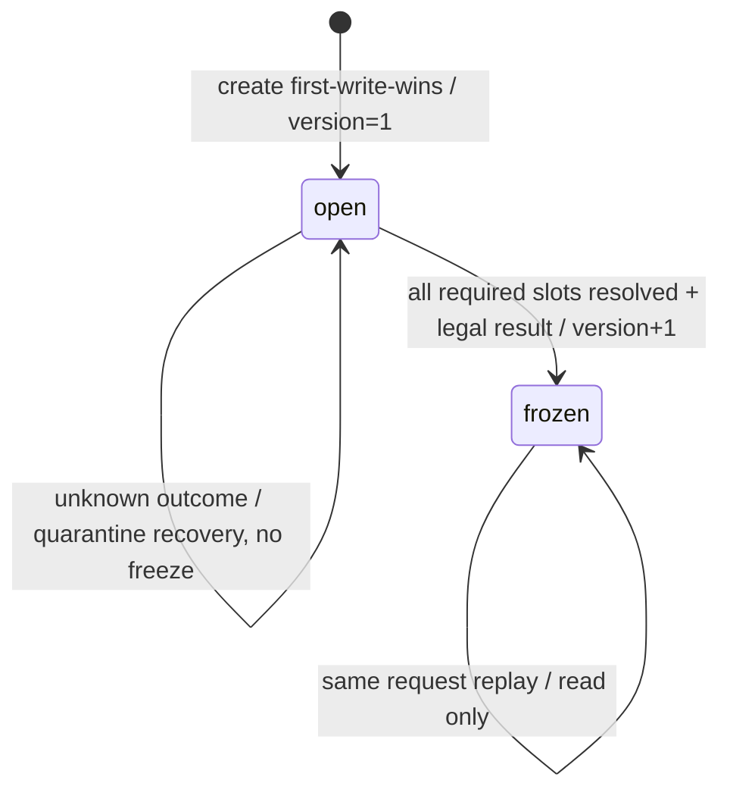

# GraphToolResultV1 与 ToolReceipt 可执行契约 v1

> 文档状态：Review Ready / W2-R01 待跨角色与跨 Module 审核
>
> 契约版本：`graph_tool_result.v1`、`tool_receipt_snapshot.v1`
>
> 设计日期：2026-07-14
>
> Owner：Agent
>
> 实现门禁：本文和跨 Module 契约目录尚未 Approved。本批只提供测试专用 DTO、严格校验器与固定语料，不提供生产 DTO、Runner、Graph、Repository、Migration、IDL 或前端协议。

## 1. 目标与边界

本文把 [`runner-session-lane-review-v1.md`](./runner-session-lane-review-v1.md) 第 4 节中的候选语义收紧为可执行契约，关闭以下歧义：

1. `GraphToolResultV1` 的 exact-set 字段、类型、上限、`null/absent/[]` 与版本规则；
2. 六种 Result 状态与 Ref、Warning、`retryable` 的合法组合；
3. `result_code`、Warning Code、Resource Type 必须来自 pinned Tool Definition 的闭集 Registry；
4. 请求、执行引用和结果摘要使用不同域，不能互相覆盖或重算；
5. 外部调用前必须持久化 `prepared` slot，响应或权威查询后才能进入 `resolved`；
6. Receipt append 与 freeze 必须共同锁定父 Receipt 的 `open + receipt_version + fence`；
7. ToolReceipt 自身 `receipt_ref` 与下游 `execution/result refs` 分离，避免自引用循环；
8. 使用真实 UUIDv7、真实摘要和稳定错误码的正负向 Corpus。

`GraphToolResultV1` 只在 Agent 内部 Graph Tool、Runner 和模型结果之间传递。Business、Worker 和浏览器不直接解析该 DTO：

```text
Graph Tool
  -> Frozen ToolReceipt + GraphToolResultV1
  -> Agent deterministic projector
  -> A2UI/Event/HTTP projection
```

A2UI Projector 必须重读 Approval、Operation 和 Resource 权威对象；Result 可见不授予权限，也不能替代 A2UI ActionDefinition。若未来让其他 Module 或浏览器直接消费该 DTO，必须升级为新的跨 Module/HTTP 契约并重新评审。

## 2. JSON 与兼容规则

### 2.1 exact-set

所有对象严格拒绝：

- unknown field；
- 顶层或任意嵌套对象的重复 key；
- 任意显式 `null`；
- 非 UTF-8、非法 JSON、尾随第二个 JSON 值；
- 数字字符串代替整数、字符串代替布尔值等隐式类型转换；
- 未知 Schema、状态、Result Code、Warning Code、参数或 Resource Type。

新增字段、状态或枚举必须升级 Schema 或完成 exact-version 协商；同一版本不能用“忽略未知字段”扩展。可选对象不适用时必须 absent，列表字段始终存在且使用非 null `[]` 表示空集合。

[`aigc-contract-catalog.md`](../cross-module/aigc-contract-catalog.md) 当前“同主版本可增加可选字段、Consumer 忽略未知可选字段”的通用规则面向跨 Module DTO/Event。本文提议把 Agent 内部 `GraphToolResultV1` 明确列为 exact-version 例外；联合评审必须在跨 Module 目录中确认该例外后，W2-R01 才能 Approved。本批不自行修改跨 Module 兼容规则。

### 2.2 Canonical JSON

Canonical JSON 使用以下规则：

- UTF-8；所有字符串必须为 NFC，禁止前后空白和控制字符；
- 对象字段顺序由版本化 DTO 固定；关闭 HTML escape；compact JSON，无尾随换行；
- UUID 使用小写 RFC 9562 UUIDv7，并且 variant 必须为 RFC 4122/9562 variant；
- 摘要使用 `sha256:<64 lowercase hex>`；
- 整数使用 JSON 十进制整数，不允许浮点或指数形式进入语义 DTO；跨语言精确整数统一限制为 `1..9007199254740991`，字段更窄的 Registry 边界优先；
- set 语义数组由生产者按本文 tuple 排序并去重，校验器不静默重排；
- 普通 list 保留协议规定的顺序；
- absent、`[]` 和字段存在是不同字节语义，`null` 永远非法。

字符串转义同样固定：`<`、`>`、`&` 不做 HTML escape；引号和反斜杠使用标准 JSON escape；U+2028/U+2029 总是编码为小写 `\u2028`/`\u2029`；UTF-16 escape 只接受合法 scalar 或配对 surrogate，未配对 high/low surrogate 在 JSON 检查层拒绝，不能先替换为 U+FFFD 再计算摘要。

`graph_tool_result.v1` 的对象字段顺序固定如下，条件字段 absent 时不占位：

| 对象 | 字段顺序 |
|---|---|
| Result | `schema_version,status,result_code,summary,resource_refs,approval_ref?,operation_ref?,receipt_ref,warnings,cancellation_stage?,retryable` |
| Resource | `resource_type,resource_id,resource_version,content_digest` |
| Approval | `approval_id,approval_version,approval_digest,card_id` |
| Operation | `operation_id,operation_version,operation_digest,batch_id,batch_version,batch_digest` |
| Receipt | `receipt_id,dispatch_receipt_id?,dispatch_receipt_version?,dispatch_receipt_digest?` |
| Warning | `code,params,target_refs` |
| Warning Param | `key` 后接且只接 `string_value/integer_value/boolean_value` 之一 |
| Target | `target_type,target_id,target_version,input_digest` |

Receipt 与 Execution Ref 的跨语言字段顺序同样固定，不能依赖 Go struct 的偶然声明顺序：

| 对象 | 字段顺序 |
|---|---|
| ToolReceipt Snapshot | `schema_version,receipt_id,session_id,turn_id,run_id,tool_call_id,tool_key,definition_version,intent_schema_version,result_schema_version,request_canonicalization_version,request_semantic_digest,write_state,receipt_version,owner_fence,execution_slots,result?,result_digest?,result_refs` |
| Execution Slot | `ref_slot,slot_ordinal,ref_type,ref_schema_version,authority_owner,idempotency_key,request_digest,query_contract,resolution_state,authority_ref?,resolved_ref_digest?` |
| Authority Ref | `authority_id,authority_version,authority_semantic_digest,resource_type?,projection_id?` |
| Result Ref | `ref_slot,ref_digest` |
| Execution Ref Digest Projection | `canonicalization_version,receipt_id,parent_request_digest,tool_key,definition_version,intent_schema_version,ref_slot,slot_ordinal,ref_type,ref_schema_version,authority_owner,idempotency_key,request_digest,query_contract,authority_ref` |

通用摘要形式为：

```text
sha256(UTF8(domain) || 0x00 || canonical_json)
```

摘要域不得复用：

| 摘要 | domain | 覆盖 |
|---|---|---|
| Result | `dora.graph_tool_result.v1` | 完整模型可见 Result，包括当前 ToolReceipt ID；不包含 result digest 自身 |
| Execution Ref | `dora.tool_execution_ref.v1` | canonicalization version、Receipt ID、父 request digest、Tool Key/Definition/Intent Pin、slot/ordinal、类型/Schema、Owner、幂等键、阶段请求摘要、查询契约和权威引用 |
| Receipt Corpus Snapshot | `dora.tool_receipt_snapshot.v1` | 仅用于冻结测试向量，不替代数据库行摘要或业务审计摘要 |

请求摘要域固定为 `dora.tool_request.v1`。其精确 Intent Schema 由各 Tool Definition 冻结，但必须覆盖 Tool Pin、可信身份、输入资源 exact-set、调用前已存在的 Approval/Quote/Budget 和 Registry/Policy/Budget 版本。执行后产生的引用永不回写请求摘要。

### 2.3 稳定错误优先级

同一输入同时含多个错误时只返回一个稳定错误，优先级从高到低固定为：

1. 字节长度、UTF-8 与 UTF-16 escape；
2. JSON token、重复 key、显式 null、尾随值；
3. unknown field 与 wire type mismatch；
4. 缺少必填字段；
5. Schema version 与 status enum；
6. Result Code 格式、禁止的内部结果码、pinned Registry；
7. summary/list/resource/warning/receipt 的值、上限和 canonical order；
8. 状态字段矩阵；
9. Receipt execution ledger 与 Result evidence 逐值追溯。

层内 tie-break 也固定：第 1 层按“长度 → UTF-8 → UTF-16 escape”；第 2 层按原始 JSON 的深度优先 token 顺序，以最早错误字节偏移为准，同偏移再按 `INVALID_JSON → DUPLICATE_KEY → NULL_NOT_ALLOWED → TRAILING_VALUE`；第 3 层按原始对象字段顺序，以最早 unknown/type 字段为准，同偏移 `UNKNOWN_FIELD → TYPE_MISMATCH`；第 5 层固定 version 先于 status；第 6 层固定格式 → 禁止内部 code → Registry；第 7 层固定 summary → list 上限 → resource refs → warnings → receipt ref，并在数组内取最小 index/字段顺序；其余层按上述单一检查项。Corpus 同时固定跨层与同层多故障向量，生产实现不得按 map 遍历顺序或语言默认错误任意选择。

## 3. GraphToolResultV1

### 3.1 顶层字段

| 字段 | 类型 | 必填 | 规则 |
|---|---|---:|---|
| `schema_version` | string | 是 | 固定 `graph_tool_result.v1` |
| `status` | enum string | 是 | 六种状态之一 |
| `result_code` | string | 是 | `[A-Z][A-Z0-9_]{2,63}`；必须命中 pinned ResultCode Registry |
| `summary` | string | 是 | NFC 纯文本，1～280 Rune；不是授权或状态判断来源 |
| `resource_refs` | `ResourceRefV1[]` | 是 | `0..32`，按 `(resource_type, resource_id, resource_version)` 严格升序且唯一 |
| `approval_ref` | `ApprovalRefV1` | 条件 | 仅 `waiting_user` 出现 |
| `operation_ref` | `OperationRefV1` | 条件 | 仅 `accepted` 出现 |
| `receipt_ref` | `ReceiptRefV1` | 是 | `receipt_id` 必须是当前冻结的 ToolReceipt |
| `warnings` | `WarningV1[]` | 是 | `0..32`，按 code 严格升序且唯一 |
| `cancellation_stage` | enum string | 条件 | 仅 `cancelled` 出现 |
| `retryable` | bool | 是 | 由 pinned ResultCode Registry 固定，不能运行时自由判断 |

`UNKNOWN_OUTCOME`、`STALE_ATTEMPT`、`STALE_FENCE`、`TOOL_RECEIPT_CONFLICT`、`TOOL_EXECUTION_REF_CONFLICT`、`RECEIPT_VERSION_CONFLICT`、`TOOL_RECEIPT_FROZEN`、`TOOL_EXECUTION_SLOT_UNRESOLVED`、`RESULT_DIGEST_MISMATCH` 和 `RESULT_REF_MISMATCH` 是内部恢复/冲突事实，禁止注册为可冻结 Result Code。

### 3.2 ResourceRefV1

| 字段 | 类型 | 规则 |
|---|---|---|
| `resource_type` | registered snake_case | 必须命中 pinned Resource Type Registry |
| `resource_id` | UUIDv7 | 权威资源 ID |
| `resource_version` | int64 | `1..9007199254740991` |
| `content_digest` | SHA-256 | 当前不可变版本的内容摘要 |

Result 只返回本次调用产生或确认的权威资源。`failed/cancelled` 不能携带资源；若保留了可展示成功资源且部分目标确定失败，必须使用 `partial`。

### 3.3 ApprovalRefV1

| 字段 | 类型 | 规则 |
|---|---|---|
| `approval_id` | UUIDv7 | Agent Approval 权威 ID |
| `approval_version` | int64 | `1..9007199254740991`；冻结时仍为同版本 `pending` |
| `approval_digest` | SHA-256 | Approval 保护参数/摘要的权威语义摘要 |
| `card_id` | UUIDv7 | 与 Approval 同事务预分配的稳定投影聚合 ID；不要求 Card 已投影，不授予权限，Action 必须重读 Approval |

`card_id` 不允许由 A2UI 投影器事后随机补造，否则会形成 Result freeze 与 Card 投影的循环依赖。Card Revision、Action Definition 和前端协商仍由 W2-R08 冻结；若 W2-R08 不接受“Approval 创建时预分配 Card aggregate ID”，必须在 R01 Approved 前升级本 Schema，而不是在生产实现中静默省略。本文不授权前端直接使用该引用执行动作。

### 3.4 OperationRefV1

| 字段 | 类型 | 规则 |
|---|---|---|
| `operation_id/version/digest` | UUIDv7/int64/SHA-256 | 可查询的 Operation 权威引用 |
| `batch_id/version/digest` | UUIDv7/int64/SHA-256 | 本 v1 固定要求异步受理关联 Batch |

所有 version 均限制为 `1..9007199254740991`。

`accepted` 只表示 Operation/Batch 和 Dispatch 已权威提交，不表示 Job、Provider、资源或业务终态成功。

### 3.5 ReceiptRefV1

| 字段 | 类型 | 规则 |
|---|---|---|
| `receipt_id` | UUIDv7 | 当前 ToolReceipt 自身 ID；所有状态必填 |
| `dispatch_receipt_id/version/digest` | UUIDv7/int64/SHA-256 | 仅 `accepted` 三字段同时出现；必须来自 resolved execution slot |

`dispatch_receipt_version` 限制为 `1..9007199254740991`。

当前 ToolReceipt 自身引用是 Receipt identity 的固有字段，不写入 `execution_refs/result_refs`。Dispatch Receipt 是下游权威引用，必须进入 resolved slot 和 `result_refs`，不能借 `receipt_ref` 逃逸追溯。

### 3.6 WarningV1 与失败目标

```json
{
  "code": "TARGET_VERSION_CONFLICT",
  "params": [{"key": "failed_count", "integer_value": 1}],
  "target_refs": [{
    "target_type": "storyboard_slot",
    "target_id": "019f0000-0000-7000-8000-000000000402",
    "target_version": 4,
    "input_digest": "sha256:7777777777777777777777777777777777777777777777777777777777777777"
  }]
}
```

- 禁止 `map[string]any` 或任意 params 对象；参数是按 key 排序的 tagged union 数组；
- 每个参数恰有一个 `string_value/integer_value/boolean_value`；
- Warning Registry 为每个 code 固定参数 exact-set、类型、required、数值/长度边界和 `allowed_statuses`；
- `partial` 至少一个 Warning 必须包含非空 `target_refs`，精确说明失败目标；
- `target_refs` 按 `(target_type, target_id, target_version)` 严格升序且唯一；
- `target_version` 限制为 `1..9007199254740991`；
- 成功资源与失败目标不得重叠，完整 exact-set 闭合由 pinned Tool Result Policy 校验。

### 3.7 状态矩阵

| status | resources | approval | operation/batch | dispatch receipt | warnings | cancellation stage | retryable |
|---|---|---|---|---|---|---|---:|
| `completed` | `0..N` | 禁止 | 禁止 | 禁止 | `0..N` 非失败告警 | 禁止 | false |
| `accepted` | 必须 `[]` | 禁止 | 必填 | 必填 | `0..N` | 禁止 | false |
| `waiting_user` | `0..N` 候选可见 | 必填且 pending | 禁止 | 禁止 | `0..N` | 禁止 | false |
| `partial` | 至少 1 个成功资源 | 禁止 | 禁止 | 禁止 | 至少 1 个且含失败目标 | 禁止 | false |
| `failed` | 必须 `[]` | 禁止 | 禁止 | 禁止 | `0..N` | 禁止 | Registry 固定 |
| `cancelled` | 必须 `[]` | 禁止 | 禁止 | 禁止 | `0..N` | 必填 | false |

`cancellation_stage` v1 只允许：

- `before_side_effect`；
- `after_side_effects_resolved`。

ResultCode Registry 必须逐 code 固定 cancellation stage：`RUN_CANCELLED_BEFORE_SIDE_EFFECT` 只配 `before_side_effect/cancelled_before_side_effect`；`RUN_CANCELLED_AFTER_SIDE_EFFECTS_RESOLVED` 只配 `after_side_effects_resolved/cancelled_after_side_effects_resolved`，二者不可互换。

`before_side_effect` 要求 Result refs 为空且 execution ledger 不含任何已提交副作用。`after_side_effects_resolved` 要求至少一个已提交副作用 slot、所有副作用 slot 均已 resolved，并以 slot ordinal exact-set 进入 Receipt `result_refs` 作为内部取消证据；Result 本身仍不伪造资源或 Operation 成功。存在任一外部副作用 unknown 时不能选择第二项，也不能冻结为任何 Result；Receipt 保持 open，Input/Run 进入隔离恢复。

### 3.8 ResultCode Registry

每个 Tool Definition Pin 必须包含或不可变引用：

```text
result_code -> exact status -> retryable constant -> effect_class -> cancellation_stage（仅 cancelled）
```

`retryable=true` 仅允许 `failed` 且必须证明尚未发送或提交任何扣费、资源写入、Approval、Operation 或 Dispatch 副作用。它只表示新的用户意图可安全重试；同 ToolReceipt 重放仍返回原 frozen failure，不能立即自动重跑原副作用。

## 4. ToolReceipt Snapshot 与执行 slot

### 4.1 Snapshot 字段

测试 Corpus 使用 `tool_receipt_snapshot.v1` 表达持久化不变量：

| 字段组 | 必须冻结的内容 |
|---|---|
| identity | `receipt/session/turn/run/tool_call` UUIDv7 |
| Tool Pin | `tool_key/definition_version/intent_schema_version/result_schema_version` |
| request | canonicalization version + immutable request semantic digest |
| write CAS | `write_state/receipt_version/owner_fence` |
| stage ledger | 非 null `execution_slots[]` |
| frozen result | `result/result_digest/result_refs[]` |

生产数据库是否拆成父表、slot 子表和 result projection 表由 Migration 评审决定，但行为必须等价。不得直接把测试 Snapshot 当作最终 GORM Model 或 SQL Schema。

### 4.2 调用前 prepared slot

每次可能产生外部副作用的阶段，必须在调用前以当前有效 Fence 和 Receipt Version 持久化：

| 字段 | 语义 |
|---|---|
| `ref_slot` | Tool Definition 固定白名单名称，禁止换 slot 规避冲突 |
| `slot_ordinal` | 从 1 开始的稳定阶段顺序 |
| `ref_type/ref_schema_version` | 预期权威引用类型和 Schema |
| `authority_owner` | `agent/business/worker` |
| `idempotency_key` | 外部调用和权威查询共同使用的稳定身份 |
| `request_digest` | 此阶段请求语义摘要，不含响应 |
| `query_contract` | 响应未知时使用的权威查询契约 |
| `resolution_state` | `prepared` 或 `resolved` |

每个 `(tool_key, definition_version)` 必须冻结 execution slot Registry；`ref_slot/slot_ordinal/ref_type/ref_schema_version/authority_owner/query_contract/effect_class` 必须逐值命中 Registry，不能由模型或 Runner 临时扩展。`effect_class` v1 只允许 `side_effect/evidence_only`，失败与取消 evidence 必须按 pinned policy 分类，禁止用硬编码 `ref_type` 白名单猜测副作用；因此未来增加 `ApprovalConsumptionReceipt` 等类型也不能逃逸账本检查。`idempotency_key` v1 精确派生为 `tr:<receipt_id>:<ref_slot>:v1`。Corpus 中出现的七条 slot policy 是用于评审的代表性 pinned Definition，不等于六个 Tool 已完成全部生产 Registry。

`prepared` 时禁止出现 authority ref 或 resolved digest。外部响应或查询确认后，原 slot 一次性写入：

```text
authority_id + authority_version + authority_semantic_digest
```

并按 `dora.tool_execution_ref.v1` 计算 `resolved_ref_digest`。摘要投影必须同时绑定当前 Receipt ID、父 `request_semantic_digest`、Tool Key/Definition/Intent Pin、slot Registry 字段、阶段请求、查询契约和完整 authority ref；禁止把另一个 Receipt、请求或 Definition 的权威引用移植进来。同 slot、同完整 prepared/resolved ref 是只读幂等重放，即使提交方携带的 expected Receipt Version 已落后也不增加 Receipt Version；同 slot、不同请求或权威引用返回 `TOOL_EXECUTION_REF_CONFLICT`。

仅有 `execution_refs` 而没有调用前 slot 预留无法区分“未发送”和“已提交但响应丢失”，因此不允许进入生产实现。

### 4.3 父 Receipt CAS

每次 reserve、resolve 或 freeze 都必须在一个 Agent PostgreSQL 事务内：

```text
WHERE write_state = 'open'
  AND receipt_version = :expected_version
  AND owner_fence = :stored_fence
  AND current Session/Input/Run owner is valid
```

普通 reserve、resolve、freeze 命令携带的 Fence 必须与父 Receipt 已存 `owner_fence` **精确相等**；任意自行提高的 Fence 也以 `STALE_FENCE` 拒绝。合法接管属于 W2-R02 的独立 CAS：它必须先证明 Session Lease 过期、取得数据库当前最高 Fence、记录 `recovered_from_fence` 与恢复证据，再原子更新可接管 Receipt 的 Owner/Fence；本文 Corpus 不把“传入更高数字”视为接管。W2-R02 Approved 前不存在生产接管授权。

成功后父 `receipt_version + 1`。slot 子行的唯一键为 `(tool_receipt_id, ref_slot)`。父行条件更新/锁和子行写入必须在同事务，防止一方 freeze 后另一方晚到追加。`receipt_version`、Fence 和 ordinal 均限制在跨语言安全整数范围内；到达上界后失败关闭，禁止回绕。

稳定错误：

| 条件 | 错误码 | 写入 |
|---|---|---|
| 同 Receipt key、异 request digest | `TOOL_RECEIPT_CONFLICT` | 无 |
| 同 slot、异请求或异 resolved ref | `TOOL_EXECUTION_REF_CONFLICT` | 无 |
| 旧 Fence | `STALE_FENCE` | 无 |
| expected version 过期 | `RECEIPT_VERSION_CONFLICT` | 无 |
| frozen 后 reserve/resolve/freeze | `TOOL_RECEIPT_FROZEN` | 无 |
| prepared/unknown slot 试图 freeze | `TOOL_EXECUTION_SLOT_UNRESOLVED` | 无 |
| 结果摘要不符 | `RESULT_DIGEST_MISMATCH` | 无 |
| Result 外部引用不能追溯 | `RESULT_REF_MISMATCH` | 无 |

这些内部错误不得伪装成 frozen `failed` Result。

### 4.4 状态迁移



禁止迁移：

- 副作用开始后才创建 Receipt 或 reserve slot；
- prepared slot 未解决即调用 freeze；
- append 和 freeze 使用不同父行互斥条件；
- frozen 后 append、删除、重开或覆盖结果；
- 高 Fence Owner 修改 request/tool pin/original causal identity；
- 旧 Owner 直接写晚到响应；新 Owner 必须按 prepared slot 权威查询；
- 最终一致 `not_found` 直接证明“未开始”；
- unknown outcome 写成 `completed/partial/failed/cancelled`；
- 投影失败重新调用模型、Tool、扣费、写业务或 Dispatch。

### 4.5 freeze 与 result refs

freeze 前必须满足：

1. 所有必需 slot 均 resolved，且不存在 unknown；
2. Result 通过 exact Schema、状态矩阵和 pinned Registry；
3. Result `receipt_ref.receipt_id` 等于当前 Receipt ID；
4. 每个外部 Result Ref 按 slot ordinal 投影为 `ref_slot + resolved_ref_digest`；
5. Result 中的 Operation、Batch、Dispatch、Approval 和 Resource ID/version/digest 与对应 authority ref 逐值一致；
6. `result_digest` 覆盖完整 Result，包括 summary、retryable、所有嵌套 ref、Warning 和当前 Receipt ID；
7. `result/result_digest/result_refs` 在同一次 `open -> frozen` CAS 写入。

证据追溯适用于全部状态，不只适用于 `accepted`：`waiting_user` 必须逐值命中 Approval slot，且 `card_id` 等于该 slot 的稳定 `projection_id`；`completed/partial` 的每个 Resource 必须与 resolved resource slot 形成 exact-set；`failed` 与 `cancelled/before_side_effect` 不得在 ledger 中藏有 Approval、Operation、Batch、Dispatch、Resource、Business Write 或 Charge 等已提交副作用；`cancelled/after_side_effects_resolved` 必须携带全部已解决副作用 slot 的内部 `result_refs` exact-set。`retryable=true` 的失败只允许在 ledger 证明无副作用时冻结。

Receipt 自身 ID 不进入 `result_refs`。freeze 时不得临时调用下游补造 ref。

## 5. 非法组合与固定拒绝分类

| 编号 | 非法事实 | 稳定拒绝分类 |
|---|---|---|
| `GTR-N01..N05` | malformed、重复 key、尾随值、null | JSON 层拒绝 |
| `GTR-N06..N09` | unknown field/version/status 或缺必填字段 | exact Schema 拒绝 |
| `GTR-N10..N12` | 未注册 code、内部 unknown、retryable 与 Registry 不符 | Registry 拒绝 |
| `GTR-N13..N16` | accepted 缺 Operation/Dispatch；waiting 缺 Approval 或已有 Operation | 状态矩阵拒绝 |
| `GTR-N17..N20` | partial 缺成功/失败明细；failed 有资源；cancelled 缺阶段 | 状态矩阵拒绝 |
| `GTR-N21..N28` | 缺 Receipt、非法 ID/digest、乱序/重复 ref、无类型/额外 Warning 参数 | 值/Canonical 拒绝 |
| `GTR-N29/N30` | UUID variant 非法、未配对 surrogate | 值/Unicode 层拒绝 |
| `GTR-N31..N33` | unknown+version、missing+version、内部 code+非法 summary 多故障 | 按 2.3 稳定优先级拒绝 |
| `GTR-N34/N35` | Warning 整数越过 Registry / JS safe-integer 边界 | 值拒绝 |
| `GTR-N36..N39` | null/duplicate、unknown/type 同层多故障交换顺序 | 按原始字节/字段顺序稳定拒绝 |
| `GTR-N40` | cancelled ResultCode 与 cancellation stage 不匹配 | Registry 拒绝 |
| `TR-N01` | 同 Receipt key 异请求摘要 | `TOOL_RECEIPT_CONFLICT` |
| `TR-N02/N03` | 同 slot 异请求或异 authority ref | `TOOL_EXECUTION_REF_CONFLICT` |
| `TR-N04` | unresolved slot freeze | `TOOL_EXECUTION_SLOT_UNRESOLVED` |
| `TR-N05` | frozen 后追加 | `TOOL_RECEIPT_FROZEN` |
| `TR-N06` | claimed/stored result digest 不符 | `RESULT_DIGEST_MISMATCH` |
| `TR-N07/N08` | stale fence / stale receipt version | `STALE_FENCE` / `RECEIPT_VERSION_CONFLICT` |
| `TR-N09` | 缺 Operation/Batch/Dispatch 逐值证据 | `RESULT_REF_MISMATCH` |
| `TR-N10` | 非法 GraphToolResult 尝试 freeze | Result 层稳定拒绝 |
| `TR-N11/N12` | 伪造更高 Fence / freeze 使用过期 Version | `STALE_FENCE` / `RECEIPT_VERSION_CONFLICT` |
| `TR-N13` | slot 未命中 pinned Definition Registry | `INVALID_TOOL_RECEIPT` |
| `TR-E02/E04/E06` | waiting/completed/partial 缺权威 Result evidence | `RESULT_REF_MISMATCH` |
| `TR-E07/E08` | retryable failure 已有副作用 / `card_id` 不匹配 Approval 投影 | `RESULT_REF_MISMATCH` |
| `TR-E09/E10` | cancelled-after 全量已解决副作用 / failed-before 空副作用账本 | 正向 evidence 冻结 |
| `TR-E11..E13` | 新 ref type 的 policy 副作用不得被 failed 隐藏，cancelled-after 必须包含且不得漏选 | `RESULT_REF_MISMATCH` / 正向冻结 |

权威状态类非法组合仍需后续 Repository/集成测试：

- `completed` 虽未公开 ref，但 execution ledger 中仍有 pending Approval 或活动 Operation；
- Approval 在 `waiting_user` freeze 前已不再是相同版本 pending；
- Dispatch 权威提交响应丢失后未查询即 freeze 或重发；
- unknown outcome 使 Input 进入 `retry_wait/resolved/dead` 或 Run 先进入终态；
- frozen 摘要损坏后重跑 Model/Tool；
- Event/A2UI Projection 失败触发业务重跑。

## 6. 可执行 Corpus

测试专用产物：

- [`manifest.json`](../../../agent/tests/contract/testdata/w2_r01/manifest.json)：Corpus 文件 raw SHA-256；
- [`graph_tool_result_v1.json`](../../../agent/tests/contract/testdata/w2_r01/graph_tool_result_v1.json)：8 个合法向量（覆盖六状态、Unicode canonical edge 与取消后副作用收口）、40 个固定拒绝向量、Registry；
- [`tool_receipt_v1.json`](../../../agent/tests/contract/testdata/w2_r01/tool_receipt_v1.json)：11 个 prepared/resolved/frozen/replay 正向迁移、13 个负向迁移、13 个跨状态 evidence 向量和 7 条 pinned slot policy；
- [`graph_tool_result_v1_corpus_test.go`](../../../agent/tests/contract/graph_tool_result_v1_corpus_test.go)：递归重复 key、严格解码、Canonical、Registry、状态矩阵和 Result digest；
- [`tool_receipt_v1_corpus_test.go`](../../../agent/tests/contract/tool_receipt_v1_corpus_test.go)：slot/ref digest、Receipt CAS 纯状态模型和 Result evidence 追溯。

运行：

```bash
GOWORK=off /Users/figo/sdk/go1.26.3/bin/go -C agent test ./tests/contract -count=1
GOWORK=off /Users/figo/sdk/go1.26.3/bin/go -C agent test -race ./tests/contract -count=1
```

测试代码只存在于 `_test.go`，不会进入 `agent-service` 二进制。未来 TS 只读取同一 raw Corpus 验证投影/Reducer，不复制 Result 作为浏览器生产 Transport。

## 7. 实现前仍需关闭

- [x] 八个合法向量覆盖六状态、Unicode canonical edge 与两种取消阶段，并使用真实 UUIDv7/Result digest；
- [x] unknown/duplicate/null/trailing/type/上限/排序固定拒绝；
- [x] typed Warning params 与 partial 失败目标固定；
- [x] ResultCode Registry 固定 status/retryable/effect class，cancelled 额外固定 cancellation stage；
- [x] execution ref/result 摘要域、父请求/Tool Pin 绑定和完整 Result 覆盖固定；
- [ ] 各 Tool 的 canonical request fixture 与完整 Intent exact-set 尚待独立 Tool 设计评审冻结；当前只固定请求摘要域和必含语义，不宣称 request corpus 已完成；
- [x] prepared/resolved slot 与 append/freeze 父 CAS 固定；
- [x] ToolReceipt self ref 与外部 result refs 分离；
- [x] 同义重放、异义冲突、旧 Fence、过期 Version、frozen append 固定向量可执行；
- [ ] Agent/Business/安全/运维/财务完成跨角色审核；
- [ ] `aigc-contract-catalog.md` 整体跨 Module Approved，并明确 Agent 内部 Result exact-version 例外；
- [ ] W2-R08 接受 Approval 创建事务预分配 `card_id`，或在 R01 Approved 前升级 Result Schema；
- [ ] 各 Tool 独立设计冻结完整 ResultCode/Warning/Resource/slot Registry 和 exact-set；
- [ ] W2-R02 冻结 Session Lane/Lease/Fence 与 Repository 事务边界；
- [ ] W2-R03 冻结 Approval/Continuation 权威状态与消费；
- [ ] W2-R08 冻结 A2UI Projector、Action 和版本协商；
- [ ] 最终 Migration/GORM/Repository/Race/PostgreSQL crash injection 方案评审通过。

## 8. 当前评审结论

当前结论：**Agent-owned 技术契约已达到 Review Ready；W2-R01 仍未 Approved，不通过生产实现门禁。**

本批可以作为联合评审的精确输入，但不授权创建 ToolReceipt 表、Repository、Runner、Graph、Executable Registry、前端 Approval Action 或修改 Tool Catalog availability。
