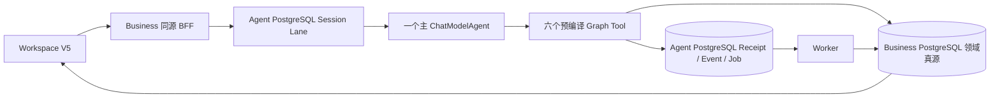

# Agent Graph Tool 当前实现索引

> 适用范围：`mvp_all_tools.runtime.v1preview1 + media.runtime.v3preview1` local Development Preview；六个 Tool 的完整生产范围仍为 Draft。当前验收结论只见[交付状态](../../../requirements/delivery-status.md)。
>
> 本目录只描述当前代码已经实现的范围。生产目标、历史方案和未来设想不得写成当前事实。

## 1. 唯一口径

- 交付状态和下一阶段只以[交付状态](../../../requirements/delivery-status.md)为准；本索引不维护独立排期。
- 产品范围与非目标见[产品范围](../../../requirements/product-scope.md)。
- 六工具业务主链见[创作工作流](../../functions/creation-workflow.md)。
- 素材/Evidence 边界见[素材与分析](../../functions/materials-and-analysis.md)。
- PNG/MP4、Asset 与 Range 边界见[媒体与资产](../../functions/media-and-assets.md)。
- Session Lane、Receipt、Unknown Outcome 与测试门禁见[运行时与质量](../../functions/runtime-and-quality.md)。
- Workspace V5、SSE 与 Card 见[工作区与事件](../../functions/workspace-and-events.md)。

## 2. 当前六工具

| 顺序 | Tool | 当前 Definition / Graph | 当前完成边界 | 生产状态 |
|---|---|---|---|---|
| 1 | [`plan_creation_spec`](plan_creation_spec-design.md) | `plan_creation_spec.v1preview1` / `plan_creation_spec_graph_v1` | 目标转 CreationSpec `draft`，Business 持久化、Receipt、Workspace Card 与保存 Unknown Outcome 恢复 | Draft |
| 2 | [`analyze_materials`](analyze_materials-design.md) | `analyze_materials.v2preview1` / `analyze_materials_graph_v2_preview` | 读取 Business text/image Evidence，输出非权威 `completed/partial/failed` 分析；不创建 MaterialAnalysis 资源 | Draft |
| 3 | [`plan_storyboard`](plan_storyboard-design.md) | `plan_storyboard.v2preview1` / `plan_storyboard_graph_v2preview1` | 读取 CreationSpec Draft，生成并保存 Storyboard Preview `draft`，校验局部引用与依赖 DAG | Draft |
| 4 | [`write_prompts`](write_prompts-design.md) | `write_prompts.v2preview1` / `write_prompts_graph_v2preview1` | 读取 Storyboard Preview 全部 Slot，exact-set 生成并保存 Prompt Preview `draft` | Draft |
| 5 | [`generate_media`](generate_media-design.md) | `generate_media.v3preview1` / `generate_media_graph_v3preview1` | 一个 Prompt Preview 目标生成确定性 `640x360` PNG，异步 Job/Worker/Finalize 闭环 | Draft |
| 6 | [`assemble_output`](assemble_output-design.md) | `assemble_output.v3preview1` / `assemble_output_graph_v3preview1` | 一个 ready PNG 经固定白名单 ffmpeg 生成 2 秒 H.264 MP4，受保护 Range 读取 | Draft |

## 3. 当前统一架构

当前不变量：

1. 只有一个主 `ChatModelAgent`；六个 Tool 是高层 Graph，不是六个子 Agent。
2. Graph 启动时使用 `compose.AllPredecessor` 编译；模型输出必须经过独立确定性 Validator。
3. Business 拥有 CreationSpec、Storyboard、Prompt 与 Media Asset；Agent 拥有 Session/Run/Receipt/Event/Operation/Job；Worker 只拥有 Attempt/Artifact/观察回执。
4. PostgreSQL 是权威；Redis 只用于唤醒，etcd 只用于服务注册发现。
5. 当前 Preview 无计费、无正式 Approval、无真实外部模型/媒体 Provider；任何文档不得把这些能力写成已完成。
6. Unknown Outcome 只查询原稳定 key/digest；不得换键制造第二份业务对象、Job 或产物。

## 4. 验收覆盖与生产缺口

`make trial-basic` 的固定验收范围包括：真实 Chromium 中顺序执行六个 Tool、六份 Tool Receipt、Worker 产出可解码 PNG 和可播放 MP4、`session.workspace.v5` Snapshot/SSE/Card、硬刷新恢复，以及同源媒体读取 `200/206/416`。

该快速 Trial 不等于以下生产门禁已通过：

- 真实 Provider 与 Provider Unknown Outcome 对账；
- 正式计费、收入、退款/冲正；
- 正式 Approval、Continuation 与高风险授权；
- 五条 isolated canonical smoke、故障注入、服务/数据库重启恢复；
- 生产 Registry/Catalog、TLS/服务身份、限流、审计、运维与发布 Evidence。

六份独立设计只维护各自当前实现的 exact-set 和生产差距。新增能力必须先更新产品范围与对应功能设计；影响阶段门禁时再更新唯一交付状态，然后修改代码和迁移，禁止在索引中先行宣称完成。
