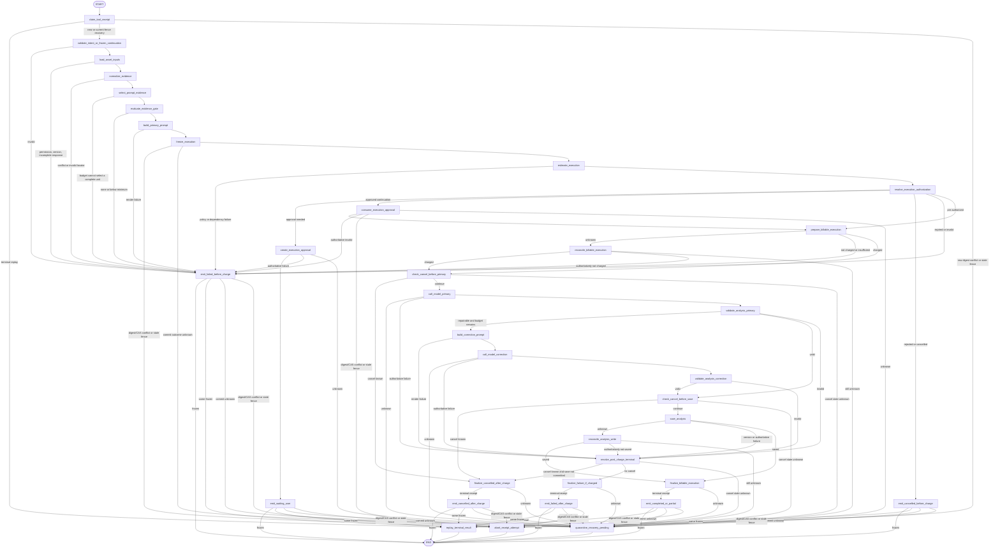
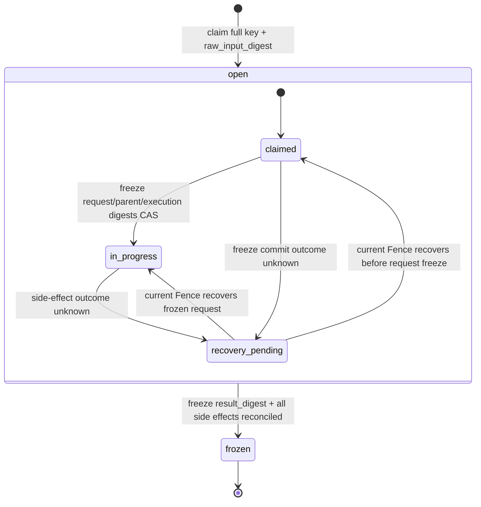
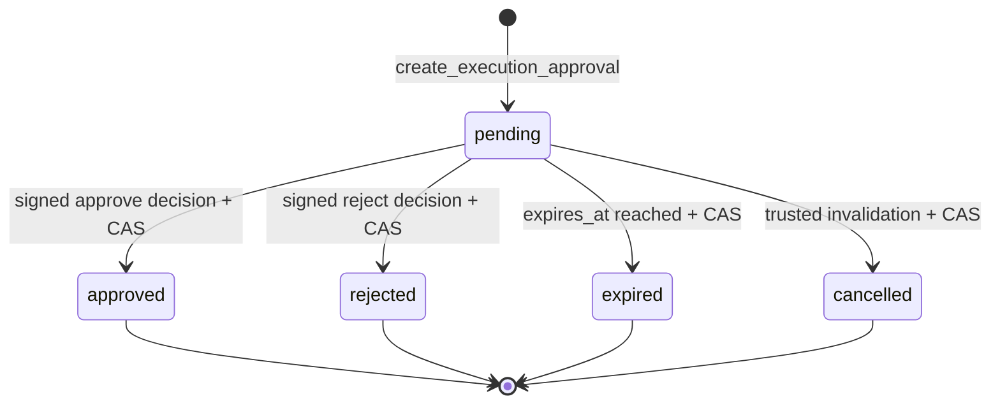
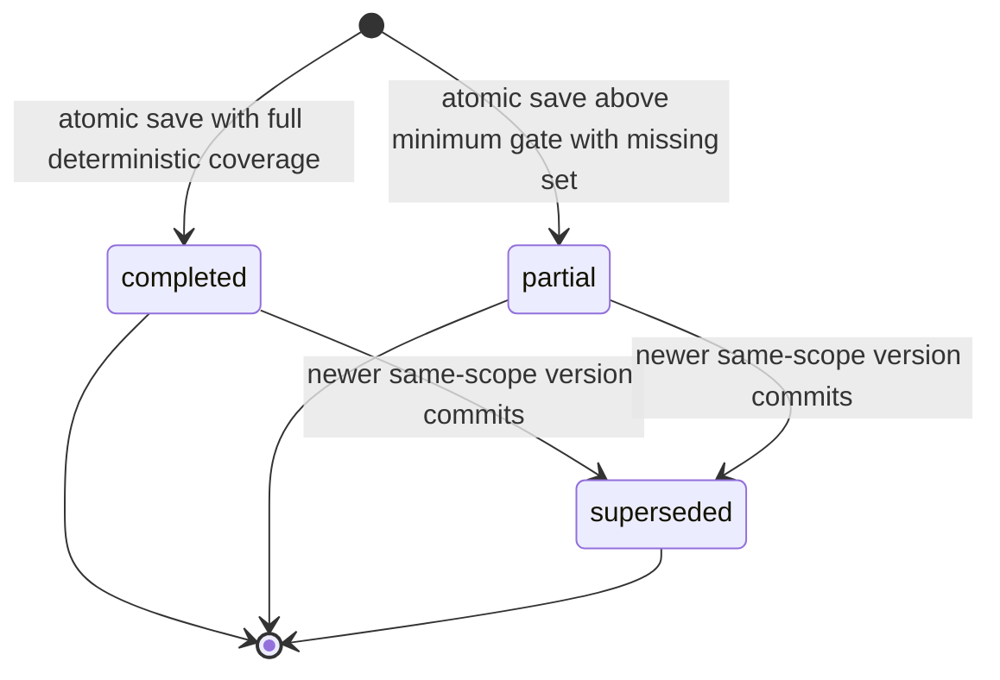

# `analyze_materials` Graph Tool 设计

> 状态：Draft / 待产品、Business、Agent、素材接入、财务与安全评审
>
> Graph Key：`analyze_materials_graph_v1`
>
> Tool Definition Version：`analyze_materials.v1alpha1`
>
> Migration Owner：Business（Asset、Evidence、MaterialAnalysis、Charge Receipt），Agent（Run、Model/Tool Receipt、Approval）
>
> 实现门禁：评审结论为“通过”前禁止创建生产代码、Migration、IDL 或 Executable Registry 项。

共同契约见 [`../../cross-module/aigc-contract-catalog.md`](../../cross-module/aigc-contract-catalog.md)。本 Tool 只分析 Business 已持久化、版本化且当前用户有权访问的素材证据；v1 不在 Graph 内启动 OCR、ASR、PDF 解析、视频抽帧、视觉理解 Provider 或其他长任务。

## 1. 场景、目标与边界

适用场景：用户从同一 Project 选择文字、图片、PDF、音频和视频素材，要求形成可供 Creation Spec、Storyboard 或 Prompt 引用的结构化素材报告。

目标：

- 冻结目标 Asset exact-set、版本、Evidence exact-set、缺失集合及其 digest；
- 明确区分证据支持的观察、基于观察的推断、风险提示和缺失/不确定；
- 只有达到确定性的最低可分析门槛才允许生成 `partial`，不得把“有一小段内容”直接等同于有效报告；
- 输出中的 Evidence 引用可确定性展开为 Asset、PDF 页码、音频/视频时间区间或文字区间；
- MaterialAnalysis 在 Business 中以不可变版本保存，后续 Tool 只按 Resource Ref 读取该精确版本；
- 在任何模型调用前完成预算校验、必要的正式 Approval 消费和一次性扣费准备。

非目标：

- 不负责上传、病毒扫描、OCR、ASR、PDF 解析、视频抽帧、转码或提取结果修复；
- 不根据文件名、扩展名、用户描述或缺失素材臆测内容；文件名只可作为展示元数据，不是 Evidence；
- 不生成 Creation Spec、Storyboard、Prompt、媒体、Asset Binding 或导出任务；
- 不修改原 Asset、用户标签、锁定内容或 Evidence；
- 不调用 Worker，不创建 Operation/Batch/Job，不返回 `accepted`；
- 不把模型标签、人物识别、版权判断或风险结论直接写成 Asset 权威事实。

权威来源：Asset、Evidence、MaterialAnalysis 和 Charge Receipt 归 Business PostgreSQL；Run、ToolReceipt、ModelReceipt、Approval 和 A2UI EventLog 归 Agent PostgreSQL；Graph Local State 和 Eino Checkpoint 均不是业务真源。

### 1.1 需求追踪

| 类型 | ID |
|---|---|
| Tool 主验收 | `GTL-ANALYZE-001` |
| 共通 Graph Tool | `GTL-USE-002`、`GTL-VER-001`、`GTL-IDEM-001`、`GTL-BILL-001`、`GTL-EARN-001`、`GTL-SEC-001` |
| 全功能冒烟 | `SMK-010`、`SMK-021`、`SMK-023`、`SMK-033`、`SMK-034` |

## 2. Intent、可信输入、Evidence 与结果

### 2.1 模型可填写的 `AnalyzeMaterialsIntentV1`

Tool JSON Schema 及每个嵌套对象均设置 `additionalProperties: false`，拒绝未知字段。

| 字段 | 类型 | 规则 |
|---|---|---|
| `asset_ids` | UUID[] | 必填、非空、规范 UUIDv7；拒绝重复，排序不改变语义；数量受冻结 Tool Budget 限制 |
| `analysis_goal` | string | 必填；规范化后满足配置长度；只描述问题，不授予权限或扩大范围 |
| `focus_dimensions` | enum[] | 必填、非空、拒绝重复；只允许内容、人物、视觉、音频、叙事、品牌、风险等已审核枚举 |
| `output_language` | enum? | 只允许运行配置中的已审核语言；缺省由服务端策略确定 |
| `expected_assets` | object[]? | 每项只含 `asset_id/asset_version` 且递归拒绝未知字段；存在时 Asset ID 必须与 `asset_ids` exact-set 相等，版本为正整数，拒绝重复/额外项 |
| `prior_analysis_id` | UUID? | 仅作同 Project 先前报告引用；不允许从旧报告继承权限、证据或目标集合 |

`user_id/project_id/session_id/turn_id/run_id/graph_run_id/tool_call_id`、预算、Approval 和幂等键只来自 `TrustedCommandContextV1`，不进入模型可控 Schema。

### 2.2 首次调用与 Approval Continuation

首次调用先按完整业务键 `(session_id, turn_id, tool_call_id)` Claim ToolReceipt。Claim 只 first-write-wins 写入有界 `raw_input_digest`、可信因果 ID、当前 Attempt Fence 和 `write_state=open/execution_phase=claimed`，不提前填写 `request_semantic_digest`，也不写 Quote、Approval、Charge、Model、Business Write 或 Result 引用。同键同 `raw_input_digest` 进入原 Receipt 的重放/恢复路径；同键异 `raw_input_digest` 由当前 Fence 追加独立审计，旧 Fence 只允许收到数据库拒绝并记录本地 Telemetry，二者都立即终止当前技术 Attempt，禁止修改原 Receipt、禁止生成普通 `failed` GraphToolResult。非法 Intent 仍以原始输入 digest 冻结确定性失败回执，保证重复非法调用可重放而不是反复进入 Graph。

`validate_intent_or_frozen_continuation`、素材只读查询、Evidence 规范化/选择、minimum gate 和 primary Prompt 完整渲染完成后，`freeze_execution` 必须在任何 Quote/Approval/Charge/Model/Business 写副作用之前，以“完整 Receipt 键 + 当前 Fence + `write_state=open` + `request_semantic_digest IS NULL`”执行一次 CAS，冻结 `FrozenAnalyzeMaterialsExecutionV1`。`request_semantic_digest` 至少覆盖：规范化 Intent、可信用户/Project/Session/Turn/Run/GraphRun 上下文、Tool Pin（Tool Key/Definition/Intent Schema）、Asset/Evidence exact-set 与版本/digest、Evidence/Model/Pricing Policy 版本、Prompt key/version/digest、已完整渲染消息的 canonical digest/token-estimate input、Validator 版本、原冻结预算基线和 Continuation 因果引用。首次调用令 `execution_digest=request_semantic_digest`；Continuation 因包含签名 Decision、新 Turn/Run 和消费因果，其当前 `request_semantic_digest` 可以不同，但必须另存 `parent_request_semantic_digest` 并继承 parent `execution_digest`。此时 Quote 尚未生成，冻结记录不得包含 Quote、Approval、Consumption、Charge、ModelReceipt、Business Write Receipt 或最终 Result 引用；CAS 成功后以上请求摘要永久不可修改。Prompt 模板、输入或完整渲染确定失败直接走未扣费失败，且 Quote/Approval/Charge/Model/Business Write 均不得存在。

Quote 及其后的 Approval/Consumption、Charge、Model 和 Business Write 权威引用只能写入 `execution_refs`：每个命名槽位均以“完整 ToolReceipt 键 + 当前 Fence + 预期 `write_state=open` + 槽位为空或同 digest”执行 CAS append-once，同键同 digest 重放、异 digest abort/audit，旧 Fence 禁写。open 阶段 `result_refs/result_digest/result_status` 必须全部为空。只有公开终态已经确定且所有副作用已收口时，Result Node 才把允许公开的 `execution_refs` 确定性投影为 `result_refs`，并在同一次 `open -> frozen` CAS 中写入 canonical GraphToolResult、`result_refs/result_digest/result_status`；该事务不得回写 `request_semantic_digest` 或任何 execution ref。若 Receipt 已有相同 request/parent/execution digests，`freeze_execution` 只重放原冻结记录而不再次 CAS；任一摘要不同都 abort/audit。对非法 Intent、minimum gate 不满足或 Prompt 渲染失败等确定性的 pre-freeze 失败，`request_semantic_digest` 可保持空，终态 CAS 的 `result_digest` 改由 `raw_input_digest +` 冻结 Turn/Policy/Evidence 版本摘要 `+ canonical failed Result` 计算，并必须证明 `execution_refs` 为空。

预算审批产生 `waiting_user` 后，本次 ToolReceipt 已终结。用户决定通过新的可信 `ApprovalContinuationResult` 和新的 Continuation Turn 进入；模型不得在该 Turn 重新生成 Intent。Continuation 必须：

1. 按 `continuation_of_tool_call_id` 读取原冻结输入；新 Continuation 创建新的 Turn/Run，但复用原逻辑 `tool_call_id`，其子 Receipt 全键固定为 `(original_session_id, continuation_turn_id, original_tool_call_id)`，并记录 `root_tool_receipt_id/original_turn_id/original_run_id/continuation_run_id`；
2. 子 Receipt 同时冻结自己的 `request_semantic_digest`、原 Receipt 的 `parent_request_semantic_digest` 和继承的 parent `execution_digest`；逐值复核原 Intent、Tool Pin、Asset/Evidence exact-set、Definition/Schema、Evidence Policy、coverage digest 和原预算基线，不接受前端或模型覆盖；
3. 用原 Asset/Evidence 版本重新读取并逐项比对 digest；任何新增 Asset、Evidence 漂移、版本变化或范围扩大均使旧 Approval 无效，且不得扣费；
4. Quote 只能在子 Receipt 的 `request_semantic_digest` 和完整 primary Prompt 消息摘要冻结后，使用继承的 `execution_digest`、当前确定性消息/token 估算输入和同一业务范围重算并以当前 Fence CAS 写 `execution_refs.quote`；价格或金额上限变化时旧 Approval 失效，创建新 `pending` Approval 或返回 `APPROVAL_INVALID`，不得静默消费；
5. 对 `approved` 决定在一个 Agent DB 短事务中复核 Approval version、`parent_request_semantic_digest`、继承的 `execution_digest`、当前子 Receipt request digest、Quote digest 和有效期，并 first-write-wins 写独立 `ApprovalConsumptionReceiptV1`；Approval 本身保持 `approved`，不得迁移到不存在的 `consumed` 状态；
6. 本 Tool 的消费回执对 `approval_id` 一次性唯一，绑定稳定 `consumption_key + parent_request_semantic_digest + execution_digest + quote_digest`，并记录当前子 Receipt request digest 作因果审计：同键同 digest 返回原回执，同 Approval 不同键或不同 digest 返回冲突；相同可信 SourceID/Decision Version 重放上述完整子 Receipt 键，不创建第二个消费回执或扣费。

Approval 聚合状态 exact-set 统一为 `pending/approved/rejected/expired/cancelled`；`approval.requested` 只能作为事件名，`consumed` 不得作为 Approval 状态。一次性使用事实只由独立、不可变的 `ApprovalConsumptionReceiptV1` 表达。Approval 状态、消费回执、当前调用的 `waiting_user` 与 MaterialAnalysis 状态相互独立，并与共同契约目录保持一致。

### 2.3 `BIZ-AIGC-002` 输入和媒体 exact-set

`BatchGetAssetAnalysisInputs` 必须对请求 Asset exact-set 返回完整、有界响应；响应遗漏、重复、额外 Asset 或 `response_complete=false` 一律失败关闭。若底层契约采用分页，Agent RPC Client 必须用同一 snapshot token、稳定游标和 expected total 在单个有界 Query Node 内组装完整 exact-set，任何缺页/重复页/快照变化都不得进入模型。允许的媒体类型 exact-set 为：

| 媒体类型 | 可分析 Evidence | 强制定位 |
|---|---|---|
| `text` | 版本化正文段、结构段 | Asset ID + 文字区间或稳定段落锚点 |
| `image` | 已持久化视觉描述、OCR、审核通过的结构标签 | Asset ID；存在局部区域时附规范区域引用 |
| `pdf` | 已持久化页面文本、OCR、页面视觉描述 | Asset ID + 1-based `page_start/page_end` |
| `audio` | 已持久化 ASR、说话人/音频摘要 | Asset ID + `start_ms/end_ms` |
| `video` | 已持久化 ASR、镜头/关键帧/视觉摘要 | Asset ID + `start_ms/end_ms`，必要时附关键帧引用 |

每个 Evidence 使用不可变 `EvidenceInputV1`：`evidence_id/asset_id/asset_version/media_type/evidence_kind/content_digest/extractor_schema_version/extractor_version/locator/availability/reason_code/content_ref`。`availability` 只允许 `ready/missing/failed/redacted/unsupported`；仅 `ready` 且 locator、digest、版本均合法的项可进入模型候选集合。`content_ref` 由 Business RPC 在授权后解析为最小必要内容，不得包含永久对象存储 URL。

模型候选只写 `evidence_id`；Validator 从冻结 Evidence Map 展开为 canonical `EvidenceRefV1`。因此持久化输出中的引用始终带权威 Asset/version/page/time/text locator，模型不能伪造页码或时间区间。

### 2.4 Evidence exact-set、选择与 digest

Agent 按以下顺序冻结集合，所有列表先按规范复合键排序再做 RFC 8785 等价 canonical JSON digest；具体 canonical 算法在契约冻结时固定，禁止依赖普通 Map 迭代顺序。

| 集合/digest | exact-set 内容 |
|---|---|
| `raw_input_digest` | Claim 前对有界原始 Tool 参数或可信 Continuation Envelope 做 canonical digest；只用于领取、重复输入识别与非法输入重放，不等同于已校验业务语义 |
| `target_asset_set_digest` | `asset_id + asset_version + media_type`；必须恰好等于授权后的请求目标 |
| `ready_evidence_set_digest` | 所有合法 ready Evidence 的 `evidence_id + asset/version + kind + locator + content_digest + extractor schema/version` |
| `included_evidence_set_digest` | 确定性 Prompt Budget 选择后实际提供给模型的 Evidence exact-set |
| `missing_requirement_set_digest` | `requirement_id + asset/version + focus_dimension + evidence_kind + reason_code`，包含 missing/failed/redacted/unsupported 和预算排除项 |
| `scope_identity_digest` | Project、排序后的 Asset ID exact-set（不含可变化版本）、规范化 goal、focus exact-set、输出语言和 prior analysis ref；仅用于判断同分析范围的新版本 |
| `coverage_digest` | Definition/Intent Schema、scope identity、Evidence Policy ref/digest、target/ready/included/missing 四个集合 digest 和 prior analysis ref |
| `request_semantic_digest` | 当前 Receipt 的规范 Intent、可信 Command Context、Tool Pin、coverage digest、Prompt/Validator/Model/Evidence/Pricing Policy 版本、完整 primary Prompt 消息 canonical digest/token-estimate input、冻结预算和 Continuation 因果；由 `freeze_execution` 一次 CAS，实际 Quote 及所有执行结果不得进入 |
| `parent_request_semantic_digest` | 仅 Continuation 必填；逐值验证后复制原 `waiting_user` Receipt 的不可变 request digest，不能用当前新 Turn/Run 的 request digest 替代 |
| `execution_digest` | 跨 Module 扣费/业务幂等语义；首次调用固定等于本次 `request_semantic_digest`，Continuation 必须继承 parent `execution_digest`，不能因新 Turn/Run、Decision 或子 Receipt request digest 改键 |
| `result_digest` | 终态时对 `request_semantic_digest`、从 `execution_refs` 投影出的公开 `result_refs` 和 canonical `GraphToolResult` 计算；只随 ToolReceipt `open -> frozen` 一次写入 |
| `analysis_write_input_digest` | coverage digest、candidate digest、MaterialAnalysis Schema version、Project Expected Version；对应 `BIZ-AIGC-006` 的 `input_digest` |

Evidence ID 在一次响应内必须全局唯一；同 ID 不同 digest、同 locator 冲突内容、跨 Asset 引用或重复项均返回 `EVIDENCE_CONFLICT`。Prompt Budget 只能按冻结策略稳定选择完整 Evidence 单元，禁止切断页、时间片或文本段后继续沿用原 digest。被预算排除的 ready Evidence 必须进入 `missing_requirement_set` 并产生 `EVIDENCE_BUDGET_TRUNCATED` warning，不能静默丢弃。

### 2.5 无证据门禁与 `partial` 确定性门槛

`EvidenceEligibilityPolicyV1` 是版本化、启动时校验并在 Turn 内冻结的服务端配置，至少声明每个 `media_type × focus_dimension` 的必需 Evidence kind、`minimum_analyzable_asset_count`、`minimum_included_evidence_count`、最小可分析内容单位和每种 locator 的合法边界。具体数值不得写入 Prompt、Skill 或代码常量。

确定性分类顺序如下，模型无权选择：

1. **无证据**：`ready_evidence_set` 或 `included_evidence_set` 为空，返回 `failed/DEPENDENCY_NOT_READY`；不得估价、创建 Approval、扣费、调用模型或保存 MaterialAnalysis。
2. **低于最低门槛**：虽有 Evidence，但可分析 Asset 数、Evidence 数、内容单位或适用 focus dimension 均未达到冻结 Policy 的 minimum gate，同样返回 `failed/DEPENDENCY_NOT_READY`，且不扣费。
3. **可生成 partial**：minimum gate 全部满足，但任一目标 Asset 的适用必需 Evidence 不完整，或任一 ready Evidence 因 Prompt Budget/安全脱敏未纳入，固定为 `partial`。
4. **可生成 completed**：每个目标 Asset 对所有适用 focus dimension 的必需 Evidence 均满足，且没有 ready Evidence 被预算/安全策略排除，固定为 `completed`。

`partial` 仍要求 Candidate 严格合法、Evidence 引用闭合并成功保存；它不是 Validator 降级、模型输出缺项、超时或写入失败的替代状态。全部缺失、低于门槛或无法生成可信报告时绝不创建空壳 `partial`。

### 2.6 `GraphToolResultV1`

本 Tool 只允许：

- `completed`：Business 已原子保存完整覆盖报告并返回权威 Resource Ref；
- `partial`：Business 已保存达到 minimum gate 的部分覆盖报告，warnings 精确反映 missing set；
- `waiting_user`：正式 `pending` Approval 已持久化，本次调用结束；
- `failed`：存在权威、可归类失败，且所有已开始副作用已通过 Receipt 收口；
- `cancelled`：用户拒绝/取消或运行取消已确定性收口。

`accepted` 对本同步 Tool 非法。Result 只返回 MaterialAnalysis Resource Ref、Tool/Charge Receipt Ref、coverage digest 和稳定 warnings，不回灌完整报告。任何未知字段或与状态不匹配的 `approval_ref/operation_ref/resource_refs` 均失败关闭。

## 3. Typed Graph State

Graph State 类型为 `AnalyzeMaterialsStateV1`，使用稳定序列化名 `dora.agent.graphtool.analyze_materials.state.v1alpha1`。State 仅用于单次技术执行；敏感正文不进入普通日志或长期 Checkpoint。

| State 字段 | Owner/来源 | 读节点 | 写节点 | 持久化/Checkpoint | 敏感性与不变量 |
|---|---|---|---|---|---|
| `trusted_context` | Agent | 全部 | 初始化器 | Run | 不可覆盖 |
| `receipt_claim` | Agent ToolReceipt | Claim/恢复/冻结 | `claim_tool_receipt` | Agent DB | 完整 Receipt 键、`raw_input_digest`、Fence first-write-wins；Claim 不写 request/result digest |
| `frozen_execution` | Agent ToolReceipt | 全部执行节点 | `freeze_execution` | Agent DB 引用 | 只允许当前 Fence 一次 CAS；不含 Quote 或任何结果引用；Continuation 只能重放原冻结输入 |
| `intent` | Tool Schema/冻结输入 | 校验、查询、Prompt | `validate_intent_or_frozen_continuation` | request digest | Asset exact-set 固定 |
| `asset_inputs` | Business | Evidence 节点 | `load_asset_inputs` | 仅 refs/digest | 必须完整匹配目标 exact-set |
| `ready_evidence` | Agent | Gate/选择 | `normalize_evidence` | exact-set digest | 只含授权 ready Evidence |
| `included_evidence` | Agent | Prompt/Validator | `select_prompt_evidence` | exact-set digest | 模型引用唯一白名单 |
| `missing_requirements` | Agent | 保存/结果 | Evidence 节点 | exact-set digest | 不得由模型填补 |
| `evidence_policy`、`coverage_status` | Agent 配置 | Gate/结果 | `evaluate_evidence_gate` | policy ref/digest | completed/partial 确定性来源 |
| `coverage_digest`、`request_semantic_digest`、`parent_request_semantic_digest`、`execution_digest` | Agent | Quote/Approval/扣费/保存 | `freeze_execution` | ToolReceipt | Quote 前由当前 Fence 一次 CAS；首次 execution=request，Continuation 校验 parent request 并继承 parent execution；之后均不可变化 |
| `execution_quote` | Business/Agent Policy | Approval/扣费 | `estimate_execution` | `execution_refs.quote` | 当前 Fence CAS append-once；只绑定已冻结 request digest，不回写冻结请求 |
| `approval`、`approval_ref` | Agent Approval | 授权/待用户/Continuation | `create_execution_approval`、权威 Approval 查询 | Agent DB + `execution_refs.approval` | 只接受 `pending/approved/rejected/expired/cancelled` 权威记录；模型/前端字段不能覆盖 |
| `approval_continuation`、`approval_consumption` | Agent | 授权/扣费 | 授权节点 | Agent 权威 | 仅可信系统输入 |
| `charge_receipt` | Business | Model/收口 | 扣费节点 | Business + Ref | charged 前禁止模型 |
| `prompt_messages` | Agent Prompt | Model | Prompt Nodes | 仅 digest/ModelReceipt | 素材数据区隔离 |
| `analysis_candidate` | ChatModel | Validator | Model Nodes | ModelReceipt | 仅候选，不能写 Business |
| `validated_analysis`、`candidate_digest` | Agent Validator | 保存 | Validator Nodes | ToolReceipt | strict Schema 且 Evidence 闭合 |
| `saved_analysis`、`write_receipt` | Business | Finalize/Result | `save_analysis` | Business 权威 | status/version/digest 齐全 |
| `execution_refs` | Agent ToolReceipt | 恢复/终态投影 | Quote/Approval/Consumption/Charge/Model/Write Nodes | Agent DB | 仅 open；当前 Fence 对命名槽位 CAS append-once；异 digest abort，旧 Fence 禁写 |
| `result_refs`、`result_digest`、`result_status` | Agent ToolReceipt | 终态重放 | Result Nodes | Agent DB | open 时全空；只在 `open -> frozen` 同一 CAS 从 execution refs 投影并一次冻结 |
| `result`、`error`、`abort`、`recovery` | Agent | END | Result/Error/Abort/Recovery Nodes | ToolReceipt 或独立审计 | 只有 result 是公开终态；abort/recovery 不伪造 GraphToolResult |

## 4. Graph 流程与恢复入口

Graph 为启动时编译并复用的无环 DAG，使用 `compose.AllPredecessor`。Recovery Scanner 不沿用失效 owner/Fence：它先以当前有效且单调更高的 Session Fence 取得仍为 HOL 头部的 `quarantined` Input，再用同一完整 ToolReceipt 键、`raw_input_digest`、已存在的 `request_semantic_digest` 和 `execution_refs` 从 START 恢复；所有读取重新校验原版本/digest，所有副作用节点先查询原权威 Receipt 再决定是否调用，因此不会重复扣费、模型调用或保存。旧 Fence 无权修改 Input、ToolReceipt、execution refs、Event 或任何业务记录。

`quarantine_recovery_pending` 只允许当前有效 Fence 在同一 Agent DB 短事务中把 ToolReceipt 保持为 `write_state=open/execution_phase=recovery_pending`、记录 last safe node，并把当前 Input CAS 为 `quarantined`；`quarantined` 仍是 Session Lane 非终态 HOL 头部，后续 Input 不得越过。它不返回伪造的 GraphToolResult。`abort_receipt_attempt` 用于 raw/request digest 冲突、freeze CAS 冲突和 stale Fence：当前 Fence 的语义/CAS 冲突可追加独立 Attempt Audit，stale Fence 的数据库写全部拒绝且只能记录本地 Telemetry；两者都终止当前技术 Attempt，不修改原 ToolReceipt，也不得映射为普通 `failed`。不使用跨分钟 Eino Interrupt/Resume，不保存用户审批期间的 Graph 栈。

图中的互斥分支汇入同一节点时必须使用有类型路由值和显式 merge：授权路径使用 `AuthorizedExecutionV1`、Charge 路径使用 `ChargeResolutionV1`、primary/correction 使用 `ValidatedAnalysisV1`、保存/查询路径使用 `SavedAnalysisResolutionV1`、失败路径使用 `FailureContextV1`，扣费后取消门禁与 cancelled/failed 选择分别使用 `CancelCheckV1/PostChargeTerminalResolutionV1`。各 merge 要求恰好一个被选分支有值，零值、双值或未知 Branch 统一失败关闭；不得以通用 `map[string]any` 或默认覆盖完成 Fan-in。

所有条件路由都通过 `g.AddBranch(sourceNodeKey, branch)` 附着在已经存在的 source Node 上；Branch 只计算稳定路由值与下游 Node Key，不单独占用 Node Key，也不作为 Node 清单中的业务节点。Node 清单“Eino 实现”列中的“从该 Node `AddBranch`”均指这一附着关系。

## 5. 稳定 Node 清单

| Node Key | 中文名称 | 业务分类 | Eino 实现 | 单一职责 | 输入/输出 | State 读写 | 副作用/风险 | Invoke/Stream | 预算/回执 | 错误码/失败目标 | Checkpoint |
|---|---|---|---|---|---|---|---|---|---|---|---|
| `claim_tool_receipt` | 领取调用回执 | command | `compose.InvokableLambda` / `AddLambdaNode` + Repository + 从该 Node `AddBranch` | 按完整键 first-write-wins 写 `raw_input_digest`，选择新调用、终态重放或当前 Fence 恢复 | Input→ReceiptClaim | W receipt_claim | Agent DB；旧 Fence 禁写 | Invoke | ToolReceipt/Fence | `IDEMPOTENCY_CONFLICT/STALE_FENCE`→abort | 最小 refs |
| `replay_terminal_result` | 重放终态结果 | result | `compose.InvokableLambda` / `AddLambdaNode` | 返回 ToolReceipt 已冻结 `result_digest/Result`，不执行后续节点 | Receipt→Result | W result | 无新副作用 | Invoke | 原 ToolReceipt | `INTERNAL` | 否 |
| `abort_receipt_attempt` | 中止冲突 Attempt | audit/abort | `compose.InvokableLambda` / `AddLambdaNode` + Audit/Telemetry | 对 raw/request digest、CAS 或 stale Fence 冲突结束技术 Attempt；仅当前 Fence 可写独立 Audit，stale Fence 只记本地 Telemetry | Conflict→Abort | W abort | 不修改 ToolReceipt，不生成公开 Result；旧 Fence 无 DB 写 | Invoke | Attempt Audit/Fence | `IDEMPOTENCY_CONFLICT/RECEIPT_DIGEST_CONFLICT/STALE_FENCE` | 否 |
| `validate_intent_or_frozen_continuation` | 校验首次/续接输入 | guard | `compose.InvokableLambda` / `AddLambdaNode` + 从该 Node `AddBranch` | strict Intent 或可信冻结输入校验 | Input→Intent | W intent | 无 | Invoke | raw/normalized digest | `INVALID_ARGUMENT/APPROVAL_INVALID` | 否 |
| `load_asset_inputs` | 批量加载素材证据 | query | `compose.InvokableLambda` / `AddLambdaNode` + RPC Client + 从该 Node `AddBranch` | 调 `BIZ-AIGC-002`，校验 owner/version/exact-set | Asset set→Inputs | W asset_inputs | Business 敏感只读，无写副作用 | Invoke | RPC read receipt | `PERMISSION_DENIED/VERSION_CONFLICT` | 仅 refs |
| `normalize_evidence` | 规范 Evidence 集合 | transform | `compose.InvokableLambda` / `AddLambdaNode` + 从该 Node `AddBranch` | 校验五媒体、locator、digest、重复/冲突 | Inputs→Ready/Missing | W ready_evidence/missing | 无 | Invoke | set digests | `EVIDENCE_CONFLICT` | 否 |
| `select_prompt_evidence` | 有界选择 Prompt Evidence | transform | `compose.InvokableLambda` / `AddLambdaNode` + 从该 Node `AddBranch` | 按冻结策略选择完整 Evidence 单元 | Ready→Included/Missing | W included_evidence/missing | 无 | Invoke | selection digest | `BUDGET_EXHAUSTED` | 否 |
| `evaluate_evidence_gate` | 评估覆盖门槛 | guard/branch | `compose.InvokableLambda` / `AddLambdaNode` + 从该 Node `AddBranch` | 计算 none/below/partial/completed 并选择路由；Branch 不是独立 Node | Sets→CoverageStatus | W policy/status | 无模型 | Invoke | policy ref/digest | `DEPENDENCY_NOT_READY` | 否 |
| `build_primary_prompt` | 构造并渲染主 Prompt | prompt/branch | `compose.InvokableLambda` / `AddLambdaNode` 调 `prompt.ChatTemplate.Format` + 从该 Node `AddBranch` | Quote 前完整渲染系统规则、goal、Evidence、missing，产出 canonical 消息/token-estimate input | State→PromptBuildResult | W prompt_messages | 注入/隐私；失败必须在扣费前 | Invoke | prompt key/version/message digest | `PROMPT_RENDER_FAILED`→未扣费失败 | 否 |
| `freeze_execution` | 冻结请求语义 | transform/command | `compose.InvokableLambda` / `AddLambdaNode` + Repository + 从该 Node `AddBranch` | 在 Quote 前对完整 Prompt/范围生成 request/parent/execution digests 并按当前 Fence 一次 CAS | State→FrozenExecution | W request/parent/execution digests | Agent DB；open 时不写 result 字段 | Invoke | ToolReceipt/Fence | digest/CAS/stale→abort；commit unknown→quarantine | 最小 refs |
| `estimate_execution` | 估算模型执行 | transform | `compose.InvokableLambda` / `AddLambdaNode` + RPC Client + 从该 Node `AddBranch` | 按继承 execution digest、完整 primary 消息/token 估算和冻结范围生成 Quote；不扣费 | FrozenExecution→Quote | W quote/execution_refs.quote | 当前 Fence CAS execution ref；不回写 request/execution digest | Invoke | Quote receipt | `BUDGET_POLICY_MISSING` | 否 |
| `resolve_execution_authorization` | 解析预算授权 | guard/branch | `compose.InvokableLambda` / `AddLambdaNode` + 从该 Node `AddBranch` | 比对预授权或 Continuation 并选择路由；Branch 不是独立 Node | Quote→Route | W continuation | 不信任自然语言 | Invoke | Approval ref | `APPROVAL_REQUIRED/APPROVAL_INVALID` | 否 |
| `create_execution_approval` | 创建预算审批 | command | `compose.InvokableLambda` / `AddLambdaNode` + Repository + 从该 Node `AddBranch` | 创建 `pending` Approval 和 Card/Event，CAS append execution ref | Quote→Approval | W approval/approval_ref/execution_refs.approval | Agent DB | Invoke | Approval/Event receipt | `INTERNAL/UNKNOWN_OUTCOME` | 否 |
| `consume_execution_approval` | 写审批消费回执 | command | `compose.InvokableLambda` / `AddLambdaNode` + Repository + 从该 Node `AddBranch` | 复核 approved Approval/request/Quote，first-write-wins 写唯一消费回执；不改变 Approval 状态 | Continuation→Consumption | W consumption/execution_refs.consumption | 一次性授权 | Invoke | consumption key/digest/receipt | invalid→failed；digest/CAS/stale→abort；unknown→quarantine | 否 |
| `prepare_billable_execution` | 准备同步扣费 | command | `compose.InvokableLambda` / `AddLambdaNode` + RPC Client + 从该 Node `AddBranch` | 以原 logical ToolCall + 继承 execution digest + Quote 调 `BIZ-AIGC-003`；仅此节点可发起扣费 | FrozenExecution→Charge | W charge/execution_refs.charge | 扣费；primary Prompt 已完整冻结 | Invoke | Charge Receipt | `INSUFFICIENT_POINTS/UNKNOWN_OUTCOME` | 仅 Receipt |
| `reconcile_billable_execution` | 核对扣费结果 | query | `compose.InvokableLambda` / `AddLambdaNode` + RPC Client + 从该 Node `AddBranch` | 调 `BIZ-AIGC-004`，不创建新键 | Key→Charge | W charge/execution_refs.charge | 无新扣费 | Invoke | 原 Charge Receipt | `UNKNOWN_OUTCOME` | 否 |
| `check_cancel_before_primary` | 模型前取消门禁 | guard/branch | `compose.InvokableLambda` / `AddLambdaNode` + 从该 Node `AddBranch` | Charge 已确定后重读权威取消版本，选择继续、取消收口或隔离 | Charge+Cancel→Route | W cancel | 不发新副作用 | Invoke | cancel version | unknown→quarantine | 否 |
| `call_model_primary` | 主素材分析 | inference | ChatModel Node / `AddChatModelNode` + 从该 Node `AddBranch` | 生成 strict Candidate | Messages→Candidate | W candidate/execution_refs.model_primary | 已计费模型 | Invoke | ModelReceipt ordinal 1 | `MODEL_*` | Receipt |
| `validate_analysis_primary` | 首次候选校验 | validator | `compose.InvokableLambda` / `AddLambdaNode` + 从该 Node `AddBranch` | strict Schema、exact-set、Evidence 闭合与语义门禁 | Candidate→Validated/Errors | W validation/candidate digest | 无 | Invoke | validator version | repair/failed | 否 |
| `build_correction_prompt` | 构造纠错 Prompt | prompt/branch | `compose.InvokableLambda` / `AddLambdaNode` 调 `prompt.ChatTemplate.Format` + 从该 Node `AddBranch` | 扣费后只传错误码、合法 ID 集和冻结候选摘要；渲染失败路由 post-charge terminal | Errors→PromptBuildResult | W prompt_messages | 不泄漏内部栈；已扣费 | Invoke | correction prompt digest | `PROMPT_RENDER_FAILED`→post-charge route | 否 |
| `call_model_correction` | 单次纠错 | inference | ChatModel Node / `AddChatModelNode` + 从该 Node `AddBranch` | 在同一预算内结构纠错一次 | Messages→Candidate | W candidate/execution_refs.model_correction | 不重置预算 | Invoke | ModelReceipt ordinal 2 | `MODEL_*` | Receipt |
| `validate_analysis_correction` | 纠错候选校验 | validator | `compose.InvokableLambda` / `AddLambdaNode` + 从该 Node `AddBranch` | 复用同一 strict Validator | Candidate→Validated | W validation/digest | 无 | Invoke | validator version | failed | 否 |
| `check_cancel_before_save` | 保存前取消门禁 | guard/branch | `compose.InvokableLambda` / `AddLambdaNode` + 从该 Node `AddBranch` | Validated 后、Business 写前重读权威取消版本 | Validated+Cancel→Route | W cancel | 防止已知取消后继续保存 | Invoke | cancel version | unknown→quarantine | 否 |
| `save_analysis` | 原子保存报告 | command | `compose.InvokableLambda` / `AddLambdaNode` + RPC Client + 从该 Node `AddBranch` | 调 `BIZ-AIGC-006` 保存最终状态、Evidence 映射和 Outbox | Validated→ResourceRef | W saved/execution_refs.write | Business 写入 | Invoke | Write Receipt | `VERSION_CONFLICT/UNKNOWN_OUTCOME` | 仅 Receipt |
| `reconcile_analysis_write` | 核对保存结果 | query | `compose.InvokableLambda` / `AddLambdaNode` + RPC Client + 从该 Node `AddBranch` | 用原幂等键读取/重放 `BIZ-AIGC-006`；已提交则取消过晚 | Key→ResourceRef | W saved/execution_refs.write | 禁止第二候选 | Invoke | 原 Write Receipt | `UNKNOWN_OUTCOME` | 否 |
| `resolve_post_charge_terminal` | 解析扣费后终态类型 | guard/branch | `compose.InvokableLambda` / `AddLambdaNode` + 从该 Node `AddBranch` | 在 Business save 未提交时以权威 cancel version 选择 cancelled 或 failed 收口 | Failure+Cancel→Route | W cancel/error | cancel unknown 不得猜测 | Invoke | cancel/error evidence | unknown→quarantine | 否 |
| `finalize_billable_execution` | 收口成功费用 | command | `compose.InvokableLambda` / `AddLambdaNode` + RPC Client + 从该 Node `AddBranch` | Business save 已提交后调 `BIZ-AIGC-005` 记录 completed/partial；取消已过晚 | Resource→TerminalCharge | W charge/execution_refs.charge_terminal | 财务事实 | Invoke | terminal receipt | `UNKNOWN_OUTCOME` | 仅 Receipt |
| `finalize_failure_if_charged` | 收口失败费用 | command | `compose.InvokableLambda` / `AddLambdaNode` + RPC Client + 从该 Node `AddBranch` | 仅在 charged、无权威 cancel 且 save 未提交时记录 failed；默认不退款 | Error→TerminalCharge | W charge/error/execution_refs.charge_terminal | 财务事实；禁止承载 cancelled | Invoke | terminal receipt | `UNKNOWN_OUTCOME` | 仅 Receipt |
| `finalize_cancelled_after_charge` | 收口扣费后取消 | command | `compose.InvokableLambda` / `AddLambdaNode` + RPC Client + 从该 Node `AddBranch` | 已知 cancel 且 Business save 未提交时调 `BIZ-AIGC-005(cancelled)` | Cancel+Charge→TerminalCharge | W charge/cancel/execution_refs.charge_terminal | 默认不退款；不能伪装 failed | Invoke | terminal receipt | `UNKNOWN_OUTCOME`→quarantine | 仅 Receipt |
| `emit_completed_or_partial` | 输出成功/部分结果 | result | `compose.InvokableLambda` / `AddLambdaNode` + 从该 Node `AddBranch` | 从 execution refs 投影 result refs，按 coverage_status 在同一 CAS 冻结 status/digest/Result/Event | State→Result | W result/result refs/digest/status | Agent DB 唯一公开终态写点 | Invoke | ToolReceipt/Event ID | `INTERNAL` | 否 |
| `emit_waiting_user` | 输出待审批 | result | `compose.InvokableLambda` / `AddLambdaNode` + 从该 Node `AddBranch` | 从 execution refs 投影 Approval ref，并在同一 CAS 冻结 waiting result | Approval→Result | W result/result refs/digest/status | Agent DB 唯一公开终态写点 | Invoke | ToolReceipt/Event ID | `INTERNAL` | 否 |
| `emit_cancelled_before_charge` | 输出未扣费取消 | result | `compose.InvokableLambda` / `AddLambdaNode` + 从该 Node `AddBranch` | 对 rejected/cancelled Continuation 在同一 CAS 冻结取消回执，证明无 Charge | Continuation→Result | W result/result refs/digest/status | Agent DB | Invoke | ToolReceipt/Event ID | `INTERNAL` | 否 |
| `emit_cancelled_after_charge` | 输出扣费后取消 | result | `compose.InvokableLambda` / `AddLambdaNode` + 从该 Node `AddBranch` | 仅消费 cancelled 财务终态 ref，在同一 CAS 冻结 cancelled；不伪装 failed | ChargeTerminal→Result | W result/result refs/digest/status | Agent DB | Invoke | Tool/Charge Receipt/Event ID | `INTERNAL` | 否 |
| `emit_failed_before_charge` | 输出未扣费失败 | error | `compose.InvokableLambda` / `AddLambdaNode` + 从该 Node `AddBranch` | 归一化确定性失败，在同一 CAS 冻结 result 字段并证明 execution refs 无副作用 | Error→Result | W result/result refs/digest/status | 无费用 | Invoke | ToolReceipt | 稳定错误码 | 否 |
| `emit_failed_after_charge` | 输出已扣费失败 | error | `compose.InvokableLambda` / `AddLambdaNode` + 从该 Node `AddBranch` | 仅消费 failed 财务终态 ref，在同一 CAS 冻结 failed | Error/Charge→Result | W result/result refs/digest/status | 默认不退款；禁止承载 cancelled | Invoke | Tool/Charge Receipt | 稳定错误码 | 否 |
| `quarantine_recovery_pending` | 隔离未知结果 | recovery/command | `compose.InvokableLambda` / `AddLambdaNode` + Repository | 当前 Fence CAS Receipt 为 `open/recovery_pending`、记录 last safe node，并 CAS Input 为阻塞 HOL 的 `quarantined` | State→Recovery | W recovery | Agent DB；不产生公开终态 | Invoke | ToolReceipt/Input/Fence | `UNKNOWN_OUTCOME` | 否 |

### 5.1 稳定 Branch 清单

以下 Branch 全部通过 `g.AddBranch(sourceNodeKey, branch)` 挂载在源 Node 上，不是独立 Node，也不得进入 Node exact-set 或 Node 数量统计；输出 exact-set 中的值必须逐字等于稳定 Node Key。

| Branch Key | 挂载源 Node | 读取 | 输出 exact-set | 默认/未知处理 | 风险 |
|---|---|---|---|---|---|
| `route_claim_result` | `claim_tool_receipt` | write state、raw digest、Fence | `replay_terminal_result/validate_intent_or_frozen_continuation/abort_receipt_attempt` | 未知→`abort_receipt_attempt` | 错路由会覆盖 Receipt 或重复副作用 |
| `route_intent_validation` | `validate_intent_or_frozen_continuation` | strict validation、Continuation binding | `emit_failed_before_charge/load_asset_inputs` | 未知→`emit_failed_before_charge` | Continuation 可能绕过 parent binding |
| `route_asset_input_result` | `load_asset_inputs` | RPC outcome、owner/version/exact-set | `emit_failed_before_charge/normalize_evidence` | 未知→`emit_failed_before_charge` | 越权或不完整响应进入模型 |
| `route_evidence_normalization` | `normalize_evidence` | Evidence conflict/locator result | `emit_failed_before_charge/select_prompt_evidence` | 未知→`emit_failed_before_charge` | 伪造 Evidence 引用 |
| `route_prompt_evidence_selection` | `select_prompt_evidence` | budget selection result | `emit_failed_before_charge/evaluate_evidence_gate` | 未知→`emit_failed_before_charge` | 截断 Evidence 单元或漏 warning |
| `route_evidence_gate` | `evaluate_evidence_gate` | ready/included/minimum gate | `emit_failed_before_charge/build_primary_prompt` | 未知→`emit_failed_before_charge` | 无证据扣费或伪造 partial |
| `route_primary_prompt_result` | `build_primary_prompt` | render outcome、message digest | `emit_failed_before_charge/freeze_execution` | 未知→`emit_failed_before_charge` | 模板失败后扣费 |
| `route_execution_freeze` | `freeze_execution` | CAS、request/parent/execution digests、Fence | `abort_receipt_attempt/quarantine_recovery_pending/estimate_execution` | commit unknown→`quarantine_recovery_pending`；其余未知→abort | 摘要漂移或旧 Fence 继续执行 |
| `route_execution_estimate` | `estimate_execution` | Quote/policy outcome | `emit_failed_before_charge/resolve_execution_authorization` | 未知→`emit_failed_before_charge` | Quote 未定进入 Approval/Charge |
| `route_execution_authorization` | `resolve_execution_authorization` | Approval/预授权/Continuation 状态 | `create_execution_approval/consume_execution_approval/emit_cancelled_before_charge/emit_failed_before_charge/prepare_billable_execution` | 未知→`emit_failed_before_charge` | 未授权扣费或 rejected 被消费 |
| `route_approval_create_result` | `create_execution_approval` | Approval write outcome | `emit_waiting_user/emit_failed_before_charge/quarantine_recovery_pending` | unknown→`quarantine_recovery_pending` | 重复 Approval 或伪造 waiting_user |
| `route_approval_consumption_result` | `consume_execution_approval` | Consumption Receipt outcome、Fence | `prepare_billable_execution/emit_failed_before_charge/abort_receipt_attempt/quarantine_recovery_pending` | unknown→`quarantine_recovery_pending` | 重复消费或换 digest 扣费 |
| `route_charge_prepare_result` | `prepare_billable_execution` | Charge outcome | `reconcile_billable_execution/emit_failed_before_charge/check_cancel_before_primary` | unknown→`reconcile_billable_execution` | 余额/扣费未知时调用模型 |
| `route_charge_reconcile_result` | `reconcile_billable_execution` | 权威 Charge Receipt | `check_cancel_before_primary/emit_failed_before_charge/quarantine_recovery_pending` | unresolved→`quarantine_recovery_pending` | 换键重扣费 |
| `route_cancel_before_primary` | `check_cancel_before_primary` | cancel version/status | `finalize_cancelled_after_charge/call_model_primary/quarantine_recovery_pending` | unknown→`quarantine_recovery_pending` | 已知取消后继续模型 |
| `route_primary_model_result` | `call_model_primary` | ModelReceipt/message outcome | `quarantine_recovery_pending/resolve_post_charge_terminal/validate_analysis_primary` | unknown→`quarantine_recovery_pending` | 盲重试模型或未收口失败 |
| `route_primary_validation` | `validate_analysis_primary` | Validator report、repair budget | `build_correction_prompt/check_cancel_before_save/resolve_post_charge_terminal` | 未知→`resolve_post_charge_terminal` | 未校验 Candidate 保存 |
| `route_correction_prompt_result` | `build_correction_prompt` | render outcome | `resolve_post_charge_terminal/call_model_correction` | 未知→`resolve_post_charge_terminal` | 扣费后模板失败未收口 |
| `route_correction_model_result` | `call_model_correction` | ModelReceipt/message outcome | `quarantine_recovery_pending/resolve_post_charge_terminal/validate_analysis_correction` | unknown→`quarantine_recovery_pending` | 盲重试纠错模型 |
| `route_correction_validation` | `validate_analysis_correction` | Validator report | `check_cancel_before_save/resolve_post_charge_terminal` | 未知→`resolve_post_charge_terminal` | 非法 Candidate 保存或第三次模型调用 |
| `route_cancel_before_save` | `check_cancel_before_save` | cancel version/status | `finalize_cancelled_after_charge/save_analysis/quarantine_recovery_pending` | unknown→`quarantine_recovery_pending` | 已知取消后继续 Business 写 |
| `route_analysis_save_result` | `save_analysis` | Business write outcome | `reconcile_analysis_write/resolve_post_charge_terminal/finalize_billable_execution` | unknown→`reconcile_analysis_write` | 重复保存或取消过晚判错 |
| `route_analysis_write_receipt` | `reconcile_analysis_write` | 权威 Write Receipt、cancel status | `finalize_billable_execution/resolve_post_charge_terminal/quarantine_recovery_pending` | unresolved→`quarantine_recovery_pending` | 已保存却返回 cancelled |
| `route_post_charge_terminal` | `resolve_post_charge_terminal` | cancel status、save-not-committed proof、failure | `finalize_cancelled_after_charge/finalize_failure_if_charged/quarantine_recovery_pending` | cancel unknown→`quarantine_recovery_pending` | cancelled/failed 混用 |
| `route_finalize_success` | `finalize_billable_execution` | terminal Charge Receipt | `emit_completed_or_partial/quarantine_recovery_pending` | unknown→`quarantine_recovery_pending` | 财务未定先公开成功 |
| `route_finalize_failure` | `finalize_failure_if_charged` | terminal Charge Receipt | `emit_failed_after_charge/quarantine_recovery_pending` | unknown→`quarantine_recovery_pending` | 将取消伪装 failed |
| `route_finalize_cancelled` | `finalize_cancelled_after_charge` | terminal Charge Receipt | `emit_cancelled_after_charge/quarantine_recovery_pending` | unknown→`quarantine_recovery_pending` | 取消收口未定先公开 cancelled |
| `route_emit_completed_or_partial` | `emit_completed_or_partial` | terminal CAS outcome、result digest、Fence | `END/replay_terminal_result/quarantine_recovery_pending/abort_receipt_attempt` | commit unknown→`quarantine_recovery_pending`；same frozen→replay；其余未知→abort | 覆盖既有终态或提前公开成功 |
| `route_emit_waiting_user` | `emit_waiting_user` | terminal CAS outcome、result digest、Fence | `END/replay_terminal_result/quarantine_recovery_pending/abort_receipt_attempt` | commit unknown→`quarantine_recovery_pending`；same frozen→replay；其余未知→abort | 重复 Approval 结果或覆盖终态 |
| `route_emit_cancelled_before_charge` | `emit_cancelled_before_charge` | terminal CAS outcome、result digest、Fence | `END/replay_terminal_result/quarantine_recovery_pending/abort_receipt_attempt` | commit unknown→`quarantine_recovery_pending`；same frozen→replay；其余未知→abort | 无扣费证明不成立却公开取消 |
| `route_emit_cancelled_after_charge` | `emit_cancelled_after_charge` | terminal CAS outcome、result digest、Fence | `END/replay_terminal_result/quarantine_recovery_pending/abort_receipt_attempt` | commit unknown→`quarantine_recovery_pending`；same frozen→replay；其余未知→abort | cancelled 财务终态未定先公开取消 |
| `route_emit_failed_before_charge` | `emit_failed_before_charge` | terminal CAS outcome、result digest、Fence | `END/replay_terminal_result/quarantine_recovery_pending/abort_receipt_attempt` | commit unknown→`quarantine_recovery_pending`；same frozen→replay；其余未知→abort | 副作用已发生却伪装未扣费失败 |
| `route_emit_failed_after_charge` | `emit_failed_after_charge` | terminal CAS outcome、result digest、Fence | `END/replay_terminal_result/quarantine_recovery_pending/abort_receipt_attempt` | commit unknown→`quarantine_recovery_pending`；same frozen→replay；其余未知→abort | failed 财务终态未定先公开失败 |

## 6. 相互分离的状态机

### 6.1 Graph Tool 调用与 ToolReceipt 状态机（Agent Owner）

ToolReceipt 把 `write_state`、`execution_phase` 和 `result_status` 分字段保存：`write_state` 只允许 `open/frozen`；`execution_phase` 仅在 open 期间使用 `claimed/in_progress/recovery_pending`；`result_status` 只在 frozen 时写入 `waiting_user/completed/partial/failed/cancelled`。`accepted` 对本 Tool 永远不可达。`waiting_user` 是当前调用的冻结结果；批准后的 Continuation 创建关联但独立的新 Turn/Run 和子 ToolReceipt，其全键为 `(original_session_id, continuation_turn_id, original_tool_call_id)`。

ToolReceipt 的摘要与引用按以下 first-write-wins 规则分离：Claim 只冻结 `raw_input_digest`；`freeze_execution` 在 request digest 为空时以当前 Fence 一次 CAS 写入不可变 request/parent/execution digests，已有同摘要则只重放，已有异摘要则 abort；后续 Quote/Approval/Consumption/Charge/Model/Write 权威引用只允许写入当前 Fence CAS append-once 的 `execution_refs`；open 阶段 `result_refs/result_digest/result_status` 恒为空。终态 Node 从 execution refs 确定性投影公开 `result_refs`，并与 Result JSON、`result_digest/result_status` 在同一次 `open -> frozen` CAS 中写入。确定性的 pre-freeze 失败允许从 `claimed` 直接冻结，其 result digest 使用 raw input 与冻结校验版本而不是伪造 request digest。同完整键异 raw/request/parent/execution digest、execution ref 槽位异 digest、或旧 Fence 写入都走 `abort_receipt_attempt`；当前 Fence 冲突只写独立审计，stale Fence 无数据库写，均不修改原 Receipt，不能伪装为普通 `failed`。

`recovery_pending` 对应的 Input 必须同时为非终态 `quarantined` 并继续阻塞严格 HOL，后续 Input 和新 ToolCall 不得越过。Recovery Scanner 必须先取得当前有效的 Session Lease 和单调更高 Fence，再依据权威回执把原 Receipt 恢复为 `claimed` 或 `in_progress`；旧 Fence 的任何写入都被拒绝。无法证明副作用未发生时不得冻结为 `failed`，也不得使用新键重试。

### 6.2 ToolReceipt 完整迁移表（Agent Owner）

下表使用 Agent 开发规范固定的 11 列结构，并逐行特化 `runner-session-lane-review-v1.md` 的 `### 4.5 ToolReceipt 规范状态迁移表（六 Tool 共同引用）`；共同 Runner 表优先，本 Tool 只能增加更严格 Guard，不能改变 Owner、完整键或 first-write-wins 语义。

| Aggregate/Owner | 权威来源 | 原状态 | 触发事件 | 执行方 | Guard/动作 | 目标状态 | 终态/可重试 | 事务/幂等键 | Fence/版本/Outbox | 失败处理 |
|---|---|---|---|---|---|---|---|---|---|---|
| ToolReceipt / Agent | Agent PostgreSQL | 不存在 | `claim_tool_receipt` | Agent Runner/Graph | 完整键和 raw digest 合法；创建时 result 字段与 execution refs 全空 | `open/claimed` | 非终态；同键同 raw 可重放 | Agent 单事务；`(session_id,turn_id,tool_call_id)` | 当前 Lane Fence；Tool Definition/Schema version | 同键异 raw 或 stale Fence→abort/audit，不创建第二 Receipt |
| ToolReceipt / Agent | Agent PostgreSQL | `open/claimed` | `freeze_execution` | Agent Graph | primary Prompt 已完整渲染；request/parent/execution digests 匹配；当前 Fence CAS | `open/in_progress` | 非终态；同摘要重放 | Agent 单事务；完整键 + expected request-null/same | 当前 Fence；冻结 Prompt/Policy/Budget version | digest/CAS conflict→abort；commit unknown→recovery_pending |
| ToolReceipt / Agent | Agent PostgreSQL | `open/in_progress` | 阶段权威回执确定 | Agent Graph/Recovery | 当前 Fence；命名 execution ref 槽位为空或同 digest | `open/in_progress` | 非终态；同槽同 digest 可重放 | Agent 单事务；完整键 + execution-ref slot | 当前 Fence；权威 ref version；无 Result Outbox | 槽位异 digest→abort；响应未知→查询/隔离 |
| ToolReceipt / Agent | Agent PostgreSQL | `open/claimed/in_progress` | 确定性 pre-charge 失败或取消 | Agent Result Node | 已证明无 Quote 后副作用；pre-freeze 可使用 raw/Turn/Policy 摘要 | `frozen/failed` 或 `frozen/cancelled` | 终态；只读重放 | Agent 单事务；完整键 + terminal result digest | 当前 Fence；同事务 EventLog/Outbox | CAS/digest conflict→abort；commit unknown→quarantine/query |
| ToolReceipt / Agent | Agent PostgreSQL | `open/claimed/in_progress` | 任一副作用 outcome unknown | Agent Graph | 不得构造公开 Result；Receipt 与 Input 同事务隔离 | `open/recovery_pending` + Input `quarantined` | 非终态；阻塞 HOL | Agent 单事务；完整键 + recovery stage | 当前 Fence；记录 last safe node；无 Result Outbox | 事务未知由 Scanner 查询；不得冻结 failed |
| ToolReceipt / Agent | Agent PostgreSQL | `open/recovery_pending` | 权威查询允许恢复 | Recovery Scanner/Runner | 先取得当前有效更高 Fence；校验 request/execution digests 与 execution refs | `open/claimed` 或 `open/in_progress` | 非终态；继续原 Run | Agent 单事务；原完整键 | 新当前 Fence；旧 Fence 全部禁写 | 无法证明安全→保持 quarantined |
| ToolReceipt / Agent | Agent PostgreSQL | `open/in_progress` | waiting/completed/partial/failed/cancelled 已确定且财务/业务收口完成 | 对应 `emit_*` Result Node | 从 execution refs 投影允许公开的 result refs；一次 CAS 写 Result/status/digest/refs | `frozen/{result_status}` | 终态；同 digest 重放 | Agent 单事务；完整键 + result digest | 当前 Fence；同事务 EventLog/Outbox 或 Marker | CAS/digest/stale→abort；commit unknown→查询，不重执副作用 |
| ToolReceipt / Agent | Agent PostgreSQL | 任意 | raw/request/execution/result digest 冲突或 stale Fence | `abort_receipt_attempt` | 不改原 Receipt；当前 Fence 仅写独立 Audit，stale Fence 仅本地 Telemetry | 原状态不变 | 非迁移；不可重试为新语义 | 无 Receipt 事务 | 旧 Fence 无 DB 写/Outbox | 终止当前技术 Attempt，不映射普通 failed |

### 6.3 Approval 状态机与完整迁移表（Agent Owner）

Approval 状态 exact-set 仅为 `pending/approved/rejected/expired/cancelled`；`approval.requested` 只是事件名，Consumption Receipt 不是状态。下表逐行特化 `runner-session-lane-review-v1.md` 的 `### 9.2 Approval 规范状态迁移表（六 Tool 共同引用）`；共同 Runner 表优先。本 Tool 的额外不变量是 `action_type=billable_execution`，并同时绑定 parent/current request digests、继承 execution digest、Quote digest/金额上限和原 logical ToolCall。

| Aggregate/Owner | 权威来源 | 原状态 | 触发事件 | 执行方 | Guard/动作 | 目标状态 | 终态/可重试 | 事务/幂等键 | Fence/版本/Outbox | 失败处理 |
|---|---|---|---|---|---|---|---|---|---|---|
| Approval / Agent | Agent PostgreSQL | 不存在 | `create_execution_approval` | Agent Graph | request/execution/Quote/金额/Asset/Evidence exact-set 已冻结且当前 Fence 有效 | `pending` | 非终态；同键同 digest 重放 | Agent 单事务；`root_tool_receipt_id + action_type + execution_digest + quote_digest` | Approval version=1；同事务 Card/Event Outbox | 异义冲突；响应未知保持 ToolReceipt open 并查询 |
| Approval / Agent | Agent PostgreSQL | `pending` | 结构化 approve Decision | 已认证 Decision Handler | actor/project、Decision ID、Card revision、Approval version/digest/expiry 全匹配 | `approved` | 决策终态；重复 Decision ID 重放 | Agent 单事务；`(approval_id,decision_id)` | Approval version CAS；Decision Receipt + Continuation Input + Event Outbox | 冲突/过期拒绝；事务未知按 Decision ID/SourceID 查询 |
| Approval / Agent | Agent PostgreSQL | `pending` | 结构化 reject Decision | 已认证 Decision Handler | 与 approve 同等认证/版本 Guard；不写 Consumption Receipt | `rejected` | 终态；确定性投影 cancelled | Agent 单事务；`(approval_id,decision_id)` | Approval version CAS；Decision Receipt + Continuation Input + Event Outbox | 冲突返回原决策或稳定错误，不执行原动作 |
| Approval / Agent | Agent PostgreSQL | `pending` | `now >= expires_at` | Approval Expiry Scanner | 当前 version/expires_at 匹配 | `expired` | 终态；确定性投影 failed/cancelled 语义 | Agent 单事务；`approval_id + approval_version + expires_at` | version CAS；Invalidation Receipt + Continuation Input + Event Outbox | CAS 未命中重读；不消费、不扣费 |
| Approval / Agent | Agent PostgreSQL | `pending` | 受信资源/Session/Policy 失效事件 | Approval Invalidation Processor | source event 签名、类型、资源版本匹配 | `cancelled` | 终态；确定性投影 cancelled | Agent 单事务；`approval_id + source_event_id` | version CAS；Invalidation Receipt + Continuation Input + Event Outbox | CAS 未命中重读；不执行原动作 |
| Approval / Agent | Agent PostgreSQL | `approved` | `consume_execution_approval` | Agent Continuation Graph | parent/current request、execution、Quote、Tool Pin、资源、权限、有效期逐值匹配；写唯一 Consumption Receipt | `approved`（状态不变） | Consumption 可按同键重放；一次性仅一条 | Agent 单事务；`(approval_id,consumption_key)` + 单次唯一约束 | Approval version 只校验不改写；Consumption Receipt ref 进入 execution refs | 异 digest/conflict→abort；unknown→quarantine/query；禁止变为 consumed |

### 6.4 MaterialAnalysis 状态机（Business Owner）

Business 不持久化 `creating` 或 `failed` MaterialAnalysis。`BIZ-AIGC-006` 在一个短事务内校验 Candidate/coverage、插入最终 `completed/partial` 版本、Evidence 映射、可选 supersede 旧版本并写 Outbox；任一步失败整体回滚，因此不存在对外可见的半成品。模型/Graph/事务失败只进入 Agent ToolReceipt `failed`，不能伪造 Business `MaterialAnalysis.failed`。

| Aggregate/Owner | 权威来源 | 原状态 | 触发事件 | 执行方 | Guard/动作 | 目标状态 | 终态/可重试 | 事务/幂等键 | Fence/版本/Outbox | 失败处理 |
|---|---|---|---|---|---|---|---|---|---|---|
| MaterialAnalysis/Business | Business DB | 不存在 | 保存全覆盖报告 | Business | strict Schema；target/included/missing exact-set 和 digest 全匹配；coverage_status=completed | `completed` | 可引用、不可修改 | `tool_call_id + analysis_write_input_digest` | Project/resource Expected Version；同事务 Outbox | 整体回滚，无记录；Unknown 查询原键 |
| MaterialAnalysis/Business | Business DB | 不存在 | 保存部分覆盖报告 | Business | minimum gate 满足；missing 非空；coverage_status=partial | `partial` | 可引用、不可修改、带 warnings | 同上 | 同上 | 整体回滚，无空壳 partial |
| MaterialAnalysis/Business | Business DB | `completed/partial` | 同 scope identity 新版本提交 | Business | 新版本完整提交且 prior/version Guard 匹配 | `superseded` | 旧版本仍可按精确 ref 读取 | 新 ToolCall 键 | CAS version + 同事务 Outbox | 冲突保留旧状态，新版本回滚 |

## 7. 严格输出 Schema、Prompt 与 Validator

### 7.1 `MaterialAnalysisCandidateV1`

主模型和纠错模型输出同一 strict JSON Schema：根及所有嵌套对象 `additionalProperties:false`；所有字符串、数组、枚举和 ID 格式都有冻结配置上限；未知字段、未知枚举、重复 ID、空白字符串和非规范数字均拒绝。

| 字段 | strict 规则 |
|---|---|
| `schema_version` | 必须等于 `material_analysis_candidate.v1alpha1` |
| `asset_summaries[]` | `asset_id/summary/observations[]/inferences[]`；Asset ID exact-set 必须等于确定性的 analyzable Asset set |
| `observations[]` | `observation_id/text/evidence_ids[]`；Evidence 非空、唯一且只能来自 included exact-set |
| `inferences[]` | `inference_id/text/based_on_observation_ids[]/confidence/uncertainty`；confidence 仅 `low/medium/high`，不得冒充 observation |
| `cross_asset_findings[]` | `finding_id/finding_type/text/asset_ids[]/evidence_ids[]/confidence/uncertainty`；至少跨两个 Asset，引用必须覆盖声明 Asset；Schema 用条件约束 observation/inference 字段 |
| `usable_elements[]` | `element_id/label/description/evidence_ids[]/constraints[]`；不得创建 Asset/Storyboard ID |
| `risks[]` | `risk_id/category/statement/evidence_ids[]/severity/uncertainty`；category/severity 为服务端枚举，必须有 Evidence，不替代法律结论 |
| `open_questions[]` | `question_id/question/asset_ids[]/missing_requirement_ids[]`；missing ID 只能来自冻结 missing exact-set |
| `unused_evidence_ids[]` | 必填；与所有报告引用的 Evidence ID 并集必须恰好等于 included Evidence exact-set，且二者不相交 |

Candidate 不允许输出 `status`、`missing_inputs`、coverage/digest、费用、权限、Approval、Resource Version、Provider、执行命令或自由扩展元数据。这些字段由确定性节点生成。Business 持久化 `MaterialAnalysisV1` 时，将 Candidate 与服务端生成的 `coverage` 合并；coverage 含 target Asset exact-set、展开后的 canonical EvidenceRef exact-set、missing requirement exact-set、Policy/Prompt/Model/Validator refs 和各 digest。

### 7.2 Prompt 和确定性 Validator

- Prompt Key 固定为 `graph_tool.analyze_materials.primary` 与 `graph_tool.analyze_materials.correction`，均有语义版本和内容 digest；使用 Eino `prompt.ChatTemplate`，ChatModel 使用经典 `*schema.Message` DeepSeek Adapter。
- Primary Prompt 通过 `compose.InvokableLambda` 调 `ChatTemplate.Format` 并产出有类型 `PromptBuildResultV1`，从该 Lambda Node 附着 `AddBranch`；完整消息和 canonical digest 必须在 `freeze_execution/estimate_execution` 前产生。这样模板或输入错误可路由到未扣费失败，Quote/token 估算与最终模型输入使用同一冻结消息。Branch 只是源 Node 的条件路由，不是独立业务 Node。
- Correction Prompt 仅在 primary Validator 给出可纠错错误且 Charge 已成功后渲染；同样由 Lambda 调 `ChatTemplate.Format` 并从该 Node `AddBranch`。渲染失败必须先进入 `resolve_post_charge_terminal`，由权威 cancel 状态选择独立 cancelled 或 failed Finalize，不能直接结束 Graph 遗漏财务终态。
- System 规则、analysis goal、非证据展示元数据、Evidence 数据块和 missing 数据块使用明确边界；素材文本一律视为不可信数据。文件名不得放入 Evidence 数据块，也不得单独支持任何 observation。
- 每个 `AddChatModelNode` 后必须经过独立的 `compose.InvokableLambda` / `AddLambdaNode` Validator；模型 Message 不得直接进入 RPC/Command。
- Validator 校验 strict Schema、local ID 唯一性、Asset summary exact-set、Evidence 引用/locator/digest 闭合、引用与 Asset 对应、页码和毫秒范围、observation/inference 分离、unused exact complement、missing exact-set、字符串/数组上限和 forbidden execution fields。
- PDF 引用必须落在冻结页面范围；音频/视频引用必须满足 `0 <= start_ms < end_ms <= duration_ms`；文字引用必须落在冻结段/字符范围；图片引用必须属于同一 Asset 的已持久化 Evidence。
- Validator 拒绝基于文件名、扩展名、用户描述或 missing/failed/redacted/unsupported 内容形成事实；语义层通过固定评测集和必要的规则检查验证，不通过不得以 partial 降级保存。
- 只允许一次结构纠错。纠错 Prompt 只携带稳定 Validator 错误码、合法 ID exact-set 和必要的候选摘要；不泄漏内部栈、权限细节或未授权 Evidence。

## 8. 预算、计费、取消与 Unknown Outcome

- Turn 开始冻结 Tool/Node 总时长、RPC、Evidence 数量/内容单位、Prompt 输入、Model 调用数、输入/输出/总 Token、纠错次数和费用硬预算；具体数值来自版本化运行配置。
- 模型最多一次 primary 和一次 correction。模型 Adapter 是瞬时重试/Failover 的唯一 Owner；技术重试与结构纠错共享同一冻结预算，不得由 Graph、RPC 或 Continuation 重置。
- Continuation 的有效预算取“新 Turn 冻结预算、原 Quote/Approval 上限、原冻结执行预算”的最小值；Approval 或 Skill 不能提预算。
- `evaluate_evidence_gate` 位于 estimate/Approval/Charge 之前。无 Evidence 或低于 minimum gate 的所有路径均必须断言没有 Charge Receipt、ModelReceipt 和 MaterialAnalysis Write Receipt。
- Primary Prompt 完整渲染位于 `freeze_execution` 之前；`freeze_execution` 位于 Quote、Approval、Charge、Model 和 Business 写入之前。首次执行用当前 request digest 建立 `execution_digest`，Continuation 只继承 parent execution digest。Quote 使用冻结的完整消息/token-estimate input；Quote 及后续权威引用只以当前 Fence CAS 追加到 `execution_refs`，不能回写任一 request/execution digest；公开 `result_refs` 仅在终态从 execution refs 投影。
- `PrepareBillableExecution` Unknown Outcome 只查 `GetBillableExecutionReceipt`。权威 `charged` 才能进模型；权威 `not_found/not_charged` 可安全失败或按同一键由单一 RPC Owner 有限重试；仍未知则进入 `recovery_pending`。
- Model Unknown Outcome 先重放/查询同一 ModelReceipt 与 Provider 请求标识；无法证明未执行时禁止盲调 primary 或 correction。
- `SaveMaterialAnalysisCandidate` Unknown Outcome 用原幂等键读取/重放同一写入回执；不得生成第二 Candidate 或第二资源版本。
- `FinalizeBillableExecution` Unknown Outcome 同样用原 Charge/terminal receipt 查询；ToolReceipt 只有在财务终态已知后才可公开 `completed/partial/failed/cancelled`。
- 取消在扣费前产生 `cancelled` 且无费用。扣费后在 Model 前与 Business save 前分别由 `check_cancel_before_primary/check_cancel_before_save` 读取权威 cancel version；已知取消且尚无 Business save commit 时必须先 `FinalizeBillableExecution(cancelled)`，终态确定后只进入 `emit_cancelled_after_charge`，默认不退款且不得伪装 `failed`。cancel 状态或 cancelled Finalize 响应未知一律 `open/recovery_pending + Input quarantined`。若 Business Write Receipt 已证明保存提交，取消已经过晚，必须继续 success Finalize 并返回已保存的 `completed/partial`。
- 只有财务权威证据证明模型外部执行从未开始时，才可进入人工或显式冲正；是否允许及收入确认规则由财务评审冻结，Graph 不自动退款。

## 9. 幂等、事务与恢复

- ToolReceipt 稳定键 exact-set 为 `(session_id, turn_id, tool_call_id)`。Claim 只冻结 `raw_input_digest`；`freeze_execution` 一次 CAS 冻结 request/parent/execution digests；Quote/Approval/Consumption/Charge/Model/Write 只进入 current-fence CAS append-once 的 `execution_refs`；终态从 execution refs 投影 `result_refs`，并一次 CAS 冻结 `result_status/result_digest/Result`。相同完整键同摘要重放，不同摘要只 abort/audit，不修改原 Receipt。
- Approval Continuation 使用稳定 SourceID 和新的 Continuation Turn/Run，但复用原 `tool_call_id` 作为逻辑 ToolCall；子 Receipt 全键为 `(original_session_id, continuation_turn_id, original_tool_call_id)`，保存 parent Receipt/Turn/Run、当前 Run、`parent_request_semantic_digest` 和继承的 `execution_digest`，不创建第二个副作用意图。
- `ApprovalConsumptionReceiptV1` 对 `approval_id` 一次性唯一，并保存 Approval version、稳定 consumption key、parent/current request digests、继承的 execution digest、Quote digest、原/Continuation ToolCall、用户/项目和发生时间；同键同 digest 重放，同 Approval 异义冲突，写入或响应 Unknown 只能查询原回执。Approval 始终保持 `approved`，回执不能反向改写其状态。
- Charge 键使用 `user_id + original_execution_tool_call_id + execution_digest`。首次调用令 execution digest 等于其 request digest；Continuation 必须复用 parent execution digest 和原 execution ToolCall，不能用当前子 Receipt request digest 换扣费语义或幂等键。
- ModelReceipt 键至少包含 Tool Key、Graph Run、Node Key、Prompt Version、调用 ordinal 和 request digest，first-write-wins；primary 与 correction ordinal 固定。
- Business 保存幂等键为 `tool_call_id + analysis_write_input_digest`，其中 input digest 确定性覆盖 coverage、candidate、MaterialAnalysis Schema 和 Project Expected Version；报告、Evidence 映射、最终状态、旧版本 supersede 和 Outbox 在同一事务。
- Agent ToolReceipt/A2UI Event 写失败但 Business 已保存时，Recovery Scanner 按 Write Receipt 补写同一 Result/Event；不重新读模型、不重新扣费、不保存第二版本。
- 任一副作用 Unknown 时 ToolReceipt 保持 `open/recovery_pending`，当前 Input 同事务或可恢复 CAS 为非终态 `quarantined` 并继续阻塞 HOL；只有持有当前更高 Fence 的 Recovery Scanner 可恢复，旧 Fence 的 Receipt/Input/Event/execution-ref 写入全部拒绝。
- 新 Asset/Evidence 版本不会修改旧 MaterialAnalysis；按 Resource Ref 读取必须继续得到原 Evidence/digest。若素材接入不承诺不可变版本保留，本设计不得通过。

## 10. 风险、权限与隐私

- 风险等级暂定中等：只读授权素材并写新分析版本，但会产生模型费用。冻结预算已预授权时可直接执行；超过自动授权范围或策略要求时必须正式 HITL。
- 所有 Asset 必须在一次 Business 批量读取中逐项校验 user/project、状态和版本；任何越权项使整个调用失败，不返回其他 Asset 的报告或存在性。
- 原始二进制、永久 URL、EXIF 敏感位置、无关个人信息和未选择 Evidence 不进入 Prompt；需要回放的正文只能进入独立受控存储。
- 日志/Trace 只记录 Tool/Asset/Evidence/Receipt ID、版本、digest、数量、Token、费用、耗时和稳定错误码；不记录 OCR/ASR/用户正文、完整 Prompt/Candidate、Reasoning 或 Checkpoint。
- 人物、品牌、版权和安全输出只能标记为观察、推断或风险提示，不构成身份识别、法律意见或自动执法。

## 11. 测试、契约与冒烟门禁

### 11.1 Graph、Schema 与 Evidence 单元测试

- 启动 Compile 成功；Node/Edge/Branch exact-set 与本文一致；每个 Branch Key 只通过 `AddBranch` 挂载在表中源 Node、输出只能是表中 exact-set、未知值走固定默认路径，Branch 不进入 Node 数量；`AllPredecessor`、唯一公开 END、无 ToolsNode/Worker/Provider/循环/长 Checkpoint；
- Intent 递归拒绝未知字段，Asset 重复/额外/大写 UUID/`expected_assets` exact-set 或版本漂移均失败；
- 文字、图片、PDF、音频、视频五类都覆盖 ready/missing/failed/redacted/unsupported；PDF page、音视频 time-range、文字 locator 边界逐项测试；
- Business 返回遗漏、重复、额外 Asset、Evidence ID 冲突、digest 漂移、response incomplete 全部失败关闭；
- 不同输入顺序产生相同 exact-set digest；任一 Asset/version/Evidence/kind/locator/content digest/reason 变化均改变对应 digest；
- Prompt 选择只按完整 Evidence 单元截断，budget excluded exact-set 与 warning 精确一致；
- Candidate 根和每个嵌套对象拒绝未知字段；缺项、多项、重复 local ID、未知 Asset/Evidence、伪造页码/时间、非法 inference、forbidden 执行字段均拒绝；
- `referenced_evidence_ids ∪ unused_evidence_ids == included_evidence_ids` 且交集为空；Asset summary exact-set 和 missing requirement 引用闭合；
- 文件名/扩展名 Prompt Injection、素材正文指令和无 Evidence 臆测不得形成可保存事实。

### 11.2 partial、无扣费与预算矩阵

- ready/included 均为空：`failed/DEPENDENCY_NOT_READY`，Quote/Approval/Charge/Model/Write Receipt 全部不存在；
- Evidence 非空但任一 minimum gate 不满足：同样失败且不扣费；
- Primary Prompt 模板缺失、变量不全、输入越界或渲染确定失败：`PROMPT_RENDER_FAILED`，且 Quote/Approval/Charge/Model/Write Receipt 全部不存在；成功路径断言 Quote/token 估算输入 digest 与 `call_model_primary` 的完整冻结消息 digest 相同；
- minimum gate 满足但任一必需 Evidence 缺失或预算排除：只能 `partial`，missing/warnings exact-set；
- 全部必需 Evidence 满足且无排除：只能 `completed`；模型声称的 status 不影响结果；
- Validator 失败、模型超时、写失败不能降级为 partial；
- primary/correction/模型瞬时重试共享预算，预算耗尽不再调用模型；Continuation 不扩大原预算。

### 11.3 Receipt、Continuation 与故障注入

- ToolReceipt 完整键 `(session_id,turn_id,tool_call_id)` 同 raw/request digest 重放、异 digest abort/audit；断言 abort 不修改原 Receipt、不生成普通 `failed`；每个 terminal Result 可按 result digest 重放，`accepted` 被拒绝；
- `freeze_execution` 在 Quote/Approval/Charge/Model/Business Write 前且仅成功一次；冻结 request digest 中不存在 Quote 或后生成引用，命名 `execution_refs` 仅由当前 Fence CAS append-once；open 阶段 result 字段为空，终态从 execution refs 投影 result refs 且 result digest 可确定性重算；freeze CAS/digest/stale Fence 冲突均走 abort，提交结果未知走 quarantine；
- 首次执行断言 `execution_digest=request_semantic_digest`；Continuation current request digest 可因签名 Decision/新 Turn/Run 变化，但必须保存并逐值验证 `parent_request_semantic_digest`、继承 parent execution digest，Charge/Business RPC 的幂等键在 Continuation 前后保持相同；
- Approval `pending/approved/rejected/expired/cancelled`、重复决定、旧版本、Quote 变化和 coverage 漂移；断言数据库和 DTO 均拒绝 `requested/consumed` 状态；
- ToolReceipt 与 Approval 的每条 11 列迁移、非法迁移、Owner、事务、幂等键、Fence/version/Outbox 和失败路径逐行表驱动测试，并与 Runner 4.5/9.2 共同固定向量保持一致；
- ApprovalConsumptionReceipt 同键同 digest 重放、同 Approval 异 key/digest 冲突、写入响应丢失后查询恢复，并证明 Approval 状态仍为 `approved`；
- Continuation 子 Receipt 全键使用同 Session、新 Turn、原逻辑 ToolCall；其 current request digest 因 Decision/新 Turn/Run 可与 parent 不同，但 `parent_request_semantic_digest` 必须逐值匹配原 Intent/Tool Pin/Asset/Evidence/Definition/Schema/coverage/预算，`execution_digest` 必须继承 parent；模型或前端新增 Asset、替换 parent digest 或以 child request digest 改 Charge 键均失败且不扣费；
- Charge prepare、Model primary/correction、Business save、Billable finalize 在“提交前失败/提交后响应丢失/查询不可用/恢复后重放”四类故障点均有测试；
- Correction Prompt 渲染失败发生在 Charge 后，必须先经 `resolve_post_charge_terminal`：无 cancel 才调用 failure Finalize，已知 cancel 则调用 cancelled Finalize，cancel unknown 必须 quarantine；不能直接结束 Graph 或降级为 partial；
- Charge 后、Model 前和 Business save 前已知 cancel：调用 `FinalizeBillableExecution(cancelled)` 后只能进入 `emit_cancelled_after_charge`，默认不退款且不得伪装 failed；cancel 状态或 Finalize 响应未知保持 open/quarantined；Business save 已提交时取消过晚，必须继续 success Finalize 并返回原 `completed/partial`；
- Unknown Outcome 保持 ToolReceipt `open/recovery_pending` 和 Input `quarantined`，不发公开失败、不换键且持续阻塞 HOL；当前更高 Fence 取得 Lease 后从 last safe node 恢复，旧 Fence 的任何写入均失败；
- Business 保存与 Evidence 映射/状态/Outbox 原子回滚；不存在 `creating/failed` MaterialAnalysis；
- 保存成功后 Agent 崩溃可补 ToolReceipt/A2UI，不重新扣费、调用模型或保存；取消前/后扣费和取消过晚均按本文收口。

### 11.4 集成、契约与全功能冒烟

- Business RPC 契约验证五媒体、exact-set、不可变 Evidence Version、分页/大小上限和 Unknown Outcome 查询语义；批量读取 SQL 次数不随 Asset 数增长；
- PostgreSQL 16 验证 MaterialAnalysis 最终状态 CHECK 只允许 `completed/partial/superseded`、幂等唯一键、CAS、Outbox 原子性、中文 COMMENT 和无物理外键；
- 后续 `plan_creation_spec/plan_storyboard/write_prompts` 按 Resource Ref 读取同一报告版本、Evidence locator 和 digest；
- SMK 主路径：选择文字+图片+PDF+音频+视频 → 报告保存 → 页面展示 Asset/page/time-range Evidence → 后续规划引用同一版本；
- SMK 失败/部分路径：全部无 Evidence 不扣费；低于 minimum gate 不扣费；达到门槛但缺失时严格 partial；跨 Owner、版本漂移、Approval 过期和扣费/保存响应丢失均有 Evidence Bundle；
- Evidence Bundle 记录脱敏后的 Tool/Approval/Charge/Model/Write Receipt refs、各 digest、MaterialAnalysis 终态和 SSE Cursor，不记录原始素材或 Prompt。

## 12. 仍待评审的外部决策与当前结论

### 12.1 素材接入/Business 必须冻结

- 五类媒体各 focus dimension 的 required Evidence kind、minimum gate 数值和稳定 reason code；
- OCR/ASR/PDF 页/镜头/关键帧/视觉描述的统一 `EvidenceInputV1`、locator 精度、内容单位和 digest canonical 规则；
- Evidence 不可变版本、旧版本保留期、redaction 后旧 MaterialAnalysis 可读策略，以及 `BIZ-AIGC-002/006` 的有界传输和 Unknown Outcome 查询形态；
- 文件名等展示元数据与可作为证据的提取内容边界；当前明确文件名不是 Evidence。

### 12.2 财务必须冻结

- 分析模型的计价单位、免费/自动授权额度、何时必须 `pending` Approval、Quote 有效期和金额上限；
- primary、correction、模型技术重试、缓存命中和 partial 的计费/收入确认口径；
- 扣费后模型/保存失败、取消和长期 Unknown Outcome 的收入确认、人工处置与显式冲正规则；当前 Graph 默认不退款。

评审项：

- [ ] 产品确认分析维度、Evidence 展示和 deterministic partial 语义；
- [ ] Business/素材接入确认 Evidence Policy、输入契约、MaterialAnalysis 原子状态与 Outbox；
- [ ] Agent 确认 Graph、ToolReceipt、ModelReceipt、Approval Continuation、Recovery 和 A2UI；
- [ ] 财务确认 Quote、扣费、收入确认、失败不退款和冲正规则；
- [ ] 安全确认素材最小化、Prompt Injection、人物/版权风险与日志策略；
- [ ] 测试确认契约、故障注入和 SMK-P0 Evidence Bundle。

当前结论：**Draft，待评审，不通过实现门禁。** 在素材接入 exact Evidence 契约和财务口径冻结前，不得实现或注册 `analyze_materials` Executable Graph Tool。
