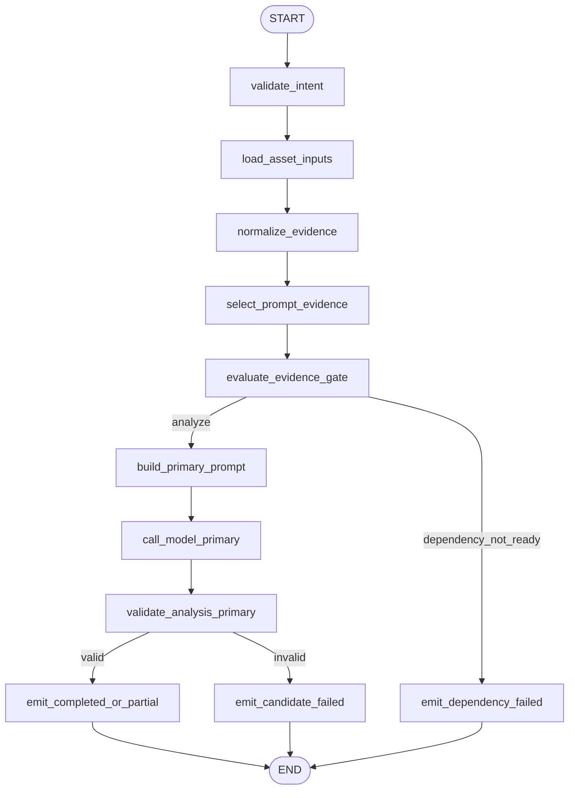
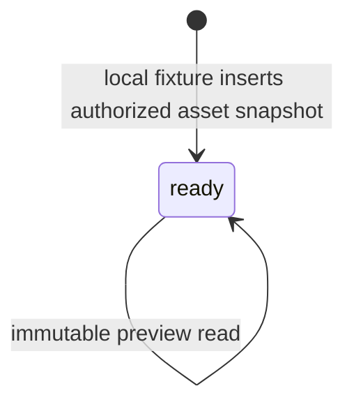
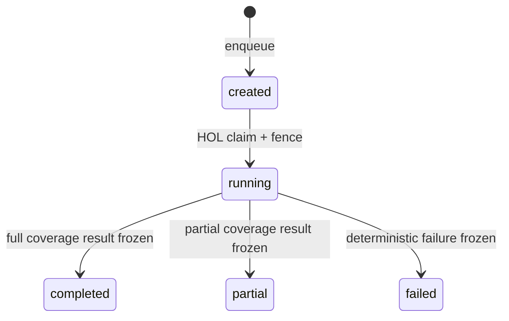

# `analyze_materials` Graph Tool 当前实现设计

> 状态：Current Implementation / local Development Preview 范围；完整生产范围仍为 Draft。当前验收结论只见[交付状态](../../../requirements/delivery-status.md)。
>
> 当前 Pin：`analyze_materials.v2preview1` / `analyze_materials_graph_v2_preview` / `analyze_materials.preview.intent.v1`。
>
> 当前代码：`agent/internal/graphtool/analyzematerials`、`agent/internal/analyzematerialsruntime`；当前迁移：`business/migrations/20260716000200_create_asset_analysis_preview.up.sql`、`agent/migrations/20260717001000_add_analyze_materials_runtime_v2preview1.up.sql`。

## 1. 功能边界

当前实现读取 Business 已持久化且完成 Owner 校验的 text/image Evidence，按确定性 Evidence Policy 计算覆盖度，再经一个 ChatModel Node 和独立 Validator 输出 `completed/partial/failed` 的素材分析 Preview。Runtime 已提供 Session Lane、Router/Graph Model Receipt、Tool Receipt、SSE、Card 和 Workspace V5 投影。

当前结果是非权威分析 Preview，不创建 Business MaterialAnalysis 资源，也不能作为生产下游 Resource Ref。当前不做上传、OCR、ASR、PDF、音频、视频抽取、真实模型 Provider、Correction、计费、Approval 或生产 Registry/Catalog。

## 2. 输入与输出

### 2.1 输入

`Intent` exact-set：

| 字段 | 当前约束 |
|---|---|
| `schema_version` | 固定 `analyze_materials.preview.intent.v1` |
| `asset_ids` | 1～8 个 UUIDv7，集合语义、拒绝重复 |
| `analysis_goal` | 1～1000 字符 |
| `focus_dimensions` | `content/visual/narrative/risk`，1～4 项 |
| `output_language` | `zh-CN/en-US` |
| `expected_assets` | 可选；`asset_id/asset_version` exact-set 必须等于目标集 |

可信 `user_id/project_id/session_id/input_id/turn_id/run_id/tool_call_id/fence_token` 和 Prompt/Validator/Evidence Policy Pin 只来自 Runtime。

Business `EvidenceSnapshot` 必须 `response_complete=true`，Asset exact-set 完整，最多 8 个 Asset、32 条 Evidence。当前媒体只允许 `text/image`；Evidence availability 为 `ready/missing/failed/redacted/unsupported`，只有合法 `ready` Evidence 正文进入 Prompt。

### 2.2 输出

- `completed`：所有目标 requirement 完整覆盖。
- `partial`：至少一个 Asset 可分析，但存在缺失或预算排除 requirement。
- `failed`：无可分析 Evidence、Snapshot/Intent/Prompt/模型/候选确定失败。

成功/部分 Result 包含 `analysis`、确定性 `coverage`、无正文 `evidence_refs` 和 `invocation_ref`；失败只含稳定码、安全摘要和不可重试标记。Result 不含 Business Resource Ref、价格或 Approval。

## 3. 当前 Graph 流程

Tool wrapper 负责把 Node 抛出的确定性错误映射为安全 failed Result；该错误边界不是 Graph Node。Graph 为 `AllPredecessor` 无环 DAG，无循环、并行、ToolsNode、Interrupt 或 Checkpoint。

## 4. 稳定 Node / Branch exact-set

Node exact-set（11）：

| Node Key | 当前职责 |
|---|---|
| `validate_intent` | strict Intent、可信上下文、规范集合与 digest |
| `load_asset_inputs` | 一次批量加载并复核 Owner/version/Asset exact-set |
| `normalize_evidence` | 校验 media/availability/locator/digest 并生成 requirement |
| `select_prompt_evidence` | 按稳定顺序选择完整 Evidence 单元，预算排除转 missing |
| `evaluate_evidence_gate` | 确定 `failed/partial/completed`，模型无权决定 |
| `build_primary_prompt` | 隔离系统规则、目标、Evidence 与 missing 数据块 |
| `call_model_primary` | 唯一 `AddChatModelNode` |
| `validate_analysis_primary` | strict Candidate、引用闭合与 exact complement 校验 |
| `emit_completed_or_partial` | 构造成功/部分 Result |
| `emit_dependency_failed` | 无可分析 Evidence 时失败，不调用模型 |
| `emit_candidate_failed` | 非法模型候选失败，不降级为 partial |

Branch exact-set（2）：

| Branch Key / 源 Node | 输出 exact-set |
|---|---|
| `route_evidence_gate` / `evaluate_evidence_gate` | `build_primary_prompt`, `emit_dependency_failed` |
| `route_candidate_validation` / `validate_analysis_primary` | `emit_completed_or_partial`, `emit_candidate_failed` |

未知路由值返回错误并失败关闭。

## 5. 强类型 Graph State 摘要

`State` 只属于一次 Graph 调用：

| 字段组 | 内容与不变量 |
|---|---|
| 身份/Intent | `TrustedContext`, `Intent`, `IntentDigest`；模型不可覆盖 |
| Business 快照 | `AssetSnapshot`；必须 response-complete 与 exact-set |
| Evidence | `ReadyEvidence`, `IncludedEvidence`, `MissingRequirements`, `Coverage`；均由确定性节点生成 |
| 模型 | `PromptMessages`, `PromptDigest`, `ModelMessage`；正文不写普通日志 |
| Validator | `Candidate`, `CandidateDigest`, `Failure`；候选引用必须闭合 |
| 输出 | `Result`；只允许 completed/partial/failed |

模型 Message 只接受纯 `assistant + content`；ToolCall、reasoning、Provider metadata 和多模态旁路字段均拒绝。

## 6. 业务状态机与迁移表

### 6.1 Business Evidence

当前 Business 只保存输入快照：Asset status 固定 `ready`；Evidence availability 可为 `ready/missing/failed/redacted/unsupported`。本 Tool 没有 MaterialAnalysis 领域写入和领域状态迁移。

### 6.2 Agent Preview 调用

| 聚合 / Owner | 当前迁移 | Guard / 幂等 | 失败处理 |
|---|---|---|---|
| Asset Snapshot / Business | 不存在 → `ready` | local fixture 明确写入；Owner + Project exact-set 读取 | 不存在/越权统一 `MATERIALS_NOT_AVAILABLE` |
| Evidence / Business | 不存在 → 五种 availability 之一 | Evidence ID、asset/version、locator、digest 不可变 | 冲突使整个 Snapshot 失败关闭 |
| Run / Agent | `created → running → completed/failed` | Session HOL + owner fence | 当前 local fake 模型确定失败可冻结 |
| ToolReceipt / Agent | `open → completed/partial/failed` | `tool_call_id` first-write-wins；request/result digest | 同键重放冻结 Result，不重跑 Graph |
| Projection / Agent | 无 → `completed/partial/failed` | 每 Input append-only；Result digest | SSE/投影重放不调用模型 |

## 7. Owner、幂等与 Unknown Outcome

- Business PostgreSQL 拥有授权 Asset/Evidence 快照；Agent 只读，不复制成领域资源。
- Agent PostgreSQL 拥有 Turn Context、Run、Router/Graph Model Receipt、Tool Receipt、Projection 和 Event。
- 当前 Graph 没有 Business 写命令，因此没有 Business Save Unknown Outcome；相同输入与冻结 Evidence 通过 Receipt first-write-wins 重放。
- 当前模型为 local deterministic route，Model Receipt 状态为 `reserved/completed/failed`；真实 Provider 的请求键、响应查询和 `model_unknown` 尚未实现，不能直接替换后宣称可生产恢复。
- Session Lane 仍使用 HOL、Lease/Fence；旧 Fence 无权冻结 Tool Result 或发布 Event。

## 8. 安全

- Business 按可信 User/Project 一次批量校验全部 Asset；任一越权项使整次调用失败，避免枚举。
- Prompt 只接收最小 Evidence 摘要；文件名、MIME、永久 URL、原始二进制、Secret 与权限规则不进入模型。
- Evidence 正文、完整 Prompt、Candidate 和 reasoning 不写普通日志、Trace、Card 或长期 Checkpoint。
- observation 必须有 Evidence；inference 与 risk 必须保留不确定性，不能冒充身份识别或法律结论。
- 当前 local-only Adapter 无生产 TLS/服务身份、摄取安全扫描与保留/删除策略。

## 9. 测试与验收入口

当前测试覆盖 Intent strict decode、Unicode/UUID/集合 digest、Snapshot exact-set、text/image locator、五种 availability、Evidence 选择/预算、零 Evidence 不调用模型、Coverage 决策、Candidate 引用闭合、Node/Branch exact-set、模型 Message 失败矩阵与跨调用 State 隔离。

关键门禁：

- `GOWORK=off go test ./internal/graphtool/analyzematerials`（在 `agent/`）；
- `make analyze-materials-runtime-smoke`：独立 local canonical Preview；
- `make trial-basic`：验收统一六工具浏览器主链中的分析 Receipt、Card、SSE 与刷新恢复。

## 10. 生产差距

生产 `analyze_materials.v1alpha1` 仍为 Draft，至少缺少：真实上传/病毒扫描/OCR/ASR/PDF/音视频 Evidence 管线，五媒体不可变 Evidence 契约，Business MaterialAnalysis 持久化与 Resource Ref，真实模型及 Provider Unknown Outcome，计费/Approval/取消，生产 Registry/Catalog，服务身份/TLS，数据保留与删除策略，以及完整故障注入和重启恢复 Evidence。
