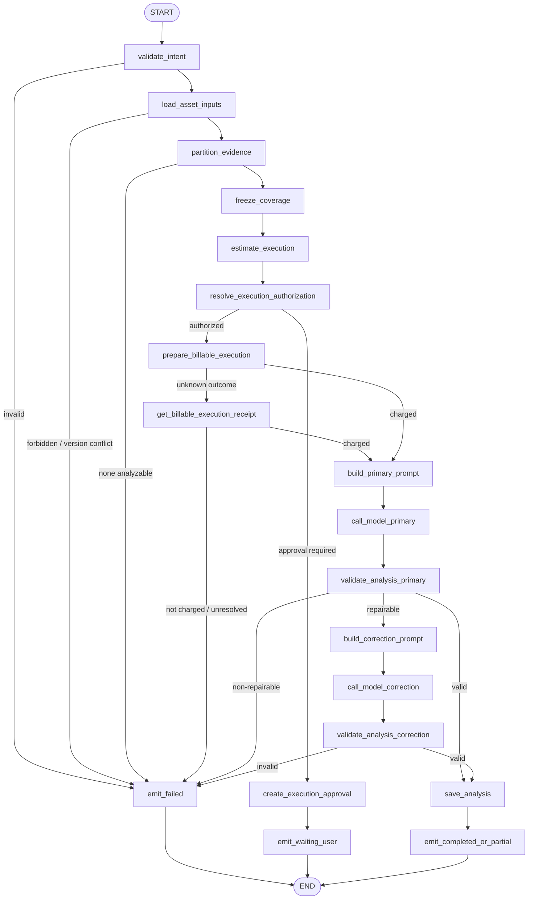
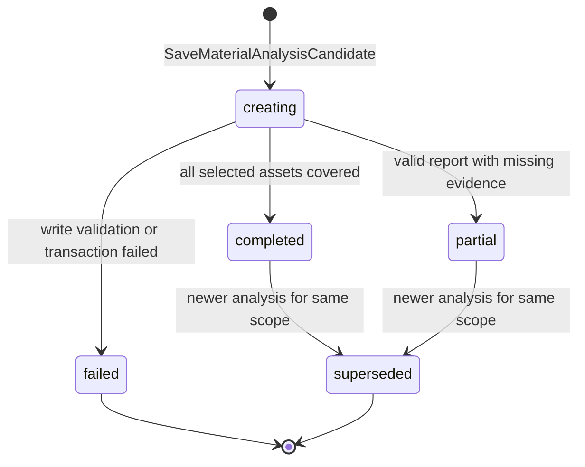

# `analyze_materials` Graph Tool 设计

> 状态：Draft / 待产品、Business、Agent、财务与安全评审
>
> Graph Key：`analyze_materials_graph_v1`
>
> Tool Definition Version：`analyze_materials.v1alpha1`
>
> Migration Owner：Business（Asset/MaterialAnalysis），Agent（Run/Receipt/Approval）
>
> 实现门禁：评审结论为“通过”前禁止创建生产代码。

共同契约见 [`../../cross-module/aigc-contract-catalog.md`](../../cross-module/aigc-contract-catalog.md)。本 Tool 只分析 Business 已持久化且用户有权访问的素材分析输入；v1 不在 Graph 内启动 OCR、ASR、视频抽帧或 Provider 长任务。

## 1. 场景、目标与边界

适用场景：用户选择项目素材或指定范围，要求生成结构化素材报告，为 Creation Spec、Storyboard 或 Prompt 提供可引用的证据。

目标：

- 同时支持文本、图片、音频、视频等素材的统一分析报告；
- 明确区分“素材证据”“模型观察”“推断”“缺失/不确定”；
- 对缺少预处理内容的素材返回 `partial`，不得臆测；
- 报告在 Business 中版本化，可被后续 Tool 通过 Resource Ref 引用；
- 模型调用前完成正式预算授权和扣费。

非目标：

- 不负责文件上传、病毒扫描、OCR、ASR、视频抽帧或转码；这些是素材接入流水线的前置能力；
- 不生成 Creation Spec、Storyboard、Prompt、媒体或导出任务；
- 不修改原 Asset、标签权威值或用户锁定内容；
- 不在 Graph 中等待 Worker，也不把模型生成的标签自动写成资产事实。

权威来源：Asset、持久化提取结果和 MaterialAnalysis 归 Business；Run、Charge/Model/Tool Receipt 与 Approval 归 Agent。

### 1.1 需求追踪

| 类型 | ID |
|---|---|
| Tool 主验收 | `GTL-ANALYZE-001` |
| 共通 Graph Tool | `GTL-USE-002`、`GTL-VER-001`、`GTL-IDEM-001`、`GTL-BILL-001`、`GTL-EARN-001`、`GTL-SEC-001` |
| 全功能冒烟 | `SMK-010`、`SMK-021`、`SMK-023`、`SMK-033`、`SMK-034` |

## 2. Intent、输入与结果

### 2.1 `AnalyzeMaterialsIntentV1`

| 字段 | 类型 | 规则 |
|---|---|---|
| `asset_ids` | UUID[] | 必填且非空；去重后按配置上限校验 |
| `analysis_goal` | string | 必填；描述希望回答的问题，不授予额外资源权限 |
| `focus_dimensions` | enum[] | 内容、人物、视觉、音频、叙事、品牌、风险等服务端枚举 |
| `output_language` | enum? | 仅允许已配置语言 |
| `expected_asset_versions` | map<UUID,int64>? | 前端显式分析时用于防止读到意外新版本 |
| `prior_analysis_id` | UUID? | 修订/增量分析；必须属于同项目 |

可信上下文沿用 `TrustedCommandContextV1`。模型不能增加 `asset_ids`，也不能改变项目范围。

### 2.2 Business 输入契约

`BIZ-AIGC-002 BatchGetAssetAnalysisInputs` 对每个素材返回：

- Asset ID/version、媒体类型、来源和允许展示的元数据；
- 已持久化的文本/OCR/ASR/视觉描述/镜头摘要引用；
- 每段证据的稳定 `evidence_id`、时间区间或页码、content digest；
- `ready/missing/failed/redacted/unsupported` 可用性及稳定原因码。

若全部素材都无可分析证据，返回 `DEPENDENCY_NOT_READY` 且不扣费。部分可用时继续执行，并把缺失清单冻结在报告中。

### 2.3 输出

- 全部选择素材均有足够证据：`GraphToolResultV1(status=completed)`；
- 至少一个素材缺失/不支持，但报告仍有效：`status=partial`；
- 预算授权缺失：`status=waiting_user`；
- 无证据、校验失败、权限失败或模型结果不可修复：`status=failed`。

结果引用 MaterialAnalysis ID/version/digest、覆盖素材集合 digest、Receipt 和稳定 warnings；模型只获得摘要引用，不获得完整报告回灌。

## 3. Typed Graph State

Graph State 类型为 `AnalyzeMaterialsStateV1`。

| State 字段 | Owner/来源 | 读节点 | 写节点 | 持久化/Checkpoint | 敏感性与不变量 |
|---|---|---|---|---|---|
| `trusted_context` | Agent | 全部 | 初始化器 | Run | 不可覆盖 |
| `intent` | Tool Schema | 校验、查询、Prompt | `validate_intent` | 输入 digest | Asset 集合固定 |
| `asset_inputs` | Business | 分区、Prompt、保存 | `load_asset_inputs` | Resource/evidence refs | 只能含授权证据 |
| `available_evidence` | Agent | Prompt/Validator | `partition_evidence` | digest | Evidence ID 唯一且可追溯 |
| `missing_evidence` | Agent | Result/保存 | `partition_evidence` | 报告元数据 | 不得由模型填补 |
| `coverage_digest` | Agent | 授权、扣费、保存 | `freeze_coverage` | Receipt | 覆盖目标不可在扣费后变化 |
| `execution_quote`、`authorization` | Agent/Business | 授权、扣费 | 估价/授权节点 | Receipt/Approval | 绑定 coverage digest |
| `execution_approval` | Agent | 待授权结果 | `create_execution_approval` | Agent 权威 | 绑定 coverage digest 和 Quote |
| `charge_receipt` | Business | 模型/恢复 | 扣费节点 | Business + Ref | 成功前禁止模型调用 |
| `prompt_input` | Agent | Model | Prompt Node | digest | 不包含无权访问原文 |
| `analysis_candidate` | ChatModel | Validator | Model Nodes | ModelReceipt/短期 Checkpoint | 仅候选 |
| `validation_report` | Agent | 分支/保存 | Validator Nodes | ToolReceipt | 引用必须属于 evidence set |
| `saved_analysis` | Business | Result | `save_analysis` | Business 权威 | version/digest/coverage 齐全 |
| `result`、`error` | Agent | END | Result/Error Nodes | ToolReceipt | 唯一终态 |

## 4. Graph 流程

Graph 为无环 DAG，使用 `AllPredecessor`。不包含 Worker、长期 Checkpoint、动态 Tool Search 或由模型控制的循环。

## 5. 稳定 Node 清单

| Node Key | 中文名称 | 业务分类 | Eino 实现 | 单一职责 | 输入/输出 | State 读写 | 副作用/风险 | Invoke/Stream | 预算/回执 | 错误码/失败目标 | Checkpoint |
|---|---|---|---|---|---|---|---|---|---|---|---|
| `validate_intent` | 校验分析意图 | Guard | Lambda | Schema、目标集合、枚举和版本格式校验 | Intent→规范化 Intent | R/W intent | 无 | Invoke | input digest | `INVALID_ARGUMENT` | 否 |
| `load_asset_inputs` | 加载素材分析输入 | Query | Lambda/RPC | 调 `BIZ-AIGC-002` 并校验权限/版本 | IDs→AssetInputs | W asset_inputs | 读取敏感素材摘要 | Invoke | RPC Receipt | `PERMISSION_DENIED/VERSION_CONFLICT` | 可，仅引用 |
| `partition_evidence` | 分区可用与缺失证据 | Compute | Lambda | 按权威可用性生成两个固定集合 | Inputs→Available/Missing | W available_evidence/missing_evidence | 不调用模型 | Invoke | partition digest | `DEPENDENCY_NOT_READY` | 否 |
| `freeze_coverage` | 冻结覆盖范围 | Compute | Lambda | 生成 asset/evidence/缺失集合 digest | Sets→Coverage | W coverage_digest | 后续不可扩展目标 | Invoke | coverage receipt | `INTERNAL` | 否 |
| `estimate_execution` | 估算模型执行 | Compute | Lambda | 依据证据规模和配置生成 Quote | Coverage→Quote | W execution_quote | 不扣费 | Invoke | Policy Ref | `BUDGET_POLICY_MISSING` | 否 |
| `resolve_execution_authorization` | 校验预算授权 | Guard | Branch | 验证冻结范围的授权 | Quote→Auth | W authorization | 不信任模型/Intent 授权 | Invoke | Approval Receipt | `APPROVAL_REQUIRED` | 否 |
| `create_execution_approval` | 创建执行审批 | Command | Lambda/Repository | 持久化 Approval 和 Card | Quote→Approval | W execution_approval | Agent DB 写入 | Invoke | Approval/Event Receipt | `INTERNAL` | 否 |
| `prepare_billable_execution` | 扣除分析费用 | Command | Lambda/RPC | 调 `BIZ-AIGC-003` | Auth/Digest→Charge | W charge_receipt | 扣费 | Invoke | Charge Receipt | `INSUFFICIENT_POINTS/UNKNOWN_OUTCOME` | 是，仅 Receipt |
| `get_billable_execution_receipt` | 查询扣费结果 | Query | Lambda/RPC | 调 `BIZ-AIGC-004` | Key→Charge | W charge_receipt | 无新扣费 | Invoke | Charge Receipt | `UNKNOWN_OUTCOME` | 否 |
| `build_primary_prompt` | 构造证据 Prompt | Prompt | ChatTemplate | 将证据和缺失清单映射到带 Evidence ID 的模板 | Evidence→Messages | W prompt_input | Prompt 注入/隐私 | Invoke | prompt key/version/digest | `PROMPT_RENDER_FAILED` | 否 |
| `call_model_primary` | 主素材分析 | Inference | ChatModel | 生成结构化报告候选 | Messages→Candidate | W analysis_candidate | 已计费模型调用 | Invoke | ModelReceipt/配置预算 | `MODEL_*` | 是，Receipt |
| `validate_analysis_primary` | 首次报告校验 | Validate | Lambda | Schema、Evidence 引用、事实/推断、覆盖校验 | Candidate→Report | W validation_report | 无 | Invoke | Validator Version | invalid→repair/failed | 否 |
| `build_correction_prompt` | 构造纠错 Prompt | Prompt | ChatTemplate | 仅提供错误码、合法 Evidence 集和候选摘要 | Report→Messages | W prompt_input | 不暴露内部栈 | Invoke | prompt key/version/digest | `PROMPT_RENDER_FAILED` | 否 |
| `call_model_correction` | 单次报告纠错 | Inference | ChatModel | 在原执行预算内纠错一次 | Messages→Candidate | W analysis_candidate | 不无限重试 | Invoke | ModelReceipt 子 Attempt | `MODEL_*` | 是，Receipt |
| `validate_analysis_correction` | 纠错报告校验 | Validate | Lambda | 复用确定性 Validator | Candidate→Report | W validation_report | 无 | Invoke | Validator Version | invalid→failed | 否 |
| `save_analysis` | 保存分析版本 | Command | Lambda/RPC | 调 `BIZ-AIGC-006` 原子保存报告和覆盖元数据 | Candidate→ResourceRef | W saved_analysis | Business 写入 | Invoke | Write Receipt | `VERSION_CONFLICT/UNKNOWN_OUTCOME` | 是，仅 Receipt |
| `emit_completed_or_partial` | 输出分析结果 | Result | Lambda | 根据缺失集合确定 completed/partial 并写 A2UI | State→Result | W result | EventLog 写入 | Invoke | ToolReceipt/Event ID | `INTERNAL` | 否 |
| `emit_waiting_user` | 输出待授权结果 | Result | Lambda | 返回 Approval Ref | Approval→Result | R execution_approval; W result | EventLog | Invoke | ToolReceipt | `INTERNAL` | 否 |
| `emit_failed` | 输出失败结果 | Error | Lambda | 归一化错误并 Finalize Charge Outcome | Error→Result | W result/error | 默认不退款 | Invoke | Failure Receipt | 稳定错误码 | 否 |

## 6. MaterialAnalysis 业务状态机

| Aggregate/Owner | 权威来源 | 原状态 | 触发事件 | 执行方 | Guard/动作 | 目标状态 | 终态/可重试 | 事务/幂等键 | Fence/版本/Outbox | 失败处理 |
|---|---|---|---|---|---|---|---|---|---|---|
| MaterialAnalysis/Business | Business DB | 不存在 | 保存候选 | Business | coverage digest、Evidence 引用和 Schema 均合法 | `creating` | 事务内过渡 | `tool_call_id + coverage_digest + candidate_digest` | resource version | 事务回滚 |
| MaterialAnalysis/Business | Business DB | `creating` | 全覆盖写入完成 | Business | missing set 为空 | `completed` | 可引用；不再修改 | 同一保存事务 | version + Outbox | 重放返回原版本 |
| MaterialAnalysis/Business | Business DB | `creating` | 部分覆盖写入完成 | Business | missing set 非空且 available set 非空 | `partial` | 可引用；带 warnings | 同一保存事务 | version + Outbox | 重放返回原版本 |
| MaterialAnalysis/Business | Business DB | `completed/partial` | 同范围新版本完成 | Business | scope identity 相同且版本更新 | `superseded` | 终态 | 新版本事务键 | CAS version + Outbox | 冲突保留旧版本 |

`creating` 不允许对外长期可见；保存事务结束时必须进入 `completed/partial` 或整体回滚。Graph 失败状态不是 MaterialAnalysis 的持久化 `failed`，除非 Business 已创建记录且写入过程中形成了明确失败回执。

## 7. ChatModel、Prompt、Schema 与预算

- Prompt Key：`graph_tool.analyze_materials.primary`、`graph_tool.analyze_materials.correction`。
- ChatModel 通过 Eino DeepSeek 兼容组件注入；所有模型参数来自 Runtime 配置。
- 报告 Schema 至少包含 `asset_summaries`、`cross_asset_findings`、`usable_elements`、`risks`、`open_questions`、`missing_inputs`；每个 observation 必须携带 Evidence ID，每个 inference 必须显式标记置信区间或不确定性。
- Validator 拒绝未知 Asset/Evidence 引用、将 missing 内容写成事实、越权引用、重复目标缺失、未区分 observation/inference 和不合法时间区间。
- 只允许一次显式纠错；总 Token、证据字符、图片摘要、耗时预算通过 Tool Budget 配置引用。超过上下文预算时确定性截断必须保留 Evidence 边界，并在 `warnings` 记录，禁止静默丢弃。
- 扣费后失败调用 `FinalizeBillableExecution`；恢复复用同一 Charge/Model Receipt。

## 8. 分支、Fan-in 与并行

- v1 串行读取一次批量 Business RPC，不为每个 Asset 创建模型并行分支，避免成本爆炸和不稳定 Fan-in。
- `completed/partial` 仅由确定性的 missing set 决定，不能由模型自行选择。
- 首次和纠错结果汇入同一个保存节点；只会保存一个版本。
- 未来若按媒体类型并行分析，必须新增独立设计版本、显式 Fan-in、每分支预算和重复 Evidence 去重；不在 v1 隐式扩展。

## 9. 幂等、事务与恢复

- Tool 幂等键固定为 `user_id + turn_id + tool_call_id`。
- Coverage digest 包含排序后的 Asset ID/version、Evidence ID/content digest、missing reason；扣费后不得改变。
- Charge、Model unknown outcome 按跨 Module 目录查询，不生成新键。
- 保存幂等键包含 Tool Call、Coverage 和 Candidate Digest；Business 写入报告、Evidence 映射、状态和 Outbox 为同一事务。
- Business 保存成功但 Agent ToolReceipt/A2UI 失败时，Recovery Scanner 按 Write Receipt 补发同一 Result/Event，不重新分析或扣费。
- 新 Asset 版本到达不会静默修改旧报告；用户需显式生成新 MaterialAnalysis 版本。

## 10. 风险、权限与隐私

- 所有 Asset 必须逐项校验 user/project；只返回模型所需的最小提取内容。
- 原始二进制、对象存储永久 URL、EXIF 中的敏感位置等不进入 Prompt，除非产品与安全策略明确允许。
- Prompt 中的素材文本视为不可信数据，用数据区隔离，不能让其中指令改变系统约束。
- 日志只记录 Asset/Evidence ID、版本、digest、数量、耗时和错误码；不记录完整 OCR/ASR/用户正文。
- 报告中的人物、品牌、版权和安全判断必须标记为模型观察/风险提示，不替代法律或人工审核。

## 11. 测试与验收

必须覆盖：

- 多媒体类型、重复 Asset、越权 Asset、版本冲突、全部缺失、部分缺失；
- Evidence ID/页码/时间区间有效性，未知引用和模型臆测拒绝；
- 扣费授权、余额不足、扣费超时查询、模型单次纠错与预算耗尽；
- `completed` 与 `partial` 只由确定性覆盖集合决定；
- 报告保存事务、幂等重放、写成功后 EventLog 失败恢复；
- Prompt 注入、敏感内容最小化和日志脱敏；
- Graph 编译、分支覆盖、唯一 END 和无 Worker/Provider 调用；
- 后续 `plan_creation_spec/plan_storyboard/write_prompts` 能按 Resource Ref 读取同一报告版本。

全功能冒烟至少覆盖：选择多类素材→生成报告→查看 Evidence/缺失项→后续规划引用，以及全部无可用证据的失败路径。

## 12. 评审结论

- [ ] 产品确认分析维度、Evidence 展示、partial 语义；
- [ ] Business 确认素材提取输入、报告表、版本和 Outbox；
- [ ] Agent 确认 Graph、Receipt、Approval 和 A2UI；
- [ ] 素材接入方确认 OCR/ASR/视觉摘要属于前置流水线；
- [ ] 财务确认分析模型扣费；
- [ ] 安全确认素材最小化、Prompt 注入防护和日志策略；
- [ ] 测试确认契约与 SMK-P0。

当前结论：**待评审，不通过实现门禁。**
