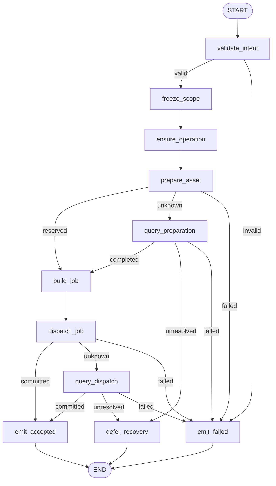
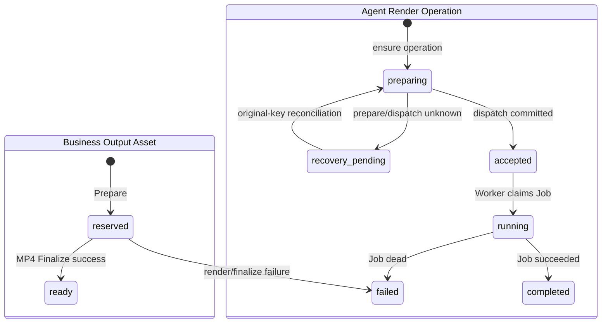

# `assemble_output` Graph Tool 当前实现设计

> 状态：Current Implementation / local Development Preview 范围；完整生产范围仍为 Draft。当前验收结论只见[交付状态](../../../requirements/delivery-status.md)。
>
> Development Preview 例外：`media.runtime.v3preview1` 只允许一个同项目 ready PNG 经固定白名单 ffmpeg 参数生成 `2s` H.264/`yuv420p`/`faststart` MP4；不授权任意 Timeline、任意 ffmpeg 参数、计费、Approval 或生产导出。
>
> 当前 Pin：`assemble_output.v3preview1` / `assemble_output_graph_v3preview1` / `assemble_output.intent.v3preview1` / `mp4_h264_640x360_2s.v1`。
>
> 当前代码：`agent/internal/mediapreview`、`worker/internal/mediajob`、`worker/internal/mediapreview`、`business/internal/mediapreview`；当前迁移：`agent/migrations/20260717001300_add_media_runtime_v3preview1.up.sql`、`business/migrations/20260717000500_create_media_preview_asset.up.sql`、`worker/migrations/20260717000100_create_media_preview_runtime_receipts.up.sql`。

## 1. 功能边界

当前实现读取一个 Business-owned、同项目、精确 version/digest 匹配的 ready PNG Asset，冻结固定 MP4 输出 Profile，创建或恢复一 Operation/Batch/Job，调用 Business Prepare 预留输出 Asset，原子派发 Job；Worker 用固定参数构造器调用 ffmpeg 生成真实 MP4，完成 Business Finalize 和 Agent Terminal 提交，最终通过受保护同源接口播放/下载。

原 Graph 在派发确认后返回 `accepted`，不等待渲染。当前没有 validate/plan/preview/export 四模式、AssemblyPlan、Timeline、ChatModel、任意转场/字幕/音轨、计费、Approval、复杂 Batch 或生产 Catalog；Preview MP4 不能冒充 final export。

## 2. 输入与输出

### 2.1 输入

`AssembleOutputIntent` exact-set：

| 字段 | 当前约束 |
|---|---|
| `schema_version` | 固定 `assemble_output.intent.v3preview1` |
| `source_asset_id` | Business Media Preview Asset UUIDv7 |
| `expected_source_version` | 当前精确版本 |
| `expected_source_content_digest` | ready PNG 小写 SHA-256 |
| `output_profile` | 固定 `mp4_h264_640x360_2s.v1` |

User/Project/Session/Input/Turn/Run/ToolCall/Idempotency/Fence/Deadline 只来自 `TrustedContext`。输入不接受 Timeline、路径、URL、shell、codec、滤镜或自定义 ffmpeg 参数。

### 2.2 输出

- Graph 受理：`accepted/MEDIA_PREVIEW_ACCEPTED`，返回 `operation_id/batch_id/asset_id/receipt_id`。
- 确定失败：`failed`，只返回白名单 `result_code/error_code`。
- Prepare/Dispatch 未确定：内部 `GraphOutcome.Recovery`，Operation 保持 `recovery_pending`，不冻结伪失败。
- Worker 成功后：Business Asset 变 `ready`，Terminal Outbox 驱动 Workspace completed Card；内容端点支持 `HEAD/GET/Range`。

## 3. 当前 Graph 流程

Graph 与 `generate_media` 复用相同 `AllPredecessor` 泛型无环拓扑，只替换 Source、Definition、Job Type 和 Profile。Graph 无 ChatModel、Prompt Node、ToolsNode、循环或跨分钟栈。

## 4. 稳定 Node / Branch exact-set

Node exact-set（11）：

`validate_intent`, `freeze_scope`, `ensure_operation`, `prepare_asset`, `query_preparation`, `build_job`, `dispatch_job`, `query_dispatch`, `defer_recovery`, `emit_accepted`, `emit_failed`。

| Branch Key / 源 Node | 输出 exact-set |
|---|---|
| `route_intent_validation` / `validate_intent` | `freeze_scope`, `emit_failed` |
| `route_prepare_outcome` / `prepare_asset` | `build_job`, `query_preparation`, `emit_failed` |
| `route_preparation_query` / `query_preparation` | `build_job`, `defer_recovery`, `emit_failed` |
| `route_dispatch_outcome` / `dispatch_job` | `emit_accepted`, `query_dispatch`, `emit_failed` |
| `route_dispatch_query` / `query_dispatch` | `emit_accepted`, `defer_recovery`, `emit_failed` |

未知值返回错误并失败关闭。

## 5. 强类型 Graph State 摘要

`AssembleOutputPreviewStateV1` 是 `mediaPreviewState[AssembleOutputIntent]` 的强类型别名：

| 字段组 | 内容与不变量 |
|---|---|
| 身份/Intent | `TrustedContext`, `Intent`；可信字段不可覆盖 |
| 范围 | `ScopeDigest`；覆盖 Tool/Definition、Owner 范围、ready PNG exact ref 与固定 Profile |
| Agent 聚合 | `Operation`；first-write-wins 预分配 Operation/Batch/Job/Outbox ID |
| Business 边界 | `PreparationRequest`, `Preparation`；源 Asset 与输出 Asset 必须再次校验 |
| 派发 | `JobSpec`, `DispatchReceipt`；Job Type 固定 `assemble_mp4` |
| 结束 | `Result`, `ErrorCode`；Recovery 使用独立联合 |

State/Job 不保存任意命令行、绝对路径、Secret、永久 URL 或媒体二进制。

## 6. 业务状态机与迁移表

### 6.1 Business Output Asset 与 Agent Operation

### 6.2 当前迁移表

| 聚合 / Owner | 当前迁移 | Guard / 幂等 | 失败处理 |
|---|---|---|---|
| Output Asset / Business | 不存在 → `reserved → ready/failed` | Prepare command、Operation、Asset 唯一；Source 必须 ready image；Finalize 绑定 job/fence/output digest | unknown 只查原命令 |
| Operation / Agent | 不存在 → `preparing → accepted → running → completed/failed` | `tool_call_id` 唯一；scope/profile/version CAS | unknown → `recovery_pending` |
| Batch / Agent | 不存在 → `accepted → running → completed/failed` | 一 Operation 一 Batch | 由唯一 Job barrier 收口 |
| Job / Agent | 不存在 → `pending → running/retry_wait/reconciling → succeeded/dead` | Job Type/Profile 固定；lease + 单调 Fence | stale Fence 不得绑定输出 Asset |
| Attempt / Worker | `claim_pending/claim_unknown → running → artifact_ready → completed/failed`，可经未知/对账/重试状态 | attempt/job/fence/artifact digest 与 Finalize command 唯一 | 先查临时产物、Business Finalize 和 Agent terminal receipt |

当前没有 AssemblyPlan 领域表或状态机；Source PNG 与 Output MP4 都使用 `business.media_preview_asset` 的 Preview 状态集。

## 7. Owner、幂等与 Unknown Outcome

- Business 拥有 Source/Output Asset、Prepare/Finalize Receipt 和受保护对象元数据。
- Agent 拥有 Operation/Batch/Job、Dispatch/Terminal Outbox 与 Workspace Event。
- Worker 拥有 Attempt、Artifact Receipt 和 Finalization Observation；不直写其他 Module 普通表。
- `EnsureOperation` 固定一 Operation/Batch/Job/Outbox 身份；重复请求不能重新分配输出 Asset 或 Job。
- Prepare unknown 只查原 `command_id/request_digest`；Dispatch unknown 只查原 `operation_id/scope_digest`。
- Worker 在执行前保存 Attempt/Artifact 请求身份；ffmpeg/Finalize/terminal 结果不确定时先按原回执核对，禁止盲目生成第二份 MP4。
- Fence 过期的 Worker 结果不能 Finalize Asset 或覆盖 Agent Job 终态。

## 8. 安全

- Business Prepare 重新校验 User/Project、Source Asset `ready`、media kind、MIME、version/digest 与固定 Profile。
- Worker 不执行用户提供的 shell。ffmpeg 使用固定可执行文件与白名单 argv，不经过 shell，不接收任意滤镜、路径或 codec。
- Source/Object key 必须是 Business 生成的相对路径；禁止绝对路径、反斜杠、`..` 和双斜杠。
- Job/Receipt/日志不保存对象根、绝对路径、用户 Prompt、Secret 或二进制。
- 内容读取通过 Business 同源授权端点，Owner/Project 校验后支持标准 Range；不暴露本地对象路径。
- 当前 local-only；生产渲染沙箱、资源配额、恶意媒体扫描、对象存储身份和供应链治理未完成。

## 9. 测试与验收入口

当前测试覆盖共享 Graph exact-set、Intent strict decode、scope digest、Source ready/version/digest、Prepare/Dispatch Unknown Query、Operation/Job first-write-wins、Claim/Lease/Fence、固定 ffmpeg argv、真实 MP4 产物、Finalize/Terminal 重放、迁移约束和安全路径校验。

`make trial-basic` 的固定验收范围包括：Worker 从 ready PNG 生成真实 `2s`、`640x360`、H.264、`yuv420p`、`faststart` MP4；浏览器 `<video>` 可读取；同源内容接口返回 `200`、合法 Range `206`、非法 Range `416`；Workspace V5 和硬刷新恢复。

## 10. 生产差距

生产 `assemble_output.v1alpha1` 仍为 Draft，至少缺少：validate/plan/preview/export 四模式，正式 AssemblyPlan/Timeline/Track/Clip/Diff/锁，任意受控字幕/音轨/转场，计划模型与 Validator，preview/final Asset 区分，Quote/计费/收入/冲正，多 Scope Approval/Continuation，取消、复杂 Batch/部分失败，生产渲染沙箱与对象存储，资源限额/告警，生产 Registry/Catalog，以及完整故障注入和服务/数据库重启恢复证据。
