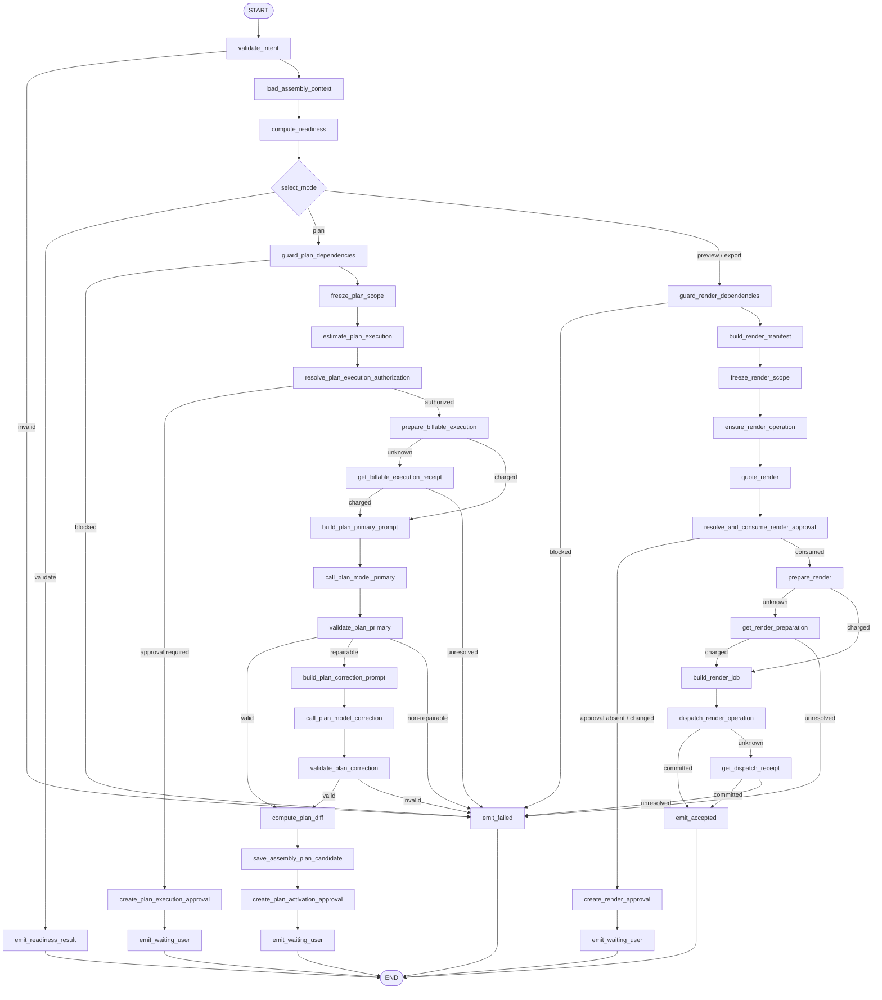
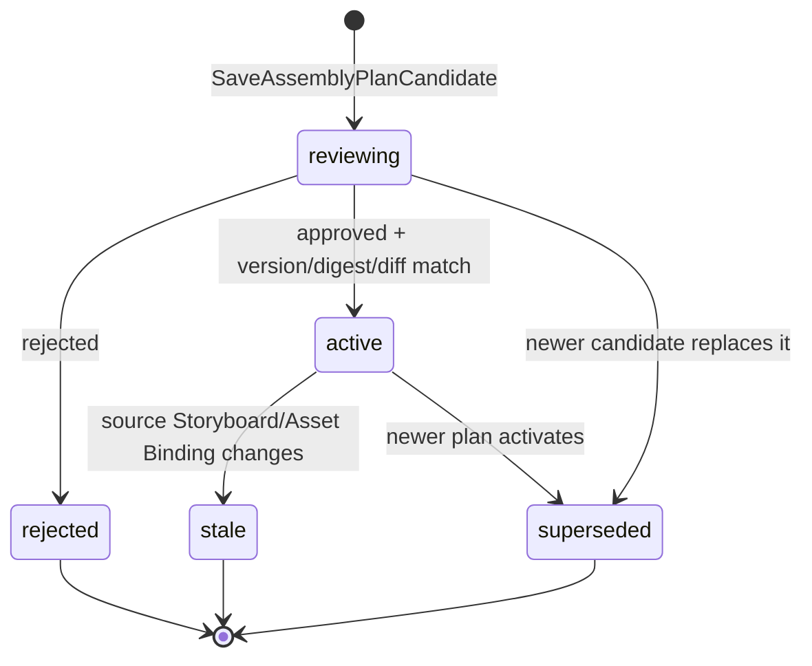
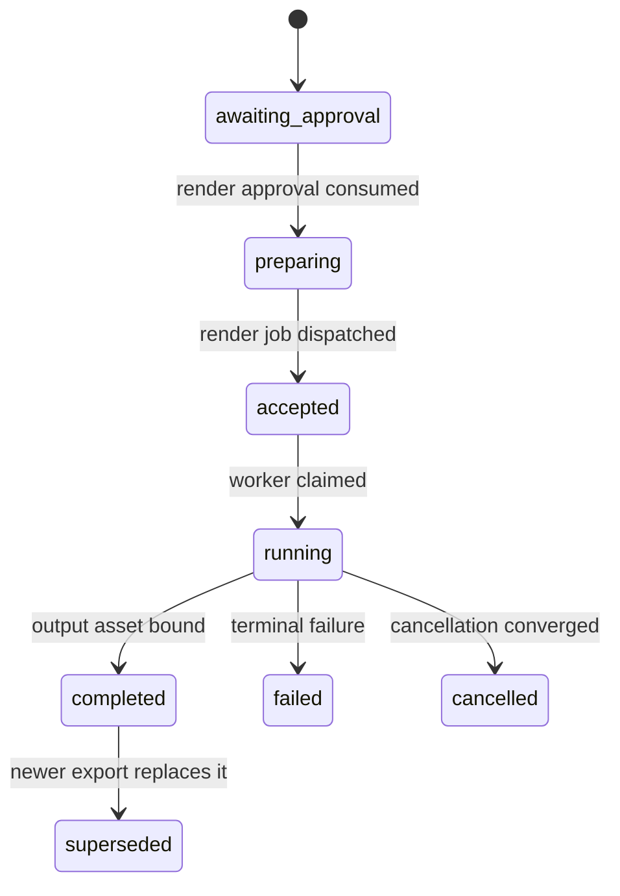

# `assemble_output` Graph Tool 设计

> 状态：Draft / 待产品、Business、Agent、Worker、财务、安全与运维评审
>
> Development Preview 例外：[`media.runtime.v3preview1`](../media-runtime-v3-preview-design.md) 已获 **Approved for Development Preview**，只允许复用同项目 ready Preview PNG，经共享 Operation/Batch/Job/Terminal Outbox 和固定白名单 `ffmpeg` argv 生成 `2s` H.264/`yuv420p`/`faststart` 真 MP4，再由 Business 同源 Range 下载/播放。它不允许任意 Timeline/ffmpeg 参数、模型规划、计费、Approval、TOS、真实 Provider、复杂 Batch 或生产导出；本文第 1～12 节完整生产范围继续 Draft。
>
> Graph Key：`assemble_output_graph_v1`
>
> Tool Definition Version：`assemble_output.v1alpha1`
>
> Migration Owner：Business（AssemblyPlan/Output Asset/Binding/Charge），Agent（Run/Receipt/Approval/Operation/Job），Worker（Render Attempt/Receipt）
>
> 实现门禁：评审结论为“通过”前禁止创建生产代码、Migration 或渲染 Worker；上面的 local-only Preview exact-set 可按独立设计创建隔离的 Preview 代码、向前 Migration 与版本化 Consumer，不得复用其结论宣称生产能力。

共同契约见 [`../../cross-module/aigc-contract-catalog.md`](../../cross-module/aigc-contract-catalog.md)。本设计禁止“只生成 manifest 就冒充导出成功”：`preview/export` 必须创建真实渲染 Job，由 Worker 生成可播放/可下载的 Output Asset。

## 1. 场景、模式、目标与边界

支持四种互斥模式：

- `validate`：确定性检查资源、依赖、时长、格式、版权/安全标记和导出就绪度，不扣模型/渲染费用；
- `plan`：基于激活 Storyboard、ready Assets 和用户意图生成可编辑 AssemblyPlan 候选；
- `preview`：对已激活 AssemblyPlan 做低规格真实渲染；
- `export`：对已激活 AssemblyPlan 做最终规格真实渲染。

目标：

- 将 Timeline、轨道、片段、转场、字幕、音频、裁切和输出规格持久化为版本化 AssemblyPlan；
- readiness 报告明确缺失、冲突、过期绑定和可降级项；
- plan 模式先授权/扣费再调用模型，候选经确定性 Timeline Validator 后进入正式审核；
- preview/export 冻结 Plan/Asset/Output Spec/Quote，正式审批、扣费、预留 Output Asset 后原子派发；
- Worker 使用冻结 Render Manifest 执行真实渲染并走统一 Finalize/终态事件。

非目标：

- 不生成素材、Prompt 或 Storyboard；
- 不允许模型直接执行 ffmpeg、访问对象存储 Secret 或决定价格；
- 不在 Graph 中等待渲染完成；
- 不把前端本地预览、manifest 文件或 Job accepted 当成最终导出成功。

### 1.1 需求追踪

| 类型 | ID |
|---|---|
| Tool 主验收 | `GTL-EDIT-001`、`GTL-EDIT-002` |
| 异步与共通 | `GTL-ASYNC-001`、`GTL-CANCEL-001`、`GTL-USE-002`、`GTL-VER-001`、`GTL-IDEM-001`、`GTL-BILL-001`、`GTL-EARN-001`、`GTL-SEC-001` |
| 全功能冒烟 | `SMK-015`、`SMK-016`、`SMK-018`、`SMK-019`、`SMK-020`、`SMK-021`、`SMK-022`、`SMK-023`、`SMK-033`、`SMK-034` |

## 2. Intent、输入与结果

### 2.1 `AssembleOutputIntentV1`

| 字段 | 类型 | 规则 |
|---|---|---|
| `mode` | `validate/plan/preview/export` | 必填 |
| `storyboard_revision_id` | UUID? | validate/plan 可指定；必须 active |
| `assembly_plan_id` | UUID? | 修订、preview、export 必填；preview/export 必须 active |
| `expected_plan_version` | int64? | 修订/渲染时必填 |
| `instruction` | string? | plan 新建/修订时必填；不承载权限 |
| `selected_asset_ids` | UUID[]? | plan 可选；服务端仍按 Binding/权限/版本验证 |
| `output_spec` | object? | preview/export 必填；格式、尺寸、码率等服务端 Schema |
| `preserve_track_ids` | UUID[]? | plan 修订提示；锁定仍由服务端决定 |

用户、项目、Run、Approval 和 Budget Authorization 来自可信上下文。preview/export 的 Approval Continuation 必须绑定 Plan version/digest、Asset set digest、Render Manifest digest、Quote 和输出规格。

### 2.2 Readiness 与 Render Manifest

`compute_readiness` 只根据 Business 权威资源生成：

- ready/missing/failed/stale/superseded Asset Binding；
- Storyboard/Prompt/AssemblyPlan 版本关系；
- Timeline 引用、时长、格式、轨道冲突和必需音视频输入；
- 可降级项与禁止继续项。

Render Manifest 由 Agent 确定性节点从已激活 AssemblyPlan 及权威资源生成，包含稳定资源引用/digest、轨道参数、输出规格和 Worker Policy Ref。模型不能直接输出可执行命令行。

### 2.3 输出

- validate：`completed` 或 `partial` + Readiness Resource/Card；
- plan 缺预算授权：`waiting_user` + billable execution Approval；
- plan 候选保存：`waiting_user` + AssemblyPlan activation Approval；
- preview/export 缺 Render Approval：`waiting_user` + Quote/Readiness/Approval；
- preview/export 派发成功：`accepted` + Operation/Batch/Output Asset 占位；
- 硬依赖缺失、版本冲突、余额不足、模型/准备/派发失败：`failed`。

真实 Output Asset 只有 Worker Finalize 成功后才进入 ready/bound；终态通过新 Continuation Turn/A2UI 返回。

## 3. Typed Graph State

Graph State 类型为 `AssembleOutputStateV1`。

| State 字段 | Owner/来源 | 读节点 | 写节点 | 持久化/Checkpoint | 敏感性与不变量 |
|---|---|---|---|---|---|
| `trusted_context` | Agent | 全部 | 初始化器 | Run | 不可覆盖 |
| `intent` | Tool Schema | 校验、分支、上下文 | `validate_intent` | input digest | 模式互斥 |
| `assembly_context` | Business | readiness、Prompt、Manifest | `load_assembly_context` | Resource refs/digests | 同一项目授权快照 |
| `readiness_report` | Agent | 所有模式/Result | `compute_readiness` | Tool/Plan/Operation Receipt | 硬阻塞和可降级项确定性 |
| `selected_mode` | Agent | 模式分支 | `select_mode` | ToolReceipt | 只能等于已校验 Intent mode |
| `plan_scope_digest` | Agent | plan 授权/扣费/保存 | `freeze_plan_scope` | Receipt | 包含基线、锁、Asset 版本 |
| `execution_quote`、`execution_authorization` | Agent/Business | plan 扣费 | plan 估价/授权节点 | Approval/Receipt | 绑定 plan scope |
| `execution_approval` | Agent | plan 待授权结果 | `create_plan_execution_approval` | Agent 权威 | 仅覆盖 plan 模型执行 |
| `charge_receipt` | Business | plan Model/恢复 | 扣费节点 | Business + Ref | 成功前禁止模型调用 |
| `prompt_input`、`plan_candidate` | Agent/ChatModel | Model/Validator | Prompt/Model Nodes | ModelReceipt/短期 Checkpoint | Candidate 非业务事实 |
| `validation_report` | Agent | 分支/保存 | Timeline Validators | ToolReceipt | 禁止执行型命令和无效资源引用 |
| `plan_diff` | Agent | 保存/审批/Result | `compute_plan_diff` | Business Candidate/Agent Receipt | 绑定基线版本；锁定 Track 变化必须为空 |
| `saved_plan`、`plan_approval` | Business/Agent | Result | 保存/审批节点 | 各自权威 DB | version/digest/Diff 绑定 |
| `render_scope_digest`、`render_manifest` | Agent | Quote/Approval/Prepare/Job | 冻结/Manifest 节点 | Operation/Dispatch Receipt | 渲染后不可变；不含 Secret |
| `operation`、`render_quote` | Agent/Business | Approval/Prepare | Operation/Quote 节点 | 权威 DB | mode+scope 唯一 |
| `render_approval` | Agent | 渲染待审批结果 | `create_render_approval` | Agent 权威 | 绑定 Plan/Manifest/Quote/金额/规格 |
| `approval_consumption` | Agent | Prepare | `resolve_and_consume_render_approval` | Agent Approval | 正式一次性 CAS |
| `preparation_receipt`、`dispatch_receipt` | Business/Agent | Job/Result/恢复 | Prepare/Dispatch 节点 | 权威 DB | Charge/Output Asset/Job 完整 |
| `render_job_spec` | Agent | Dispatch | `build_render_job` | Dispatch Receipt | Job ID、Manifest、Asset 和幂等键必须稳定 |
| `result`、`error` | Agent | END | Result/Error Nodes | ToolReceipt | 唯一终态 |

## 4. Graph 流程

Graph 为 `AllPredecessor` 无环 DAG。只有 `plan` 分支使用 ChatModel；validate/preview/export 全部确定性执行。渲染终态不恢复原 Graph。

## 5. 稳定 Node 清单

| Node Key | 中文名称 | 业务分类 | Eino 实现 | 单一职责 | 输入/输出 | State 读写 | 副作用/风险 | Invoke/Stream | 预算/回执 | 错误码/失败目标 | Checkpoint |
|---|---|---|---|---|---|---|---|---|---|---|---|
| `validate_intent` | 校验装配意图 | Guard | Lambda | 模式、Schema、版本、规格和互斥字段 | Intent→规范化 Intent | R/W intent | 无 | Invoke | input digest | `INVALID_ARGUMENT` | 否 |
| `load_assembly_context` | 加载装配上下文 | Query | Lambda/RPC | 读取 Storyboard、Plan、Asset、Binding、锁和版本 | Refs→Context | W assembly_context | Business 敏感读取 | Invoke | RPC Receipt | `PERMISSION_DENIED/VERSION_CONFLICT` | 可，仅引用 |
| `compute_readiness` | 计算装配就绪度 | Validate | Lambda | 确定性输出硬阻塞/可降级/缺失/过期项 | Context→Readiness | W readiness_report | 不调用模型 | Invoke | Readiness Validator Version | `DEPENDENCY_NOT_READY` | 否 |
| `select_mode` | 选择装配模式 | Branch | Branch | 按已校验 Intent 进入 validate/plan/preview/export | Intent→mode | W selected_mode | 模型不能决定 | Invoke | Branch Receipt | `INVALID_ARGUMENT` | 否 |
| `emit_readiness_result` | 输出就绪报告 | Result | Lambda | 写 completed/partial ToolResult/A2UI | Report→Result | W result | EventLog | Invoke | ToolReceipt/Event ID | `INTERNAL` | 否 |
| `guard_plan_dependencies` | 校验计划依赖 | Guard | Lambda | 确认可用于规划的最小资源与锁 | Readiness→Guard | W error | 无 | Invoke | Guard Version | `DEPENDENCY_NOT_READY/LOCK_CONFLICT` | 否 |
| `freeze_plan_scope` | 冻结计划范围 | Compute | Lambda | 摘要 Storyboard、Asset、基线 Plan、锁和 instruction | Context→Scope | W plan_scope_digest | 扣费后不可变 | Invoke | Scope Receipt | `INTERNAL` | 否 |
| `estimate_plan_execution` | 估算计划模型执行 | Compute | Lambda | 按时间线规模和配置生成 Quote | Scope→Quote | W execution_quote | 不扣费 | Invoke | Policy Ref | `BUDGET_POLICY_MISSING` | 否 |
| `resolve_plan_execution_authorization` | 校验计划预算授权 | Guard | Branch | 验证 plan scope 的正式授权 | Quote→Auth | W execution_authorization | 不信任模型授权 | Invoke | Approval Receipt | `APPROVAL_REQUIRED` | 否 |
| `create_plan_execution_approval` | 创建计划执行审批 | Command | Lambda/Repository | 保存 billable execution Approval | Quote→Approval | W execution_approval | Agent DB/EventLog | Invoke | Approval Receipt | `INTERNAL` | 否 |
| `prepare_billable_execution` | 扣除计划模型费用 | Command | Lambda/RPC | 调 `BIZ-AIGC-003` | Auth→Charge | W charge_receipt | 扣费 | Invoke | Charge Receipt | `INSUFFICIENT_POINTS/UNKNOWN_OUTCOME` | 是，仅 Receipt |
| `get_billable_execution_receipt` | 查询模型扣费 | Query | Lambda/RPC | 调 `BIZ-AIGC-004` | Key→Charge | W charge_receipt | 无新扣费 | Invoke | Charge Receipt | `UNKNOWN_OUTCOME` | 否 |
| `build_plan_primary_prompt` | 构造装配计划 Prompt | Prompt | ChatTemplate | 传入抽象时间线数据和约束，不生成命令行 | Context→Messages | W prompt_input | Prompt 注入 | Invoke | prompt key/version/digest | `PROMPT_RENDER_FAILED` | 否 |
| `call_plan_model_primary` | 主装配规划 | Inference | ChatModel | 生成结构化 Timeline 候选 | Messages→Candidate | W plan_candidate | 已计费模型调用 | Invoke | ModelReceipt/配置预算 | `MODEL_*` | 是，Receipt |
| `validate_plan_primary` | 首次 Timeline 校验 | Validate | Lambda | Schema、引用、时长、轨道、规格、锁和安全校验 | Candidate→Report | W validation_report | 无 | Invoke | Validator Version | invalid→repair/failed | 否 |
| `build_plan_correction_prompt` | 构造计划纠错 Prompt | Prompt | ChatTemplate | 只带稳定错误码和候选摘要 | Report→Messages | W prompt_input | 不泄漏内部实现 | Invoke | prompt key/version/digest | `PROMPT_RENDER_FAILED` | 否 |
| `call_plan_model_correction` | 单次计划纠错 | Inference | ChatModel | 原预算内纠错一次 | Messages→Candidate | W plan_candidate | 禁止无限重试 | Invoke | ModelReceipt 子 Attempt | `MODEL_*` | 是，Receipt |
| `validate_plan_correction` | 纠错 Timeline 校验 | Validate | Lambda | 复用确定性 Validator | Candidate→Report | W validation_report | 无 | Invoke | Validator Version | invalid→failed | 否 |
| `compute_plan_diff` | 计算计划差异 | Compute | Lambda | 对基线 Plan 生成 Diff 并保护锁定 Track | Candidate→Diff | W plan_diff | 无外部写入 | Invoke | Diff digest | `LOCK_CONFLICT` | 否 |
| `save_assembly_plan_candidate` | 保存装配计划候选 | Command | Lambda/RPC | 调 `BIZ-AIGC-013` 保存 Plan/Track/Clip/Diff | Candidate→ResourceRef | W saved_plan | Business 多表事务 | Invoke | Write Receipt | `VERSION_CONFLICT/UNKNOWN_OUTCOME` | 是，仅 Receipt |
| `create_plan_activation_approval` | 创建计划激活审批 | Command | Lambda/Repository | 绑定 Plan version/digest/Diff | ResourceRef→Approval | W plan_approval | Agent DB/EventLog | Invoke | Approval Receipt | `INTERNAL` | 否 |
| `guard_render_dependencies` | 校验渲染依赖 | Guard | Lambda | 要求 active Plan、所有硬依赖 ready、版本一致 | Readiness→Guard | W error | 无 | Invoke | Guard Version | `DEPENDENCY_NOT_READY/VERSION_CONFLICT` | 否 |
| `build_render_manifest` | 构造渲染清单 | Compute | Lambda | 将 Plan 转为版本化、无 Secret 的 Worker 输入 | Context→Manifest | W render_manifest | 不生成 shell 命令 | Invoke | Manifest key/version/digest | `MANIFEST_INVALID` | 是，digest |
| `freeze_render_scope` | 冻结渲染范围 | Compute | Lambda | 摘要 Plan、Assets、Manifest、mode 和 output spec | Manifest→Scope | W render_scope_digest | 扣费后不可变 | Invoke | Scope Receipt | `INTERNAL` | 否 |
| `ensure_render_operation` | 创建或恢复渲染 Operation | Command | Lambda/Repository | 按 scope 创建 `awaiting_approval` Operation | Scope→Operation | W operation | Agent DB 写入 | Invoke | Operation Receipt | `VERSION_CONFLICT` | 是，仅 Receipt |
| `quote_render` | 获取真实渲染报价 | Query | Lambda/RPC | 调 `BIZ-AIGC-015` 获取 preview/export Quote | Scope→Quote | W render_quote | 价格敏感 | Invoke | Quote Receipt | `UNSUPPORTED_OUTPUT_SPEC` | 否 |
| `resolve_and_consume_render_approval` | 校验并消费渲染审批 | Guard/Command | Branch/Repository | 绑定 Plan/Manifest/Quote/金额执行一次性 CAS | Approval→Consumption | W approval_consumption | 最终导出高风险 | Invoke | Approval Consumption Receipt | `APPROVAL_REQUIRED/INVALID` | 否 |
| `create_render_approval` | 创建渲染审批 | Command | Lambda/Repository | 保存 Quote、readiness、output spec 和不可退款提示 | State→Approval | W render_approval | Agent DB/EventLog | Invoke | Approval/Event Receipt | `INTERNAL` | 否 |
| `prepare_render` | 扣费并预留输出资产 | Command | Lambda/RPC | 以 render job type 调 `BIZ-AIGC-016` | Scope/Auth→Preparation | W preparation_receipt | 扣费/Output Asset/Token | Invoke | Preparation Receipt | `INSUFFICIENT_POINTS/UNKNOWN_OUTCOME` | 是，仅 Receipt |
| `get_render_preparation` | 查询渲染准备 | Query | Lambda/RPC | 调 `BIZ-AIGC-017` | Operation→Preparation | W preparation_receipt | 无新扣费 | Invoke | Preparation Receipt | `UNKNOWN_OUTCOME` | 否 |
| `build_render_job` | 构建真实渲染 Job | Compute | Lambda | 生成稳定 Job ID、Manifest Ref 和幂等键 | Preparation→JobSpec | W render_job_spec | Binding Token 受限 | Invoke | Job Spec digest | `PREPARATION_MISMATCH` | 是，映射 Receipt |
| `dispatch_render_operation` | 原子派发渲染 | Command | Lambda/Repository | 写 Operation/Batch/Job/Dispatch Outbox | Job→Dispatch | W dispatch_receipt | Agent 多表事务 | Invoke | Dispatch Receipt | `VERSION_CONFLICT/UNKNOWN_OUTCOME` | 是，仅 Receipt |
| `get_dispatch_receipt` | 查询渲染派发 | Query | Lambda/Repository | 查询相同 Operation 是否提交 | Operation→Dispatch | W dispatch_receipt | 无新 Job | Invoke | Dispatch Receipt | `UNKNOWN_OUTCOME` | 否 |
| `emit_waiting_user` | 输出待审批 | Result | Lambda | 按分支返回模型/计划/渲染 Approval Card | State→Result | R execution_approval/plan_approval/render_approval; W result | EventLog | Invoke | ToolReceipt/Event ID | `INTERNAL` | 否 |
| `emit_accepted` | 输出渲染受理 | Result | Lambda | 返回 Operation/Output Asset 占位 | Dispatch→Result | W result | EventLog | Invoke | ToolReceipt/Event ID | `INTERNAL` | 否 |
| `emit_failed` | 输出失败/未知结果 | Error | Lambda | 归一化错误并登记 Recovery 条件 | Error→Result | W result/error | 不自动退款/重派 | Invoke | Failure/Recovery Receipt | 稳定错误码 | 否 |

## 6. 业务与执行状态机

### 6.1 AssemblyPlan

### 6.2 Output Asset / Render Operation

| Aggregate/Owner | 权威来源 | 原状态 | 触发事件 | 执行方 | Guard/动作 | 目标状态 | 终态/可重试 | 事务/幂等键 | Fence/版本/Outbox | 失败处理 |
|---|---|---|---|---|---|---|---|---|---|---|
| AssemblyPlan/Business | Business DB | 不存在 | 保存候选 | Business | Timeline、资源、基线、锁、Diff 合法 | `reviewing` | 非终态 | `tool_call_id + plan_digest` | plan version + Outbox | 多表事务回滚 |
| AssemblyPlan/Business | Business DB | `reviewing` | Approval 决策 | Agent Continuation→Business | Approval 绑定 version/digest/Diff | `active/rejected` | active 可渲染；rejected 终态 | `approval_id + decision_version` | CAS + Outbox | 冲突拒绝并刷新 |
| AssemblyPlan/Business | Business DB | `active` | 上游资源变化 | Business | source digest 不再匹配 | `stale` | 不可新渲染 | event_id | CAS + Outbox | 保留历史 |
| RenderOperation/Agent | Agent DB | 不存在 | 冻结 render scope | Agent Graph | mode/Plan/Manifest/Quote 唯一 | `awaiting_approval` | 非终态 | `turn_id + tool_call_id` | operation version | 重放复用 |
| OutputAssetBinding/Business | Business DB | 不存在 | Prepare render | Business | Approval Consumption、Quote、余额、scope 合法 | `reserved` | 可恢复 | `operation_id + render_scope_digest` | Asset version/Token | unknown 查询 |
| RenderOperation/Job/Agent | Agent DB | `preparing` | Dispatch render | Agent Graph | Preparation Receipt 与 Manifest 匹配 | `accepted/pending` | Worker 可 Claim | operation + preparation receipt | 同事务 Dispatch Outbox | Recovery 补派发 |
| RenderAttempt/Worker | Worker DB | 不存在/可重试 | Claim/start/render/upload | Worker | 当前 Fence、取消检查、Manifest Schema 支持 | `claimed/rendering/uploading/finalizing` | 按策略重试 | job + attempt + fence | Worker Receipts | Provider/ffmpeg unknown 先查 Receipt |
| OutputAssetBinding/Business | Business DB | `reserved` | Finalize render | Worker | Token/Fence/output digest/格式校验 | `bound/failed/cancelled/superseded` | 终态 | job + fence + output digest | Finalization Receipt + Outbox | stale 隔离；unknown 查询 |
| RenderOperation/Agent | Agent DB | `running` | Job terminal/barrier | Worker via `AGT-JOB-V1` | 当前 Fence 和 Finalization Receipt | `completed/failed/cancelled` | 终态 | job + fence + terminal status | 同事务 Terminal Outbox | 重放返回原结果 |

preview 和 export 产生不同 Output Asset 类型和 Binding，不允许用 preview 文件冒充 final export。

## 7. ChatModel、Prompt、Schema 与预算

- 仅 plan 分支使用 Prompt：`graph_tool.assemble_output.plan.primary`、`graph_tool.assemble_output.plan.correction`。
- ChatModel 通过 Eino DeepSeek 兼容组件注入；模型参数来自 Runtime 配置。
- 模型只输出抽象 Timeline：Track、Clip、资源 local ref、in/out、转场、字幕/音量/裁切意图和验收提示；不输出 shell、ffmpeg 参数串、URL、Secret、价格、Job ID。
- Validator 校验所有资源引用、时间区间、轨道冲突、总时长、锁、输出能力和 Schema；服务端再生成 Render Manifest。
- 只允许一次显式纠错；Track/Clip 数、Token、上下文和耗时由 Tool Budget 控制。
- validate 分支不扣费；plan 模型费用和 preview/export 渲染费用是不同 Charge/Approval Scope。

## 8. 分支、并行与异步边界

- 四种模式在 readiness 后分支；只有 plan 进入 ChatModel，只有 preview/export 进入 Worker。
- plan 首次/纠错结果汇入一次保存；无模型循环。
- preview/export 共用 Render Manifest、Approval、Preparation、Job Contract，但 Quote、输出规格和 Asset 类型不同。
- Worker 可以并行处理不同 Operation；单个 Render Job 内部并行策略由 Worker 配置，不能改变 Job/Plan digest。
- Render Job 终态通过 Agent Barrier/Terminal Outbox，不恢复旧 Graph。

## 9. 幂等、事务、Fence 与恢复

- Plan Scope、Render Scope、Manifest、Charge、Operation、Job 和 Output Digest 各自版本化并可审计。
- Plan 保存为 Business 多表事务；保存成功后 Agent Approval 失败由 Recovery Scanner 补建。
- Prepare render 成功但 Dispatch 失败时，使用原 Operation/Preparation/Job ID 补派发，不重新扣费。
- Render Worker 调外部程序/服务前落 Request Receipt；进程结果未知时先检查输出临时对象和 Attempt 状态，不能盲目生成第二份 final asset。
- Fence 过期结果进入 superseded/orphaned，不能绑定 Output Asset。
- Agent Job 终态与 Terminal Outbox 同事务，SSE/EventLog 按 Event ID 幂等。

## 10. 风险、HITL、权限与隐私

- Plan 模型执行、Plan 激活、preview 渲染、final export 分别使用独立正式 Approval；任何摘要变化使 Approval 失效。
- final export Card 必须展示 Plan 版本、输出规格、资产就绪度、Quote、余额影响、风险和不可退款规则。
- Render Manifest 不含永久 URL/Secret；Worker 在执行时按 Resource Ref 获取短期授权。
- 模型不能输出可执行命令；Worker 使用受控参数构造器并限制路径、格式、资源和进程权限。
- 日志只记录 Plan/Asset/Manifest/Output digest、进度和错误码；用户内容与签名 URL 脱敏。

## 11. 测试与验收

必须覆盖：

- 四种模式 Schema、readiness completed/partial/blocked、stale Plan、缺 Asset、版本冲突；
- plan 模型授权/扣费、单次纠错、Timeline 冲突、锁保护、多表保存和激活；
- Manifest 确定性、禁止命令注入、同输入同 digest；
- preview/export Quote 变化、Approval 过期/重放、余额不足；
- Prepare unknown outcome、已扣费未派发恢复、Worker Fence/取消/渲染/上传/Finalize；
- preview 与 final Asset 区分、真实文件可解码/播放/下载，不接受纯 manifest；
- Terminal Outbox/Inbox/Continuation/A2UI/SSE 幂等；
- Graph 所有模式唯一 END，无长期等待。

全功能冒烟至少覆盖资源就绪检查→生成并批准 AssemblyPlan→真实 preview→final export→下载/播放，以及缺失资源、部分失败、取消和幂等恢复。

## 12. 评审结论

- [ ] 产品确认四种模式、Timeline、readiness、preview/final 交互；
- [ ] Business 确认 Plan/Output Asset/Binding/计费状态机；
- [ ] Agent 确认 Graph、Approval、Operation/Job、A2UI；
- [ ] Worker 确认 Render Manifest、沙箱、Receipt、Fence、上传与 Finalize；
- [ ] 财务、安全、运维确认费用、不可退款、命令隔离、资源上限、扫描恢复与告警；
- [ ] 测试确认真实产物和 SMK-P0。

当前结论：**待评审，不通过实现门禁。**
