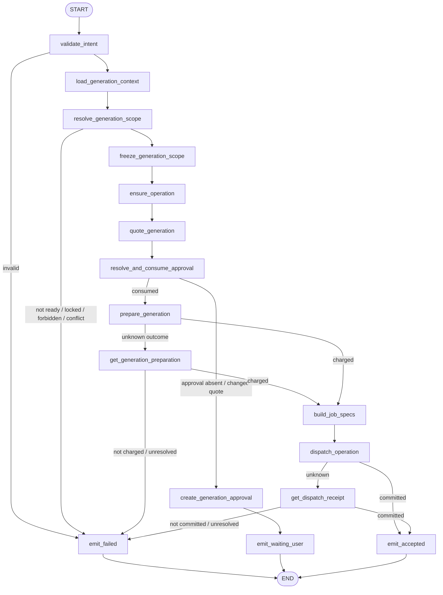
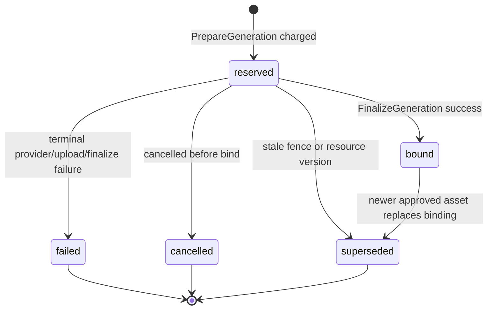
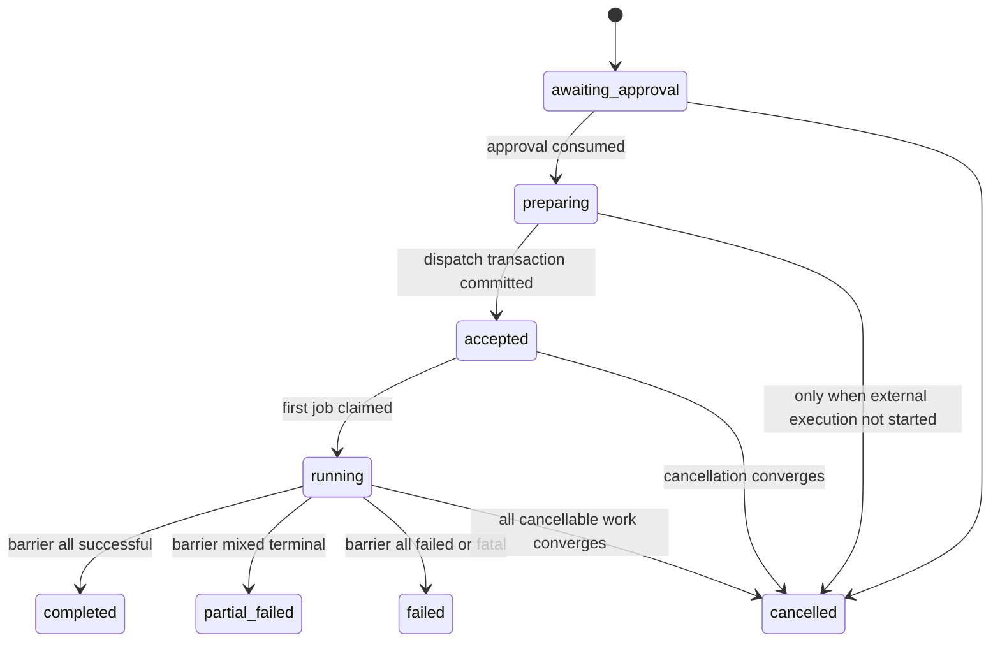

# `generate_media` Graph Tool 设计

> 状态：Draft / 待产品、Business、Agent、Worker、财务、安全与运维评审
>
> Development Preview 例外：[`media.runtime.v3preview1`](../media-runtime-v3-preview-design.md) 已获 **Approved for Development Preview**，只允许一个 Prompt Preview 图片目标经共享 Operation/Batch/Job/Terminal Outbox，由 Worker 使用 Go `image/png` 生成确定性 `640x360` 真 PNG，并经 Business 本地 Preview Asset Prepare/Finalize/Range 闭环。它不向 Agent、Worker、Job、Outbox 或日志复制 Prompt 明文，不调用模型/Provider，不计费、不审批、不使用 TOS，也不使生产 Catalog 可用；本文第 1～12 节完整生产范围继续 Draft。
>
> Graph Key：`generate_media_graph_v1`
>
> Tool Definition Version：`generate_media.v1alpha1`
>
> Migration Owner：Business（Charge/Asset/Binding），Agent（Operation/Batch/Job/Outbox/Approval），Worker（Attempt/Provider/Upload Receipt）
>
> 实现门禁：评审结论为“通过”前禁止创建生产代码、Migration 或 Worker Consumer；上面的 local-only Preview exact-set 可按独立设计创建隔离的 Preview 代码、向前 Migration 与版本化 Consumer，不得复用其结论宣称生产能力。

共同契约见 [`../../cross-module/aigc-contract-catalog.md`](../../cross-module/aigc-contract-catalog.md)。本 Tool 不使用 ChatModel Node；它以确定性 Graph 完成目标冻结、报价、正式审批、扣费准备和原子派发，媒体内容由 Worker 调 Provider 生成。

## 1. 场景、目标与边界

支持两种互斥模式：

- `storyboard`：为激活 Storyboard Revision 的精确 Slot 集生成图片、视频或音频；
- `standalone`：基于 ready PromptArtifact 或一次性 inline prompt 生成独立媒体。

目标：

- 在扣费前冻结准确目标、Prompt、模型能力、输出规格、资源版本和价格 Quote；
- 所有媒体生成都要求绑定冻结摘要的正式 Generation Approval；
- Business `PrepareGeneration` 原子扣费并创建 Asset 占位、Binding Token；
- Agent 原子创建/更新 Operation、Batch、Job 和 Dispatch Outbox；
- Worker 通过 `AGT-JOB-V1` Claim/Fence 执行、上传、Finalize 并提交终态；
- Graph 只在派发事务成功后返回 `accepted`，不等待 Provider。

非目标：

- 不生成或修改 Prompt；storyboard 模式只接受 `ready` PromptRevision；
- 不在 Agent Runtime 调 Provider，不在 Worker 扣费或生成 A2UI；
- 不因失败、取消、超时自动退款；
- 不用 Redis 作为 Job 权威，不在 Graph 内轮询终态或保留跨分钟栈。

### 1.1 需求追踪

| 类型 | ID |
|---|---|
| Tool 主验收 | `GTL-MEDIA-001`、`GTL-MEDIA-002`、`GTL-MEDIA-003`、`GTL-MEDIA-004` |
| 异步与共通 | `GTL-ASYNC-001`、`GTL-CANCEL-001`、`GTL-USE-002`、`GTL-VER-001`、`GTL-IDEM-001`、`GTL-BILL-001`、`GTL-EARN-001`、`GTL-SEC-001` |
| 全功能冒烟 | `SMK-013`、`SMK-014`、`SMK-016`、`SMK-018`、`SMK-019`、`SMK-020`、`SMK-021`、`SMK-022`、`SMK-023`、`SMK-033`、`SMK-034` |

## 2. Intent、可信授权与结果

### 2.1 `GenerateMediaIntentV1`

| 字段 | 类型 | 规则 |
|---|---|---|
| `mode` | `storyboard/standalone` | 必填；输入互斥 |
| `media_kind` | enum | 图片、视频、音频等已注册能力 |
| `storyboard_revision_id` | UUID? | storyboard 模式必填且必须 active |
| `target_slot_ids` | UUID[] | storyboard 模式必填；非空、去重、固定集合 |
| `prompt_artifact_id` | UUID? | standalone 可选；必须 ready |
| `inline_prompt` | string? | standalone 可选；与 PromptArtifact 二选一；作为不可变输入快照持久化 |
| `reference_asset_ids` | UUID[] | 可选；逐项授权和版本校验 |
| `output_spec` | object | 尺寸、时长、格式等服务端 Schema；未知字段拒绝 |
| `capability_preference` | object? | 非权威偏好；不能指定 Secret、价格或未启用 Provider |
| `expected_resource_versions` | map<UUID,int64>? | 防止对意外新版本扣费 |

`approval_id` 不属于普通 Intent。Approval Continuation 通过可信上下文携带 `ApprovalContinuationResult`；Agent 校验后消费，产生 `ApprovalConsumptionReceipt`。Business 只接受已认证 Agent RPC 携带的消费回执及完全一致的 scope/quote digest。

### 2.2 冻结范围与报价

`generation_scope_digest` 至少包含：排序目标集、Prompt ID/version/content digest 或 inline prompt digest、参考 Asset 版本、Storyboard/Slot 版本、媒体种类、输出规格、解析后的 Provider Capability Policy Version、Tool Definition Version。

`BIZ-AIGC-015 QuoteGeneration` 返回 Quote ID/version、价格/用量摘要、有效期和允许的执行能力，不扣费。若 Continuation 时 Quote 变化，旧 Approval 失效并创建新 Approval。

### 2.3 输出

- 尚无有效 Generation Approval：`waiting_user`，包含 Quote 摘要、目标集和 Approval Ref；
- Dispatch 事务成功：`accepted`，包含 Operation/Batch Ref、Asset 占位 refs 和 Receipt；
- 权限、依赖、版本、余额、Approval 或准备失败：`failed`；
- Preparation 已扣费但 Dispatch 未确认：返回 `failed/UNKNOWN_OUTCOME` 和 Operation Ref，禁止用户重新创建 Operation，由 Recovery Scanner 补派发。

Provider 终态不由原 Graph 返回。Agent 处理 Terminal Outbox 后通过新 Continuation Turn/A2UI 更新为 completed、partial_failed、failed 或 cancelled。

## 3. Typed Graph State

Graph State 类型为 `GenerateMediaStateV1`。

| State 字段 | Owner/来源 | 读节点 | 写节点 | 持久化/Checkpoint | 敏感性与不变量 |
|---|---|---|---|---|---|
| `trusted_context` | Agent | 全部 | 初始化器 | Run | 不可覆盖 |
| `intent` | Tool Schema | 校验、范围解析 | `validate_intent` | input digest | 模式互斥 |
| `generation_context` | Business | 目标解析、报价 | `load_generation_context` | Resource refs/digests | 仅授权资源 |
| `exact_targets` | Agent | Quote/Prepare/Dispatch | `resolve_generation_scope` | Operation Scope | 排序固定；不得由模型扩大 |
| `scope_digest` | Agent | Operation/Quote/Approval/Prepare | `freeze_generation_scope` | Agent Operation | 扣费后不可变 |
| `operation` | Agent | Approval/Prepare/Result | `ensure_operation` | Agent 权威 | 同一 scope 复用同一 Operation ID |
| `quote` | Business | Approval/Prepare | `quote_generation` | Business + Operation Ref | 有效期和版本必须匹配 |
| `generation_approval` | Agent | 待审批结果 | `create_generation_approval` | Agent 权威 | 绑定 scope、quote、金额和有效期 |
| `approval_consumption` | Agent | Prepare | `resolve_and_consume_approval` | Agent Approval | 一次性 CAS；绑定 scope+quote |
| `preparation_receipt` | Business | Job 构建/恢复 | `prepare_generation` | Business + Agent Ref | 含 Charge、Asset、Binding Token |
| `job_specs` | Agent | Dispatch | `build_job_specs` | Dispatch Receipt | 每目标一稳定 Job ID/幂等键 |
| `dispatch_receipt` | Agent | Result | `dispatch_operation` | Agent 权威 | Operation/Batch/Jobs/Outbox 同事务 |
| `result`、`error` | Agent | END | Result/Error Nodes | ToolReceipt | 唯一终态 |

Graph State 不保存 Provider Client、Secret、完整二进制或 Worker Attempt；Binding Token 仅在受控 Job Envelope 中持久化，不写模型/A2UI/普通日志。

## 4. Graph 流程

Graph 为 `AllPredecessor` 无环 DAG。Job 派发后 Graph 结束；Worker 终态由持久化事件创建新的 Continuation Turn。

## 5. 稳定 Node 清单

| Node Key | 中文名称 | 业务分类 | Eino 实现 | 单一职责 | 输入/输出 | State 读写 | 副作用/风险 | Invoke/Stream | 预算/回执 | 错误码/失败目标 | Checkpoint |
|---|---|---|---|---|---|---|---|---|---|---|---|
| `validate_intent` | 校验生成意图 | Guard | Lambda | 模式互斥、Schema、规格和范围格式 | Intent→规范化 Intent | R/W intent | 无 | Invoke | input digest | `INVALID_ARGUMENT` | 否 |
| `load_generation_context` | 加载生成上下文 | Query | Lambda/RPC | 查询 Prompt、Storyboard、Slot、Asset 和能力策略 | Refs→Context | W generation_context | Business 敏感读取 | Invoke | RPC Receipt | `PERMISSION_DENIED/VERSION_CONFLICT` | 可，仅引用 |
| `resolve_generation_scope` | 解析生成目标 | Guard/Compute | Lambda | 校验 ready Prompt、Slot 类型、锁、依赖和 inline prompt | Context→Targets | W exact_targets | 不得生成 Prompt/扩大目标 | Invoke | Scope Mapping Receipt | `DEPENDENCY_NOT_READY/LOCK_CONFLICT` | 否 |
| `freeze_generation_scope` | 冻结生成范围 | Compute | Lambda | 生成 scope digest 和 Provider Capability 请求 | Targets→Scope | W scope_digest | 扣费后不可变 | Invoke | Scope Receipt | `INTERNAL` | 否 |
| `ensure_operation` | 创建或恢复 Operation | Command | Lambda/Repository | 按 Tool 幂等键创建 `awaiting_approval` Operation | Scope→Operation | W operation | Agent DB 写入 | Invoke | Operation Receipt | `VERSION_CONFLICT` | 是，仅 Receipt |
| `quote_generation` | 获取生成报价 | Query | Lambda/RPC | 调 `BIZ-AIGC-015`，不扣费 | Scope→Quote | W quote | 价格敏感；不进 Prompt | Invoke | Quote Receipt | `UNSUPPORTED_CAPABILITY` | 否 |
| `resolve_and_consume_approval` | 校验并消费生成审批 | Guard/Command | Branch/Repository | 校验用户、scope、quote、金额和有效期，CAS 消费 | Approval→Consumption | W approval_consumption | 高风险一次性授权 | Invoke | Approval Consumption Receipt | `APPROVAL_REQUIRED/INVALID` | 否 |
| `create_generation_approval` | 创建生成审批 | Command | Lambda/Repository | 保存冻结 Quote/目标/Card | Quote→Approval | W generation_approval | Agent DB/EventLog | Invoke | Approval/Event Receipt | `INTERNAL` | 否 |
| `prepare_generation` | 扣费并预留资产 | Command | Lambda/RPC | 调 `BIZ-AIGC-016` | Scope/Approval→Preparation | W preparation_receipt | 扣费、Asset 占位、Token | Invoke | Preparation/Charge Receipt | `INSUFFICIENT_POINTS/UNKNOWN_OUTCOME` | 是，仅 Receipt |
| `get_generation_preparation` | 查询生成准备 | Query | Lambda/RPC | 调 `BIZ-AIGC-017` 消除未知结果 | Operation→Preparation | W preparation_receipt | 无新扣费 | Invoke | Preparation Receipt | `UNKNOWN_OUTCOME` | 否 |
| `build_job_specs` | 构建稳定 Job | Compute | Lambda | 按目标和占位 Asset 生成 Job ID、类型、幂等键 | Preparation→JobSpecs | W job_specs | Binding Token 受限 | Invoke | Job Spec digest | `PREPARATION_MISMATCH` | 是，映射 Receipt |
| `dispatch_operation` | 原子派发生成任务 | Command | Lambda/Repository | 同事务写 Operation/Batch/Jobs/Dispatch Outbox | JobSpecs→Dispatch | W dispatch_receipt | Agent 多表事务 | Invoke | Dispatch Receipt | `VERSION_CONFLICT/UNKNOWN_OUTCOME` | 是，仅 Receipt |
| `get_dispatch_receipt` | 查询派发结果 | Query | Lambda/Repository | 按 Operation/Scope 查询是否已提交 | Operation→Dispatch | W dispatch_receipt | 无新 Job | Invoke | Dispatch Receipt | `UNKNOWN_OUTCOME` | 否 |
| `emit_waiting_user` | 输出待生成审批 | Result | Lambda | 返回目标、Quote 和 Approval Card | State→Result | R generation_approval; W result | EventLog | Invoke | ToolReceipt/Event ID | `INTERNAL` | 否 |
| `emit_accepted` | 输出异步受理 | Result | Lambda | 返回 Operation/Batch/Asset 占位引用 | Dispatch→Result | W result | EventLog | Invoke | ToolReceipt/Event ID | `INTERNAL` | 否 |
| `emit_failed` | 输出失败/未知结果 | Error | Lambda | 归一化错误，已扣费未派发交 Recovery Scanner | Error→Result | W result/error | 禁止自动退款/重复提交 | Invoke | Failure/Recovery Receipt | 稳定错误码 | 否 |

## 6. 业务与执行状态机

### 6.1 Business Generation Asset Binding

### 6.2 Agent Operation/Batch/Job

| Aggregate/Owner | 权威来源 | 原状态 | 触发事件 | 执行方 | Guard/动作 | 目标状态 | 终态/可重试 | 事务/幂等键 | Fence/版本/Outbox | 失败处理 |
|---|---|---|---|---|---|---|---|---|---|---|
| Operation/Agent | Agent DB | 不存在 | 冻结 scope | Agent Graph | Tool 幂等键和 scope 唯一 | `awaiting_approval` | 非终态 | `turn_id + tool_call_id` | operation version | 重放返回同一 Operation |
| Operation/Agent | Agent DB | `awaiting_approval` | Approval consumed | Agent Graph | scope/quote/amount/version 精确匹配 | `preparing` | Recovery 可继续 | `approval_id + consumption_key` | CAS op/approval version | 失败不扣费 |
| GenerationBinding/Business | Business DB | 不存在 | PrepareGeneration | Business | Approval Consumption、Quote、余额、scope 均有效 | `reserved` | 可恢复；不重复扣费 | `operation_id + scope_digest` | Asset version/Binding Token；Outbox | unknown 走查询 |
| Operation/Batch/Job/Agent | Agent DB | `preparing` | Dispatch | Agent Graph | Preparation Receipt 和 JobSpecs 完整 | `accepted/pending` | Worker 可 Claim | `operation_id + preparation_receipt_id` | 同事务写 Dispatch Outbox | 整体回滚；Recovery 补派发 |
| Job/Agent | Agent DB | `pending/retry_wait` | Claim/renew/start | Worker via `AGT-JOB-V1` | CAS lease、Attempt、Fence | `claimed/running` | 可租约恢复 | Job ID + request ID | Fence 单调增长 | 旧 Attempt 拒绝 |
| GenerationBinding/Business | Business DB | `reserved` | FinalizeGeneration | Worker | Token、Job、Fence、output digest、Asset version 匹配 | `bound/failed/cancelled/superseded` | 终态 | `job_id + fence + output_digest` | Finalization Receipt + Outbox | unknown 走查询 |
| Job/Batch/Operation/Agent | Agent DB | `running` | commit_terminal/barrier | Worker via Contract | 当前 Fence、Finalization Receipt、终态合法 | Job/Batch/Operation 终态 | 终态 | `job_id + fence + terminal_status` | 同事务 Terminal Outbox | 重复返回原状态；stale 隔离 |

Job 细分状态允许 `pending/claimed/running/retry_wait/completed/failed/cancelled/superseded`；Batch Barrier 只根据 Agent DB 权威 Job 终态计算。

## 7. ChatModel、Prompt 与预算说明

本 Graph 没有 ChatModel、Prompt Node、ToolsNode 或模型重试。原因：媒体 Prompt 必须来自 ready Prompt 资源或显式 inline 输入，目标、报价、授权、扣费和派发都必须确定性完成。

预算分两类：

- Graph 自身的节点耗时、RPC、目标数和 Job 数预算来自 Tool Runtime 配置；
- Provider 价格、输出规格、重试/并发策略来自 Business Quote 和 Worker Policy Ref，不硬编码在 Graph。

任何未来“先让模型改 Prompt 再生成”的需求必须显式调用 `write_prompts`，不能在本 Tool 内偷偷增加 ChatModel Node。

## 8. 分支、并行与异步边界

- Graph 内无并行副作用；准备和派发严格串行。
- Worker 可并行 Claim 多个 Job，但受配置并发、用户/Provider 限流和 Batch 策略约束。
- Batch Fan-in 由 Agent PostgreSQL Barrier 完成，不是 Eino Fan-in。
- 单 Job 失败只影响自身；Barrier 决定 Batch/Operation 的 completed、partial_failed、failed 或 cancelled。
- 取消是独立 Agent HTTP/Command 流程；Graph 不轮询取消，Worker 在 Provider 前和上传前检查 cancel version。

## 9. 幂等、Fence、事务与恢复

- Operation、Approval、Prepare、JobSpecs、Dispatch、Provider、Upload、Finalize 和 Terminal Commit 各有独立稳定键，详见共同契约矩阵。
- Business Preparation 成功但 Agent Dispatch 失败形成 `charged_pending_dispatch` 恢复条件；Recovery Scanner 读取 Operation + Preparation Receipt，使用原 Job ID 映射补同一派发事务。
- Provider 响应未知先查 Provider；无法证明未执行时不得重发。
- Lease 过期新 Attempt 获得更高 Fence；旧结果只能记录为 stale/superseded，不得绑定 Asset 或覆盖 Job。
- Agent Job 终态和 Terminal Outbox 同事务；Inbox/EventLog 重放按 Event ID 幂等。
- 自动退款被禁止；明确证明未开始的冲正走独立审计命令。

## 10. 风险、HITL、权限与隐私

- 每次媒体生成都需要正式 Generation Approval；用户明确点击的结构化确认可直接创建并消费 Approval，但不能省略权威记录。
- Approval 必须展示目标数量/范围、媒体规格、Quote、余额影响、过期时间和不可退款规则。
- Prompt、素材 URL、Binding Token 和 Provider 响应不得进入普通日志/A2UI；展示使用 Business 授权 Resource URL。
- Worker 最小权限只可执行 `AGT-JOB-V1` 函数、访问自身 DB 和运行时 Secret。
- inline prompt 被视为敏感内容，只保存不可变快照与必要正文；日志记录 digest。

## 11. 测试与验收

必须覆盖：

- standalone/storyboard 模式、ready/stale/reviewing Prompt、锁/依赖/版本冲突；
- Quote 变化使旧 Approval 失效、越权/过期/重复 Approval；
- 余额不足、Prepare 成功响应丢失、已扣费未派发恢复；
- 原子 Dispatch、重复 Redis 唤醒、竞争 Claim、租约过期、Fence 旧结果；
- Provider 超时/限流/unknown outcome、上传失败、Finalize 响应丢失；
- Batch 全成功/部分失败/全失败/取消、Terminal Outbox/Inbox/SSE 重放；
- 无自动退款、明确未开始冲正审计；
- Worker 不生成 A2UI、不直接写 Business/Agent 表；
- Graph 无 ChatModel、无长期等待、所有路径唯一 END。

全功能冒烟至少覆盖 Prompt ready→报价→批准→扣费→accepted→Worker 生成→Asset 就绪→A2UI 刷新，以及余额不足、部分失败、取消和幂等重放。

## 12. 评审结论

- [ ] 产品确认模式、范围、Quote/Approval、取消和部分失败交互；
- [ ] Business 确认 Prepare/Finalize、Asset/Binding、计费与冲正；
- [ ] Agent 确认 Operation/Batch/Job、Job Contract、Outbox/Inbox/A2UI；
- [ ] Worker 确认 Claim/Fence/Receipt/Provider/Upload/Finalize；
- [ ] 财务、安全、运维确认费用、Secret、最小权限、扫描恢复与告警；
- [ ] 测试确认故障注入和 SMK-P0。

当前结论：**待评审，不通过实现门禁。**
