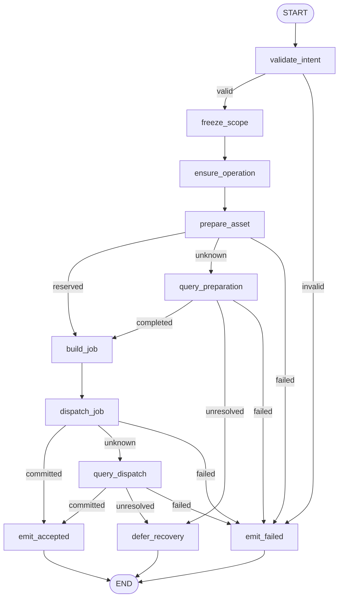
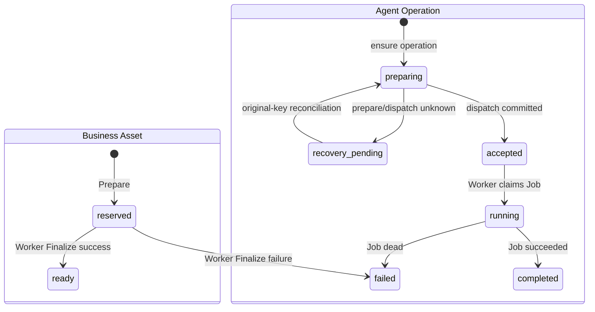

# `generate_media` Graph Tool 当前实现设计

> 状态：Current Implementation / local Development Preview 范围；完整生产范围仍为 Draft。当前验收结论只见[交付状态](../../../requirements/delivery-status.md)。
>
> Development Preview 例外：`media.runtime.v3preview1` 只允许一个 Prompt Preview 目标生成确定性 `640x360` PNG；不授权真实 Provider、计费、Approval 或生产 Catalog。
>
> 当前 Pin：`generate_media.v3preview1` / `generate_media_graph_v3preview1` / `generate_media.intent.v3preview1` / `png_640x360.v1`。
>
> 当前代码：`agent/internal/mediapreview`、`worker/internal/mediajob`、`worker/internal/mediapreview`、`business/internal/mediapreview`；当前迁移：`agent/migrations/20260717001300_add_media_runtime_v3preview1.up.sql`、`business/migrations/20260717000500_create_media_preview_asset.up.sql`、`worker/migrations/20260717000100_create_media_preview_runtime_receipts.up.sql`。

## 1. 功能边界

当前实现从一个 Business Prompt Preview Draft 中选择一个 `target_local_key`，冻结精确 Source Ref 和固定 PNG 输出 Profile，创建或恢复一 Operation/Batch/Job，调用 Business Prepare 预留 Asset，原子派发 Job 与 Outbox；Worker 领取 Job 后使用 Go `image/png` 生成真实确定性 PNG，调用 Business Finalize，再向 Agent 提交终态并投影 Workspace Card。

原 Graph 在派发确认后返回 `accepted`，不等待 Worker。当前不调用 ChatModel 或媒体 Provider，不复制 Prompt 明文到 Agent Job、Worker Receipt 或日志，不计费、不审批、不取消、不支持多目标/复杂 Batch，也不开放生产 Registry/Catalog。

## 2. 输入与输出

### 2.1 输入

`GenerateMediaIntent` exact-set：

| 字段 | 当前约束 |
|---|---|
| `schema_version` | 固定 `generate_media.intent.v3preview1` |
| `prompt_preview_id` | Business Prompt Preview UUIDv7 |
| `expected_prompt_version` | 当前必须为有效精确版本 |
| `expected_prompt_content_digest` | 小写 SHA-256 |
| `target_local_key` | 必须存在于 Prompt Preview exact-set |
| `output_profile` | 固定 `png_640x360.v1` |

User/Project/Session/Input/Turn/Run/ToolCall/Idempotency/Fence/Deadline 只来自 `TrustedContext`。

### 2.2 输出

- Graph 受理：`accepted/MEDIA_PREVIEW_ACCEPTED`，返回 `operation_id/batch_id/asset_id/receipt_id`；不暴露 Job ID、Object Key 或 Prompt。
- 确定失败：`failed`，只返回白名单 `result_code/error_code`。
- Prepare/Dispatch 未确定：内部 `GraphOutcome.Recovery{operation_id,reason_code}`，Operation 为 `recovery_pending`，不冻结伪失败。
- Worker 终态：不回写原 Graph Result；Terminal Outbox 驱动 Workspace Card 变为 completed/failed，并携带安全 Asset Ref。

## 3. 当前 Graph 流程

Graph 为 `AllPredecessor` 无环 DAG。它与 `assemble_output` 复用同一泛型拓扑，只替换严格 Intent、Source、Definition、Job Type 和输出 Profile；没有 ChatModel、Prompt Node、ToolsNode、循环或长期等待。

## 4. 稳定 Node / Branch exact-set

Node exact-set（11）：

`validate_intent`, `freeze_scope`, `ensure_operation`, `prepare_asset`, `query_preparation`, `build_job`, `dispatch_job`, `query_dispatch`, `defer_recovery`, `emit_accepted`, `emit_failed`。

| Branch Key / 源 Node | 输出 exact-set |
|---|---|
| `route_intent_validation` / `validate_intent` | `freeze_scope`, `emit_failed` |
| `route_prepare_outcome` / `prepare_asset` | `build_job`, `query_preparation`, `emit_failed` |
| `route_preparation_query` / `query_preparation` | `build_job`, `defer_recovery`, `emit_failed` |
| `route_dispatch_outcome` / `dispatch_job` | `emit_accepted`, `query_dispatch`, `emit_failed` |
| `route_dispatch_query` / `query_dispatch` | `emit_accepted`, `defer_recovery`, `emit_failed` |

未知值返回错误并失败关闭。

## 5. 强类型 Graph State 摘要

`GenerateMediaPreviewStateV1` 是 `mediaPreviewState[GenerateMediaIntent]` 的强类型别名：

| 字段组 | 内容与不变量 |
|---|---|
| 身份/Intent | `TrustedContext`, `Intent`；可信字段不可覆盖 |
| 范围 | `ScopeDigest`；覆盖 Tool/Definition、Owner 范围、Prompt exact ref、target 与 Profile |
| Agent 聚合 | `Operation`；first-write-wins 预分配 Operation/Batch/Job/Outbox ID |
| Business 边界 | `PreparationRequest`, `Preparation`；原命令先冻结，结果必须再次校验 |
| 派发 | `JobSpec`, `DispatchReceipt`；一 Operation 固定一 Batch/Job |
| 结束 | `Result`, `ErrorCode`；Recovery 使用独立联合 |

State 不保存 Prompt 明文、Provider Secret、绝对路径、永久 URL 或二进制。

## 6. 业务状态机与迁移表

### 6.1 Business Asset 与 Agent Operation

### 6.2 当前迁移表

| 聚合 / Owner | 当前迁移 | Guard / 幂等 | 失败处理 |
|---|---|---|---|
| Media Asset / Business | 不存在 → `reserved → ready/failed` | Prepare `command_id`、Operation 与 Asset 唯一；Finalize 绑定 preparation/job/fence/output digest | Prepare/Finalize unknown 只查原命令 |
| Operation / Agent | 不存在 → `preparing → accepted → running → completed/failed` | `tool_call_id` 唯一；scope digest；版本 CAS | unknown → `recovery_pending`，原 Operation 继续核对 |
| Batch / Agent | 不存在 → `accepted → running → completed/failed` | 一 Operation 一 Batch | Barrier 只读 Agent Job 权威状态 |
| Job / Agent | 不存在 → `pending → running/retry_wait/reconciling → succeeded/dead` | 一 Operation 一 Job；Claim lease + 单调 Fence | stale Fence 不能 Finalize/提交终态 |
| Attempt / Worker | `claim_pending/claim_unknown → running → artifact_ready → completed/failed`，可经 `finalize_unknown/reconciling/terminal_unknown/retry_scheduled` | claim request、attempt、job/fence/artifact digest 唯一 | 未知先查询；不生成第二份产物 |

## 7. Owner、幂等与 Unknown Outcome

- Business 拥有 Prompt Preview、Media Asset、Prepare/Finalize Receipt 和受保护对象元数据。
- Agent 拥有 Session/Run、Operation/Batch/Job、Dispatch/Terminal Outbox 与 Workspace Event。
- Worker 拥有 Attempt、Artifact Receipt 与 Finalization Observation；不直写 Business/Agent 普通表。
- `EnsureOperation` first-write-wins 预分配所有稳定 ID；重放不得重新生成 Job/Asset 映射。
- Prepare 前冻结完整 request/digest；任何非权威错误或不可信响应都转 Query。权威 `not_found` 在当前实现保持 recovery pending，不直接换键重发。
- Dispatch unknown 只按原 `operation_id + scope_digest` 查询；未确认不得创建第二个 Job。
- Worker 的产物请求 digest、Claim request、Fence、Finalize command 和 terminal commit 各自稳定；旧 Fence 结果隔离。

## 8. 安全

- Business Prepare 重新校验 User/Project、Prompt ID/version/digest、target key 与 Profile；Agent 不信任浏览器资源绑定。
- Job `source_ref` 只含 ID/version/digest/target digest，不含 Prompt 明文、URL 或 Secret。
- 对象键由 Business 生成并限制为相对路径；Worker 在配置的本地对象根内解析，禁止绝对路径、反斜杠和 `..`。
- 普通日志、Outbox、Receipt 和 Tool Result 不保存 Prompt、对象根、staging key 或二进制。
- 当前是 local-only deterministic renderer；生产对象存储身份、恶意内容扫描、真实 Provider Secret 和网络隔离未完成。

## 9. 测试与验收入口

当前测试覆盖两个媒体 Graph 的 Node/Branch exact-set、Intent strict decode、scope digest、Operation first-write-wins、Prepare/Dispatch committed/unknown/query/conflict、Recovery 联合、Job contract、Claim/Fence、PNG 编码、Finalize/Terminal 重放和迁移约束。

`make trial-basic` 的固定验收范围包括：六个 Tool Receipt、Worker 生成真实可解码 `640x360 image/png`、Business Asset `reserved → ready`、Workspace V5 completed Card、受保护内容读取及硬刷新恢复。

## 10. 生产差距

生产 `generate_media.v1alpha1` 仍为 Draft，至少缺少：storyboard/standalone 完整模式、多目标 Batch、ready PromptRevision/正式 PromptArtifact、真实媒体 Provider 与 Provider Unknown Outcome、Quote/计费/收入/冲正、Generation Approval/Continuation、取消与部分失败、生产对象存储/TOS/扫描、限流并发与运维告警、生产 Registry/Catalog，以及完整故障注入和服务/数据库重启恢复证据。
