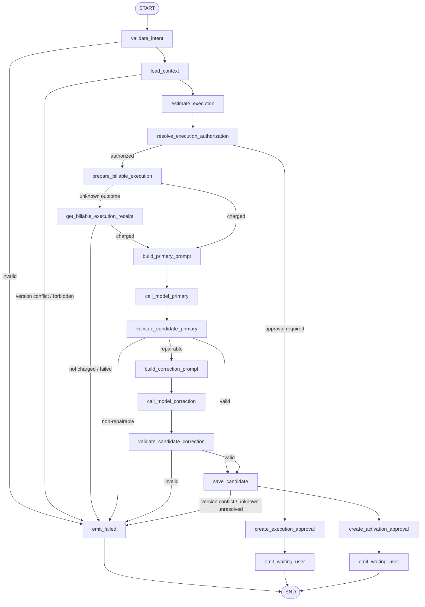
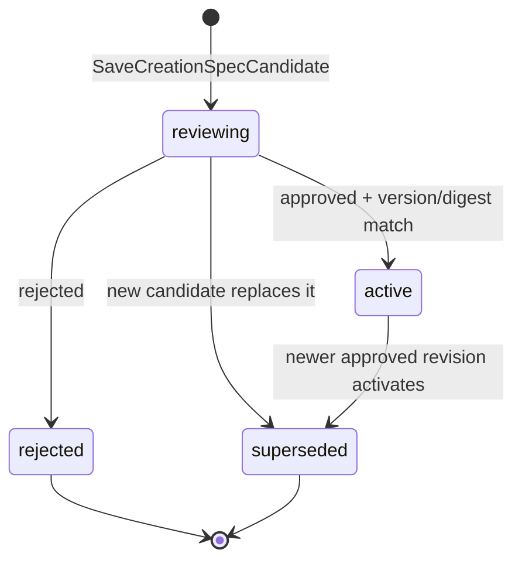

# `plan_creation_spec` Graph Tool 设计

> 状态：Draft / 待产品、Business、Agent、财务与安全评审
>
> Graph Key：`plan_creation_spec_graph_v1`
>
> Tool Definition Version：`plan_creation_spec.v1alpha1`
>
> Migration Owner：Business（CreationSpec），Agent（Run/Receipt/Approval）
>
> 实现门禁：评审结论为“通过”前禁止创建生产代码。

关联需求：`graph-tool-requirements-overview.md` 的 `plan_creation_spec`、Creation Spec、计费、审批、幂等、A2UI 与全功能冒烟条目。共同契约见 [`../../cross-module/aigc-contract-catalog.md`](../../cross-module/aigc-contract-catalog.md)。

## 1. 场景、目标与边界

适用场景：用户基于项目目标、已发布 Skill、已有素材和可选旧版 Creation Spec，生成或修订一份可审核的创作规划。

目标：

- 生成结构化、可验证、可版本化的 Creation Spec 候选；
- 明确内容目标、受众、载体、风格、约束、交付规格和验收条件；
- 先完成正式预算授权和扣费，再调用 ChatModel；
- 保存候选后创建正式激活 Approval，用户决策通过新 Continuation Turn 生效；
- 向 A2UI 输出稳定 Card/Resource 引用，不把完整 Spec 塞回模型上下文。

非目标：

- 不分析素材的完整语义；素材缺少结构化分析时只读取已存在摘要；
- 不创建 Storyboard、正式 Prompt、媒体 Job 或真实导出；
- 不允许模型修改权限、余额、计费规则、Published Skill Snapshot 或资源版本；
- 不在 Graph 内等待用户审批，不用 Checkpoint 保存长期审批状态。

权威来源：项目、Skill Snapshot、CreationSpec 归 Business PostgreSQL；Run、Tool/Model Receipt、Approval、A2UI EventLog 归 Agent PostgreSQL；Redis 仅用于通知。

### 1.1 需求追踪

| 类型 | ID |
|---|---|
| Tool 主验收 | `GTL-PLAN-001` |
| 共通 Graph Tool | `GTL-USE-002`、`GTL-VER-001`、`GTL-IDEM-001`、`GTL-BILL-001`、`GTL-EARN-001`、`GTL-SEC-001` |
| 全功能冒烟 | `SMK-009`、`SMK-021`、`SMK-023`、`SMK-033`、`SMK-034` |

## 2. Intent、可信上下文与结果契约

### 2.1 `PlanCreationSpecIntentV1`

| 字段 | 类型 | 规则 |
|---|---|---|
| `goal` | string | 必填；有长度和内容策略限制 |
| `deliverable_type` | enum | 允许的服务端枚举；未知值拒绝 |
| `audience_hint` | string? | 用户意图提示，不作为事实 |
| `style_hint` | string? | 用户意图提示，不得覆盖 Published Skill 约束 |
| `constraints` | string[] | 去重、限长；敏感/冲突约束由确定性节点处理 |
| `reference_asset_ids` | UUID[] | 可选；服务端逐项校验项目归属和版本 |
| `revision_instruction` | string? | 修订时必填；不可直接指定权威字段 |
| `expected_baseline_version` | int64? | 修订时用于冲突检测 |

`user_id/project_id/session_id/run_id/tool_call_id/approval_id/budget_authorization_id` 不属于 Intent，统一由 `TrustedCommandContextV1` 注入。

### 2.2 输入上下文

- `GetGraphToolContext` 返回 Project、Published Skill Snapshot、旧 Creation Spec 摘要、授权素材摘要及各自版本/digest；
- 只把完成本次规划所需的最小内容送入 Prompt；对象存储 URL、密钥、价格规则和内部权限不进入模型；
- 若 `expected_baseline_version` 与权威版本冲突，Graph 在模型调用和扣费前失败。

### 2.3 输出

成功生成候选时返回 `GraphToolResultV1(status=waiting_user)`，包含：

- CreationSpec Candidate Resource Ref；
- 激活 Approval Ref；
- Tool、Charge、Model、Candidate Write Receipt Ref；
- 稳定的摘要和警告码。

缺少模型执行授权时，同样返回 `waiting_user`，但 Approval 类型为 `billable_execution`，且不存在候选。校验失败返回 `failed`；不得返回半结构化模型原文。

## 3. Typed Graph State

Graph State 类型为 `PlanCreationSpecStateV1`。

| State 字段 | Owner/来源 | 读节点 | 写节点 | 持久化/Checkpoint | 敏感性与不变量 |
|---|---|---|---|---|---|
| `trusted_context` | Agent | 全部 | 初始化器 | Run 持久化；可 Checkpoint 引用 | 不可被 Intent/模型覆盖 |
| `intent` | Tool Schema | 校验、Prompt | `validate_intent` | ToolReceipt 输入摘要 | 原文按策略脱敏 |
| `domain_context` | Business RPC | 估价、Prompt、保存 | `load_context` | 只持久化 Resource Ref/digest | 版本必须与保存 Guard 一致 |
| `execution_quote` | Agent 配置/Business | 授权、扣费 | `estimate_execution` | Receipt | 价格值不写 Prompt |
| `execution_authorization` | Agent Approval/Budget Policy | 授权、扣费 | `resolve_execution_authorization` | Agent Approval | 必须绑定 execution digest |
| `execution_approval` | Agent | 待授权结果 | `create_execution_approval` | Agent 权威 | 仅覆盖同步模型执行，不覆盖候选激活 |
| `charge_receipt` | Business | 模型节点、恢复 | `prepare_billable_execution` | Business + Agent Receipt Ref | 成功前禁止模型调用 |
| `prompt_input` | Agent | 模型节点 | Prompt Node | ModelReceipt digest | 不含 Secret/价格/权限 |
| `candidate` | ChatModel | Validator | Model Nodes | 短期 Checkpoint + ModelReceipt | 仅候选，不是领域事实 |
| `validation_report` | Agent Validator | 分支、保存 | Validator Nodes | ToolReceipt | 错误码稳定、无自由裁决 |
| `saved_candidate` | Business | Approval/结果 | `save_candidate` | Business 权威 | ID/version/digest 必须齐全 |
| `activation_approval` | Agent | 结果 | `create_activation_approval` | Agent 权威 | 绑定候选版本/digest |
| `result`、`error` | Agent | END | Result/Error Nodes | ToolReceipt | 只能生成一个终态结果 |

禁止在 State 中放 Provider Client、数据库连接、完整二进制素材或永久签名 URL。

## 4. Graph 流程

Graph 是无环 DAG，编译时使用 `AllPredecessor`。图中的 unknown-outcome 查询是确定性分支，不是循环；仍无法判定时以 `UNKNOWN_OUTCOME` 失败并交 Recovery Scanner 处理。

## 5. 稳定 Node 清单

| Node Key | 中文名称 | 业务分类 | Eino 实现 | 单一职责 | 输入/输出 | State 读写 | 副作用/风险 | Invoke/Stream | 预算/回执 | 错误码/失败目标 | Checkpoint |
|---|---|---|---|---|---|---|---|---|---|---|---|
| `validate_intent` | 校验规划意图 | Guard | Lambda | Schema、枚举、长度、重复项校验 | Intent→规范化 Intent | R/W intent | 无 | Invoke | ToolReceipt 输入 digest | `INVALID_ARGUMENT`→failed | 否 |
| `load_context` | 加载规划上下文 | Query | Lambda/RPC | 权限、Project、Skill、基线和素材引用查询 | Context→DomainContext | W domain_context | Business RPC | Invoke | RPC Receipt | `PERMISSION_DENIED/VERSION_CONFLICT` | 可，仅引用 |
| `estimate_execution` | 计算执行摘要 | Compute | Lambda | 生成 execution digest 和配置预算引用 | Context→Quote | W execution_quote | 不扣费 | Invoke | Policy Ref | `BUDGET_POLICY_MISSING` | 否 |
| `resolve_execution_authorization` | 校验预算授权 | Guard | Branch | 校验 Budget Authorization 或 Approval | Quote→Auth Result | W execution_authorization | 不得信任模型字段 | Invoke | Approval Receipt | `APPROVAL_REQUIRED/INVALID` | 否 |
| `create_execution_approval` | 创建模型执行审批 | Command | Lambda/Repository | 保存正式 Approval 和 Card 初始事件 | Quote→Approval | W execution_approval | Agent DB 写入 | Invoke | Approval Receipt | `INTERNAL`→failed | 否 |
| `prepare_billable_execution` | 扣除模型执行费用 | Command | Lambda/RPC | 调 `BIZ-AIGC-003` | Digest/Auth→Charge | W charge_receipt | 扣费；高风险 | Invoke | Charge Receipt | `INSUFFICIENT_POINTS/UNKNOWN_OUTCOME` | 是，仅 Receipt |
| `get_billable_execution_receipt` | 查询扣费回执 | Query | Lambda/RPC | 调 `BIZ-AIGC-004` 消除未知结果 | Key→Charge | W charge_receipt | 无新扣费 | Invoke | Charge Receipt | `UNKNOWN_OUTCOME`→failed | 否 |
| `build_primary_prompt` | 构造规划 Prompt | Prompt | ChatTemplate | 按版本模板映射最小上下文 | Context→Messages | W prompt_input | Prompt 注入风险 | Invoke | Prompt key/version/digest | `PROMPT_RENDER_FAILED` | 否 |
| `call_model_primary` | 主模型规划 | Inference | ChatModel | 生成严格结构化候选 | Messages→Candidate | W candidate | 已计费模型调用 | Invoke | ModelReceipt；预算来自配置 | `MODEL_*`→failed/repair | 是，Receipt |
| `validate_candidate_primary` | 首次候选校验 | Validate | Lambda | Schema、枚举、约束、引用和安全校验 | Candidate→Report | W validation_report | 无副作用 | Invoke | Validator version | invalid→repair/failed | 否 |
| `build_correction_prompt` | 构造纠错 Prompt | Prompt | ChatTemplate | 只带稳定错误码和原候选摘要 | Report→Messages | W prompt_input | 不泄漏内部规则 | Invoke | Prompt key/version/digest | `PROMPT_RENDER_FAILED` | 否 |
| `call_model_correction` | 单次模型纠错 | Inference | ChatModel | 在同一 Charge/模型预算内纠错一次 | Messages→Candidate | W candidate | 不允许无限重试 | Invoke | 同一执行 ModelReceipt 子 Attempt | `MODEL_*`→failed | 是，Receipt |
| `validate_candidate_correction` | 纠错结果校验 | Validate | Lambda | 与首次相同的确定性校验 | Candidate→Report | W validation_report | 无 | Invoke | Validator version | invalid→failed | 否 |
| `save_candidate` | 保存规划候选 | Command | Lambda/RPC | 调 `BIZ-AIGC-007` 保存 reviewing 版本 | Candidate→ResourceRef | W saved_candidate | Business 写入；版本冲突 | Invoke | Candidate Write Receipt | `VERSION_CONFLICT/UNKNOWN_OUTCOME` | 是，仅 Receipt |
| `create_activation_approval` | 创建激活审批 | Command | Lambda/Repository | 绑定候选版本/digest 创建 Approval | ResourceRef→Approval | W activation_approval | Agent DB 写入 | Invoke | Approval Receipt | `INTERNAL`→failed | 否 |
| `emit_waiting_user` | 输出待确认结果 | Result | Lambda | 写 ToolReceipt/A2UI Card Event | State→Result | R execution_approval/activation_approval; W result | Agent DB EventLog | Invoke | ToolReceipt/Event ID | `INTERNAL` | 否 |
| `emit_failed` | 输出失败结果 | Error | Lambda | 归一化错误并 Finalize Charge Outcome | Error→Result | W result/error | 失败默认不退款 | Invoke | Failure/Charge Receipt | 稳定错误码 | 否 |

Tool 本身不向模型暴露 Stream；Agent 可在 Node 边界把进度事件写入 A2UI。ChatModel 内部是否使用 Stream 由适配器配置，但结构化结果只在完整校验后向下游可见。

## 6. CreationSpec 业务状态机

| Aggregate/Owner | 权威来源 | 原状态 | 触发事件 | 执行方 | Guard/动作 | 目标状态 | 终态/可重试 | 事务/幂等键 | Fence/版本/Outbox | 失败处理 |
|---|---|---|---|---|---|---|---|---|---|---|
| CreationSpecRevision/Business | Business DB | 不存在 | 保存候选 | Business | 校验 Project、基线版本和 candidate digest | `reviewing` | 非终态；幂等重放 | `tool_call_id + candidate_digest` | resource version；写领域 Outbox | 冲突返回 `VERSION_CONFLICT` |
| CreationSpecRevision/Business | Business DB | `reviewing` | Approval approved | Agent Continuation→Business | Approval 用户/动作/候选版本/digest/有效期均匹配 | `active` | 当前版本业务可用 | `approval_id + decision_version` | CAS candidate version；同事务写 `creation_spec.activated.v1` | 失配拒绝，不自动新建候选 |
| CreationSpecRevision/Business | Business DB | `reviewing` | Approval rejected | Agent Continuation→Business | 同上且 decision=rejected | `rejected` | 终态 | 同上 | CAS candidate version；Outbox | 重复决策返回原结果 |
| CreationSpecRevision/Business | Business DB | `reviewing/active` | 新版本生效 | Business | 新旧资源关系已验证 | `superseded` | 终态 | 新激活事务键 | resource version；Outbox | 事务整体回滚 |

Approval 状态机独立归 Agent，不得把 `reviewing` 当作 Approval 状态，也不得由模型直接触发 `active`。

## 7. ChatModel、Prompt、Schema 与预算

- Prompt Key：`graph_tool.plan_creation_spec.primary`、`graph_tool.plan_creation_spec.correction`；版本和 digest 随 ModelReceipt 持久化。
- ChatModel：通过 Eino Component 注入 DeepSeek 兼容适配器；模型名、Endpoint、Temperature、超时、Token 上限来自 Runtime 配置。
- 输出 Schema 至少包含目标、受众、交付物、结构、风格、必备约束、素材使用策略、验收条件和模型可见的假设清单；每项均有服务端长度/枚举校验。
- Validator 必须拒绝未知字段、无效资源引用、把假设写成事实、与 Published Skill 硬约束冲突、空验收条件及危险内容。
- 只允许一次显式纠错分支；是否启用及总 Token/耗时预算引用 `plan_creation_spec` Tool Budget 配置。超过预算直接失败，不进入第三次模型调用。
- 扣费成功后模型失败时调用 `FinalizeBillableExecution` 记录结果；默认不退款。若响应未知，恢复同一 ModelReceipt，不生成新 Charge。

## 8. 分支、并行与 Fan-in

- 本 Graph 无循环、无并行写入、无 ToolsNode；所有副作用按授权→扣费→推理→保存→审批串行发生。
- 首次校验与纠错校验使用同一 Validator Version；两条有效路径只会汇入一次 `save_candidate`。
- 授权不足路径在扣费前结束；候选激活审批路径在候选持久化后结束。
- 若未来并行加载上下文，必须在 Prompt 前使用显式 Fan-in，并保持 Business 版本快照一致；v1 不启用。

## 9. 幂等、事务、Fence 与恢复

- Tool 幂等键：`user_id + turn_id + tool_call_id`；ToolReceipt 已完成时返回原 Result。
- Charge 幂等键：`tool_call_id + execution_digest`；超时先查 `BIZ-AIGC-004`。
- ModelReceipt 在调用前保存 request digest；未知结果按模型适配器能力查询，不能确认未执行时不得盲重发。
- Candidate 幂等键：`tool_call_id + candidate_digest`；Business 返回相同版本。
- Business 候选保存成功、Agent Approval 创建失败时，由 Agent Recovery Scanner 根据 ToolReceipt 和 Candidate Write Receipt 补建同一 Approval。
- Approval 决策使用候选 version/digest CAS；旧 Card、旧版本或重复消费不会激活资源。

## 10. 风险、HITL、权限与隐私

- 模型执行扣费和候选激活分别使用不同 Approval Scope，不能相互替代；已有正式 Budget Authorization 覆盖准确 execution digest 时可跳过前者。
- 用户自然语言“可以”“继续”不构成 Approval；只能通过结构化 Action 或等价的服务端签名指令决策。
- Prompt 只使用已授权的最小素材摘要；敏感原文不写日志，日志仅记录资源 ID/version/digest。
- A2UI Card 动作只允许 `approve/reject/edit/retry` 等 Registry 已知动作；Action Receipt 绑定 Card Revision。
- 模型候选永远不能直接触发扣费、资源激活或跨项目引用。

## 11. 测试与验收

必须覆盖：

- Intent Schema、权限、资源归属、基线版本冲突；
- 无授权在扣费前进入 `waiting_user`；过期/越权/摘要不一致 Approval 被拒绝；
- 扣费成功、失败、超时后查询、余额不足；
- 主模型有效、单次纠错有效、两次均无效、模型响应未知；
- 候选保存幂等、版本冲突、保存成功后 Approval 创建失败的恢复；
- approved/rejected/重复/过期/旧版本 Activation Continuation；
- ToolReceipt 重放、SSE 重连、A2UI Action 幂等；
- Prompt 注入、日志脱敏、未知字段和危险内容；
- Graph 编译、所有分支可达、所有路径唯一 END、无未声明 Node。

对应全功能冒烟至少验证：创建候选→正式确认→激活→刷新资源，以及余额不足、拒绝和版本冲突路径。

## 12. 评审结论

- [ ] 产品确认 Creation Spec 字段、候选/激活交互和修订语义；
- [ ] Business 确认候选写入、状态机、计费和 Outbox；
- [ ] Agent 确认 Graph/Receipt/Approval/A2UI；
- [ ] 财务确认同步模型扣费和失败处理；
- [ ] 安全确认素材最小化、Prompt 与日志策略；
- [ ] 测试确认契约、故障注入和 SMK-P0 映射。

当前结论：**待评审，不通过实现门禁。**
