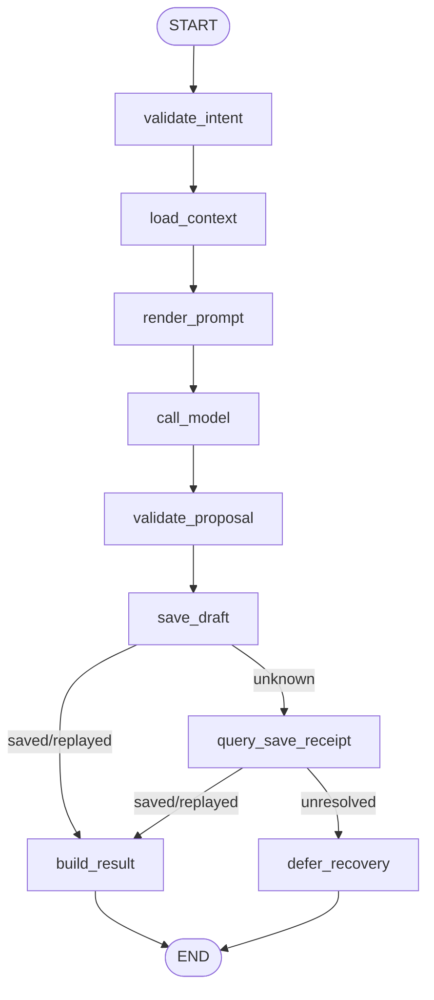
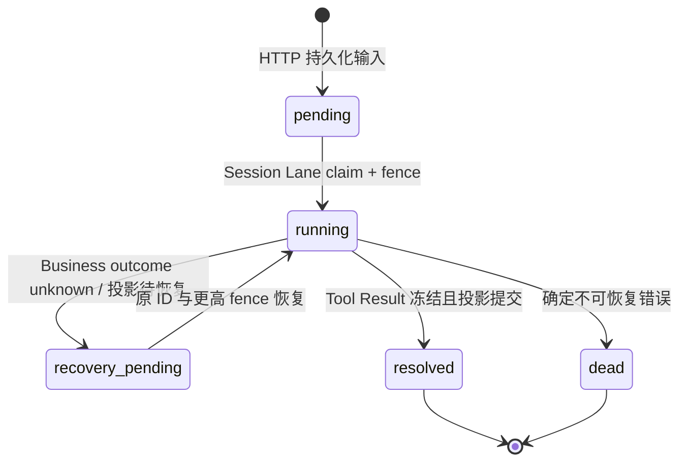
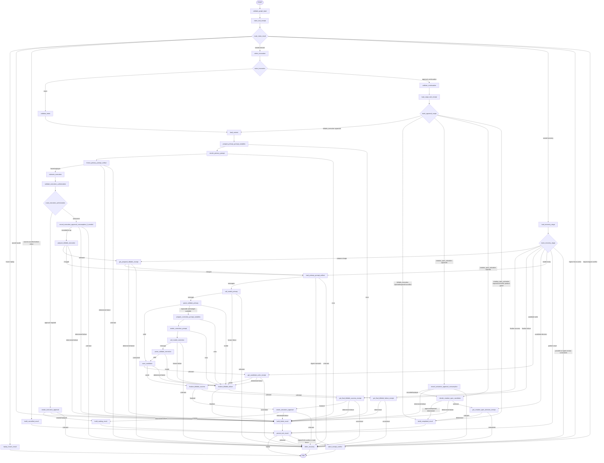
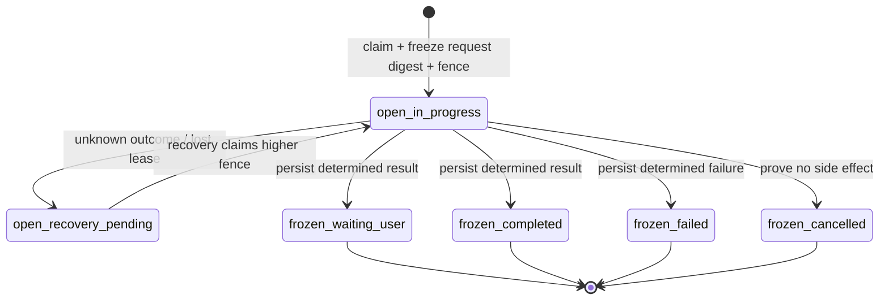
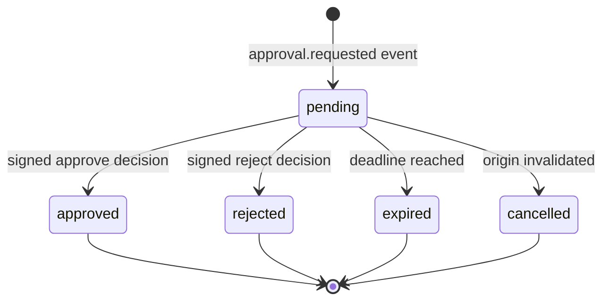
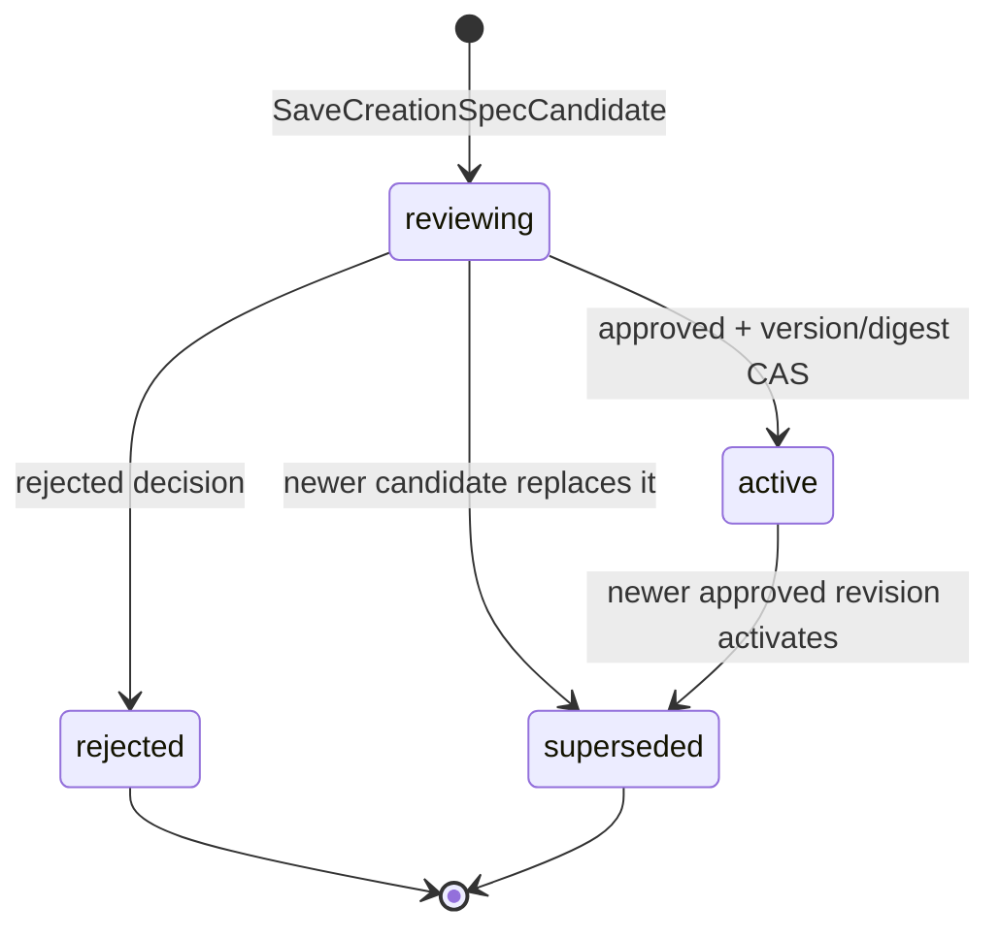

# `plan_creation_spec` Graph Tool 设计

> 状态：V1 开发预览范围已批准 / 完整生产范围仍为 Draft
>
> Graph Key：`plan_creation_spec_graph_v1`
>
> Tool Definition Version：开发预览 `plan_creation_spec.v1preview1`；生产目标 `plan_creation_spec.v1alpha1`
>
> Migration Owner：Business（CreationSpec），Agent（Run/Receipt/Approval）
>
> 实现门禁：允许实现本文第 0 节冻结的 V1 开发预览；计费、Approval、生产 availability 和第 1～12 节完整目标仍须另行评审。

关联需求：`graph-tool-requirements-overview.md` 的 `plan_creation_spec`、Creation Spec、计费、审批、幂等、A2UI 与全功能冒烟条目。共同契约见 [`../../cross-module/aigc-contract-catalog.md`](../../cross-module/aigc-contract-catalog.md)。

## 0. V1 开发预览设计冻结（2026-07-16）

本节落实[功能优先开发与试跑计划](../../../requirements/full-function-smoke-development-plan.md)的 V1 首条纵切，是当前可实施范围。若本节与第 1～12 节完整生产目标冲突，**仅对 `plan_creation_spec.v1preview1` 以本节为准**；生产版本仍以完整目标为准，不得用预览结论替代计费、Approval、安全或发布评审。

### 0.1 目标、边界与 availability

V1 只证明以下用户价值：用户在真实 Project Workspace 提交创作目标后，系统经持久化 Session Lane、Eino Runner 和可执行 Graph Tool 生成一份严格结构化的 CreationSpec Draft，并通过 Event/SSE/Card 展示和恢复。

V1 保留的架构不变量：

- Business PostgreSQL 是 CreationSpec Draft 唯一真源；Agent 不保存或直写 Business 领域表；
- HTTP 只鉴权、校验、持久化输入和唤醒，Processor 必须经 Session HOL、Lease/Fence 和 Eino Runner 执行；
- 项目只有一个 `ChatModelAgent`，`plan_creation_spec` 是启动时预编译并注册的高层 Graph Tool；
- 模型只生成 Proposal，独立确定性 Validator 通过后才能调用 Business Command；
- Tool/Input/Business Command 使用稳定幂等键；同键同义重放、同键异义冲突；Unknown Outcome 先查询原键，权威 `not_found` 只有在完整规范命令已加密持久化且有重发预算时才允许有界重发同一键，禁止换键；
- Agent Tool Result 先冻结，再投影 Event/Card；投影失败不得重调模型或重写 Business Draft；
- 跨 Module 只使用版本化 Kitex/Thrift DTO，不引用其他 Module 的 `internal` 包。

V1 明确不实现：扣费、收益、模型执行 Approval、激活 Approval、Correction、媒体任务、公开发布和生产 DeepSeek 默认启用。Draft 状态固定为 `draft`，不得冒充 `active`。生产 Catalog 继续 `unavailable`；仅在 Business 与 Agent 都显式配置 `DORA_AGENT_PLAN_SPEC_PREVIEW_ENABLED=true` 时向已鉴权 Workspace 暴露 `preview` 入口，缺少配置必须让 BFF、Agent Processor 与 Business Preview RPC 全部失败关闭，且生产环境禁止启用。

浏览器同源入口固定为 `POST /api/v1/agent/sessions/:session_id/creation-spec-previews`；Business 重新编码严格 DTO 后调用 Agent 内部唯一目标 `POST /internal/v1/workspaces/sessions/:session_id/creation-spec-previews`，内部 Scope 固定为 `creation_spec.preview.write`。两个路径不得混用或接受 Query。

V1 Preview Processor 只消费新 `source_type=creation_spec_preview` 输入，不得 Claim、跳过、改型或终结既有 `user_message`。因此本地 Preview 开关开启时，首页 QuickCreate 把 `initial_prompt` 显式延后为 `null`，原目标只在前端进程内按 `project_id` 一次性交给 Workspace 表单，用户确认后才持久化 Preview Intent；不得写入 URL、History state、`localStorage` 或 `sessionStorage`。对已经存在非终态非 Preview Input 的 Session，Agent 必须在任何计数器、Message、Input、Run、Receipt 或 Event 写入前返回 `409 SESSION_LANE_BLOCKED`（不可重试），不能返回一个永远排队的伪 202。完整 `user_message` Runtime 或显式 supersession 契约进入后续阶段，不得用原地修改旧 Input provenance 的方式偷渡。

### 0.2 最小严格 DTO

`PlanCreationSpecPreviewIntentV1` 只允许以下字段，所有 object 使用 strict decoder，拒绝未知字段、重复键、显式 `null`、尾随 token、非法 UTF-8 和非 NFC 字符串：

| 字段 | 类型 | 规则 |
|---|---|---|
| `schema_version` | string | 必填且固定 `plan_creation_spec.preview.intent.v1` |
| `goal` | string | 必填，NFC 后 1～2000 字符 |
| `deliverable_type` | enum | 必填，仅 `video/image_set/audio/mixed` |
| `audience` | string | 可省略，NFC 后最多 500 字符；省略与空字符串不同 |
| `locale` | enum | 必填，仅 `zh-CN/en-US` |
| `constraints` | string[] | 必填，可为空，最多 8 项；每项 1～200 字符，规范化后精确去重 |

`user_id/project_id/session_id/input_id/turn_id/run_id/tool_call_id/idempotency_key/fence_token` 均由服务端可信上下文注入，不得进入模型可控 Schema。

模型输出 `CreationSpecPreviewProposalV1`，只包含：

| 字段 | 类型 | 规则 |
|---|---|---|
| `schema_version` | string | 固定 `creation_spec.preview.proposal.v1` |
| `title` | string | 1～80 字符 |
| `goal` | string | 1～2000 字符，必须保留用户目标语义 |
| `deliverable_type` | enum | 必须等于 Intent |
| `audience` | string | 最多 500 字符 |
| `phases` | object[] | 1～6 项；每项固定 `key/title/objective/output`，key 唯一且匹配 `phase_[1-6]` |
| `constraints` | string[] | 最多 8 项，必须包含 Intent 的全部硬约束 |
| `acceptance_criteria` | string[] | 1～8 项；每项 1～240 字符且可验证 |

Proposal 禁止出现资源 ID、用户 ID、价格、余额、状态、Approval、Provider、Prompt、Receipt 或任意服务端摘要。Validator 注入 `schema_version=creation_spec.draft.v1`、`status=draft` 和规范化摘要后才形成 `CreationSpecDraftV1`。

`PlanCreationSpecPreviewResultV1` 只允许：

- 成功：`status=completed`、`result_code=CREATION_SPEC_DRAFT_CREATED`、`resource_ref{id,version,digest,status=draft}`、`receipt_ref`；
- 确定失败：`status=failed`、稳定 `result_code`、安全中文 `summary`、`retryable`、`receipt_ref`；
- Unknown Outcome：不冻结 Result，Run 保持 `recovery_pending`，由同一 Business command key 查询后再收口。

### 0.3 Business RPC 冻结

Business Owner 的 Foundation IDL 在 V1 增加三组 Preview v1 方法；Preview 后缀明确其兼容和发布级别，后续生产方法使用新方法名/字段号：

| RPC | 作用 | 幂等/一致性 |
|---|---|---|
| `GetCreationSpecContextPreviewV1` | 校验 `user_id/project_id` Owner，并返回 Project ID/version 与最小安全标题 | 只读；不存在和跨 Owner 统一 `NOT_FOUND` |
| `SaveCreationSpecDraftPreviewV1` | 保存 Validator 产出的规范化 Draft JSON | `command_id` first-write-wins；同 digest 重放，异 digest `IDEMPOTENCY_CONFLICT` |
| `QueryCreationSpecDraftCommandPreviewV1` | 消除保存 RPC 的 Unknown Outcome | 只按原 `command_id + request_digest` 查询；`not_found` 不授权换键，但在 Agent 已持久化完整原命令且有重发预算时可有界重发同一键 |

这三组 RPC 是本地 Development Preview 临时子集，受 Business 开关再次保护；关闭时稳定返回不可重试 `FEATURE_DISABLED`。当前没有独立 Agent→Business caller authentication，不得用于共享或生产环境。正式服务身份认证、TLS、网络最小权限和生产 RPC Owner 在 P1 完成，详见 [`foundation-rpc-v1`](../../cross-module/foundation-rpc-v1.md)。

Business 表至少保存 `id/project_id/user_id/status/version/schema_version/content_json/content_digest/source_tool_call_id/created_at/updated_at`；状态只允许 `draft`，应用生成 UUIDv7，所有字段有中文 COMMENT，无物理外键。`content_json` 是严格 DTO，不保存 Prompt、模型 reasoning 或 Provider 原文。

### 0.4 Runner 与 Graph 拓扑

该 Graph 是无环 DAG，启动时使用 `compose.AllPredecessor` 编译并复用，不需要 fan-in、循环、ToolsNode、Interrupt 或 Checkpoint。Prompt、模型、Validator、Business Command 必须是独立 Node；`graph.go` 只组装拓扑。

| Node Key | 分类 / Eino 实现 | 单一职责 | 副作用与失败 |
|---|---|---|---|
| `validate_intent` | guard / `AddLambdaNode` | strict decode、规范化和 Intent digest | 无副作用；非法输入确定失败 |
| `load_context` | query / `AddLambdaNode` | 调 Business 校验 Owner/Project version | 只读 RPC；NOT_FOUND/版本错误确定失败 |
| `render_prompt` | prompt / `AddChatTemplateNode` | 用版本化模板生成 classic Messages | 无副作用；模板错误确定失败 |
| `call_model` | inference / `AddChatModelNode` | 生成一个 Proposal Message | V1 默认 FakeModel；ModelReceipt first-write-wins |
| `validate_proposal` | validator / `AddLambdaNode` | strict parse、枚举/长度/阶段/约束闭合校验 | 无副作用；失败不得进入 Command |
| `save_draft` | command / `AddLambdaNode` | 以稳定 command ID 调 Business 保存 Draft | Business 写；unknown 只能查询 |
| `query_save_receipt` | query / `AddLambdaNode` | 查询原保存命令权威结果 | 只读；未确定进入 recovery_pending |
| `build_result` | transform / `AddLambdaNode` | 构造严格成功 Result | 无外部副作用 |
| `defer_recovery` | command / `AddLambdaNode` | 保留 open Run/Receipt 和恢复阶段 | 仅 Agent DB 状态写，不发布伪终态 |

开发 FakeModel 仍实现 Eino `model.BaseChatModel`，返回与输入目标相关的确定性 Proposal；它不是绕过 Graph 的硬编码业务 Command。后续 DeepSeek Adapter 必须注入同一 Node 接口，不能改变 Validator 或 Business Command 语义。

### 0.5 Typed State 与状态机

`PlanCreationSpecPreviewStateV1` 固定字段：`trusted_context`、`intent`、`intent_digest`、`domain_context`、`prompt_messages`、`model_message`、`proposal`、`validation_report`、`draft`、`business_command_receipt`、`result`、`error`。State 仅存在于单次 Graph 调用；持久化只保存 ID/version/digest/ref，不保存完整 Prompt、reasoning 或数据库连接。

Business CreationSpec 的 V1 状态机只有 `不存在 → draft`；重复命令重放原 Draft，不创建第二个版本。Agent Input/Run/ToolReceipt 与 Business Draft 是不同状态空间，不得互相推断或压平。

### 0.6 持久化、幂等和恢复

- HTTP 使用客户端幂等键建立 first-write-wins 入队回执；首次写入冻结稳定 `input_id/tool_call_id/business_command_id`，同义重放先只读返回原 Input，不能依赖新的内容加密、随机 ID 或时钟；最终并发竞态仍由入队事务收敛；
- Session Lane 只领取每个 Session 最小未决 `enqueue_seq`，并同时校验 Session lease 和 Input fence；
- 入队事务锁定 Session sequence 后检查非 Preview 未决前驱；命中时以 `SESSION_LANE_BLOCKED` 零增量失败，禁止跳过 HOL 或改写旧 `user_message` 的 `source_type/source_id/message_id/input_id`；
- ModelReceipt 在调用前冻结 request digest，已有完整响应时重放，避免 Agent 投影失败后再次调用模型；
- Business Command digest 固定为 `SHA-256(JSON)`，Schema 为 `creation_spec.preview.save-draft.digest.v1`；JSON 字段顺序严格是 `schema_version,user_id,project_id,expected_project_version,tool_call_id,prompt_version,validator_version,content`，其中 Content 顺序严格是 `title,goal,deliverable_type,audience,locale,phases,constraints,acceptance_criteria`，Phase 顺序严格是 `key,title,objective,output`；禁止使用 Map、易变时间、command_id 或 Run attempt 参与摘要；Agent/Business 必须共同通过 [`creation_spec_preview_save_digest_v1.json`](../../cross-module/testdata/creation_spec_preview_save_digest_v1.json) 固定向量；
- Business 保存成功后 Agent 冻结 Tool Result/Resource Ref，再在同一 Agent 事务写 Projection/Event 并 resolve Input；
- 崩溃恢复优先读 Agent Receipt 和 Business Query，不重新渲染 Prompt、调用模型或创建 Draft；
- Event 只携带安全 Card DTO 和 Resource Ref；完整 Draft 由版本化 Resource Read 或 Snapshot Projection 恢复。

当前实现已增加 `creation_spec.preview.durable-draft-command.v1` 恢复账本：`PrepareCommand` 加密持久化完整严格 Draft Command、payload digest 与 key version，并按 Receipt 冻结重发上限。恢复先以原 `command_id + request_digest` Query；只有 Business 权威 `not_found` 才由当前 Fence 在行锁/CAS 下领取一次预算并重发解密后的同一命令，可信 Owner/Fence 从当前执行上下文重建而不进入持久化命令。技术 Query 失败保持 query-only；最终权威 `not_found` 才冻结 `business_resend_exhausted`，Input 继续保持 `recovery_pending` 以维持 HOL。Graph/Repository 测试已覆盖同键重发、技术失败不误耗尽、重启解密、预算 CAS 和 exhausted Claim/HOL；canonical Smoke 还会在停止正式 Agent 后，以真实 PostgreSQL、全新 AEAD/Repository 实例、正式 `CompiledGraph.Recover` 和测试侧脚本化 Business adapter 验证 technical→`not_found`→同键重发→exhausted/HOL，并只把布尔/计数写入 0600 Evidence。该探针的静态契约和无 DSN 编译/skip 已通过，真实执行 Evidence 仍是 V1 退出门槛。

V1 的确定性 FakeModel 没有外部财务或 Provider 副作用，但当前遗留 `pending` Model Receipt 在新 Fence 下仍可能重新执行模型。接入真实 DeepSeek 前，必须引入稳定 Provider 请求键与可查询的 `model_unknown` 恢复阶段；未证明首次调用未发生时不得直接重调。该项是 V2 真实模型接入门禁，不影响本地 FakeModel 预览的边界说明。

### 0.7 安全、测试与评审结论

V1 浏览器入口继续使用 Business 同源 Session、CSRF、Project Owner 校验和 Business→Agent 短期签名身份断言；Agent 不信任前端传入的 User/Project/Session 绑定。当前断言只绑定身份、方法、路径与 Scope，尚未把规范 `Idempotency-Key` 和正文 SHA-256 纳入签名，因此即使双端开关打开也只允许 local-only Preview；共享或生产环境必须先版本化升级 assertion，并在完整静态绑定校验后消费 Nonce。Agent→Business Preview RPC 同样是明确标记的本地开发限制，不得描述成已完成服务认证。普通日志只记录 ID/version/digest、Node Key、状态和耗时。

V1 必测：strict DTO 边界、FakeModel 正常/非法输出、Validator、Graph Compile/Node exact-set、同键重放/异义冲突、重放不调用内容保护器/随机源、Business 保存响应丢失、投影失败重放、Session HOL/Fence、非空 QuickCreate predecessor 的 `SESSION_LANE_BLOCKED` 零增量、空 QuickCreate 正向链、跨 Owner、CSRF、SSE 重连、硬刷新和 Agent 重启。完整计费、Approval、Correction、真实模型失败矩阵进入 P1。

- [x] 产品范围：用户已确认“主要功能优先、生产细节后置”，V1 固定只产出 Draft；
- [x] Business：Owner、Migration、RPC、幂等与 Draft 状态已冻结；
- [x] Agent：Runner、Graph、Validator、Receipt、Event 与恢复边界已冻结；
- [x] 前端/测试：Preview 入口、Card 和 V1 验收路径已冻结；
- [x] 财务：V1 无计费、无收益、无退款，不适用；
- [x] 安全：同源入口与当前 Business→Agent 身份断言已冻结为 local-only Preview；正文/幂等键签名绑定与 Agent→Business 服务认证均未完成，生产安全不被视为已通过。

**V1 评审结论：Approved for Development Preview。** 该结论只授权 `plan_creation_spec.v1preview1`，不授权生产 availability 或第 1～12 节完整生产流程。

## 1. 场景、目标与边界

适用场景：用户基于项目目标、已发布 Skill、已有素材和可选旧版 Creation Spec，生成或修订一份可审核的创作规划。

目标：

- 生成结构化、可验证、可版本化的 Creation Spec 候选；
- 先完成正式预算授权和扣费，再调用 ChatModel；
- 保存候选后创建独立的激活 Approval，由新可信 Continuation Turn 幂等处理决策；
- 向 A2UI 输出稳定 Card/Resource 引用，不把完整 Spec 塞回模型上下文。

非目标：

- 不分析素材完整语义，不创建 Storyboard、正式 Prompt、媒体 Job 或导出；
- 不允许模型修改权限、余额、计费规则、Published Skill Snapshot、审批或资源版本；
- 不在 Graph 内等待用户，不用 Checkpoint 表示 Approval、ToolReceipt 或 CreationSpec 状态；
- 不创建异步 Generation Operation/Batch/Job，因此本 Tool 不返回 `accepted`。

权威来源：项目、Skill Snapshot、CreationSpec 归 Business PostgreSQL；Run、Tool/Model Receipt、Approval、A2UI EventLog 归 Agent PostgreSQL；Redis 只通知。Checkpoint 只用于 PostgreSQL 技术恢复，不能成为业务事实来源。

### 1.1 需求追踪

| 类型 | ID |
|---|---|
| Tool 主验收 | `GTL-PLAN-001` |
| 共通 Graph Tool | `GTL-USE-002`、`GTL-VER-001`、`GTL-IDEM-001`、`GTL-BILL-001`、`GTL-EARN-001`、`GTL-SEC-001` |
| 全功能冒烟 | `SMK-009`、`SMK-021`、`SMK-023`、`SMK-033`、`SMK-034` |

## 2. 调用、Intent 与结果契约

### 2.1 两类调用入口

内部 `PlanCreationSpecGraphInputV1` 是严格判别联合，只允许以下一种形态：

| `invocation_kind` | 输入 | 信任边界 |
|---|---|---|
| `intent` | `TrustedCommandContextV1 + PlanCreationSpecIntentV1` | Intent 来自 Tool 参数；身份、版本、预算授权等只来自可信上下文 |
| `approval_continuation` | `TrustedCommandContextV1 + ApprovalContinuationResultV1` | 仅由 Agent 审批续接器签名注入，不属于 Tool Schema，不接受用户文本或模型构造 |

Continuation 创建新的 `turn_id/run_id/graph_run_id`，但复用原 `tool_call_id`，二者始终表示同一个逻辑 ToolCall；禁止为 Continuation 生成新的逻辑 `tool_call_id`。原 Receipt 使用共同主键 `(session_id, original_turn_id, tool_call_id)`；Continuation 的逻辑子 Receipt 键为 `(continuation_turn_id, original_tool_call_id)`，落库时补齐 session 成为 `(session_id, continuation_turn_id, original_tool_call_id)`，其中 `original_tool_call_id == tool_call_id`，并保存 `parent_receipt_ref`。同一稳定 `source_id` 必须解析为同一组 continuation turn/run/graph run 和同一原 `tool_call_id`。

原 ToolReceipt 只保存 `frozen_input_ref + digest`；该引用指向 Agent PostgreSQL 中加密、受行级授权和保留期保护的不可变 ToolCallInput 记录，记录冻结规范化 Intent、Tool Definition Version、Intent Schema Version、semantic digest、原授权主体和资源引用。Continuation 子 Receipt 冻结签名决策输入，并按 `parent_receipt_ref` 读取原冻结 Intent。Continuation 不接收新 Intent，也不让模型重新生成参数；用户修改意图必须创建新的普通 ToolCall，并使旧 Approval 失效或被拒绝。

子 Receipt 的 `request_semantic_digest = digest(signed_decision, continuation_causal_ids, parent_request_semantic_digest)`，因包含新 turn/run/source 等因果 ID，不可能逐字等于 parent digest。它必须显式保存 `parent_request_semantic_digest`；实际 Intent、Tool/Schema/Prompt Pin、输入资源基线、execution digest 派生输入和 Business 幂等输入全部从 parent 继承，新 turn/run/graph run 不得参与 execution digest、Candidate/Charge/Decision 业务幂等键或改变模型参数。

### 2.2 `PlanCreationSpecIntentV1` strict schema

所有对象均使用 strict decoder：只接受一个 JSON object，拒绝未知字段、重复键、尾随 token、显式 `null`、非法 UTF-8、非规范 ID、越界值和类型隐式转换。字符串按版本化 Input Policy 做长度、控制字符和 NFC 校验；数组按配置上限校验并保持语义顺序，集合型 ID 去重。限制值必须来自本 Tool Definition/Runtime Policy，不硬编码在 Prompt。

共同字段：

| 字段 | 类型 | 规则 |
|---|---|---|
| `schema_version` | string | 必填且只能为 `plan_creation_spec_intent.v1` |
| `mode` | enum | 必填；仅 `create/revise` |
| `goal` | string | 必填；非空；只是用户目标，不是领域事实 |
| `deliverable_type` | enum | 必填；只接受服务端版本化枚举 |
| `audience_hint` | string（可省略） | 用户提示，不作为事实；省略与空字符串含义不同 |
| `style_hint` | string（可省略） | 不得覆盖 Published Skill 硬约束 |
| `constraints` | string[] | 必填，可为空；逐项限长、精确去重，冲突由确定性 Validator 报告 |
| `reference_asset_ids` | UUIDv7 string[] | 必填，可为空；规范小写格式、去重、保持用户顺序，逐项校验项目归属和版本 |

模式不变量：

| `mode` | 额外必填字段 | 必须拒绝的字段 |
|---|---|---|
| `create` | 无 | `baseline_creation_spec_id`、`expected_baseline_version`、`revision_instruction` |
| `revise` | `baseline_creation_spec_id: UUIDv7`、`expected_baseline_version: uint64 >= 1`、`revision_instruction: string` | 无；三者缺一即拒绝 |

`user_id/project_id/session_id/turn_id/run_id/graph_run_id/tool_call_id/approval_id/budget_authorization_id/deadline` 均不属于 Intent，只能由 `TrustedCommandContextV1` 注入。校验失败必须在 Business RPC、审批创建和扣费之前结束。

### 2.3 权威上下文

`BIZ-AIGC-001 GetGraphToolContext` 返回 Project、Published Skill Snapshot、旧 CreationSpec 摘要、授权素材摘要及明确的 ID/version/digest。Prompt 只接收完成本次规划所需的最小白名单字段；对象存储 URL、Secret、价格、权限规则、Approval 与内部 Receipt 不进入模型。`revise` 的基线 ID/version 不匹配时，在估价和扣费前返回 `VERSION_CONFLICT`。

### 2.4 `CreationSpecCandidateProposalV1` / `CreationSpecCandidateV1` strict schema

ChatModel 只能输出 `CreationSpecCandidateProposalV1`，不能输出领域 ID、状态、权限、价格、Approval 或 Receipt。strict parser 先生成 proposal；独立 Validator 校验并仅注入服务端字段后，才得到可保存的 `CreationSpecCandidateV1`。两者共享下表字段，只有明确标为服务端注入的子字段不允许出现在模型 JSON 中：

| 字段 | 类型 | 主要不变量 |
|---|---|---|
| `schema_version` | string | 只能为 `creation_spec_candidate.v1alpha1` |
| `goal` | string | 非空，不得把推断冒充已验证事实 |
| `audience` | object | 仅版本化 persona/needs 白名单字段 |
| `deliverable` | object | 类型必须等于 Intent；规格只能取服务端允许值 |
| `phases` | object[] | 非空、有序；阶段 local key 唯一，含目标、产出和完成条件 |
| `dependencies` | object[] | source/target 只能引用 `phases` local key；无自环、无环、无悬空引用 |
| `structure` | object[] | 非空、有序；每项 stable local key 唯一且引用闭合，并归属一个阶段 |
| `style` | object | 不得违反 Published Skill 硬约束 |
| `constraints` | object[] | 必须保留已确认硬约束，并标注可验证来源类型 |
| `material_usage` | object[] | 只能引用已授权 `reference_asset_ids` 及返回版本/digest |
| `budget_scope` | object | 仅表示规划估算范围、工作量单位和服务端 `budget_policy_ref`；不得包含真实价格、点数余额、扣费或授权结论 |
| `acceptance_criteria` | object[] | 非空、可验证，不得含模型执行命令 |
| `pending_confirmations` | object[] | 必填，可为空；每个待确认项含稳定 local key、非空问题、原因、阻塞阶段和允许的回答类型 |
| `assumptions` | string[] | 推断必须显式在此列出，不得混入事实字段 |

各嵌套对象也必须 `additionalProperties=false`，枚举、必填项、数组/item/string 上限由 Candidate Schema Version 固化。模型只能提出 `budget_scope.planning_range/workload_assumptions`；`budget_policy_ref` 由 Validator 使用冻结 Runtime Policy 确定性注入，模型若输出该字段、货币/点数价格或授权结论必须拒绝。该范围是创作计划估算，不是 `execution_quote`、真实价格、余额、扣费指令或 Budget Authorization。解析器拒绝 Markdown fence、自然语言前后缀、第二个 JSON 值、重复键和非整数数值。字段清单、嵌套 DTO 与精确上限尚需产品/Business 在评审时冻结，冻结前不得生成 IDL 或代码。

### 2.5 `GraphToolResultV1` 的本 Tool 约束

结果仍使用共同 `GraphToolResultV1`，但本 Tool 增加以下 strict status/field invariant：

| `status` | 适用路径 | 必须字段 | 禁止字段 |
|---|---|---|---|
| `waiting_user` | 等待模型执行授权；或候选已保存、等待激活 | `result_code/summary/approval_ref/receipt_ref`；后者另有 Candidate `resource_ref` | `operation_ref`；执行授权路径还禁止 Candidate `resource_ref` |
| `completed` | Continuation 已幂等处理并得到确定结果 | `result_code/summary/receipt_ref`；激活成功/拒绝按结果携带 Candidate `resource_ref` | `approval_ref/operation_ref` |
| `failed` | 所有副作用结果均已确定后的确定性失败 | `result_code/summary/receipt_ref/retryable` | `approval_ref/operation_ref`；除已确认保存成功外不得宣称 Candidate 生效 |
| `cancelled` | 仅在任何扣费/写候选副作用前取消 | `result_code/summary/receipt_ref` | `approval_ref/operation_ref/resource_ref` |

`accepted`、`partial` 对本 Tool 非法；`operation_ref` 永远为空。结果只返回稳定 code、摘要、Resource/Receipt Ref 和允许的 warning code，不返回模型原文或完整 Candidate。

任何 RPC、模型、Receipt 或发布动作出现 `UNKNOWN_OUTCOME` 时，都不得构造 `failed/cancelled` 结果，也不得冻结 ToolReceipt。Receipt 必须保持 `write_state=open`、切换为 `execution_phase=recovery_pending`，且 `result_status` 为空；调用方通过 Receipt 查询/非终态 A2UI 事件观察恢复中，不获得伪造的 `GraphToolResultV1`。只有当前有效最高 fence 的恢复执行者查清所有权威结果后，才能重新进入 `in_progress` 并冻结确定结果。

## 3. Typed Graph State

Graph State 为 `PlanCreationSpecStateV1`，只在单次 Graph 调用中有效。

| State 字段 | Owner/来源 | 写节点 | 持久化与不变量 |
|---|---|---|---|
| `trusted_context`、`graph_input` | Agent 初始化器 | 初始化器 | Run 引用；不可被 Intent/模型覆盖 |
| `tool_receipt_claim` | Agent ToolReceipt | `claim_tool_receipt` | 含 key、`write_state/execution_phase/result_status`、lease 和单调 fence；仅当前最高 fence 可执行副作用、恢复或冻结 |
| `origin_frozen_input` | Agent ToolCallInput 权威记录 | `load_origin_tool_receipt` | Continuation 专用；ToolReceipt 只给出 ref/digest；加密记录含冻结 Intent/definition/schema/semantic digest，鉴权验签后只读 |
| `intent`、`intent_digest` | Tool Schema 或冻结输入 | `validate_intent` | 原文仅进受保护输入存储；日志只记 digest |
| `approval_continuation` | Agent Approval 续接器 | `validate_continuation` | 必须校验 source、actor、scope、decision version、签名与 origin binding |
| `domain_context` | Business | `load_context` | State 中是最小快照；持久化只保留 Resource Ref/version/digest |
| `execution_quote`、`execution_digest` | Agent Policy + Business | `estimate_execution` | 固定绑定 model/prompt/budget/input/resource digests；价格不进 Prompt |
| `execution_authorization` | Agent Budget Authorization 或 Approval Receipt | `validate_execution_authorization` | 只表达可否执行；与 Approval 权威状态分离 |
| `charge_receipt` | Business | 计费节点 | Business 权威，Agent 只存引用；成功前禁止调用模型 |
| `prompt_messages` | Agent Prompt Node | `render_*_prompt` | `[]*schema.Message`，不作为领域事实持久化 |
| `primary_prompt_artifact` | Agent 加密短期工件 | `freeze/load_primary_prompt_artifact` | 主 Prompt 在扣费前冻结；ref/digest/token count append-once 写 `execution_refs.prompt_artifact`，原文不进日志、普通 Receipt 或 Checkpoint |
| `model_message`、`candidate_proposal`、`candidate` | ChatModel / Agent Validator | `call_model_*`、`parse_validate_*` | 模型先输出 `*schema.Message`；parser 写 proposal，Validator 校验阶段/依赖并注入 `budget_policy_ref` 后才写 Candidate |
| `validation_report` | Agent Validator | `parse_validate_*` | 稳定错误码，不含自由裁决 |
| `saved_candidate` | Business | `save_candidate`/恢复查询 | ID/version/digest 齐全才可创建激活 Approval |
| `approval` | Agent | Approval 节点 | Approval 权威状态；不得与 `waiting_user/reviewing` 混用 |
| `approval_consumption_receipt` | Agent | `record_*_approval_consumption` | 仅 approved 路径存在；唯一 `ApprovalConsumptionReceiptV1`，不改变 `approved` 状态，同 key 同 digest 重放、异 digest 冲突 |
| `billable_outcome` | Agent + Business Receipt | finalize/query 节点 | 每次收费执行只 Finalize 同一 receipt/key |
| `execution_refs` | Agent ToolReceipt（open） | PromptArtifact/Quote/Approval/Charge/Model/Validator/Write/Finalize/Decision 节点 | 仅当前 fence 按稳定命名槽位 CAS append-once；同槽同 digest 重放、异 digest abort；open 恢复只读这些引用 |
| `result`、`error` | Agent | Result 节点 | strict result 校验后由 `persist_tool_result` 从 `execution_refs` 投影 `result_refs`，并一次写 `result_digest/result_status` 做 `open -> frozen`；recovery_pending 禁止写结果 |

State 禁止放 Provider Client、数据库连接、完整二进制、永久签名 URL、价格规则或长期 Approval 状态。

## 4. Graph 拓扑与 Continuation 处理

该图是无环 DAG；`graph.go` 只注册 Node/Edge/Branch 并以 `AllPredecessor` 编译。普通调用和 Continuation 都从 START 进入，但 Continuation 永不从用户消息重建 Intent：

- `validate_graph_input` 在 claim 前以纯函数完成 strict decode、拒绝重复/未知字段并做 canonical normalization，不读取外部状态、不写库；因此 `claim_tool_receipt` 可作为第一个持久化/副作用节点，按 `(session_id, turn_id, tool_call_id)` 原子创建或认领 open Receipt、分配单调 fence，并一次冻结只含规范化 Intent/Continuation、可信上下文、Tool Pin 和输入资源基线的 `request_semantic_digest`。open 阶段后生成的 PromptArtifact、Quote、Approval、Charge、Model、Validator、Write、Finalize、Decision 等只能由当前 fence CAS append-once 到命名 `execution_refs` 槽位，永远不得回写 request digest。
- frozen Receipt 直接走 `replay_frozen_result`，不进入 Business、模型、Approval 或发布副作用；open Receipt 只有当前有效最高 fence 可继续。unknown outcome 走 `defer_recovery`，保持 open/recovery_pending；恢复者取得更高 fence 后只从 `route_recovery_stage` 查询原权威结果。
- Primary Prompt 必须在 `estimate_execution`、执行 Approval 和 Charge 前完成 prepare/render，并把加密短期 Prompt Artifact ref、messages digest 和精确 token 计数写入 `execution_refs.prompt_artifact`；模板/变量错误在扣费前确定失败。quote/execution digest 绑定该 artifact digest/token 计数。Charge 后只加载同一 digest 的 artifact 调 Model，不再渲染主 Prompt；Correction Prompt 仍在 Charge 后，错误必须进入 failure Finalize。
- `billable_execution` approved：Continuation 子 Receipt 加载 parent 冻结输入，重新读取权威上下文并重算但必须得到与 Approval 绑定相同的 execution digest；新 causal IDs 只进入 child request digest，不参与 execution digest、Intent、Tool Pin 或 Business 幂等键。完全匹配后才 first-write-wins 创建唯一 `ApprovalConsumptionReceiptV1` 并扣费推理。Approval 仍为 `approved`；上下文漂移则确定失败并要求新的普通 ToolCall。
- `billable_execution` rejected/expired/cancelled：不扣费、不调模型，以确定的 `completed` code 结束 Continuation；原 ToolReceipt 保持 `waiting_user`。
- `creation_spec_activation`：仅 approved 先创建唯一 Consumption Receipt，再按 Approval 绑定的 Candidate ID/version/digest 调 `BIZ-AIGC-008`；Approval 保持 `approved`。rejected 不创建 Consumption Receipt，直接依赖不可变 Decision Receipt。当前 test-only 候选复用 child `business_decide` prepared slot 的 `tr:<child_receipt_id>:business_decide:v1` 幂等身份，并同时绑定 Decision ID/digest、presented/resulting Approval version 与 Candidate guard；正式 Owner Approved 前不得作为生产键。expired/cancelled 的产品语义冻结前不得实现。
- Validator valid 后必须先保存 Candidate；只有 `BIZ-AIGC-007` 或同键查询确定 saved，才可 `FinalizeBillableExecution(success)`，财务 success 又确定后才能创建激活 Approval。Candidate 保存确定失败走 failure Finalize；Candidate 已保存但 success Finalize 未知时保持 open/recovery_pending，不得提前创建 Approval 或冻结结果。
- Consumption Receipt 共同键为 `(approval_id, consumption_key)`；本 Tool 的 `consumption_key` 由 `resulting_approval_version + effect_kind` 稳定派生，不存在 `decision_version`。digest 绑定 source/parent Receipt、主体、scope/action、definition/schema version 以及 execution 或 Candidate version/digest。同键同 digest返回原回执，异 digest 返回 `IDEMPOTENCY_CONFLICT`。
- `persist_tool_result` 是唯一结果发布点：只在所有 outcome 已确定时，从 `execution_refs` 的允许槽位确定性投影 `result_refs`，与 canonical Result 一次计算/write `result_digest/result_status` 并 CAS `open -> frozen`；冻结后两组 refs 均不可变。

## 5. 稳定 Node 清单与 Eino 映射

Dora “业务分类”只是设计分类，不是 Eino 特殊 Node 类型。实际 Node 仅包括：`guard/query/transform/validator/command` 使用 `compose.InvokableLambda` + `AddLambdaNode`，`prompt` 使用 `AddChatTemplateNode`，`inference` 使用 `AddChatModelNode`。`AddBranch` 是挂在源 Node 上的路由配置，不是 Node，因此只进入 5.1 Branch 清单。本 Graph 不使用 `ToolsNode`、子 Agent、DeepAgent、Interrupt/Resume 或长驻 Graph 栈。

下表凡标注 `W execution_refs.<slot>`，均表示 Node 产出权威 ref/digest 后，由 Runner Receipt Service 以当前 fence 做槽位 CAS append-once；不把持久化职责混入 Prompt/Inference/Validator 本身。同 slot 同 digest 重放，异 digest 或 stale fence 走 `abort_receipt_conflict`。

| Node Key | 中文名称 | 业务分类 | Eino 实现 | 单一职责 | 输入/输出 | State 读写 | 副作用/风险 | Invoke/Stream | 预算/回执 | 错误码/失败目标 | Checkpoint |
|---|---|---|---|---|---|---|---|---|---|---|---|
| `validate_graph_input` | 图输入校验 | guard | `compose.InvokableLambda` + `AddLambdaNode` | 纯函数 strict decode 与 canonical normalization，校验判别联合/可信上下文/deadline | GraphInput→CanonicalInput+ValidationReport | R graph_input；W canonical input/report | 无外部读写 | Invoke | Node deadline；canonical input digest | valid/invalid 均→claim | 否 |
| `claim_tool_receipt` | 认领并冻结 ToolReceipt 输入 | command | `compose.InvokableLambda` + `AddLambdaNode` | 按 Receipt key first-write/认领 open lease，分配 fence，冻结不可变 request semantic digest | CanonicalInput+Report→ClaimResult | R trusted_context/canonical input；W tool_receipt_claim/origin_frozen_input | Agent DB 首个写；并发与陈旧 worker 风险 | Invoke | DB deadline；ToolReceipt/lease/fence | frozen→replay；open→execute/recover；高 fence→defer；异 digest→abort 且不改原 Receipt | 可，仅 Receipt/ref/digest |
| `select_invocation` | 读取调用类型 | transform | `compose.InvokableLambda` + `AddLambdaNode` | 从已 claim 的 canonical input 产出 invocation kind | Claim+Input→InvocationKind | R claim/canonical input；W invocation kind | 无 | Invoke | Node deadline | 非法类型→failed | 否 |
| `load_recovery_stage` | 加载恢复阶段 | query | `compose.InvokableLambda` + `AddLambdaNode` | 当前最高 fence 读取 recovery stage 与 `execution_refs` | Claim→RecoveryStage | R claim/execution_refs；W recovery stage | Agent DB 只读；禁止改 stage/refs | Invoke | Recovery budget/fence | 未知 stage→defer | 可，仅 execution refs |
| `replay_frozen_result` | 重放冻结结果 | query | `compose.InvokableLambda` + `AddLambdaNode` | 校验 result digest 后原样返回 frozen Result | FrozenReceipt→GraphToolResult | R tool_receipt_claim；W result | 只读；不进任何 Graph 业务副作用 | Invoke | ToolReceipt/result digest | digest mismatch→安全告警，不执行 | 否 |
| `defer_recovery` | 延后未知结果恢复 | command | `compose.InvokableLambda` + `AddLambdaNode` | 当前 fence CAS 保持 open 并写 recovery_pending/stage；非 owner 不写 | Unknown/ClaimResult→Deferred | R claim/error/execution_refs；W execution_phase/recovery stage | Agent DB 写；不写 result 字段 | Invoke | Recovery lease/fence/execution refs | DB unknown→保持 open，由更高 fence 接管 | 可，仅 execution refs |
| `abort_receipt_conflict` | 中止 Receipt 冲突执行 | command | `compose.InvokableLambda` + `AddLambdaNode` | 对 request/result digest、CAS 或 stale-fence 冲突停止执行并追加安全审计 | Conflict→Aborted | R claim/result digests/fence；W audit ref | 仅审计，不修改/冻结 ToolReceipt | Invoke | Audit budget/ref | `IDEMPOTENCY_CONFLICT/STALE_FENCE`→END，无 Graph Result | 否 |
| `validate_intent` | 规划意图校验 | guard | `compose.InvokableLambda` + `AddLambdaNode` | 规范化 Intent 并计算 semantic digest | Intent→NormalizedIntent | R graph_input；W intent/digest | 无 | Invoke | Input Policy；冻结输入 ref | `INVALID_ARGUMENT`→failed | 否 |
| `validate_continuation` | 续接结果校验 | guard | `compose.InvokableLambda` + `AddLambdaNode` | 校验签名、source、scope、actor 和 decision version | Continuation→ValidatedDecision | R graph_input；W approval_continuation/execution_refs.approval_decision | 当前 fence append Decision ref；防伪造 | Invoke | Decision receipt ref | `APPROVAL_INVALID`→failed | 否 |
| `load_origin_tool_receipt` | 加载原调用冻结输入 | query | `compose.InvokableLambda` + `AddLambdaNode` | 按 origin call 加载 ref 并校验冻结输入 digest | OriginRef→FrozenInput | R continuation；W origin_frozen_input/intent | Agent DB 只读；敏感输入 | Invoke | RPC/DB deadline；ToolReceipt ref | `ORIGIN_RECEIPT_NOT_FOUND/DIGEST_MISMATCH`→failed | 可，仅 ref/digest |
| `load_context` | 加载业务上下文 | query | `compose.InvokableLambda` + `AddLambdaNode` | 调 `BIZ-AIGC-001` 校验权限、基线和资源版本 | ContextRef→DomainContext | R trusted_context/intent；W domain_context/execution_refs.context_snapshot | 当前 fence append RPC snapshot ref；越权/漂移 | Invoke | RPC deadline/count；RPC receipt | `PERMISSION_DENIED/VERSION_CONFLICT`→failed | 可，仅 execution ref |
| `estimate_execution` | 计算执行估算 | transform | `compose.InvokableLambda` + `AddLambdaNode` | 基于已冻结主 Prompt artifact/messages digest/token 计数生成 quote/execution digest | Context+PromptArtifact→Quote | R context/intent/execution_refs.prompt_artifact；W quote/execution_digest/execution_refs.quote | 当前 fence append-once Quote | Invoke | 精确 token + Runtime Budget/Policy ref | `BUDGET_POLICY_MISSING`→failed | 否 |
| `validate_execution_authorization` | 校验执行授权 | guard | `compose.InvokableLambda` + `AddLambdaNode` | 校验 Budget Authorization 或 Approval binding | Quote+Auth→AuthResult | R quote/context/approval；W execution_authorization/execution_refs.authorization | 当前 fence append授权 ref；权限风险 | Invoke | Authorization/Decision receipt | `APPROVAL_REQUIRED/INVALID`→branch/failed | 否 |
| `create_execution_approval` | 创建模型执行审批 | command | `compose.InvokableLambda` + `AddLambdaNode` | 原子创建 `pending` Approval 与 requested Outbox/Card | Quote→ApprovalRef | R quote/context/claim；W approval/execution_refs.execution_approval | Agent DB 写并当前 fence append-once | Invoke | DB deadline；ApprovalReceipt | determined error→failed；unknown→defer | 可，仅 execution ref |
| `record_execution_approval_consumption_if_needed` | 记录执行审批消费回执 | command | `compose.InvokableLambda` + `AddLambdaNode` | approved 路径按共同键首写回执；预算授权路径 no-op | Binding→ConsumptionReceipt | R approval/context/quote/claim；W approval_consumption_receipt/execution_refs.execution_consumption | Agent DB 写并当前 fence append-once | Invoke | DB deadline；`ApprovalConsumptionReceiptV1` | conflict/expired→failed；unknown→defer | 可，仅 execution ref |
| `prepare_billable_execution` | 准备计费执行 | command | `compose.InvokableLambda` + `AddLambdaNode` | 调 `BIZ-AIGC-003` 使用固定幂等键 | Digest+Auth→ChargeReceipt | R quote/auth/consumption；W charge_receipt/execution_refs.charge | 扣费；当前 fence append-once | Invoke | RPC/charge budget；ChargeReceipt | `INSUFFICIENT_POINTS`→failed；`UNKNOWN_OUTCOME`→query | 可，仅 execution ref |
| `get_prepared_billable_receipt` | 查询准备计费回执 | query | `compose.InvokableLambda` + `AddLambdaNode` | 调 `BIZ-AIGC-004` 消除 prepare 未知结果并补同槽 | ChargeKey→ChargeReceipt | R quote/claim/execution_refs.charge；W charge_receipt/execution_refs.charge | 只读权威后同槽重放/补写 | Invoke | RPC deadline/count；原 ChargeReceipt | charged→model；determined failure→failed；unresolved→defer | 可，仅 execution ref |
| `prepare_primary_prompt_variables` | 准备主 Prompt 变量 | transform | `compose.InvokableLambda` + `AddLambdaNode` | 扣费前构造类型化白名单和不可信数据边界 | Intent+Context→PromptVars | R intent/context；W prompt vars | 无；尚未 quote/Approval/charge | Invoke | Prompt input/token budget；input digest | `PROMPT_INPUT_INVALID`→failed | 否 |
| `render_primary_prompt` | 渲染主 Prompt | prompt | `AddChatTemplateNode` | 扣费前按稳定模板生成 classic Messages | PromptVars→`[]*schema.Message` | R prompt vars；W prompt_messages | 无；模板失败不扣费 | Invoke | Prompt key/version/digest/token count | `PROMPT_RENDER_FAILED`→failed | 否 |
| `freeze_primary_prompt_artifact` | 冻结主 Prompt 工件 | command | `compose.InvokableLambda` + `AddLambdaNode` | 加密保存短期不可变 Messages，append-once 写 artifact ref/digest/token count | Messages→PromptArtifactRef | R prompt_messages/claim；W primary_prompt_artifact/execution_refs.prompt_artifact | Agent DB 当前 fence CAS；禁止原文日志 | Invoke | DB deadline；PromptArtifactReceipt | determined failure→failed；unknown→defer | 可，仅 execution ref |
| `load_primary_prompt_artifact` | 加载主 Prompt 工件 | query | `compose.InvokableLambda` + `AddLambdaNode` | Charge 后按 execution digest 加载同一加密工件并验 digest | PromptArtifactRef→Messages | R execution_refs.prompt_artifact/quote/claim；W prompt_messages | Agent DB 只读；digest 漂移禁止模型调用 | Invoke | DB deadline；Artifact ref/digest | mismatch→abort；unknown→defer | 否 |
| `call_model_primary` | 主模型生成 | inference | `AddChatModelNode` | 生成一个完整 Proposal 消息 | Messages→`*schema.Message` | R prompt_messages/charge/claim；W model_message/execution_refs.model_primary | 已计费模型；当前 fence append-once ModelReceipt | Invoke；适配器可内部 Stream | Model/token/time budget；ModelReceipt ordinal=1 | known `MODEL_*`→finalize failure；`UNKNOWN_OUTCOME`→defer | 可，仅 execution ref |
| `parse_validate_primary` | 主候选解析校验 | validator | `compose.InvokableLambda` + `AddLambdaNode` | strict parse、阶段 DAG/引用/安全校验并注入 policy ref | Message→Candidate/Report | R model_message/context；W proposal/candidate/report/execution_refs.validator_primary | 当前 fence append-once ValidatorReceipt | Invoke | Validator budget/version/receipt | valid→save candidate；repairable→correction；invalid→finalize failure | 否 |
| `prepare_correction_prompt_variables` | 准备纠错 Prompt 变量 | transform | `compose.InvokableLambda` + `AddLambdaNode` | 只携带稳定错误码、受限 Proposal 和冻结事实 | Report+Proposal→PromptVars | R report/proposal/context；W prompt vars | 无；敏感信息风险；charge 已成功 | Invoke | 剩余 token/time budget；input digest | `PROMPT_INPUT_INVALID`→finalize failure | 否 |
| `render_correction_prompt` | 渲染纠错 Prompt | prompt | `AddChatTemplateNode` | 按纠错模板生成 classic Messages | PromptVars→`[]*schema.Message` | R prompt vars；W prompt_messages/execution_refs.prompt_correction | Runner 当前 fence append prompt key/version/digest | Invoke | Prompt key/version/digest | `PROMPT_RENDER_FAILED`→finalize failure | 否 |
| `call_model_correction` | 单次模型纠错 | inference | `AddChatModelNode` | 在同一预算内最多纠错一次 | Messages→`*schema.Message` | R prompt_messages/charge/claim；W model_message/execution_refs.model_correction | 当前 fence append-once；禁止无限重试 | Invoke；适配器可内部 Stream | 共享预算；ModelReceipt ordinal=2 | known `MODEL_*`→finalize failure；`UNKNOWN_OUTCOME`→defer | 可，仅 execution ref |
| `parse_validate_correction` | 纠错候选解析校验 | validator | `compose.InvokableLambda` + `AddLambdaNode` | 使用同一 Validator Version 构造最终 Candidate | Message→Candidate/Report | R model_message/context；W proposal/candidate/report/execution_refs.validator_correction | 当前 fence append-once ValidatorReceipt | Invoke | Validator budget/version/receipt | valid→save candidate；invalid→finalize failure | 否 |
| `finalize_billable_success` | 结算成功模型执行 | command | `compose.InvokableLambda` + `AddLambdaNode` | Candidate saved 后以 success 调 `BIZ-AIGC-005` | Charge+CandidateReceipt→FinalReceipt | R charge/saved/claim；W billable_outcome/execution_refs.charge_terminal | 财务入账；当前 fence append-once | Invoke | RPC deadline/count；BillableReceipt | success→activation approval；`UNKNOWN_OUTCOME`→query | 可，仅 execution ref |
| `get_final_billable_success_receipt` | 查询成功结算回执 | query | `compose.InvokableLambda` + `AddLambdaNode` | 查询同一 success finalize 并补同槽 | ChargeKey→FinalReceipt | R saved/claim/execution_refs.charge_terminal；W outcome/execution_refs.charge_terminal | 只读权威；未知不建 Approval | Invoke | RPC deadline/count；原 BillableReceipt | finalized→activation approval；failure→failed；unresolved→defer | 可，仅 execution ref |
| `finalize_billable_failure` | 结算失败模型执行 | command | `compose.InvokableLambda` + `AddLambdaNode` | 仅以确定 failure outcome 调 `BIZ-AIGC-005` | Charge+Error→FinalReceipt | R charge/error/claim；W outcome/execution_refs.charge_terminal | 当前 fence append-once；退款规则待冻结 | Invoke | RPC deadline/count；BillableReceipt | finalized→failed；`UNKNOWN_OUTCOME`→query | 可，仅 execution ref |
| `get_final_billable_failure_receipt` | 查询失败结算回执 | query | `compose.InvokableLambda` + `AddLambdaNode` | 查询同一 failure finalize 并补同槽 | ChargeKey→FinalReceipt | R claim/execution_refs.charge_terminal；W outcome/execution_refs.charge_terminal | 只读权威 | Invoke | RPC deadline/count；原 BillableReceipt | determined→failed；unresolved→defer | 可，仅 execution ref |
| `save_candidate` | 保存规划候选 | command | `compose.InvokableLambda` + `AddLambdaNode` | Validator valid 后调 `BIZ-AIGC-007` | Candidate→ResourceRef | R candidate/context/claim；W saved_candidate/execution_refs.candidate_write | Business 写；当前 fence append-once | Invoke | RPC deadline/count；CandidateWriteReceipt | saved→finalize success；failure→finalize failure；unknown→query | 可，仅 execution ref |
| `get_candidate_write_receipt` | 查询候选写入回执 | query | `compose.InvokableLambda` + `AddLambdaNode` | 查询/重放保存结果并补同槽 | CandidateKey→ResourceRef | R context/claim/execution_refs.candidate_write；W saved/execution_refs.candidate_write | 只读权威，不重写候选 | Invoke | RPC deadline/count；原 CandidateWriteReceipt | saved→finalize success；failure→finalize failure；unresolved→defer | 可，仅 execution ref |
| `create_activation_approval` | 创建候选激活审批 | command | `compose.InvokableLambda` + `AddLambdaNode` | 创建绑定 Candidate 的 `pending` Approval | ResourceRef→ApprovalRef | R saved/context/claim；W approval/execution_refs.activation_approval | Agent DB 当前 fence append-once | Invoke | DB deadline；ApprovalReceipt | created→waiting；failure→failed；unknown→defer | 可，仅 execution ref |
| `record_activation_approval_consumption` | 记录激活审批消费回执 | command | `compose.InvokableLambda` + `AddLambdaNode` | 仅 approved 首写唯一回执 | Binding→ConsumptionReceipt | R approval/parent/claim；W consumption/execution_refs.activation_consumption | 当前 fence append-once；rejected 禁止进入 | Invoke | DB deadline；ConsumptionReceipt | conflict/expired→failed；unknown→defer | 可，仅 execution ref |
| `decide_creation_spec_candidate` | 决策规划候选 | command | `compose.InvokableLambda` + `AddLambdaNode` | 调 `BIZ-AIGC-008` CAS 业务状态 | Decision+Binding→ResourceRef | R decision/optional consumption/saved/claim；W saved/execution_refs.candidate_decision | Business 写；当前 fence append-once | Invoke | RPC deadline/count；DecisionReceipt | determined→completed；conflict→failed；unknown→query | 可，仅 execution ref |
| `get_creation_spec_decision_receipt` | 查询候选决策回执 | query | `compose.InvokableLambda` + `AddLambdaNode` | 查询/重放决策并补同槽 | DecisionKey→ResourceRef | R claim/execution_refs.candidate_decision；W saved/execution_refs.candidate_decision | 只读权威 | Invoke | RPC deadline/count；原 DecisionReceipt | determined→completed；unresolved→defer | 可，仅 execution ref |
| `build_waiting_result` | 构造待用户结果 | transform | `compose.InvokableLambda` + `AddLambdaNode` | 构造 waiting_user invariant | State→GraphToolResult | R execution_refs；W result | 不持久化终态字段 | Invoke | Result budget | schema invalid→failed | 否 |
| `build_completed_result` | 构造完成结果 | transform | `compose.InvokableLambda` + `AddLambdaNode` | 构造 completed invariant | State→GraphToolResult | R execution_refs；W result | 不持久化终态字段 | Invoke | Result budget | schema invalid→failed | 否 |
| `build_failed_result` | 构造失败结果 | transform | `compose.InvokableLambda` + `AddLambdaNode` | 仅对已确定错误构造 failed | Error+ExecutionRefs→Result | R error/execution_refs/claim；W result | unknown 禁止进入 | Invoke | Result budget | schema invalid→defer | 否 |
| `build_cancelled_result` | 构造取消结果 | transform | `compose.InvokableLambda` + `AddLambdaNode` | 仅在 execution refs 证明无外部副作用时构造 cancelled | Claim+Cancel→GraphToolResult | R claim/execution_refs；W result | 错判会掩盖副作用 | Invoke | Result budget | 副作用不确定→defer | 否 |
| `persist_tool_result` | 冻结并发布工具结果 | command | `compose.InvokableLambda` + `AddLambdaNode` | 从 execution refs 投影 result refs，并一次 CAS `open -> frozen` | Result+Claim→ReceiptRef | R result/claim/execution_refs；W result_refs/result_digest/result_status/write_state | 唯一 result 字段写点；不得改 execution refs/request digest | Invoke | DB deadline；ToolReceipt/Event ID | same→replay；conflict/stale→abort；unknown→defer | 可，仅 frozen result |

### 5.1 稳定 Branch 清单

以下 Key 均通过 `AddBranch` 挂载在“挂载源 Node”上，不是 Node，也不得出现在 Node 清单或 Node 数量统计中。

| Branch Key | 挂载源 Node | 读取 | 输出 exact-set | 默认/未知处理 | 风险 |
|---|---|---|---|---|---|
| `route_claim_result` | `claim_tool_receipt` | claim status、validation、fence | `replay_frozen_result/build_failed_result/build_cancelled_result/select_invocation/load_recovery_stage/defer_recovery/abort_receipt_conflict` | 未知→abort+审计 | 错路由会重复副作用 |
| `route_recovery_stage` | `load_recovery_stage` | recovery stage、execution_refs、fence | `get_prepared_billable_receipt/get_final_billable_success_receipt/get_final_billable_failure_receipt/get_candidate_write_receipt/get_creation_spec_decision_receipt/load_primary_prompt_artifact/persist_tool_result/defer_recovery` | 未知→defer | 禁止重发未知命令 |
| `route_invocation` | `select_invocation` | invocation kind | `validate_intent/validate_continuation` | 未知→build_failed_result | Continuation 不得走普通 Intent |
| `route_approval_scope` | `load_origin_tool_receipt` | scope、decision、parent binding | `load_context/build_completed_result/record_activation_approval_consumption/decide_creation_spec_candidate` | 未知或 scope mismatch→build_failed_result | rejected 不得进入 Consumption |
| `route_execution_authorization` | `validate_execution_authorization` | auth result | `create_execution_approval/record_execution_approval_consumption_if_needed` | 未知→build_failed_result | 未授权扣费 |
| `route_primary_prompt_prepare_result` | `prepare_primary_prompt_variables` | prepare result | `render_primary_prompt/build_failed_result` | 未知→build_failed_result | 此时尚未扣费 |
| `route_primary_prompt_render_result` | `render_primary_prompt` | render result | `freeze_primary_prompt_artifact/build_failed_result` | 未知→build_failed_result | 模板失败不得扣费 |
| `route_prompt_artifact_freeze_result` | `freeze_primary_prompt_artifact` | artifact receipt | `estimate_execution/build_failed_result/defer_recovery` | unknown→defer | quote 必须绑定同一 digest |
| `route_execution_approval_create_result` | `create_execution_approval` | Approval receipt outcome | `build_waiting_result/build_failed_result/defer_recovery` | unknown→defer | 重复 Approval |
| `route_execution_consumption_result` | `record_execution_approval_consumption_if_needed` | consumption outcome | `prepare_billable_execution/build_failed_result/defer_recovery` | unknown→defer | 重复扣费 |
| `route_prepare_billable_result` | `prepare_billable_execution` | charge outcome | `load_primary_prompt_artifact/get_prepared_billable_receipt/build_failed_result` | unknown→query | 余额与扣费未知 |
| `route_prepared_billable_receipt` | `get_prepared_billable_receipt` | authoritative charge status | `load_primary_prompt_artifact/build_failed_result/defer_recovery` | unresolved→defer | 不得新建 charge key |
| `route_prompt_artifact_load_result` | `load_primary_prompt_artifact` | artifact digest/outcome | `call_model_primary/abort_receipt_conflict/defer_recovery` | unknown→defer | digest 漂移调用模型 |
| `route_primary_model_result` | `call_model_primary` | ModelReceipt/message | `parse_validate_primary/finalize_billable_failure/defer_recovery` | unknown→defer | 盲重试模型 |
| `route_primary_validation` | `parse_validate_primary` | ValidatorReport、budget | `save_candidate/prepare_correction_prompt_variables/finalize_billable_failure` | 未知→finalize failure | 未校验候选入库 |
| `route_correction_prompt_prepare_result` | `prepare_correction_prompt_variables` | prepare result | `render_correction_prompt/finalize_billable_failure` | 未知→finalize failure | charge 已成功 |
| `route_correction_prompt_render_result` | `render_correction_prompt` | render result | `call_model_correction/finalize_billable_failure` | 未知→finalize failure | charge 已成功 |
| `route_correction_model_result` | `call_model_correction` | ModelReceipt/message | `parse_validate_correction/finalize_billable_failure/defer_recovery` | unknown→defer | 盲重试模型 |
| `route_correction_validation` | `parse_validate_correction` | ValidatorReport | `save_candidate/finalize_billable_failure` | 未知→finalize failure | 无第三次模型调用 |
| `route_candidate_save_result` | `save_candidate` | Candidate write outcome | `finalize_billable_success/get_candidate_write_receipt/finalize_billable_failure` | unknown→query | 必须防止成功结算早于保存 |
| `route_candidate_write_receipt` | `get_candidate_write_receipt` | authoritative save status | `finalize_billable_success/finalize_billable_failure/defer_recovery` | unresolved→defer | 已保存却重复写 |
| `route_finalize_success_result` | `finalize_billable_success` | final outcome | `create_activation_approval/get_final_billable_success_receipt` | unknown→query | 财务未定先建 Approval |
| `route_finalize_success_receipt` | `get_final_billable_success_receipt` | authoritative final status | `create_activation_approval/build_failed_result/defer_recovery` | unresolved→defer | Candidate 已保存但结算未知 |
| `route_finalize_failure_result` | `finalize_billable_failure` | final outcome | `build_failed_result/get_final_billable_failure_receipt` | unknown→query | unknown 输入不得结算 |
| `route_finalize_failure_receipt` | `get_final_billable_failure_receipt` | authoritative final status | `build_failed_result/defer_recovery` | unresolved→defer | 不得伪造 failed |
| `route_activation_approval_result` | `create_activation_approval` | Approval receipt outcome | `build_waiting_result/build_failed_result/defer_recovery` | unknown→defer | 重复激活 Approval |
| `route_activation_consumption_result` | `record_activation_approval_consumption` | Consumption receipt outcome | `decide_creation_spec_candidate/build_failed_result/defer_recovery` | unknown→defer | rejected 不得进入 |
| `route_candidate_decision_result` | `decide_creation_spec_candidate` | Decision outcome | `build_completed_result/build_failed_result/get_creation_spec_decision_receipt` | unknown→query | 重复业务决策 |
| `route_candidate_decision_receipt` | `get_creation_spec_decision_receipt` | authoritative decision | `build_completed_result/defer_recovery` | unresolved→defer | 不得先 completed |
| `route_persist_result` | `persist_tool_result` | execution_refs 投影、CAS/digest/fence outcome | `END/replay_frozen_result/defer_recovery/abort_receipt_conflict` | unknown→defer | 覆盖 frozen Receipt |

ChatModel 可以由适配器内部 Stream，但必须聚合成完整 `*schema.Message` 后才进入 parser；结构化候选校验完成前不向下游暴露。A2UI 进度只在 Node 边界发事件，不传 reasoning 或模型增量 JSON。

## 6. 独立状态机与 Owner

### 6.1 Graph Tool Call / ToolReceipt（Agent）

ToolReceipt 字段不变量：

| `write_state` | 必须字段 | 禁止字段 | 行为 |
|---|---|---|---|
| `open` | `execution_phase=in_progress/recovery_pending`、`request_semantic_digest`、`fence_token`、append-once `execution_refs`（可为空）、lease；recovery_pending 另需 recovery stage | 全部终态结果字段（见 frozen 行） | 仅当前有效最高 fence 可追加命名 execution slot；不可对外宣称终态 |
| `frozen` | `result_status=waiting_user/completed/failed/cancelled`、`request_semantic_digest`、不可变 `execution_refs`、从其投影的 `result_digest/result_refs` | `execution_phase` | 终态字段一次写；相同请求重放原 Result，不再进入 Graph 副作用 |

上表只列本 Tool 的字段特化，不另行定义迁移：ToolReceipt 全量 11 列迁移逐行精确引用 [`runner-session-lane-review-v1.md` §4.5「ToolReceipt 规范状态迁移表（六 Tool 共同引用）」](../runner-session-lane-review-v1.md#45-toolreceipt-规范状态迁移表六-tool-共同引用)，共同表的 Owner、权威来源、事务、Fence、版本、Outbox、重试、隔离和失败处理优先。

普通调用的 `request_semantic_digest` 在 claim 时一次冻结，只覆盖 Intent、可信上下文、Tool Definition/Schema/Prompt Pin 和输入资源基线。Continuation 子 digest 固定为签名 Decision、新 causal IDs 与 `parent_request_semantic_digest` 的组合，因此不等于 parent；但 execution digest、Intent、Tool Pin、资源基线和 Business 幂等输入必须继承 parent，新 turn/run 不得改变。Prompt Artifact、Quote、Approval、Charge、Model、Validator、Write、Finalize 和 Decision 只在 open 期进入 `execution_refs`；终态才从这些槽位投影结果引用并计算结果摘要，不能反向改写 request digest。`failed` 只表示确定失败；任何 unknown outcome 都必须停留 `open/recovery_pending`。

`waiting_user` 是原 Receipt 的 frozen 终态，不等于 Approval `pending` 或 CreationSpec `reviewing`。Continuation 复用同一逻辑 `tool_call_id`，但用新 turn/run 创建子 Receipt `(session_id, continuation_turn_id, original_tool_call_id)`；原 Receipt 不回写为 completed。若进程在副作用后丢失响应，Recovery Scanner 在 lease 到期后取得更高 fence，只查询原幂等权威；旧 fence 的写、外部命令和冻结 CAS 全部拒绝。

### 6.2 Approval（Agent）

`pending/approved/rejected/expired/cancelled` 是 Approval 唯一权威状态集；`approval.requested` 只是创建事件名。Approval 决策落定后不可因 Graph 执行而改写：批准后始终保持 `approved`。执行 Approval 和激活 Approval 使用不同 scope/digest，不能替代。

本节状态图只列本 Tool 的特化不变量；Approval 全量 11 列迁移逐行精确引用 [`runner-session-lane-review-v1.md` §9.2「Approval 规范状态迁移表（六 Tool 共同引用）」](../runner-session-lane-review-v1.md#92-approval-规范状态迁移表六-tool-共同引用)，本设计不得改写其 Owner、权威来源、Decision/Expiry/Cancel 执行方、事务/幂等键、Fence、版本、Outbox、终态/重试或失败处理。

执行 approved effect 的唯一性由独立 `ApprovalConsumptionReceiptV1` 表达，而不是 Approval 状态：共同主键为 `(approval_id, consumption_key)`，本 Tool 的 `consumption_key` 由 `resulting_approval_version + effect_kind` 派生；request digest 覆盖 source/parent Receipt、主体、scope/action、definition/schema version 和 execution/Candidate binding。同键同 digest 返回原回执，异 digest 返回 `IDEMPOTENCY_CONFLICT`。只有回执已确定存在后才可执行 approved 扣费或激活；写入未知时保持 ToolReceipt open/recovery_pending 并按同 key 查询。rejected/expired/cancelled 不创建 Consumption Receipt；Candidate rejection 只依赖 Decision Receipt 与 `BIZ-AIGC-008` 幂等键。

### 6.3 CreationSpecRevision（Business）

| Aggregate/Owner | 权威来源 | 原状态 | 触发事件（可含 RPC 名） | 执行方 | Guard/动作 | 目标状态 | 终态/可重试 | 事务/幂等键 | Fence/版本/Outbox | 失败处理 |
|---|---|---|---|---|---|---|---|---|---|---|
| CreationSpecRevision / Business | Business PostgreSQL | 不存在 | Validator valid 后调用 `BIZ-AIGC-007 SaveCreationSpecCandidate` | Agent Graph→Business | Agent 当前 fence；校验 Project/基线/candidate digest；保存候选 | `reviewing` | 非终态；同键同 digest 可重放 | Business 单事务；`original_tool_call_id + candidate_digest` | Agent fence metadata；resource version；同事务 Domain Outbox | `VERSION_CONFLICT`→failure Finalize；unknown→open/recovery_pending 按 execution ref 查询同键 |
| CreationSpecRevision / Business | Business PostgreSQL | `reviewing` | Approval approved 后调用 `BIZ-AIGC-008 DecideCreationSpecCandidate(approve)` | Agent Continuation→Business | 校验 actor/action、Candidate ID/version/digest、Decision ID/digest、presented/resulting Approval version 与已认证 Consumption binding；CAS 激活 | `active` | 当前业务版本可用；同键重放 | Business 单事务；复用 child prepared-slot key `tr:<child_receipt_id>:business_decide:v1`，正式契约待 Owner Approved | Continuation fence metadata；Candidate CAS/version；激活 Outbox | mismatch→确定失败；unknown→open/recovery_pending 查询原 key/digest |
| CreationSpecRevision / Business | Business PostgreSQL | `reviewing` | Approval rejected 后调用 `BIZ-AIGC-008 DecideCreationSpecCandidate(reject)` | Agent Continuation→Business | 校验 actor/action、Candidate ID/version/digest、Decision ID/digest 与 presented/resulting Approval version；禁止 Consumption；CAS 拒绝 | `rejected` | 终态；同键重放 | Business 单事务；与 approve 共用公式 `tr:<child_receipt_id>:business_decide:v1`，不另造 reject key | Continuation fence metadata；Candidate CAS/version；拒绝 Outbox | mismatch→确定失败；unknown→open/recovery_pending 查询原 key/digest |
| CreationSpecRevision / Business | Business PostgreSQL | `reviewing/active` | 新版本激活事务触发 supersede | Business | 校验新旧 Revision 关系并做版本 CAS | `superseded` | 终态；随激活事务重放 | 与新版本激活同一事务/幂等键 | resource version；同事务 superseded Outbox | 任一步失败整事务回滚；unknown 查询激活幂等键 |

CreationSpec 状态只由 Business 改变。模型不能激活候选，Agent 也不能用 Approval 或 ToolReceipt 状态代替 Business 决策结果。expired/cancelled 激活 Approval 是否保持 `reviewing`、自动 `rejected` 或进入单独业务状态，须由产品与 Business 冻结后补入 `BIZ-AIGC-008` 契约。

## 7. Prompt、Validator 与预算

- Prompt Key 固定为 `graph_tool.plan_creation_spec.primary` 和 `.correction`；Prompt Version/digest、模型配置引用、输入 semantic digest、Node Key、ordinal 写 ModelReceipt。
- primary 必须先 prepare/render/freeze artifact，再 estimate/Approval/Charge；quote 使用已渲染 Messages 的精确 token 计数，模板确定失败不得扣费。correction 只在 Charge 后且首次 Validator 可修复时渲染，失败进入 failure Finalize。
- `prepare_*_prompt_variables` 只构造类型化白名单；System/Developer 规则与用户目标、素材摘要、旧 Candidate JSON 分消息/分隔块，所有外部内容明确标记为 untrusted data，不允许其发出 Tool 指令。
- primary 要求只输出一个符合 `CreationSpecCandidateProposalV1` 的 JSON object；correction 只接收稳定 Validator code、受限且转义的 canonical proposal JSON 与同一冻结事实，不泄露权限、价格、内部 Prompt 或自由文本堆栈。
- Validator 独立于模型，顺序执行 strict JSON、Schema、枚举/上限、阶段依赖 DAG、引用授权与版本、基线、Published Skill 硬约束、事实/假设分离、规划预算范围、安全策略和验收条件检查；随后从冻结 Runtime Policy 注入 `budget_policy_ref`，生成 `CreationSpecCandidateV1`。候选值必须经过 Validator 才能进入 Command。
- 每次 Turn 开始冻结 Runtime Budget：总耗时、Node deadline、模型调用次数、primary/correction input/output/total tokens、RPC 次数、Receipt 写次数。只允许 primary + 可选一次 correction；repair/retry 共用同一预算，不能重置。
- 模型、Prompt、timeout、token 上限引用配置而非文档硬编码。correction 是否包含在首个 quote/charge、失败/取消的计费结算和可退款例外仍由财务冻结；实现前 execution digest 必须覆盖最终规则版本。

ModelReceipt 使用稳定内部键绑定 `tool_key + graph_run_id + node_key + prompt_version + ordinal`，调用前 first-write-wins 保存独立的 model request digest；同 key 不同 digest 立即冲突，该 digest 不改写 ToolReceipt 的 `request_semantic_digest`。Provider 结果未知且无同键查询能力时不得换 key 盲重试；ToolReceipt 保持 open/recovery_pending，由当前最高 fence 的 Recovery/人工对账继续，禁止先冻结 failed。

## 8. 幂等、回执、Unknown Outcome 与恢复

- ToolReceipt：共同键严格为 `(session_id, turn_id, tool_call_id)`；`user_id` 只参与鉴权和 `request_semantic_digest`，不属于主键。claim first-write-wins 冻结 `frozen_input_ref/request_semantic_digest` 并分配 fence；同键同 request digest 认领/重放，同键异 digest 冲突。
- Request/Execution/Result：普通 request digest 只覆盖 Intent、可信上下文、Tool Definition/Schema/Prompt Pin 和输入资源基线，claim 后不可变；Graph 内生成或解析的阶段权威引用只由当前 fence CAS append-once 到 `execution_refs`。冻结时 `persist_tool_result` 才从允许槽位投影 `result_refs` 并与 canonical Result 一次计算 `result_digest/result_status`。完整冻结输入只存在加密 ToolCallInput 权威记录，不进入普通 Receipt、日志或 Checkpoint。
- Continuation：创建新 turn/run/graph run，复用原逻辑 `tool_call_id`；逻辑子 Receipt 键为 `(continuation_turn_id, original_tool_call_id)`，落库使用共同键并引用 parent Receipt。子 request digest 覆盖签名 Decision、新 causal IDs 和 `parent_request_semantic_digest`，不要求等于 parent；`source_id` first-write-wins。Intent/Tool Pin/资源基线/execution digest 与 Business 幂等输入从 parent 继承，排除新 turn/run/graph run；不得生成新的逻辑 ToolCall ID。
- Approval Consumption：共同键 `(approval_id, consumption_key)` first-write-wins，其中本 Tool 的 `consumption_key=derive(resulting_approval_version,effect_kind)`；仅 approved 创建回执，同键同 digest 重放、异 digest 冲突。rejected 只使用 Decision Receipt 和 Business 幂等，不创建 Consumption Receipt。
- Charge：`original_tool_call_id + execution_digest`。`BIZ-AIGC-003/005` 超时只用同 key 调 `BIZ-AIGC-004` 查询，不创建新 charge/finalize key。
- Candidate：`original_tool_call_id + candidate_digest`。`BIZ-AIGC-007` 必须支持同 key 重放或提供等价权威查询；在该 IDL/语义冻结前不得实现 `get_candidate_write_receipt`。
- Activation decision：[`CreationSpec Candidate Decision 公共契约候选 v1`](../../cross-module/creation-spec-candidate-decision-contract-v1.md) 仅以 70 条 test-only 向量固定复用 child prepared-slot key、完整 request digest 与 `found/not_found/conflict` 查询语义；`not_found` 仍是 unknown 且不授权重发。正式 IDL、认证 envelope、Business PostgreSQL authority/Outbox 和 Owner Approved 前不得实现 `get_creation_spec_decision_receipt`。
- 候选保存成功、激活 Approval 创建结果未知时，Receipt 保持 open/recovery_pending；Recovery Scanner 取得更高 fence 后先查询 Candidate Write/Agent Approval Receipt，再补建完全相同 binding 的 Approval，绝不重跑模型。
- Prepare/Finalize/Model/Candidate/Decision/Agent Receipt 任一结果未知都不得冻结。`defer_recovery` 只记录 open/recovery_pending、recovery stage、已有 `execution_refs` 和 lease；当前有效最高 fence 才能查询同一幂等权威并向空槽 append-once、恢复为 in_progress。只有结果全部确定后才能经 `persist_tool_result` CAS 为 frozen；陈旧 fence 不得追加槽位、调用下游或发布 A2UI 终态。

日志、Trace、Event 和 Checkpoint 禁止保存原始 Prompt、完整 Tool 输入、模型 reasoning、Secret、签名、价格规则或敏感素材；只保存稳定 ID/version/digest、错误码、预算计数和受控摘要。

## 9. 分支、HITL、权限与 A2UI

- 本 Graph 无循环、无并行写入、无 ToolsNode。若未来并行加载上下文，必须显式 fan-in 并验证同一 Business snapshot；v1 不启用。
- 用户自然语言“可以/继续”不是 Approval。只有 Registry 已知的结构化 `approve/reject/edit/retry` Action 经鉴权、Card Revision 与 Action Receipt 校验后才能产生 `ApprovalContinuationResultV1`。
- edit 必须新建普通 Intent 调用；不得把编辑文本混进 Approval Continuation。旧 Approval 由 Agent 明确取消或因 binding 不匹配拒绝。
- A2UI Card 只携带稳定 Resource/Approval/Receipt Ref 和安全摘要。SSE 重连按 EventLog 游标重放，不重新执行 Graph 或副作用。
- 已存在的 Budget Authorization 只有覆盖精确 execution digest、主体、项目、额度、规则版本和有效期时，才可跳过 `billable_execution` Approval。

## 10. 测试与实现门禁

实现前必须先冻结 Candidate 嵌套 DTO/上限、Continuation 输入、Approval binding、BIZ-AIGC-007/008 unknown-outcome 查询或重放语义以及计费规则；随后至少覆盖：

- strict Intent/Proposal/Candidate/Result：未知字段、重复键、null、尾随 token、非法 UTF-8/UUID、mode 交叉字段、阶段 DAG、预算权威字段注入、待确认项、边界和 status/field 矩阵；
- Graph 编译：Node 表只注册 AddLambda/AddChatTemplate/AddChatModel 节点，Branch 表每项以 `AddBranch` 挂源 Node 且输出 exact-set 穷举；所有路径唯一 END、`AllPredecessor`、无环、无隐式 ToolsNode/Interrupt；claim 先于外部副作用，frozen replay 不触达业务/模型 Node；
- Eino 契约：ChatTemplate 输出 `[]*schema.Message`，ChatModel 输出 `*schema.Message`，parser/Validator 与 model 分离，primary/correction ordinal 稳定；
- 执行授权：无授权扣费前 `waiting_user`；approved Continuation 只加载 origin 冻结 Intent/definition/schema/digest；漂移、过期、越权、scope/digest 不一致均拒绝；
- 状态隔离：Tool `waiting_user`、Approval `pending/approved`、CreationSpec `reviewing` 不互相映射；批准后仍为 `approved`；Continuation 新 turn/run 复用原逻辑 `tool_call_id`，子 Receipt 使用 `(session_id, continuation_turn_id, original_tool_call_id)` 且不回写 parent Receipt；
- 预算/计费：主 Prompt prepare/render/artifact 冻结早于 quote/Approval/charge，模板失败零扣费且 quote token 与 artifact 一致；余额不足、prepare/finalize 成功/失败/超时查询、单次 correction 共用预算、预算耗尽不发起下一调用；
- 模型/Validator：primary 有效、一次纠错有效、两次无效、模型 unknown、不可信 Prompt 注入、资源越权、事实/假设混淆；
- Candidate/Decision：Validator valid→Candidate saved→success Finalize→activation Approval 的顺序门禁，保存失败走 failure Finalize，已保存但 Finalize unknown 不建 Approval；保存/决策幂等、版本冲突、unknown 查询以及批准、拒绝、重复、旧版本 Continuation；approved 唯一 Consumption Receipt，rejected 明确不得生成该回执；
- Tool/Approval/A2UI：Receipt key exact-set、parent/child request digest 公式及继承不变量；open 期仅当前 fence 可按命名槽位 append-once `execution_refs`，同槽同 digest 重放、异 digest/stale fence abort；冻结时才从 execution refs 投影终态引用并一次写结果摘要/状态；另覆盖 source_id、Card Revision、Action/SSE 幂等及日志/Checkpoint 脱敏；
- Recovery/Fence：每类 unknown 均保持 open/recovery_pending 且无 `result_status`，高 fence 接管后只查询同一权威，旧 fence 的外部命令/冻结/事件发布均被拒绝，确定后才 open→frozen；
- 故障注入：每个副作用“提交成功但响应丢失”、Receipt 写失败、进程重启和 Recovery Scanner 补偿均不得重复扣费、推理、保存、决策或发事件。

全功能冒烟至少验证：普通调用生成 Candidate→`waiting_user`→结构化 approved Continuation 激活→刷新读取 `active`；以及执行授权等待/拒绝、余额不足、激活拒绝、基线冲突、保存与决策 unknown-outcome 的可观测恢复路径。

## 11. 待冻结决策

产品/Business：

- `CreationSpecCandidateV1` 的嵌套字段、枚举、数量/长度上限、阶段/依赖、规划预算单位/范围、素材使用、待确认项和验收条件语义；
- revise/edit 对旧 Approval、旧 Candidate 与 `superseded` 的精确行为；
- 激活 Approval `expired/cancelled` 后 `reviewing` Candidate 的业务目标状态；
- `BIZ-AIGC-007/008` 的同键权威查询或确定性重放 IDL、Decision Receipt 与 Outbox 字段。

财务：

- primary + correction 是一次统一 quote/charge，还是分阶段计量；对应 execution digest 和预算授权范围；
- 模型失败、用户取消、Validator 失败、Provider unknown 与 Finalize unknown 的入账、退款/冲正和人工对账规则；
- Budget Authorization 的额度、规则版本、有效期与需要正式执行 Approval 的阈值。

## 12. 评审结论

- [ ] 产品确认 Creation Spec 字段、候选/激活交互和修订语义；
- [ ] Business 确认候选写入、状态机、计费和 Outbox；
- [ ] Agent 确认 Graph/Receipt/Approval/A2UI；
- [ ] 财务确认同步模型扣费和失败处理；
- [ ] 安全确认素材最小化、Prompt 与日志策略；
- [ ] 测试确认契约、故障注入和 SMK-P0 映射。

完整生产结论：**待评审，不通过生产 availability 门禁。** 第 0 节 `plan_creation_spec.v1preview1` 已批准进入 V1 开发预览，二者不得混用。
