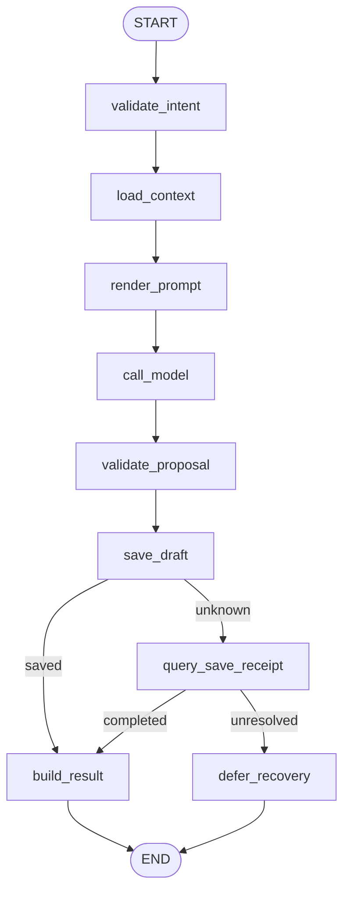
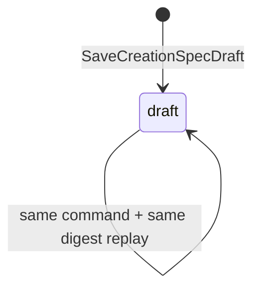
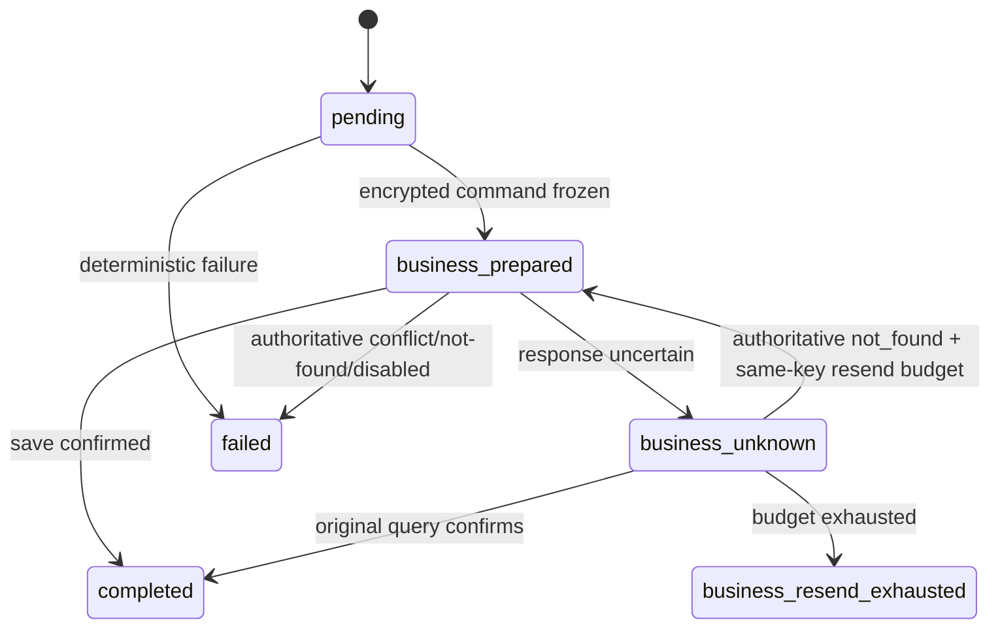

# `plan_creation_spec` Graph Tool 当前实现设计

> 状态：Current Implementation / local Development Preview 范围；完整生产范围仍为 Draft。当前验收结论只见[交付状态](../../../requirements/delivery-status.md)。
>
> 当前 Pin：`plan_creation_spec.v1preview1` / `plan_creation_spec_graph_v1` / `plan_creation_spec.preview.intent.v1`。
>
> 当前代码：`agent/internal/graphtool/plancreationspec`；当前领域迁移：`business/migrations/20260716000100_create_creation_spec_preview.up.sql`；当前运行迁移：`agent/migrations/20260716000600_add_creation_spec_preview_runtime.up.sql`、`20260716000700_add_preview_durable_command_recovery.up.sql`。

## 1. 功能边界

当前实现完成一条最小同步纵切：用户在已鉴权 Project/Session 中提交创作目标，Graph 读取 Business 项目上下文，经一个 ChatModel Node 生成候选，独立 Validator 通过后，以稳定命令保存 Business-owned CreationSpec `draft`，再投影 Tool Result、SSE 和 Workspace Card。

当前明确不做：`active/reviewing/revise`、MaterialAnalysis、Storyboard、最终 Prompt、媒体任务、真实 Provider、计费、Approval、Correction 和生产 Catalog。Preview Draft 不能冒充已激活 CreationSpec。

## 2. 输入与输出

### 2.1 输入

`Intent` 的 JSON exact-set：

| 字段 | 当前约束 |
|---|---|
| `schema_version` | 固定 `plan_creation_spec.preview.intent.v1` |
| `goal` | 1～2000 字符 |
| `deliverable_type` | `video/image_set/audio/mixed` |
| `audience` | 可省略，最多 500 字符 |
| `locale` | `zh-CN/en-US` |
| `constraints` | 0～8 项，逐项限长并去重 |

`user_id/project_id/session_id/input_id/turn_id/run_id/tool_call_id/business_command_id/fence_token` 只来自 `TrustedContext`，不属于模型或浏览器可控 Schema。

模型候选固定为 `creation_spec.preview.proposal.v1`，包含 `title/goal/deliverable_type/audience/phases/constraints/acceptance_criteria`。Validator 注入可信 `locale` 并形成 `creation_spec.draft.v1`；模型不能写状态、资源 ID、价格、Approval 或 Provider 字段。

### 2.2 输出

- 成功：`completed/CREATION_SPEC_DRAFT_CREATED`，返回 `resource_ref{id,version,digest,status=draft}` 与 `receipt_ref`。
- 确定失败：`failed`，只返回稳定结果码、安全摘要、`retryable` 与 `receipt_ref`。
- Save 结果不确定：内部 `Outcome.Recovery`，不序列化成终态 Result；Run/Input 保持恢复中并阻塞 Session HOL。

## 3. 当前 Graph 流程

Graph 是启动期编译并复用的 `AllPredecessor` 无环 DAG；没有循环、并行、ToolsNode、Interrupt 或长期 Checkpoint。

## 4. 稳定 Node / Branch exact-set

Node exact-set（9）：

| Node Key | 当前职责 |
|---|---|
| `validate_intent` | strict decode、可信上下文校验、Intent digest |
| `load_context` | Business Owner/Project 读取与版本快照 |
| `render_prompt` | `AddChatTemplateNode` 生成经典 Messages |
| `call_model` | `AddChatModelNode` 生成一个 Proposal Message |
| `validate_proposal` | strict Proposal 校验并构造 Draft Command |
| `save_draft` | 先冻结命令，再发起唯一 Business Save |
| `query_save_receipt` | 只查询原 command ID + request digest |
| `build_result` | 构造并校验 completed Result/Card |
| `defer_recovery` | 返回内部 Recovery 联合，不冻结伪失败 |

当前代码没有单独的 Branch Key 常量；Branch exact-set 以源 Node 与路由函数固定：

| 路由函数 / 源 Node | 输出 exact-set |
|---|---|
| `routeSave` / `save_draft` | `build_result`, `query_save_receipt` |
| `routeQuery` / `query_save_receipt` | `build_result`, `defer_recovery` |

未知路由值返回错误并失败关闭。

## 5. 强类型 Graph State 摘要

`State` 只活在单次 Graph 调用内，不是业务真源：

| 字段组 | 内容与不变量 |
|---|---|
| 身份/输入 | `TrustedContext`, `Intent`, `IntentDigest`；模型不可覆盖 |
| 业务快照 | `DomainContext`；只含 Project ID/version/title |
| 模型边界 | `PromptMessages`, `ModelMessage`, `Proposal`；不写普通日志或 Event |
| 确定性校验 | `ValidationReport`, `Draft`；只有通过后可 Save |
| 权威回执 | `BusinessCommandReceipt`；必须匹配原命令与摘要 |
| 结束状态 | `Result`, `Error`；Recovery 使用独立 `Outcome.Recovery` |

跨进程事实只保存 ID、version、digest、加密命令/结果与状态，不把数据库连接、Provider Client、reasoning 或明文 Prompt 放进 State/Receipt。

## 6. 业务状态机与迁移表

### 6.1 Business CreationSpec

`business.creation_spec.status` 当前只能是 `draft`，version 固定为 1。`business.creation_spec_command_receipt.command_id` 唯一，同键同摘要返回原结果，同键异摘要冲突。

### 6.2 Agent 执行

| 聚合 / Owner | 当前迁移 | Guard / 幂等 | 失败处理 |
|---|---|---|---|
| `creation_spec` / Business | 不存在 → `draft` | `command_id` first-write-wins；Project version + request digest | 整体回滚；不存在/越权对外折叠 |
| ToolReceipt / Agent | `pending → business_prepared → completed` | Save 前 AEAD 冻结完整命令；当前 owner/fence | 投影失败重放 Receipt，不重跑模型/Save |
| ToolReceipt / Agent | `business_prepared → business_unknown` | Save 可能已提交 | 只查原 key/digest |
| ToolReceipt / Agent | `business_unknown → business_prepared` | 仅权威 `not_found`；原命令；持久化预算 CAS | 同键有界重发，禁止换键 |
| ToolReceipt / Agent | `business_unknown → business_resend_exhausted` | `attempts == limit` | 保持非终态人工核对，不伪造 failed |
| Session Input / Agent | `pending → claimed/running → resolved/dead`；不确定时 `recovery_pending` | 严格 Session HOL、Lease/Fence | 后续 Input 不得越过 |

## 7. Owner、幂等与 Unknown Outcome

- Business PostgreSQL 是 CreationSpec Draft 唯一真源；Agent 不直写领域表。
- Agent PostgreSQL 拥有 Run、Model/Tool Receipt、加密恢复命令、Projection 与 Event。
- HTTP 入队、ToolCall、Model call、Business command 各有稳定 ID；同键同义重放，同键异义冲突。
- `SaveCreationSpecDraft` 前必须 `PrepareCommand`；Save/Query/同键重发都复用同一个 `business_command_id` 和 request digest。
- Business 已保存而 Agent 投影失败时，重放冻结 Result/Card，不重新调用模型或创建第二个 Draft。
- 当前本地模型没有外部 Provider 财务副作用；真实 Provider 的请求幂等与 model-unknown 对账仍是生产差距。

## 8. 安全

- 浏览器只经 Business 同源入口；Business 完成 Session/CSRF/Project Owner 校验并重编码严格 DTO。
- Graph 再校验可信上下文与 Business 返回的 Project ID/version；不存在与越权统一折叠，避免资源枚举。
- Prompt 只接收项目安全标题与规范 Intent；日志只允许稳定 ID/version/digest、Node、状态和耗时。
- 完整命令与模型/结果正文使用 Agent 内容密钥加密；普通 Event 不携带 Prompt、reasoning、Secret。
- 当前仅 local-only；生产 Agent↔Business 服务身份、TLS、网络最小权限、正文/幂等签名绑定仍未关闭。

## 9. 测试与验收入口

当前测试覆盖 strict DTO、Node exact-set、Graph Compile、Proposal Validator、保存创建/重放/冲突、Save 响应丢失、Query、同键重发预算、重启解密、Fence/HOL 与冻结结果重放。

关键门禁：

- `GOWORK=off go test ./internal/graphtool/plancreationspec`（在 `agent/`）；
- `make test-trial-basic`：验证一键 Trial 的静态契约；
- `make trial-basic`：验收真实 PostgreSQL/Redis/etcd/Chromium 下六 Tool 主链、Workspace V5 与媒体闭环。

## 10. 生产差距

生产 `plan_creation_spec.v1alpha1` 仍为 Draft，至少缺少：真实 ChatModel Provider 与 Unknown Outcome 对账、正式计费/结算、执行与激活 Approval/Continuation、create/revise/active 版本语义、Correction、生产 Registry/Catalog、服务身份/TLS、限流审计、完整故障注入和服务/数据库重启恢复证据。

这些差距进入 P1；不得通过扩展当前 Preview DTO 或状态枚举原地冒充生产版本。
