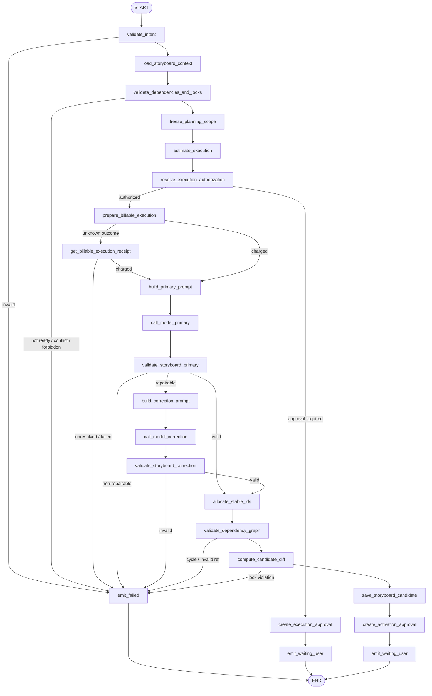
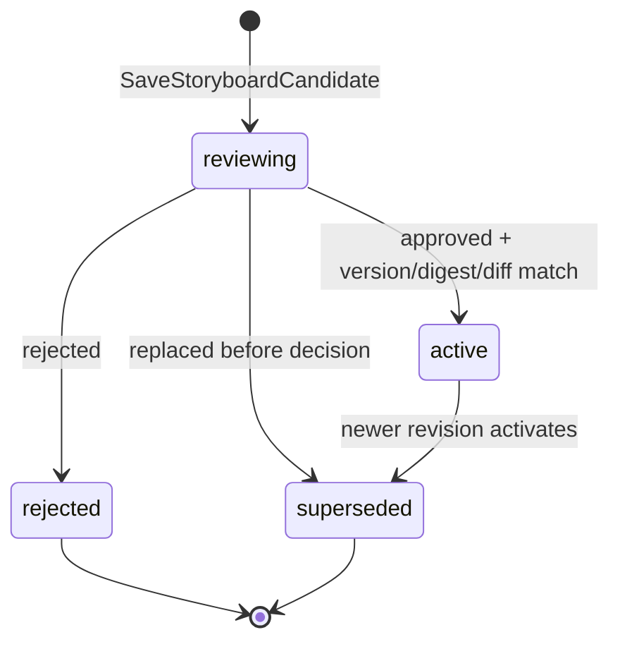

# `plan_storyboard` Graph Tool 设计

> 状态：Draft / 待产品、Business、Agent、财务与安全评审
>
> Graph Key：`plan_storyboard_graph_v1`
>
> Tool Definition Version：`plan_storyboard.v1alpha1`
>
> Migration Owner：Business（Storyboard/Element/Slot），Agent（Run/Receipt/Approval）
>
> 实现门禁：评审结论为“通过”前禁止创建生产代码。

> Development Preview 例外：独立 [`plan_storyboard.runtime.v2preview1`](../plan-storyboard-runtime-v2-design.md) 已于 2026-07-17 完成 M0～M4，只允许消费 CreationSpec Draft 并创建 Business-owned Storyboard Preview Draft；Runtime、BFF、Workspace Snapshot/SSE/Card、硬刷新、Agent 重启与 canonical Trial 已按该 Profile 验证。该结论不批准本文的 Active CreationSpec、MaterialAnalysis、修订/Diff、计费、双 Approval 或生产 Catalog。

共同契约见 [`../../cross-module/aigc-contract-catalog.md`](../../cross-module/aigc-contract-catalog.md)。本设计明确：Storyboard 只规划结构、元素、依赖和 Slot，不生成最终 Prompt；正式 Prompt 统一由 `write_prompts` 负责。

## 1. 场景、目标与边界

适用场景：在激活的 Creation Spec 和可选 MaterialAnalysis 基础上，新建或修订 Storyboard Revision。

目标：

- 生成顺序稳定、引用可追踪、依赖无环的 Storyboard 候选；
- 为场景、镜头、旁白、字幕、音频和媒体 Slot 分配服务端稳定 ID；
- 修订时保留用户锁定内容和已批准资产绑定，输出可审核 Diff；
- 保存 `reviewing` 候选并创建正式激活 Approval；
- 激活后发布领域事件，使旧 Prompt、计划或生成范围按版本规则失效。

非目标：

- 不生成最终 Prompt，不调用媒体 Provider，不创建 Generation Job；
- 不修改已激活 Storyboard；每次修改都产生新 Revision；
- 不允许模型生成数据库主键、资源版本、Approval 或计费决策；
- 不在 Graph 内等待用户决策，也不把 Checkpoint 当 Revision 权威来源。

权威来源：CreationSpec、MaterialAnalysis、Storyboard、Element、Slot、Asset Binding 归 Business；Run、Receipt、Approval、A2UI EventLog 归 Agent。

### 1.1 需求追踪

| 类型 | ID |
|---|---|
| Tool 主验收 | `GTL-STORY-001` |
| 共通 Graph Tool | `GTL-USE-002`、`GTL-VER-001`、`GTL-IDEM-001`、`GTL-BILL-001`、`GTL-EARN-001`、`GTL-SEC-001` |
| 全功能冒烟 | `SMK-011`、`SMK-021`、`SMK-023`、`SMK-033`、`SMK-034` |

## 2. Intent、上下文与结果

### 2.1 `PlanStoryboardIntentV1`

| 字段 | 类型 | 规则 |
|---|---|---|
| `creation_spec_id` | UUID | 必填；必须是当前项目已激活或明确指定的可用版本 |
| `material_analysis_ids` | UUID[] | 可选；逐项校验项目、版本和状态 |
| `storyboard_id` | UUID? | 修订时填写 |
| `expected_baseline_revision` | int64? | 修订时必填；用于 CAS |
| `planning_instruction` | string | 必填；只表达创作意图 |
| `target_duration_hint` | duration? | 用户偏好；必须服从 Creation Spec 硬约束 |
| `preserve_element_ids` | UUID[] | 可选；仅表达保留意愿，服务端仍校验锁定和归属 |
| `requested_sections` | enum[]? | 可选的场景/章节范围；服务端枚举 |

Project/User/Run/Approval/Budget Authorization 从可信上下文注入。`preserve_element_ids` 不能绕过服务端锁定和资产保留规则。

### 2.2 上下文冻结

`GetGraphToolContext` 必须返回：Creation Spec ID/version/digest、Published Skill Snapshot、选定 MaterialAnalysis refs、当前 Storyboard Revision、Element/Slot 稳定身份、锁定字段、已批准 Asset Binding、依赖版本和权限结果。

生成 `planning_scope_digest` 后才能估价和扣费。扣费后资源版本变化不会偷偷替换输入；保存时版本 Guard 冲突则失败，由新 Turn 重新规划。

### 2.3 输出

- 缺少模型执行授权：`waiting_user` + billable execution Approval；
- 候选生成并保存：`waiting_user` + Storyboard activation Approval + Candidate/Diff Resource Ref；
- 依赖不完整、版本冲突、模型不可修复：`failed`；
- v1 不返回 `accepted`，因为没有异步 Worker 任务。

## 3. Typed Graph State

Graph State 类型为 `PlanStoryboardStateV1`。

| State 字段 | Owner/来源 | 读节点 | 写节点 | 持久化/Checkpoint | 敏感性与不变量 |
|---|---|---|---|---|---|
| `trusted_context` | Agent | 全部 | 初始化器 | Run | 不可覆盖 |
| `intent` | Tool Schema | 校验、加载、Prompt | `validate_intent` | input digest | 范围规范化后固定 |
| `storyboard_context` | Business | 依赖校验、Prompt、Diff、保存 | `load_storyboard_context` | Resource refs/digests | 必须是同一项目一致快照 |
| `planning_scope_digest` | Agent | 授权、扣费、保存 | `freeze_planning_scope` | Receipt | 包含全部基线版本、锁和保留绑定 |
| `execution_quote`、`authorization` | Agent/Business | 授权、扣费 | 估价/授权节点 | Approval/Receipt | 绑定 scope digest |
| `execution_approval` | Agent | 待授权结果 | `create_execution_approval` | Agent 权威 | 只覆盖本次模型规划执行 |
| `charge_receipt` | Business | Model/恢复 | 扣费节点 | Business + Ref | 成功前禁止推理 |
| `prompt_input` | Agent | Model | Prompt Nodes | digest | 锁定内容标成不可修改数据 |
| `storyboard_candidate` | ChatModel | Validator/ID 分配 | Model Nodes | ModelReceipt/短期 Checkpoint | 不含最终 ID/版本 |
| `validation_report` | Agent | 分支 | Validator Nodes | ToolReceipt | 依赖图、时长、字段、引用确定性校验 |
| `allocated_candidate` | Agent | Diff/保存 | `allocate_stable_ids` | candidate digest | ID 仅由服务端 UUIDv7 分配或复用 |
| `candidate_diff` | Agent | 保存/Result | `compute_candidate_diff` | Business Candidate | 锁定/保留项变化必须为空 |
| `saved_revision` | Business | Approval/Result | `save_storyboard_candidate` | Business 权威 | ID/version/digest/Diff 齐全 |
| `activation_approval` | Agent | Result | `create_activation_approval` | Agent 权威 | 绑定 Revision 和 Diff digest |
| `result`、`error` | Agent | END | Result/Error Nodes | ToolReceipt | 唯一终态 |

## 4. Graph 流程

Graph 为 `AllPredecessor` 无环 DAG。Element 的业务依赖图也必须是 DAG，但它是候选数据，不等于 Eino Graph 拓扑。

## 5. 稳定 Node 清单

| Node Key | 中文名称 | 业务分类 | Eino 实现 | 单一职责 | 输入/输出 | State 读写 | 副作用/风险 | Invoke/Stream | 预算/回执 | 错误码/失败目标 | Checkpoint |
|---|---|---|---|---|---|---|---|---|---|---|---|
| `validate_intent` | 校验分镜意图 | Guard | Lambda | Schema、范围、版本和枚举校验 | Intent→规范化 Intent | R/W intent | 无 | Invoke | input digest | `INVALID_ARGUMENT` | 否 |
| `load_storyboard_context` | 加载分镜上下文 | Query | Lambda/RPC | 读取 Spec、分析、基线、锁和绑定 | Refs→Context | W storyboard_context | Business 敏感读取 | Invoke | RPC Receipt | `PERMISSION_DENIED/VERSION_CONFLICT` | 可，仅引用 |
| `validate_dependencies_and_locks` | 校验依赖与锁 | Guard | Lambda | 确认 Spec 激活、分析可用、锁和绑定一致 | Context→Guard Result | W error | 无模型 | Invoke | Guard version | `DEPENDENCY_NOT_READY/LOCK_CONFLICT` | 否 |
| `freeze_planning_scope` | 冻结规划范围 | Compute | Lambda | 排序并摘要所有资源版本和保护项 | Context→Scope Digest | W planning_scope_digest | 扣费后不可变 | Invoke | Scope Receipt | `INTERNAL` | 否 |
| `estimate_execution` | 估算规划执行 | Compute | Lambda | 生成配置预算与执行摘要 | Scope→Quote | W execution_quote | 不扣费 | Invoke | Policy Ref | `BUDGET_POLICY_MISSING` | 否 |
| `resolve_execution_authorization` | 校验预算授权 | Guard | Branch | 校验覆盖准确 scope 的授权 | Quote→Auth | W authorization | 不接受模型授权 | Invoke | Approval Receipt | `APPROVAL_REQUIRED` | 否 |
| `create_execution_approval` | 创建执行审批 | Command | Lambda/Repository | 保存 billable execution Approval | Quote→Approval | W execution_approval | Agent DB 写入 | Invoke | Approval/Event Receipt | `INTERNAL` | 否 |
| `prepare_billable_execution` | 扣除规划费用 | Command | Lambda/RPC | 调 `BIZ-AIGC-003` | Auth/Digest→Charge | W charge_receipt | 扣费 | Invoke | Charge Receipt | `INSUFFICIENT_POINTS/UNKNOWN_OUTCOME` | 是，仅 Receipt |
| `get_billable_execution_receipt` | 查询扣费回执 | Query | Lambda/RPC | 调 `BIZ-AIGC-004` | Key→Charge | W charge_receipt | 无新扣费 | Invoke | Charge Receipt | `UNKNOWN_OUTCOME` | 否 |
| `build_primary_prompt` | 构造分镜 Prompt | Prompt | ChatTemplate | 只传最小规划上下文、锁和约束 | Context→Messages | W prompt_input | Prompt 注入 | Invoke | prompt key/version/digest | `PROMPT_RENDER_FAILED` | 否 |
| `call_model_primary` | 主分镜规划 | Inference | ChatModel | 生成无最终 ID 的结构候选 | Messages→Candidate | W storyboard_candidate | 已计费模型调用 | Invoke | ModelReceipt/配置预算 | `MODEL_*` | 是，Receipt |
| `validate_storyboard_primary` | 首次候选校验 | Validate | Lambda | Schema、时长、枚举、引用、锁校验 | Candidate→Report | W validation_report | 无 | Invoke | Validator Version | invalid→repair/failed | 否 |
| `build_correction_prompt` | 构造纠错 Prompt | Prompt | ChatTemplate | 用稳定错误码纠错 | Report→Messages | W prompt_input | 不泄漏权限/价格 | Invoke | prompt key/version/digest | `PROMPT_RENDER_FAILED` | 否 |
| `call_model_correction` | 单次分镜纠错 | Inference | ChatModel | 在原执行预算内修复一次 | Messages→Candidate | W storyboard_candidate | 禁止无限重试 | Invoke | ModelReceipt 子 Attempt | `MODEL_*` | 是，Receipt |
| `validate_storyboard_correction` | 纠错候选校验 | Validate | Lambda | 复用确定性校验 | Candidate→Report | W validation_report | 无 | Invoke | Validator Version | invalid→failed | 否 |
| `allocate_stable_ids` | 分配稳定元素标识 | Compute | Lambda | 复用匹配旧 ID，其余用 UUIDv7 | Candidate→Allocated | W allocated_candidate | ID 决策必须确定性 | Invoke | Allocation Receipt | `IDENTITY_AMBIGUOUS` | 可，映射 Receipt |
| `validate_dependency_graph` | 校验元素依赖图 | Validate | Lambda | 拓扑排序、引用、Slot 类型和必填输入 | Allocated→Report | W validation_report | 无 | Invoke | DAG Validator Version | `DEPENDENCY_CYCLE/INVALID_REF` | 否 |
| `compute_candidate_diff` | 计算候选差异 | Compute | Lambda | 生成基线→候选 Diff 并验证保护项 | Context/Candidate→Diff | W candidate_diff | 不允许修改锁定/批准绑定 | Invoke | Diff digest | `LOCK_CONFLICT` | 否 |
| `save_storyboard_candidate` | 保存分镜候选 | Command | Lambda/RPC | 调 `BIZ-AIGC-009` 原子保存 Revision/Element/Slot/Diff | Candidate→ResourceRef | W saved_revision | Business 多表事务 | Invoke | Write Receipt | `VERSION_CONFLICT/UNKNOWN_OUTCOME` | 是，仅 Receipt |
| `create_activation_approval` | 创建分镜激活审批 | Command | Lambda/Repository | 绑定 Revision/Diff 创建 Approval | ResourceRef→Approval | W activation_approval | Agent DB 写入 | Invoke | Approval/Event Receipt | `INTERNAL` | 否 |
| `emit_waiting_user` | 输出待确认结果 | Result | Lambda | 写 ToolReceipt 和 A2UI Card | State→Result | R execution_approval/activation_approval; W result | EventLog | Invoke | ToolReceipt/Event ID | `INTERNAL` | 否 |
| `emit_failed` | 输出失败结果 | Error | Lambda | 归一化错误并结束计费执行 | Error→Result | W result/error | 默认不退款 | Invoke | Failure Receipt | 稳定错误码 | 否 |

## 6. Storyboard Revision 业务状态机

| Aggregate/Owner | 权威来源 | 原状态 | 触发事件 | 执行方 | Guard/动作 | 目标状态 | 终态/可重试 | 事务/幂等键 | Fence/版本/Outbox | 失败处理 |
|---|---|---|---|---|---|---|---|---|---|---|
| StoryboardRevision/Business | Business DB | 不存在 | 保存候选 | Business | Spec/基线版本、稳定 ID、DAG、锁和绑定全部合法 | `reviewing` | 非终态 | `tool_call_id + candidate_digest` | resource version；候选 Outbox | 事务整体回滚 |
| StoryboardRevision/Business | Business DB | `reviewing` | Approval approved | Agent Continuation→Business | Approval 绑定用户、Revision、version、digest、Diff 且未过期 | `active` | 可用于 Prompt/Generation | `approval_id + decision_version` | CAS revision；同事务写 `storyboard.revision.activated.v1` | 冲突拒绝并刷新 Card |
| StoryboardRevision/Business | Business DB | `reviewing` | Approval rejected | Agent Continuation→Business | 决策版本和资源 Guard 匹配 | `rejected` | 终态 | 同上 | CAS + Outbox | 重复返回原结果 |
| StoryboardRevision/Business | Business DB | `reviewing/active` | 新版本替代 | Business | 新 Revision 已激活或候选已明确替换 | `superseded` | 终态 | 新版本事务键 | CAS + Outbox | 保留旧版本可审计读取 |

Element/Slot 随 Revision 不可变；跨 Revision 的“同一元素”由稳定 Element ID 和来源映射表达，不对旧行原地覆盖。

## 7. ChatModel、Prompt、Schema 与预算

- Prompt Key：`graph_tool.plan_storyboard.primary`、`graph_tool.plan_storyboard.correction`。
- ChatModel 由 Eino DeepSeek 兼容组件注入；参数来自 Runtime 配置。
- 模型输出使用临时局部键表达元素关系，不输出 UUID、数据库版本或最终 Prompt。服务端完成 UUIDv7 分配与旧 ID 匹配。
- Schema 至少覆盖 section、element type、narrative purpose、timing、source evidence refs、dependency local keys、media slots、字幕/旁白意图和验收条件。
- Validator 校验总时长/顺序、合法 Element/Slot 类型、依赖无环、引用存在、锁定/批准绑定未变化、未生成最终媒体 Prompt。
- 只允许一次显式纠错；Token、候选 Element 数、上下文和耗时由 Tool Budget 配置控制。
- Candidate 保存前再次校验 Business 基线版本；模型有效不等于可以覆盖并发修订。

## 8. 分支、并行与 Fan-in

- v1 使用单模型候选，避免分章节并行后发生身份、时长和依赖冲突。
- 首次/纠错分支汇入 `allocate_stable_ids`；只允许一个有效候选进入保存。
- Eino Graph 无循环；Storyboard 候选业务依赖图也必须无环。
- 若未来引入并行 section planning，需独立版本设计稳定局部键命名空间、Fan-in 冲突解析和每分支预算。

## 9. 幂等、事务与恢复

- Tool、Charge、Model unknown outcome 沿用共同契约，不创建随机重试键。
- Stable ID 分配映射在保存前写入 Agent Receipt；保存响应丢失时复用相同映射，禁止重新生成 UUID。
- Business 在一个事务内保存 Revision、Element、Slot、依赖、Diff、保护绑定引用和 Outbox。
- 保存成功、Agent Approval 失败时，Recovery Scanner 依据 Write Receipt 补建同一 Approval。
- 激活使用 candidate version/digest/Diff digest CAS；旧 Approval 不得作用于新候选。

## 10. 风险、HITL、权限与隐私

- 模型执行和候选激活为两个正式授权范围；自然语言确认无效。
- 锁定字段、已批准 Asset Binding、权限和余额均为可信数据，不进入可由模型覆写的输出区。
- MaterialAnalysis 中的 Evidence 只按最小必要范围送入 Prompt；日志只记录引用和 digest。
- Diff Card 必须突出删除、重排、锁冲突、预计时长和受影响资产；用户批准绑定精确 Diff。
- 激活后旧 Revision 仍可审计读取，但不能继续新增 Prompt/Generation Binding。

## 11. 测试与验收

必须覆盖：新建、修订、无激活 Spec、MaterialAnalysis 部分可用、基线冲突、锁和批准绑定保护、依赖环、非法 Slot、稳定 ID 复用、模型纠错、扣费 unknown outcome、候选保存多表回滚、Approval 重放与激活事件。

还必须验证：

- 输出不含最终 Prompt；后续 `write_prompts` 可读取稳定 Slot；
- 保存响应丢失时 ID 不变化；
- 并发新 Revision 导致旧 Approval 拒绝；
- A2UI Diff Card/SSE 重放幂等；
- Graph 所有分支唯一结束，未声明 Node 不可编译。

全功能冒烟至少覆盖 Creation Spec 激活→生成 Storyboard 候选→查看 Diff→批准激活→Prompt 页面读取新 Slot，以及拒绝/冲突路径。

## 12. 评审结论

- [ ] 产品确认 Storyboard/Element/Slot 字段、Diff 和保护规则；
- [ ] Business 确认多表事务、版本、状态机与 Outbox；
- [ ] Agent 确认 Graph、稳定 ID Receipt、Approval 与 A2UI；
- [ ] 财务确认模型规划扣费；
- [ ] 安全确认素材引用与日志策略；
- [ ] 测试确认契约、故障注入和 SMK-P0。

当前结论：**待评审，不通过实现门禁。**
