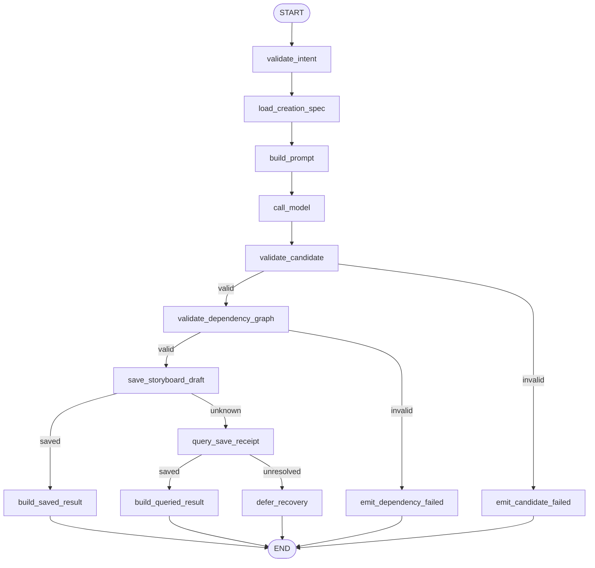
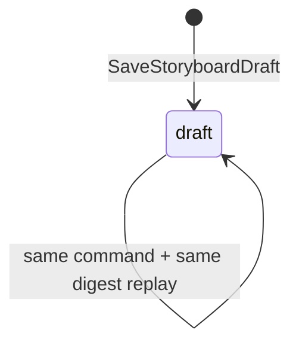
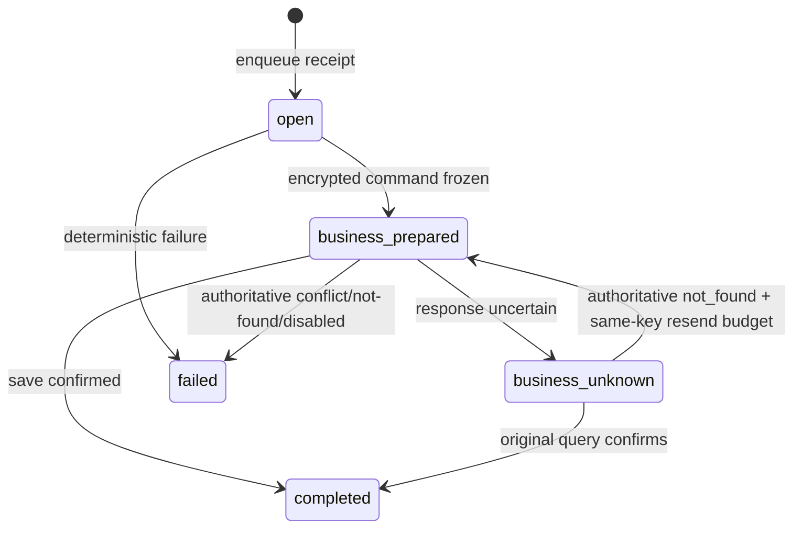

# `plan_storyboard` Graph Tool 当前实现设计

> 状态：Current Implementation / local Development Preview 范围；完整生产范围仍为 Draft。当前验收结论只见[交付状态](../../../requirements/delivery-status.md)。
>
> 当前 Pin：`plan_storyboard.v2preview1` / `plan_storyboard_graph_v2preview1` / `plan_storyboard.preview.intent.v1`。
>
> 当前代码：`agent/internal/graphtool/planstoryboard`、`agent/internal/planstoryboardruntime`；当前迁移：`business/migrations/20260717000300_create_storyboard_preview_draft.up.sql`、`agent/migrations/20260717001100_add_plan_storyboard_runtime_v2preview1.up.sql`。

## 1. 功能边界

当前实现读取同项目、精确版本和摘要匹配的 Business CreationSpec Draft，用一个 ChatModel Node 生成 Storyboard 候选；两个独立 Validator 分别校验字段/时长/引用和 Element 依赖 DAG，随后保存不可变 Business Storyboard Preview `draft`，并投影 Result、SSE 与 Workspace Card。

当前 Storyboard 只包含 `Section/Element/Slot` 的局部键、顺序、叙事目标、时长和依赖；不生成最终 Prompt 或媒体。当前不做 Active CreationSpec、MaterialAnalysis、修订/Diff、稳定跨 Revision UUID、锁/已批准 Binding、计费、Approval、Correction 或生产 Catalog。

## 2. 输入与输出

### 2.1 输入

模型可控 `Intent` exact-set：

| 字段 | 当前约束 |
|---|---|
| `schema_version` | 固定 `plan_storyboard.preview.intent.v1` |
| `planning_instruction` | 1～1000 字符 |
| `target_duration_seconds` | 可选，5～600 秒 |

CreationSpec 的 `id/version/content_digest` 只来自 Runtime `TrustedContext.CreationSpecRef`。User/Project/Session/Run/ToolCall/BusinessCommand/Fence 与 Prompt/Validator Pin 也不属于 Tool Schema。

模型候选固定为 `storyboard.preview.candidate.v1`：`title/summary/sections/elements/slots`。Element 使用 `section_key/source_phase_key/dependency_keys`；Slot 使用 `element_key`。模型不能生成数据库 ID、资源状态、Prompt、Asset、价格或 Approval。

### 2.2 输出

- 成功：`completed/STORYBOARD_PREVIEW_DRAFT_CREATED`，返回 Storyboard Preview Resource Ref、CreationSpec Ref、Invocation Ref 与内部 Card。
- 确定失败：`failed`，只返回稳定码、安全摘要、不可重试标记与 Invocation Ref。
- Save 结果不确定：内部 `Outcome.Recovery`；不冻结为 failed，也不发布伪终态。

## 3. 当前 Graph 流程

Graph 使用 `compose.AllPredecessor` 启动编译；无循环、并行、ToolsNode、Interrupt 或长期 Checkpoint。候选中的依赖 DAG 是业务数据校验对象，不是 Eino Graph 拓扑。

## 4. 稳定 Node / Branch exact-set

Node exact-set（13）：

`validate_intent`, `load_creation_spec`, `build_prompt`, `call_model`, `validate_candidate`, `validate_dependency_graph`, `save_storyboard_draft`, `query_save_receipt`, `build_saved_result`, `build_queried_result`, `emit_candidate_failed`, `emit_dependency_failed`, `defer_recovery`。

| Branch Key / 源 Node | 输出 exact-set |
|---|---|
| `route_candidate_validation` / `validate_candidate` | `validate_dependency_graph`, `emit_candidate_failed` |
| `route_dependency_validation` / `validate_dependency_graph` | `save_storyboard_draft`, `emit_dependency_failed` |
| `route_save_outcome` / `save_storyboard_draft` | `build_saved_result`, `query_save_receipt` |
| `route_query_outcome` / `query_save_receipt` | `build_queried_result`, `defer_recovery` |

Branch 不是 Node；未知值返回错误并失败关闭。

## 5. 强类型 Graph State 摘要

`State` 只属于一次 Graph 调用：

| 字段组 | 内容与不变量 |
|---|---|
| 身份/输入 | `TrustedContext`, `Intent`, `IntentDigest`, `CreationSpecRef` |
| Business 快照 | `CreationSpecContext`；Project 与 CreationSpec 必须同一授权快照 |
| 模型 | `PromptMessages`, `PromptDigest`, `ModelMessage`；只接受纯 assistant content |
| 候选校验 | `Candidate`, `CandidateDigest`, `ValidationReport`；字段与 DAG 都通过才可保存 |
| 命令/结果 | `SaveOutcome`, `Result`, `Error`；Recovery 与 terminal Result 分离 |

State 不保存数据库连接、Provider Client、Secret、价格、完整运行日志或长期业务状态。

## 6. 业务状态机与迁移表

### 6.1 Business Storyboard Preview

`business.storyboard_preview_draft` 当前只允许 `status=draft`、`version=1`，并冻结上游 CreationSpec version/digest；没有 `reviewing/active/rejected/superseded`。

### 6.2 Agent 执行

| 聚合 / Owner | 当前迁移 | Guard / 幂等 | 失败处理 |
|---|---|---|---|
| Storyboard Preview / Business | 不存在 → `draft` | `command_id` 唯一；Project 与 CreationSpec version/digest；candidate digest | 多表尚未存在；单 Draft + command receipt 原子写 |
| Run / Agent | `created → running → completed/failed`；不确定时 `recovery_pending` | Session HOL + owner fence | 后续 Input 阻塞 |
| ModelReceipt / Agent | `reserved → completed/failed` | `(run_id, call_kind)` first-write-wins | 同键重放，不生成第二次逻辑调用 |
| ToolReceipt / Agent | `open → business_prepared → completed/failed` | Save 前 AEAD 冻结命令；`tool_call_id/business_command_id` 唯一 | 投影恢复不重跑模型 |
| ToolReceipt / Agent | `business_prepared → business_unknown` | Save outcome 可能已提交 | Query 原 key/digest；权威 not_found 才同键有界重发 |

## 7. Owner、幂等与 Unknown Outcome

- Business PostgreSQL 拥有 CreationSpec 与 Storyboard Preview Draft；Agent 不直写业务表。
- Agent PostgreSQL 拥有 Turn Context、Run、Router/Graph Model Receipt、Tool Receipt、加密命令、Projection 与 Event。
- 入队时预分配稳定 `tool_call_id/business_command_id`；Save、Query、恢复重发复用原 ID 和 request digest。
- 保存响应丢失后先查 `storyboard_preview_command_receipt`；`completed` 重放原资源，`conflict` 确定失败，其他未收敛进入 `recovery_pending`。
- 稳定局部 Element/Slot key 由候选协议固定；当前没有生产级跨 Revision stable UUID 分配，文档不得把局部 key 解释为正式领域 ID。
- 当前 local 模型没有真实 Provider unknown；生产接入前需独立 Provider 请求键与对账。

## 8. 安全

- Browser 请求只经 Business 同源 BFF；Business 校验 Session/CSRF/Project Owner，Agent 再复核可信上下文和上游 Ref。
- CreationSpec 不存在与越权统一折叠；版本或摘要漂移在模型/保存前失败关闭。
- Prompt 只含最小 Project/CreationSpec 数据；模型 Message 的 ToolCall、reasoning 和 metadata 被拒绝。
- 命令与 Result 持久化使用内容加密；日志/Event 只记录稳定 ID/version/digest 和安全错误码。
- 当前 local-only，生产服务身份/TLS、内容安全、正式审核与审计未关闭。

## 9. 测试与验收入口

当前测试覆盖 Intent strict schema、CreationSpec version/digest、Candidate 字段/上限、Section/Element/Slot 引用、连续顺序、总时长、依赖环、Node/Branch exact-set、Save 创建/重放/Unknown Query、命令恢复、Card/Result 与模型 Message 边界。

关键门禁：

- `GOWORK=off go test ./internal/graphtool/planstoryboard`（在 `agent/`）；
- `make plan-storyboard-runtime-smoke`：独立 canonical local Preview；
- `make trial-basic`：验收统一六工具链中的 Business Draft、Receipt、Workspace V5、SSE、硬刷新与 Agent 重连主路径。

## 10. 生产差距

生产 `plan_storyboard.v1alpha1` 仍为 Draft，至少缺少：Active CreationSpec 与 MaterialAnalysis 输入，正式 Storyboard/Revision/Element/Slot 领域模型，跨 Revision stable ID，修订/Diff、锁和已批准 Binding 保护，计费、执行 Approval、激活 Approval/Continuation、Correction、真实模型 Provider 与 Unknown Outcome、生产 Registry/Catalog、安全审核和完整故障/重启恢复证据。
