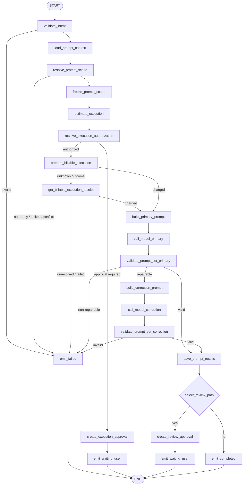
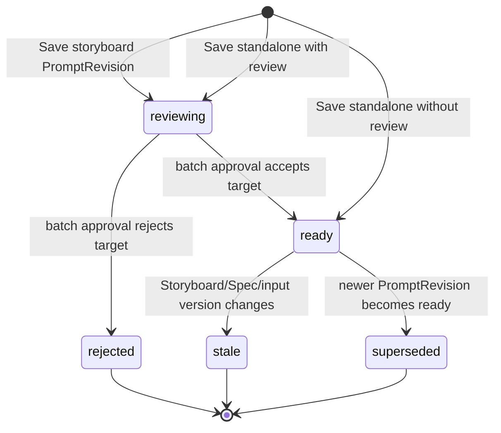

# `write_prompts` Graph Tool 设计

> 状态：Draft / 待产品、Business、Agent、财务与安全评审
>
> Graph Key：`write_prompts_graph_v1`
>
> Tool Definition Version：`write_prompts.v1alpha1`
>
> Migration Owner：Business（PromptArtifact/PromptRevision），Agent（Run/Receipt/Approval）
>
> 实现门禁：评审结论为“通过”前禁止创建生产代码。

共同契约见 [`../../cross-module/aigc-contract-catalog.md`](../../cross-module/aigc-contract-catalog.md)。本 Tool 是最终媒体 Prompt 的唯一生成入口；`plan_storyboard` 不再隐式生成 Prompt。

## 1. 场景、目标与边界

支持两种互斥模式：

- `standalone`：根据用户指令、选定素材和可选 Creation Spec 生成独立 PromptArtifact；
- `storyboard`：为一个激活 Storyboard Revision 中的精确 Element/Slot 集生成 PromptRevision。

目标：

- 生成结构化、可版本化、可人工编辑、可追踪来源的最终媒体 Prompt；
- 在 storyboard 模式冻结 exact target set，保证不漏项、不越界、不覆盖锁定 Prompt；
- 每个目标记录 Prompt Key/Version、模型/输入摘要、变量、负面约束和来源引用；
- 模型调用前完成授权和扣费；storyboard 结果默认进入批量审核；
- 为 `generate_media` 提供 ready Prompt Resource Ref，而非自由文本拼装。

非目标：

- 不创建 Storyboard 结构，不调用媒体 Provider，不扣媒体生成费用；
- 不自动覆盖 `locked/approved/in_use` PromptRevision；
- 不允许模型选择项目、扩大目标范围、改变媒体类型或写入 Provider 密钥；
- 不用 Prompt 承载权限、价格、状态机或业务校验规则。

### 1.1 需求追踪

| 类型 | ID |
|---|---|
| Tool 主验收 | `GTL-PROMPT-001`、`GTL-PROMPT-002` |
| 共通 Graph Tool | `GTL-USE-001`、`GTL-USE-002`、`GTL-VER-001`、`GTL-IDEM-001`、`GTL-BILL-001`、`GTL-EARN-001`、`GTL-SEC-001` |
| 全功能冒烟 | `SMK-008`、`SMK-012`、`SMK-021`、`SMK-023`、`SMK-033`、`SMK-034` |

## 2. Intent、模式与结果

### 2.1 `WritePromptsIntentV1`

| 字段 | 类型 | 规则 |
|---|---|---|
| `mode` | `standalone/storyboard` | 必填；两种输入不可混用 |
| `instruction` | string | 必填；用户创作意图 |
| `media_kind` | enum | 图片、视频、音频、文本等服务端能力枚举 |
| `reference_asset_ids` | UUID[] | 可选；逐项权限和版本校验 |
| `creation_spec_id` | UUID? | 可选；必须是可用版本 |
| `storyboard_revision_id` | UUID? | storyboard 模式必填且必须 active |
| `target_slot_ids` | UUID[] | storyboard 模式必填；非空、去重、固定范围 |
| `expected_prompt_versions` | map<UUID,int64?> | storyboard 模式用于 CAS；缺失表示该 Slot 尚无 Prompt |
| `variables` | map<string,string> | 仅允许模板声明变量；限长、无 Secret |
| `require_review` | bool? | standalone 可选；storyboard 模式服务端强制为 true |

可信上下文不属于 Intent。Provider/model preference 只能作为非权威偏好，最终能力由 Business/Agent 配置校验。

### 2.2 精确目标集

`resolve_prompt_scope` 产生排序后的目标：

- standalone：一个服务端分配的 artifact target；
- storyboard：每个 Slot 的 ID/type/version、所属 Element/Revision、锁状态、现有 Prompt 版本和依赖资源版本。

`exact_target_set_digest` 在扣费前冻结。模型输出的目标键必须与此集合精确相等；多、少、重复或类型错配均进入确定性纠错/失败。

### 2.3 输出

- 缺少执行授权：`waiting_user` + billable execution Approval；
- standalone 且无需额外审核：`completed` + PromptArtifact Resource Ref；
- standalone 要求审核或 storyboard：`waiting_user` + Prompt review Approval + 固定结果集合 Ref；
- 目标冲突、依赖未就绪、模型不可修复：`failed`。

## 3. Typed Graph State

Graph State 类型为 `WritePromptsStateV1`。

| State 字段 | Owner/来源 | 读节点 | 写节点 | 持久化/Checkpoint | 敏感性与不变量 |
|---|---|---|---|---|---|
| `trusted_context` | Agent | 全部 | 初始化器 | Run | 不可覆盖 |
| `intent` | Tool Schema | 校验、范围、Prompt | `validate_intent` | input digest | 模式互斥 |
| `prompt_context` | Business | 范围、Prompt、保存 | `load_prompt_context` | Resource refs/digests | 同一项目授权快照 |
| `exact_targets` | Agent | Prompt/Validator/保存 | `resolve_prompt_scope` | Scope Receipt | 扣费后不可增删 |
| `scope_digest` | Agent | 授权、扣费、保存 | `freeze_prompt_scope` | Receipt | 包含目标/输入/变量/版本 |
| `execution_quote`、`authorization` | Agent/Business | 授权、扣费 | 估价/授权节点 | Approval/Receipt | 绑定 scope digest |
| `execution_approval` | Agent | 待授权结果 | `create_execution_approval` | Agent 权威 | 只覆盖本次 Prompt 模型执行 |
| `charge_receipt` | Business | Model/恢复 | 扣费节点 | Business + Ref | 成功前禁止模型调用 |
| `prompt_input` | Agent | Model | Prompt Nodes | digest | 用户素材内容按数据区隔离 |
| `prompt_candidates` | ChatModel | Validator | Model Nodes | ModelReceipt/短期 Checkpoint | 目标键不得扩大集合 |
| `validation_report` | Agent | 分支/保存 | Validator Nodes | ToolReceipt | exact-set、Schema、变量和安全校验 |
| `saved_prompts` | Business | Review/Result | `save_prompt_results` | Business 权威 | 返回每目标 version/digest |
| `review_required` | Agent | 结果分支 | `select_review_path` | ToolReceipt | storyboard 强制为 true；模型不得决定 |
| `review_approval` | Agent | Result | `create_review_approval` | Agent 权威 | 绑定完整目标集合 digest |
| `result`、`error` | Agent | END | Result/Error Nodes | ToolReceipt | 唯一终态 |

## 4. Graph 流程

Graph 使用 `AllPredecessor`，为无环 DAG。模式分支在 `resolve_prompt_scope` 内形成统一 typed targets，Model 和保存节点不再复制两套实现。

## 5. 稳定 Node 清单

| Node Key | 中文名称 | 业务分类 | Eino 实现 | 单一职责 | 输入/输出 | State 读写 | 副作用/风险 | Invoke/Stream | 预算/回执 | 错误码/失败目标 | Checkpoint |
|---|---|---|---|---|---|---|---|---|---|---|---|
| `validate_intent` | 校验 Prompt 意图 | Guard | Lambda | 模式互斥、Schema、枚举、变量和目标格式 | Intent→规范化 Intent | R/W intent | 无 | Invoke | input digest | `INVALID_ARGUMENT` | 否 |
| `load_prompt_context` | 加载 Prompt 上下文 | Query | Lambda/RPC | 查询 Spec、Storyboard、Slot、旧 Prompt、素材 | Refs→Context | W prompt_context | Business 敏感读取 | Invoke | RPC Receipt | `PERMISSION_DENIED/VERSION_CONFLICT` | 可，仅引用 |
| `resolve_prompt_scope` | 解析精确目标集 | Guard/Compute | Lambda | 校验 active Revision、Slot 类型、锁和版本，生成统一目标 | Intent/Context→Targets | W exact_targets | 不得扩大目标 | Invoke | Scope mapping receipt | `DEPENDENCY_NOT_READY/LOCK_CONFLICT` | 否 |
| `freeze_prompt_scope` | 冻结 Prompt 范围 | Compute | Lambda | 摘要目标、输入、变量和资源版本 | Targets→Scope Digest | W scope_digest | 扣费后不可变 | Invoke | Scope Receipt | `INTERNAL` | 否 |
| `estimate_execution` | 估算 Prompt 执行 | Compute | Lambda | 按目标数和配置生成 Quote | Scope→Quote | W execution_quote | 不扣费 | Invoke | Policy Ref | `BUDGET_POLICY_MISSING` | 否 |
| `resolve_execution_authorization` | 校验预算授权 | Guard | Branch | 验证精确目标范围授权 | Quote→Auth | W authorization | 不接受模型授权 | Invoke | Approval Receipt | `APPROVAL_REQUIRED` | 否 |
| `create_execution_approval` | 创建执行审批 | Command | Lambda/Repository | 保存模型执行 Approval | Quote→Approval | W execution_approval | Agent DB 写入 | Invoke | Approval/Event Receipt | `INTERNAL` | 否 |
| `prepare_billable_execution` | 扣除 Prompt 费用 | Command | Lambda/RPC | 调 `BIZ-AIGC-003` | Auth/Digest→Charge | W charge_receipt | 扣费 | Invoke | Charge Receipt | `INSUFFICIENT_POINTS/UNKNOWN_OUTCOME` | 是，仅 Receipt |
| `get_billable_execution_receipt` | 查询扣费回执 | Query | Lambda/RPC | 调 `BIZ-AIGC-004` | Key→Charge | W charge_receipt | 无新扣费 | Invoke | Charge Receipt | `UNKNOWN_OUTCOME` | 否 |
| `build_primary_prompt` | 构造 Prompt 生成模板 | Prompt | ChatTemplate | 将统一目标和最小上下文映射为消息 | Context→Messages | W prompt_input | Prompt 注入 | Invoke | prompt key/version/digest | `PROMPT_RENDER_FAILED` | 否 |
| `call_model_primary` | 主 Prompt 生成 | Inference | ChatModel | 为 exact targets 生成结构化结果集合 | Messages→Candidates | W prompt_candidates | 已计费模型调用 | Invoke | ModelReceipt/配置预算 | `MODEL_*` | 是，Receipt |
| `validate_prompt_set_primary` | 首次集合校验 | Validate | Lambda | exact-set、媒体类型、变量、长度、安全和引用校验 | Candidates→Report | W validation_report | 无 | Invoke | Validator Version | invalid→repair/failed | 否 |
| `build_correction_prompt` | 构造 Prompt 纠错模板 | Prompt | ChatTemplate | 提供缺失/多余目标和稳定错误码 | Report→Messages | W prompt_input | 不泄漏权限/价格 | Invoke | prompt key/version/digest | `PROMPT_RENDER_FAILED` | 否 |
| `call_model_correction` | 单次 Prompt 纠错 | Inference | ChatModel | 在原范围和预算内纠错一次 | Messages→Candidates | W prompt_candidates | 禁止无限重试 | Invoke | ModelReceipt 子 Attempt | `MODEL_*` | 是，Receipt |
| `validate_prompt_set_correction` | 纠错集合校验 | Validate | Lambda | 复用 exact-set Validator | Candidates→Report | W validation_report | 无 | Invoke | Validator Version | invalid→failed | 否 |
| `save_prompt_results` | 保存 Prompt 结果 | Command | Lambda/RPC | 调 `BIZ-AIGC-011` 原子保存固定目标集 | Candidates→ResourceRefs | W saved_prompts | Business 多目标事务 | Invoke | Write Receipt | `VERSION_CONFLICT/UNKNOWN_OUTCOME` | 是，仅 Receipt |
| `select_review_path` | 选择结果审核路径 | Branch | Branch | 按模式和服务端策略决定是否需要内容审核 | Intent/Resources→bool | W review_required | 模型不能决定 | Invoke | Branch Receipt | `INTERNAL` | 否 |
| `create_review_approval` | 创建批量审核 | Command | Lambda/Repository | 绑定完整结果集合创建 Approval | ResourceRefs→Approval | W review_approval | Agent DB 写入 | Invoke | Approval/Event Receipt | `INTERNAL` | 否 |
| `emit_waiting_user` | 输出待授权/审核 | Result | Lambda | 返回对应 Approval 和 Card | State→Result | R execution_approval/review_approval; W result | EventLog | Invoke | ToolReceipt/Event ID | `INTERNAL` | 否 |
| `emit_completed` | 输出完成结果 | Result | Lambda | 返回 ready 独立 Prompt 引用 | State→Result | W result | EventLog | Invoke | ToolReceipt/Event ID | `INTERNAL` | 否 |
| `emit_failed` | 输出失败结果 | Error | Lambda | 归一化错误并结束计费执行 | Error→Result | W result/error | 默认不退款 | Invoke | Failure Receipt | 稳定错误码 | 否 |

## 6. Prompt 业务状态机

| Aggregate/Owner | 权威来源 | 原状态 | 触发事件 | 执行方 | Guard/动作 | 目标状态 | 终态/可重试 | 事务/幂等键 | Fence/版本/Outbox | 失败处理 |
|---|---|---|---|---|---|---|---|---|---|---|
| PromptRevision/Business | Business DB | 缺失/旧版本 | 保存 storyboard 结果 | Business | exact target set、Slot/基线版本、锁均匹配 | `reviewing` | 不可生成媒体 | `tool_call_id + exact_target_set_digest` | 各目标 version + batch digest；Outbox | 任一冲突则整批回滚 |
| PromptArtifact/Business | Business DB | 不存在 | 保存 standalone 且无需审核 | Business | Schema 和资源引用合法 | `ready` | 可用于 standalone generation | 同上 | resource version + Outbox | 重放返回原版本 |
| PromptArtifact/Business | Business DB | 不存在 | 保存 standalone 且需审核 | Business | 同上 | `reviewing` | 不可生成媒体 | 同上 | resource version + Outbox | 重放返回原版本 |
| PromptRevision/Business | Business DB | `reviewing` | 批量 Approval 决策 | Agent Continuation→Business | Approval 绑定 exact set；每目标 version/digest 匹配 | `ready/rejected` | 按目标形成终态 | `approval_id + decision_version` | 批量 CAS + Outbox | 不支持隐式新增目标；冲突返回固定明细 |
| PromptRevision/Business | Business DB | `ready` | 上游版本变化 | Business 领域事件处理 | 依赖 digest 不再匹配 | `stale` | 不可用于新 Generation | CAS version + event_id | Outbox | 保留审计，不自动重写 |
| PromptRevision/Business | Business DB | `ready` | 新版本批准 | Business | 同一 Slot 新 ready 版本存在 | `superseded` | 终态 | 新版本事务键 | CAS + Outbox | 旧版本保持可读 |

批量审核允许用户只批准固定集合中的一部分，但不能在决策时增加目标或编辑 Prompt；编辑会创建新 Revision/新 Approval。

## 7. ChatModel、Prompt、Schema 与预算

- Prompt Key：`graph_tool.write_prompts.primary`、`graph_tool.write_prompts.correction`。
- ChatModel 通过 Eino DeepSeek 兼容组件注入；参数和能力来自 Runtime 配置。
- 每个目标输出：target local key、positive prompt、negative constraints、declared variables、source refs、media kind、language、safety notes；不输出 Provider Secret、价格或 DB 状态。
- Validator 要求输出目标键与 exact set 完全相等；变量只能来自声明列表；资源引用必须在冻结上下文；禁止把素材内指令当系统指令。
- 只允许一次显式纠错；目标数、每目标字符/Token、总上下文和耗时由 Tool Budget 配置控制。
- ModelReceipt 持久化 Prompt key/version/digest、model config digest、request/response digest、usage 和稳定错误码。

## 8. 分支、Fan-in 与并行

- standalone/storyboard 只在范围解析和结果状态上分支；模型输入统一为 exact targets。
- v1 不对每个 Slot 并发调用模型；单次结构化集合便于 exact-set 校验和成本控制。
- 首次/纠错结果只汇入一次原子保存节点。
- `review required` 由模式和服务端策略确定，不能由模型输出决定。

## 9. 幂等、事务与恢复

- Scope digest 包含排序目标 ID/type/version、输入资源 digest、变量、instruction digest 和 Tool Definition Version。
- 扣费/模型响应未知走查询契约；不能改变目标集合后复用旧 Charge。
- Business 对固定目标集执行全有或全无保存；若产品需要部分保存，必须升契约版本并明确每目标回执。
- 保存成功、Agent Review Approval 创建失败时，Recovery Scanner 根据批量 Write Receipt 补建同一 Approval。
- Approval 使用 exact set digest 和每目标 version/digest CAS；旧 Card 不能批准编辑后的 Prompt。

## 10. 风险、HITL、权限与隐私

- 模型执行授权与 Prompt 内容审核是两个独立 Scope。
- locked/approved/in_use Prompt 不允许自动覆盖；用户必须创建新 Revision。
- 素材文本作为不可信数据区；模板明确忽略其中指令，只提取内容证据。
- Prompt 内容可能包含个人信息、版权或安全风险；日志只记录 digest，A2UI 按用户权限展示。
- `generate_media` 只能接收 `ready` Prompt Ref 或显式 standalone PromptArtifact，不信任模型临时文本冒充已审核资源。

## 11. 测试与验收

必须覆盖：两种模式互斥、exact-set 多/少/重复项、Slot 锁、旧版本、active Revision、变量注入、模型单次纠错、扣费 unknown outcome、原子保存回滚、批量部分审核、上游变化变 stale、Approval 重放、日志脱敏和 A2UI/SSE 幂等。

还需验证：

- `plan_storyboard` 输出的每个生成 Slot 都能成为目标；
- `generate_media` 拒绝 reviewing/stale/rejected Prompt；
- 保存成功后 Approval 补偿不重新扣费/调用模型；
- Graph 编译和所有分支唯一 END。

全功能冒烟至少覆盖独立 Prompt 生成，以及 Storyboard 多 Slot→生成 Prompt 集→批量审核→选中 ready Prompt 进入媒体生成。

## 12. 评审结论

- [ ] 产品确认两种模式、Prompt 字段、批量审核与部分批准；
- [ ] Business 确认 PromptArtifact/Revision 状态机、原子保存和 Outbox；
- [ ] Agent 确认 Graph、Receipt、Approval 和 A2UI；
- [ ] 财务确认 Prompt 模型扣费；
- [ ] 安全确认注入防护、内容策略和日志脱敏；
- [ ] 测试确认跨 Tool 契约与 SMK-P0。

当前结论：**待评审，不通过实现门禁。**
