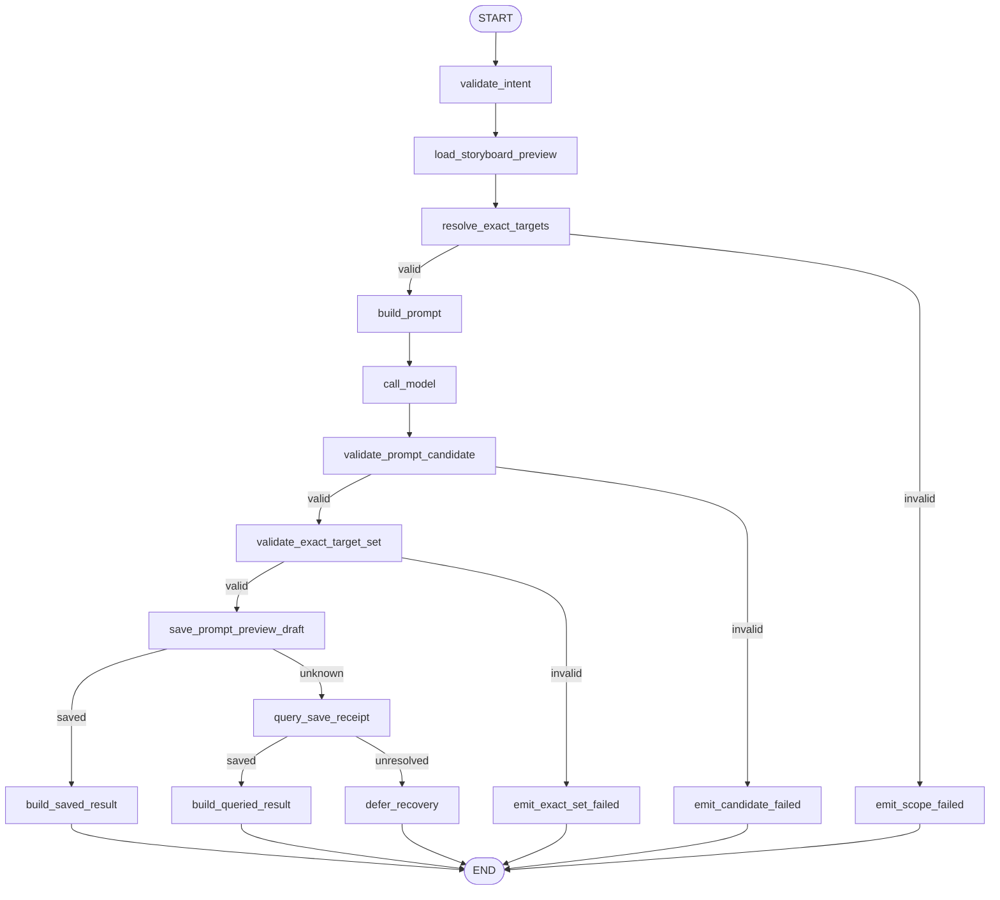
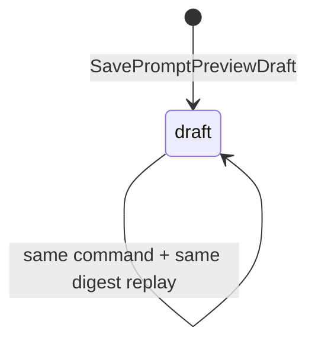
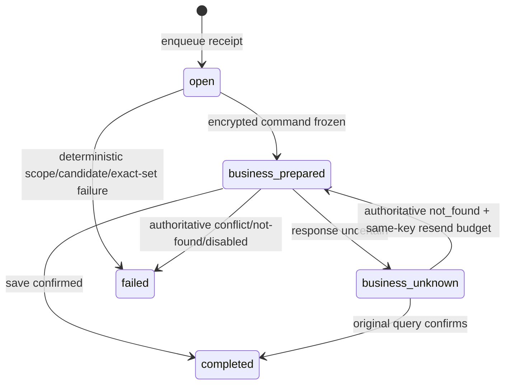

# `write_prompts` Graph Tool 当前实现设计

> 状态：Current Implementation / local Development Preview 范围；完整生产范围仍为 Draft。当前验收结论只见[交付状态](../../../requirements/delivery-status.md)。
>
> 当前 Pin：`write_prompts.v2preview1` / `write_prompts_graph_v2preview1` / `write_prompts.preview.intent.v1`。
>
> 当前代码：`agent/internal/graphtool/writeprompts`、`agent/internal/writepromptsruntime`；当前迁移：`business/migrations/20260717000400_create_prompt_preview_draft.up.sql`、`agent/migrations/20260717001200_add_write_prompts_runtime_v2preview1.up.sql`。

## 1. 功能边界

当前实现只有 `storyboard_preview` 模式：读取同项目、精确版本和摘要匹配的 Business Storyboard Preview Draft，从其中全部 Slot 确定性派生目标 exact-set，经一个 ChatModel Node 生成 Prompt 集，先校验候选协议，再校验目标全集与顺序，最后保存不可变 Business Prompt Preview `draft` 并投影 Result、SSE 和 Workspace Card。

当前不支持 standalone、用户任选 Slot、编辑已有 Prompt、`reviewing/ready/stale/superseded`、批量审核、计费、Approval、Correction、真实 Provider 或生产 Catalog。`plan_storyboard` 不生成最终 Prompt；当前 Tool 只生成 Preview Draft，不代表可直接用于生产媒体 Provider。

## 2. 输入与输出

### 2.1 输入

模型可控 `Intent` exact-set：

| 字段 | 当前约束 |
|---|---|
| `schema_version` | 固定 `write_prompts.preview.intent.v1` |
| `writing_instruction` | 1～1000 字符 |
| `output_language` | 可选 `zh-CN/en-US`；省略时由冻结 Policy 补齐 |

Storyboard 的 `id/version/content_digest`、User/Project/Session/Run/ToolCall/BusinessCommand/Fence、Prompt/Validator/Policy Pin 都来自可信 Runtime，不允许模型或浏览器覆盖。

模型候选固定为 `prompt.preview.candidate.v1`：每项只含 `target_local_key/positive_prompt/negative_constraints`。服务端从 Source Slot 回填 `element_local_key/slot_type/media_kind/purpose/required/output_language`，并要求候选 key 与冻结目标 exact-set 同序完全一致。

### 2.2 输出

- 成功：`completed/PROMPT_PREVIEW_DRAFT_CREATED`，返回 Prompt Preview Ref、Storyboard Preview Ref、`target_count` 和 Invocation Ref。
- 确定失败：`failed`，返回稳定码、安全摘要、不可重试标记和 Invocation Ref。
- Save 结果不确定：内部 `Outcome.Recovery`；不编码成 completed/failed Result。

## 3. 当前 Graph 流程

Graph 是启动期 `AllPredecessor` 无环 DAG，无 per-Slot 并行、循环、ToolsNode、Interrupt 或长期 Checkpoint。

## 4. 稳定 Node / Branch exact-set

Node exact-set（15）：

`validate_intent`, `load_storyboard_preview`, `resolve_exact_targets`, `build_prompt`, `call_model`, `validate_prompt_candidate`, `validate_exact_target_set`, `save_prompt_preview_draft`, `query_save_receipt`, `build_saved_result`, `build_queried_result`, `emit_scope_failed`, `emit_candidate_failed`, `emit_exact_set_failed`, `defer_recovery`。

| Branch Key / 源 Node | 输出 exact-set |
|---|---|
| `route_scope_validation` / `resolve_exact_targets` | `build_prompt`, `emit_scope_failed` |
| `route_candidate_validation` / `validate_prompt_candidate` | `validate_exact_target_set`, `emit_candidate_failed` |
| `route_exact_set_validation` / `validate_exact_target_set` | `save_prompt_preview_draft`, `emit_exact_set_failed` |
| `route_save_outcome` / `save_prompt_preview_draft` | `build_saved_result`, `query_save_receipt` |
| `route_query_outcome` / `query_save_receipt` | `build_queried_result`, `defer_recovery` |

Branch 不计入 Node 数；未知值返回错误并失败关闭。

## 5. 强类型 Graph State 摘要

`State` 只属于一次 Graph 调用：

| 字段组 | 内容与不变量 |
|---|---|
| 身份/输入 | `TrustedContext`, `Intent`, `IntentDigest`, `StoryboardPreviewRef` |
| Business 快照 | `StoryboardContext`；Source 必须为同项目精确 Draft |
| 目标范围 | `ExactTargets`, `ExactTargetSetDigest`, `OutputLanguage`；模型不能增删 |
| 模型 | `PromptMessages`, `PromptDigest`, `ModelMessage`, `Candidate`, `CandidateDigest` |
| 双重校验 | `ValidationReport`, `Content`；Candidate 与 exact-set 都通过才可保存 |
| 命令/结果 | `SaveOutcome`, `Result`, `Error`；Recovery 与终态分离 |

完整 Prompt、候选和 Source 正文只在调用内存/加密回执边界使用，不写普通日志或 Event。

## 6. 业务状态机与迁移表

### 6.1 Business Prompt Preview

`business.prompt_preview_draft` 当前只允许 `status=draft`、`version=1`，冻结上游 Storyboard Ref 和 `exact_target_set_digest`；没有 `reviewing/ready/rejected/stale/superseded`。

### 6.2 Agent 执行

| 聚合 / Owner | 当前迁移 | Guard / 幂等 | 失败处理 |
|---|---|---|---|
| Prompt Preview / Business | 不存在 → `draft` | `command_id` 唯一；Project/Storyboard version/digest + exact-target digest | Draft 与 command receipt 原子写；整次 exact-set 全有或全无 |
| Run / Agent | `created → running → completed/failed`；不确定时 `recovery_pending` | Session HOL + owner fence | 阻塞后续 Input |
| ModelReceipt / Agent | `reserved → completed/failed` | Router/Graph call kind first-write-wins | 重放原响应或安全失败 |
| ToolReceipt / Agent | `open → business_prepared → completed/failed` | Save 前 AEAD 冻结命令；稳定 ToolCall/BusinessCommand | 保存后投影失败不重跑模型 |
| ToolReceipt / Agent | `business_prepared → business_unknown` | Save outcome 可能已提交 | Query 原 key/digest；权威 not_found 才同键有界重发 |

## 7. Owner、幂等与 Unknown Outcome

- Business PostgreSQL 拥有 Storyboard 与 Prompt Preview Draft；Agent 不直写业务表。
- Agent PostgreSQL 拥有 Turn Context、Run、Router/Graph Model Receipt、Tool Receipt、加密命令、Projection 与 Event。
- exact target set 从 Business Storyboard 全部 Slot 确定性派生并摘要；模型少项、多项、重复、乱序或未知 key 均不得保存。
- Save/Query/恢复重发始终复用同一 `business_command_id/request_digest`；同键异义冲突。
- 保存成功而 Agent 崩溃时，从 Business command receipt 和 Agent prepared command 恢复同一 Result/Card，不创建第二个 Prompt Draft。
- 当前 local 模型没有真实 Provider unknown；生产接入前必须补稳定 Provider 请求键和权威对账。

## 8. 安全

- Business BFF 完成 Session/CSRF/Project Owner 校验；Agent 再复核 Storyboard ID/version/digest 与可信 Turn Context。
- Source Storyboard 文本在 Prompt 中是明确的不可信数据；模型无权改变目标范围、Slot type、媒体类型或权限。
- Candidate 禁止 Provider Secret、价格、状态、资源 ID 和自由 metadata；模型 Message 的 ToolCall/reasoning/metadata 被拒绝。
- 命令和 Result 使用内容加密；日志/Event 只保留稳定 ID/version/digest、数量和安全错误码。
- 当前 local-only；正式内容审核、服务身份/TLS、敏感 Prompt 保留与删除策略仍未完成。

## 9. 测试与验收入口

当前测试覆盖 Intent strict schema、Source Storyboard 版本/摘要、Slot→target 映射、目标预算、Candidate 字段、exact-set 多/少/重复/乱序、媒体类型派生、Node/Branch exact-set、Save 创建/重放/Unknown Query、命令恢复、Card/Result 与模型 Message 边界。

关键门禁：

- `GOWORK=off go test ./internal/graphtool/writeprompts`（在 `agent/`）；
- `make write-prompts-runtime-smoke`：独立 canonical local Preview；
- `make trial-basic`：验收统一六工具链中的 Prompt exact-set、Business Draft、Receipt、SSE、Workspace V5、硬刷新与 Agent 重连主路径。

## 10. 生产差距

生产 `write_prompts.v1alpha1` 仍为 Draft，至少缺少：standalone 模式、显式 Slot 范围与编辑/版本 CAS，正式 PromptArtifact/PromptRevision，`reviewing/ready/rejected/stale/superseded` 状态，内容审核与部分批准，计费、执行/审核 Approval 与 Continuation，Correction，真实模型 Provider/Unknown Outcome，生产 Registry/Catalog、安全治理和完整故障/重启恢复证据。
