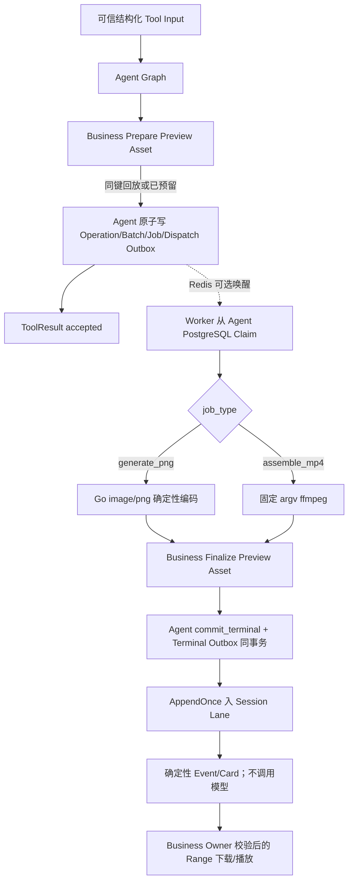
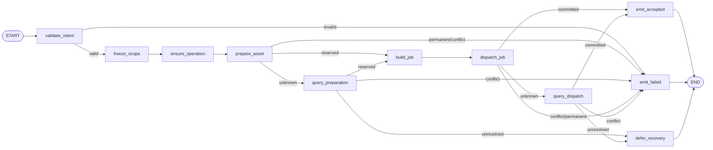
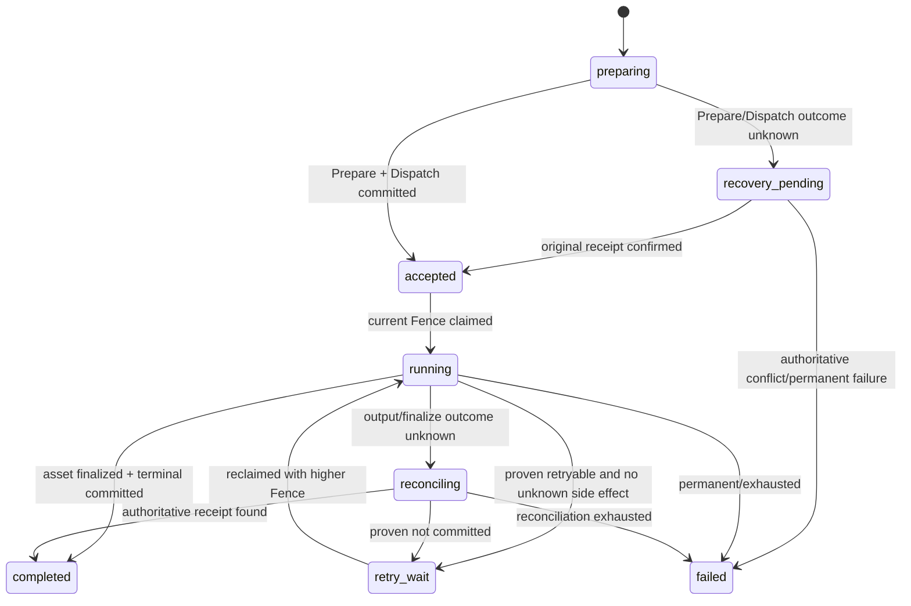

# Media Runtime V3 Development Preview 设计

> 文档状态：**Approved for Development Preview / 不授权生产实现**
>
> Profile：`media.runtime.v3preview1`
>
> Tool Definition：`generate_media.v3preview1`、`assemble_output.v3preview1`
>
> 批准依据：用户已明确要求按功能优先计划快速跑通基本功能。该批准只覆盖本地确定性 PNG、固定参数 MP4、单 Job 异步链和页面下载/播放。
>
> 共享契约：[Media Runtime V3 Preview 跨 Module 契约](../cross-module/media-runtime-v3-preview-contract.md)
>
> 六工具组合与传输：[MVP 六工具媒体扩展 V1](./mvp-six-tools-media-extension-v1-design.md)

本文是在两份完整生产设计继续保持 Draft 的前提下，批准的最小异步纵切。它不是媒体模型、生产渲染、计费、正式 Approval、TOS 或发布能力。

## 1. 目标、非目标与硬边界

本批只跑通：

1. `generate_media` 消费一个可信 `Prompt Preview Draft` 图片目标引用；Worker 使用 Go `image/png` 生成真实可解码、同输入同字节的 `640x360` PNG；
2. `assemble_output` 消费上述 ready PNG；Worker 使用固定白名单 `ffmpeg` argv 生成 `2s`、H.264、`yuv420p`、`faststart` 的 `640x360` MP4；
3. 两个 Tool 复用一套 Agent-owned Operation/Batch/Job/Terminal Outbox、同一 Worker Claim/Lease/Fence 和同一 Business Preview Asset Prepare/Finalize；
4. Worker 终态先写 Terminal Outbox，再以可信 `media_job_preview_terminal` Input 进入既有 Session Lane；页面通过 Business 同源 Range 端点下载或播放。

明确拒绝：真实模型/Provider、Prompt 明文复制、TOS、积分/金额、正式 Approval、退款、公开发布、任意 ffmpeg 参数、Shell、公共静态目录、多 Job/部分成功、取消、复杂 Batch、音频/视频生成、生产 Catalog availability。Preview 中“生成”只表示确定性测试图，不表示模型生成；“装配”只表示本地测试 MP4，不表示生产导出。

## 2. Runtime 与数据 Owner

| 数据 | Owner / 权威来源 | Preview 职责 |
|---|---|---|
| Prompt Preview Draft、Media Preview Asset/Prepare/Finalize Receipt、文件元数据 | Business PostgreSQL + Business 管理的本地对象根 | 校验 Owner/Project/版本；预留、终结、鉴权 Range |
| Session/Input/Run/ToolReceipt、Operation/Batch/Job/Terminal Outbox | Agent PostgreSQL | Graph 派发、Job 权威状态、终态入 Lane |
| WorkerAttempt、Artifact Receipt、ffmpeg Receipt | Worker PostgreSQL | At-Least-Once 执行、核对和恢复 |
| PNG/MP4 文件 | Business 配置的 Preview 本地对象根 | 仅本机共享；数据库保存相对 Object Key、SHA-256、Size、MIME |
| Redis | 非权威 | 可选唤醒；丢失后 PostgreSQL 扫描必须恢复 |

禁止跨 Module import `internal` 包，禁止 Worker 直写 Agent/Business 表。Agent Migration 发布 `agent.media_job.preview.v1` DB 函数/视图；Worker 只获得其 `SELECT/EXECUTE` 权限。

## 3. 端到端流程



Graph 在启动阶段 Compile，均为 `AllPredecessor` 无环 DAG；原 Graph 在 `accepted` 后结束，不等待 Worker，也不通过 Checkpoint 保留跨进程栈。

## 4. 精确 Tool Intent 与 Result

模型可填写字段仍与可信上下文分离。本 Profile 的入口由 Workspace 结构化表单/BFF 创建，不接收 Prompt 文本、路径或 ffmpeg 参数。

### 4.1 `GenerateMediaPreviewIntentV1`

| 字段 | 类型 | 约束 |
|---|---|---|
| `schema_version` | string | 固定 `generate_media.intent.v3preview1` |
| `prompt_preview_id` | UUIDv7 | 必填；Business-owned Draft |
| `expected_prompt_version` | int64 | 固定 `1` |
| `expected_prompt_content_digest` | lowercase SHA-256 | 64 hex |
| `target_local_key` | string | 1～128；必须是 Draft 中唯一 `media_kind=image` 目标 |
| `output_profile` | string | 固定 `png_640x360.v1` |

### 4.2 `AssembleOutputPreviewIntentV1`

| 字段 | 类型 | 约束 |
|---|---|---|
| `schema_version` | string | 固定 `assemble_output.intent.v3preview1` |
| `source_asset_id` | UUIDv7 | 必填；同 User/Project 的 ready PNG |
| `expected_source_version` | int64 | 固定 `1` |
| `expected_source_content_digest` | lowercase SHA-256 | 64 hex |
| `output_profile` | string | 固定 `mp4_h264_640x360_2s.v1` |

可信上下文固定注入 `user_id/project_id/session_id/input_id/turn_id/run_id/tool_call_id/idempotency_key/deadline_at`。Intent 出现这些字段、Prompt 明文、文件路径、URL、命令、codec/filter/bitrate/fps/duration 等未知字段时严格拒绝。

两个 Tool 的初次成功结果均为 `GraphToolResultV1{status=accepted}`，只返回 `operation_id/batch_id/asset_id/receipt_id`；不得返回 Job Payload、Object Key 或本地路径。终态 Lane Input 冻结为 `completed` 或 `failed` Card，成功 Card 只返回 Asset Ref 和同源下载 URL。

## 5. Typed Graph State 与 Node

### 5.1 `GenerateMediaPreviewStateV1`

| 字段 | Owner/写节点 | 不变量 |
|---|---|---|
| `trusted_context` | Runtime 初始化 | 不可被 Intent 覆盖 |
| `intent` | `validate_intent` | 严格 DTO，未知字段拒绝 |
| `scope_digest` | `freeze_scope` | 含 Tool Pin、Prompt Ref、目标和固定输出 Profile；不含 Prompt 正文 |
| `operation` | `ensure_operation` | 同 `tool_call_id + scope_digest` 复用 |
| `preparation` | `prepare_asset/query_preparation` | Business 权威 Asset/Source 摘要与相对 Object Key |
| `job_spec` | `build_job` | 单 Batch、单 Job、`generate_png` |
| `dispatch_receipt` | `dispatch_job/query_dispatch` | Operation/Batch/Job/Outbox 同事务 |
| `result/error` | Result Node | 唯一冻结终态 |



| Node Key | 分类 / Eino | 单一职责 | 副作用、回执与失败 |
|---|---|---|---|
| `validate_intent` | guard / Lambda | 严格校验 Prompt Ref、目标与固定 Profile | 无副作用；`INVALID_ARGUMENT` |
| `freeze_scope` | transform / Lambda | 规范编码并生成 SHA-256 | 不读取 Prompt 正文 |
| `ensure_operation` | command / Lambda | first-write-wins 创建/恢复 `preparing` Operation | Agent Operation Receipt |
| `prepare_asset` | command / Lambda RPC | Business 校验 Prompt Draft exact ref、目标类型并预留 PNG Asset | Unknown 只能进查询 |
| `query_preparation` | query / Lambda RPC | 按原 command/request digest 核对 | 禁止换键 Prepare |
| `build_job` | transform / Lambda | 构建单个 `generate_png` Envelope | 只含目标摘要，不含 Prompt |
| `dispatch_job` | dispatch / Lambda | 原子写 Batch/Job/Dispatch Outbox并置 `accepted` | 事务回滚不返回 accepted |
| `query_dispatch` | query / Lambda | 查询原 Operation 派发回执 | 禁止创建第二 Job |
| `defer_recovery` | recovery / Lambda | 保持 Input/Run/Operation 为 `recovery_pending` 并阻塞 HOL，等待 Scanner 用原键核对 | 不冻结失败 ToolResult，不允许用户换键重试 |
| `emit_accepted/emit_failed` | result / Lambda | 冻结 ToolReceipt/Event | 不等待 Worker |

### 5.2 `AssembleOutputPreviewStateV1`

字段与上述 State 共用 `trusted_context/intent/scope_digest/operation/preparation/job_spec/dispatch_receipt/result/error`；`source_asset` 由 Business Prepare 返回的 ready PNG exact ref 和只读相对 Object Key组成。`job_type=assemble_mp4`，其余 Node Key 和拓扑完全复用，仅 `validate_intent` 校验 Asset Ref、`prepare_asset` 校验 PNG，`build_job` 冻结固定 MP4 Profile。没有 ChatModel、Prompt Node、ToolsNode、Branch、循环、并行或 HITL。

## 6. 共享 Operation/Batch/Job 状态机

Preview 固定 **1 Operation = 1 Batch = 1 Job**；不实现部分成功、动态拆批或 Barrier 聚合。



Operation 只投影 `preparing/recovery_pending/accepted/running/completed/failed`，Batch 只投影 `accepted/running/completed/failed`；Job 使用 `pending/running/retry_wait/reconciling/succeeded/dead`。`completed/failed/succeeded/dead` 为终态。状态更新都带旧状态；Worker 更新还必须匹配 `job_id + attempt_id + lease_owner + fence`。

稳定幂等键：Operation=`tool_call_id + scope_digest`；Prepare=`operation_id + scope_digest`；Job=`operation_id + job_type + scope_digest`；Claim=`job_id + claim_request_id`；产物=`job_id + fence + artifact_request_digest`；Finalize=`job_id + fence + output_digest`；Terminal=`job_id + fence + terminal_status + result_digest`；Lane Source=`terminal_event_id`。

## 7. Worker 确定性执行

### 7.1 PNG

- 仅使用 Go 标准库 `image`、`image/color`、`image/png`；尺寸固定 `640x360`，RGBA 像素由 `SHA-256(scope_digest + target_digest + generator_version)` 确定性派生；`target_digest` 由 Business 对选中 Prompt Entry 规范编码后计算，Agent/Worker 不接收正文；禁止随机数、时间、字体、网络和模型；
- PNG Encoder 选项和遍历顺序固定；同一 `generator_version` 的相同 Envelope 必须 byte-for-byte 相同；
- 写入 `*.part` 后 `Sync`、关闭、重新 `png.DecodeConfig/png.Decode`，验证尺寸，再计算 SHA-256/Size；失败不得 Finalize ready。

### 7.2 MP4

Worker 先重新解码 source PNG，再以 `exec.CommandContext` 直接执行下列固定 argv；禁止 Shell，除两个由 Worker 安全解析的绝对路径外不接受任何用户/Agent/DB 参数：

```text
ffmpeg -nostdin -hide_banner -loglevel error -y
  -loop 1 -framerate 30 -i <safe_source_png>
  -t 2.000 -vf scale=640:360:force_original_aspect_ratio=decrease,pad=640:360:(ow-iw)/2:(oh-ih)/2:color=black
  -r 30 -an -c:v libx264 -pix_fmt yuv420p -movflags +faststart
  <safe_output_part_mp4>
```

argv 在代码中按固定字符串切片构造，不能从配置、Intent 或 Manifest 增删。启动 Readiness 必须确认配置的 ffmpeg 是绝对路径、普通可执行文件且支持 `libx264`；子进程继承最小环境、受 Context Deadline、stderr 字节上限和单 Job 并发上限约束。成功后以固定 `ffprobe` 只读探针或等价测试确认 `codec_name=h264`、`pix_fmt=yuv420p`、`640x360`、时长容差 `2.0±0.1s`，并确认 `moov` 位于 `mdat` 前；不满足即失败。

## 8. Terminal Outbox 进入 Session Lane

`commit_terminal` 在一个 Agent PostgreSQL 事务内校验当前 Fence，更新 Job、Batch、Operation，并 AppendOnce 写 `media_preview_terminal_outbox`。Agent Terminal Bridge：

1. 扫描未投递 Outbox，按 `session_id, created_at, event_id` 稳定排序；
2. 在同一 Agent DB 事务以 `source_type=media_job_preview_terminal`、`source_id=event_id` AppendOnce 入 `session_input`，然后标记 Outbox delivered；
3. 提交后可发布 Redis wake；Redis 失败不回滚；
4. Lane 继续遵守全局 HOL/Lease/Fence，不能越过前序输入；
5. Terminal Processor 只读取冻结 Result DTO，确定性写 ToolReceipt/Event/Card，不恢复原 Graph、不调用模型、不展开 Job 列表。

Outbox→Input 或 Input→Event 响应丢失都按 Event ID/Source ID 查询，禁止产生第二个终态事件。

## 9. 安全、Unknown Outcome 与恢复

- Profile 仅允许 `environment=local`，Business/Agent/Worker 三端显式同开；所有内部 HTTP/RPC、Agent PostgreSQL Preview Consumer 地址必须是 loopback；任一条件不满足启动失败；
- 本地对象根必须是绝对目录、非符号链接、权限不宽于 `0700`。数据库/DTO 只保存由 Business 生成的相对 key；拒绝空值、绝对路径、`..`、反斜杠、NUL、符号链接和非普通文件。每次打开后以 `filepath.Rel`/等价能力复核仍在根内；
- 文件先写 staging，Finalize 校验当前 preparation、Job/Fence、regular file、magic/MIME、Size、SHA-256 后原子 rename；失败/旧 Fence 不能覆盖 ready Asset；
- 浏览器端点按已认证 User/Project/Asset 校验后显式打开单文件并处理单 Range；禁止 `http.FileServer`、目录索引、路径参数或公开静态根；
- Job/Outbox/日志/Event 不保存 Prompt 正文、negative constraints、签名 URL、完整路径、stderr 原文或任何 Secret；仅保存资源 ref、版本、摘要、受控错误码；
- PNG 写入、ffmpeg、Finalize 或 terminal commit 发生响应丢失时进入 `reconciling`，先查询 Worker Artifact Receipt、Business Finalization Receipt、Agent Job Contract；只有权威证明副作用未提交时才能以原键重试。不得把 unknown 当普通 `retry_wait`。

## 10. 测试、验收与回滚

必须有：

- Graph Compile、Node/Edge exact-set、严格 Intent、Prompt/路径/ffmpeg 注入拒绝；
- Agent Migration 空库/升级、中文 COMMENT、无物理外键、Operation/Batch/Job/Outbox 原子性；
- 多 Worker Claim 不重复、Heartbeat、claimable View 只暴露到期待领或已过期 Lease、Lease 接管、高 Fence 成功/旧 Fence 拒绝、Redis 缺失扫描恢复；
- Prepare/Finalize first-write-wins，同键异义冲突，响应丢失查询收敛；
- PNG byte-for-byte 确定性、真实 decode、尺寸/MIME/SHA；MP4 使用真实 ffmpeg/ffprobe 验证 H.264/yuv420p/2s/faststart；
- Range `200/206/416`、Owner 隔离、未 ready/越权 `404`、无目录穿越/符号链接；
- Terminal Outbox 重投只产生一个 Lane Input/一个终态 Event；硬刷新、Agent/Worker 重启恢复同一 Asset；
- 一条 canonical 命令从 Prompt Draft→accepted→PNG ready→accepted→MP4 ready→浏览器播放/Range，并断言零计费、零 Approval、零 TOS、无 Prompt 明文泄漏。

回滚顺序：关闭三端 Preview 开关并停止新 Claim → Drain 当前 Attempt → 保留终态/Receipt 供页面读取 → 回滚 Runtime/前端 → 仅在确认无旧消费者后使用对应 Down Migration 删除 Preview 表/函数/视图。不得修改已发布 Migration，不自动删除用户可见 Preview Asset；清理由显式本地测试清理命令按 test DB 和受控 root 执行。

## 11. 评审结论

**Approved for Development Preview。** 可开始实现上述 exact-set。两份 Graph Tool 的完整生产设计仍为 Draft；本批准不允许把静态生产 Catalog 改为 available，也不关闭生产 Provider、TOS、计费、Approval、取消、复杂 Batch、安全与运维门禁。
